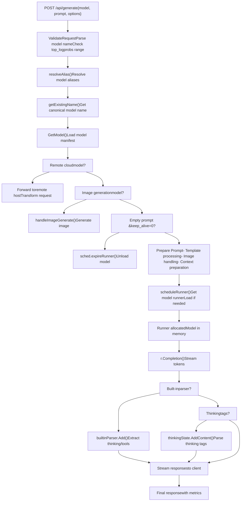
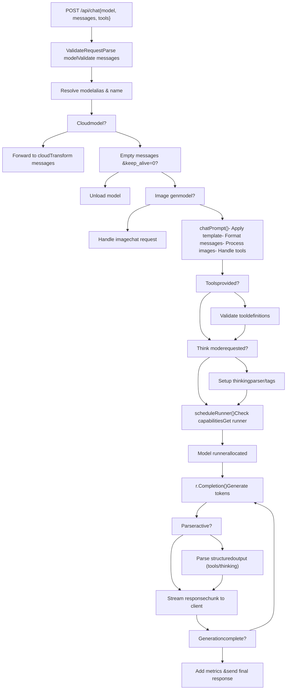
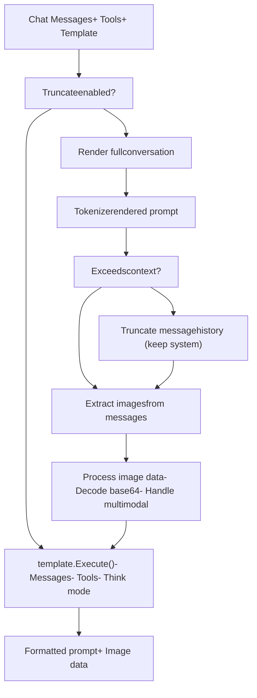
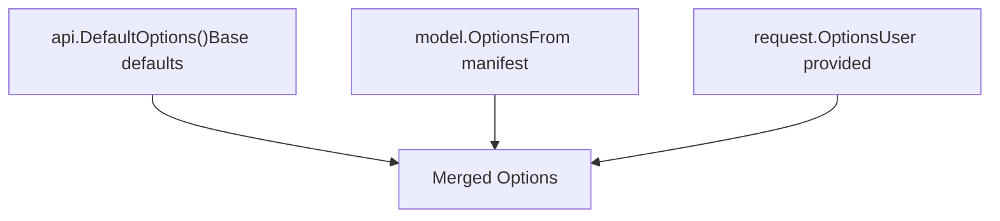
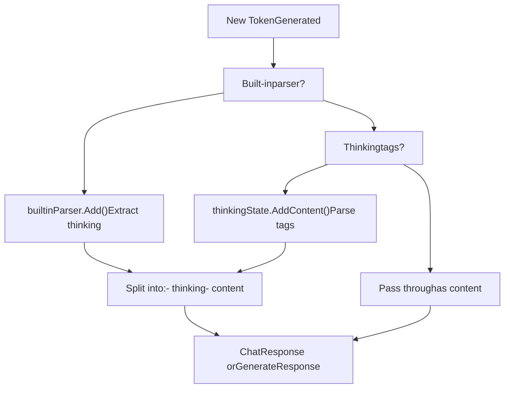
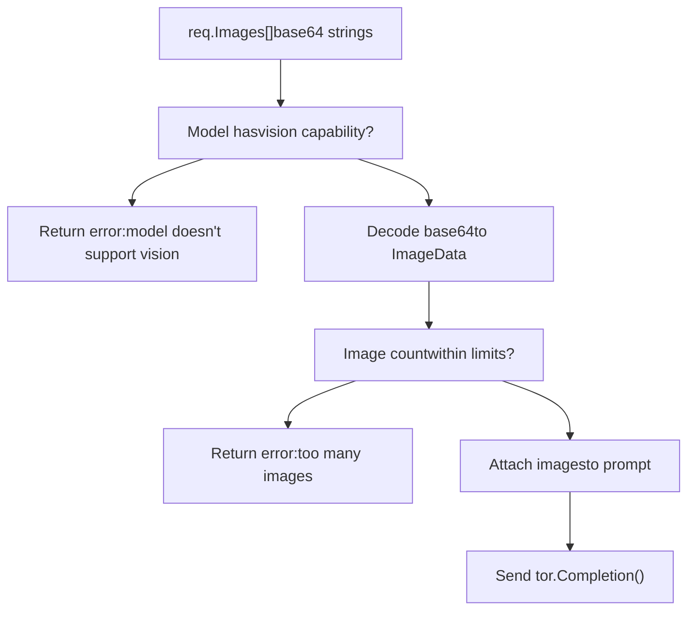
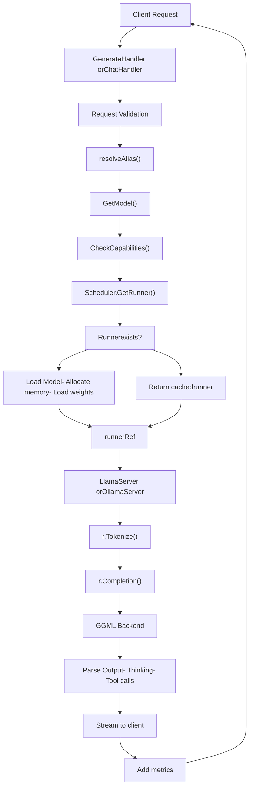
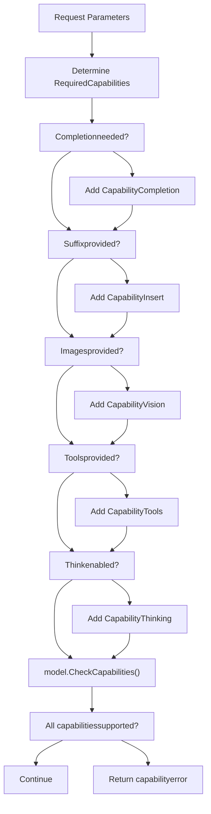

# Generation and Chat API

Relevant source files

-   [README.md](https://github.com/ollama/ollama/blob/562c76d7/README.md?plain=1)
-   [api/client.go](https://github.com/ollama/ollama/blob/562c76d7/api/client.go)
-   [api/client\_test.go](https://github.com/ollama/ollama/blob/562c76d7/api/client_test.go)
-   [api/types.go](https://github.com/ollama/ollama/blob/562c76d7/api/types.go)
-   [cmd/cmd.go](https://github.com/ollama/ollama/blob/562c76d7/cmd/cmd.go)
-   [docs/README.md](https://github.com/ollama/ollama/blob/562c76d7/docs/README.md?plain=1)
-   [docs/api.md](https://github.com/ollama/ollama/blob/562c76d7/docs/api.md?plain=1)
-   [docs/development.md](https://github.com/ollama/ollama/blob/562c76d7/docs/development.md?plain=1)
-   [docs/images/ollama-keys.png](https://github.com/ollama/ollama/blob/562c76d7/docs/images/ollama-keys.png)
-   [docs/images/signup.png](https://github.com/ollama/ollama/blob/562c76d7/docs/images/signup.png)
-   [server/images.go](https://github.com/ollama/ollama/blob/562c76d7/server/images.go)
-   [server/routes.go](https://github.com/ollama/ollama/blob/562c76d7/server/routes.go)

This page documents the core inference endpoints `/api/generate` and `/api/chat` that power text generation in Ollama. These endpoints handle prompt completion and conversational interactions with loaded models.

For model lifecycle operations (pull, push, create, delete), see [Model Management API](/ollama/ollama/3.1-model-management-api). For embedding generation, see [Embedding API](/ollama/ollama/3.3-embedding-api). For OpenAI-compatible endpoints, see [OpenAI Compatibility Layer](/ollama/ollama/3.4-openai-compatibility-layer).

## Overview

Ollama provides two primary endpoints for text generation:

-   **`/api/generate`** - Single-turn completion for a given prompt
-   **`/api/chat`** - Multi-turn conversational interface with message history

Both endpoints support streaming responses, multimodal inputs (images), structured output formats, tool calling, and thinking/reasoning capabilities. The server routes these requests through the scheduler to allocate model runners and generate responses token-by-token.

**API Endpoints**

| Endpoint | Method | Purpose | Stream Support |
| --- | --- | --- | --- |
| `/api/generate` | POST | Generate completion for a prompt | Yes (default) |
| `/api/chat` | POST | Chat with message history | Yes (default) |

Sources: [server/routes.go183-658](https://github.com/ollama/ollama/blob/562c76d7/server/routes.go#L183-L658) [docs/api.md35-718](https://github.com/ollama/ollama/blob/562c76d7/docs/api.md?plain=1#L35-L718)

## Generate Endpoint

### Request Format

The `/api/generate` endpoint accepts a `GenerateRequest` with the following structure:

**Required Fields:**

-   `model` (string) - Model name to use for generation
-   `prompt` (string) - Text prompt to complete

**Optional Fields:**

-   `suffix` (string) - Text after the insertion point (for infilling models)
-   `system` (string) - System message override
-   `template` (string) - Prompt template override
-   `images` (\[\]ImageData) - Base64-encoded images for multimodal models
-   `format` (json.RawMessage) - Output format constraint ("json" or JSON schema)
-   `options` (map\[string\]any) - Model-specific options (temperature, top\_p, etc.)
-   `stream` (\*bool) - Enable/disable streaming (default: true)
-   `raw` (bool) - Skip template formatting
-   `keep_alive` (\*Duration) - Model load duration after request
-   `think` (\*ThinkValue) - Enable thinking for reasoning models (bool or "high"/"medium"/"low")
-   `truncate` (\*bool) - Truncate prompt if exceeds context length
-   `shift` (\*bool) - Shift context window when full
-   `logprobs` (bool) - Return token log probabilities
-   `top_logprobs` (int) - Number of top alternatives (0-20)

Sources: [api/types.go62-144](https://github.com/ollama/ollama/blob/562c76d7/api/types.go#L62-L144) [server/routes.go183-192](https://github.com/ollama/ollama/blob/562c76d7/server/routes.go#L183-L192)

### Response Format

**Streaming Response** (multiple JSON objects):

```
{  "model": "llama3.2",  "created_at": "2023-08-04T08:52:19.385406455-07:00",  "response": "The",  "done": false}
```
**Final Response** (when `done: true`):

```
{  "model": "llama3.2",  "created_at": "2023-08-04T19:22:45.499127Z",  "response": "",  "done": true,  "done_reason": "stop",  "context": [1, 2, 3],  "total_duration": 10706818083,  "load_duration": 6338219291,  "prompt_eval_count": 26,  "prompt_eval_duration": 130079000,  "eval_count": 259,  "eval_duration": 4232710000,  "thinking": "...",  "tool_calls": [...]}
```
**Response Fields:**

| Field | Type | Description |
| --- | --- | --- |
| `model` | string | Model that generated response |
| `remote_model` | string | Upstream model name (cloud models) |
| `remote_host` | string | Upstream host URL (cloud models) |
| `created_at` | time.Time | Response timestamp |
| `response` | string | Generated text chunk |
| `thinking` | string | Reasoning text (thinking models) |
| `done` | bool | Whether generation is complete |
| `done_reason` | string | Reason for completion ("stop", "length", "unload", "load") |
| `context` | \[\]int | Token context for continuation |
| `tool_calls` | \[\]ToolCall | Function calls (if tools enabled) |
| `logprobs` | \[\]Logprob | Token log probabilities |
| `total_duration` | int64 | Total time in nanoseconds |
| `load_duration` | int64 | Model load time |
| `prompt_eval_count` | int | Prompt tokens evaluated |
| `prompt_eval_duration` | int64 | Prompt evaluation time |
| `eval_count` | int | Response tokens generated |
| `eval_duration` | int64 | Response generation time |

Sources: [api/types.go579-626](https://github.com/ollama/ollama/blob/562c76d7/api/types.go#L579-L626) [server/routes.go545-604](https://github.com/ollama/ollama/blob/562c76d7/server/routes.go#L545-L604)

### Generate Handler Flow


**Key Decision Points:**

1.  **Cloud Model Check** [server/routes.go240-333](https://github.com/ollama/ollama/blob/562c76d7/server/routes.go#L240-L333): If model has `RemoteHost` and `RemoteModel` configured, request is forwarded to cloud provider
2.  **Image Generation** [server/routes.go350-353](https://github.com/ollama/ollama/blob/562c76d7/server/routes.go#L350-L353): Models with `CapabilityImage` are routed to image generation pipeline
3.  **Model Unload** [server/routes.go336-347](https://github.com/ollama/ollama/blob/562c76d7/server/routes.go#L336-L347): Empty prompt with `keep_alive=0` unloads model from memory
4.  **Parser Selection** [server/routes.go360-371](https://github.com/ollama/ollama/blob/562c76d7/server/routes.go#L360-L371): Built-in parsers (harmony, etc.) handle special output formats
5.  **Thinking Extraction** [server/routes.go516-528](https://github.com/ollama/ollama/blob/562c76d7/server/routes.go#L516-L528): Thinking tags are inferred and extracted when `think` parameter is enabled

Sources: [server/routes.go183-658](https://github.com/ollama/ollama/blob/562c76d7/server/routes.go#L183-L658) [server/routes.go133-170](https://github.com/ollama/ollama/blob/562c76d7/server/routes.go#L133-L170)

## Chat Endpoint

### Request Format

The `/api/chat` endpoint accepts a `ChatRequest` for multi-turn conversations:

**Required Fields:**

-   `model` (string) - Model name
-   `messages` (\[\]Message) - Conversation history

**Message Format:**

```
{  "role": "user|assistant|system|tool",  "content": "Message text",  "images": ["base64..."],  "tool_calls": [...],  "tool_name": "function_name",  "tool_call_id": "call_id"}
```
**Optional Fields:**

-   `tools` (\[\]Tool) - Available functions for the model to call
-   `format` (json.RawMessage) - Output format constraint
-   `options` (map\[string\]any) - Model parameters
-   `stream` (\*bool) - Streaming mode
-   `keep_alive` (\*Duration) - Model persistence
-   `think` (\*ThinkValue) - Thinking mode
-   `truncate` (\*bool) - Truncate on context overflow
-   `shift` (\*bool) - Shift context window
-   `logprobs` (bool) - Return log probabilities
-   `top_logprobs` (int) - Top alternatives count

Sources: [api/types.go146-194](https://github.com/ollama/ollama/blob/562c76d7/api/types.go#L146-L194) [server/routes.go660-1053](https://github.com/ollama/ollama/blob/562c76d7/server/routes.go#L660-L1053)

### Response Format

**ChatResponse Structure:**

```
{  "model": "llama3.2",  "created_at": "2024-01-01T00:00:00Z",  "message": {    "role": "assistant",    "content": "Response text",    "thinking": "Reasoning process...",    "tool_calls": [      {        "id": "call_abc123",        "function": {          "name": "get_weather",          "arguments": {"location": "San Francisco"}        }      }    ]  },  "done": true,  "done_reason": "stop"}
```
The response structure is similar to `GenerateResponse` but wraps the generated content in a `Message` object with role information.

Sources: [api/types.go533-562](https://github.com/ollama/ollama/blob/562c76d7/api/types.go#L533-L562) [server/routes.go893-968](https://github.com/ollama/ollama/blob/562c76d7/server/routes.go#L893-L968)

### Chat Handler Flow


Sources: [server/routes.go660-1053](https://github.com/ollama/ollama/blob/562c76d7/server/routes.go#L660-L1053)

### Chat Prompt Processing

The `chatPrompt` function transforms the chat message history into a formatted prompt for the model:


**Truncation Logic:**

When `truncate: true` is set and the rendered prompt exceeds the context length:

1.  Render the full conversation to estimate token count
2.  If over limit, iteratively remove messages from the middle of history
3.  Always preserve: system message, latest user message
4.  Continue until prompt fits or reaches minimum viable conversation

Sources: [server/routes.go1055-1264](https://github.com/ollama/ollama/blob/562c76d7/server/routes.go#L1055-L1264)

## Common Features

### Streaming Responses

Both endpoints support streaming by default. Streaming can be disabled by setting `"stream": false`.

**Streaming Flow:**

> **[Mermaid sequence]**
> *(图表结构无法解析)*

**Non-Streaming Mode:**

When `stream: false`, the handler accumulates all chunks and returns a single response:

```
// Accumulate streaming chunksfor chunk := range ch {    sbContent.WriteString(chunk.Response)    sbThinking.WriteString(chunk.Thinking)    // Accumulate logprobs, tool calls, etc.} // Return complete responsereturn CompleteResponse{    Response: sbContent.String(),    Thinking: sbThinking.String(),    Done: true}
```
Sources: [server/routes.go615-655](https://github.com/ollama/ollama/blob/562c76d7/server/routes.go#L615-L655) [server/routes.go969-1017](https://github.com/ollama/ollama/blob/562c76d7/server/routes.go#L969-L1017) [api/client.go273-282](https://github.com/ollama/ollama/blob/562c76d7/api/client.go#L273-L282)

### Model Options

The `options` field accepts model-specific parameters:

**Common Options:**

| Option | Type | Description | Default |
| --- | --- | --- | --- |
| `temperature` | float | Randomness (0.0-2.0) | 0.8 |
| `top_k` | int | Top-K sampling | 40 |
| `top_p` | float | Nucleus sampling | 0.9 |
| `num_ctx` | int | Context window size | 2048 |
| `num_predict` | int | Max tokens to generate | \-1 (unlimited) |
| `repeat_penalty` | float | Repetition penalty | 1.1 |
| `seed` | int | Random seed | \-1 (random) |
| `stop` | \[\]string | Stop sequences | \[\] |

**Options Processing:**


Options are merged with precedence: Request > Model > Default

Sources: [server/routes.go116-131](https://github.com/ollama/ollama/blob/562c76d7/server/routes.go#L116-L131) [api/types.go627-723](https://github.com/ollama/ollama/blob/562c76d7/api/types.go#L627-L723)

### Thinking Support

Ollama supports reasoning models that produce "thinking" text before generating the final response.

**Thinking Detection:**

Models with thinking capability are detected via:

1.  Explicit `CapabilityThinking` in model config
2.  Built-in parser with thinking support (`harmony`, etc.)
3.  Thinking tags inferred from template (`<thinking>`, `<think>`, etc.)

**Thinking Modes:**

| Think Value | Description |
| --- | --- |
| `true` or `"true"` | Enable thinking with default depth |
| `false` | Explicitly disable thinking |
| `"high"` | Maximum reasoning depth |
| `"medium"` | Moderate reasoning |
| `"low"` | Minimal reasoning |
| `nil` (not set) | Use model default |

**Thinking Extraction Flow:**


**Example Response with Thinking:**

```
{  "model": "deepseek-r1",  "message": {    "role": "assistant",    "content": "The answer is 42.",    "thinking": "Let me work through this step by step..."  },  "done": false}
```
Sources: [server/routes.go360-390](https://github.com/ollama/ollama/blob/562c76d7/server/routes.go#L360-L390) [server/routes.go516-528](https://github.com/ollama/ollama/blob/562c76d7/server/routes.go#L516-L528) [thinking/thinking.go](https://github.com/ollama/ollama/blob/562c76d7/thinking/thinking.go) [model/parsers/](https://github.com/ollama/ollama/blob/562c76d7/model/parsers/)

### Multimodal Support

Models with vision capability accept images encoded as base64 strings.

**Image Processing:**


**Model-Specific Limits:**

-   `mllama` models: Maximum 1 image per request
-   Most vision models: Multiple images supported

Sources: [server/routes.go412-421](https://github.com/ollama/ollama/blob/562c76d7/server/routes.go#L412-L421) [server/routes.go1141-1163](https://github.com/ollama/ollama/blob/562c76d7/server/routes.go#L1141-L1163)

### Structured Output

Both endpoints support constraining output to JSON format.

**JSON Mode (`format: "json"`):**

Forces output to be valid JSON. Model must be instructed in the prompt to output JSON.

```
{  "format": "json"}
```
**JSON Schema Mode:**

Constrains output to match a specific schema:

```
{  "format": {    "type": "object",    "properties": {      "name": {"type": "string"},      "age": {"type": "integer"}    },    "required": ["name", "age"]  }}
```
The schema is passed to the model through the completion options and enforced during generation.

Sources: [docs/api.md71-284](https://github.com/ollama/ollama/blob/562c76d7/docs/api.md?plain=1#L71-L284) [server/routes.go538](https://github.com/ollama/ollama/blob/562c76d7/server/routes.go#L538-L538)

### Tool Calling

The chat endpoint supports function calling through the `tools` parameter.

**Tool Definition Format:**

```
{  "tools": [    {      "type": "function",      "function": {        "name": "get_weather",        "description": "Get current weather",        "parameters": {          "type": "object",          "properties": {            "location": {              "type": "string",              "description": "City name"            }          },          "required": ["location"]        }      }    }  ]}
```
**Tool Call Response:**

When a model wants to call a function, it returns:

```
{  "message": {    "role": "assistant",    "content": "",    "tool_calls": [      {        "id": "call_123",        "function": {          "name": "get_weather",          "arguments": {            "location": "San Francisco"          }        }      }    ]  }}
```
**Tool Result Message:**

The client sends back the function result:

```
{  "role": "tool",  "content": "{\"temp\": 72, \"condition\": \"sunny\"}",  "tool_call_id": "call_123"}
```
Sources: [api/types.go196-508](https://github.com/ollama/ollama/blob/562c76d7/api/types.go#L196-L508) [server/routes.go790-836](https://github.com/ollama/ollama/blob/562c76d7/server/routes.go#L790-L836) [tools/tools.go](https://github.com/ollama/ollama/blob/562c76d7/tools/tools.go)

## Request Processing Architecture

### End-to-End Flow


Sources: [server/routes.go183-658](https://github.com/ollama/ollama/blob/562c76d7/server/routes.go#L183-L658) [server/routes.go660-1053](https://github.com/ollama/ollama/blob/562c76d7/server/routes.go#L660-L1053) [server/sched.go](https://github.com/ollama/ollama/blob/562c76d7/server/sched.go)

### Capability Checking

Before scheduling a runner, the handler verifies the model supports required capabilities:


**Capability Errors:**

Models that don't support required capabilities return specific error messages:

-   `"model does not support completion"` - Model is embedding-only
-   `"model does not support insert"` - No infilling capability
-   `"model does not support vision"` - No image processing
-   `"model does not support tools"` - No function calling
-   `"model does not support thinking"` - No reasoning support

Sources: [server/routes.go373-398](https://github.com/ollama/ollama/blob/562c76d7/server/routes.go#L373-L398) [server/routes.go714-779](https://github.com/ollama/ollama/blob/562c76d7/server/routes.go#L714-L779) [server/images.go147-189](https://github.com/ollama/ollama/blob/562c76d7/server/images.go#L147-L189)

## Error Handling

### Error Types

**StatusError:** HTTP errors with status codes and messages.

```
{  "error": "model 'invalid' not found",  "status": 404}
```
**AuthorizationError:** Authentication failures for cloud models.

```
{  "error": "unauthorized",  "signin_url": "https://ollama.com/connect?...",  "status": 401}
```
Sources: [api/types.go22-54](https://github.com/ollama/ollama/blob/562c76d7/api/types.go#L22-L54)

### Common Error Scenarios

| Error | Status | Cause |
| --- | --- | --- |
| "missing request body" | 400 | Empty POST body |
| "model is required" | 400 | Missing model field |
| "model 'X' not found" | 404 | Model not pulled/created |
| "model does not support Y" | 400 | Capability mismatch |
| "top\_logprobs must be between 0 and 20" | 400 | Invalid parameter |
| "this model only supports one image" | 400 | Too many images (mllama) |
| "unauthorized" | 401 | Cloud model auth failure |
| "remote model is unavailable" | 403 | Cloud disabled |

Sources: [server/routes.go186-232](https://github.com/ollama/ollama/blob/562c76d7/server/routes.go#L186-L232) [server/routes.go392-397](https://github.com/ollama/ollama/blob/562c76d7/server/routes.go#L392-L397) [server/routes.go668-710](https://github.com/ollama/ollama/blob/562c76d7/server/routes.go#L668-L710)

### Error Response Format

Errors are returned as JSON:

```
{  "error": "detailed error message"}
```
For streaming endpoints, errors may appear mid-stream:

```
{"error": "context length exceeded"}
```
The client must check for `error` field in each streaming chunk.

Sources: [server/routes.go606-612](https://github.com/ollama/ollama/blob/562c76d7/server/routes.go#L606-L612) [api/client.go222-256](https://github.com/ollama/ollama/blob/562c76d7/api/client.go#L222-L256)

## Performance Metrics

Both endpoints return performance metrics in the final response:

**Timing Metrics:**

| Metric | Description | Unit |
| --- | --- | --- |
| `total_duration` | End-to-end request time | nanoseconds |
| `load_duration` | Model loading time | nanoseconds |
| `prompt_eval_duration` | Prompt processing time | nanoseconds |
| `eval_duration` | Token generation time | nanoseconds |

**Count Metrics:**

| Metric | Description |
| --- | --- |
| `prompt_eval_count` | Number of prompt tokens |
| `eval_count` | Number of generated tokens |

**Derived Metrics:**

-   **Tokens per second:** `eval_count / (eval_duration / 1e9)`
-   **Prompt tokens per second:** `prompt_eval_count / (prompt_eval_duration / 1e9)`

Sources: [api/types.go570-577](https://github.com/ollama/ollama/blob/562c76d7/api/types.go#L570-L577) [server/routes.go582-583](https://github.com/ollama/ollama/blob/562c76d7/server/routes.go#L582-L583)

## Integration with Other Systems

### Scheduler Integration

Both handlers interact with the scheduler to obtain model runners:

```
r, m, opts, err := s.scheduleRunner(    ctx,    modelName,    requiredCapabilities,    requestOptions,    keepAlive)
```
The scheduler handles:

-   Runner allocation and lifecycle (see [Request Scheduling and Runner Management](/ollama/ollama/2.2-request-scheduling-and-runner-management))
-   Model loading and memory management
-   Keep-alive timer management
-   Reference counting for concurrent requests

Sources: [server/routes.go133-170](https://github.com/ollama/ollama/blob/562c76d7/server/routes.go#L133-L170) [server/sched.go](https://github.com/ollama/ollama/blob/562c76d7/server/sched.go)

### Runner Interface

The handlers interact with runners through the `LlamaServer` interface:

**Key Methods:**

-   `Tokenize(ctx, text)` - Convert text to tokens
-   `Detokenize(ctx, tokens)` - Convert tokens to text
-   `Completion(ctx, request, callback)` - Generate tokens
-   `Embedding(ctx, text)` - Generate embeddings (for `/api/embed`)

Sources: [llm/server.go](https://github.com/ollama/ollama/blob/562c76d7/llm/server.go)

### Template System

Prompts are formatted using the template system (see [Template System](/ollama/ollama/7.1-template-system)):

```
tmpl := model.Templateif requestTemplate != "" {    tmpl, _ = template.Parse(requestTemplate)} values := template.Values{    Messages: messages,    Tools: tools,    Think: thinkEnabled,} tmpl.Execute(&buffer, values)
```
Sources: [server/routes.go425-500](https://github.com/ollama/ollama/blob/562c76d7/server/routes.go#L425-L500) [server/routes.go1198-1264](https://github.com/ollama/ollama/blob/562c76d7/server/routes.go#L1198-L1264) [template/template.go](https://github.com/ollama/ollama/blob/562c76d7/template/template.go)
