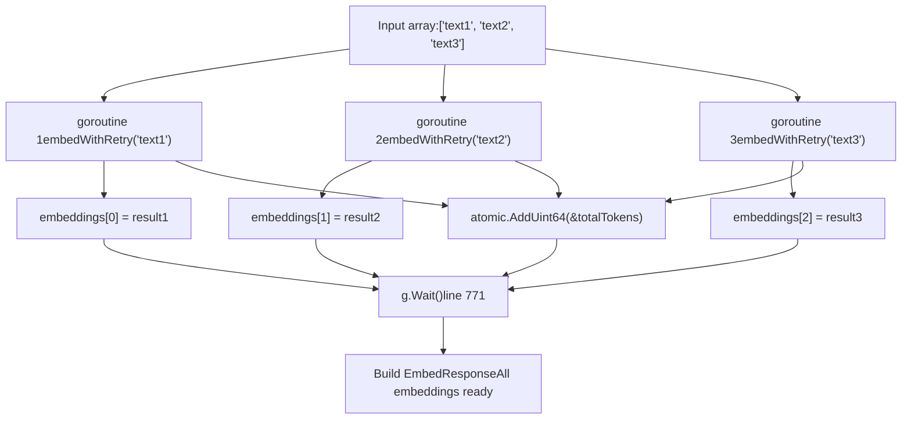
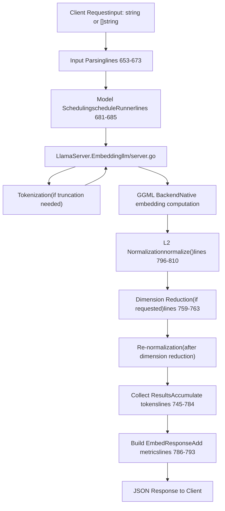

# Embedding API

Relevant source files

-   [README.md](https://github.com/ollama/ollama/blob/562c76d7/README.md?plain=1)
-   [api/client.go](https://github.com/ollama/ollama/blob/562c76d7/api/client.go)
-   [api/client\_test.go](https://github.com/ollama/ollama/blob/562c76d7/api/client_test.go)
-   [api/types.go](https://github.com/ollama/ollama/blob/562c76d7/api/types.go)
-   [cmd/cmd.go](https://github.com/ollama/ollama/blob/562c76d7/cmd/cmd.go)
-   [docs/README.md](https://github.com/ollama/ollama/blob/562c76d7/docs/README.md?plain=1)
-   [docs/api.md](https://github.com/ollama/ollama/blob/562c76d7/docs/api.md?plain=1)
-   [docs/development.md](https://github.com/ollama/ollama/blob/562c76d7/docs/development.md?plain=1)
-   [docs/images/ollama-keys.png](https://github.com/ollama/ollama/blob/562c76d7/docs/images/ollama-keys.png)
-   [docs/images/signup.png](https://github.com/ollama/ollama/blob/562c76d7/docs/images/signup.png)
-   [server/images.go](https://github.com/ollama/ollama/blob/562c76d7/server/images.go)
-   [server/routes.go](https://github.com/ollama/ollama/blob/562c76d7/server/routes.go)

The Embedding API provides endpoints for generating vector embeddings from text using embedding models. Embeddings are numerical representations of text that capture semantic meaning and enable similarity comparisons, search, and other vector-based operations.

For model management operations, see [Model Management API](/ollama/ollama/3.1-model-management-api). For text generation, see [Generation and Chat API](/ollama/ollama/3.2-generation-and-chat-api).

## Endpoints

Ollama provides two embedding endpoints with different interfaces:

| Endpoint | Purpose | Status |
| --- | --- | --- |
| `/api/embed` | Modern embedding API with batch support | Recommended |
| `/api/embeddings` | Legacy single-embedding API | Deprecated |

The `/api/embed` endpoint is the recommended interface as it supports batching multiple inputs in a single request and provides advanced features like dimension reduction and automatic truncation.

**Sources:** [server/routes.go640-855](https://github.com/ollama/ollama/blob/562c76d7/server/routes.go#L640-L855) [docs/api.md16](https://github.com/ollama/ollama/blob/562c76d7/docs/api.md?plain=1#L16-L16)

## Request Flow Architecture

> **[Mermaid sequence]**
> *(图表结构无法解析)*

**Sources:** [server/routes.go640-794](https://github.com/ollama/ollama/blob/562c76d7/server/routes.go#L640-L794)

## /api/embed Endpoint

### Request Format

The `/api/embed` endpoint accepts an `EmbedRequest` with the following structure:

| Field | Type | Required | Description |
| --- | --- | --- | --- |
| `model` | string | Yes | Name of the embedding model to use |
| `input` | string or string\[\] | No | Text to embed (single string or array of strings) |
| `truncate` | boolean | No | Truncate inputs exceeding context length (default: true) |
| `options` | map | No | Model-specific options (e.g., context length) |
| `keep_alive` | duration | No | How long to keep model loaded in memory |
| `dimensions` | int | No | Reduce embedding dimensions to this size |

The `input` field is flexible and accepts either a single string or an array of strings for batch processing:

```
{  "model": "mxbai-embed-large",  "input": "Why is the sky blue?"}
```
Or for batch embedding:

```
{  "model": "mxbai-embed-large",  "input": [    "Why is the sky blue?",    "What is the capital of France?",    "How does photosynthesis work?"  ]}
```
**Sources:** [api/types.go611-635](https://github.com/ollama/ollama/blob/562c76d7/api/types.go#L611-L635) [server/routes.go640-694](https://github.com/ollama/ollama/blob/562c76d7/server/routes.go#L640-L694)

### Response Format

The endpoint returns an `EmbedResponse`:

| Field | Type | Description |
| --- | --- | --- |
| `model` | string | Name of the model used |
| `embeddings` | float32\[\]\[\] | Array of embedding vectors |
| `total_duration` | int64 | Total time in nanoseconds |
| `load_duration` | int64 | Model load time in nanoseconds |
| `prompt_eval_count` | int | Total tokens processed |

Each embedding in the `embeddings` array is a normalized vector of floating-point numbers. The length of each vector depends on the model's native embedding dimension (unless reduced via the `dimensions` parameter).

**Sources:** [api/types.go637-646](https://github.com/ollama/ollama/blob/562c76d7/api/types.go#L637-L646) [server/routes.go786-793](https://github.com/ollama/ollama/blob/562c76d7/server/routes.go#L786-L793)

### Input Processing Flow

**Sources:** [server/routes.go640-794](https://github.com/ollama/ollama/blob/562c76d7/server/routes.go#L640-L794)

## Input Truncation Logic

When an input exceeds the model's context length, the `EmbedHandler` can automatically truncate it if `truncate` is enabled:

1.  **Error Detection:** The handler calls `runner.Embedding()` and catches 400 status errors
2.  **Tokenization:** Converts the input text to tokens using `runner.Tokenize()`
3.  **Context Calculation:** Determines maximum token count by:
    -   Starting with `opts.NumCtx` or model's native context length
    -   Subtracting 1 if BOS (beginning-of-sequence) token will be added
    -   Subtracting 1 if EOS (end-of-sequence) token will be added
4.  **Truncation:** Slices token array to fit within context: `tokens[:ctxLen]`
5.  **Detokenization:** Converts truncated tokens back to text
6.  **Retry:** Calls `runner.Embedding()` again with truncated text

This logic is encapsulated in the `embedWithRetry` closure at [server/routes.go702-743](https://github.com/ollama/ollama/blob/562c76d7/server/routes.go#L702-L743)

**Sources:** [server/routes.go702-743](https://github.com/ollama/ollama/blob/562c76d7/server/routes.go#L702-L743)

## Vector Normalization

All embeddings are L2-normalized to unit length before being returned. The `normalize` function at [server/routes.go796-810](https://github.com/ollama/ollama/blob/562c76d7/server/routes.go#L796-L810) implements this:

1.  **Validation:** Checks for NaN or Inf values in the embedding vector
2.  **Sum of Squares:** Computes `sum += v * v` for each element
3.  **Normalization Factor:** Calculates `norm = 1.0 / max(sqrt(sum), 1e-12)`
4.  **Scaling:** Multiplies each element by the normalization factor

The normalization is applied twice if dimension reduction is requested:

-   Once after generating the full embedding
-   Again after slicing to the requested dimensions

This ensures the reduced embedding maintains unit length.

**Sources:** [server/routes.go796-810](https://github.com/ollama/ollama/blob/562c76d7/server/routes.go#L796-L810) [server/routes.go755-763](https://github.com/ollama/ollama/blob/562c76d7/server/routes.go#L755-L763)

## Concurrent Batch Processing


The handler uses `golang.org/x/sync/errgroup` to process multiple inputs concurrently:

-   **Goroutine Limit:** Set to `max(GOMAXPROCS-1, 1)` (implicit from errgroup behavior)
-   **Index Preservation:** Each goroutine writes to its pre-assigned index in the embeddings slice
-   **Token Counting:** Uses `atomic.AddUint64` to safely accumulate token counts
-   **Error Handling:** If any goroutine returns an error, `g.Wait()` returns that error and processing stops

**Sources:** [server/routes.go745-784](https://github.com/ollama/ollama/blob/562c76d7/server/routes.go#L745-L784)

## /api/embeddings Endpoint (Legacy)

### Request Format

The legacy endpoint accepts an `EmbeddingRequest`:

| Field | Type | Required | Description |
| --- | --- | --- | --- |
| `model` | string | Yes | Name of the embedding model |
| `prompt` | string | Yes | Text to embed |
| `options` | map | No | Model-specific options |
| `keep_alive` | duration | No | Model memory duration |

**Sources:** [api/types.go648-657](https://github.com/ollama/ollama/blob/562c76d7/api/types.go#L648-L657) [server/routes.go812-855](https://github.com/ollama/ollama/blob/562c76d7/server/routes.go#L812-L855)

### Response Format

Returns an `EmbeddingResponse` with a single embedding:

| Field | Type | Description |
| --- | --- | --- |
| `embedding` | float64\[\] | Single embedding vector (as float64, not float32) |

**Note:** Unlike `/api/embed`, this endpoint:

-   Returns `float64` instead of `float32`
-   Does not return metrics (no timing or token counts)
-   Does not support batching
-   Does not apply normalization
-   Does not support truncation or dimension reduction

**Sources:** [api/types.go659-662](https://github.com/ollama/ollama/blob/562c76d7/api/types.go#L659-L662) [server/routes.go835-854](https://github.com/ollama/ollama/blob/562c76d7/server/routes.go#L835-L854)

### Comparison of Endpoints

```mermaid
flowchart TD
    L1["✗ Single input only"]
    L2["✗ No truncation"]
    L3["✗ No dimension control"]
    L4["✗ No normalization"]
    L5["✗ No metrics"]
    L6["✗ No token counts"]
    L7["float64 output"]
    L8["✗ No concurrency"]
    E1["✓ Batch processing"]
    E2["✓ Auto-truncation"]
    E3["✓ Dimension reduction"]
    E4["✓ L2 normalization"]
    E5["✓ Timing metrics"]
    E6["✓ Token counts"]
    E7["✓ float32 output"]
    E8["✓ Concurrent processing"]
    Recommendation["Use /api/embed for new applications"]

    E1 --> Recommendation
    E2 --> Recommendation
    E3 --> Recommendation
```


**Sources:** [server/routes.go640-855](https://github.com/ollama/ollama/blob/562c76d7/server/routes.go#L640-L855)

## Model Scheduling and Loading

Both endpoints use the `scheduleRunner` function to obtain a model runner:

1.  **Model Validation:** Parses and validates the model name
2.  **Model Retrieval:** Loads model metadata via `GetModel(name)`
3.  **Capability Check:** Verifies model supports embedding (though this is implicit for embedding endpoints)
4.  **Option Merging:** Combines model defaults with request options
5.  **Runner Allocation:** Calls `s.sched.GetRunner()` which may:
    -   Return an existing loaded runner
    -   Load the model into memory
    -   Unload other models if memory is constrained

The `keep_alive` parameter controls how long the runner stays loaded after the request completes. Setting it to `0` unloads the model immediately.

**Sources:** [server/routes.go122-163](https://github.com/ollama/ollama/blob/562c76d7/server/routes.go#L122-L163) [server/routes.go681-685](https://github.com/ollama/ollama/blob/562c76d7/server/routes.go#L681-L685)

## Client Usage

The `api` package provides a typed client for making embedding requests:

```
// Modern API with batch supportfunc (c *Client) Embed(ctx context.Context, req *EmbedRequest) (*EmbedResponse, error)
```
Example usage:

```
client, _ := api.ClientFromEnvironment() resp, err := client.Embed(context.Background(), &api.EmbedRequest{    Model: "mxbai-embed-large",    Input: []string{        "The sky appears blue during the day",        "Grass is typically green in color",    },}) // resp.Embeddings[0] contains embedding for first text// resp.Embeddings[1] contains embedding for second text
```
**Sources:** [api/client.go425-432](https://github.com/ollama/ollama/blob/562c76d7/api/client.go#L425-L432)

## Data Flow Summary


**Sources:** [server/routes.go640-794](https://github.com/ollama/ollama/blob/562c76d7/server/routes.go#L640-L794)

## Error Handling

The embedding endpoints return appropriate HTTP status codes:

| Status | Condition |
| --- | --- |
| 200 | Success |
| 400 | Invalid request (malformed JSON, invalid input type) |
| 404 | Model not found |
| 500 | Internal server error (tokenization failure, backend error) |

Specific error cases:

-   **Invalid Input Type:** Returns 400 if `input` is neither string nor array of strings [server/routes.go663-665](https://github.com/ollama/ollama/blob/562c76d7/server/routes.go#L663-L665)
-   **Empty Input:** Returns empty embeddings array with 200 status [server/routes.go689-692](https://github.com/ollama/ollama/blob/562c76d7/server/routes.go#L689-L692)
-   **Truncation Failure:** Returns error if input exceeds context even after truncation [server/routes.go731-735](https://github.com/ollama/ollama/blob/562c76d7/server/routes.go#L731-L735)
-   **NaN/Inf in Embeddings:** Returns error during normalization if invalid values detected [server/routes.go799-801](https://github.com/ollama/ollama/blob/562c76d7/server/routes.go#L799-L801)

**Sources:** [server/routes.go640-794](https://github.com/ollama/ollama/blob/562c76d7/server/routes.go#L640-L794)

## Model Detection

To check if a model supports embeddings, examine its capabilities:

```
resp, _ := client.Show(ctx, &api.ShowRequest{Model: "mxbai-embed-large"}) // Check if model has embedding capabilityhasEmbedding := slices.Contains(resp.Capabilities, model.CapabilityEmbedding)
```
Embedding capability is determined by checking for a `pooling_type` key in the model's GGUF metadata. If present, the model is classified as an embedding model rather than a completion model.

**Sources:** [server/images.go72-100](https://github.com/ollama/ollama/blob/562c76d7/server/images.go#L72-L100)
