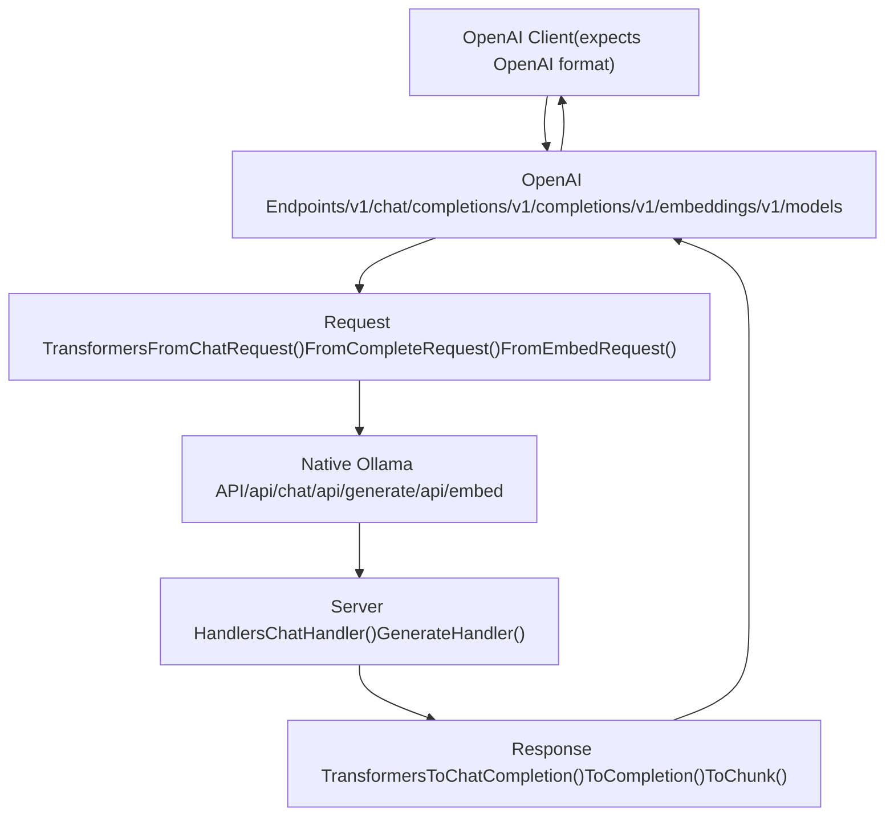
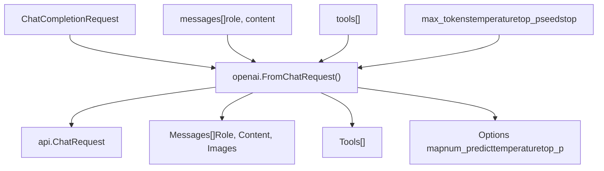
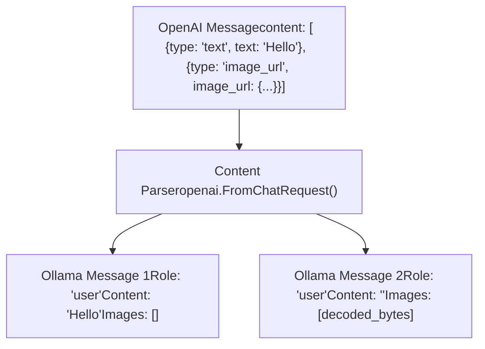
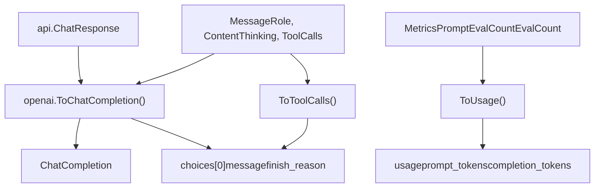
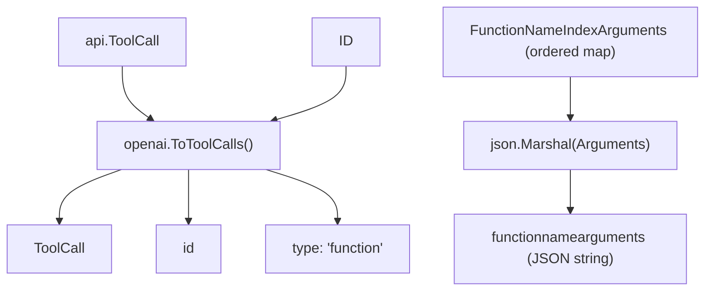
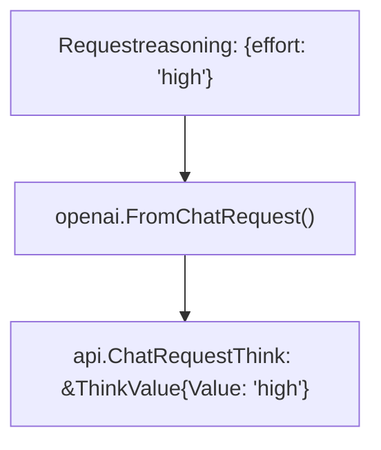
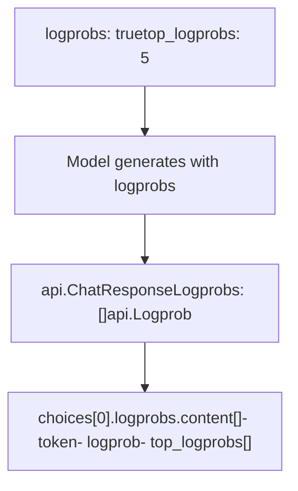
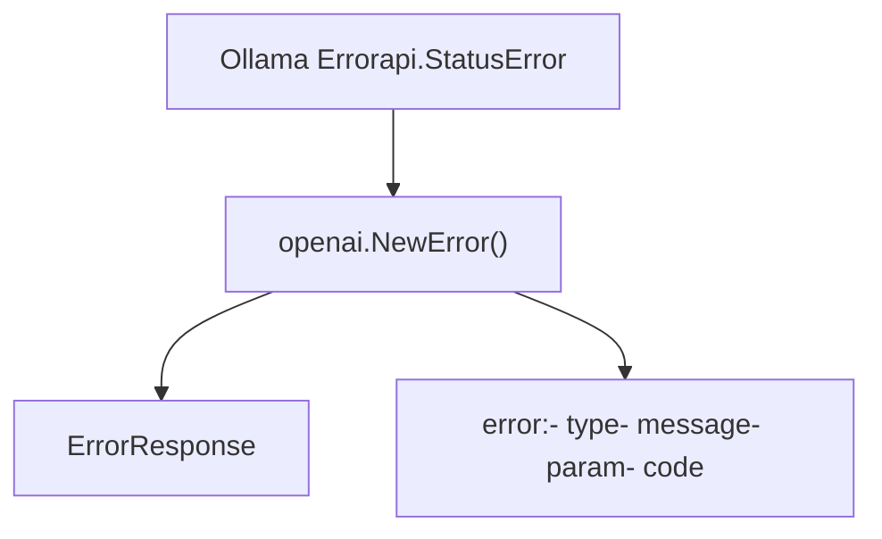

# OpenAI Compatibility Layer

Relevant source files

-   [api/client.go](https://github.com/ollama/ollama/blob/562c76d7/api/client.go)
-   [api/client\_test.go](https://github.com/ollama/ollama/blob/562c76d7/api/client_test.go)
-   [api/types.go](https://github.com/ollama/ollama/blob/562c76d7/api/types.go)
-   [api/types\_test.go](https://github.com/ollama/ollama/blob/562c76d7/api/types_test.go)
-   [api/types\_typescript\_test.go](https://github.com/ollama/ollama/blob/562c76d7/api/types_typescript_test.go)
-   [cmd/cmd.go](https://github.com/ollama/ollama/blob/562c76d7/cmd/cmd.go)
-   [middleware/openai.go](https://github.com/ollama/ollama/blob/562c76d7/middleware/openai.go)
-   [middleware/openai\_test.go](https://github.com/ollama/ollama/blob/562c76d7/middleware/openai_test.go)
-   [openai/openai.go](https://github.com/ollama/ollama/blob/562c76d7/openai/openai.go)
-   [openai/openai\_test.go](https://github.com/ollama/ollama/blob/562c76d7/openai/openai_test.go)
-   [openai/responses.go](https://github.com/ollama/ollama/blob/562c76d7/openai/responses.go)
-   [openai/responses\_test.go](https://github.com/ollama/ollama/blob/562c76d7/openai/responses_test.go)
-   [server/images.go](https://github.com/ollama/ollama/blob/562c76d7/server/images.go)
-   [server/routes.go](https://github.com/ollama/ollama/blob/562c76d7/server/routes.go)
-   [server/routes\_generate\_test.go](https://github.com/ollama/ollama/blob/562c76d7/server/routes_generate_test.go)
-   [tools/tools.go](https://github.com/ollama/ollama/blob/562c76d7/tools/tools.go)
-   [tools/tools\_test.go](https://github.com/ollama/ollama/blob/562c76d7/tools/tools_test.go)

The OpenAI Compatibility Layer provides partial API compatibility with OpenAI's REST API, allowing clients built for OpenAI to interact with Ollama with minimal modifications. This layer handles transformation of requests and responses between OpenAI's format and Ollama's native API format.

For information about Ollama's native API endpoints, see [API Reference](/ollama/ollama/3-api-reference). For details about model management operations, see [Model Management API](/ollama/ollama/3.1-model-management-api).

---

## Purpose and Scope

The compatibility layer implements a subset of the OpenAI API specification, focusing on:

-   Chat completions (`/v1/chat/completions`)
-   Text completions (`/v1/completions`)
-   Embeddings (`/v1/embeddings`)
-   Model listings (`/v1/models`)

The layer performs bidirectional transformations: converting incoming OpenAI-formatted requests to Ollama's native format, and converting Ollama responses back to OpenAI's format. This enables drop-in compatibility for applications originally designed for OpenAI's API.

---

## Architecture Overview


**Request/Response Flow Through Compatibility Layer**

Sources: [openai/openai.go1-700](https://github.com/ollama/ollama/blob/562c76d7/openai/openai.go#L1-L700) [server/routes.go1-1500](https://github.com/ollama/ollama/blob/562c76d7/server/routes.go#L1-L1500)

The compatibility layer acts as a translation boundary between external OpenAI clients and Ollama's internal API. All request and response transformations are handled by functions in the `openai` package, which is separate from the core server logic.

---

## HTTP Endpoints

The compatibility layer exposes the following OpenAI-compatible endpoints:

| OpenAI Endpoint | Maps To | Request Type | Response Type |
| --- | --- | --- | --- |
| `POST /v1/chat/completions` | `/api/chat` | `ChatCompletionRequest` | `ChatCompletion` or `ChatCompletionChunk` |
| `POST /v1/completions` | `/api/generate` | `CompletionRequest` | `Completion` or `CompletionChunk` |
| `POST /v1/embeddings` | `/api/embed` | `EmbedRequest` | `EmbeddingList` |
| `GET /v1/models` | `/api/tags` | None | `ListCompletion` |

Sources: [openai/openai.go98-177](https://github.com/ollama/ollama/blob/562c76d7/openai/openai.go#L98-L177)

### Streaming Support

Both chat and text completion endpoints support streaming responses when `stream: true` is set in the request. Streaming responses use Server-Sent Events (SSE) format with `data:` prefixed JSON chunks, matching OpenAI's streaming protocol.

> **[Mermaid sequence]**
> *(图表结构无法解析)*

**Streaming Response Flow**

Sources: [openai/openai.go294-324](https://github.com/ollama/ollama/blob/562c76d7/openai/openai.go#L294-L324) [openai/openai.go335-420](https://github.com/ollama/ollama/blob/562c76d7/openai/openai.go#L335-L420)

---

## Request Transformation

### Chat Completion Requests

The `FromChatRequest()` function converts OpenAI's `ChatCompletionRequest` to Ollama's `api.ChatRequest`:


**Chat Request Field Mapping**

Sources: [openai/openai.go422-693](https://github.com/ollama/ollama/blob/562c76d7/openai/openai.go#L422-L693)

Key transformations performed by `FromChatRequest()`:

| OpenAI Field | Ollama Field | Transformation |
| --- | --- | --- |
| `messages[].content` | `Messages[].Content` | String preserved; arrays converted to text + images |
| `messages[].content[].image_url.url` | `Messages[].Images[]` | Base64 data extracted and decoded |
| `max_tokens` | `Options["num_predict"]` | Direct mapping |
| `temperature` | `Options["temperature"]` | Cast to `float32` |
| `top_p` | `Options["top_p"]` | Cast to `float32` |
| `frequency_penalty` | `Options["frequency_penalty"]` | Cast to `float32` |
| `presence_penalty` | `Options["presence_penalty"]` | Cast to `float32` |
| `seed` | `Options["seed"]` | Direct mapping |
| `stop` | `Options["stop"]` | String or array converted to `[]string` |
| `tools[]` | `Tools` | Direct mapping (compatible structure) |
| `response_format.type` | `Format` | `"json"` mapped to JSON format |
| `response_format.json_schema.schema` | `Format` | Schema passed as `json.RawMessage` |

Sources: [openai/openai.go422-550](https://github.com/ollama/ollama/blob/562c76d7/openai/openai.go#L422-L550)

### Multimodal Content Handling

When a message contains multimodal content (text and images), the transformation logic splits them into separate messages:


**Multimodal Content Splitting**

Sources: [openai/openai.go476-548](https://github.com/ollama/ollama/blob/562c76d7/openai/openai.go#L476-L548)

Image URLs are decoded from base64 if they use the `data:image/...;base64,` prefix. The decoded binary data is stored in the `Images` field of the Ollama message.

### Text Completion Requests

The `FromCompleteRequest()` function converts OpenAI's `CompletionRequest` to Ollama's `api.GenerateRequest`:

| OpenAI Field | Ollama Field | Notes |
| --- | --- | --- |
| `prompt` | `Prompt` | Direct string mapping |
| `suffix` | `Suffix` | For fill-in-the-middle completion |
| `max_tokens` | `Options["num_predict"]` | Token limit |
| `logprobs` | `Logprobs` and `TopLogprobs` | Logprobs support |

Sources: [openai/openai.go695-777](https://github.com/ollama/ollama/blob/562c76d7/openai/openai.go#L695-L777)

### Embedding Requests

The `FromEmbedRequest()` function handles both single strings and arrays of strings:

```
// Input can be:// - string: "single text"// - []string: ["text1", "text2"]
```
Sources: [openai/openai.go779-824](https://github.com/ollama/ollama/blob/562c76d7/openai/openai.go#L779-L824)

---

## Response Transformation

### Chat Completion Responses

The `ToChatCompletion()` function converts Ollama's `api.ChatResponse` to OpenAI's `ChatCompletion`:


**Response Transformation Pipeline**

Sources: [openai/openai.go261-292](https://github.com/ollama/ollama/blob/562c76d7/openai/openai.go#L261-L292) [openai/openai.go232-239](https://github.com/ollama/ollama/blob/562c76d7/openai/openai.go#L232-L239)

Key response field mappings:

| Ollama Field | OpenAI Field | Transformation |
| --- | --- | --- |
| `Message.Role` | `choices[0].message.role` | Direct mapping |
| `Message.Content` | `choices[0].message.content` | Direct mapping |
| `Message.Thinking` | `choices[0].message.reasoning` | Thinking content mapped to `reasoning` |
| `Message.ToolCalls[]` | `choices[0].message.tool_calls[]` | Converted via `ToToolCalls()` |
| `DoneReason` | `choices[0].finish_reason` | `"stop"`, `"length"`, or `"tool_calls"` |
| `Metrics.PromptEvalCount` | `usage.prompt_tokens` | Direct mapping |
| `Metrics.EvalCount` | `usage.completion_tokens` | Direct mapping |
| `Model` | `model` | Model name preserved |
| `CreatedAt` | `created` | Converted to Unix timestamp |

Sources: [openai/openai.go261-292](https://github.com/ollama/ollama/blob/562c76d7/openai/openai.go#L261-L292)

### Streaming Response Chunks

For streaming responses, `ToChunk()` produces `ChatCompletionChunk` objects:

> **[Mermaid sequence]**
> *(图表结构无法解析)*

**Streaming Chunk Generation**

Sources: [openai/openai.go294-324](https://github.com/ollama/ollama/blob/562c76d7/openai/openai.go#L294-L324)

The `object` field is set to `"chat.completion.chunk"` for streaming responses, distinguishing them from complete responses which use `"chat.completion"`.

### Text Completion Responses

Text completions use similar transformations but target the `Completion` and `CompletionChunk` structures:

| Response Type | Object Type | Structure |
| --- | --- | --- |
| Non-streaming | `"text_completion"` | `Completion` with `choices[].text` |
| Streaming | `"text_completion.chunk"` | `CompletionChunk` with delta text |

Sources: [openai/openai.go336-421](https://github.com/ollama/ollama/blob/562c76d7/openai/openai.go#L336-L421)

---

## Tool Calling Support

The compatibility layer preserves tool calling functionality between OpenAI and Ollama formats.

### Tool Call Transformation

The `ToToolCalls()` function converts Ollama's tool call structure to OpenAI's format:


**Tool Call Structure Mapping**

Sources: [openai/openai.go242-259](https://github.com/ollama/ollama/blob/562c76d7/openai/openai.go#L242-L259) [api/types.go235-318](https://github.com/ollama/ollama/blob/562c76d7/api/types.go#L235-L318)

The transformation preserves:

-   **Tool call IDs**: Used for tracking in multi-turn conversations
-   **Function names**: Identify which tool to invoke
-   **Arguments**: Converted from ordered map to JSON string
-   **Index**: Position in the tool call sequence

### Tool Definition Format

Tool definitions in requests are compatible between formats since both use JSON Schema for parameter definitions:

```
{  "type": "function",  "function": {    "name": "get_weather",    "description": "Get current weather",    "parameters": {      "type": "object",      "properties": {        "location": {          "type": "string",          "description": "City name"        }      },      "required": ["location"]    }  }}
```
Sources: [api/types.go319-508](https://github.com/ollama/ollama/blob/562c76d7/api/types.go#L319-L508) [openai/openai\_test.go169-235](https://github.com/ollama/ollama/blob/562c76d7/openai/openai_test.go#L169-L235)

---

## Thinking/Reasoning Models

OpenAI's reasoning models use a `reasoning` field to expose the model's internal thought process. Ollama maps this to its `thinking` field:

| Ollama Field | OpenAI Field | Usage |
| --- | --- | --- |
| `Message.Thinking` | `message.reasoning` | Thought process content |
| `Think` parameter | `reasoning.effort` | Control thinking depth (`"high"`, `"medium"`, `"low"`) |

Sources: [openai/openai.go34-41](https://github.com/ollama/ollama/blob/562c76d7/openai/openai.go#L34-L41) [openai/openai.go98-117](https://github.com/ollama/ollama/blob/562c76d7/openai/openai.go#L98-L117)

When `reasoning.effort` is specified in the request, it's mapped to Ollama's `Think` parameter:


**Reasoning Effort Mapping**

Sources: [openai/openai.go588-609](https://github.com/ollama/ollama/blob/562c76d7/openai/openai.go#L588-L609)

---

## Logprobs Support

The compatibility layer supports log probability information for generated tokens:


**Logprobs Data Flow**

Sources: [openai/openai.go43-66](https://github.com/ollama/ollama/blob/562c76d7/openai/openai.go#L43-L66) [api/types.go510-530](https://github.com/ollama/ollama/blob/562c76d7/api/types.go#L510-L530)

The `top_logprobs` parameter (valid values 0-20) controls how many alternative tokens and their probabilities are returned at each position.

---

## Embedding Responses

Embedding responses are transformed with support for both float and base64 encoding formats:

| OpenAI Field | Source | Notes |
| --- | --- | --- |
| `data[].embedding` | `Embeddings[][]` | Float array or base64 string |
| `data[].index` | Array position | Zero-based index |
| `usage.prompt_tokens` | Sum of token counts | Aggregated from all inputs |
| `model` | Request model name | Preserved |

Sources: [openai/openai.go826-925](https://github.com/ollama/ollama/blob/562c76d7/openai/openai.go#L826-L925)

When `encoding_format: "base64"` is specified, float embeddings are encoded as base64-encoded little-endian float32 arrays:

```
// Float32 array → Little-endian bytes → Base64 stringbinary.LittleEndian.PutUint32(bytes, math.Float32bits(value))base64.StdEncoding.EncodeToString(bytes)
```
Sources: [openai/openai.go873-905](https://github.com/ollama/ollama/blob/562c76d7/openai/openai.go#L873-L905)

---

## Error Handling

The compatibility layer translates Ollama errors to OpenAI error response format:


**Error Response Transformation**

Sources: [openai/openai.go23-33](https://github.com/ollama/ollama/blob/562c76d7/openai/openai.go#L23-L33) [openai/openai.go218-230](https://github.com/ollama/ollama/blob/562c76d7/openai/openai.go#L218-L230)

HTTP status codes map to error types:

| Status Code | Error Type |
| --- | --- |
| 400 | `invalid_request_error` |
| 404 | `not_found_error` |
| 500+ | `api_error` |

Sources: [openai/openai.go218-230](https://github.com/ollama/ollama/blob/562c76d7/openai/openai.go#L218-L230)

---

## Model Listing

The `/v1/models` endpoint returns available models in OpenAI's format:

```
{  "object": "list",  "data": [    {      "id": "llama3.2:latest",      "object": "model",      "created": 1234567890,      "owned_by": "library"    }  ]}
```
Sources: [openai/openai.go188-204](https://github.com/ollama/ollama/blob/562c76d7/openai/openai.go#L188-L204)

Each model from Ollama's `/api/tags` endpoint is converted to a `Model` object with:

-   `id`: Model name (e.g., `"llama3.2:latest"`)
-   `object`: Always `"model"`
-   `created`: Unix timestamp of model creation/modification
-   `owned_by`: Fixed value `"library"`

---

## Implementation Notes

### ID Generation

Response IDs follow the OpenAI format pattern:

```
// Chat completions: "chatcmpl-{uuid}"// Completions: "cmpl-{uuid}"
```
Sources: [openai/openai.go927-933](https://github.com/ollama/ollama/blob/562c76d7/openai/openai.go#L927-L933)

### System Fingerprints

All responses include a fixed `system_fingerprint` value of `"fp_ollama"` to identify responses as originating from Ollama.

Sources: [openai/openai.go275](https://github.com/ollama/ollama/blob/562c76d7/openai/openai.go#L275-L275) [openai/openai.go308](https://github.com/ollama/ollama/blob/562c76d7/openai/openai.go#L308-L308)

### Streaming Termination

Streaming responses terminate with a `data: [DONE]` message, matching OpenAI's SSE protocol.

Sources: [openai/openai.go294-324](https://github.com/ollama/ollama/blob/562c76d7/openai/openai.go#L294-L324)
