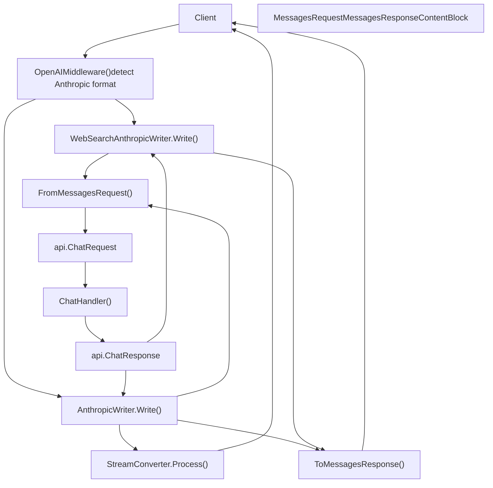
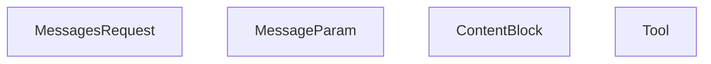
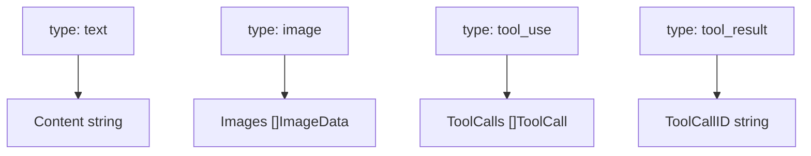
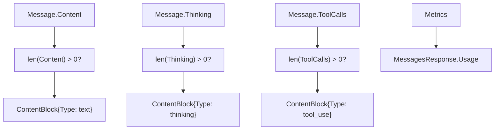
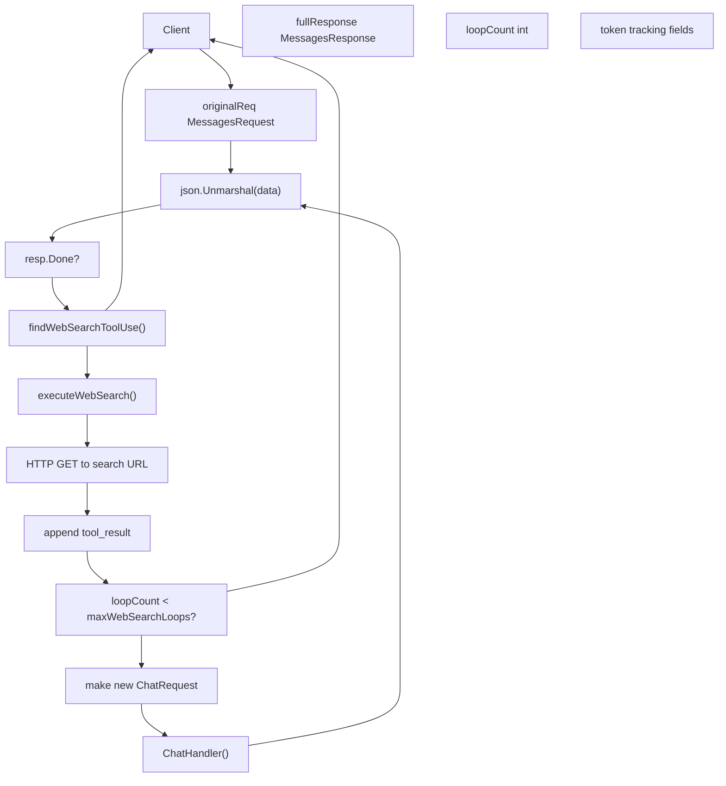
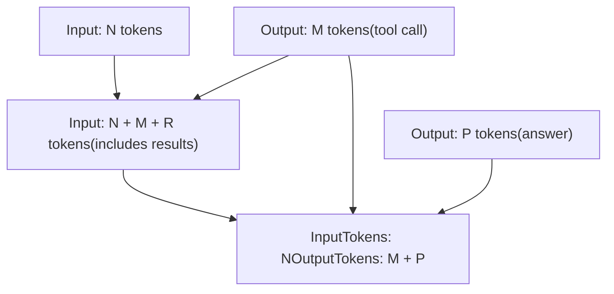

# Anthropic Compatibility Layer

Relevant source files

-   [api/client.go](https://github.com/ollama/ollama/blob/562c76d7/api/client.go)
-   [api/client\_test.go](https://github.com/ollama/ollama/blob/562c76d7/api/client_test.go)
-   [api/types.go](https://github.com/ollama/ollama/blob/562c76d7/api/types.go)
-   [api/types\_test.go](https://github.com/ollama/ollama/blob/562c76d7/api/types_test.go)
-   [api/types\_typescript\_test.go](https://github.com/ollama/ollama/blob/562c76d7/api/types_typescript_test.go)
-   [cmd/cmd.go](https://github.com/ollama/ollama/blob/562c76d7/cmd/cmd.go)
-   [middleware/openai.go](https://github.com/ollama/ollama/blob/562c76d7/middleware/openai.go)
-   [middleware/openai\_test.go](https://github.com/ollama/ollama/blob/562c76d7/middleware/openai_test.go)
-   [openai/openai.go](https://github.com/ollama/ollama/blob/562c76d7/openai/openai.go)
-   [openai/openai\_test.go](https://github.com/ollama/ollama/blob/562c76d7/openai/openai_test.go)
-   [openai/responses.go](https://github.com/ollama/ollama/blob/562c76d7/openai/responses.go)
-   [openai/responses\_test.go](https://github.com/ollama/ollama/blob/562c76d7/openai/responses_test.go)
-   [server/images.go](https://github.com/ollama/ollama/blob/562c76d7/server/images.go)
-   [server/routes.go](https://github.com/ollama/ollama/blob/562c76d7/server/routes.go)
-   [server/routes\_generate\_test.go](https://github.com/ollama/ollama/blob/562c76d7/server/routes_generate_test.go)
-   [tools/tools.go](https://github.com/ollama/ollama/blob/562c76d7/tools/tools.go)
-   [tools/tools\_test.go](https://github.com/ollama/ollama/blob/562c76d7/tools/tools_test.go)

## Overview

The Anthropic Compatibility Layer implements Anthropic's Messages API, allowing Ollama to accept requests formatted for Claude models and return responses in Anthropic's format. This enables integrations built for Anthropic's API (such as Claude Code and Cline) to work with Ollama models.

For OpenAI API compatibility, see [OpenAI Compatibility Layer](/ollama/ollama/3.4-openai-compatibility-layer). For native Ollama endpoints, see [Generation and Chat API](/ollama/ollama/3.2-generation-and-chat-api).

The compatibility layer provides:

-   Request/response transformation via `FromMessagesRequest()` and `ToMessagesResponse()`
-   SSE streaming with Anthropic-specific event types (`message_start`, `content_block_delta`, etc.)
-   Multi-turn web search orchestration through `WebSearchAnthropicWriter`
-   Tool calling translation between Anthropic and Ollama conventions
-   Extended thinking/reasoning support through `ThinkingConfig`

**Sources:** [anthropic/anthropic.go1-1163](https://github.com/ollama/ollama/blob/562c76d7/anthropic/anthropic.go#L1-L1163) [middleware/anthropic.go1-587](https://github.com/ollama/ollama/blob/562c76d7/middleware/anthropic.go#L1-L587)

## API Endpoint

The Anthropic compatibility layer exposes a single endpoint:

| Endpoint | Method | Handler Chain |
| --- | --- | --- |
| `/v1/messages` | POST | `OpenAIMiddleware()` → `ChatHandler()` |

The endpoint is registered in [server/routes.go](https://github.com/ollama/ollama/blob/562c76d7/server/routes.go) with middleware wrapping. The `OpenAIMiddleware()` function detects Anthropic-format requests and applies `AnthropicWriter` or `WebSearchAnthropicWriter` based on the presence of web search tools.

**Sources:** [server/routes.go](https://github.com/ollama/ollama/blob/562c76d7/server/routes.go) [middleware/anthropic.go23-29](https://github.com/ollama/ollama/blob/562c76d7/middleware/anthropic.go#L23-L29)

## Architecture

Request/Response Flow with Code Entities:


**Sources:** [middleware/anthropic.go23-76](https://github.com/ollama/ollama/blob/562c76d7/middleware/anthropic.go#L23-L76) [anthropic/anthropic.go499-746](https://github.com/ollama/ollama/blob/562c76d7/anthropic/anthropic.go#L499-L746) [server/routes.go](https://github.com/ollama/ollama/blob/562c76d7/server/routes.go)

## Request Transformation

### MessagesRequest Structure

Core types in `anthropic/anthropic.go`:


**Content block types** (`Type` field):

-   `"text"` - Regular text content
-   `"image"` - Base64 or URL image
-   `"tool_use"` - Tool invocation from model
-   `"tool_result"` - Tool execution result
-   `"thinking"` - Reasoning trace
-   `"server_tool_use"` - Internal web search request
-   `"web_search_tool_result"` - Search results

**Sources:** [anthropic/anthropic.go66-81](https://github.com/ollama/ollama/blob/562c76d7/anthropic/anthropic.go#L66-L81) [anthropic/anthropic.go84-87](https://github.com/ollama/ollama/blob/562c76d7/anthropic/anthropic.go#L84-L87) [anthropic/anthropic.go89-117](https://github.com/ollama/ollama/blob/562c76d7/anthropic/anthropic.go#L89-L117)

### Conversion to ChatRequest

The `FromMessagesRequest()` function in [anthropic/anthropic.go499-746](https://github.com/ollama/ollama/blob/562c76d7/anthropic/anthropic.go#L499-L746) performs field mapping:

| Anthropic Field | Ollama Field | Implementation |
| --- | --- | --- |
| `model` | `Model` | Direct string copy |
| `max_tokens` | `Options["num_predict"]` | Integer assignment |
| `messages` | `Messages` | Processed by `convertMessages()` |
| `system` | Prepended system message | `convertSystemPrompt()` handles string or array |
| `temperature` | `Options["temperature"]` | Float64 to float32 (default: 1.0) |
| `top_p` | `Options["top_p"]` | Float64 to float32 (default: 1.0) |
| `top_k` | `Options["top_k"]` | Integer |
| `stop_sequences` | `Options["stop"]` | String array |
| `tools` | `Tools` | `convertTools()` maps schema |
| `thinking` | `Think` | `convertThinking()` → `api.ThinkValue` |

**Content block conversion** in `convertMessages()` [anthropic/anthropic.go625-730](https://github.com/ollama/ollama/blob/562c76d7/anthropic/anthropic.go#L625-L730):


**Sources:** [anthropic/anthropic.go499-746](https://github.com/ollama/ollama/blob/562c76d7/anthropic/anthropic.go#L499-L746) [anthropic/anthropic.go625-730](https://github.com/ollama/ollama/blob/562c76d7/anthropic/anthropic.go#L625-L730) [anthropic/anthropic.go258-314](https://github.com/ollama/ollama/blob/562c76d7/anthropic/anthropic.go#L258-L314)

### Example Transformation Flow

> **[Mermaid sequence]**
> *(图表结构无法解析)*

**Sources:** [middleware/anthropic.go403-427](https://github.com/ollama/ollama/blob/562c76d7/middleware/anthropic.go#L403-L427) [anthropic/anthropic.go499-564](https://github.com/ollama/ollama/blob/562c76d7/anthropic/anthropic.go#L499-L564)

## Response Transformation

### MessagesResponse Structure

The `MessagesResponse` type in [anthropic/anthropic.go183-192](https://github.com/ollama/ollama/blob/562c76d7/anthropic/anthropic.go#L183-L192):

| Field | Type | Description |
| --- | --- | --- |
| `id` | string | Generated via `generateID("msg")` |
| `type` | string | Hardcoded `"message"` |
| `role` | string | Hardcoded `"assistant"` |
| `model` | string | Copied from `api.ChatResponse.Model` |
| `content` | \[\]ContentBlock | Built by `ToMessagesResponse()` |
| `stop_reason` | string | Mapped from `DoneReason` |
| `usage` | Usage | Converted from `Metrics` |

**Stop reason mapping**:

-   `"stop"` → `"end_turn"`
-   `"length"` → `"max_tokens"`
-   `""` (empty) → `"end_turn"`
-   Tool calls present → `"tool_use"`

**Sources:** [anthropic/anthropic.go183-192](https://github.com/ollama/ollama/blob/562c76d7/anthropic/anthropic.go#L183-L192) [anthropic/anthropic.go316-415](https://github.com/ollama/ollama/blob/562c76d7/anthropic/anthropic.go#L316-L415)

### Conversion from ChatResponse

The `ToMessagesResponse()` function in [anthropic/anthropic.go316-415](https://github.com/ollama/ollama/blob/562c76d7/anthropic/anthropic.go#L316-L415) builds content blocks:


**ID generation**: Tool calls receive generated IDs via `generateID("toolu")` with random suffixes.

**Sources:** [anthropic/anthropic.go316-415](https://github.com/ollama/ollama/blob/562c76d7/anthropic/anthropic.go#L316-L415) [anthropic/anthropic.go417-425](https://github.com/ollama/ollama/blob/562c76d7/anthropic/anthropic.go#L417-L425)

## Streaming Support

### Event Types

The Anthropic API uses server-sent events (SSE) with specific event types:

| Event Type | Purpose | Data Structure |
| --- | --- | --- |
| `message_start` | Initialization | `MessageStartEvent` with empty message |
| `content_block_start` | Begin content block | Index and content block type |
| `content_block_delta` | Incremental content | Delta with text/thinking/tool input |
| `content_block_stop` | End content block | Index only |
| `message_delta` | Message updates | Stop reason and usage |
| `message_stop` | Stream complete | No data |

**Sources:** [anthropic/anthropic.go201-255](https://github.com/ollama/ollama/blob/562c76d7/anthropic/anthropic.go#L201-L255)

### StreamConverter

The `StreamConverter` type in [anthropic/anthropic.go875-1163](https://github.com/ollama/ollama/blob/562c76d7/anthropic/anthropic.go#L875-L1163) maintains state across chunks:

**State fields**:

-   `messageSent bool` - Tracks if `message_start` emitted
-   `openBlocks map[int]*openBlock` - Active content blocks by index
-   `blockIndex int` - Next content block index
-   `usage *Usage` - Accumulated token counts

**State transitions**:

> **[Mermaid stateDiagram]**
> *(图表结构无法解析)*

**Process() flow** in [anthropic/anthropic.go904-1163](https://github.com/ollama/ollama/blob/562c76d7/anthropic/anthropic.go#L904-L1163):

1.  Check `!messageSent` → emit `MessageStartEvent`
2.  Compare current chunk to `openBlocks` state
3.  Emit `ContentBlockStart` for new content types
4.  Emit `ContentBlockDelta` for incremental content
5.  Emit `ContentBlockStop` when content type ends
6.  On `Done=true` → emit `MessageDelta` + `MessageStop`

**Sources:** [anthropic/anthropic.go875-903](https://github.com/ollama/ollama/blob/562c76d7/anthropic/anthropic.go#L875-L903) [anthropic/anthropic.go904-1163](https://github.com/ollama/ollama/blob/562c76d7/anthropic/anthropic.go#L904-L1163)

### Streaming Example

Actual method calls through the middleware:

> **[Mermaid sequence]**
> *(图表结构无法解析)*

**Sources:** [middleware/anthropic.go47-76](https://github.com/ollama/ollama/blob/562c76d7/middleware/anthropic.go#L47-L76) [anthropic/anthropic.go904-1163](https://github.com/ollama/ollama/blob/562c76d7/anthropic/anthropic.go#L904-L1163)

## Web Search Orchestration

### Overview

The web search feature is a sophisticated multi-turn orchestration where Ollama intercepts tool calls for `web_search_20250305`, executes them by calling an external search service, and automatically re-invokes the model with the search results. This creates a seamless experience where the model can search the web and synthesize information across multiple turns.

**Sources:** [middleware/anthropic.go89-253](https://github.com/ollama/ollama/blob/562c76d7/middleware/anthropic.go#L89-L253)

### Architecture

Web search flow in `WebSearchAnthropicWriter` [middleware/anthropic.go89-253](https://github.com/ollama/ollama/blob/562c76d7/middleware/anthropic.go#L89-L253):


**Method references**:

-   `Write()` - [middleware/anthropic.go162-253](https://github.com/ollama/ollama/blob/562c76d7/middleware/anthropic.go#L162-L253)
-   `findWebSearchToolUse()` - [middleware/anthropic.go255-291](https://github.com/ollama/ollama/blob/562c76d7/middleware/anthropic.go#L255-L291)
-   `executeWebSearch()` - [middleware/anthropic.go353-410](https://github.com/ollama/ollama/blob/562c76d7/middleware/anthropic.go#L353-L410)
-   `buildWebSearchToolResult()` - [middleware/anthropic.go412-514](https://github.com/ollama/ollama/blob/562c76d7/middleware/anthropic.go#L412-L514)

**Sources:** [middleware/anthropic.go89-253](https://github.com/ollama/ollama/blob/562c76d7/middleware/anthropic.go#L89-L253) [middleware/anthropic.go255-514](https://github.com/ollama/ollama/blob/562c76d7/middleware/anthropic.go#L255-L514)

### Web Search Loop Flow

The `Write()` method loop in [middleware/anthropic.go162-253](https://github.com/ollama/ollama/blob/562c76d7/middleware/anthropic.go#L162-L253):

> **[Mermaid sequence]**
> *(图表结构无法解析)*

**Loop control constant**: `maxWebSearchLoops = 3` in [middleware/anthropic.go116](https://github.com/ollama/ollama/blob/562c76d7/middleware/anthropic.go#L116-L116)

**Sources:** [middleware/anthropic.go162-253](https://github.com/ollama/ollama/blob/562c76d7/middleware/anthropic.go#L162-L253) [middleware/anthropic.go353-410](https://github.com/ollama/ollama/blob/562c76d7/middleware/anthropic.go#L353-L410)

### Web Search ContentBlock Types

The web search flow uses specialized content blocks:

| Block Type | Direction | Purpose |
| --- | --- | --- |
| `server_tool_use` | Model → System | Model requests a web search |
| `web_search_tool_result` | System → Model | Search results sent back to model |
| `text` with `citations` | Model → Client | Final answer with cited sources |

**Structure of web\_search\_tool\_result:**

```
{  "type": "web_search_tool_result",  "tool_use_id": "toolu_XXXXX",  "content": [    {      "type": "web_search_result",      "url": "https://example.com",      "title": "Page Title",      "encrypted_content": "base64_content...",      "page_age": "2024-01-15"    }  ]}
```
**Sources:** [anthropic/anthropic.go89-117](https://github.com/ollama/ollama/blob/562c76d7/anthropic/anthropic.go#L89-L117) [anthropic/anthropic.go128-141](https://github.com/ollama/ollama/blob/562c76d7/anthropic/anthropic.go#L128-L141)

### Loop Control and Error Handling

The web search loop implements several safeguards:

| Safeguard | Implementation | Purpose |
| --- | --- | --- |
| Max loops | `maxWebSearchLoops = 3` | Prevent infinite search loops |
| Search errors | `WebSearchToolResultError` | Gracefully handle search failures |
| Usage tracking | Accumulate tokens across loops | Report accurate total usage |
| Context cancellation | Check `ctx.Done()` | Respect client cancellations |

When the loop limit is reached or an error occurs, the system sends a final response with accumulated content blocks rather than failing the entire request.

**Sources:** [middleware/anthropic.go116](https://github.com/ollama/ollama/blob/562c76d7/middleware/anthropic.go#L116-L116) [middleware/anthropic.go353-410](https://github.com/ollama/ollama/blob/562c76d7/middleware/anthropic.go#L353-L410)

### Usage Calculation

Token usage across web search loops is carefully tracked:


The system tracks:

-   `estimatedInputTokens`: Original request tokens (estimated)
-   `loopBaseInputTok`/`loopBaseOutputTok`: Tokens before each loop iteration
-   `observedPromptEvalCount`/`observedEvalCount`: Cumulative metrics from responses

Final usage subtracts the intermediate tool call outputs to report only user-visible generation.

**Sources:** [middleware/anthropic.go98](https://github.com/ollama/ollama/blob/562c76d7/middleware/anthropic.go#L98-L98) [middleware/anthropic.go292-341](https://github.com/ollama/ollama/blob/562c76d7/middleware/anthropic.go#L292-L341)

## Tool Support

### Tool Definition Translation

The `convertTools()` function in [anthropic/anthropic.go564-581](https://github.com/ollama/ollama/blob/562c76d7/anthropic/anthropic.go#L564-L581) maps tool schemas:

| Anthropic Field | Ollama Field | Conversion |
| --- | --- | --- |
| `Tool.Type` | Not mapped | Filtered: only `"custom"` passed through |
| `Tool.Name` | `Tool.Function.Name` | Direct string copy |
| `Tool.Description` | `Tool.Function.Description` | Direct string copy |
| `Tool.InputSchema` | `Tool.Function.Parameters` | Raw `json.RawMessage` assignment |

**Type handling**:

-   `"custom"` → Converted to `api.Tool`
-   `"web_search_20250305"` → Handled by `WebSearchAnthropicWriter`, not passed to model

**InputSchema structure**: Expected to be a JSON Schema object matching `api.ToolFunctionParameters` format (type, properties, required fields).

**Sources:** [anthropic/anthropic.go564-581](https://github.com/ollama/ollama/blob/562c76d7/anthropic/anthropic.go#L564-L581) [anthropic/anthropic.go151-160](https://github.com/ollama/ollama/blob/562c76d7/anthropic/anthropic.go#L151-L160)

### Tool Call Conversion

Bidirectional mapping in `convertMessages()` and `ToMessagesResponse()`:

**Request (Anthropic → Ollama)** in [anthropic/anthropic.go625-730](https://github.com/ollama/ollama/blob/562c76d7/anthropic/anthropic.go#L625-L730):

```
// ContentBlock{Type: "tool_result", ToolUseID: "toolu_123", Content: ...}msg := api.Message{    Role:       "tool",    ToolCallID: block.ToolUseID,  // Maps ToolUseID → ToolCallID    Content:    stringify(block.Content),}
```
**Response (Ollama → Anthropic)** in [anthropic/anthropic.go316-415](https://github.com/ollama/ollama/blob/562c76d7/anthropic/anthropic.go#L316-L415):

```
// api.ToolCall{Function: {Name: "fn", Arguments: {...}}}block := ContentBlock{    Type:  "tool_use",    ID:    generateID("toolu"),  // Random ID: toolu_XXXXXXXX    Name:  toolCall.Function.Name,    Input: toolCall.Function.Arguments.ToMap(),}
```
**ID generation**: Uses `rand.Intn(100000000)` to create 8-digit suffix.

**Sources:** [anthropic/anthropic.go625-730](https://github.com/ollama/ollama/blob/562c76d7/anthropic/anthropic.go#L625-L730) [anthropic/anthropic.go316-415](https://github.com/ollama/ollama/blob/562c76d7/anthropic/anthropic.go#L316-L415) [anthropic/anthropic.go417-425](https://github.com/ollama/ollama/blob/562c76d7/anthropic/anthropic.go#L417-L425)

### Tool Choice

The `ToolChoice` field controls model tool usage:

| Type | Behavior |
| --- | --- |
| `auto` | Model decides whether to use tools |
| `any` | Model must use at least one tool |
| `tool` | Model must use specific tool (by name) |
| `none` | Model cannot use tools |

`disable_parallel_tool_use` forces sequential tool calling when set to `true`.

**Sources:** [anthropic/anthropic.go162-167](https://github.com/ollama/ollama/blob/562c76d7/anthropic/anthropic.go#L162-L167)

## Extended Thinking Support

### Thinking Configuration

The `ThinkingConfig` type in [anthropic/anthropic.go169-173](https://github.com/ollama/ollama/blob/562c76d7/anthropic/anthropic.go#L169-L173) and conversion in `convertThinking()`:

**Input format**:

```
{  "thinking": {    "type": "enabled",    "budget_tokens": 10000  }}
```
**Conversion to `api.ThinkValue`** in [anthropic/anthropic.go748-774](https://github.com/ollama/ollama/blob/562c76d7/anthropic/anthropic.go#L748-L774):

-   `type: "enabled"` → `Think = &api.ThinkValue{Value: true}`
-   `budget_tokens` → Ignored (not mapped to effort levels currently)
-   Missing/disabled → `Think = nil`

The `ThinkValue` type supports boolean (`true`/`false`) or string (`"high"`, `"medium"`, `"low"`) values, but Anthropic's `budget_tokens` is not currently mapped to these levels.

**Sources:** [anthropic/anthropic.go79](https://github.com/ollama/ollama/blob/562c76d7/anthropic/anthropic.go#L79-L79) [anthropic/anthropic.go169-173](https://github.com/ollama/ollama/blob/562c76d7/anthropic/anthropic.go#L169-L173) [anthropic/anthropic.go748-774](https://github.com/ollama/ollama/blob/562c76d7/anthropic/anthropic.go#L748-L774)

### Thinking Content Blocks

Thinking blocks are created when `api.Message.Thinking` is non-empty:

**Non-streaming** in `ToMessagesResponse()` [anthropic/anthropic.go370-377](https://github.com/ollama/ollama/blob/562c76d7/anthropic/anthropic.go#L370-L377):

```
if len(resp.Message.Thinking) > 0 {    content = append(content, ContentBlock{        Type:     "thinking",        Thinking: resp.Message.Thinking,    })}
```
**Streaming** in `StreamConverter.Process()` [anthropic/anthropic.go1057-1091](https://github.com/ollama/ollama/blob/562c76d7/anthropic/anthropic.go#L1057-L1091):

-   Tracks thinking content in `openBlock.content` buffer
-   Emits `ThinkingDelta` events with incremental thinking text
-   Event structure: `{"type": "content_block_delta", "delta": {"type": "thinking_delta", "thinking": "..."}}`

The `thinking_delta` type is defined in [anthropic/anthropic.go222-229](https://github.com/ollama/ollama/blob/562c76d7/anthropic/anthropic.go#L222-L229) as part of the `Delta` discriminated union.

**Sources:** [anthropic/anthropic.go89-117](https://github.com/ollama/ollama/blob/562c76d7/anthropic/anthropic.go#L89-L117) [anthropic/anthropic.go222-229](https://github.com/ollama/ollama/blob/562c76d7/anthropic/anthropic.go#L222-L229) [anthropic/anthropic.go370-377](https://github.com/ollama/ollama/blob/562c76d7/anthropic/anthropic.go#L370-L377) [anthropic/anthropic.go1057-1091](https://github.com/ollama/ollama/blob/562c76d7/anthropic/anthropic.go#L1057-L1091)

## Integration Examples

The Anthropic compatibility layer enables multiple integrations:

**Environment variable configuration**:

-   `ANTHROPIC_BASE_URL` → Points to Ollama server (e.g., `http://localhost:11434`)
-   `ANTHROPIC_API_KEY` → Not required for Ollama
-   Model selection → Via `model` field in `MessagesRequest`

**Integration patterns**:

1.  **Direct HTTP clients**: POST to `/v1/messages` with `MessagesRequest` JSON
2.  **Anthropic SDK clients**: Configure base URL to Ollama server
3.  **IDE extensions**: Claude Code, Cline configure Anthropic SDK endpoints

**Response compatibility**: All responses follow Anthropic's event-based streaming or JSON response formats, ensuring transparent integration.

**Sources:** [middleware/anthropic.go23-76](https://github.com/ollama/ollama/blob/562c76d7/middleware/anthropic.go#L23-L76) [anthropic/anthropic.go499-746](https://github.com/ollama/ollama/blob/562c76d7/anthropic/anthropic.go#L499-L746)

### Model Alias Configuration

Claude Code supports model aliases for routing different request types:

| Alias | Environment Variable | Purpose |
| --- | --- | --- |
| `primary` | `ANTHROPIC_DEFAULT_OPUS_MODEL`
`ANTHROPIC_DEFAULT_SONNET_MODEL`
`CLAUDE_CODE_SUBAGENT_MODEL` | Main model for complex tasks |
| `fast` | `ANTHROPIC_DEFAULT_HAIKU_MODEL` | Fast model for subagent tasks (cloud-only) |

The alias system uses prefix matching on the Ollama server to route `claude-sonnet-*` and `claude-haiku-*` requests to the configured models.

**Sources:** [cmd/config/claude.go74-92](https://github.com/ollama/ollama/blob/562c76d7/cmd/config/claude.go#L74-L92) [cmd/config/claude.go94-151](https://github.com/ollama/ollama/blob/562c76d7/cmd/config/claude.go#L94-L151) [cmd/config/claude.go153-192](https://github.com/ollama/ollama/blob/562c76d7/cmd/config/claude.go#L153-L192)

## Error Handling

Error transformation in `NewAnthropicError()` [anthropic/anthropic.go26-62](https://github.com/ollama/ollama/blob/562c76d7/anthropic/anthropic.go#L26-L62):

**Error response structure**:

```
type ErrorResponse struct {    Type      string `json:"type"`      // "error"    Error     Error  `json:"error"`    RequestID string `json:"request_id,omitempty"`} type Error struct {    Type    string `json:"type"`    Message string `json:"message"`}
```
**Status code to error type mapping**:

| HTTP Status | `Error.Type` |
| --- | --- |
| 400 | `"invalid_request_error"` |
| 401 | `"authentication_error"` |
| 403 | `"permission_error"` |
| 404 | `"not_found_error"` |
| 429 | `"rate_limit_error"` |
| 503, 529 | `"overloaded_error"` |
| Other | `"api_error"` |

**Middleware integration**: `AnthropicWriter.writeError()` in [middleware/anthropic.go31-46](https://github.com/ollama/ollama/blob/562c76d7/middleware/anthropic.go#L31-L46) catches `api.StatusError` and converts via `NewAnthropicError()`.

**Sources:** [anthropic/anthropic.go26-62](https://github.com/ollama/ollama/blob/562c76d7/anthropic/anthropic.go#L26-L62) [middleware/anthropic.go31-46](https://github.com/ollama/ollama/blob/562c76d7/middleware/anthropic.go#L31-L46)

## Implementation Files

| File | Purpose |
| --- | --- |
| [anthropic/anthropic.go](https://github.com/ollama/ollama/blob/562c76d7/anthropic/anthropic.go) | Core types, conversion functions, streaming logic |
| [middleware/anthropic.go](https://github.com/ollama/ollama/blob/562c76d7/middleware/anthropic.go) | HTTP middleware for request/response transformation |
| [anthropic/anthropic\_test.go](https://github.com/ollama/ollama/blob/562c76d7/anthropic/anthropic_test.go) | Conversion and streaming tests |
| [middleware/anthropic\_test.go](https://github.com/ollama/ollama/blob/562c76d7/middleware/anthropic_test.go) | Integration tests (if exists) |
| [cmd/config/claude.go](https://github.com/ollama/ollama/blob/562c76d7/cmd/config/claude.go) | Claude Code integration configuration |

**Sources:** [anthropic/anthropic.go1-1163](https://github.com/ollama/ollama/blob/562c76d7/anthropic/anthropic.go#L1-L1163) [middleware/anthropic.go1-587](https://github.com/ollama/ollama/blob/562c76d7/middleware/anthropic.go#L1-L587)
