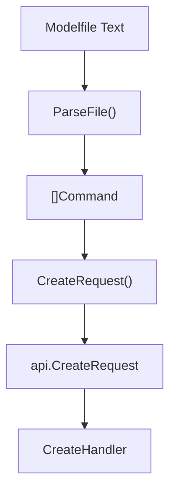
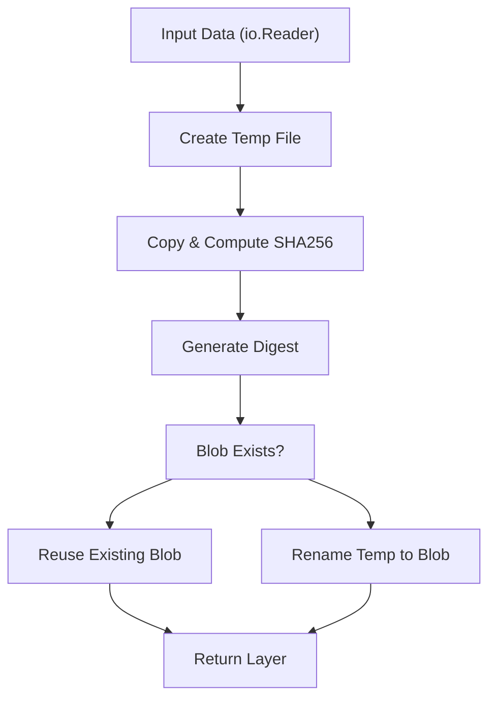
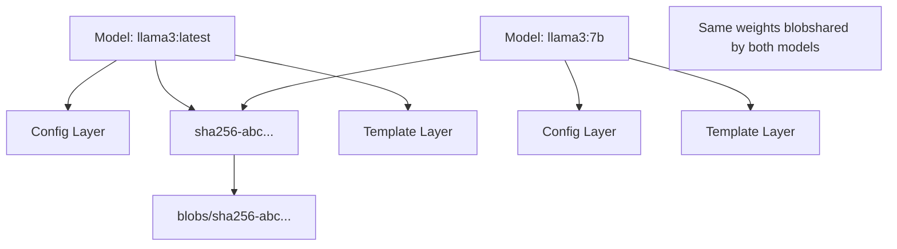
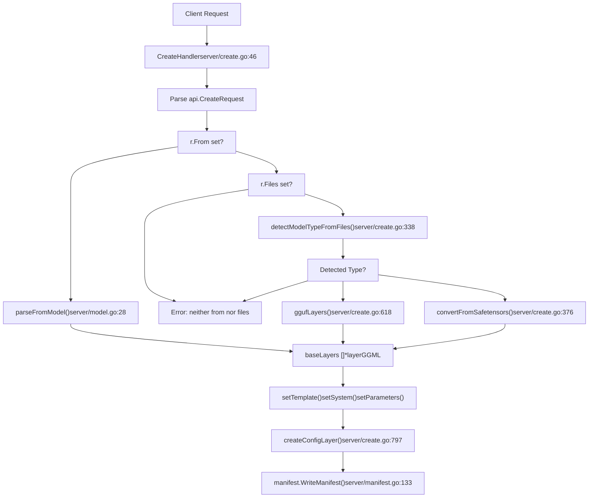
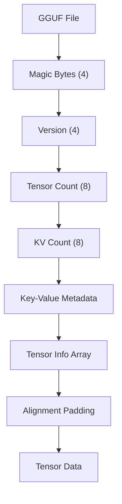
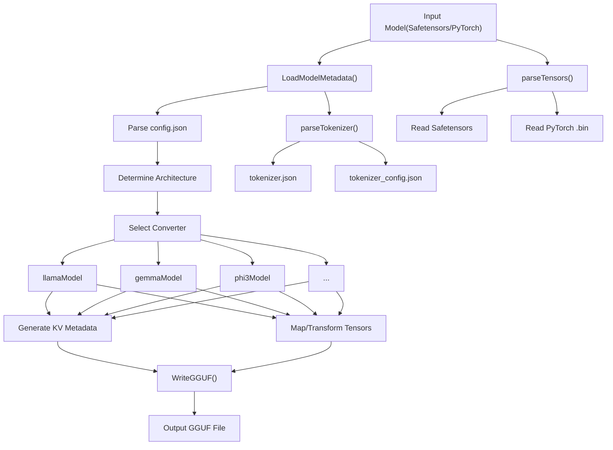
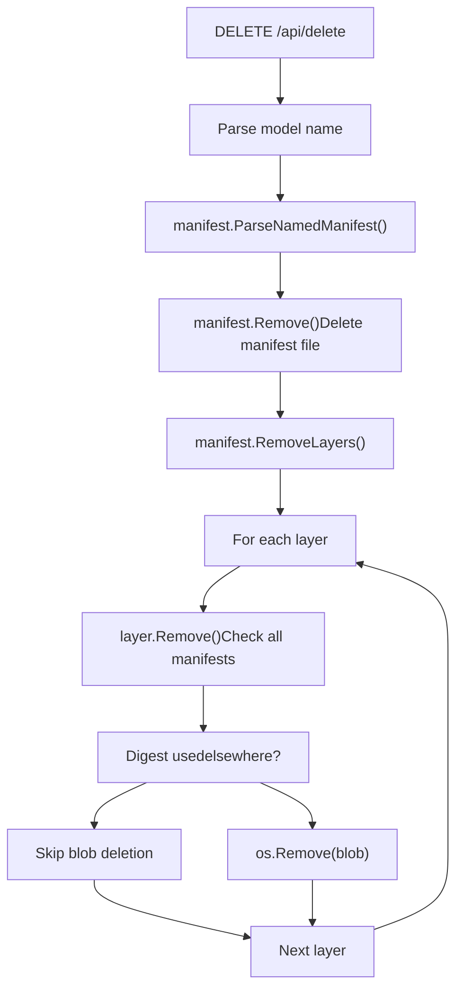

# Model Management

Relevant source files

-   [cmd/cmd\_test.go](https://github.com/ollama/ollama/blob/562c76d7/cmd/cmd_test.go)
-   [convert/convert.go](https://github.com/ollama/ollama/blob/562c76d7/convert/convert.go)
-   [fs/ggml/ggml.go](https://github.com/ollama/ollama/blob/562c76d7/fs/ggml/ggml.go)
-   [fs/ggml/ggml\_test.go](https://github.com/ollama/ollama/blob/562c76d7/fs/ggml/ggml_test.go)
-   [model/models/models.go](https://github.com/ollama/ollama/blob/562c76d7/model/models/models.go)
-   [model/parsers/parsers.go](https://github.com/ollama/ollama/blob/562c76d7/model/parsers/parsers.go)
-   [model/parsers/parsers\_test.go](https://github.com/ollama/ollama/blob/562c76d7/model/parsers/parsers_test.go)
-   [model/renderers/glmocr.go](https://github.com/ollama/ollama/blob/562c76d7/model/renderers/glmocr.go)
-   [model/renderers/glmocr\_test.go](https://github.com/ollama/ollama/blob/562c76d7/model/renderers/glmocr_test.go)
-   [model/renderers/renderer.go](https://github.com/ollama/ollama/blob/562c76d7/model/renderers/renderer.go)
-   [server/create.go](https://github.com/ollama/ollama/blob/562c76d7/server/create.go)
-   [server/model.go](https://github.com/ollama/ollama/blob/562c76d7/server/model.go)
-   [server/routes\_create\_test.go](https://github.com/ollama/ollama/blob/562c76d7/server/routes_create_test.go)
-   [server/routes\_delete\_test.go](https://github.com/ollama/ollama/blob/562c76d7/server/routes_delete_test.go)
-   [server/routes\_list\_test.go](https://github.com/ollama/ollama/blob/562c76d7/server/routes_list_test.go)
-   [server/routes\_test.go](https://github.com/ollama/ollama/blob/562c76d7/server/routes_test.go)

Model management in Ollama handles how models are defined, stored, converted, and organized. This includes:

-   **Model Definition** - Modelfiles define model configuration, parameters, and behavior
-   **Storage** - Content-addressable blob storage with manifest/layer architecture
-   **Conversion** - Import from Safetensors, PyTorch, and GGUF formats
-   **Registry** - Push/pull models to/from remote registries

The system uses a two-tier architecture: manifests describe model composition, while blobs store the actual data. This design enables efficient storage through deduplication - multiple models can share the same base weights.

**Related Documentation:**

-   [Modelfiles (4.1)](/ollama/ollama/4.1-modelfiles) - Modelfile syntax and instructions
-   [Model Registry and Layers (4.2)](/ollama/ollama/4.2-model-registry-and-layers) - Manifest/blob storage system
-   [Model Conversion and Import (4.3)](/ollama/ollama/4.3-model-conversion-and-import) - Converting from external formats
-   [Model File Formats (4.4)](/ollama/ollama/4.4-model-file-formats) - GGUF format details
-   [Blob Transfer and Authentication (4.5)](/ollama/ollama/4.5-blob-transfer-and-authentication) - Registry push/pull operations
-   [LlamaServer and Runner Implementation (5.2)](/ollama/ollama/5.2-llamaserver-and-runner-implementation) - Runtime model loading and execution

## Model Definition with Modelfiles

Models are created using **Modelfiles**, which define the base model, parameters, templates, and behavior. A Modelfile is analogous to a Dockerfile - it specifies how to build a model.

**Basic Modelfile Structure:**

```
FROM llama3.2
PARAMETER temperature 0.8
PARAMETER num_ctx 4096
SYSTEM You are a helpful assistant.
TEMPLATE """{{ .System }} {{ .Prompt }}"""
```
**Modelfile Instructions:**

| Instruction | Purpose | Example |
| --- | --- | --- |
| `FROM` | Specifies base model or file | `FROM llama3.2` |
| `PARAMETER` | Sets inference parameters | `PARAMETER temperature 0.8` |
| `TEMPLATE` | Defines chat template | `TEMPLATE """..."""` |
| `SYSTEM` | Sets system prompt | `SYSTEM You are...` |
| `ADAPTER` | Adds LoRA adapter | `ADAPTER ./adapter.gguf` |
| `LICENSE` | Specifies license | `LICENSE MIT` |
| `MESSAGE` | Pre-fills conversation | `MESSAGE user Hello` |

The parser in [parser/parser.go377-506](https://github.com/ollama/ollama/blob/562c76d7/parser/parser.go#L377-L506) reads Modelfiles and converts them to `api.CreateRequest` structures. For complete Modelfile syntax, see [Modelfiles (4.1)](/ollama/ollama/4.1-modelfiles).

**Modelfile Parsing Flow:**


Sources: [parser/parser.go377-506](https://github.com/ollama/ollama/blob/562c76d7/parser/parser.go#L377-L506) [parser/parser.go55-154](https://github.com/ollama/ollama/blob/562c76d7/parser/parser.go#L55-L154)

## Storage Architecture

Ollama uses a two-tier storage architecture consisting of **manifests** and **blobs**, similar to container image systems like Docker.

### Directory Structure

```
$OLLAMA_MODELS/
├── manifests/
│   └── {host}/{namespace}/{model}/{tag}
└── blobs/
    └── sha256-{digest}
```
The `manifests` directory contains JSON manifest files organized by fully-qualified model names. The `blobs` directory stores content-addressable binary objects referenced by SHA256 digest. See [Model Registry and Layers (4.2)](/ollama/ollama/4.2-model-registry-and-layers) for detailed storage architecture.

Sources: [server/manifest.go1-179](https://github.com/ollama/ollama/blob/562c76d7/server/manifest.go#L1-L179)

### Manifest Format

A manifest describes a complete model, including its configuration and all component layers:

```
type Manifest struct {    SchemaVersion int     `json:"schemaVersion"`    MediaType     string  `json:"mediaType"`    Config        Layer   `json:"config"`    Layers        []Layer `json:"layers"`}
```
The `Config` layer contains model metadata (see [types/model/config.go1-34](https://github.com/ollama/ollama/blob/562c76d7/types/model/config.go#L1-L34)), while `Layers` references the actual model weights, templates, parameters, and other components.

**Layer Media Types:**

| Media Type | Content | Created By |
| --- | --- | --- |
| `application/vnd.ollama.image.model` | Model weights (GGUF) | GGUF import or conversion |
| `application/vnd.ollama.image.projector` | Vision projector weights | Multi-modal models |
| `application/vnd.ollama.image.adapter` | LoRA adapter weights | `ADAPTER` instruction |
| `application/vnd.ollama.image.template` | Chat template | `TEMPLATE` instruction |
| `application/vnd.ollama.image.params` | Model parameters (JSON) | `PARAMETER` instruction |
| `application/vnd.ollama.image.system` | System prompt | `SYSTEM` instruction |
| `application/vnd.ollama.image.license` | License text | `LICENSE` instruction |
| `application/vnd.ollama.image.messages` | Pre-filled conversation | `MESSAGE` instruction |
| `application/vnd.docker.container.image.v1+json` | Config metadata | All models |

Modelfile instructions are converted into manifest layers by [server/create.go468-530](https://github.com/ollama/ollama/blob/562c76d7/server/create.go#L468-L530)

Sources: [server/manifest.go17-26](https://github.com/ollama/ollama/blob/562c76d7/server/manifest.go#L17-L26) [server/create.go649-655](https://github.com/ollama/ollama/blob/562c76d7/server/create.go#L649-L655) [server/create.go468-530](https://github.com/ollama/ollama/blob/562c76d7/server/create.go#L468-L530)

### Layer and Blob System

Each layer is a content-addressable object stored in the `blobs` directory:

```
type Layer struct {    MediaType string `json:"mediaType"`    Digest    string `json:"digest"`    Size      int64  `json:"size"`    From      string `json:"from,omitempty"`}
```
Layers are created by computing the SHA256 digest of their content and storing them at `blobs/sha256-{digest}`. This enables deduplication - if two models share the same weights (e.g., same base model), they reference the same blob.

**Layer Creation Process:**


Sources: [server/layer.go19-65](https://github.com/ollama/ollama/blob/562c76d7/server/layer.go#L19-L65)

### Manifest Operations

**ParseNamedManifest** reads and validates a manifest:

```
func ParseNamedManifest(n model.Name) (*Manifest, error)
```
This function:

1.  Resolves the manifest path from the model name
2.  Opens and parses the JSON manifest
3.  Computes the manifest digest for integrity checking
4.  Returns a `Manifest` struct with metadata

**WriteManifest** atomically creates or updates a manifest:

```
func WriteManifest(name model.Name, config Layer, layers []Layer) error
```
Sources: [server/manifest.go63-124](https://github.com/ollama/ollama/blob/562c76d7/server/manifest.go#L63-L124)

### Content Addressability and Deduplication


When multiple models reference the same blob (identified by digest), only one copy is stored on disk. The layer removal logic in `Layer.Remove()` checks all manifests before deleting a blob to prevent orphaning references.

Sources: [server/layer.go104-130](https://github.com/ollama/ollama/blob/562c76d7/server/layer.go#L104-L130)

## Model Creation Workflow

Model creation is handled by `CreateHandler` in [server/create.go46-259](https://github.com/ollama/ollama/blob/562c76d7/server/create.go#L46-L259) The handler processes `api.CreateRequest` structures generated from Modelfiles.

### Creation Sources

Ollama supports three primary input sources:

1.  **From existing model** - `FROM modelname` - Reuse existing Ollama model
2.  **From GGUF files** - `FROM /path/to/model.gguf` - Import GGUF file
3.  **From Safetensors/PyTorch** - `FROM /path/to/model/` - Convert HuggingFace format

See [Model Conversion and Import (4.3)](/ollama/ollama/4.3-model-conversion-and-import) for detailed conversion processes.

**Model Creation Flow:**


Sources: [server/create.go46-259](https://github.com/ollama/ollama/blob/562c76d7/server/create.go#L46-L259) [server/create.go306-374](https://github.com/ollama/ollama/blob/562c76d7/server/create.go#L306-L374) [server/model.go28-77](https://github.com/ollama/ollama/blob/562c76d7/server/model.go#L28-L77)

### From Existing Model

When creating a model with `From: "model-name"`, Ollama:

1.  **Parses the source model manifest** - [server/model.go27-76](https://github.com/ollama/ollama/blob/562c76d7/server/model.go#L27-L76)
2.  **Loads all layers as layerGGML** - Each layer may include decoded GGML metadata
3.  **Detects chat template** - Auto-detects and applies chat templates from GGUF metadata
4.  **Inherits configuration** - Copies `Renderer`, `Parser`, and `Requires` from base model config

```
func parseFromModel(ctx context.Context, name model.Name,                     fn func(api.ProgressResponse)) (layers []*layerGGML, err error)
```
Sources: [server/model.go27-76](https://github.com/ollama/ollama/blob/562c76d7/server/model.go#L27-L76) [server/create.go99-148](https://github.com/ollama/ollama/blob/562c76d7/server/create.go#L99-L148)

### From GGUF Files

The `ggufLayers()` function in [server/create.go618-666](https://github.com/ollama/ollama/blob/562c76d7/server/create.go#L618-L666) processes GGUF files:

1.  Opens blob via `manifest.BlobsPath(digest)`
2.  Validates GGUF magic bytes with `ggml.DetectContentType()`
3.  Decodes GGUF metadata using `ggml.Decode()`
4.  Determines layer media type from GGUF KV data
5.  Auto-detects chat templates with `detectChatTemplate()`

**Media Type Detection Logic:**

```
// From server/create.go:649-655if kv["general.type"] == "adapter" {    mediaType = "application/vnd.ollama.image.adapter"} else if kv.BlockCount() == 0 && kv.VisionBlockCount() > 0 {    mediaType = "application/vnd.ollama.image.projector"} else {    mediaType = "application/vnd.ollama.image.model"}
```
GGUF format details are covered in [Model File Formats (4.4)](/ollama/ollama/4.4-model-file-formats).

Sources: [server/create.go618-666](https://github.com/ollama/ollama/blob/562c76d7/server/create.go#L618-L666) [fs/ggml/ggml.go497-568](https://github.com/ollama/ollama/blob/562c76d7/fs/ggml/ggml.go#L497-L568)

### From Safetensors/PyTorch

The `convertFromSafetensors()` function in [server/create.go376-457](https://github.com/ollama/ollama/blob/562c76d7/server/create.go#L376-L457) converts HuggingFace models:

**Conversion Sequence:**

> **[Mermaid sequence]**
> *(图表结构无法解析)*

**Conversion Steps:**

1.  Create temp directory and link blobs as files (maintains directory structure)
2.  Load metadata from `config.json` - determines architecture
3.  Parse tokenizer from `tokenizer.json` or `tokenizer.model`
4.  Extract tensors from `.safetensors` or `.bin` files
5.  Write GGUF file with architecture-specific transformations
6.  Create layer and store as blob

Supported architectures include Llama, Mistral, Gemma, Phi3, Qwen2, and more. Full conversion details in [Model Conversion and Import (4.3)](/ollama/ollama/4.3-model-conversion-and-import).

Sources: [server/create.go376-457](https://github.com/ollama/ollama/blob/562c76d7/server/create.go#L376-L457) [convert/convert.go255-372](https://github.com/ollama/ollama/blob/562c76d7/convert/convert.go#L255-L372)

### Quantization

The `quantizeLayer()` function in [server/create.go566-616](https://github.com/ollama/ollama/blob/562c76d7/server/create.go#L566-L616) quantizes F16/F32 models:

```
func quantizeLayer(layer *layerGGML, quantizeType string,                    fn func(resp api.ProgressResponse)) (*layerGGML, error)
```
**Quantization Process:**

-   Opens source GGUF blob
-   Calls native `quantize()` function (interfaces with llama.cpp)
-   Writes quantized GGUF to new temp file
-   Creates new blob layer with quantized weights
-   Returns new layer with updated digest

**Supported Quantization Types:**

-   `Q4_0`, `Q4_1` - 4-bit quantization
-   `Q5_0`, `Q5_1` - 5-bit quantization
-   `Q8_0` - 8-bit quantization
-   `Q4_K_M`, `Q5_K_M`, `Q6_K` - K-quantized variants (better quality)
-   `Q2_K`, `Q3_K_S`, `Q3_K_M` - Aggressive quantization

Quantization provides 4-8x compression with minimal quality loss. Only F16/F32 models can be quantized.

Sources: [server/create.go566-616](https://github.com/ollama/ollama/blob/562c76d7/server/create.go#L566-L616) [server/create.go471-488](https://github.com/ollama/ollama/blob/562c76d7/server/create.go#L471-L488)

### Applying Modelfile Instructions

Modelfile instructions are applied to layers using these functions in [server/create.go683-795](https://github.com/ollama/ollama/blob/562c76d7/server/create.go#L683-L795):

| Function | Modelfile Instruction | Layer Type |
| --- | --- | --- |
| `setTemplate()` | `TEMPLATE` | `application/vnd.ollama.image.template` |
| `setSystem()` | `SYSTEM` | `application/vnd.ollama.image.system` |
| `setLicense()` | `LICENSE` | `application/vnd.ollama.image.license` |
| `setParameters()` | `PARAMETER` | `application/vnd.ollama.image.params` |
| `setMessages()` | `MESSAGE` | `application/vnd.ollama.image.messages` |

**Layer Modification Pattern:**

```
func setTemplate(layers []*layerGGML, template string) ([]*layerGGML, error) {    layers = removeLayer(layers, "application/vnd.ollama.image.template")    layer, err := manifest.NewLayer(strings.NewReader(template), mediaType)    return append(layers, &layerGGML{layer, nil}), nil}
```
Each function removes any existing layer of that type, creates a new blob, and appends it. Parameter merging preserves base model parameters while overriding with new values.

Sources: [server/create.go683-795](https://github.com/ollama/ollama/blob/562c76d7/server/create.go#L683-L795)

## GGUF File Format

GGUF (GGML Universal File) is the native format for model weights in Ollama.

### Format Structure


**File Structure:**

1.  **Header** - Magic bytes `GGUF` (0x46554747 little-endian)
2.  **Version** - Currently version 3
3.  **Tensor count** - Number of tensors in file
4.  **KV count** - Number of metadata key-value pairs
5.  **KV metadata** - Architecture, hyperparameters, tokenizer data
6.  **Tensor descriptors** - Name, type, shape, offset for each tensor
7.  **Tensor data** - Raw tensor bytes (aligned to 32 bytes)

Sources: [fs/ggml/ggml.go497-568](https://github.com/ollama/ollama/blob/562c76d7/fs/ggml/ggml.go#L497-L568)

### Key-Value Metadata

The KV section stores model metadata as typed key-value pairs:

```
type KV map[string]any
```
**Common KV Keys:**

| Key Pattern | Type | Purpose |
| --- | --- | --- |
| `general.architecture` | string | Model architecture (llama, gemma, etc) |
| `general.file_type` | uint32 | Quantization type |
| `general.parameter_count` | uint64 | Total parameter count |
| `{arch}.block_count` | uint32 | Number of transformer blocks |
| `{arch}.embedding_length` | uint32 | Embedding dimension |
| `{arch}.attention.head_count` | uint32 | Number of attention heads |
| `{arch}.context_length` | uint32 | Maximum context length |
| `tokenizer.ggml.tokens` | \[\]string | Token vocabulary |
| `tokenizer.ggml.scores` | \[\]float32 | Token scores |
| `tokenizer.chat_template` | string | Chat template string |

**KV Accessor Methods:**

The `KV` type provides typed accessors with architecture prefix handling:

```
func (kv KV) Architecture() stringfunc (kv KV) BlockCount() uint64func (kv KV) EmbeddingLength() uint64func (kv KV) HeadCount() []uint64func (kv KV) ContextLength() uint64
```
These methods automatically prepend the architecture name to keys (e.g., `"block_count"` → `"llama.block_count"`).

Sources: [fs/ggml/ggml.go32-298](https://github.com/ollama/ollama/blob/562c76d7/fs/ggml/ggml.go#L32-L298)

### Tensor Format

Each tensor in GGUF has:

```
type Tensor struct {    Name   string   // e.g., "blk.0.attn_q.weight"    Kind   uint32   // Data type (F32, F16, Q4_0, etc)    Shape  []uint64 // Dimensions (reversed in GGUF)    Offset uint64   // Byte offset in data section}
```
**Quantization Types:**

| Kind | Name | Description |
| --- | --- | --- |
| 0 | F32 | 32-bit float |
| 1 | F16 | 16-bit float |
| 2 | Q4\_0 | 4-bit quantized (32 element blocks) |
| 3 | Q4\_1 | 4-bit quantized with scale/min |
| 6 | Q5\_0 | 5-bit quantized |
| 7 | Q5\_1 | 5-bit quantized with scale/min |
| 8 | Q8\_0 | 8-bit quantized |
| 10 | Q2\_K | 2-bit K-quantized (256 element blocks) |
| 11 | Q3\_K | 3-bit K-quantized |
| 12 | Q4\_K | 4-bit K-quantized |
| 13 | Q5\_K | 5-bit K-quantized |
| 14 | Q6\_K | 6-bit K-quantized |

The K-quantized formats use 256-element super-blocks with more sophisticated quantization schemes.

Sources: [fs/ggml/ggml.go353-486](https://github.com/ollama/ollama/blob/562c76d7/fs/ggml/ggml.go#L353-L486)

### Decoding GGUF

To read GGUF files:

```
func Decode(rs io.ReadSeeker, maxArraySize int) (*GGML, error)
```
This function:

1.  **Validates magic bytes** - Checks for GGUF signature
2.  **Determines byte order** - Little-endian or big-endian
3.  **Reads metadata** - Parses KV pairs
4.  **Parses tensor info** - Extracts tensor descriptors
5.  **Records data offset** - Stores where tensor data begins

The `maxArraySize` parameter controls whether to collect full array values or just their size (for large vocabularies).

Sources: [fs/ggml/ggml.go530-568](https://github.com/ollama/ollama/blob/562c76d7/fs/ggml/ggml.go#L530-L568)

### Model Architecture Detection

GGUF files identify their architecture through KV metadata:

```
func (kv KV) Architecture() string {    return kv.String("general.architecture", "unknown")}
```
The architecture determines:

-   Which inference engine to use (llama.cpp vs custom Ollama engines)
-   Memory layout and attention mechanism
-   Tokenizer format and special tokens

Some architectures require the Ollama custom engine:

```
func (kv KV) OllamaEngineRequired() bool {    return slices.Contains([]string{        "bert", "deepseek2", "gemma3", "llama4", "mllama",        "qwen3", "qwen3vl", // ...    }, kv.Architecture())}
```
Sources: [fs/ggml/ggml.go34-273](https://github.com/ollama/ollama/blob/562c76d7/fs/ggml/ggml.go#L34-L273)

## Model Conversion System

### Conversion Architecture


Sources: [convert/convert.go255-372](https://github.com/ollama/ollama/blob/562c76d7/convert/convert.go#L255-L372)

### ModelConverter Interface

Each architecture implements the `ModelConverter` interface:

```
type ModelConverter interface {    KV(*Tokenizer) KV    Tensors([]Tensor) []*ggml.Tensor    Replacements() []string    specialTokenTypes() []string}
```
**Interface Methods:**

-   **KV()** - Generates GGUF metadata from model config
-   **Tensors()** - Maps input tensors to GGUF tensors with transformations
-   **Replacements()** - Provides string pairs for tensor name mapping
-   **specialTokenTypes()** - Lists special token types to extract

Sources: [convert/convert.go185-201](https://github.com/ollama/ollama/blob/562c76d7/convert/convert.go#L185-L201)

### Tensor Parsing

Tensors are parsed from source files using format-specific readers:

```
func parseTensors(fsys fs.FS, replacer *strings.Replacer) ([]Tensor, error)
```
**Supported Formats:**

| Pattern | Format | Parser |
| --- | --- | --- |
| `*.safetensors` | Safetensors | `parseSafetensors()` |
| `pytorch_model-*-of-*.bin` | PyTorch sharded | `parseTorch()` |
| `pytorch_model.bin` | PyTorch single | `parseTorch()` |
| `consolidated.*.pth` | PyTorch consolidated | `parseTorch()` |

**Tensor Interface:**

```
type Tensor interface {    Name() string    Shape() []uint64    Kind() uint32    SetRepacker(Repacker)    WriteTo(io.Writer) (int64, error)    Clone() Tensor}
```
Each tensor implementation handles reading from its source format and converting to F32/F16 when writing.

Sources: [convert/reader.go10-94](https://github.com/ollama/ollama/blob/562c76d7/convert/reader.go#L10-L94)

### Safetensors Reader

Safetensors files store tensors with a JSON header:

```
type safetensorMetadata struct {    Type    string   `json:"dtype"`    Shape   []uint64 `json:"shape"`    Offsets []int64  `json:"data_offsets"`}
```
**Reading Process:**

1.  **Read header size** - First 8 bytes (int64)
2.  **Parse JSON metadata** - Maps tensor name to metadata
3.  **Create tensor objects** - Each with file offset and dtype
4.  **Apply name replacements** - Maps Hugging Face names to GGUF names

**Data Type Conversion:**

| Safetensors Type | Conversion | GGUF Type |
| --- | --- | --- |
| F32 | Direct copy | F32 |
| F16 | Direct copy | F16 |
| BF16 | Decode to F32 → Encode to target | F32/F16/BF16 |

Sources: [convert/reader\_safetensors.go26-209](https://github.com/ollama/ollama/blob/562c76d7/convert/reader_safetensors.go#L26-L209)

### Tokenizer Conversion

Tokenizer parsing extracts vocabulary and special tokens:

```
type Tokenizer struct {    *Vocabulary    SpecialVocabulary []*SpecialVocabulary    Merges            []string    Pre               string    Template          string}
```
**Parsing Sources:**

1.  **tokenizer.json** - Primary source (Hugging Face format)
    -   Vocabulary and scores
    -   BPE merges
    -   Added tokens
2.  **tokenizer\_config.json** - Configuration
    -   Chat template
    -   Special token definitions
3.  **tokenizer.model** - SentencePiece format (fallback)
4.  **generation\_config.json** - Special token IDs

**Pre-tokenizer Detection:**

The converter detects pre-tokenization strategy by hashing regex patterns:

| Hash Digest | Pre-tokenizer |
| --- | --- |
| `d98f963...` | llama-bpe |
| `03df5c5...` | deepseek-llm |
| `21cde97...` | deepseek-coder |
| `1ff7f41...` | qwen2 |

Sources: [convert/tokenizer.go36-203](https://github.com/ollama/ollama/blob/562c76d7/convert/tokenizer.go#L36-L203)

### Architecture-Specific Converters

Each architecture converter handles model-specific transformations:

**Llama Converter** - [convert/convert\_llama.go1-185](https://github.com/ollama/ollama/blob/562c76d7/convert/convert_llama.go#L1-L185)

-   RoPE frequency scaling for long context
-   Q/K tensor repacking for GQA attention
-   Rope factors tensor generation

**Gemma Converter** - [convert/convert\_gemma.go1-94](https://github.com/ollama/ollama/blob/562c76d7/convert/convert_gemma.go#L1-L94)

-   Embedding normalization (multiply by sqrt(hidden\_size))
-   Special token configuration

**Phi3 Converter** - [convert/convert\_phi3.go1-119](https://github.com/ollama/ollama/blob/562c76d7/convert/convert_phi3.go#L1-L119)

-   SuRope/LongRope scaling factors
-   Sliding window attention parameters

**Mixtral Converter** - [convert/convert\_mixtral.go1-51](https://github.com/ollama/ollama/blob/562c76d7/convert/convert_mixtral.go#L1-L51)

-   Expert tensor merging (combines per-expert tensors)
-   Expert count and routing configuration

Sources: [convert/convert.go270-316](https://github.com/ollama/ollama/blob/562c76d7/convert/convert.go#L270-L316)

### Adapter Conversion

LoRA adapters follow a similar but distinct conversion path:

```
func ConvertAdapter(fsys fs.FS, f *os.File, baseKV ofs.Config) error
```
**Adapter Process:**

1.  **Parse adapter\_config.json** - Gets LoRA rank and alpha
2.  **Determine base architecture** - Reads from base model KV
3.  **Select adapter converter** - Architecture-specific adapter handling
4.  **Parse LoRA tensors** - Extracts `lora_a` and `lora_b` weights
5.  **Write GGUF** - Stores as `application/vnd.ollama.image.adapter`

**Adapter Metadata:**

```
{    "adapter.lora.alpha": 16.0,    "adapter.type": "lora",    "general.file_type": 1,    "general.type": "adapter"}
```
Sources: [convert/convert.go217-253](https://github.com/ollama/ollama/blob/562c76d7/convert/convert.go#L217-L253)

## Model Operations

### Copy Operation

The `CopyHandler` creates a new model referencing existing layers:

```
// POST /api/copyfunc (s *Server) CopyHandler(c *gin.Context)
```
**Copy Process:**

1.  Parse source and destination model names
2.  Load source manifest with `manifest.ParseNamedManifest()`
3.  Write new manifest with `manifest.WriteManifest()` pointing to same layers
4.  No blob copying - new model references same blobs

This is extremely fast since only the manifest is written.

Sources: [server/routes.go](https://github.com/ollama/ollama/blob/562c76d7/server/routes.go)

### Delete Operation

The `DeleteHandler` removes a model and potentially unused blobs:

```
// DELETE /api/deletefunc (s *Server) DeleteHandler(c *gin.Context)
```
**Deletion Flow:**


The `Layer.Remove()` method in [server/layer.go104-130](https://github.com/ollama/ollama/blob/562c76d7/server/layer.go#L104-L130) scans all manifests before deleting blobs to prevent orphaning references.

Sources: [server/layer.go104-130](https://github.com/ollama/ollama/blob/562c76d7/server/layer.go#L104-L130) [server/manifest.go49-61](https://github.com/ollama/ollama/blob/562c76d7/server/manifest.go#L49-L61)

## Model Metadata

### ConfigV2 Layer

Model configuration is stored in a config layer with media type `application/vnd.docker.container.image.v1+json`. The `ConfigV2` struct in [types/model/config.go1-34](https://github.com/ollama/ollama/blob/562c76d7/types/model/config.go#L1-L34) contains:

```
type ConfigV2 struct {    ModelFormat   string   // "gguf"    ModelFamily   string   // "llama", "gemma", etc    ModelType     string   // "7B", "13B" (parameter size)    FileType      string   // "Q4_K_M", "F16" (quantization)        Renderer      string   // Custom renderer for special output    Parser        string   // Custom parser for special input    Requires      string   // Min Ollama version (e.g. "0.14.0")        RemoteHost    string   // For proxy models    RemoteModel   string        // Docker manifest fields (required)    OS           string    Architecture string    RootFS       RootFS}
```
**Config Usage:**

-   **UI Display** - Shows parameter size and quantization level
-   **Capability Detection** - Determines if model supports tools, vision, etc
-   **Version Checking** - Validates Ollama version compatibility
-   **Remote Proxying** - Routes requests to remote Ollama servers

The config layer is created by `createConfigLayer()` in [server/create.go797-857](https://github.com/ollama/ollama/blob/562c76d7/server/create.go#L797-L857)

Sources: [types/model/config.go1-34](https://github.com/ollama/ollama/blob/562c76d7/types/model/config.go#L1-L34) [server/create.go797-857](https://github.com/ollama/ollama/blob/562c76d7/server/create.go#L797-L857)

### Template Auto-Detection

The `detectChatTemplate()` function in [server/model.go79-111](https://github.com/ollama/ollama/blob/562c76d7/server/model.go#L79-L111) auto-detects chat templates from GGUF metadata:

```
func detectChatTemplate(layers []*layerGGML) ([]*layerGGML, error)
```
**Detection Process:**

1.  Read `tokenizer.chat_template` from GGUF KV metadata
2.  Match template string against `template.Named()` registry
3.  Create template layer if match found
4.  Add parameters layer with template-specific stop tokens

**Common Auto-Detected Templates:**

| Template Name | Models | Stop Tokens |
| --- | --- | --- |
| `llama3` | Llama 3.x | `<|eot_id|>`, `<|start_header_id|>` |
| `chatml` | Qwen, Yi | `<|im_end|>`, `<|im_start|>` |
| `gemma` | Gemma 1/2 | `<end_of_turn>`, `<start_of_turn>` |
| `command-r` | Command-R | Custom markers |

Template auto-detection ensures proper chat formatting without manual configuration.

Sources: [server/model.go79-111](https://github.com/ollama/ollama/blob/562c76d7/server/model.go#L79-L111) [template/template.go](https://github.com/ollama/ollama/blob/562c76d7/template/template.go)

### Memory Estimation

GGUF provides memory estimation for inference:

```
func (f GGML) GraphSize(context, batch uint64, numParallel int,                         kvCacheType string, useFlashAttention ml.FlashAttentionType)     (kv []uint64, partialOffload, fullOffload uint64)
```
**Memory Components:**

1.  **KV cache** - Per-layer cache size for context
2.  **Partial offload** - Memory needed for partial GPU offload
3.  **Full offload** - Memory needed for full GPU offload

The calculation accounts for:

-   Architecture-specific memory patterns
-   Attention mechanism (MHA, GQA, MQA)
-   Context length and batch size
-   KV cache quantization (q8\_0, q4\_0)
-   Flash attention usage

Sources: [fs/ggml/ggml.go570-818](https://github.com/ollama/ollama/blob/562c76d7/fs/ggml/ggml.go#L570-L818)

---

This comprehensive model management system enables Ollama to efficiently store, convert, and manage machine learning models across diverse architectures and formats while maintaining content addressability and deduplication.
