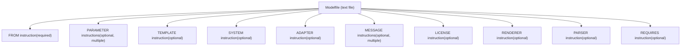
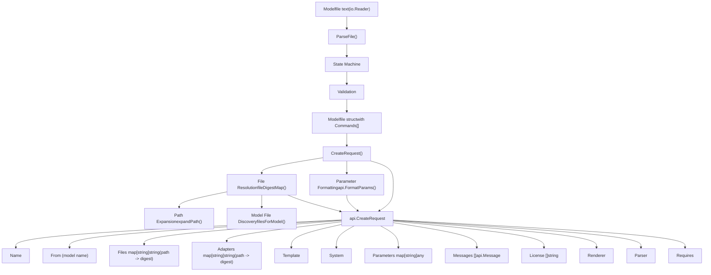
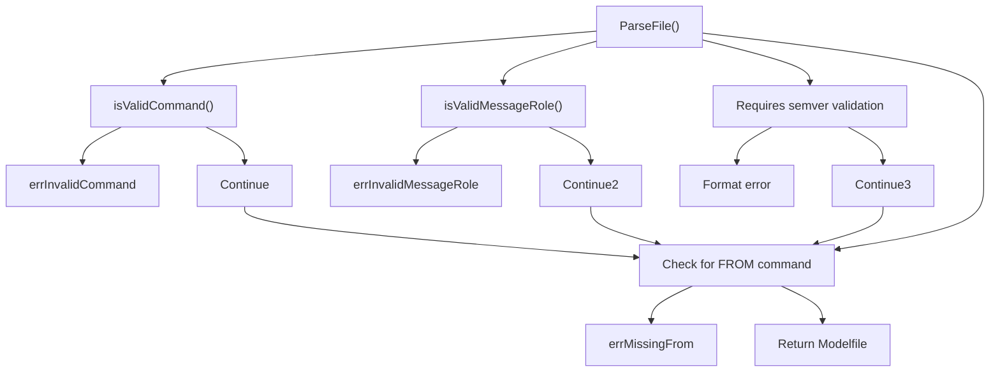
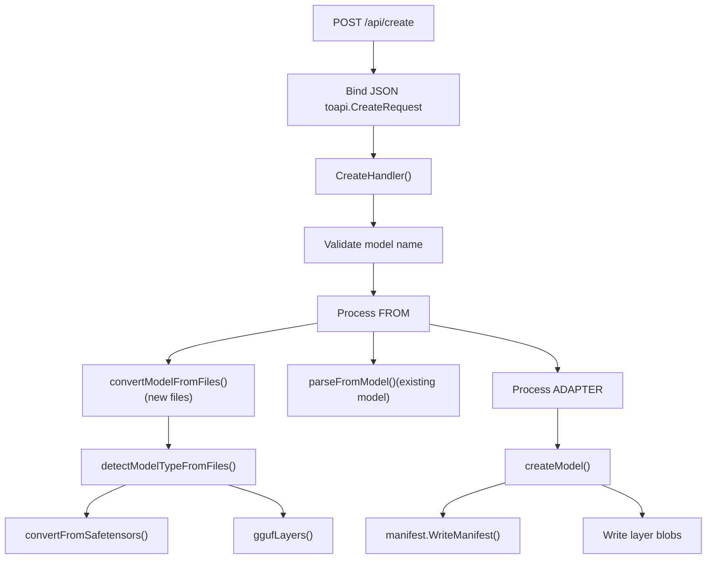

# Modelfiles

Relevant source files

-   [README.md](https://github.com/ollama/ollama/blob/562c76d7/README.md?plain=1)
-   [docs/README.md](https://github.com/ollama/ollama/blob/562c76d7/docs/README.md?plain=1)
-   [docs/api.md](https://github.com/ollama/ollama/blob/562c76d7/docs/api.md?plain=1)
-   [docs/development.md](https://github.com/ollama/ollama/blob/562c76d7/docs/development.md?plain=1)
-   [docs/images/ollama-keys.png](https://github.com/ollama/ollama/blob/562c76d7/docs/images/ollama-keys.png)
-   [docs/images/signup.png](https://github.com/ollama/ollama/blob/562c76d7/docs/images/signup.png)
-   [parser/expandpath\_test.go](https://github.com/ollama/ollama/blob/562c76d7/parser/expandpath_test.go)
-   [parser/parser.go](https://github.com/ollama/ollama/blob/562c76d7/parser/parser.go)
-   [parser/parser\_test.go](https://github.com/ollama/ollama/blob/562c76d7/parser/parser_test.go)

A Modelfile is a text-based configuration file that defines how to create and customize models in Ollama. Modelfiles specify the base model, parameters, system prompts, templates, adapters, and other configuration needed to create a new model variant. They serve as blueprints that are parsed and converted into model creation requests.

For information about the model creation process and layer management, see [Model Registry and Layers](/ollama/ollama/4.2-model-registry-and-layers). For details on the API endpoints that consume Modelfiles, see [Model Management API](/ollama/ollama/3.1-model-management-api).

## Modelfile Structure and Syntax

### Basic Format

A Modelfile consists of instruction lines following the format:

```
INSTRUCTION arguments
```
Instructions are case-insensitive and can appear in any order, though the `FROM` instruction is required. Comments begin with `#`.

**Example Modelfile:**

```
FROM llama3.2
PARAMETER temperature 1.0
PARAMETER num_ctx 4096
SYSTEM You are a helpful assistant.
TEMPLATE """{{ .System }} {{ .Prompt }}"""
```
### Modelfile Structure Diagram


Sources: [parser/parser.go30-41](https://github.com/ollama/ollama/blob/562c76d7/parser/parser.go#L30-L41) [parser/parser.go326-346](https://github.com/ollama/ollama/blob/562c76d7/parser/parser.go#L326-L346) [docs/modelfile.mdx26-44](https://github.com/ollama/ollama/blob/562c76d7/docs/modelfile.mdx?plain=1#L26-L44)

## Parsing Architecture

### Parser State Machine

The Modelfile parser implements a state machine that processes input character by character. The parser is defined in [parser/parser.go](https://github.com/ollama/ollama/blob/562c76d7/parser/parser.go) and uses the following states:

| State | Description |
| --- | --- |
| `stateNil` | Initial state, waiting for instruction |
| `stateName` | Reading instruction name |
| `stateValue` | Reading instruction argument value |
| `stateParameter` | Reading parameter name after PARAMETER instruction |
| `stateMessage` | Reading message role after MESSAGE instruction |
| `stateComment` | Skipping comment line |

> **[Mermaid stateDiagram]**
> *(图表结构无法解析)*

Sources: [parser/parser.go348-357](https://github.com/ollama/ollama/blob/562c76d7/parser/parser.go#L348-L357) [parser/parser.go508-565](https://github.com/ollama/ollama/blob/562c76d7/parser/parser.go#L508-L565)

### Core Parser Components

The parser consists of these key structures and functions:

**Modelfile Structure:**

```
type Modelfile struct {
    Commands []Command
}
```
[parser/parser.go30-32](https://github.com/ollama/ollama/blob/562c76d7/parser/parser.go#L30-L32)

**Command Structure:**

```
type Command struct {
    Name string
    Args string
}
```
[parser/parser.go326-329](https://github.com/ollama/ollama/blob/562c76d7/parser/parser.go#L326-L329)

**Main Parsing Function:**

-   `ParseFile(r io.Reader) (*Modelfile, error)` - Parses a Modelfile from an `io.Reader`, handling UTF-8 and UTF-16 (with BOM) encodings [parser/parser.go377-506](https://github.com/ollama/ollama/blob/562c76d7/parser/parser.go#L377-L506)

**State Transition Logic:**

-   `parseRuneForState(r rune, cs state) (state, rune, error)` - Determines state transitions based on current state and input character [parser/parser.go508-565](https://github.com/ollama/ollama/blob/562c76d7/parser/parser.go#L508-L565)

**Validation Functions:**

-   `isValidCommand(cmd string) bool` - Validates instruction names [parser/parser.go620-627](https://github.com/ollama/ollama/blob/562c76d7/parser/parser.go#L620-L627)
-   `isValidMessageRole(role string) bool` - Validates message roles (system, user, assistant) [parser/parser.go616-618](https://github.com/ollama/ollama/blob/562c76d7/parser/parser.go#L616-L618)

Sources: [parser/parser.go30-32](https://github.com/ollama/ollama/blob/562c76d7/parser/parser.go#L30-L32) [parser/parser.go326-329](https://github.com/ollama/ollama/blob/562c76d7/parser/parser.go#L326-L329) [parser/parser.go377-506](https://github.com/ollama/ollama/blob/562c76d7/parser/parser.go#L377-L506) [parser/parser.go508-565](https://github.com/ollama/ollama/blob/562c76d7/parser/parser.go#L508-L565)

## Instruction Reference

### FROM Instruction (Required)

The `FROM` instruction specifies the base model or model files to use. It is the only required instruction and must appear at least once. The parser converts `FROM` commands to a `model` command internally.

**Formats:**

1.  **Existing model name:**

    ```
    FROM llama3:latest
    FROM registry.ollama.ai/library/mistral:7b
    ```

2.  **Local file path (GGUF or directory):**

    ```
    FROM ./my-model.gguf
    FROM /absolute/path/to/model.gguf
    FROM ./model-directory
    ```

3.  **User home directory expansion:**

    ```
    FROM ~/models/my-model.gguf
    FROM ~username/models/my-model.gguf
    ```


The parser performs path expansion using `expandPath()` [parser/parser.go666-668](https://github.com/ollama/ollama/blob/562c76d7/parser/parser.go#L666-L668) which handles:

-   Absolute paths
-   Relative paths (relative to Modelfile location)
-   Tilde expansion for home directories

When a model name is provided, the parser checks if it references local files using `fileDigestMap()` [parser/parser.go157-215](https://github.com/ollama/ollama/blob/562c76d7/parser/parser.go#L157-L215) For directories, it discovers model files using `filesForModel()` [parser/parser.go236-324](https://github.com/ollama/ollama/blob/562c76d7/parser/parser.go#L236-L324) which looks for:

-   `.safetensors` files (model\*.safetensors, consolidated\*.safetensors)
-   `.bin` files (pytorch\_model\*.bin, consolidated\*.pth)
-   `.gguf` files
-   `.json` configuration files
-   `tokenizer.model` files

Sources: [parser/parser.go64-85](https://github.com/ollama/ollama/blob/562c76d7/parser/parser.go#L64-L85) [parser/parser.go157-215](https://github.com/ollama/ollama/blob/562c76d7/parser/parser.go#L157-L215) [parser/parser.go236-324](https://github.com/ollama/ollama/blob/562c76d7/parser/parser.go#L236-L324) [parser/parser.go629-668](https://github.com/ollama/ollama/blob/562c76d7/parser/parser.go#L629-L668) [docs/modelfile.mdx96-139](https://github.com/ollama/ollama/blob/562c76d7/docs/modelfile.mdx?plain=1#L96-L139)

### PARAMETER Instruction

The `PARAMETER` instruction sets inference parameters. Multiple `PARAMETER` instructions can be specified. Parameters are collected in a map and array values (like `stop` sequences) can be specified multiple times.

**Format:**

```
PARAMETER <name> <value>
```
**Deprecated parameters** (warned but accepted):

-   `penalize_newline`, `low_vram`, `f16_kv`, `logits_all`, `vocab_only`, `use_mlock`, `mirostat`, `mirostat_tau`, `mirostat_eta` [parser/parser.go43-53](https://github.com/ollama/ollama/blob/562c76d7/parser/parser.go#L43-L53)

**Common parameters:**

| Parameter | Type | Description | Example |
| --- | --- | --- | --- |
| `num_ctx` | int | Context window size | `PARAMETER num_ctx 4096` |
| `temperature` | float | Sampling temperature (creativity) | `PARAMETER temperature 0.8` |
| `top_k` | int | Top-k sampling | `PARAMETER top_k 40` |
| `top_p` | float | Top-p (nucleus) sampling | `PARAMETER top_p 0.9` |
| `min_p` | float | Minimum probability threshold | `PARAMETER min_p 0.05` |
| `seed` | int | Random seed | `PARAMETER seed 42` |
| `stop` | string | Stop sequence (can specify multiple) | `PARAMETER stop "###"` |
| `num_predict` | int | Maximum tokens to generate | `PARAMETER num_predict 128` |
| `repeat_penalty` | float | Repetition penalty | `PARAMETER repeat_penalty 1.1` |

Parameters are converted using `api.FormatParams()` during `CreateRequest()` generation [parser/parser.go127-140](https://github.com/ollama/ollama/blob/562c76d7/parser/parser.go#L127-L140)

Sources: [parser/parser.go43-53](https://github.com/ollama/ollama/blob/562c76d7/parser/parser.go#L43-L53) [parser/parser.go122-141](https://github.com/ollama/ollama/blob/562c76d7/parser/parser.go#L122-L141) [docs/modelfile.mdx141-162](https://github.com/ollama/ollama/blob/562c76d7/docs/modelfile.mdx?plain=1#L141-L162)

### TEMPLATE Instruction

The `TEMPLATE` instruction defines the prompt template used to format messages for the model. Templates use Go template syntax and support special variables.

**Format:**

```
TEMPLATE """<template string>"""
```
**Template variables:**

| Variable | Description |
| --- | --- |
| `{{ .System }}` | System message |
| `{{ .Prompt }}` | User prompt |
| `{{ .Response }}` | Model response (omitted during generation) |

**Example:**

```
TEMPLATE """{{ if .System }}<|start_header_id|>system<|end_header_id|>

{{ .System }}<|eot_id|>{{ end }}{{ if .Prompt }}<|start_header_id|>user<|end_header_id|>

{{ .Prompt }}<|eot_id|>{{ end }}<|start_header_id|>assistant<|end_header_id|>

{{ .Response }}<|eot_id|>"""
```
The template is stored in `CreateRequest.Template` [parser/parser.go98-99](https://github.com/ollama/ollama/blob/562c76d7/parser/parser.go#L98-L99)

Sources: [parser/parser.go98-99](https://github.com/ollama/ollama/blob/562c76d7/parser/parser.go#L98-L99) [docs/modelfile.mdx164-183](https://github.com/ollama/ollama/blob/562c76d7/docs/modelfile.mdx?plain=1#L164-L183)

### SYSTEM Instruction

The `SYSTEM` instruction sets a default system message that guides the model's behavior.

**Format:**

```
SYSTEM """<system message>"""
```
**Example:**

```
SYSTEM """You are a helpful AI assistant specializing in code review."""
```
The system message is stored in `CreateRequest.System` [parser/parser.go100-101](https://github.com/ollama/ollama/blob/562c76d7/parser/parser.go#L100-L101)

Sources: [parser/parser.go100-101](https://github.com/ollama/ollama/blob/562c76d7/parser/parser.go#L100-L101) [docs/modelfile.mdx185-191](https://github.com/ollama/ollama/blob/562c76d7/docs/modelfile.mdx?plain=1#L185-L191)

### ADAPTER Instruction

The `ADAPTER` instruction specifies LoRA or QLoRA adapters to apply to the base model. Adapters can be in Safetensors or GGUF format.

**Format:**

```
ADAPTER <path>
```
**Example:**

```
ADAPTER ./my-lora-adapter
ADAPTER ./adapter.gguf
```
Adapter files are processed using `fileDigestMap()` similar to model files. The digests are stored in `CreateRequest.Adapters` as a map [parser/parser.go86-97](https://github.com/ollama/ollama/blob/562c76d7/parser/parser.go#L86-L97)

During model creation, only one GGUF adapter is currently supported [server/create.go318-320](https://github.com/ollama/ollama/blob/562c76d7/server/create.go#L318-L320)

Sources: [parser/parser.go86-97](https://github.com/ollama/ollama/blob/562c76d7/parser/parser.go#L86-L97) [server/create.go306-336](https://github.com/ollama/ollama/blob/562c76d7/server/create.go#L306-L336) [docs/modelfile.mdx193-213](https://github.com/ollama/ollama/blob/562c76d7/docs/modelfile.mdx?plain=1#L193-L213)

### LICENSE Instruction

The `LICENSE` instruction specifies the legal license text for the model. Multiple license instructions can be specified and they are concatenated.

**Format:**

```
LICENSE """<license text>"""
```
**Example:**

```
LICENSE """MIT License

Copyright (c) 2024 Example

Permission is hereby granted..."""
```
Licenses are collected in an array and stored in `CreateRequest.License` [parser/parser.go102-103](https://github.com/ollama/ollama/blob/562c76d7/parser/parser.go#L102-L103) [parser/parser.go150-152](https://github.com/ollama/ollama/blob/562c76d7/parser/parser.go#L150-L152)

Sources: [parser/parser.go102-103](https://github.com/ollama/ollama/blob/562c76d7/parser/parser.go#L102-L103) [parser/parser.go150-152](https://github.com/ollama/ollama/blob/562c76d7/parser/parser.go#L150-L152) [docs/modelfile.mdx215-223](https://github.com/ollama/ollama/blob/562c76d7/docs/modelfile.mdx?plain=1#L215-L223)

### MESSAGE Instruction

The `MESSAGE` instruction adds example conversation history to guide the model's responses. Messages have a role (system, user, or assistant) and content.

**Format:**

```
MESSAGE <role> <content>
```
**Valid roles:**

-   `system` - System-level instructions
-   `user` - Example user messages
-   `assistant` - Example model responses

**Example:**

```
MESSAGE user What is the capital of France?
MESSAGE assistant Paris is the capital of France.
MESSAGE user What about Germany?
MESSAGE assistant Berlin is the capital of Germany.
```
Messages are parsed with role validation [parser/parser.go438-446](https://github.com/ollama/ollama/blob/562c76d7/parser/parser.go#L438-L446) and stored as `api.Message` structs in `CreateRequest.Messages` [parser/parser.go118-120](https://github.com/ollama/ollama/blob/562c76d7/parser/parser.go#L118-L120) [parser/parser.go147-149](https://github.com/ollama/ollama/blob/562c76d7/parser/parser.go#L147-L149)

Sources: [parser/parser.go118-120](https://github.com/ollama/ollama/blob/562c76d7/parser/parser.go#L118-L120) [parser/parser.go147-149](https://github.com/ollama/ollama/blob/562c76d7/parser/parser.go#L147-L149) [parser/parser.go438-446](https://github.com/ollama/ollama/blob/562c76d7/parser/parser.go#L438-L446) [docs/modelfile.mdx225-250](https://github.com/ollama/ollama/blob/562c76d7/docs/modelfile.mdx?plain=1#L225-L250)

### RENDERER Instruction

The `RENDERER` instruction specifies a custom renderer for the model. This is used by Ollama to determine how to render model outputs.

**Format:**

```
RENDERER <renderer-name>
```
The renderer is stored in `CreateRequest.Renderer` [parser/parser.go104-105](https://github.com/ollama/ollama/blob/562c76d7/parser/parser.go#L104-L105) and eventually in `ConfigV2.Renderer` [types/model/config.go10](https://github.com/ollama/ollama/blob/562c76d7/types/model/config.go#L10-L10)

Sources: [parser/parser.go104-105](https://github.com/ollama/ollama/blob/562c76d7/parser/parser.go#L104-L105) [types/model/config.go10](https://github.com/ollama/ollama/blob/562c76d7/types/model/config.go#L10-L10)

### PARSER Instruction

The `PARSER` instruction specifies a custom parser for the model. This is used by Ollama to determine how to parse model inputs.

**Format:**

```
PARSER <parser-name>
```
The parser is stored in `CreateRequest.Parser` [parser/parser.go106-107](https://github.com/ollama/ollama/blob/562c76d7/parser/parser.go#L106-L107) and eventually in `ConfigV2.Parser` [types/model/config.go11](https://github.com/ollama/ollama/blob/562c76d7/types/model/config.go#L11-L11)

Sources: [parser/parser.go106-107](https://github.com/ollama/ollama/blob/562c76d7/parser/parser.go#L106-L107) [types/model/config.go11](https://github.com/ollama/ollama/blob/562c76d7/types/model/config.go#L11-L11)

### REQUIRES Instruction

The `REQUIRES` instruction specifies the minimum version of Ollama required to use the model. The version must be a valid semantic version.

**Format:**

```
REQUIRES <version>
```
**Example:**

```
REQUIRES 0.14.0
```
The version is validated using `semver.IsValid()` and stored in `CreateRequest.Requires` [parser/parser.go108-117](https://github.com/ollama/ollama/blob/562c76d7/parser/parser.go#L108-L117) and `ConfigV2.Requires` [types/model/config.go12](https://github.com/ollama/ollama/blob/562c76d7/types/model/config.go#L12-L12)

Sources: [parser/parser.go108-117](https://github.com/ollama/ollama/blob/562c76d7/parser/parser.go#L108-L117) [types/model/config.go12](https://github.com/ollama/ollama/blob/562c76d7/types/model/config.go#L12-L12) [docs/modelfile.mdx252-260](https://github.com/ollama/ollama/blob/562c76d7/docs/modelfile.mdx?plain=1#L252-L260)

## String Quoting and Multiline Text

### Quoting Rules

The parser supports three quoting styles for instruction arguments:

1.  **Unquoted** - Simple values without spaces or special characters:

    ```
    FROM llama3
    PARAMETER temperature 0.8
    ```

2.  **Double quoted** - Values with spaces or that should preserve leading/trailing whitespace:

    ```
    SYSTEM "You are a helpful assistant."
    ```

3.  **Triple quoted** - Multiline values with preserved formatting:

    ```
    TEMPLATE """
    {{ .System }}
    {{ .Prompt }}
    """
    ```


### Quote Processing Functions

The parser uses two helper functions for quote handling:

**quote(s string) string** [parser/parser.go567-577](https://github.com/ollama/ollama/blob/562c76d7/parser/parser.go#L567-L577)

-   Adds quotes when needed for output formatting
-   Uses triple quotes if string contains newlines or double quotes
-   Uses double quotes if string has leading/trailing spaces
-   Returns unquoted string otherwise

**unquote(s string) (string, bool)** [parser/parser.go579-598](https://github.com/ollama/ollama/blob/562c76d7/parser/parser.go#L579-L598)

-   Removes quote delimiters from parsed strings
-   Handles triple quotes (`"""..."""`)
-   Handles double quotes (`"..."`)
-   Returns unquoted content and success boolean

When parsing, the parser accumulates characters into a buffer and calls `unquote()` when transitioning from `stateValue` to `stateNil` [parser/parser.go450-465](https://github.com/ollama/ollama/blob/562c76d7/parser/parser.go#L450-L465)

Sources: [parser/parser.go450-465](https://github.com/ollama/ollama/blob/562c76d7/parser/parser.go#L450-L465) [parser/parser.go567-598](https://github.com/ollama/ollama/blob/562c76d7/parser/parser.go#L567-L598)

## Modelfile to CreateRequest Transformation


### CreateRequest Method

The `CreateRequest(relativeDir string)` method [parser/parser.go56-155](https://github.com/ollama/ollama/blob/562c76d7/parser/parser.go#L56-L155) converts a parsed `Modelfile` into an `api.CreateRequest` that can be sent to the server. The method:

1.  **Processes FROM commands** - Resolves file paths and generates SHA256 digests for local files
2.  **Processes ADAPTER commands** - Similar to FROM, resolves adapter file paths
3.  **Collects parameters** - Formats and merges parameters using `api.FormatParams()`
4.  **Accumulates messages** - Builds message history array
5.  **Collects licenses** - Combines multiple license texts
6.  **Sets template and system** - Direct assignment
7.  **Sets metadata** - Renderer, parser, requires fields

**File Digest Calculation:**

For local file paths, the parser generates SHA256 digests [parser/parser.go217-234](https://github.com/ollama/ollama/blob/562c76d7/parser/parser.go#L217-L234):

```
sha256:<hex-encoded-hash>
```
These digests are used to reference blobs in the model storage system.

Sources: [parser/parser.go56-155](https://github.com/ollama/ollama/blob/562c76d7/parser/parser.go#L56-L155) [parser/parser.go157-234](https://github.com/ollama/ollama/blob/562c76d7/parser/parser.go#L157-L234)

## File Discovery and Content Type Detection

### Model File Discovery

When a directory is specified in `FROM` or `ADAPTER`, the parser searches for supported file types using `filesForModel()` [parser/parser.go236-324](https://github.com/ollama/ollama/blob/562c76d7/parser/parser.go#L236-L324) The function:

1.  **Searches for model weights** in priority order:

    -   Safetensors: `model*.safetensors`, `consolidated*.safetensors`
    -   PyTorch: `pytorch_model*.bin`, `consolidated*.pth`
    -   GGUF: `*.gguf`, `*.bin` (with GGUF magic bytes)
2.  **Adds configuration files:**

    -   All `*.json` files in the directory
    -   Nested `*.json` files (for models like BERT)
3.  **Adds tokenizer files:**

    -   `tokenizer.model` files
    -   Nested `tokenizer.model` files
4.  **Validates content types** using `http.DetectContentType()` to ensure files aren't Git LFS references or incorrect formats


### Content Type Detection

The `detectContentType()` helper [parser/parser.go237-253](https://github.com/ollama/ollama/blob/562c76d7/parser/parser.go#L237-L253) reads the first 512 bytes of a file and uses HTTP content type detection. This prevents issues with Git LFS pointer files that appear to be model files but are actually text.

### Path Security

The parser validates that file paths are safe using:

-   `filepath.IsLocal()` - Ensures paths don't escape the base directory [parser/parser.go183-185](https://github.com/ollama/ollama/blob/562c76d7/parser/parser.go#L183-L185)
-   `filepath.EvalSymlinks()` - Resolves symbolic links before processing [parser/parser.go173-176](https://github.com/ollama/ollama/blob/562c76d7/parser/parser.go#L173-L176) [parser/parser.go218-221](https://github.com/ollama/ollama/blob/562c76d7/parser/parser.go#L218-L221)

This prevents directory traversal attacks through malicious Modelfile paths.

Sources: [parser/parser.go157-215](https://github.com/ollama/ollama/blob/562c76d7/parser/parser.go#L157-L215) [parser/parser.go236-324](https://github.com/ollama/ollama/blob/562c76d7/parser/parser.go#L236-L324)

## Error Handling

The parser defines custom error types and returns specific errors for common failure cases:

**Parser Errors:**

| Error | Constant | Description |
| --- | --- | --- |
| `errMissingFrom` | `"no FROM line"` | Modelfile missing required FROM instruction |
| `errInvalidCommand` | `"command must be one of..."` | Invalid instruction name |
| `errInvalidMessageRole` | `"message role must be..."` | Invalid MESSAGE role |

**ParserError Type:**

The `ParserError` struct [parser/parser.go365-375](https://github.com/ollama/ollama/blob/562c76d7/parser/parser.go#L365-L375) includes line number information:

```
type ParserError struct {
    LineNumber int
    Msg        string
}
```
This allows precise error reporting with line numbers for debugging invalid Modelfiles.

**Validation Flow:**


Sources: [parser/parser.go359-375](https://github.com/ollama/ollama/blob/562c76d7/parser/parser.go#L359-L375) [parser/parser.go499-506](https://github.com/ollama/ollama/blob/562c76d7/parser/parser.go#L499-L506) [parser/parser.go615-627](https://github.com/ollama/ollama/blob/562c76d7/parser/parser.go#L615-L627)

## Integration with Model Creation

The parsed Modelfile is consumed by the server's `CreateHandler` [server/create.go46-259](https://github.com/ollama/ollama/blob/562c76d7/server/create.go#L46-L259) which:

1.  **Receives CreateRequest** from API or parsed Modelfile
2.  **Validates model name** using `model.ParseName()` and `name.IsValid()`
3.  **Processes FROM**:
    -   If FROM is a model name: calls `parseFromModel()` to load existing model layers
    -   If FROM is files: calls `convertModelFromFiles()` to convert Safetensors or GGUF files
4.  **Processes ADAPTER** (if present): converts adapter files
5.  **Merges configuration** including renderer, parser, and requires fields
6.  **Creates model layers** and writes manifest


Sources: [server/create.go46-259](https://github.com/ollama/ollama/blob/562c76d7/server/create.go#L46-L259) [server/create.go306-336](https://github.com/ollama/ollama/blob/562c76d7/server/create.go#L306-L336) [server/model.go28-77](https://github.com/ollama/ollama/blob/562c76d7/server/model.go#L28-L77)

## Usage Examples

### Creating a Model from Modelfile

**Command line:**

```
ollama create mymodel -f ./Modelfile
```
**Modelfile content:**

```
FROM llama3.2
PARAMETER temperature 0.9
PARAMETER top_p 0.95
SYSTEM You are an expert programmer.
```
### Creating with Custom Template

```
FROM mistral
TEMPLATE """<s>[INST] {{ .System }}
{{ .Prompt }} [/INST] {{ .Response }}</s>"""
SYSTEM You are a helpful coding assistant.
```
### Creating with Adapters

```
FROM llama3:7b
ADAPTER ./my-code-lora
PARAMETER temperature 0.7
```
### Creating from Local GGUF

```
FROM ./llama-3-8b-instruct-q4_0.gguf
PARAMETER num_ctx 8192
```
### Creating from Safetensors Directory

```
FROM ./Meta-Llama-3-8B-Instruct
PARAMETER temperature 0.8
MESSAGE user Hello
MESSAGE assistant Hi! How can I help you today?
```
Sources: [docs/modelfile.mdx46-93](https://github.com/ollama/ollama/blob/562c76d7/docs/modelfile.mdx?plain=1#L46-L93) [parser/parser\_test.go28-59](https://github.com/ollama/ollama/blob/562c76d7/parser/parser_test.go#L28-L59)

## Testing

The parser includes comprehensive tests in [parser/parser\_test.go](https://github.com/ollama/ollama/blob/562c76d7/parser/parser_test.go):

-   **Basic parsing** - Instructions, parameters, quoting [parser/parser\_test.go28-92](https://github.com/ollama/ollama/blob/562c76d7/parser/parser_test.go#L28-L92)
-   **FROM variations** - Model names, paths, validation [parser/parser\_test.go94-173](https://github.com/ollama/ollama/blob/562c76d7/parser/parser_test.go#L94-L173)
-   **Quoting** - Single, double, and triple quotes with edge cases [parser/parser\_test.go348-499](https://github.com/ollama/ollama/blob/562c76d7/parser/parser_test.go#L348-L499)
-   **Parameters** - All parameter types and values [parser/parser\_test.go502-551](https://github.com/ollama/ollama/blob/562c76d7/parser/parser_test.go#L502-L551)
-   **Messages** - Role validation and content parsing [parser/parser\_test.go232-346](https://github.com/ollama/ollama/blob/562c76d7/parser/parser_test.go#L232-L346)
-   **UTF encoding** - UTF-8, UTF-16 LE/BE with BOM [parser/parser\_test.go642-703](https://github.com/ollama/ollama/blob/562c76d7/parser/parser_test.go#L642-L703)
-   **Error cases** - Missing FROM, invalid commands, incomplete quotes [parser/parser\_test.go176-202](https://github.com/ollama/ollama/blob/562c76d7/parser/parser_test.go#L176-L202)

Integration tests in [server/routes\_create\_test.go](https://github.com/ollama/ollama/blob/562c76d7/server/routes_create_test.go) verify end-to-end model creation from Modelfiles.

Sources: [parser/parser\_test.go1-27](https://github.com/ollama/ollama/blob/562c76d7/parser/parser_test.go#L1-L27) [server/routes\_create\_test.go1-30](https://github.com/ollama/ollama/blob/562c76d7/server/routes_create_test.go#L1-L30)
