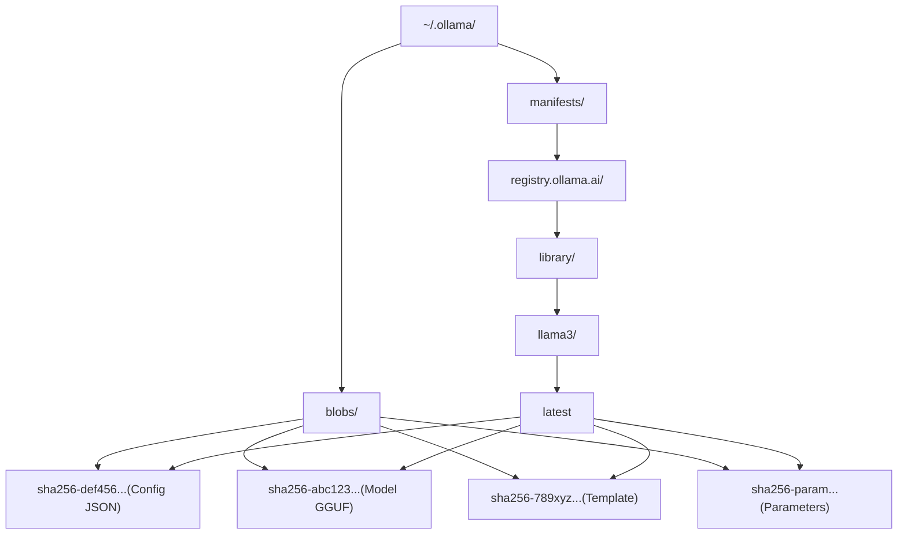
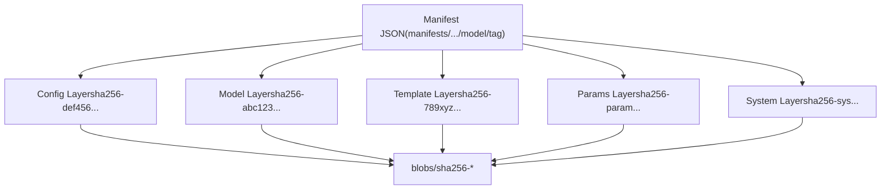
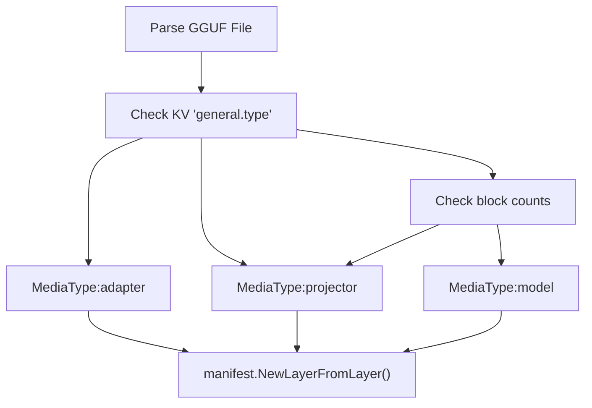
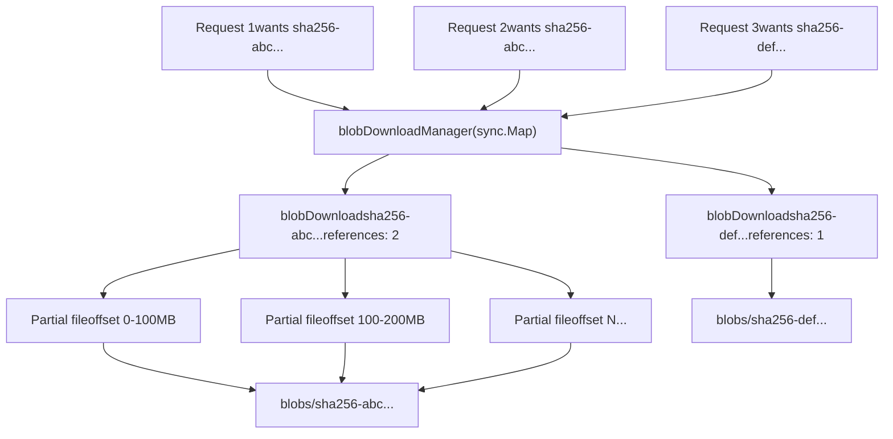
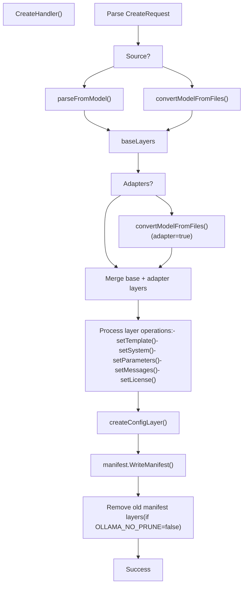

# Model Registry and Layers

Relevant source files

-   [auth/auth.go](https://github.com/ollama/ollama/blob/562c76d7/auth/auth.go)
-   [cmd/cmd\_test.go](https://github.com/ollama/ollama/blob/562c76d7/cmd/cmd_test.go)
-   [server/auth.go](https://github.com/ollama/ollama/blob/562c76d7/server/auth.go)
-   [server/auth\_test.go](https://github.com/ollama/ollama/blob/562c76d7/server/auth_test.go)
-   [server/create.go](https://github.com/ollama/ollama/blob/562c76d7/server/create.go)
-   [server/download.go](https://github.com/ollama/ollama/blob/562c76d7/server/download.go)
-   [server/model.go](https://github.com/ollama/ollama/blob/562c76d7/server/model.go)
-   [server/routes\_create\_test.go](https://github.com/ollama/ollama/blob/562c76d7/server/routes_create_test.go)
-   [server/routes\_delete\_test.go](https://github.com/ollama/ollama/blob/562c76d7/server/routes_delete_test.go)
-   [server/routes\_list\_test.go](https://github.com/ollama/ollama/blob/562c76d7/server/routes_list_test.go)
-   [server/routes\_test.go](https://github.com/ollama/ollama/blob/562c76d7/server/routes_test.go)
-   [server/sparse\_common.go](https://github.com/ollama/ollama/blob/562c76d7/server/sparse_common.go)
-   [server/sparse\_windows.go](https://github.com/ollama/ollama/blob/562c76d7/server/sparse_windows.go)
-   [server/upload.go](https://github.com/ollama/ollama/blob/562c76d7/server/upload.go)
-   [types/errtypes/errtypes.go](https://github.com/ollama/ollama/blob/562c76d7/types/errtypes/errtypes.go)

This document explains Ollama's content-addressable model storage system, including the manifest/layer architecture, blob storage, layer types, and registry operations. For information about creating models from Modelfiles, see [Modelfiles](/ollama/ollama/4.1-modelfiles). For details on file format conversion and quantization, see [Model Conversion and Import](/ollama/ollama/4.3-model-conversion-and-import) and [Quantization](/ollama/ollama/4.6-quantization).

## Overview

Ollama uses a content-addressable storage system similar to Docker's layer-based model distribution. Each model consists of a manifest that references multiple layers (model weights, templates, parameters, etc.), and each layer is stored as an immutable blob identified by its SHA256 digest. This architecture enables:

-   **Deduplication**: Multiple models can share the same layers (e.g., the same base model weights)
-   **Efficient storage**: Only unique content is stored once
-   **Atomic updates**: Manifests are updated atomically, layers are immutable
-   **Remote distribution**: Standard pull/push operations to/from registries

**Sources:** [server/model.go1-129](https://github.com/ollama/ollama/blob/562c76d7/server/model.go#L1-L129) [server/create.go1-45](https://github.com/ollama/ollama/blob/562c76d7/server/create.go#L1-L45) [manifest package overview from imports](https://github.com/ollama/ollama/blob/562c76d7/manifest package overview from imports)

## Storage Architecture

### Directory Structure

```
~/.ollama/
├── manifests/
│   └── registry.ollama.ai/
│       └── library/
│           └── llama3/
│               └── latest          # Manifest file (JSON)
└── blobs/
    ├── sha256-abc123...           # Model weights (GGUF)
    ├── sha256-def456...           # Config layer (JSON)
    ├── sha256-789xyz...           # Template layer
    └── sha256-...                 # Other layers
```
**Directory Structure Diagram**


**Sources:** [server/download.go468-509](https://github.com/ollama/ollama/blob/562c76d7/server/download.go#L468-L509) [server/routes\_create\_test.go105-147](https://github.com/ollama/ollama/blob/562c76d7/server/routes_create_test.go#L105-L147)

### Content Addressing

Every layer is identified by its SHA256 digest in the format `sha256:{64-char-hex}`. Blobs are stored at `~/.ollama/blobs/sha256-{digest}` where the digest is the SHA256 hash of the blob's content. This ensures:

1.  **Integrity**: Content can be verified against its digest
2.  **Immutability**: Once written, blobs never change
3.  **Deduplication**: Identical content (same digest) is stored only once

**Sources:** [server/download.go473-476](https://github.com/ollama/ollama/blob/562c76d7/server/download.go#L473-L476) [server/upload.go56-59](https://github.com/ollama/ollama/blob/562c76d7/server/upload.go#L56-L59) [server/create.go77-84](https://github.com/ollama/ollama/blob/562c76d7/server/create.go#L77-L84)

## Manifest Structure

A manifest is a JSON document that describes a model. It references a config layer and an ordered list of component layers.

### Manifest Components

**Manifest to Layers Relationship**


The manifest contains:

-   **SchemaVersion**: Manifest format version
-   **MediaType**: Always `application/vnd.docker.distribution.manifest.v2+json`
-   **Config**: Reference to the config layer (digest, size, media type)
-   **Layers**: Ordered array of layer references

Each layer reference includes:

-   **Digest**: SHA256 digest (e.g., `sha256:abc123...`)
-   **Size**: Blob size in bytes
-   **MediaType**: Layer type identifier
-   **From** (optional): Source model for cross-repository blob mounts

**Sources:** [server/model.go28-77](https://github.com/ollama/ollama/blob/562c76d7/server/model.go#L28-L77) [server/create.go559-573](https://github.com/ollama/ollama/blob/562c76d7/server/create.go#L559-L573)

### Manifest Path Resolution

Model names are parsed into components and mapped to filesystem paths:

| Model Name | Manifest Path |
| --- | --- |
| `llama3` | `manifests/registry.ollama.ai/library/llama3/latest` |
| `llama3:8b` | `manifests/registry.ollama.ai/library/llama3/8b` |
| `user/mymodel` | `manifests/registry.ollama.ai/user/mymodel/latest` |
| `example.com/ns/model:tag` | `manifests/example.com/ns/model/tag` |

Manifests are case-insensitive on the filesystem (all stored in lowercase) but preserve the original casing in API responses.

**Sources:** [server/routes\_test.go562-687](https://github.com/ollama/ollama/blob/562c76d7/server/routes_test.go#L562-L687) [types/model package from imports](https://github.com/ollama/ollama/blob/562c76d7/types/model package from imports)

## Layer Types and Media Types

Ollama uses specific media types to identify the purpose of each layer. These media types follow Docker's convention but use Ollama-specific identifiers.

### Layer Media Types

| Media Type | Purpose | Content Format | Example |
| --- | --- | --- | --- |
| `application/vnd.ollama.image.model` | Model weights | GGUF file | Base model parameters |
| `application/vnd.ollama.image.projector` | Vision encoder | GGUF file | CLIP vision model |
| `application/vnd.ollama.image.adapter` | LoRA adapter | GGUF file | Fine-tuning weights |
| `application/vnd.ollama.image.template` | Prompt template | Plain text | `{{ .System }} {{ .Prompt }}` |
| `application/vnd.ollama.image.system` | System message | Plain text | `You are a helpful assistant` |
| `application/vnd.ollama.image.params` | Model parameters | JSON | `{"temperature": 0.7}` |
| `application/vnd.ollama.image.license` | License text | Plain text | Model license |
| `application/vnd.docker.container.image.v1+json` | Config metadata | JSON | Model family, type, etc. |

**Sources:** [server/model.go50-72](https://github.com/ollama/ollama/blob/562c76d7/server/model.go#L50-L72) [server/create.go424-441](https://github.com/ollama/ollama/blob/562c76d7/server/create.go#L424-L441) [server/create.go661-667](https://github.com/ollama/ollama/blob/562c76d7/server/create.go#L661-L667)

### Layer Type Detection

When creating models from GGUF files, the layer type is automatically detected:

**Layer Type Detection Flow**


**Sources:** [server/create.go630-678](https://github.com/ollama/ollama/blob/562c76d7/server/create.go#L630-L678) [server/model.go50-72](https://github.com/ollama/ollama/blob/562c76d7/server/model.go#L50-L72)

### Layer Operations

Layers can be added, removed, or replaced during model creation:

```
// Setting a template removes existing template layers and adds a new onelayers = removeLayer(layers, "application/vnd.ollama.image.template")layer, _ := manifest.NewLayer(templateReader, "application/vnd.ollama.image.template")layers = append(layers, layer)
```
Common operations:

-   **removeLayer**: Removes all layers of a specific media type
-   **setTemplate**: Replaces template layer
-   **setSystem**: Replaces system message layer
-   **setParameters**: Merges with existing parameters
-   **setMessages**: Replaces message history layers
-   **setLicense**: Adds license layer(s)

**Sources:** [server/create.go680-735](https://github.com/ollama/ollama/blob/562c76d7/server/create.go#L680-L735) [server/create.go509-576](https://github.com/ollama/ollama/blob/562c76d7/server/create.go#L509-L576)

## Blob Storage and Retrieval

### Blob Path Resolution

The `manifest.BlobsPath()` function converts a digest to a filesystem path:

```
// Input:  "sha256:abc123..."// Output: "~/.ollama/blobs/sha256-abc123..."
```
**Sources:** [server/download.go473-476](https://github.com/ollama/ollama/blob/562c76d7/server/download.go#L473-L476) [server/upload.go56-59](https://github.com/ollama/ollama/blob/562c76d7/server/upload.go#L56-L59)

### Blob Download Manager

Downloads are managed by `blobDownloadManager`, a sync.Map that ensures concurrent requests for the same blob share a single download operation.

**Blob Download Architecture**


Key components:

-   **blobDownload**: Manages download state for a single blob

    -   `Total`: Total blob size
    -   `Completed`: Atomic counter of downloaded bytes
    -   `Parts`: Array of download parts (parallel downloads)
    -   `references`: Atomic reference count for concurrent requests
    -   `done`: Channel signaling completion
-   **blobDownloadPart**: Represents a chunk of the download

    -   `N`: Part number
    -   `Offset`: Starting byte offset
    -   `Size`: Part size in bytes
    -   `Completed`: Atomic counter of bytes downloaded for this part

**Sources:** [server/download.go39-67](https://github.com/ollama/ollama/blob/562c76d7/server/download.go#L39-L67) [server/download.go468-509](https://github.com/ollama/ollama/blob/562c76d7/server/download.go#L468-L509)

### Multi-Part Downloads

Large blobs are downloaded in parallel parts to improve performance:

1.  **Initialization**: HEAD request determines total size
2.  **Part creation**: Size divided into 16 parts (100MB-1GB each)
3.  **Parallel download**: Up to 16 concurrent part downloads
4.  **Progress tracking**: Each part tracks completion atomically
5.  **Resumption**: Partial downloads persist and can resume on retry
6.  **Stall detection**: Parts stalled for >30s are retried
7.  **Assembly**: Parts written to sparse file at correct offsets

**Sources:** [server/download.go99-183](https://github.com/ollama/ollama/blob/562c76d7/server/download.go#L99-L183) [server/download.go216-329](https://github.com/ollama/ollama/blob/562c76d7/server/download.go#L216-L329) [server/download.go331-390](https://github.com/ollama/ollama/blob/562c76d7/server/download.go#L331-L390)

### Blob Upload Manager

Uploads mirror the download architecture with `blobUploadManager`:

**Upload Flow**

> **[Mermaid sequence]**
> *(图表结构无法解析)*

Upload features:

-   **Cross-repository mount**: If blob exists in another repository, it can be mounted (HTTP 201 response)
-   **Redirect support**: Registry can redirect to blob storage (e.g., S3)
-   **Multi-part with ETag**: Parts checksummed with MD5, combined into ETag for commit
-   **Reference counting**: Multiple concurrent uploads share the same upload operation

**Sources:** [server/upload.go28-405](https://github.com/ollama/ollama/blob/562c76d7/server/upload.go#L28-L405) [server/upload.go55-125](https://github.com/ollama/ollama/blob/562c76d7/server/upload.go#L55-L125) [server/upload.go218-307](https://github.com/ollama/ollama/blob/562c76d7/server/upload.go#L218-L307)

## Registry Protocol

### Authentication Flow

Ollama uses a challenge-response authentication flow based on Docker's registry protocol:

**Registry Authentication Sequence**

> **[Mermaid sequence]**
> *(图表结构无法解析)*

Authentication components:

-   **registryChallenge**: Parsed from `WWW-Authenticate` header

    -   `Realm`: Auth server URL
    -   `Service`: Registry service name
    -   `Scope`: Requested permissions (e.g., `repository:model:pull`)
-   **Cross-domain protection**: Client validates that auth realm matches original registry host

-   **Signature**: Ed25519 signature using `~/.ollama/id_ed25519` private key

-   **Nonce**: Random 16-byte nonce prevents replay attacks

-   **Timestamp**: Unix timestamp included in request


**Sources:** [server/auth.go22-100](https://github.com/ollama/ollama/blob/562c76d7/server/auth.go#L22-L100) [server/auth\_test.go10-40](https://github.com/ollama/ollama/blob/562c76d7/server/auth_test.go#L10-L40) [auth/auth.go1-86](https://github.com/ollama/ollama/blob/562c76d7/auth/auth.go#L1-L86)

### Registry Operations

Common registry endpoints:

| Operation | HTTP Method | Path | Purpose |
| --- | --- | --- | --- |
| Check blob | HEAD | `/v2/{ns}/{model}/blobs/{digest}` | Verify blob exists |
| Download blob | GET | `/v2/{ns}/{model}/blobs/{digest}` | Download blob content |
| Upload init | POST | `/v2/{ns}/{model}/blobs/uploads/` | Start upload session |
| Upload part | PATCH | `/v2/{ns}/{model}/blobs/uploads/{id}` | Upload blob chunk |
| Upload commit | PUT | `/v2/{ns}/{model}/blobs/uploads/{id}?digest=...` | Finalize upload |
| Get manifest | GET | `/v2/{ns}/{model}/manifests/{tag}` | Download manifest |
| Put manifest | PUT | `/v2/{ns}/{model}/manifests/{tag}` | Upload manifest |

**Sources:** [server/download.go148-153](https://github.com/ollama/ollama/blob/562c76d7/server/download.go#L148-L153) [server/upload.go68-72](https://github.com/ollama/ollama/blob/562c76d7/server/upload.go#L68-L72) [server/upload.go370-388](https://github.com/ollama/ollama/blob/562c76d7/server/upload.go#L370-L388)

### Blob Deduplication

When uploading, the client checks if a blob already exists:

1.  **HEAD request**: Check if blob exists remotely
2.  **If exists**: Skip upload (return immediately)
3.  **If missing**: Initiate upload with optional `from` parameter for cross-repo mount
4.  **Mount attempt**: Registry may return 201 if blob exists in source repository

**Sources:** [server/upload.go369-388](https://github.com/ollama/ollama/blob/562c76d7/server/upload.go#L369-L388) [server/upload.go61-66](https://github.com/ollama/ollama/blob/562c76d7/server/upload.go#L61-L66)

## Layer Lifecycle

### Creating a Model

**Model Creation Flow**


**Sources:** [server/create.go46-270](https://github.com/ollama/ollama/blob/562c76d7/server/create.go#L46-L270) [server/create.go479-576](https://github.com/ollama/ollama/blob/562c76d7/server/create.go#L479-L576) [server/create.go680-793](https://github.com/ollama/ollama/blob/562c76d7/server/create.go#L680-L793)

### Layer Detection and Auto-Configuration

When creating from GGUF files, Ollama automatically detects templates:

```
// Check for chat template in model metadataif s := layer.GGML.KV().ChatTemplate(); s != "" {    if t, err := template.Named(s); err == nil {        // Create template layer from detected template        layer := manifest.NewLayer(t.Reader(), "application/vnd.ollama.image.template")        layer.Status = fmt.Sprintf("using autodetected template %s", t.Name)        layers = append(layers, layer)    }}
```
**Sources:** [server/model.go79-111](https://github.com/ollama/ollama/blob/562c76d7/server/model.go#L79-L111) [server/create.go662-678](https://github.com/ollama/ollama/blob/562c76d7/server/create.go#L662-L678)

### Deleting a Model

When a model is deleted:

1.  **Remove manifest**: Delete manifest file
2.  **Enumerate layers**: Collect all layer digests
3.  **Check references**: For each layer, check if other manifests reference it
4.  **Remove unreferenced blobs**: Delete blobs not referenced by any remaining manifest

This ensures shared layers (e.g., same base model used by multiple fine-tuned models) are preserved.

**Sources:** [server/routes\_delete\_test.go17-114](https://github.com/ollama/ollama/blob/562c76d7/server/routes_delete_test.go#L17-L114) test demonstrates blob preservation across models

### Parameter Merging

When creating a model FROM another model, parameters are merged intelligently:

```
// Load existing parameters from base modelvar existing map[string]any// ... load from base model's params layer // Merge with new parameters (new parameters override)for k, v := range existing {    if _, exists := p[k]; !exists {        p[k] = v  // Keep base parameter if not overridden    }}
```
**Note**: Array parameters (like `stop` sequences) are replaced entirely, not merged.

**Sources:** [server/create.go737-768](https://github.com/ollama/ollama/blob/562c76d7/server/create.go#L737-L768) [server/routes\_create\_test.go391-524](https://github.com/ollama/ollama/blob/562c76d7/server/routes_create_test.go#L391-L524)

## Summary

Ollama's registry and layer system provides:

-   **Content-addressable storage**: SHA256-based blob deduplication
-   **Layered model composition**: Separate layers for weights, templates, parameters, etc.
-   **Efficient distribution**: Multi-part parallel downloads/uploads
-   **Registry protocol**: Standard Docker-compatible registry operations
-   **Authentication**: Challenge-response with Ed25519 signatures
-   **Atomic updates**: Manifest changes are atomic, layers are immutable
-   **Automatic cleanup**: Unreferenced blobs removed on model deletion (unless disabled)

The system supports local model creation, remote push/pull, cross-repository blob mounts, and efficient storage through deduplication.

**Sources:** [server/download.go](https://github.com/ollama/ollama/blob/562c76d7/server/download.go) [server/upload.go](https://github.com/ollama/ollama/blob/562c76d7/server/upload.go) [server/model.go](https://github.com/ollama/ollama/blob/562c76d7/server/model.go) [server/create.go](https://github.com/ollama/ollama/blob/562c76d7/server/create.go) [server/auth.go](https://github.com/ollama/ollama/blob/562c76d7/server/auth.go)
