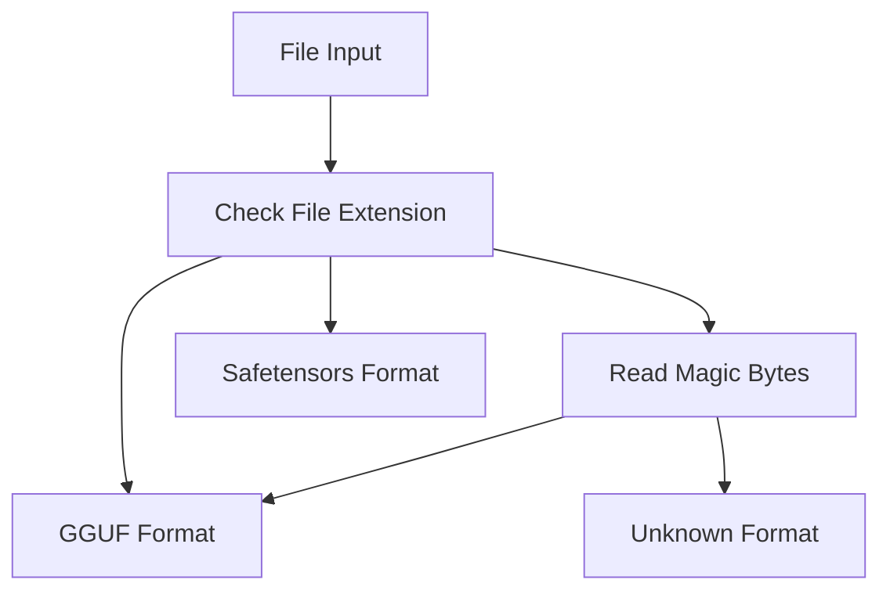
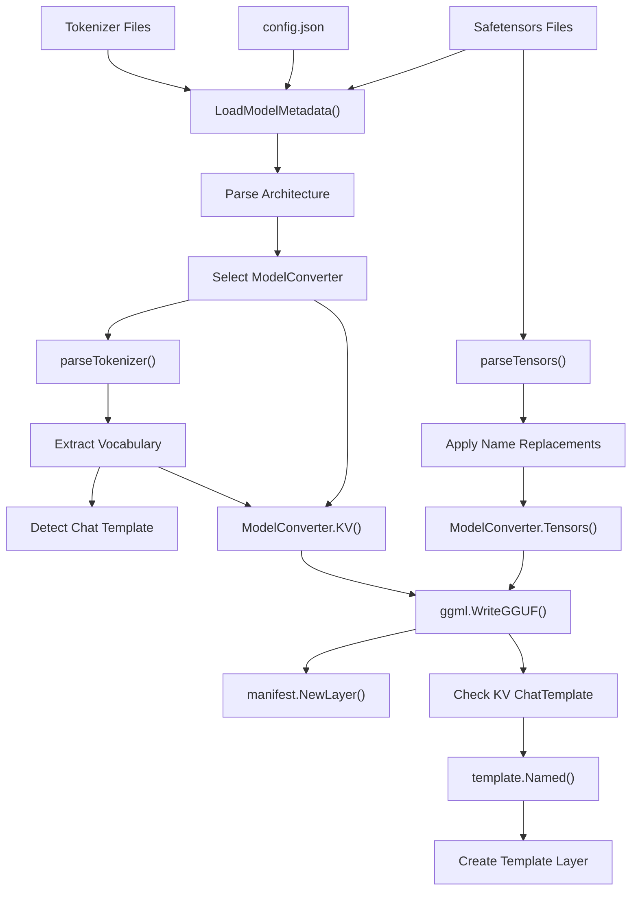
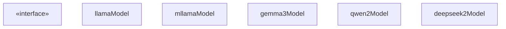
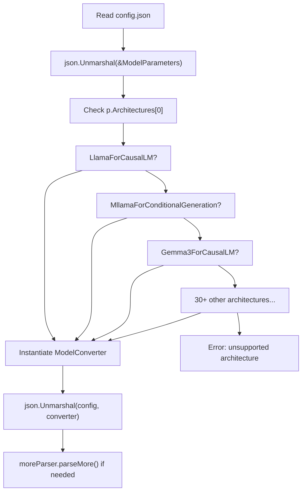
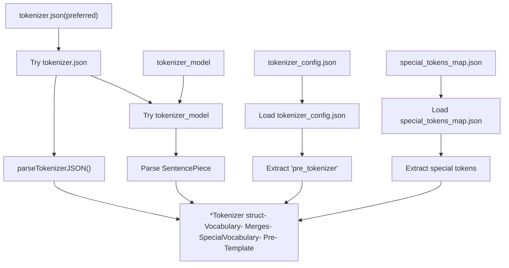
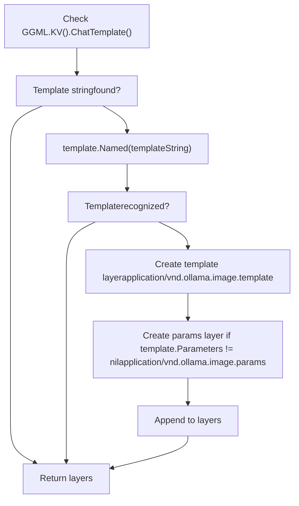
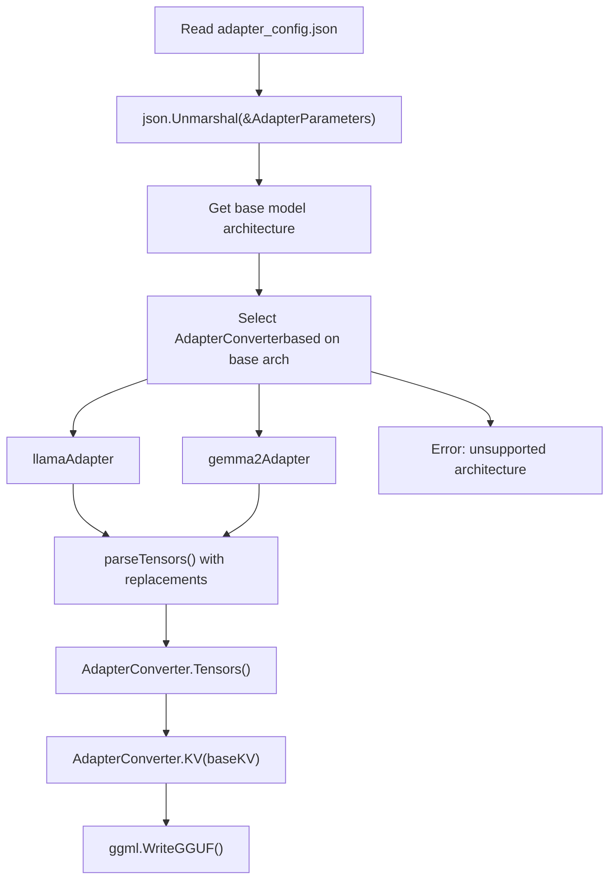
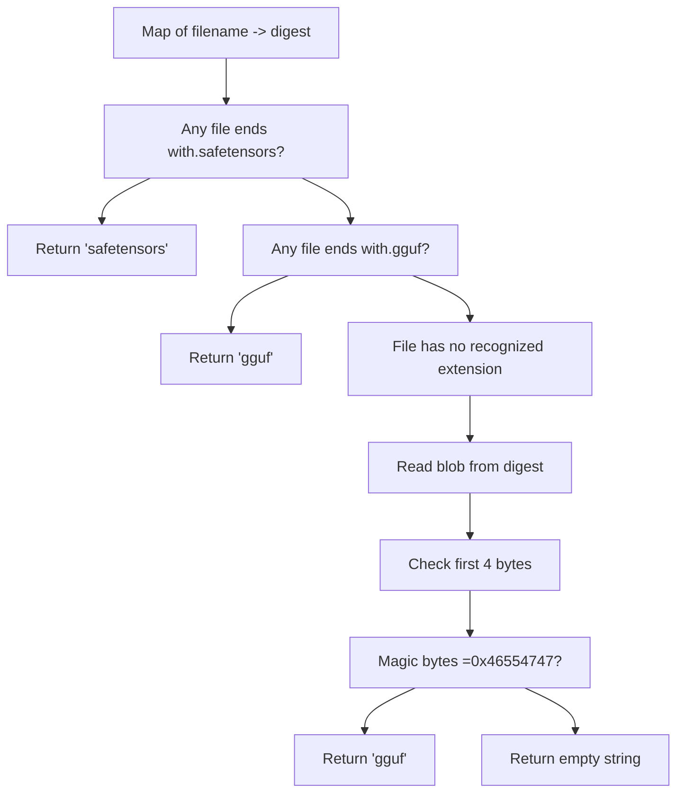

# Model Conversion and Import

Relevant source files

-   [cmd/cmd\_test.go](https://github.com/ollama/ollama/blob/562c76d7/cmd/cmd_test.go)
-   [convert/convert.go](https://github.com/ollama/ollama/blob/562c76d7/convert/convert.go)
-   [fs/ggml/ggml.go](https://github.com/ollama/ollama/blob/562c76d7/fs/ggml/ggml.go)
-   [fs/ggml/ggml\_test.go](https://github.com/ollama/ollama/blob/562c76d7/fs/ggml/ggml_test.go)
-   [model/models/models.go](https://github.com/ollama/ollama/blob/562c76d7/model/models/models.go)
-   [model/parsers/parsers.go](https://github.com/ollama/ollama/blob/562c76d7/model/parsers/parsers.go)
-   [model/parsers/parsers\_test.go](https://github.com/ollama/ollama/blob/562c76d7/model/parsers/parsers_test.go)
-   [model/renderers/glmocr.go](https://github.com/ollama/ollama/blob/562c76d7/model/renderers/glmocr.go)
-   [model/renderers/glmocr\_test.go](https://github.com/ollama/ollama/blob/562c76d7/model/renderers/glmocr_test.go)
-   [model/renderers/renderer.go](https://github.com/ollama/ollama/blob/562c76d7/model/renderers/renderer.go)
-   [server/create.go](https://github.com/ollama/ollama/blob/562c76d7/server/create.go)
-   [server/model.go](https://github.com/ollama/ollama/blob/562c76d7/server/model.go)
-   [server/routes\_create\_test.go](https://github.com/ollama/ollama/blob/562c76d7/server/routes_create_test.go)
-   [server/routes\_delete\_test.go](https://github.com/ollama/ollama/blob/562c76d7/server/routes_delete_test.go)
-   [server/routes\_list\_test.go](https://github.com/ollama/ollama/blob/562c76d7/server/routes_list_test.go)
-   [server/routes\_test.go](https://github.com/ollama/ollama/blob/562c76d7/server/routes_test.go)

This page documents the model conversion and import system in Ollama, which transforms models from external formats (primarily HuggingFace/Safetensors) into Ollama's internal GGUF-based format. The conversion process handles 30+ model architectures, extracts metadata and tokenizers, and creates the necessary layers for Ollama's model management system.

For information about GGUF format details and tensor types, see [Model File Formats](/ollama/ollama/4.4-model-file-formats). For information about how converted models are stored and organized, see [Model Registry and Layers](/ollama/ollama/4.2-model-registry-and-layers).

## Overview

The conversion system serves as the entry point for importing models from external sources. When a user creates a model using files in Safetensors format, Ollama converts them to GGUF format while preserving all model metadata, tokenizer information, and architectural details. The conversion process is architecture-aware, with specialized converters for each supported model family.

Sources: [convert/convert.go1-394](https://github.com/ollama/ollama/blob/562c76d7/convert/convert.go#L1-L394) [server/create.go317-468](https://github.com/ollama/ollama/blob/562c76d7/server/create.go#L317-L468)

## Supported Input Formats

Ollama supports two primary input formats for model creation:

| Format | Description | Detection Method | Use Case |
| --- | --- | --- | --- |
| **GGUF** | Pre-converted GGML Universal File Format | Magic bytes: `0x46554747` (LE) or `0x47475546` (BE) | Models already in Ollama format or from llama.cpp |
| **Safetensors** | HuggingFace's tensor serialization format | File extension: `.safetensors` | Direct import from HuggingFace Hub |

The system automatically detects the input format by examining file extensions and magic bytes:


**Diagram: File Format Detection Flow**

Sources: [server/create.go349-385](https://github.com/ollama/ollama/blob/562c76d7/server/create.go#L349-L385) [fs/ggml/ggml.go541-556](https://github.com/ollama/ollama/blob/562c76d7/fs/ggml/ggml.go#L541-L556)

## Supported Architectures

The conversion system supports 30+ model architectures through specialized converters. Each architecture has a corresponding converter that understands its specific tensor layout and configuration:

### Text-Only Architectures

-   **LlamaForCausalLM**: Standard Llama models (Llama 2, Llama 3, etc.)
-   **MixtralForCausalLM**: Mixtral mixture-of-experts models
-   **GemmaForCausalLM**: Google's Gemma models
-   **Gemma2ForCausalLM**: Gemma 2 with architectural improvements
-   **Gemma3ForCausalLM**: Latest Gemma generation
-   **Qwen2ForCausalLM**: Qwen 2 models
-   **Qwen3NextForCausalLM**: Qwen 3/3.5 models
-   **Phi3ForCausalLM**: Microsoft Phi-3 models
-   **CohereForCausalLM**: Cohere Command-R models
-   **Olmo3ForCausalLM**: OLMo 3 models
-   **DeepseekV3ForCausalLM**: DeepSeek V3 models
-   **Ministral3ForCausalLM**: Ministral 3 models
-   **Glm4MoeLiteForCausalLM**: GLM-4 MoE Lite models
-   **Lfm2ForCausalLM**: LFM-2 models
-   **Lfm2MoeForCausalLM**: LFM-2 MoE variants
-   **NemotronHForCausalLM**: Nemotron-H models

### Multimodal Architectures

-   **MllamaForConditionalGeneration**: Llama 3.2 Vision (mLlama)
-   **Llama4ForConditionalGeneration**: Llama 4 multimodal
-   **Mistral3ForConditionalGeneration**: Mistral 3 with vision
-   **Gemma3ForConditionalGeneration**: Gemma 3 with vision
-   **Gemma3nForConditionalGeneration**: Gemma 3n multimodal
-   **Qwen2\_5\_VLForConditionalGeneration**: Qwen 2.5 VL
-   **Qwen3VLForConditionalGeneration**: Qwen 3 VL
-   **Qwen3VLMoeForConditionalGeneration**: Qwen 3 VL MoE
-   **Qwen3\_5ForConditionalGeneration**: Qwen 3.5 multimodal
-   **Qwen3\_5MoeForConditionalGeneration**: Qwen 3.5 MoE multimodal
-   **GlmOcrForConditionalGeneration**: GLM OCR models
-   **Lfm2VlForConditionalGeneration**: LFM-2 VL models

### Specialized Architectures

-   **BertModel**: BERT-based embeddings
-   **NomicBertModel**: Nomic BERT embeddings
-   **NomicBertMoEModel**: Nomic BERT MoE
-   **GptOssForCausalLM**: GPT-OSS models
-   **DeepseekOCRForCausalLM**: DeepSeek OCR models

Sources: [convert/convert.go272-329](https://github.com/ollama/ollama/blob/562c76d7/convert/convert.go#L272-L329)

## Conversion Pipeline

The conversion pipeline transforms external model files into Ollama's internal format through several stages:


**Diagram: Model Conversion Pipeline**

The pipeline operates in five main phases:

1.  **Input Stage**: Reads Safetensors files, configuration JSON, and tokenizer files from the input directory
2.  **Metadata Loading**: Parses `config.json` to determine architecture and select appropriate converter
3.  **Tokenizer Processing**: Extracts vocabulary, merges, and special tokens from tokenizer files
4.  **Tensor Processing**: Converts tensors to GGUF format with architecture-specific transformations
5.  **GGUF Generation**: Writes final GGUF file with all metadata and tensor data

Sources: [convert/convert.go255-385](https://github.com/ollama/ollama/blob/562c76d7/convert/convert.go#L255-L385) [server/create.go387-468](https://github.com/ollama/ollama/blob/562c76d7/server/create.go#L387-L468)

## ModelConverter Interface

All architecture-specific converters implement the `ModelConverter` interface, which defines the contract for converting a model to GGUF format:


**Diagram: ModelConverter Interface Hierarchy**

### Interface Methods

| Method | Purpose | Returns |
| --- | --- | --- |
| `KV(*Tokenizer)` | Generates GGUF key-value metadata from model config and tokenizer | `KV` map with architecture-specific metadata |
| `Tensors([]Tensor)` | Transforms input tensors to GGUF format with architecture-specific modifications | Slice of `*ggml.Tensor` ready for writing |
| `Replacements()` | Provides string replacement pairs for tensor name normalization | String slice for `strings.Replacer` |
| `specialTokenTypes()` | Lists special token types used by the architecture | String slice of token type names |

Sources: [convert/convert.go185-201](https://github.com/ollama/ollama/blob/562c76d7/convert/convert.go#L185-L201)

## Conversion Process Details

### Safetensors to GGUF Conversion

The Safetensors conversion process creates a temporary directory, links blob files, and invokes the converter:

> **[Mermaid sequence]**
> *(图表结构无法解析)*

**Diagram: Safetensors to GGUF Conversion Sequence**

The conversion process:

1.  Creates a temporary directory to stage files: `os.MkdirTemp(envconfig.Models(), "ollama-safetensors")`
2.  Creates hard links from blob storage to temp directory, preserving the relative paths from the input files
3.  Validates all paths are within the temporary root for security
4.  Invokes `convert.ConvertModel()` with a `DirFS` rooted at the temp directory
5.  Writes the converted GGUF file to a temporary file
6.  Creates a manifest layer from the GGUF output
7.  Detects and adds chat template if available
8.  Cleans up temporary directory

Sources: [server/create.go387-468](https://github.com/ollama/ollama/blob/562c76d7/server/create.go#L387-L468)

### Metadata Extraction

Metadata extraction loads the model's configuration and selects the appropriate converter:


**Diagram: Metadata Extraction and Converter Selection**

The `LoadModelMetadata()` function performs the following steps:

1.  Reads `config.json` from the input filesystem
2.  Sanitizes non-finite JSON values (NaN, Inf) that might break parsing
3.  Unmarshals into `ModelParameters` to read the architecture field
4.  Switches on `p.Architectures[0]` to select the appropriate converter
5.  Unmarshals the full config into the selected converter for architecture-specific fields
6.  Calls `parseMore()` if the converter implements the `moreParser` interface for additional files

Sources: [convert/convert.go255-366](https://github.com/ollama/ollama/blob/562c76d7/convert/convert.go#L255-L366)

### Tokenizer Parsing

Tokenizer parsing extracts vocabulary, merges, and special tokens from multiple potential source files:


**Diagram: Tokenizer Parsing Process**

The system prioritizes `tokenizer.json` (HuggingFace's unified format) but falls back to `tokenizer_model` (SentencePiece format). Special tokens are loaded from either the main tokenizer file or from a separate `special_tokens_map.json`.

Vocabulary size validation occurs after tokenizer parsing. If the model specifies a vocabulary size that doesn't match the tokenizer:

-   **Larger than actual**: Pads with dummy tokens `[PAD0]`, `[PAD1]`, etc.
-   **Smaller than actual**: Logs a warning and uses the actual size

Sources: [convert/convert.go346-365](https://github.com/ollama/ollama/blob/562c76d7/convert/convert.go#L346-L365)

### Chat Template Detection

After GGUF conversion completes, the system attempts to detect and auto-configure chat templates:


**Diagram: Chat Template Detection Flow**

The `detectChatTemplate()` function:

1.  Checks if the GGUF file contains a `tokenizer.chat_template` key-value
2.  If found, looks up the template string in Ollama's named template registry
3.  If a match is found, creates a template layer with the template content
4.  If the template has associated parameters, creates an additional params layer
5.  Appends both layers to the model's layer list

This allows models to automatically use appropriate chat templates without explicit configuration in a Modelfile.

Sources: [server/model.go79-111](https://github.com/ollama/ollama/blob/562c76d7/server/model.go#L79-L111)

### Adapter Conversion

LoRA adapter conversion follows a similar but simplified flow:


**Diagram: Adapter Conversion Process**

Adapter conversion differs from full model conversion in several ways:

1.  Uses `adapter_config.json` instead of `config.json`
2.  Requires the base model's KV data to properly configure the adapter
3.  Sets `general.type` to `"adapter"` in the GGUF metadata
4.  Only supports architectures with implemented `AdapterConverter` types
5.  Creates layer with media type `application/vnd.ollama.image.adapter`

The `AdapterConverter` interface is similar to `ModelConverter` but takes base model configuration:

```
type AdapterConverter interface {    KV(ofs.Config) KV    Tensors([]Tensor) []*ggml.Tensor    Replacements() []string}
```
Sources: [convert/convert.go207-253](https://github.com/ollama/ollama/blob/562c76d7/convert/convert.go#L207-L253) [server/create.go432-441](https://github.com/ollama/ollama/blob/562c76d7/server/create.go#L432-L441)

## File Detection and Type Resolution

The system uses multiple strategies to detect file types when extensions are ambiguous:


**Diagram: File Type Detection Strategy**

The `detectModelTypeFromFiles()` function implements a cascading detection strategy:

1.  **Primary detection**: Checks if any filename ends with `.safetensors` → returns `"safetensors"`
2.  **Secondary detection**: Checks if any filename ends with `.gguf` → returns `"gguf"`
3.  **Fallback detection**: For files without extensions:
    -   Resolves digest to blob path
    -   Reads first 4 bytes
    -   Checks for GGUF magic bytes (`0x46554747`)
    -   Returns `"gguf"` if magic matches, empty string otherwise

This allows users to create models from GGUF files even if they don't have the `.gguf` extension, as long as the files are already in blob storage.

Sources: [server/create.go349-385](https://github.com/ollama/ollama/blob/562c76d7/server/create.go#L349-L385)

## Integration with Create Flow

The conversion system integrates with the model creation API through the `CreateHandler`:

> **[Mermaid sequence]**
> *(图表结构无法解析)*

**Diagram: Model Creation with Conversion**

The integration flow:

1.  Client submits files map with digest references
2.  `CreateHandler` validates digests and file paths
3.  Calls `convertModelFromFiles()` to detect type and convert
4.  For Safetensors: creates temp directory, links files, runs conversion
5.  For GGUF: validates format and wraps in layer structure
6.  Applies optional quantization (see [Quantization](/ollama/ollama/4.6-quantization))
7.  Adds template, system prompt, and parameter layers
8.  Writes manifest to storage

Sources: [server/create.go46-270](https://github.com/ollama/ollama/blob/562c76d7/server/create.go#L46-L270)
