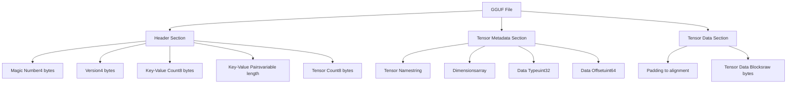
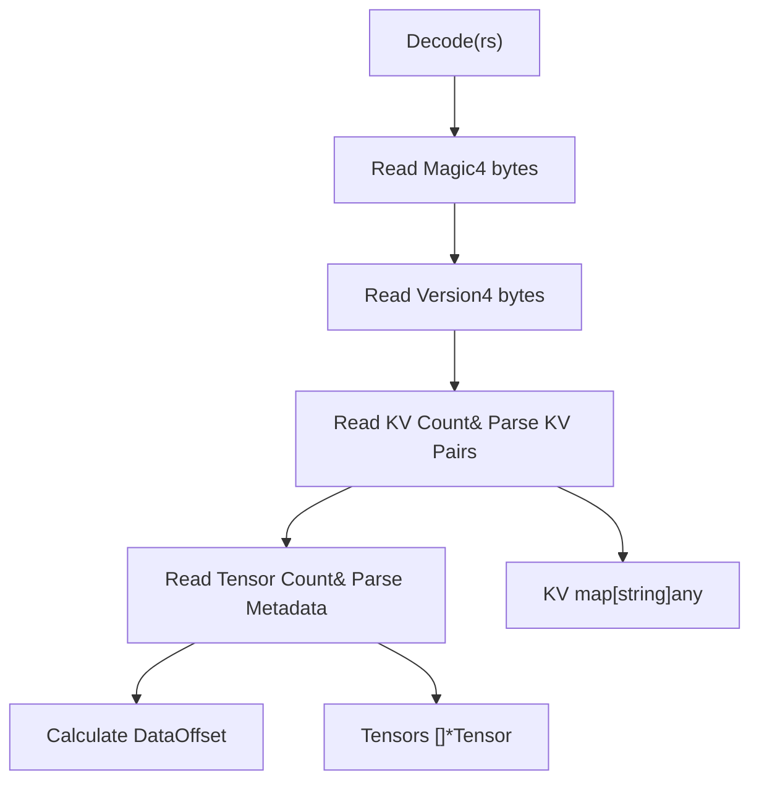
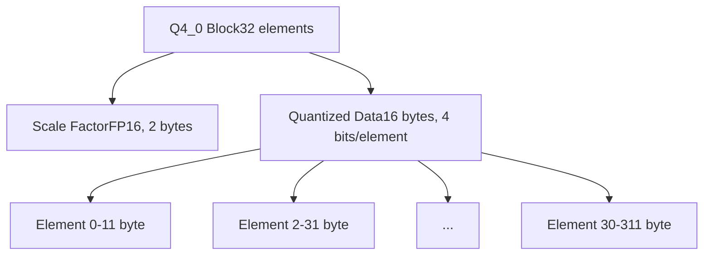
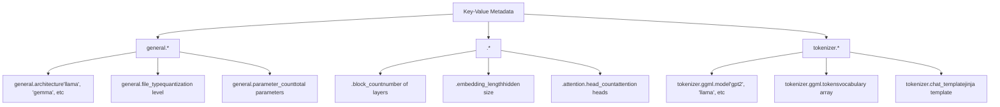
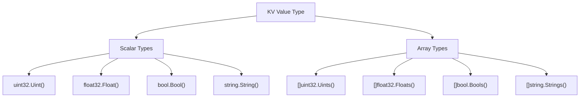
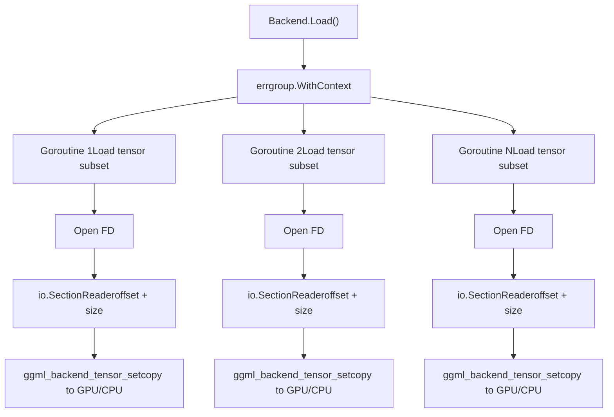
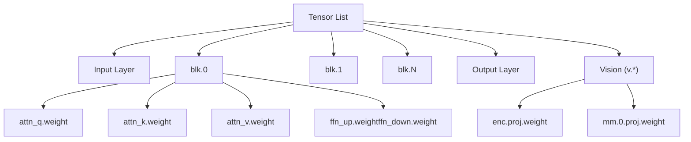
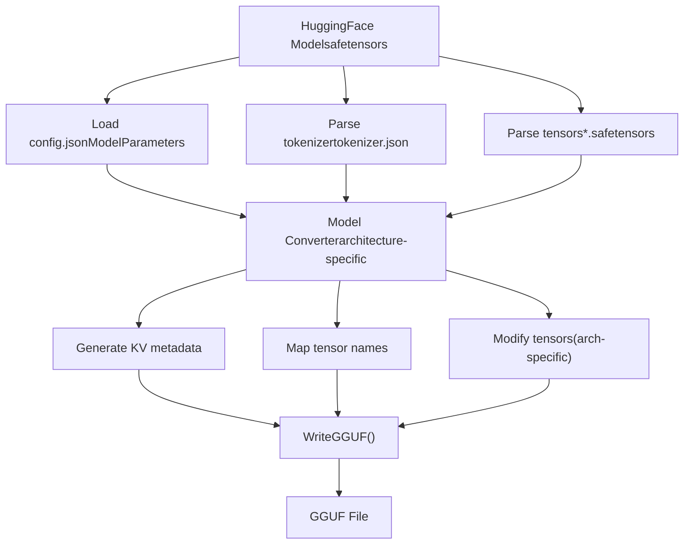
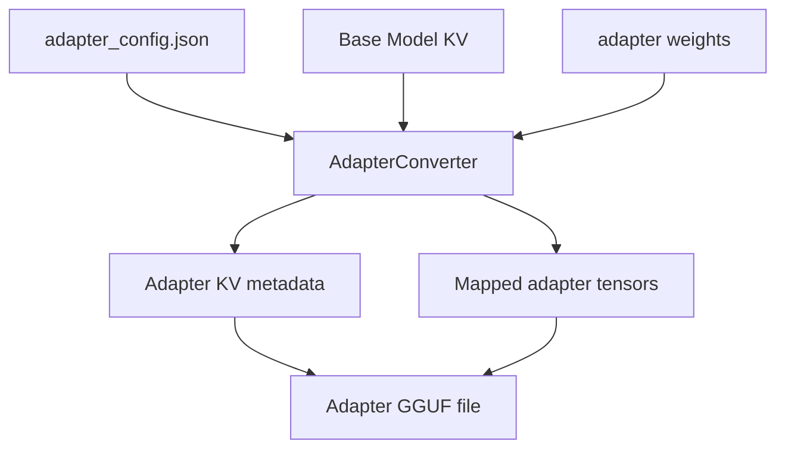

# Model File Formats

Relevant source files

-   [convert/convert.go](https://github.com/ollama/ollama/blob/562c76d7/convert/convert.go)
-   [fs/ggml/ggml.go](https://github.com/ollama/ollama/blob/562c76d7/fs/ggml/ggml.go)
-   [fs/ggml/ggml\_test.go](https://github.com/ollama/ollama/blob/562c76d7/fs/ggml/ggml_test.go)
-   [integration/embed\_test.go](https://github.com/ollama/ollama/blob/562c76d7/integration/embed_test.go)
-   [kvcache/cache.go](https://github.com/ollama/ollama/blob/562c76d7/kvcache/cache.go)
-   [kvcache/causal.go](https://github.com/ollama/ollama/blob/562c76d7/kvcache/causal.go)
-   [kvcache/causal\_test.go](https://github.com/ollama/ollama/blob/562c76d7/kvcache/causal_test.go)
-   [kvcache/encoder.go](https://github.com/ollama/ollama/blob/562c76d7/kvcache/encoder.go)
-   [kvcache/wrapper.go](https://github.com/ollama/ollama/blob/562c76d7/kvcache/wrapper.go)
-   [ml/backend.go](https://github.com/ollama/ollama/blob/562c76d7/ml/backend.go)
-   [ml/backend/ggml/ggml.go](https://github.com/ollama/ollama/blob/562c76d7/ml/backend/ggml/ggml.go)
-   [model/input/input.go](https://github.com/ollama/ollama/blob/562c76d7/model/input/input.go)
-   [model/model.go](https://github.com/ollama/ollama/blob/562c76d7/model/model.go)
-   [model/model\_test.go](https://github.com/ollama/ollama/blob/562c76d7/model/model_test.go)
-   [model/models/models.go](https://github.com/ollama/ollama/blob/562c76d7/model/models/models.go)
-   [model/parsers/parsers.go](https://github.com/ollama/ollama/blob/562c76d7/model/parsers/parsers.go)
-   [model/parsers/parsers\_test.go](https://github.com/ollama/ollama/blob/562c76d7/model/parsers/parsers_test.go)
-   [model/renderers/glmocr.go](https://github.com/ollama/ollama/blob/562c76d7/model/renderers/glmocr.go)
-   [model/renderers/glmocr\_test.go](https://github.com/ollama/ollama/blob/562c76d7/model/renderers/glmocr_test.go)
-   [model/renderers/renderer.go](https://github.com/ollama/ollama/blob/562c76d7/model/renderers/renderer.go)
-   [runner/llamarunner/cache.go](https://github.com/ollama/ollama/blob/562c76d7/runner/llamarunner/cache.go)
-   [runner/llamarunner/runner.go](https://github.com/ollama/ollama/blob/562c76d7/runner/llamarunner/runner.go)
-   [runner/ollamarunner/cache.go](https://github.com/ollama/ollama/blob/562c76d7/runner/ollamarunner/cache.go)
-   [runner/ollamarunner/cache\_test.go](https://github.com/ollama/ollama/blob/562c76d7/runner/ollamarunner/cache_test.go)
-   [runner/ollamarunner/runner.go](https://github.com/ollama/ollama/blob/562c76d7/runner/ollamarunner/runner.go)
-   [server/internal/internal/backoff/backoff.go](https://github.com/ollama/ollama/blob/562c76d7/server/internal/internal/backoff/backoff.go)

This page documents the file formats used by Ollama for storing and loading models, with focus on the GGUF (GGML Universal File) format. It covers the binary structure, tensor encoding, quantization types, metadata organization, and how the codebase reads and processes these files.

For information about converting models from other formats (e.g., safetensors), see [Model Conversion and Import](/ollama/ollama/4.3-model-conversion-and-import). For details on how quantization affects model performance, see [Quantization](/ollama/ollama/4.6-quantization).

## Overview

Ollama uses the GGUF format as its primary model file format. GGUF is a binary format designed to efficiently store:

-   Model architecture metadata (key-value pairs)
-   Tokenizer configuration
-   Tensor weights with various data types and quantization schemes
-   Vision model projectors and adapters

The format supports both little-endian and big-endian byte ordering, though little-endian is standard on modern systems.

Sources: [fs/ggml/ggml.go520-596](https://github.com/ollama/ollama/blob/562c76d7/fs/ggml/ggml.go#L520-L596)

## GGUF File Structure

### File Header and Magic Number

A GGUF file begins with a 4-byte magic number that identifies the format and byte order:

```
Little-endian: 0x46554747 ("GGUF")
Big-endian:    0x47475546 ("GGUF")
```
The file structure consists of three main sections:


**File Detection**

The `DetectContentType` function identifies the file format by reading the first 4 bytes:

Sources: [fs/ggml/ggml.go541-556](https://github.com/ollama/ollama/blob/562c76d7/fs/ggml/ggml.go#L541-L556) [fs/ggml/ggml.go562-596](https://github.com/ollama/ollama/blob/562c76d7/fs/ggml/ggml.go#L562-L596)

### Container Implementation

The `containerGGUF` structure handles decoding:


The container supports limiting array sizes in metadata to avoid loading large arrays into memory during initial file inspection.

Sources: [fs/ggml/ggml.go562-596](https://github.com/ollama/ollama/blob/562c76d7/fs/ggml/ggml.go#L562-L596)

## Tensor Types and Quantization

### Data Type Enumeration

GGUF supports multiple tensor data types, each with specific storage characteristics:

| Type | Constant | Bytes per Element | Block Size | Use Case |
| --- | --- | --- | --- | --- |
| F32 | `TensorTypeF32` (0) | 4 | 1 | Full precision |
| F16 | `TensorTypeF16` (1) | 2 | 1 | Half precision |
| Q4\_0 | `TensorTypeQ4_0` (2) | 0.5625 per elem | 32 | 4-bit quantization |
| Q4\_1 | `TensorTypeQ4_1` (3) | 0.625 per elem | 32 | 4-bit with bias |
| Q8\_0 | `TensorTypeQ8_0` (8) | 1.0625 per elem | 32 | 8-bit quantization |
| Q8\_K | `TensorTypeQ8_K` (15) | varies | 256 | K-quant 8-bit |
| BF16 | `TensorTypeBF16` (30) | 2 | 1 | Brain float 16 |
| MXFP4 | `TensorTypeMXFP4` (4, 39) | 0.53125 per elem | 32 | Microscaling FP4 |

Sources: [fs/ggml/ggml.go405-429](https://github.com/ollama/ollama/blob/562c76d7/fs/ggml/ggml.go#L405-L429) [fs/ggml/ggml.go434-502](https://github.com/ollama/ollama/blob/562c76d7/fs/ggml/ggml.go#L434-L502)

### Quantization Block Structure

Quantized types store data in blocks. For example, Q4\_0 uses 32-element blocks:


The `TypeSize` method calculates storage requirements per block:

```
Q4_0: 2 (scale) + 32/2 (data) = 18 bytes per 32 elements
Q8_0: 2 (scale) + 32 (data) = 34 bytes per 32 elements
```
Sources: [fs/ggml/ggml.go434-502](https://github.com/ollama/ollama/blob/562c76d7/fs/ggml/ggml.go#L434-L502)

### Size Calculations

The `Size()` method on `Tensor` computes total storage:

```
Size = Elements * TypeSize / BlockSize
```
For a tensor with shape `[4096, 4096]` using Q4\_0:

-   Elements: 16,777,216
-   TypeSize: 18 bytes
-   BlockSize: 32
-   Size: 16,777,216 \* 18 / 32 = 9,437,184 bytes

Sources: [fs/ggml/ggml.go512-514](https://github.com/ollama/ollama/blob/562c76d7/fs/ggml/ggml.go#L512-L514)

### Special Type Handling

The backend handles special type conversions during loading:

**MXFP4 Transformation**

Raw MXFP4 data (type 4) is converted to GGML MXFP4 format (type 39) with byte reordering:

```
Input:  a1 b2 c3 ... x7 y8 z9
Output: 71 xa 82 yb 93 zc
```
**BF16 to F32 Conversion**

For specific tensors like `_exps.bias`, BF16 data is converted to F32 at load time:

Sources: [ml/backend/ggml/ggml.go266-274](https://github.com/ollama/ollama/blob/562c76d7/ml/backend/ggml/ggml.go#L266-L274) [ml/backend/ggml/ggml.go528-595](https://github.com/ollama/ollama/blob/562c76d7/ml/backend/ggml/ggml.go#L528-L595)

## Metadata Key-Value System

### Architecture-Specific Keys

The KV system uses a hierarchical naming scheme with architecture prefixes:


### Key Resolution

The `keyValue` function implements automatic prefix resolution:

```
// If key doesn't start with "tokenizer." or "general."// it gets prefixed with the architecture namekey = architecture + "." + key // Example:// Input: "block_count"// Architecture: "llama"// Resolved: "llama.block_count"
```
Sources: [fs/ggml/ggml.go315-326](https://github.com/ollama/ollama/blob/562c76d7/fs/ggml/ggml.go#L315-L326) [convert/convert.go62-71](https://github.com/ollama/ollama/blob/562c76d7/convert/convert.go#L62-L71)

### Data Type Support

The KV system supports multiple value types with type-safe accessors:


### Variable-Length Arrays

Some keys like `attention.head_count` can be either a single value or an array. The `UintOrArrayValueAsArray` method normalizes these:

```
// Single value becomes array of length 1headCount := kv.UintOrArrayValueAsArray("attention.head_count", defaultValue) // If value is scalar: headCount = [value]// If value is array: headCount = values// Ensures layer-by-layer configuration
```
Sources: [fs/ggml/ggml.go221-238](https://github.com/ollama/ollama/blob/562c76d7/fs/ggml/ggml.go#L221-L238) [fs/ggml/ggml.go63-111](https://github.com/ollama/ollama/blob/562c76d7/fs/ggml/ggml.go#L63-L111)

## File Reading and Tensor Loading

### Decode Process

The main decode flow:

> **[Mermaid sequence]**
> *(图表结构无法解析)*

Sources: [fs/ggml/ggml.go562-596](https://github.com/ollama/ollama/blob/562c76d7/fs/ggml/ggml.go#L562-L596)

### Backend Tensor Loading

The GGML backend loads tensors in parallel using goroutines:


Each goroutine:

1.  Opens its own file descriptor (for sequential reading)
2.  Creates a section reader for its tensor's data range
3.  Streams data in chunks (128 KB buffers)
4.  Copies to backend memory via `ggml_backend_tensor_set`
5.  Reports progress via callback

Sources: [ml/backend/ggml/ggml.go468-645](https://github.com/ollama/ollama/blob/562c76d7/ml/backend/ggml/ggml.go#L468-L645)

### Memory Alignment and Padding

Tensors are aligned in memory for optimal access:

```
func pad(length, pad C.size_t) C.size_t {    return ((length + pad - 1) / pad) * pad} // Example: align to 32 bytessize := pad(tensorSize, 32)
```
The alignment is determined by the backend buffer type:

```
C.ggml_backend_buft_get_alignment(bt)
```
Sources: [ml/backend/ggml/ggml.go885-887](https://github.com/ollama/ollama/blob/562c76d7/ml/backend/ggml/ggml.go#L885-L887) [ml/backend/ggml/ggml.go281-286](https://github.com/ollama/ollama/blob/562c76d7/ml/backend/ggml/ggml.go#L281-L286)

## Tensor Organization and Naming

### Naming Conventions

Tensors follow hierarchical naming patterns:

```
token_embd.weight           - Input embeddings
blk.0.attn_q.weight        - Layer 0 query projection
blk.0.attn_k.weight        - Layer 0 key projection
blk.15.ffn_up.weight       - Layer 15 feed-forward up
output.weight              - Output projection
v.enc.proj.weight          - Vision encoder projection
```
### Layer Grouping

The `GroupLayers` method organizes tensors by layer:


This grouping enables:

-   Calculating per-layer memory requirements
-   GPU layer assignment
-   Efficient layer iteration

Sources: [fs/ggml/ggml.go348-369](https://github.com/ollama/ollama/blob/562c76d7/fs/ggml/ggml.go#L348-L369)

### Tensor Name Replacements

During model creation, tensor names may be remapped. The `tensorLoadTargets` map tracks source-to-destination mappings:

```
// One source tensor may map to multiple destinationstensorLoadTargets["token_embd.weight"] = []string{    "token_embd.weight",    "output.weight",  // shared weight for output}
```
This enables:

-   Weight sharing (e.g., tied embeddings)
-   Architecture-specific remapping
-   Adapter/LoRA overlay

Sources: [ml/backend/ggml/ggml.go86-88](https://github.com/ollama/ollama/blob/562c76d7/ml/backend/ggml/ggml.go#L86-L88) [ml/backend/ggml/ggml.go241-293](https://github.com/ollama/ollama/blob/562c76d7/ml/backend/ggml/ggml.go#L241-L293)

## File Creation and Writing

### GGUF Writing

The `WriteGGUF` function creates GGUF files from KV metadata and tensors:

> **[Mermaid sequence]**
> *(图表结构无法解析)*

**Shape Reversal**

GGUF stores tensor dimensions in reverse order compared to many frameworks:

```
for i := range ts {    ts[i].Shape = slices.Clone(ts[i].Shape)    slices.Reverse(ts[i].Shape)  // [4096, 4096] -> [4096, 4096]}
```
Sources: [convert/convert.go387-393](https://github.com/ollama/ollama/blob/562c76d7/convert/convert.go#L387-L393)

### Model Conversion Flow

Converting from safetensors/HuggingFace format:


Each architecture (llama, gemma, qwen, etc.) implements the `ModelConverter` interface:

```
type ModelConverter interface {    KV(*Tokenizer) KV    Tensors([]Tensor) []*ggml.Tensor    Replacements() []string}
```
Sources: [convert/convert.go185-201](https://github.com/ollama/ollama/blob/562c76d7/convert/convert.go#L185-L201) [convert/convert.go372-385](https://github.com/ollama/ollama/blob/562c76d7/convert/convert.go#L372-L385)

## Adapter and LoRA Files

### Adapter Format

LoRA adapters use the same GGUF format but with specific metadata:

```
general.type = "adapter"
adapter.type = "lora"
adapter.lora.alpha = <float>
```
Adapter tensors are named to match base model layers:

```
blk.0.attn_q.weight.loraA
blk.0.attn_q.weight.loraB
```
### Adapter Loading

The conversion process for adapters:


Sources: [convert/convert.go217-253](https://github.com/ollama/ollama/blob/562c76d7/convert/convert.go#L217-L253)

## Performance Considerations

### Buffered Reading

File decoding uses buffered readers for efficiency:

```
rs = bufioutil.NewBufferedSeeker(rs, 32<<10)  // 32 KB buffer
```
### Parallel Tensor Loading

The backend limits concurrent tensor loading based on CPU count:

```
g.SetLimit(runtime.GOMAXPROCS(0))
```
Each goroutine processes one tensor, streaming 128 KB chunks:

```
bts := make([]byte, 128*format.KibiByte)
```
### Progress Reporting

Loading tracks progress across all tensors:

```
doneBytes.Add(uint64(n))progress(float32(done) / float32(totalBytes))
```
Sources: [ml/backend/ggml/ggml.go496-625](https://github.com/ollama/ollama/blob/562c76d7/ml/backend/ggml/ggml.go#L496-L625)

## File Format Validation

### Supported Formats Detection

The system validates file format before processing:

```
func DetectContentType(b []byte) string {    switch binary.LittleEndian.Uint32(b[:4]) {    case FILE_MAGIC_GGUF_LE, FILE_MAGIC_GGUF_BE:        return "gguf"    default:        return ""    }}
```
Legacy formats (GGML, GGMF, GGJT, GGLA) are detected but may not be fully supported.

Sources: [fs/ggml/ggml.go541-556](https://github.com/ollama/ollama/blob/562c76d7/fs/ggml/ggml.go#L541-L556)

### Tensor Validation

The backend validates tensor shapes and types during allocation:

```
if !ggml_backend_buft_supports_backend(bt, backend) {    // Skip if buffer type doesn't support this tensor}
```
Sources: [ml/backend/ggml/ggml.go287-290](https://github.com/ollama/ollama/blob/562c76d7/ml/backend/ggml/ggml.go#L287-L290)
