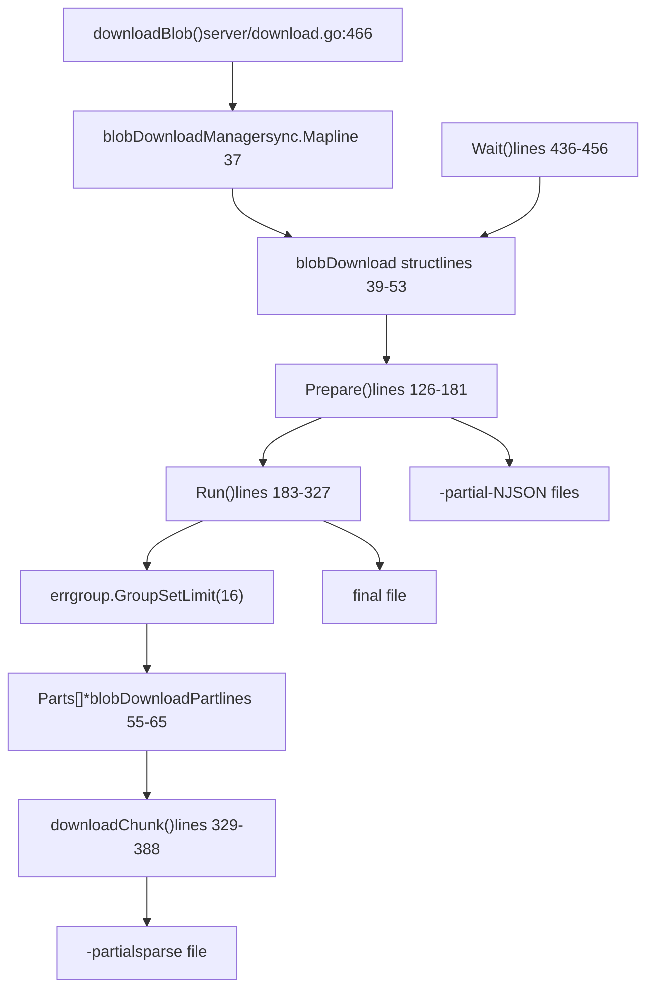
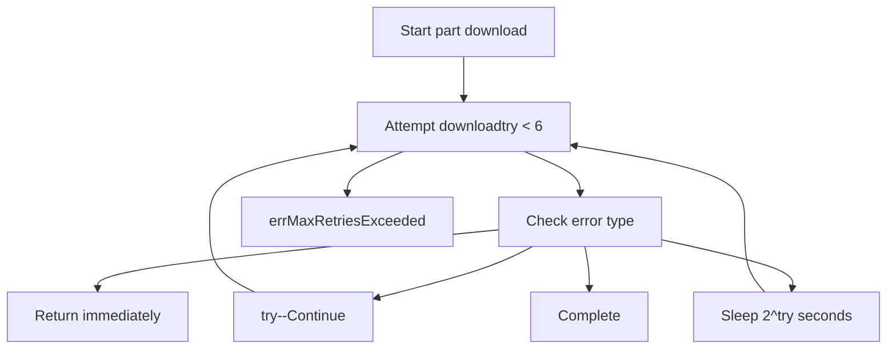
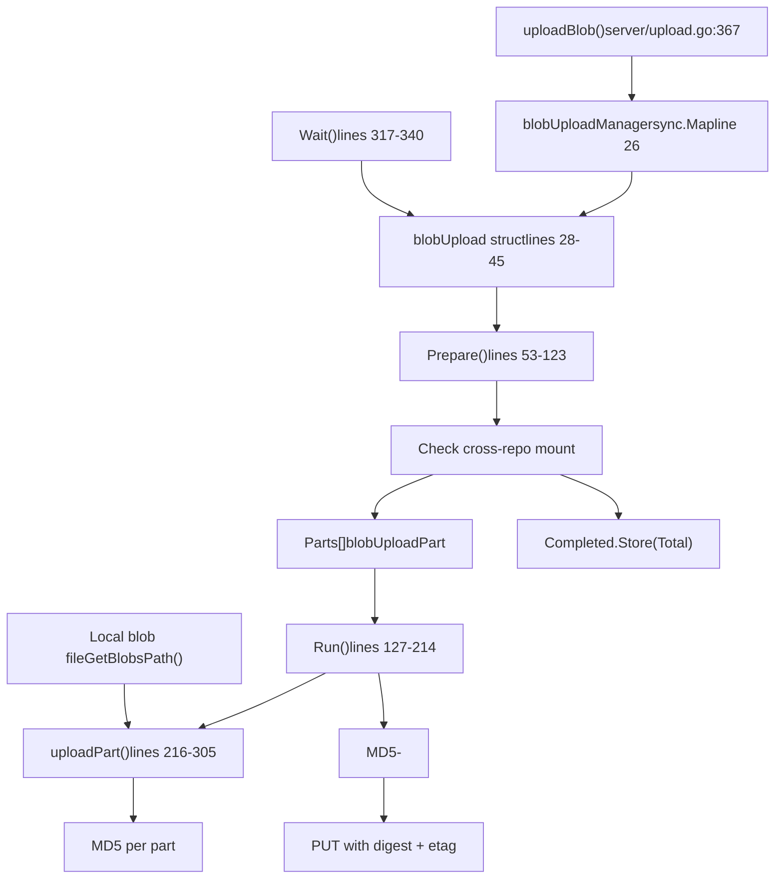

# Blob Transfer and Authentication

Relevant source files

-   [auth/auth.go](https://github.com/ollama/ollama/blob/562c76d7/auth/auth.go)
-   [server/auth.go](https://github.com/ollama/ollama/blob/562c76d7/server/auth.go)
-   [server/auth\_test.go](https://github.com/ollama/ollama/blob/562c76d7/server/auth_test.go)
-   [server/download.go](https://github.com/ollama/ollama/blob/562c76d7/server/download.go)
-   [server/sparse\_common.go](https://github.com/ollama/ollama/blob/562c76d7/server/sparse_common.go)
-   [server/sparse\_windows.go](https://github.com/ollama/ollama/blob/562c76d7/server/sparse_windows.go)
-   [server/upload.go](https://github.com/ollama/ollama/blob/562c76d7/server/upload.go)
-   [types/errtypes/errtypes.go](https://github.com/ollama/ollama/blob/562c76d7/types/errtypes/errtypes.go)

## Purpose and Scope

This page documents Ollama's blob download and upload protocol, including parallel transfer mechanisms, resume capabilities, and authentication systems. Blobs are the fundamental storage units for model data in Ollama's content-addressable system. For information about how blobs fit into the model registry structure, see [Model Registry and Layers](/ollama/ollama/4.2-model-registry-and-layers). For details on the GGUF blob format, see [Model File Formats](/ollama/ollama/4.4-model-file-formats).

**Sources:** [server/download.go](https://github.com/ollama/ollama/blob/562c76d7/server/download.go) [server/upload.go](https://github.com/ollama/ollama/blob/562c76d7/server/upload.go)

---

## Content-Addressable Storage

Ollama stores blobs in a content-addressable system where each blob is identified by its SHA256 digest. Blobs are stored in the `~/.ollama/blobs/` directory with filenames matching their digest.

### Blob Path Structure

The `GetBlobsPath` function converts a digest into a filesystem path:

```
~/.ollama/blobs/sha256-<64-character-hex-digest>
```
The digest format must match the pattern `sha256[:-][0-9a-fA-F]{64}`. Both colon (`:`) and dash (`-`) separators are accepted, but internally stored as dash-separated to ensure filesystem compatibility.

**Path Validation:**

-   Input: `sha256:456402914e838a953e0cf80caa6adbe75383d9e63584a964f504a7bbb8f7aad9`
-   Stored: `~/.ollama/blobs/sha256-456402914e838a953e0cf80caa6adbe75383d9e63584a964f504a7bbb8f7aad9`

**Sources:** [server/modelpath.go125-146](https://github.com/ollama/ollama/blob/562c76d7/server/modelpath.go#L125-L146)

### Partial File Management

During downloads, the system creates temporary files with naming conventions that support resume:

| File Type | Naming Pattern | Purpose |
| --- | --- | --- |
| Main partial file | `<blob-path>-partial` | Sparse file containing all download parts |
| Part metadata | `<blob-path>-partial-<N>` | JSON metadata for resume capability |

**Sources:** [server/download.go103-107](https://github.com/ollama/ollama/blob/562c76d7/server/download.go#L103-L107) [server/download.go218-223](https://github.com/ollama/ollama/blob/562c76d7/server/download.go#L218-L223)

### Sparse File Optimization

On Windows, downloaded files are marked as sparse to avoid allocating disk space for unfilled regions. This optimization allows immediate truncation to the full blob size without consuming disk space until data is written.

**Sources:** [server/sparse\_windows.go9-17](https://github.com/ollama/ollama/blob/562c76d7/server/sparse_windows.go#L9-L17) [server/sparse\_common.go7-8](https://github.com/ollama/ollama/blob/562c76d7/server/sparse_common.go#L7-L8)

---

## Download Protocol

### Download Architecture


**Sources:** [server/download.go39-66](https://github.com/ollama/ollama/blob/562c76d7/server/download.go#L39-L66) [server/download.go126-327](https://github.com/ollama/ollama/blob/562c76d7/server/download.go#L126-L327) [server/download.go466-507](https://github.com/ollama/ollama/blob/562c76d7/server/download.go#L466-L507)

### Part Size Calculation

The download system divides blobs into parallel parts based on total size:

| Configuration | Value | Source |
| --- | --- | --- |
| Number of parts | 16 | `numDownloadParts` [server/download.go98](https://github.com/ollama/ollama/blob/562c76d7/server/download.go#L98-L98) |
| Minimum part size | 100 MB | `minDownloadPartSize` [server/download.go99](https://github.com/ollama/ollama/blob/562c76d7/server/download.go#L99-L99) |
| Maximum part size | 1000 MB | `maxDownloadPartSize` [server/download.go100](https://github.com/ollama/ollama/blob/562c76d7/server/download.go#L100-L100) |

**Part Size Algorithm:**

1.  Calculate `size = total / 16`
2.  Clamp to range `[100MB, 1000MB]`
3.  Divide blob into parts of this size
4.  Last part may be smaller to match total size

**Sources:** [server/download.go97-101](https://github.com/ollama/ollama/blob/562c76d7/server/download.go#L97-L101) [server/download.go154-173](https://github.com/ollama/ollama/blob/562c76d7/server/download.go#L154-L173)

### Resume Capability

The download system supports resuming interrupted downloads by persisting part metadata:

> **[Mermaid sequence]**
> *(图表结构无法解析)*

**Part Metadata Structure (JSON):**

```
{  "N": 0,  "Offset": 0,  "Size": 104857600,  "Completed": 52428800}
```
**Sources:** [server/download.go126-181](https://github.com/ollama/ollama/blob/562c76d7/server/download.go#L126-L181) [server/download.go400-424](https://github.com/ollama/ollama/blob/562c76d7/server/download.go#L400-L424)

### Parallel Download Execution

Each part downloads independently using HTTP Range requests:

**Range Header Format:**

```
Range: bytes={StartsAt}-{StopsAt-1}
```
Where:

-   `StartsAt() = Offset + Completed` - Resume point
-   `StopsAt() = Offset + Size` - End of part

**Concurrency Control:**

-   Uses `errgroup.WithContext` with `SetLimit(16)`
-   Limits active part downloads to 16 concurrent requests
-   Automatically cancels remaining parts on error

**Sources:** [server/download.go273-305](https://github.com/ollama/ollama/blob/562c76d7/server/download.go#L273-L305) [server/download.go329-357](https://github.com/ollama/ollama/blob/562c76d7/server/download.go#L329-L357)

### Retry and Backoff Strategy

The download system implements multiple retry mechanisms:

#### Per-Part Retry Logic


**Retry Configuration:**

-   Maximum retries: 6 (`maxRetries` constant)
-   Backoff formula: `2^try` seconds
-   Stalled parts don't count toward retry limit

**Sources:** [server/download.go29](https://github.com/ollama/ollama/blob/562c76d7/server/download.go#L29-L29) [server/download.go282-304](https://github.com/ollama/ollama/blob/562c76d7/server/download.go#L282-L304)

#### Stall Detection

A separate goroutine monitors each part for stalls:

**Stall Detection Logic:**

-   Check interval: 1 second
-   Stall threshold: 30 seconds without progress
-   On stall: Return `errPartStalled` to trigger retry
-   Stalled retries don't consume retry quota

**Sources:** [server/download.go33](https://github.com/ollama/ollama/blob/562c76d7/server/download.go#L33-L33) [server/download.go359-385](https://github.com/ollama/ollama/blob/562c76d7/server/download.go#L359-L385)

#### Direct URL Backoff

When obtaining a direct download URL (for redirect-based CDN acceleration), a separate backoff applies:

**Backoff Characteristics:**

-   Formula: `min(n^2 * 10ms, 10s)` with randomization
-   Randomization: `0.5x` to `1.5x` of calculated delay
-   Prevents thundering herd problem

**Sources:** [server/download.go188-212](https://github.com/ollama/ollama/blob/562c76d7/server/download.go#L188-L212) [server/download.go227-268](https://github.com/ollama/ollama/blob/562c76d7/server/download.go#L227-L268)

### Redirect Handling

The download system optimizes for CDN redirects:

1.  **Initial Request** to registry with custom `CheckRedirect` handler
2.  **Capture Redirect URL** when hostname differs from registry
3.  **Parallel Downloads** directly from CDN URL
4.  **No Authentication** on redirect URLs (pre-authenticated)

**Redirect Limits:**

-   Maximum 10 redirects
-   Stop at first hostname change
-   Returns `errMaxRedirectsExceeded` if exceeded

**Sources:** [server/download.go34](https://github.com/ollama/ollama/blob/562c76d7/server/download.go#L34-L34) [server/download.go227-268](https://github.com/ollama/ollama/blob/562c76d7/server/download.go#L227-L268)

---

## Upload Protocol

### Upload Architecture


**Sources:** [server/upload.go28-45](https://github.com/ollama/ollama/blob/562c76d7/server/upload.go#L28-L45) [server/upload.go53-214](https://github.com/ollama/ollama/blob/562c76d7/server/upload.go#L53-L214) [server/upload.go367-403](https://github.com/ollama/ollama/blob/562c76d7/server/upload.go#L367-L403)

### Cross-Repository Blob Mounting

Before uploading, the system attempts to mount the blob from another repository if it already exists in the registry:

**Mount Request:**

```
POST /v2/{namespace}/{repository}/blobs/uploads/?mount={digest}&from={source-repo}
```
**Mount Response:**

-   `201 Created`: Blob mounted successfully, skip upload
-   Other status: Proceed with upload

This optimization avoids re-uploading blobs that exist under different model names but have identical content.

**Sources:** [server/upload.go59-65](https://github.com/ollama/ollama/blob/562c76d7/server/upload.go#L59-L65) [server/upload.go84-89](https://github.com/ollama/ollama/blob/562c76d7/server/upload.go#L84-L89)

### Upload Session Management

The registry provides a session URL for chunked uploads:

**Session Headers:**

```
Docker-Upload-Location: <upload-session-url>
Location: <upload-session-url>
```
The `nextURL` channel sequences part uploads:

1.  Prepare receives initial session URL
2.  Each `uploadPart` reads from `nextURL` channel
3.  After successful part upload, writes next URL to channel
4.  Serializes uploads if server doesn't support redirects

**Sources:** [server/upload.go72-76](https://github.com/ollama/ollama/blob/562c76d7/server/upload.go#L72-L76) [server/upload.go120-122](https://github.com/ollama/ollama/blob/562c76d7/server/upload.go#L120-L122) [server/upload.go148-151](https://github.com/ollama/ollama/blob/562c76d7/server/upload.go#L148-L151)

### Parallel Upload Execution

Upload parts use similar sizing logic to downloads but with different handling:

> **[Mermaid sequence]**
> *(图表结构无法解析)*

**Sources:** [server/upload.go144-173](https://github.com/ollama/ollama/blob/562c76d7/server/upload.go#L144-L173) [server/upload.go216-305](https://github.com/ollama/ollama/blob/562c76d7/server/upload.go#L216-L305)

### Upload Part Headers

Each part includes specific headers:

| Header | Value | Purpose |
| --- | --- | --- |
| `Content-Type` | `application/octet-stream` | Binary data |
| `Content-Length` | Part size in bytes | Upload size |
| `Content-Range` | `{offset}-{offset+size-1}` | Part position (PATCH only) |
| `X-Redirect-Uploads` | `1` | Request redirect support (PATCH only) |

**Sources:** [server/upload.go217-224](https://github.com/ollama/ollama/blob/562c76d7/server/upload.go#L217-L224)

### MD5 Checksum and ETag

The upload system generates a multi-part MD5 ETag for integrity verification:

**ETag Format:**

```
{hex-md5-of-concatenated-part-md5s}-{part-count}
```
**Calculation Process:**

1.  Each part computes MD5 during upload
2.  Final commit concatenates all part MD5s
3.  Computes MD5 of concatenated MD5s
4.  Appends part count with dash separator

**Commit Request:**

```
PUT {session-url}?digest={sha256-digest}&etag={md5-hash}-{parts}
Content-Type: application/octet-stream
Content-Length: 0
```
**Sources:** [server/upload.go183-196](https://github.com/ollama/ollama/blob/562c76d7/server/upload.go#L183-L196) [server/upload.go226-230](https://github.com/ollama/ollama/blob/562c76d7/server/upload.go#L226-L230) [server/upload.go302-303](https://github.com/ollama/ollama/blob/562c76d7/server/upload.go#L302-L303)

### Upload Retry Logic

Upload retries follow similar patterns to downloads:

**Per-Part Retry:**

-   Maximum 6 retries per part
-   Exponential backoff: `2^try` seconds
-   Context cancellation returns immediately

**Commit Retry:**

-   Maximum 6 retries for final PUT
-   Same exponential backoff
-   Critical operation as it finalizes the upload

**Rollback on Error:** The `progressWriter` tracks bytes written and rolls back progress counters on failure, ensuring accurate retry progress reporting.

**Sources:** [server/upload.go152-171](https://github.com/ollama/ollama/blob/562c76d7/server/upload.go#L152-L171) [server/upload.go197-210](https://github.com/ollama/ollama/blob/562c76d7/server/upload.go#L197-L210) [server/upload.go350-365](https://github.com/ollama/ollama/blob/562c76d7/server/upload.go#L350-L365)

---

## Authentication Protocol

### Registry Challenge-Response Flow

> **[Mermaid sequence]**
> *(图表结构无法解析)*

**Sources:** [server/auth.go22-95](https://github.com/ollama/ollama/blob/562c76d7/server/auth.go#L22-L95) [server/upload.go279-288](https://github.com/ollama/ollama/blob/562c76d7/server/upload.go#L279-L288)

### Registry Challenge Structure

The `WWW-Authenticate` header contains challenge parameters:

**Challenge Format:**

```
Bearer realm="https://auth.example.com/token",service="registry",scope="repository:library/model:pull,push"
```
**Parsed Structure:**

```
type registryChallenge struct {    Realm   string  // Auth server URL    Service string  // Registry service identifier    Scope   string  // Space-separated permission scopes}
```
**Sources:** [server/auth.go22-26](https://github.com/ollama/ollama/blob/562c76d7/server/auth.go#L22-L26)

### Authorization URL Construction

The challenge is converted to an authorization request URL:

**Query Parameters:**

| Parameter | Value | Source |
| --- | --- | --- |
| `service` | From challenge | Registry service identifier |
| `scope` | From challenge (split on space) | Repository and permission scopes |
| `ts` | Current Unix timestamp | Prevents replay attacks |
| `nonce` | 16-byte random base64 | Additional replay protection |

**Sources:** [server/auth.go28-51](https://github.com/ollama/ollama/blob/562c76d7/server/auth.go#L28-L51)

### SSH Key-Based Signing

Ollama uses SSH key signing for authentication:

**Key Location:**

```
~/.ollama/id_ed25519
```
**Signature Data:**

```
{method},{url},{base64(hex(sha256(body)))}
```
For GET requests with no body, the SHA256 hash is computed over empty data.

**Signature Format:**

```
{base64-pubkey}:{base64-signature}
```
This format allows the server to:

1.  Extract the public key to identify the user
2.  Verify the signature matches the request

**Sources:** [auth/auth.go19](https://github.com/ollama/ollama/blob/562c76d7/auth/auth.go#L19-L19) [auth/auth.go53-85](https://github.com/ollama/ollama/blob/562c76d7/auth/auth.go#L53-L85) [server/auth.go59-68](https://github.com/ollama/ollama/blob/562c76d7/server/auth.go#L59-L68)

### Token Acquisition

The signed request retrieves a bearer token:

**Request Headers:**

```
Authorization: {pubkey}:{signature}
```
**Response:**

```
{  "token": "eyJhbGc...",  "expires_in": 300,  "issued_at": "2024-01-01T00:00:00Z"}
```
The token is then used in subsequent requests:

```
Authorization: Bearer {token}
```
**Sources:** [server/auth.go53-95](https://github.com/ollama/ollama/blob/562c76d7/server/auth.go#L53-L95)

### Public Key Management

The system provides utilities for public key extraction:

**Public Key Format:**

```
func GetPublicKey() (string, error)// Returns: "ssh-ed25519 AAAAC3NzaC1lZDI1NTE5AAAAIxxx..."
```
The public key is:

1.  Read from `~/.ollama/id_ed25519`
2.  Parsed as SSH private key
3.  Public key extracted and marshaled in OpenSSH authorized\_keys format
4.  Whitespace trimmed

**Sources:** [auth/auth.go21-42](https://github.com/ollama/ollama/blob/562c76d7/auth/auth.go#L21-L42)

---

## Progress Tracking and Lifecycle Management

### Reference Counting

Both downloads and uploads use atomic reference counting to manage concurrent access:

> **[Mermaid stateDiagram]**
> *(图表结构无法解析)*

**Reference Operations:**

| Operation | Action | Effect |
| --- | --- | --- |
| `LoadOrStore` | First access | Create download, `ok=false` |
| `LoadOrStore` | Subsequent | Reuse download, `ok=true` |
| `acquire()` | Add reference | `references.Add(1)` |
| `release()` | Remove reference | `references.Add(-1)` |
| `release()` when 0 | Cancel download | Call `CancelFunc()` |

**Sources:** [server/download.go426-434](https://github.com/ollama/ollama/blob/562c76d7/server/download.go#L426-L434) [server/upload.go307-315](https://github.com/ollama/ollama/blob/562c76d7/server/upload.go#L307-L315)

### Progress Reporting

Progress is reported through callback functions with atomic counters:

**Progress Structure:**

```
api.ProgressResponse{    Status:    "pulling sha256:456402914e...",    Digest:    "sha256:45640291...",    Total:     1073741824,      // Total bytes    Completed: 536870912,       // Completed bytes (atomic)}
```
**Update Frequency:**

-   Ticker interval: 60 milliseconds
-   Atomic reads ensure consistency without locks
-   Callback invoked on ticker or completion

**Progress Writer:** The upload system uses a `progressWriter` that implements `io.Writer`:

1.  Intercepts bytes written during upload
2.  Updates atomic `Completed` counter
3.  Tracks `written` locally for rollback
4.  Can rollback on error without affecting global progress

**Sources:** [server/download.go436-456](https://github.com/ollama/ollama/blob/562c76d7/server/download.go#L436-L456) [server/upload.go317-340](https://github.com/ollama/ollama/blob/562c76d7/server/upload.go#L317-L340) [server/upload.go350-365](https://github.com/ollama/ollama/blob/562c76d7/server/upload.go#L350-L365)

### Download Lifecycle

> **[Mermaid stateDiagram]**
> *(图表结构无法解析)*

**Sources:** [server/download.go466-507](https://github.com/ollama/ollama/blob/562c76d7/server/download.go#L466-L507) [server/download.go126-327](https://github.com/ollama/ollama/blob/562c76d7/server/download.go#L126-L327)

### Upload Lifecycle

> **[Mermaid stateDiagram]**
> *(图表结构无法解析)*

**Sources:** [server/upload.go367-403](https://github.com/ollama/ollama/blob/562c76d7/server/upload.go#L367-L403) [server/upload.go53-214](https://github.com/ollama/ollama/blob/562c76d7/server/upload.go#L53-L214)

### Completion and Cleanup

**Download Completion:**

1.  Close sparse partial file
2.  Remove all part metadata files (`-partial-N`)
3.  Rename `-partial` to final blob name
4.  Delete from `blobDownloadManager`

**Upload Completion:**

1.  Calculate final MD5 ETag
2.  Commit with PUT request
3.  Close local blob file
4.  Delete from `blobUploadManager`

**Error Handling:**

-   Partial files preserved for resume
-   Reference count ensures cleanup safety
-   Context cancellation propagates to all parts

**Sources:** [server/download.go311-326](https://github.com/ollama/ollama/blob/562c76d7/server/download.go#L311-L326) [server/upload.go180-213](https://github.com/ollama/ollama/blob/562c76d7/server/upload.go#L180-L213)

---

## Registry Options and Request Handling

### Registry Options Structure

Both download and upload operations accept `registryOptions`:

```
type registryOptions struct {    Token         string           // Bearer token from auth    CheckRedirect func(*http.Request, []*http.Request) error    // Additional fields for HTTP client configuration}
```
These options are passed through the authentication and request pipeline to configure HTTP behavior.

**Sources:** Code references in [server/download.go](https://github.com/ollama/ollama/blob/562c76d7/server/download.go) and [server/upload.go](https://github.com/ollama/ollama/blob/562c76d7/server/upload.go)

### Request Retry Wrapper

The `makeRequestWithRetry` function provides consistent retry logic across all registry operations:

**Retry Conditions:**

-   Network errors
-   HTTP 5xx errors (server errors)
-   HTTP 401 (triggers re-authentication)
-   HTTP 429 (rate limiting)

**Non-Retry Conditions:**

-   HTTP 404 (blob not found)
-   Context cancellation
-   HTTP 4xx (except 401, 429)

This wrapper is used for:

-   HEAD requests (check blob existence)
-   POST requests (start upload sessions)
-   GET requests (direct downloads)
-   PUT requests (commit uploads)

**Sources:** References throughout [server/download.go](https://github.com/ollama/ollama/blob/562c76d7/server/download.go) and [server/upload.go](https://github.com/ollama/ollama/blob/562c76d7/server/upload.go)

---

## Summary

The blob transfer system provides robust, resumable, and efficient transfer of large model files:

**Key Features:**

-   **Parallel Transfers:** 16 concurrent parts with size optimization
-   **Resume Capability:** JSON metadata persists progress across restarts
-   **Retry Resilience:** Exponential backoff with stall detection
-   **CDN Optimization:** Direct URL redirects bypass registry for large transfers
-   **Cross-Repo Mounting:** Deduplicates uploads across repositories
-   **Integrity Verification:** MD5 ETags ensure upload correctness
-   **SSH Authentication:** Secure, key-based registry access
-   **Reference Counting:** Safe concurrent access to shared transfer state

The system balances performance (parallel transfers), reliability (retries and resume), and efficiency (mounting and CDN optimization) to provide a production-grade blob transfer implementation.

**Sources:** [server/download.go](https://github.com/ollama/ollama/blob/562c76d7/server/download.go) [server/upload.go](https://github.com/ollama/ollama/blob/562c76d7/server/upload.go) [server/auth.go](https://github.com/ollama/ollama/blob/562c76d7/server/auth.go) [auth/auth.go](https://github.com/ollama/ollama/blob/562c76d7/auth/auth.go)
