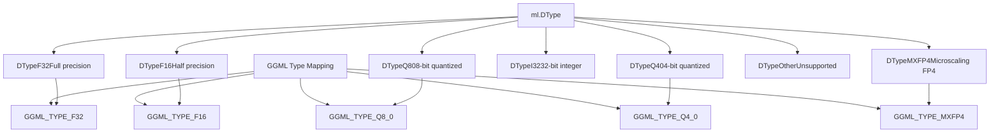
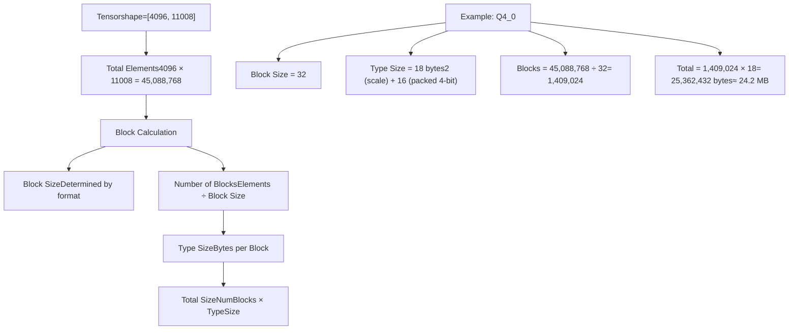
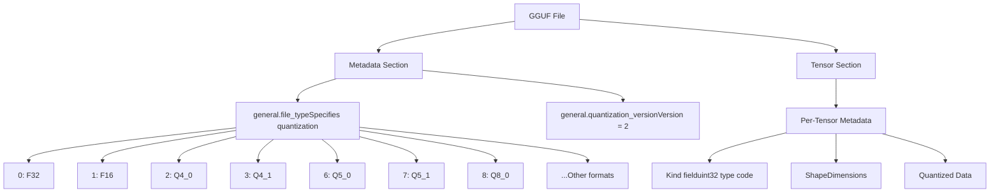
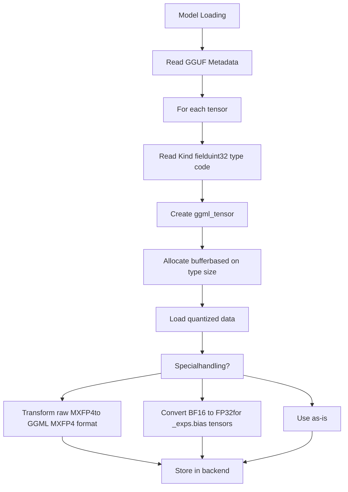
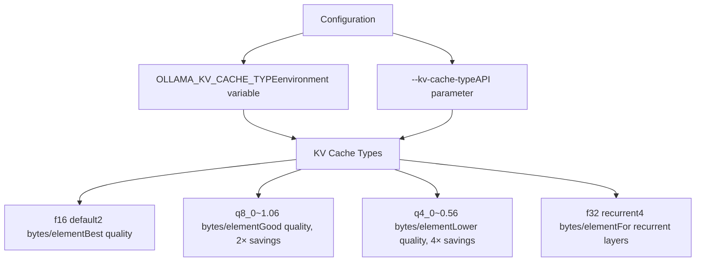
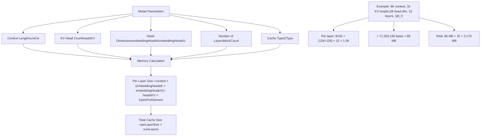
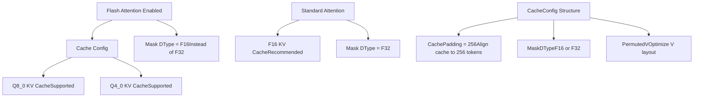
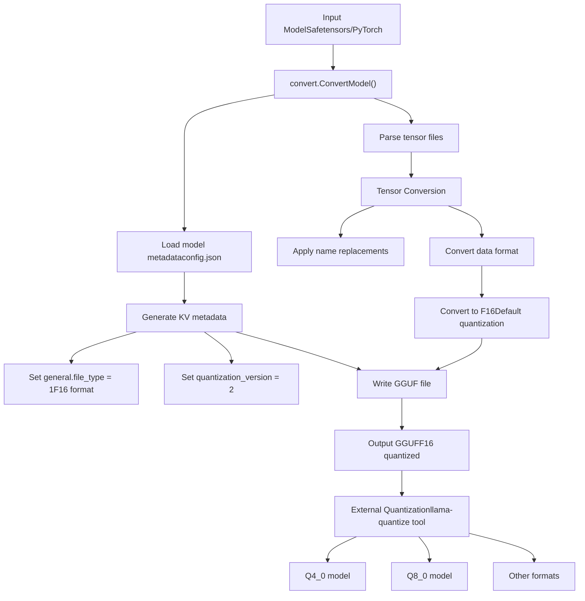
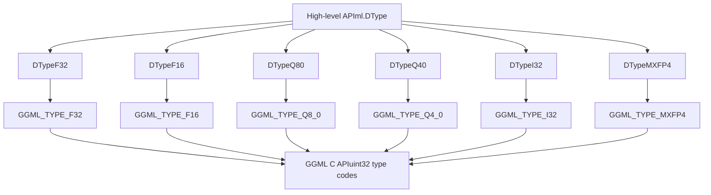

# Quantization

Relevant source files

-   [convert/convert.go](https://github.com/ollama/ollama/blob/562c76d7/convert/convert.go)
-   [fs/ggml/ggml.go](https://github.com/ollama/ollama/blob/562c76d7/fs/ggml/ggml.go)
-   [fs/ggml/ggml\_test.go](https://github.com/ollama/ollama/blob/562c76d7/fs/ggml/ggml_test.go)
-   [integration/embed\_test.go](https://github.com/ollama/ollama/blob/562c76d7/integration/embed_test.go)
-   [kvcache/cache.go](https://github.com/ollama/ollama/blob/562c76d7/kvcache/cache.go)
-   [kvcache/causal.go](https://github.com/ollama/ollama/blob/562c76d7/kvcache/causal.go)
-   [kvcache/causal\_test.go](https://github.com/ollama/ollama/blob/562c76d7/kvcache/causal_test.go)
-   [kvcache/encoder.go](https://github.com/ollama/ollama/blob/562c76d7/kvcache/encoder.go)
-   [kvcache/wrapper.go](https://github.com/ollama/ollama/blob/562c76d7/kvcache/wrapper.go)
-   [ml/backend.go](https://github.com/ollama/ollama/blob/562c76d7/ml/backend.go)
-   [ml/backend/ggml/ggml.go](https://github.com/ollama/ollama/blob/562c76d7/ml/backend/ggml/ggml.go)
-   [model/input/input.go](https://github.com/ollama/ollama/blob/562c76d7/model/input/input.go)
-   [model/model.go](https://github.com/ollama/ollama/blob/562c76d7/model/model.go)
-   [model/model\_test.go](https://github.com/ollama/ollama/blob/562c76d7/model/model_test.go)
-   [model/models/models.go](https://github.com/ollama/ollama/blob/562c76d7/model/models/models.go)
-   [model/parsers/parsers.go](https://github.com/ollama/ollama/blob/562c76d7/model/parsers/parsers.go)
-   [model/parsers/parsers\_test.go](https://github.com/ollama/ollama/blob/562c76d7/model/parsers/parsers_test.go)
-   [model/renderers/glmocr.go](https://github.com/ollama/ollama/blob/562c76d7/model/renderers/glmocr.go)
-   [model/renderers/glmocr\_test.go](https://github.com/ollama/ollama/blob/562c76d7/model/renderers/glmocr_test.go)
-   [model/renderers/renderer.go](https://github.com/ollama/ollama/blob/562c76d7/model/renderers/renderer.go)
-   [runner/llamarunner/cache.go](https://github.com/ollama/ollama/blob/562c76d7/runner/llamarunner/cache.go)
-   [runner/llamarunner/runner.go](https://github.com/ollama/ollama/blob/562c76d7/runner/llamarunner/runner.go)
-   [runner/ollamarunner/cache.go](https://github.com/ollama/ollama/blob/562c76d7/runner/ollamarunner/cache.go)
-   [runner/ollamarunner/cache\_test.go](https://github.com/ollama/ollama/blob/562c76d7/runner/ollamarunner/cache_test.go)
-   [runner/ollamarunner/runner.go](https://github.com/ollama/ollama/blob/562c76d7/runner/ollamarunner/runner.go)
-   [server/internal/internal/backoff/backoff.go](https://github.com/ollama/ollama/blob/562c76d7/server/internal/internal/backoff/backoff.go)

Quantization in Ollama refers to reducing the precision of model weights and runtime data structures to decrease memory usage and improve inference performance. This system implements multiple quantization formats for both model storage (GGUF files) and runtime caching (KV cache).

For information about model file formats and storage, see [Model File Formats](/ollama/ollama/4.4-model-file-formats). For KV cache implementation details, see [KV Cache System](/ollama/ollama/5.3-kv-cache-system).

## Overview

Quantization works by representing floating-point values using fewer bits. Instead of storing each weight as a 32-bit float (F32) or 16-bit float (F16), quantization schemes can use as few as 2-8 bits per value, reducing memory footprint by 4-16x while maintaining acceptable accuracy.

Ollama supports quantization in two primary areas:

-   **Model Weight Quantization**: Weights stored in GGUF files using various quantization schemes
-   **KV Cache Quantization**: Runtime attention cache using Q8\_0, Q4\_0, or F16 formats

## Quantization Format Taxonomy

```mermaid
flowchart TD
    QFormats["Quantization Formats"]
    Float["Full Precision"]
    Legacy["Legacy Formats"]
    KSeries["K-Series"]
    IQSeries["IQ-Series"]
    Special["Special Formats"]
    F32["F3232-bit float4 bytes"]
    F16["F1616-bit float2 bytes"]
    BF16["BF16bfloat162 bytes"]
    Q4_0["Q4_0block_size=322.5 bytes/value"]
    Q4_1["Q4_1block_size=323 bytes/value"]
    Q5_0["Q5_0block_size=322.75 bytes/value"]
    Q5_1["Q5_1block_size=323.125 bytes/value"]
    Q8_0["Q8_0block_size=321.0625 bytes/value"]
    Q8_1["Q8_1block_size=321.25 bytes/value"]
    Q2_K["Q2_Kblock_size=256~0.7 bytes/value"]
    Q3_K["Q3_Kblock_size=256~0.9 bytes/value"]
    Q4_K["Q4_Kblock_size=256~1.1 bytes/value"]
    Q5_K["Q5_Kblock_size=256~1.3 bytes/value"]
    Q6_K["Q6_Kblock_size=256~1.7 bytes/value"]
    Q8_K["Q8_Kblock_size=256~2.1 bytes/value"]
    IQ2_XXS["IQ2_XXS"]
    IQ2_XS["IQ2_XS"]
    IQ3_XXS["IQ3_XXS"]
    IQ1_S["IQ1_S"]
    IQ4_NL["IQ4_NL"]
    IQ3_S["IQ3_S"]
    IQ2_S["IQ2_S"]
    IQ4_XS["IQ4_XS"]
    IQ1_M["IQ1_M"]
    MXFP4["MXFP4Microscaling FP4block_size=32"]

    QFormats --> Float
    QFormats --> Legacy
    QFormats --> KSeries
    QFormats --> IQSeries
    QFormats --> Special
    Float --> F32
    Float --> F16
    Float --> BF16
    Legacy --> Q4_0
    Legacy --> Q4_1
    Legacy --> Q5_0
    Legacy --> Q5_1
    Legacy --> Q8_0
    Legacy --> Q8_1
    KSeries --> Q2_K
    KSeries --> Q3_K
    KSeries --> Q4_K
    KSeries --> Q5_K
    KSeries --> Q6_K
    KSeries --> Q8_K
    IQSeries --> IQ2_XXS
    IQSeries --> IQ2_XS
    IQSeries --> IQ3_XXS
    IQSeries --> IQ1_S
    IQSeries --> IQ4_NL
    IQSeries --> IQ3_S
    IQSeries --> IQ2_S
    IQSeries --> IQ4_XS
    IQSeries --> IQ1_M
    Special --> MXFP4
```


**Sources**: [fs/ggml/ggml.go405-501](https://github.com/ollama/ollama/blob/562c76d7/fs/ggml/ggml.go#L405-L501) [fs/ggml/ggml.go404-429](https://github.com/ollama/ollama/blob/562c76d7/fs/ggml/ggml.go#L404-L429)

## Quantization Type System

### DType Enumeration

The backend type system uses a `DType` enumeration to represent data types:


The `ggmlDType()` function [ml/backend/ggml/ggml.go1113-1130](https://github.com/ollama/ollama/blob/562c76d7/ml/backend/ggml/ggml.go#L1113-L1130) performs the mapping between Ollama's `ml.DType` and GGML's native type system. The reverse mapping is performed by the `DType()` method [ml/backend/ggml/ggml.go1094-1111](https://github.com/ollama/ollama/blob/562c76d7/ml/backend/ggml/ggml.go#L1094-L1111)

**Sources**: [ml/backend.go397-407](https://github.com/ollama/ollama/blob/562c76d7/ml/backend.go#L397-L407) [ml/backend/ggml/ggml.go1094-1130](https://github.com/ollama/ollama/blob/562c76d7/ml/backend/ggml/ggml.go#L1094-L1130)

## Block-Based Quantization

Most quantization formats use a block-based approach where values are grouped into blocks, and each block shares quantization parameters (scale factors, zero points).

### Block Size and Type Size Calculation


The calculation is implemented in [fs/ggml/ggml.go512-514](https://github.com/ollama/ollama/blob/562c76d7/fs/ggml/ggml.go#L512-L514):

```
Size() = Elements() × TypeSize() / BlockSize()
```
**Sources**: [fs/ggml/ggml.go404-429](https://github.com/ollama/ollama/blob/562c76d7/fs/ggml/ggml.go#L404-L429) [fs/ggml/ggml.go431-502](https://github.com/ollama/ollama/blob/562c76d7/fs/ggml/ggml.go#L431-L502) [fs/ggml/ggml.go504-514](https://github.com/ollama/ollama/blob/562c76d7/fs/ggml/ggml.go#L504-L514)

## Quantization Format Details

### Legacy Format Specifications

| Format | Block Size | Bytes/Block | Bytes/Value | Components |
| --- | --- | --- | --- | --- |
| **Q4\_0** | 32 | 18 | 0.5625 | 2B scale + 16B data |
| **Q4\_1** | 32 | 20 | 0.625 | 2B scale + 2B min + 16B data |
| **Q5\_0** | 32 | 22 | 0.6875 | 2B scale + 4B high bits + 16B data |
| **Q5\_1** | 32 | 24 | 0.75 | 2B scale + 2B min + 4B high + 16B data |
| **Q8\_0** | 32 | 34 | 1.0625 | 2B scale + 32B data |
| **Q8\_1** | 32 | 36 | 1.125 | 2B scale + 2B min + 32B data |

### K-Series Format Specifications

K-series formats use larger blocks (256 values) with more sophisticated quantization schemes:

| Format | Block Size | Bytes/Block | Bytes/Value | Description |
| --- | --- | --- | --- | --- |
| **Q2\_K** | 256 | 82 | 0.3203 | 2-bit + scales + biases |
| **Q3\_K** | 256 | 110 | 0.4297 | 3-bit + scales + high bits |
| **Q4\_K** | 256 | 144 | 0.5625 | 4-bit + scales + bias |
| **Q5\_K** | 256 | 176 | 0.6875 | 5-bit + scales + high bits |
| **Q6\_K** | 256 | 210 | 0.8203 | 6-bit + scales |
| **Q8\_K** | 256 | 292 | 1.1406 | 8-bit + scales |

K-series formats provide better quality-to-size ratio than legacy formats at similar bit counts.

**Sources**: [fs/ggml/ggml.go438-502](https://github.com/ollama/ollama/blob/562c76d7/fs/ggml/ggml.go#L438-L502)

### IQ-Series Formats

IQ-series (Importance Quantization) are advanced formats that use importance-based quantization:

| Format | Block Size | Approximate Bits | Use Case |
| --- | --- | --- | --- |
| **IQ1\_S** | 32 | ~1.56 bits | Extreme compression |
| **IQ1\_M** | 32 | ~1.75 bits | Extreme compression |
| **IQ2\_XXS** | 32 | ~2.06 bits | Very high compression |
| **IQ2\_XS** | 32 | ~2.31 bits | High compression |
| **IQ2\_S** | 256 | ~2.5 bits | Balanced compression |
| **IQ3\_XXS** | 256 | ~3.06 bits | Medium compression |
| **IQ3\_S** | 256 | ~3.44 bits | Quality-focused compression |
| **IQ4\_NL** | 32 | ~4.5 bits | Low compression, high quality |
| **IQ4\_XS** | 256 | ~4.25 bits | Balanced quality |

**Sources**: [fs/ggml/ggml.go467-495](https://github.com/ollama/ollama/blob/562c76d7/fs/ggml/ggml.go#L467-L495)

## Model Weight Quantization

### File Type Metadata

Model quantization is specified in the GGUF metadata through the `general.file_type` key:


The file type is read and exposed through the `FileType()` method [fs/ggml/ggml.go47-53](https://github.com/ollama/ollama/blob/562c76d7/fs/ggml/ggml.go#L47-L53)

**Sources**: [fs/ggml/ggml.go47-53](https://github.com/ollama/ollama/blob/562c76d7/fs/ggml/ggml.go#L47-L53) [convert/convert.go132-133](https://github.com/ollama/ollama/blob/562c76d7/convert/convert.go#L132-L133)

### Tensor Kind Field

Each tensor in a GGUF file has a `Kind` field (uint32) that specifies its quantization format. The backend reads this field and creates appropriate tensor structures:


Special handling occurs for certain types at [ml/backend/ggml/ggml.go268-274](https://github.com/ollama/ollama/blob/562c76d7/ml/backend/ggml/ggml.go#L268-L274):

-   Kind 4 (raw MXFP4) is transformed to kind 39 (GGML MXFP4 format)
-   BF16 `_exps.bias` tensors are converted to FP32 for compatibility

**Sources**: [ml/backend/ggml/ggml.go266-290](https://github.com/ollama/ollama/blob/562c76d7/ml/backend/ggml/ggml.go#L266-L290) [ml/backend/ggml/ggml.go528-566](https://github.com/ollama/ollama/blob/562c76d7/ml/backend/ggml/ggml.go#L528-L566)

### Loading Quantized Weights

The weight loading process handles quantized data specially:

> **[Mermaid sequence]**
> *(图表结构无法解析)*

The transformation for MXFP4 happens at [ml/backend/ggml/ggml.go528-566](https://github.com/ollama/ollama/blob/562c76d7/ml/backend/ggml/ggml.go#L528-L566) converting from raw stream format to GGML's internal representation.

**Sources**: [ml/backend/ggml/ggml.go468-645](https://github.com/ollama/ollama/blob/562c76d7/ml/backend/ggml/ggml.go#L468-L645) [ml/backend/ggml/ggml.go528-566](https://github.com/ollama/ollama/blob/562c76d7/ml/backend/ggml/ggml.go#L528-L566) [ml/backend/ggml/ggml.go568-595](https://github.com/ollama/ollama/blob/562c76d7/ml/backend/ggml/ggml.go#L568-L595)

## KV Cache Quantization

The KV (key-value) cache stores attention states during inference and can be quantized to reduce memory usage.

### Supported KV Cache Types


The `kvCacheTypeFromStr()` function [runner/ollamarunner/cache.go61-70](https://github.com/ollama/ollama/blob/562c76d7/runner/ollamarunner/cache.go#L61-L70) converts string specifications to `ml.DType`:

| String | DType | Bytes per Element |
| --- | --- | --- |
| `"q8_0"` | `ml.DTypeQ80` | ~1.06 |
| `"q4_0"` | `ml.DTypeQ40` | ~0.56 |
| `"f16"` (default) | `ml.DTypeF16` | 2.0 |
| `"f32"` (recurrent) | `ml.DTypeF32` | 4.0 |

**Sources**: [runner/ollamarunner/cache.go61-70](https://github.com/ollama/ollama/blob/562c76d7/runner/ollamarunner/cache.go#L61-L70) [runner/ollamarunner/cache.go34-58](https://github.com/ollama/ollama/blob/562c76d7/runner/ollamarunner/cache.go#L34-L58)

### KV Cache Memory Calculation


The calculation is performed in `GraphSize()` [fs/ggml/ggml.go598-846](https://github.com/ollama/ollama/blob/562c76d7/fs/ggml/ggml.go#L598-L846) and uses the `kvCacheBytesPerElement()` helper to determine bytes per element based on the cache type.

**Sources**: [fs/ggml/ggml.go598-660](https://github.com/ollama/ollama/blob/562c76d7/fs/ggml/ggml.go#L598-L660) [fs/ggml/ggml.go848-879](https://github.com/ollama/ollama/blob/562c76d7/fs/ggml/ggml.go#L848-L879)

### Cache Initialization Flow

> **[Mermaid sequence]**
> *(图表结构无法解析)*

The quantized cache is initialized in [runner/ollamarunner/cache.go34-58](https://github.com/ollama/ollama/blob/562c76d7/runner/ollamarunner/cache.go#L34-L58) which calls through to the KV cache initialization at [kvcache/causal.go130-182](https://github.com/ollama/ollama/blob/562c76d7/kvcache/causal.go#L130-L182)

**Sources**: [runner/ollamarunner/cache.go34-58](https://github.com/ollama/ollama/blob/562c76d7/runner/ollamarunner/cache.go#L34-L58) [kvcache/causal.go130-182](https://github.com/ollama/ollama/blob/562c76d7/kvcache/causal.go#L130-L182) [kvcache/causal.go459-473](https://github.com/ollama/ollama/blob/562c76d7/kvcache/causal.go#L459-L473)

### Flash Attention and KV Cache Quantization

When flash attention is enabled, the KV cache can use Q8\_0 or Q4\_0 quantization:


The cache configuration is determined by `CacheConfig()` [ml/backend/ggml/ggml.go686-692](https://github.com/ollama/ollama/blob/562c76d7/ml/backend/ggml/ggml.go#L686-L692) which sets `MaskDType` to F16 when flash attention is enabled.

**Sources**: [ml/backend/ggml/ggml.go686-692](https://github.com/ollama/ollama/blob/562c76d7/ml/backend/ggml/ggml.go#L686-L692) [ml/backend.go37-57](https://github.com/ollama/ollama/blob/562c76d7/ml/backend.go#L37-L57)

## Memory Impact Analysis

### Weight Quantization Impact

For a typical 7B parameter model:

| Format | Size | vs F32 | vs F16 | Quality |
| --- | --- | --- | --- | --- |
| **F32** | 28 GB | 1.0× | 2.0× | Reference |
| **F16** | 14 GB | 0.5× | 1.0× | Negligible loss |
| **Q8\_0** | 7.5 GB | 0.27× | 0.54× | Minimal loss |
| **Q6\_K** | 5.7 GB | 0.20× | 0.41× | Very good |
| **Q5\_K** | 4.8 GB | 0.17× | 0.34× | Good |
| **Q4\_K** | 3.9 GB | 0.14× | 0.28× | Acceptable |
| **Q3\_K** | 3.0 GB | 0.11× | 0.21× | Lower quality |
| **Q2\_K** | 2.2 GB | 0.08× | 0.16× | Noticeable loss |

### KV Cache Quantization Impact

For a model with 8K context, 32 layers, 32 KV heads, 128 head dim:

| Cache Type | Per Layer | Total (32 layers) | vs F16 |
| --- | --- | --- | --- |
| **F16** | 67.1 MB | 2,147 MB | 1.0× |
| **Q8\_0** | 35.7 MB | 1,142 MB | 0.53× |
| **Q4\_0** | 18.9 MB | 605 MB | 0.28× |

The memory savings are calculated as part of the graph size estimation [fs/ggml/ggml.go614-659](https://github.com/ollama/ollama/blob/562c76d7/fs/ggml/ggml.go#L614-L659)

**Sources**: [fs/ggml/ggml.go598-660](https://github.com/ollama/ollama/blob/562c76d7/fs/ggml/ggml.go#L598-L660) [fs/ggml/ggml.go848-879](https://github.com/ollama/ollama/blob/562c76d7/fs/ggml/ggml.go#L848-L879)

## Conversion and Quantization Process

### Model Conversion Pipeline


The conversion process [convert/convert.go372-393](https://github.com/ollama/ollama/blob/562c76d7/convert/convert.go#L372-L393) creates F16 models by default. Further quantization to formats like Q4\_0 or Q8\_0 typically requires external tools.

**Sources**: [convert/convert.go130-158](https://github.com/ollama/ollama/blob/562c76d7/convert/convert.go#L130-L158) [convert/convert.go372-393](https://github.com/ollama/ollama/blob/562c76d7/convert/convert.go#L372-L393) [convert/convert.go387-393](https://github.com/ollama/ollama/blob/562c76d7/convert/convert.go#L387-L393)

### Quantization Metadata

The GGUF file includes quantization metadata in the key-value store:

| Key | Type | Purpose |
| --- | --- | --- |
| `general.file_type` | uint32 | Overall quantization format |
| `general.quantization_version` | uint32 | Quantization version (2) |

Each tensor also has a `Kind` field specifying its individual quantization format, allowing mixed-precision models.

**Sources**: [convert/convert.go130-158](https://github.com/ollama/ollama/blob/562c76d7/convert/convert.go#L130-L158) [fs/ggml/ggml.go47-53](https://github.com/ollama/ollama/blob/562c76d7/fs/ggml/ggml.go#L47-L53)

## Implementation Details

### Type Size Calculation

The `TypeSize()` method [fs/ggml/ggml.go435-502](https://github.com/ollama/ollama/blob/562c76d7/fs/ggml/ggml.go#L435-L502) implements the formula for bytes per block for each quantization format:

```
TypeSize(format) returns bytes per block
Size(tensor) = Elements(tensor) × TypeSize(format) / BlockSize(format)
```
For example, Q4\_0 with block size 32:

-   TypeSize = 2 (scale) + 32/2 (4-bit packed) = 18 bytes
-   1000 elements = 1000 × 18 / 32 = 562.5 bytes

**Sources**: [fs/ggml/ggml.go404-429](https://github.com/ollama/ollama/blob/562c76d7/fs/ggml/ggml.go#L404-L429) [fs/ggml/ggml.go435-502](https://github.com/ollama/ollama/blob/562c76d7/fs/ggml/ggml.go#L435-L502) [fs/ggml/ggml.go504-514](https://github.com/ollama/ollama/blob/562c76d7/fs/ggml/ggml.go#L504-L514)

### Backend Type Mapping

The backend maintains mappings between DType and GGML types:


The `DType()` method [ml/backend/ggml/ggml.go1094-1111](https://github.com/ollama/ollama/blob/562c76d7/ml/backend/ggml/ggml.go#L1094-L1111) converts from GGML types back to `ml.DType`, while `ggmlDType()` [ml/backend/ggml/ggml.go1113-1130](https://github.com/ollama/ollama/blob/562c76d7/ml/backend/ggml/ggml.go#L1113-L1130) performs the reverse conversion.

**Sources**: [ml/backend/ggml/ggml.go1094-1130](https://github.com/ollama/ollama/blob/562c76d7/ml/backend/ggml/ggml.go#L1094-L1130)

### Quantization Support Detection

Models can query quantization support through the `SupportsKVCacheType()` method [fs/ggml/ggml.go848-879](https://github.com/ollama/ollama/blob/562c76d7/fs/ggml/ggml.go#L848-L879) which checks if a given KV cache type is compatible with the model's architecture and whether flash attention is available.

**Sources**: [fs/ggml/ggml.go848-879](https://github.com/ollama/ollama/blob/562c76d7/fs/ggml/ggml.go#L848-L879)

## Usage Patterns

### Specifying KV Cache Quantization

Users can specify KV cache quantization through environment variables or API parameters:

```
# Environment variableOLLAMA_KV_CACHE_TYPE=q8_0 ollama serve # The cache type is read during cache initialization
```
The cache type flows through the system:

1.  Environment variable read by runner
2.  Passed to `NewInputCache()` as string
3.  Converted to `ml.DType` by `kvCacheTypeFromStr()`
4.  Used in cache initialization

**Sources**: [runner/ollamarunner/cache.go34-58](https://github.com/ollama/ollama/blob/562c76d7/runner/ollamarunner/cache.go#L34-L58) [runner/ollamarunner/cache.go61-70](https://github.com/ollama/ollama/blob/562c76d7/runner/ollamarunner/cache.go#L61-L70)

### Model File Type Detection

The model file type is detected when loading:

> **[Mermaid sequence]**
> *(图表结构无法解析)*

The file type is exposed through the `FileType()` method [fs/ggml/ggml.go47-53](https://github.com/ollama/ollama/blob/562c76d7/fs/ggml/ggml.go#L47-L53) and logged during initialization [ml/backend/ggml/ggml.go135-145](https://github.com/ollama/ollama/blob/562c76d7/ml/backend/ggml/ggml.go#L135-L145)

**Sources**: [fs/ggml/ggml.go47-53](https://github.com/ollama/ollama/blob/562c76d7/fs/ggml/ggml.go#L47-L53) [ml/backend/ggml/ggml.go123-148](https://github.com/ollama/ollama/blob/562c76d7/ml/backend/ggml/ggml.go#L123-L148) [fs/ggml/ggml.go558-596](https://github.com/ollama/ollama/blob/562c76d7/fs/ggml/ggml.go#L558-L596)
