# Inference Engine

Relevant source files

-   [envconfig/config.go](https://github.com/ollama/ollama/blob/562c76d7/envconfig/config.go)
-   [envconfig/config\_test.go](https://github.com/ollama/ollama/blob/562c76d7/envconfig/config_test.go)
-   [integration/embed\_test.go](https://github.com/ollama/ollama/blob/562c76d7/integration/embed_test.go)
-   [kvcache/cache.go](https://github.com/ollama/ollama/blob/562c76d7/kvcache/cache.go)
-   [kvcache/causal.go](https://github.com/ollama/ollama/blob/562c76d7/kvcache/causal.go)
-   [kvcache/causal\_test.go](https://github.com/ollama/ollama/blob/562c76d7/kvcache/causal_test.go)
-   [kvcache/encoder.go](https://github.com/ollama/ollama/blob/562c76d7/kvcache/encoder.go)
-   [kvcache/wrapper.go](https://github.com/ollama/ollama/blob/562c76d7/kvcache/wrapper.go)
-   [llama/llama.go](https://github.com/ollama/ollama/blob/562c76d7/llama/llama.go)
-   [llama/sampling\_ext.cpp](https://github.com/ollama/ollama/blob/562c76d7/llama/sampling_ext.cpp)
-   [llama/sampling\_ext.h](https://github.com/ollama/ollama/blob/562c76d7/llama/sampling_ext.h)
-   [llm/server.go](https://github.com/ollama/ollama/blob/562c76d7/llm/server.go)
-   [ml/backend.go](https://github.com/ollama/ollama/blob/562c76d7/ml/backend.go)
-   [ml/backend/ggml/ggml.go](https://github.com/ollama/ollama/blob/562c76d7/ml/backend/ggml/ggml.go)
-   [model/input/input.go](https://github.com/ollama/ollama/blob/562c76d7/model/input/input.go)
-   [model/model.go](https://github.com/ollama/ollama/blob/562c76d7/model/model.go)
-   [model/model\_test.go](https://github.com/ollama/ollama/blob/562c76d7/model/model_test.go)
-   [runner/llamarunner/cache.go](https://github.com/ollama/ollama/blob/562c76d7/runner/llamarunner/cache.go)
-   [runner/llamarunner/runner.go](https://github.com/ollama/ollama/blob/562c76d7/runner/llamarunner/runner.go)
-   [runner/ollamarunner/cache.go](https://github.com/ollama/ollama/blob/562c76d7/runner/ollamarunner/cache.go)
-   [runner/ollamarunner/cache\_test.go](https://github.com/ollama/ollama/blob/562c76d7/runner/ollamarunner/cache_test.go)
-   [runner/ollamarunner/runner.go](https://github.com/ollama/ollama/blob/562c76d7/runner/ollamarunner/runner.go)
-   [server/internal/internal/backoff/backoff.go](https://github.com/ollama/ollama/blob/562c76d7/server/internal/internal/backoff/backoff.go)
-   [server/sched.go](https://github.com/ollama/ollama/blob/562c76d7/server/sched.go)
-   [server/sched\_test.go](https://github.com/ollama/ollama/blob/562c76d7/server/sched_test.go)

The inference engine is the core execution system responsible for loading models into memory, processing input tokens/embeddings, and generating predictions. It encompasses the backend systems that interface with hardware accelerators (GPUs), the runner implementations that orchestrate batch processing and sequence generation, and the scheduling logic that manages concurrent requests.

For information about how models are loaded and scheduled at a higher level, see [Request Scheduling and Runner Management](/ollama/ollama/2.2-request-scheduling-and-runner-management). For details on the storage format of models, see [Model File Formats](/ollama/ollama/4.4-model-file-formats). For GPU hardware detection and configuration, see [GPU Discovery and Backend Loading](/ollama/ollama/6.1-gpu-discovery-and-backend-loading).

## Architecture Overview

The inference engine follows a layered architecture where requests flow from the HTTP API through the scheduler into runners, which execute model forward passes via backend implementations:

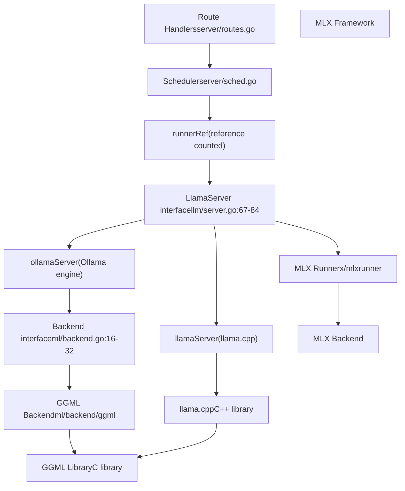
**Sources:** [llm/server.go67-84](https://github.com/ollama/ollama/blob/562c76d7/llm/server.go#L67-L84) [ml/backend.go16-32](https://github.com/ollama/ollama/blob/562c76d7/ml/backend.go#L16-L32) [server/sched.go38-59](https://github.com/ollama/ollama/blob/562c76d7/server/sched.go#L38-L59) [runner/ollamarunner/runner.go331-388](https://github.com/ollama/ollama/blob/562c76d7/runner/ollamarunner/runner.go#L331-L388)

### Dual Execution Paths

Ollama supports two distinct inference engines that can be selected based on model requirements and environment configuration:

| Engine | Implementation | Selection Criteria | Key Files |
| --- | --- | --- | --- |
| **llama.cpp** | `llamaServer` | Default; all GGUF models | [llm/server.go110-114](https://github.com/ollama/ollama/blob/562c76d7/llm/server.go#L110-L114) |
| **Ollama Engine** | `ollamaServer` | Enabled via `OLLAMA_NEW_ENGINE`; safetensors models | [llm/server.go116-120](https://github.com/ollama/ollama/blob/562c76d7/llm/server.go#L116-L120) |
| **MLX** | MLX client | Apple Silicon; image generation | [x/mlxrunner](https://github.com/ollama/ollama/blob/562c76d7/x/mlxrunner) |

The selection happens during server initialization:

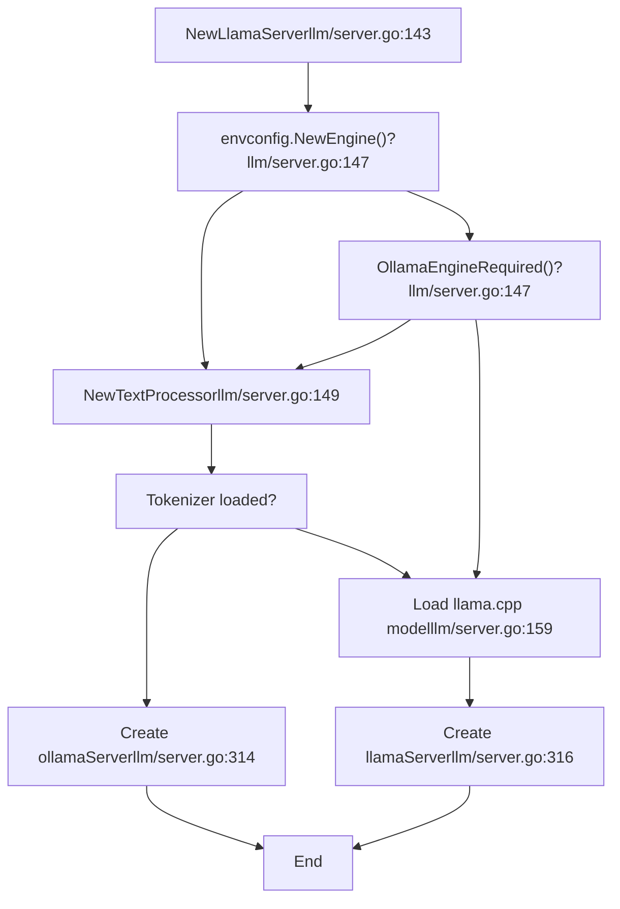
**Sources:** [llm/server.go143-318](https://github.com/ollama/ollama/blob/562c76d7/llm/server.go#L143-L318) [envconfig/config.go204-206](https://github.com/ollama/ollama/blob/562c76d7/envconfig/config.go#L204-L206)

## LlamaServer Interface

The `LlamaServer` interface defines the contract that all runner implementations must fulfill. It abstracts the differences between execution engines while providing a uniform API for model operations:

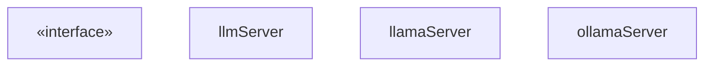
**Sources:** [llm/server.go67-84](https://github.com/ollama/ollama/blob/562c76d7/llm/server.go#L67-L84) [llm/server.go86-108](https://github.com/ollama/ollama/blob/562c76d7/llm/server.go#L86-L108) [llm/server.go110-120](https://github.com/ollama/ollama/blob/562c76d7/llm/server.go#L110-L120)

### Key Interface Methods

The interface methods fall into several categories:

**Lifecycle Management:**

-   `Load()` - Loads model weights and allocates memory ([llm/server.go496-714](https://github.com/ollama/ollama/blob/562c76d7/llm/server.go#L496-L714) for `llamaServer`, [llm/server.go746-899](https://github.com/ollama/ollama/blob/562c76d7/llm/server.go#L746-L899) for `ollamaServer`)
-   `WaitUntilRunning()` - Blocks until the runner subprocess is ready
-   `Close()` - Frees resources and terminates the subprocess

**Inference Operations:**

-   `Completion()` - Generates text continuations from prompts
-   `Embedding()` - Computes embeddings for input text
-   `Tokenize()`/`Detokenize()` - Text↔token conversion

**Resource Monitoring:**

-   `MemorySize()` - Returns total and VRAM usage
-   `VRAMByGPU()` - Per-GPU memory consumption
-   `GetDeviceInfos()` - Active GPU information

**Sources:** [llm/server.go67-84](https://github.com/ollama/ollama/blob/562c76d7/llm/server.go#L67-L84)

### Runner Process Model

Both `llamaServer` and `ollamaServer` run as separate subprocesses spawned by `StartRunner()`:

> **[Mermaid sequence]**
> *(图表结构无法解析)*

**Sources:** [llm/server.go320-438](https://github.com/ollama/ollama/blob/562c76d7/llm/server.go#L320-L438) [llm/server.go496-714](https://github.com/ollama/ollama/blob/562c76d7/llm/server.go#L496-L714)

## Backend Abstraction Layer

The `Backend` interface provides a hardware-agnostic API for tensor operations and model execution. The primary implementation is the GGML backend, which supports multiple acceleration libraries (CUDA, Metal, ROCm, Vulkan):

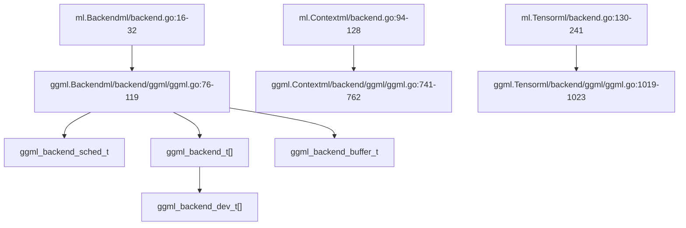
**Sources:** [ml/backend.go16-32](https://github.com/ollama/ollama/blob/562c76d7/ml/backend.go#L16-L32) [ml/backend/ggml/ggml.go76-119](https://github.com/ollama/ollama/blob/562c76d7/ml/backend/ggml/ggml.go#L76-L119) [ml/backend/ggml/ggml.go741-762](https://github.com/ollama/ollama/blob/562c76d7/ml/backend/ggml/ggml.go#L741-L762)

### Backend Initialization

The GGML backend initialization process assigns model layers to devices based on the GPU layer configuration:

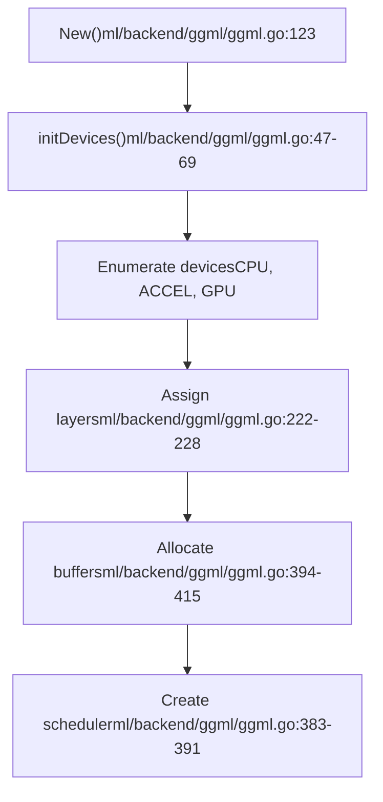
**Device assignment logic:**

1.  CPU device gets input tensors and layers not offloaded to GPU
2.  Each GPU is assigned specific layer ranges based on `params.GPULayers`
3.  Output layer assignment depends on whether it's in the GPU layer list

**Sources:** [ml/backend/ggml/ggml.go123-449](https://github.com/ollama/ollama/blob/562c76d7/ml/backend/ggml/ggml.go#L123-L449) [ml/backend/ggml/ggml.go47-69](https://github.com/ollama/ollama/blob/562c76d7/ml/backend/ggml/ggml.go#L47-L69)

### Context and Graph Execution

The `Context` interface manages tensor allocation and computation graph construction:

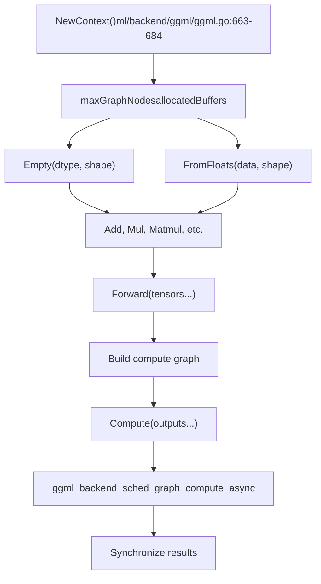
**Sources:** [ml/backend/ggml/ggml.go663-684](https://github.com/ollama/ollama/blob/562c76d7/ml/backend/ggml/ggml.go#L663-L684) [ml/backend/ggml/ggml.go794-843](https://github.com/ollama/ollama/blob/562c76d7/ml/backend/ggml/ggml.go#L794-L843)

### Tensor Buffer Management

The backend maintains two categories of buffers:

| Buffer Type | Purpose | Lifecycle | Source |
| --- | --- | --- | --- |
| **Weight Buffers** | Store model parameters | Created during `New()`, freed on `Close()` | [ml/backend/ggml/ggml.go394-421](https://github.com/ollama/ollama/blob/562c76d7/ml/backend/ggml/ggml.go#L394-L421) |
| **Compute Buffers** | Hold intermediate activations | Allocated per-context, freed on context close | [ml/backend/ggml/ggml.go912-922](https://github.com/ollama/ollama/blob/562c76d7/ml/backend/ggml/ggml.go#L912-L922) |

**Buffer allocation flow:**

> **[Mermaid sequence]**
> *(图表结构无法解析)*

**Sources:** [ml/backend/ggml/ggml.go889-936](https://github.com/ollama/ollama/blob/562c76d7/ml/backend/ggml/ggml.go#L889-L936)

## Runner Implementations

The runner layer sits above the backend and orchestrates the sequence generation process, including batch management, KV cache operations, and sampling.

### Ollama Runner Architecture

The `ollamaRunner` implementation provides fine-grained control over model execution:

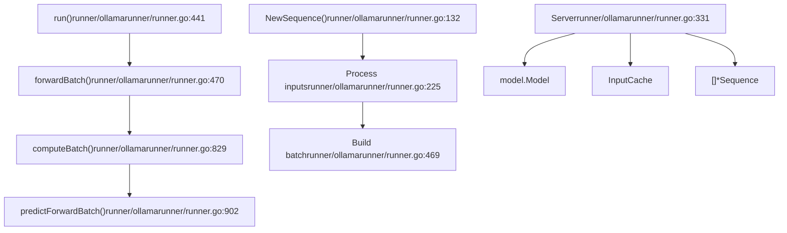
**Sources:** [runner/ollamarunner/runner.go331-388](https://github.com/ollama/ollama/blob/562c76d7/runner/ollamarunner/runner.go#L331-L388) [runner/ollamarunner/runner.go441-467](https://github.com/ollama/ollama/blob/562c76d7/runner/ollamarunner/runner.go#L441-L467)

### Batch Processing Pipeline

The runner processes sequences in batches to maximize throughput:

> **[Mermaid sequence]**
> *(图表结构无法解析)*

**Sources:** [runner/ollamarunner/runner.go469-827](https://github.com/ollama/ollama/blob/562c76d7/runner/ollamarunner/runner.go#L469-L827) [runner/ollamarunner/runner.go829-900](https://github.com/ollama/ollama/blob/562c76d7/runner/ollamarunner/runner.go#L829-L900) [runner/ollamarunner/runner.go902-1081](https://github.com/ollama/ollama/blob/562c76d7/runner/ollamarunner/runner.go#L902-L1081)

### Key Runner Components

**Sequence State:**

```
type Sequence struct {
    inputs           []*input.Input     // Remaining tokens to process
    pendingInputs    []*input.Input     // Tokens in current batch
    pendingResponses []string           // Generated but not returned
    cache            *InputCacheSlot    // KV cache slot
    responses        chan response      // Output channel
    sampler          sample.Sampler     // Token sampler
    numPredict       int                // Max tokens to generate
    stop             []string           // Stop sequences
}
```
**Sources:** [runner/ollamarunner/runner.go51-116](https://github.com/ollama/ollama/blob/562c76d7/runner/ollamarunner/runner.go#L51-L116)

**Batch State:**

```
type batchState struct {
    id               int                // Trace ID
    ctx              ml.Context         // Backend context
    modelOutput      ml.Tensor          // Logits output
    batchInputs      []*input.Input     // Input pointers
    batch            input.Batch        // Actual batch data
    seqs             []*Sequence        // Associated sequences
    inputsReadyCh    chan struct{}      // Sync: inputs ready
    computeStartedCh chan struct{}      // Sync: compute started
    outputsReadyCh   chan struct{}      // Sync: outputs ready
}
```
**Sources:** [runner/ollamarunner/runner.go300-329](https://github.com/ollama/ollama/blob/562c76d7/runner/ollamarunner/runner.go#L300-L329)

### Llama.cpp Runner Architecture

The `llamaRunner` wraps the llama.cpp library, delegating most operations to the C++ implementation:

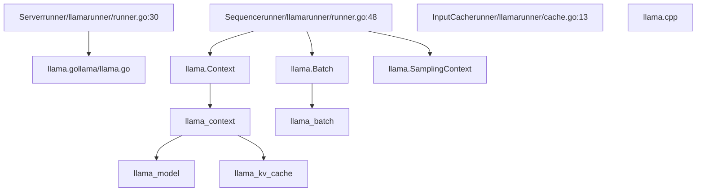
**Sources:** [runner/llamarunner/runner.go30](https://github.com/ollama/ollama/blob/562c76d7/runner/llamarunner/runner.go#L30-L30) [llama/llama.go161-164](https://github.com/ollama/ollama/blob/562c76d7/llama/llama.go#L161-L164) [llama/llama.go368-448](https://github.com/ollama/ollama/blob/562c76d7/llama/llama.go#L368-L448)

## Execution Flow: Request to Response

The complete flow from an API request to generated tokens:

> **[Mermaid sequence]**
> *(图表结构无法解析)*

**Sources:** [server/sched.go108-141](https://github.com/ollama/ollama/blob/562c76d7/server/sched.go#L108-L141) [server/sched.go436-592](https://github.com/ollama/ollama/blob/562c76d7/server/sched.go#L436-L592) [llm/server.go](https://github.com/ollama/ollama/blob/562c76d7/llm/server.go)

### Prompt Processing vs. Token Generation

The runner handles two distinct phases with different performance characteristics:

| Phase | Characteristics | Batch Composition | Source |
| --- | --- | --- | --- |
| **Prompt Processing** | Parallel evaluation of input tokens | Large batches (up to `batchSize`) | [runner/ollamarunner/runner.go509-546](https://github.com/ollama/ollama/blob/562c76d7/runner/ollamarunner/runner.go#L509-L546) |
| **Token Generation** | Sequential sampling, one token at a time per sequence | Small batches (1 token per active sequence) | [runner/ollamarunner/runner.go902-1081](https://github.com/ollama/ollama/blob/562c76d7/runner/ollamarunner/runner.go#L902-L1081) |

**Prompt processing optimization:**

-   Input tokens are processed in batches to maximize GPU utilization
-   Multiple sequences can be processed in parallel
-   KV cache is populated for all prompt tokens

**Token generation:**

-   Each sequence generates one token per forward pass
-   Sampling determines the next token based on logits
-   Process repeats until stop condition or limit reached

**Sources:** [runner/ollamarunner/runner.go469-827](https://github.com/ollama/ollama/blob/562c76d7/runner/ollamarunner/runner.go#L469-L827) [runner/ollamarunner/runner.go902-1081](https://github.com/ollama/ollama/blob/562c76d7/runner/ollamarunner/runner.go#L902-L1081)

## Memory Layout and Tensor Splitting

The backend manages memory allocation across CPU and multiple GPUs based on the layer assignment:

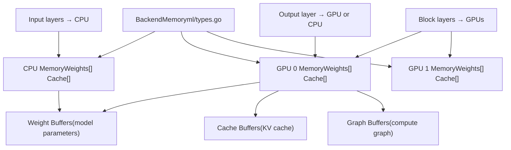
**Sources:** [ml/backend/ggml/ggml.go149-198](https://github.com/ollama/ollama/blob/562c76d7/ml/backend/ggml/ggml.go#L149-L198) [ml/backend/ggml/ggml.go202-228](https://github.com/ollama/ollama/blob/562c76d7/ml/backend/ggml/ggml.go#L202-L228)

### Layer Assignment Algorithm

The layer assignment process distributes model layers across available devices:

1.  **Input Layer Assignment:** Always assigned to CPU for flexibility
2.  **Repeating Layers:** Assigned based on `params.GPULayers` list
3.  **Output Layer:** Assigned if in GPU layers list, otherwise CPU

```
// Example from ml/backend/ggml/ggml.go:202-228
assignLayer := func(layer int) deviceBufferType {
    for _, p := range params.GPULayers {
        for _, l := range p.Layers {
            if l == layer {
                // Find GPU device by DeviceID
                return gpuDeviceBufferTypes[i]
            }
        }
    }
    return cpuDeviceBufferType
}
```
**Sources:** [ml/backend/ggml/ggml.go202-228](https://github.com/ollama/ollama/blob/562c76d7/ml/backend/ggml/ggml.go#L202-L228)

## Multimodal Input Processing

For vision models, the runner processes both text tokens and image embeddings:

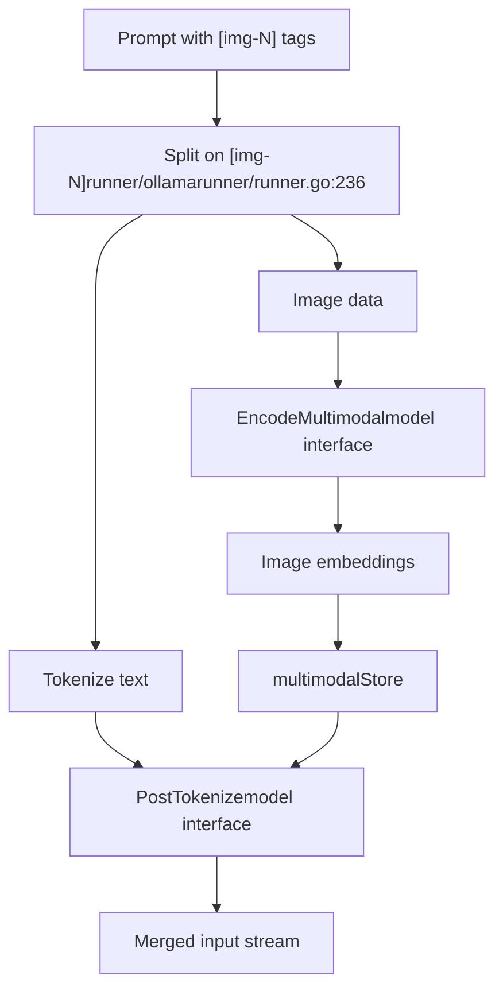
**Image embedding storage:**

-   Images are processed by vision encoders into embedding tensors
-   Embeddings are stored in a `multimodalStore` for batch assembly
-   The model's `PostTokenize` method arranges embeddings with text tokens

**Sources:** [runner/ollamarunner/runner.go222-298](https://github.com/ollama/ollama/blob/562c76d7/runner/ollamarunner/runner.go#L222-L298) [model/model.go51-80](https://github.com/ollama/ollama/blob/562c76d7/model/model.go#L51-L80)

### Multimodal Batch Assembly

When building batches, the runner handles both token and embedding inputs:

```
type Input struct {
    Token         int32          // Regular text token
    Multimodal    []Multimodal   // Image/audio embeddings
    MultimodalHash uint64        // Hash for caching
    SameBatch     int            // Keep next N inputs together
}
```
The `SameBatch` field ensures that multi-token embeddings stay together, preventing them from being split across batch boundaries.

**Sources:** [model/input/input.go22-50](https://github.com/ollama/ollama/blob/562c76d7/model/input/input.go#L22-L50) [runner/ollamarunner/runner.go524-533](https://github.com/ollama/ollama/blob/562c76d7/runner/ollamarunner/runner.go#L524-L533)

## Performance Considerations

### Batch Size Optimization

The runner dynamically adjusts batch sizes based on:

-   Available GPU memory
-   Number of parallel sequences
-   Model architecture constraints

```
// From runner/ollamarunner/runner.go:522-533
batchSize := s.batchSize

for i, inp := range seq.inputs {
    minBatch := 1 + inp.SameBatch
    if minBatch > batchSize {
        batchSize = minBatch  // Extend for required together inputs
    }

    if len(batchInputs)+minBatch > batchSize {
        break  // Would exceed limit
    }
}
```
**Sources:** [runner/ollamarunner/runner.go522-577](https://github.com/ollama/ollama/blob/562c76d7/runner/ollamarunner/runner.go#L522-L577)

### Asynchronous Execution

The Ollama runner supports asynchronous batch processing when the backend allows it:

**Synchronization points:**

-   `inputsReadyCh`: Signals that batch inputs are populated
-   `computeStartedCh`: Signals that compute has begun (safe to prepare next batch)
-   `outputsReadyCh`: Signals that results are available

**Sources:** [runner/ollamarunner/runner.go441-467](https://github.com/ollama/ollama/blob/562c76d7/runner/ollamarunner/runner.go#L441-L467) [runner/ollamarunner/runner.go471-484](https://github.com/ollama/ollama/blob/562c76d7/runner/ollamarunner/runner.go#L471-L484)

### Context Window Management

When the context window fills, the runner can shift the cache:

```
// Shifting removes old tokens and preserves recent ones
// Keeps first numKeep tokens plus most recent tokens
if shift and pos >= numCtx {
    shiftAmount := numCtx / 2
    cache.Remove(numKeep, numKeep + shiftAmount)
    cache.ShiftPositions(numKeep + shiftAmount, numCtx, -shiftAmount)
}
```
**Sources:** [runner/ollamarunner/runner.go965-1017](https://github.com/ollama/ollama/blob/562c76d7/runner/ollamarunner/runner.go#L965-L1017)

## Error Handling and Recovery

The runner implements several mechanisms for error handling:

### Load Failures

During model loading, the scheduler retries or evicts other models:

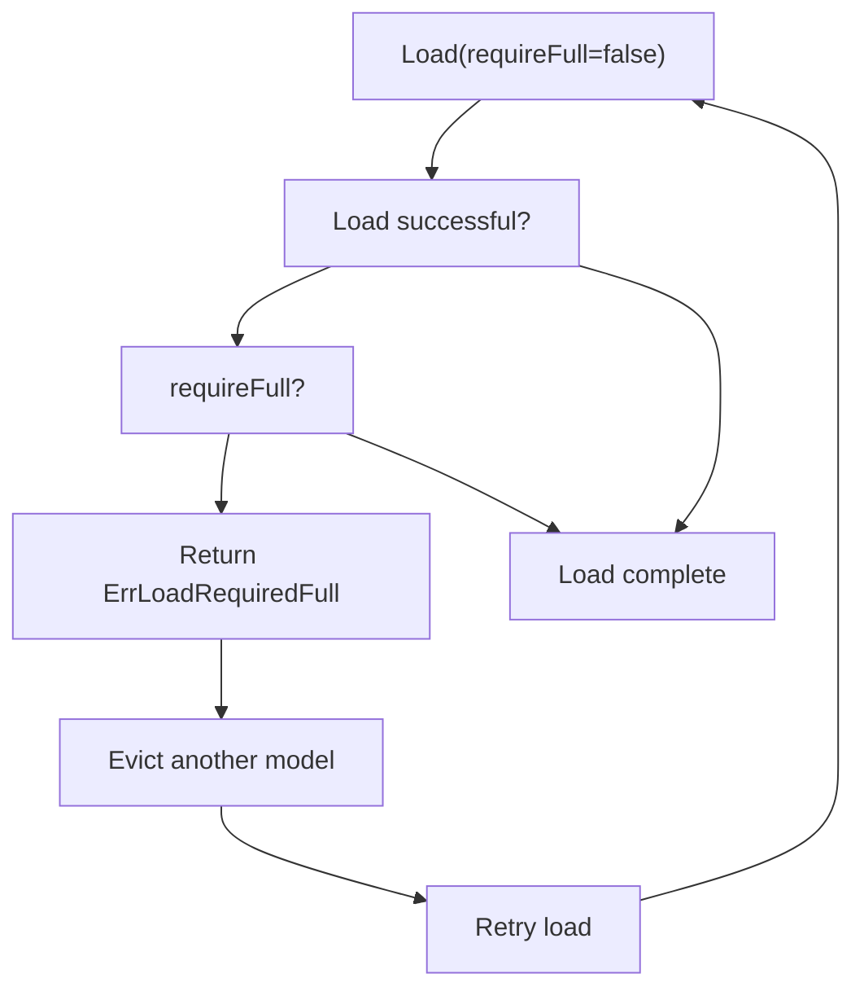
**Sources:** [llm/server.go746-899](https://github.com/ollama/ollama/blob/562c76d7/llm/server.go#L746-L899) [server/sched.go436-592](https://github.com/ollama/ollama/blob/562c76d7/server/sched.go#L436-L592)

### Runtime Errors

-   **Batch overflow:** If a batch cannot fit, it's split into smaller batches
-   **KV cache full:** Returns `ErrKvCacheFull`, triggering context shift
-   **GPU OOM:** Backend allocation failures trigger graceful shutdown

**Sources:** [runner/ollamarunner/runner.go469-827](https://github.com/ollama/ollama/blob/562c76d7/runner/ollamarunner/runner.go#L469-L827) [kvcache/cache.go11-12](https://github.com/ollama/ollama/blob/562c76d7/kvcache/cache.go#L11-L12)

### Process Monitoring

The `llmServer` monitors the subprocess for crashes:

```
// From llm/server.go:298-311go func() {    err := s.cmd.Wait()    if err != nil && s.status != nil && s.status.LastErrMsg != "" {        s.done <- errors.New(s.status.LastErrMsg)    } else {        s.done <- err    }}()
```
**Sources:** [llm/server.go298-311](https://github.com/ollama/ollama/blob/562c76d7/llm/server.go#L298-L311)

---

The inference engine provides a flexible, high-performance execution environment for language models. Its layered architecture allows for multiple backend implementations while maintaining a consistent API for model operations. The separation between the scheduling layer, runner implementations, and backend abstractions enables efficient resource utilization and supports diverse hardware configurations.
