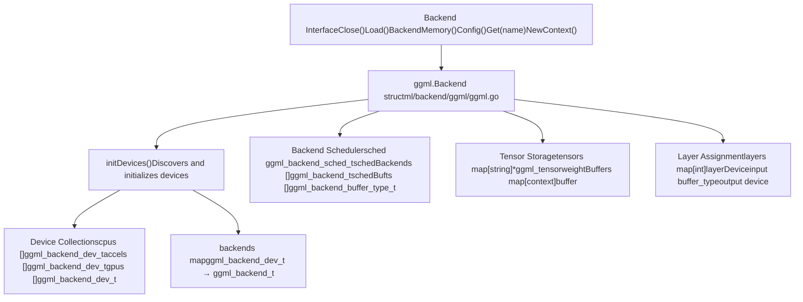
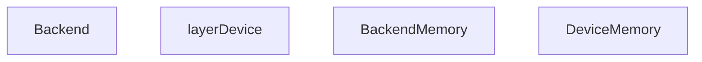
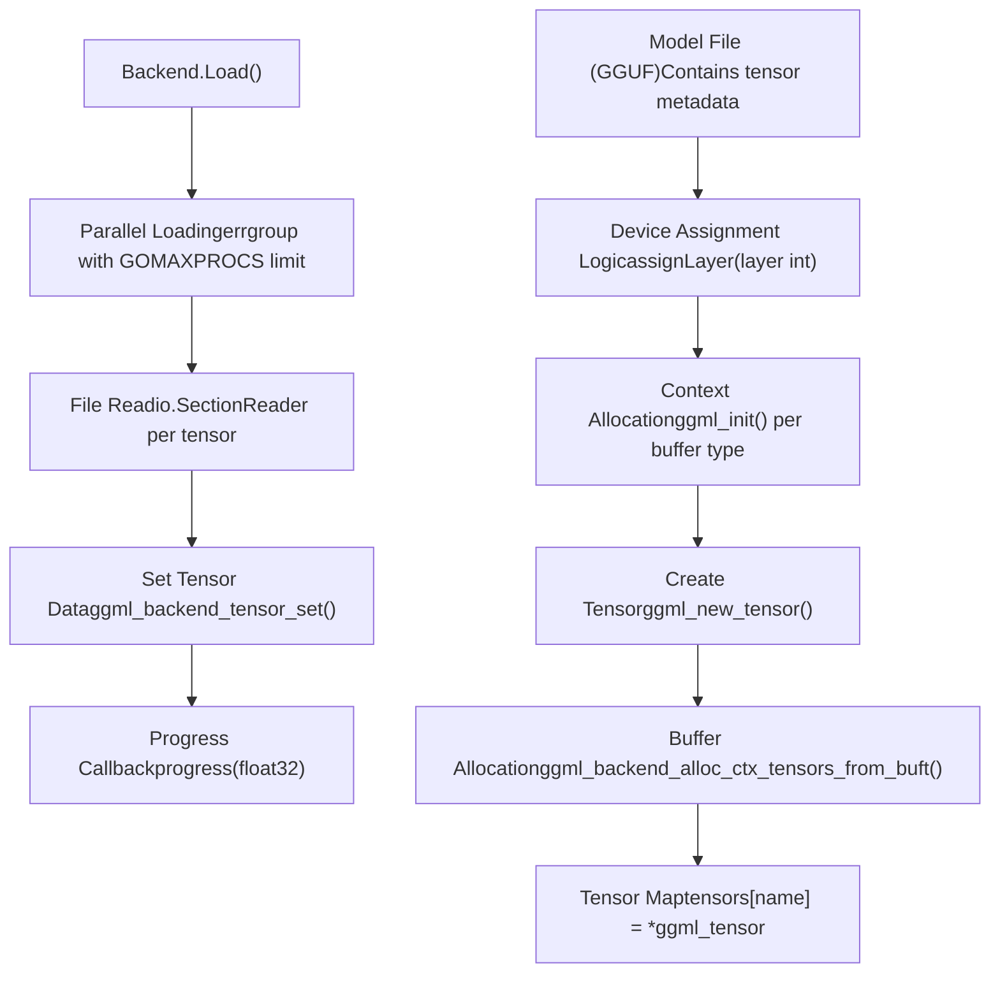
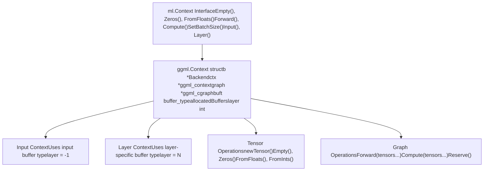
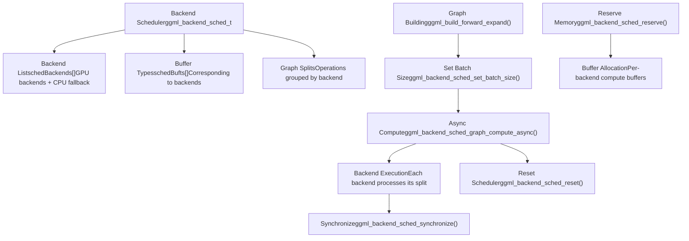
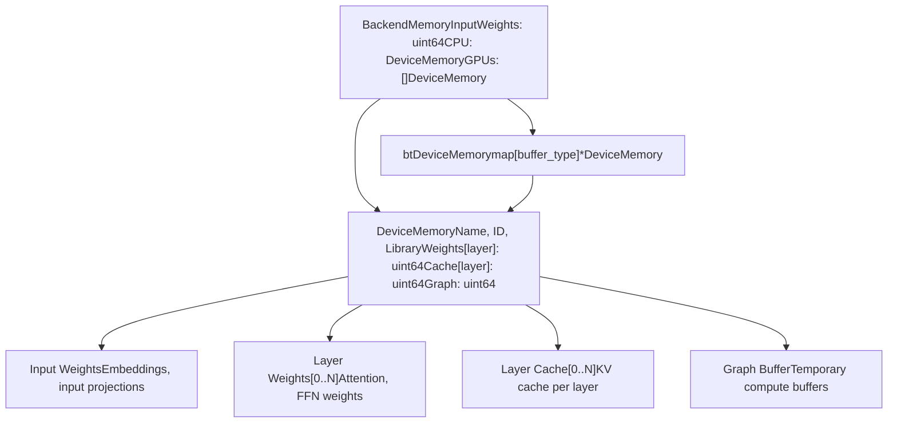
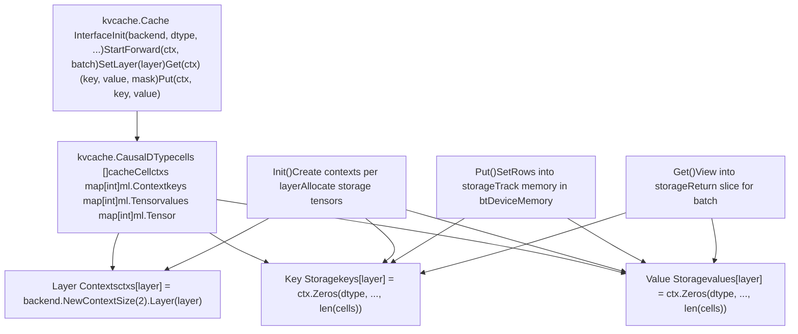
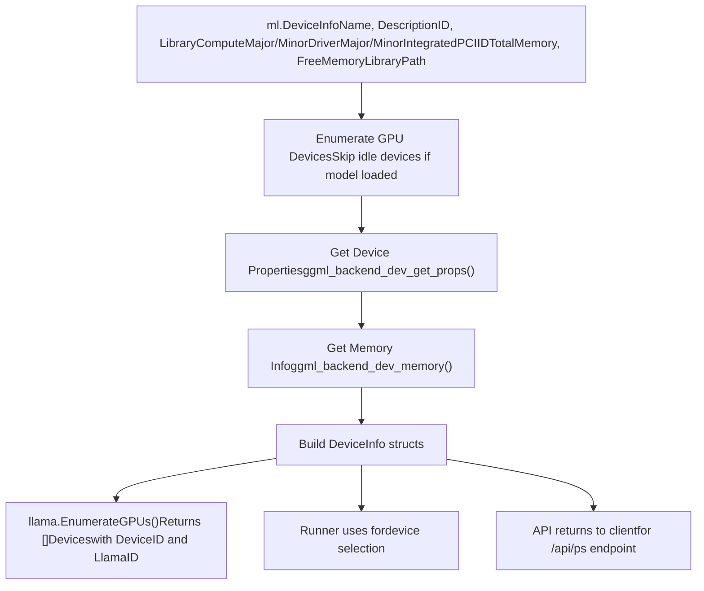

# GGML Backend and ML Context

Relevant source files

-   [integration/embed\_test.go](https://github.com/ollama/ollama/blob/562c76d7/integration/embed_test.go)
-   [kvcache/cache.go](https://github.com/ollama/ollama/blob/562c76d7/kvcache/cache.go)
-   [kvcache/causal.go](https://github.com/ollama/ollama/blob/562c76d7/kvcache/causal.go)
-   [kvcache/causal\_test.go](https://github.com/ollama/ollama/blob/562c76d7/kvcache/causal_test.go)
-   [kvcache/encoder.go](https://github.com/ollama/ollama/blob/562c76d7/kvcache/encoder.go)
-   [kvcache/wrapper.go](https://github.com/ollama/ollama/blob/562c76d7/kvcache/wrapper.go)
-   [llama/llama.go](https://github.com/ollama/ollama/blob/562c76d7/llama/llama.go)
-   [llama/sampling\_ext.cpp](https://github.com/ollama/ollama/blob/562c76d7/llama/sampling_ext.cpp)
-   [llama/sampling\_ext.h](https://github.com/ollama/ollama/blob/562c76d7/llama/sampling_ext.h)
-   [ml/backend.go](https://github.com/ollama/ollama/blob/562c76d7/ml/backend.go)
-   [ml/backend/ggml/ggml.go](https://github.com/ollama/ollama/blob/562c76d7/ml/backend/ggml/ggml.go)
-   [model/input/input.go](https://github.com/ollama/ollama/blob/562c76d7/model/input/input.go)
-   [model/model.go](https://github.com/ollama/ollama/blob/562c76d7/model/model.go)
-   [model/model\_test.go](https://github.com/ollama/ollama/blob/562c76d7/model/model_test.go)
-   [runner/llamarunner/cache.go](https://github.com/ollama/ollama/blob/562c76d7/runner/llamarunner/cache.go)
-   [runner/llamarunner/runner.go](https://github.com/ollama/ollama/blob/562c76d7/runner/llamarunner/runner.go)
-   [runner/ollamarunner/cache.go](https://github.com/ollama/ollama/blob/562c76d7/runner/ollamarunner/cache.go)
-   [runner/ollamarunner/cache\_test.go](https://github.com/ollama/ollama/blob/562c76d7/runner/ollamarunner/cache_test.go)
-   [runner/ollamarunner/runner.go](https://github.com/ollama/ollama/blob/562c76d7/runner/ollamarunner/runner.go)
-   [server/internal/internal/backoff/backoff.go](https://github.com/ollama/ollama/blob/562c76d7/server/internal/internal/backoff/backoff.go)

## Purpose and Scope

The GGML Backend and ML Context system provides the low-level infrastructure for executing machine learning models on diverse hardware accelerators (GPU, CPU, accelerators). The **Backend** manages device discovery, memory allocation, and tensor storage, while **Context** provides the interface for building and executing compute graphs. Together, they abstract hardware-specific operations and enable efficient model inference across different devices.

For information about model architecture implementations, see [Model Architectures](/ollama/ollama/5.6-model-architectures). For KV cache management, see [KV Cache System](/ollama/ollama/5.3-kv-cache-system). For memory tracking and GPU allocation, see [Memory Management and GPU Allocation](/ollama/ollama/5.4-memory-management-and-gpu-allocation).

---

## Backend Architecture Overview


**Backend Initialization and Device Discovery**

Sources: [ml/backend/ggml/ggml.go47-69](https://github.com/ollama/ollama/blob/562c76d7/ml/backend/ggml/ggml.go#L47-L69) [ml/backend/ggml/ggml.go123-449](https://github.com/ollama/ollama/blob/562c76d7/ml/backend/ggml/ggml.go#L123-L449)

The GGML backend discovers and manages computational devices through a device initialization process:

> **[Mermaid sequence]**
> *(图表结构无法解析)*

**Device Types and Classification**

Sources: [ml/backend/ggml/ggml.go54-65](https://github.com/ollama/ollama/blob/562c76d7/ml/backend/ggml/ggml.go#L54-L65)

| Device Type | Enum Value | Description | Storage |
| --- | --- | --- | --- |
| `GGML_BACKEND_DEVICE_TYPE_CPU` | CPU | Primary CPU device (only first CPU used) | `cpus []ggml_backend_dev_t` |
| `GGML_BACKEND_DEVICE_TYPE_ACCEL` | Accelerator | Hardware accelerators | `accels []ggml_backend_dev_t` |
| `GGML_BACKEND_DEVICE_TYPE_GPU` | GPU | Discrete GPUs | `gpus []ggml_backend_dev_t` |
| `GGML_BACKEND_DEVICE_TYPE_IGPU` | Integrated GPU | Integrated GPUs | `gpus []ggml_backend_dev_t` |

---

## Backend Struct and Memory Management


**Backend Struct Fields**

Sources: [ml/backend/ggml/ggml.go76-119](https://github.com/ollama/ollama/blob/562c76d7/ml/backend/ggml/ggml.go#L76-L119)

The `Backend` struct maintains all state for model execution:

| Field | Type | Purpose |
| --- | --- | --- |
| `modelPath` | `string` | Location of model file |
| `meta` | `*fsggml.GGML` | Model metadata from GGUF file |
| `allocMemory` | `bool` | Whether to actually allocate memory (false for dry run) |
| `tensorLoadTargets` | `map[string][]string` | Maps file tensor names to model tensor names |
| `sched` | `ggml_backend_sched_t` | Backend scheduler for compute graphs |
| `schedBackends` | `[]ggml_backend_t` | Backends used by scheduler |
| `schedBufts` | `[]ggml_backend_buffer_type_t` | Buffer types for scheduler |
| `tensors` | `map[string]*ggml_tensor` | All model tensors by name |
| `input` | `ggml_backend_buffer_type_t` | Buffer type for input tensors |
| `output` | `ggml_backend_dev_t` | Device for output layer |
| `layers` | `map[int]layerDevice` | Device assignment for each layer |
| `requiredMemory` | `*BackendMemory` | Memory requirements per device |
| `maxGraphNodes` | `int` | Maximum nodes in compute graph |
| `weightBuffers` | `map[*ggml_context]ggml_backend_buffer_t` | Weight storage buffers |

---

## Tensor Creation and Loading


**Tensor Assignment Strategy**

Sources: [ml/backend/ggml/ggml.go203-229](https://github.com/ollama/ollama/blob/562c76d7/ml/backend/ggml/ggml.go#L203-L229) [ml/backend/ggml/ggml.go306-343](https://github.com/ollama/ollama/blob/562c76d7/ml/backend/ggml/ggml.go#L306-L343)

Tensors are assigned to devices based on their function:

1.  **Input tensors** (`position_embd`, `token_embd`, `token_norm_embd`): Always on CPU input buffer
2.  **Output tensors** (`cls`, `output`, `output_norm`): Assigned based on `output` device (CPU or GPU based on layer assignment)
3.  **Vision tensors** (prefixed with `v.`, `mm.`, `s.`): Currently assigned to output device
4.  **RoPE tensors** (`rope_freqs`, `rope_factors_*`): Repeated per layer on respective layer device
5.  **Layer tensors** (prefixed with `blk.N.`): Assigned to device for layer N based on GPU layer configuration
6.  **Other tensors**: Default to CPU input buffer

**Tensor Loading Process**

Sources: [ml/backend/ggml/ggml.go468-645](https://github.com/ollama/ollama/blob/562c76d7/ml/backend/ggml/ggml.go#L468-L645)

The `Load()` method loads tensor weights from disk in parallel:

```
// Parallel loading with concurrency limitg, ctx := errgroup.WithContext(ctx)g.SetLimit(runtime.GOMAXPROCS(0)) for _, t := range b.meta.Tensors().Items() {    g.Go(func() error {        // Open separate FD per goroutine for sequential reads        file, err := os.Open(b.modelPath)        sr := io.NewSectionReader(file, offset, size)                // Read in chunks and set tensor data        for s < t.Size() {            n, err := io.ReadFull(sr, bts[:])            C.ggml_backend_tensor_set(tt, data, offset, size)            progress(float32(done) / float32(total))        }    })}
```
Special handling exists for:

-   **MXFP4 format conversion** [ml/backend/ggml/ggml.go528-566](https://github.com/ollama/ollama/blob/562c76d7/ml/backend/ggml/ggml.go#L528-L566): Transforms raw MXFP4 stream to GGML format
-   **BF16 to FP32 conversion** [ml/backend/ggml/ggml.go567-594](https://github.com/ollama/ollama/blob/562c76d7/ml/backend/ggml/ggml.go#L567-L594): Converts `_exps.bias` tensors for compatibility

---

## ML Context System


**Context Structure**

Sources: [ml/backend/ggml/ggml.go741-762](https://github.com/ollama/ollama/blob/562c76d7/ml/backend/ggml/ggml.go#L741-L762)

The `Context` struct manages temporary tensor allocation and compute graph building:

| Field | Type | Purpose |
| --- | --- | --- |
| `b` | `*Backend` | Reference to parent backend |
| `ctx` | `*ggml_context` | GGML context for tensor metadata |
| `graph` | `*ggml_cgraph` | Compute graph being built |
| `batchSize` | `int` | Optimization hint for processing |
| `buft` | `ggml_backend_buffer_type_t` | Buffer type for new tensors |
| `allocatedBuffers` | `*[]ggml_backend_buffer_t` | Buffers to free on close |
| `maxGraphNodes` | `int` | Maximum allowed graph nodes |
| `layer` | `int` | Layer index for memory accounting (-1 = input/cache) |

**Context Creation**

Sources: [ml/backend/ggml/ggml.go663-684](https://github.com/ollama/ollama/blob/562c76d7/ml/backend/ggml/ggml.go#L663-L684)

```
func (b *Backend) NewContext() ml.Context {    return b.NewContextSize(b.maxGraphNodes)} func (b *Backend) NewContextSize(n int) ml.Context {    var allocatedBuffers []ggml_backend_buffer_t        return &Context{        b:                b,        maxGraphNodes:    n,        ctx: C.ggml_init(C.struct_ggml_init_params{            mem_size: C.size_t(n)*C.ggml_tensor_overhead() +                       C.ggml_graph_overhead_custom(C.size_t(n), false),            no_alloc: true,        }),        allocatedBuffers: &allocatedBuffers,        layer:            -1,    }}
```
**Context Specialization**

Sources: [ml/backend/ggml/ggml.go764-792](https://github.com/ollama/ollama/blob/562c76d7/ml/backend/ggml/ggml.go#L764-L792)

Contexts can be specialized for different purposes:

1.  **Input Context** (`Input()`): For input tensors and model outputs
    -   Uses `b.input` buffer type (typically CPU)
    -   Layer set to -1
2.  **Layer Context** (`Layer(i)`): For layer-specific tensors
    -   Uses buffer type from `b.layers[i]`
    -   Layer set to `i` for memory accounting in KV cache

---

## Tensor Operations and Graph Building

> **[Mermaid sequence]**
> *(图表结构无法解析)*

**Tensor Creation Methods**

Sources: [ml/backend/ggml/ggml.go889-1006](https://github.com/ollama/ollama/blob/562c76d7/ml/backend/ggml/ggml.go#L889-L1006)

| Method | Purpose | Example |
| --- | --- | --- |
| `Empty(dtype, shape...)` | Allocate uninitialized tensor | `ctx.Empty(ml.DTypeF32, 1024, 768)` |
| `Zeros(dtype, shape...)` | Allocate zero-initialized tensor | `ctx.Zeros(ml.DTypeF16, 512)` |
| `FromFloats(s, shape...)` | Create from float32 slice | `ctx.FromFloats([]float32{1,2,3}, 3)` |
| `FromInts(s, shape...)` | Create from int32 slice | `ctx.FromInts([]int32{0,1,2}, 3)` |
| `FromBytes(dtype, s, shape...)` | Create from byte slice | `ctx.FromBytes(ml.DTypeQ80, data, 1024)` |
| `Arange(start, stop, step, dtype)` | Create range tensor | `ctx.Arange(0, 512, 1, ml.DTypeI32)` |

**Graph Building and Execution**

Sources: [ml/backend/ggml/ggml.go794-870](https://github.com/ollama/ollama/blob/562c76d7/ml/backend/ggml/ggml.go#L794-L870)

The `Forward()` method adds tensors to the compute graph, and `Compute()` executes it:

```
// Add tensors to graphfunc (c *Context) Forward(tensors ...ml.Tensor) ml.Context {    if c.graph == nil {        c.graph = C.ggml_new_graph_custom(c.ctx,             C.size_t(c.maxGraphNodes), false)    }        for _, tensor := range tensors {        C.ggml_build_forward_expand(c.graph, tensor.(*Tensor).t)    }        return c} // Execute graphfunc (c *Context) Compute(tensors ...ml.Tensor) {    c.b.schedMu.Lock()    defer c.b.schedMu.Unlock()        if c.batchSize > 0 {        C.ggml_backend_sched_set_batch_size(c.b.sched, C.int(c.batchSize))    }        status := C.ggml_backend_sched_graph_compute_async(c.b.sched, c.graph)    C.ggml_backend_sched_reset(c.b.sched)        // Set up sync function for tensor data retrieval    sync := func() {        C.ggml_backend_sched_synchronize(c.b.sched)    }}
```
**ComputeWithNotify Variant**

Sources: [ml/backend/ggml/ggml.go814-843](https://github.com/ollama/ollama/blob/562c76d7/ml/backend/ggml/ggml.go#L814-L843)

The `ComputeWithNotify()` method allows asynchronous notification when computation starts, enabling pipelined batch processing:

```
func (c *Context) ComputeWithNotify(cb func(), tensors ...ml.Tensor) {    c.b.schedMu.Lock()    defer c.b.schedMu.Unlock()        if cb != nil {        go cb()  // Notify in goroutine    }        status := C.ggml_backend_sched_graph_compute_async(c.b.sched, c.graph)    // ... setup sync for tensors}
```
This is used by the runner for overlapping batch preparation with GPU execution [runner/ollamarunner/runner.go720-728](https://github.com/ollama/ollama/blob/562c76d7/runner/ollamarunner/runner.go#L720-L728)

---

## Backend Scheduler and Graph Execution


**Scheduler Initialization**

Sources: [ml/backend/ggml/ggml.go356-391](https://github.com/ollama/ollama/blob/562c76d7/ml/backend/ggml/ggml.go#L356-L391)

The scheduler is created with all participating backends and their buffer types:

```
// Create backends and buffer types for schedulervar schedBackends []C.ggml_backend_tvar schedBufts []C.ggml_backend_buffer_type_t for _, d := range append(gpus, append(accels, cpus...)...) {    b := backends[d]    bt := C.ggml_backend_get_default_buffer_type(b)        // Skip devices where no layers are assigned (except CPU fallback)    if !slices.Contains(cpuDeviceBufferType.bts, bt) {        if c, ok := ctxs[bt]; !ok || C.ggml_get_first_tensor(c) == nil {            continue        }    }        schedBackends = append(schedBackends, b)    schedBufts = append(schedBufts, bt)        if C.ggml_backend_is_cpu(b) {        C.ggml_backend_cpu_set_n_threads(b, C.int(Threads(params.NumThreads)))    }} maxGraphNodes := max(1024, len(meta.Tensors().Items())*32) sched := C.ggml_backend_sched_new_ext(    (*C.ggml_backend_t)(unsafe.Pointer(&schedBackends[0])),    (*C.ggml_backend_buffer_type_t)(unsafe.Pointer(&schedBufts[0])),    C.int(len(schedBackends)),    C.size_t(maxGraphNodes),    C._Bool(false),    C._Bool(true),    C._Bool(params.AllocMemory),)
```
**Reserve Operation**

Sources: [ml/backend/ggml/ggml.go845-870](https://github.com/ollama/ollama/blob/562c76d7/ml/backend/ggml/ggml.go#L845-L870)

The `Reserve()` method pre-allocates compute buffers for the worst-case graph size:

```
func (c *Context) Reserve() {    if c.batchSize > 0 {        C.ggml_backend_sched_set_batch_size(c.b.sched, C.int(c.batchSize))    }        reserved := C.ggml_backend_sched_reserve(c.b.sched, c.graph)        // Track allocated buffer sizes per backend    for i := range c.b.schedBackends {        bufferSize := C.ggml_backend_sched_get_attempted_buffer_size(            c.b.sched, c.b.schedBackends[i])        c.b.btDeviceMemory[c.b.schedBufts[i]].Graph += uint64(bufferSize)    }        if !reserved {        panic(ml.ErrNoMem{BackendMemory: *c.b.requiredMemory})    }}
```
---

## Device Memory Tracking


**Memory Allocation Tracking**

Sources: [ml/backend/ggml/ggml.go149-198](https://github.com/ollama/ollama/blob/562c76d7/ml/backend/ggml/ggml.go#L149-L198) [ml/backend/ggml/ggml.go280-289](https://github.com/ollama/ollama/blob/562c76d7/ml/backend/ggml/ggml.go#L280-L289)

Memory requirements are tracked per device during backend initialization:

```
// Initialize memory tracking structuresrequiredMemory := ml.BackendMemory{}btDeviceMemory := make(map[C.ggml_backend_buffer_type_t]*ml.DeviceMemory) // CPU device memorycpuDeviceMemory := &requiredMemory.CPUcpuDeviceMemory.Name = C.GoString(C.ggml_backend_dev_name(cpuDevice))cpuDeviceMemory.Weights = make([]uint64, blocks+1)cpuDeviceMemory.Cache = make([]uint64, blocks+1) // GPU device memoryrequiredMemory.GPUs = make([]ml.DeviceMemory, len(gpus))for i, d := range gpus {    bt := C.ggml_backend_dev_buffer_type(d)    btDeviceMemory[bt] = &requiredMemory.GPUs[i]    requiredMemory.GPUs[i].Weights = make([]uint64, blocks+1)    requiredMemory.GPUs[i].Cache = make([]uint64, blocks+1)} // Track tensor allocationsize := pad(C.ggml_backend_buft_get_alloc_size(bt, tt),             C.ggml_backend_buft_get_alignment(bt))if layer == -1 {    requiredMemory.InputWeights += uint64(size)} else {    btDeviceMemory[bt].Weights[layer] += uint64(size)}
```
**Cache Memory Accounting**

Sources: [ml/backend/ggml/ggml.go909-924](https://github.com/ollama/ollama/blob/562c76d7/ml/backend/ggml/ggml.go#L909-L924)

When contexts create tensors for KV cache, memory is tracked by layer:

```
func (c *Context) newTensor(dtype ml.DType, shape []int) *Tensor {    t := C.ggml_new_tensor(c.ctx, cdtype, C.int(len(shape)), shapeToGGML(shape))    size := pad(C.ggml_backend_buft_get_alloc_size(c.buft, t),                 C.ggml_backend_buft_get_alignment(c.buft))        b := C.ggml_backend_buft_alloc_buffer(c.buft, size)    if c.layer >= 0 {        c.b.btDeviceMemory[c.buft].Cache[c.layer] += uint64(size)    }        *c.allocatedBuffers = append(*c.allocatedBuffers, b)    C.ggml_backend_tensor_alloc(b, t, C.ggml_backend_buffer_get_base(b))    return &Tensor{b: c.b, t: t}}
```
---

## Integration with Model System

> **[Mermaid sequence]**
> *(图表结构无法解析)*

**Backend Registration and Creation**

Sources: [ml/backend.go76-92](https://github.com/ollama/ollama/blob/562c76d7/ml/backend.go#L76-L92) [ml/backend/ggml/ggml.go451-453](https://github.com/ollama/ollama/blob/562c76d7/ml/backend/ggml/ggml.go#L451-L453)

The GGML backend registers itself during package initialization:

```
// In ml/backend/ggml/ggml.gofunc init() {    ml.RegisterBackend("ggml", New)} // In ml/backend.govar backends = make(map[string]func(string, BackendParams) (Backend, error)) func RegisterBackend(name string, f func(string, BackendParams) (Backend, error)) {    if _, ok := backends[name]; ok {        panic("backend: backend already registered")    }    backends[name] = f} func NewBackend(modelPath string, params BackendParams) (Backend, error) {    if backend, ok := backends["ggml"]; ok {        return backend(modelPath, params)    }    return nil, fmt.Errorf("unsupported backend")}
```
**Model Field Population**

Sources: [model/model.go113-135](https://github.com/ollama/ollama/blob/562c76d7/model/model.go#L113-L135) [model/model.go175-259](https://github.com/ollama/ollama/blob/562c76d7/model/model.go#L175-L259)

The model system uses reflection to populate model struct fields with tensors from the backend:

```
func New(modelPath string, params ml.BackendParams) (Model, error) {    b, err := ml.NewBackend(modelPath, params)    if err != nil {        return nil, err    }        m, err := modelForArch(b.Config())    if err != nil {        return nil, err    }        base := Base{b: b, config: m.Config()}    v := reflect.ValueOf(m)    v.Elem().Set(populateFields(base, v.Elem()))        return m, nil} // populateFields uses struct tags to fetch tensors// For example: `gguf:"attn_q"` fetches backend.Get("attn_q.weight")
```
---

## Integration with KV Cache System


**Cache Initialization with Backend**

Sources: [kvcache/causal.go130-182](https://github.com/ollama/ollama/blob/562c76d7/kvcache/causal.go#L130-L182)

The cache creates contexts and allocates tensors through the backend:

```
func (c *Causal) Init(backend ml.Backend, dtype ml.DType,                       maxSequences, capacity, maxBatch int) {    // Get cache configuration from backend if available    if c.config == nil {        var config ml.CacheConfig        if cc, ok := backend.(ml.BackendCacheConfig); ok {            config = cc.CacheConfig()        }        c.config = &config    }        // Calculate cache size    var cacheSize int    if c.swaMemorySize == math.MaxInt32 {        cacheSize = maxSequences * capacity    } else {        cacheSize = (maxSequences * int(c.swaMemorySize)) + maxBatch    }    cacheSize = roundUp(cacheSize, c.config.CachePadding)        c.cells = make([]cacheCell, cacheSize)    c.DType = dtype    c.backend = backend}
```
**Per-Layer Context and Tensor Creation**

Sources: [kvcache/causal.go449-495](https://github.com/ollama/ollama/blob/562c76d7/kvcache/causal.go#L449-L495)

When cache data is stored, the cache creates layer-specific contexts and tensors:

```
func (c *Causal) Put(ctx ml.Context, key, value ml.Tensor) {    // Create layer context if not exists    if _, ok := c.ctxs[c.curLayer]; !ok {        c.ctxs[c.curLayer] = c.backend.NewContextSize(2).Layer(c.curLayer)    }        // Allocate storage tensors if not exists    if _, ok := c.keys[c.curLayer]; !ok {        c.keys[c.curLayer] = c.ctxs[c.curLayer].Zeros(            c.DType, kHeadDim, numKVHeads, len(c.cells))    }        if _, ok := c.values[c.curLayer]; !ok {        if c.config.PermutedV {            c.values[c.curLayer] = c.ctxs[c.curLayer].Zeros(                c.DType, len(c.cells), vHeadDim, numKVHeads)        } else {            c.values[c.curLayer] = c.ctxs[c.curLayer].Zeros(                c.DType, vHeadDim, numKVHeads, len(c.cells))        }    }        // Store key/value using SetRows    key = key.Reshape(ctx, kHeadDim*numKVHeads, batchSize)    keyCache = c.keys[c.curLayer].Reshape(ctx, kHeadDim*numKVHeads, len(c.cells))    ctx.Forward(keyCache.SetRows(ctx, key, c.curLoc))}
```
The `Layer()` method ensures the context tracks memory for the specific layer [ml/backend/ggml/ggml.go909-924](https://github.com/ollama/ollama/blob/562c76d7/ml/backend/ggml/ggml.go#L909-L924)

---

## Backend Device Enumeration


**Device Enumeration Implementation**

Sources: [ml/backend/ggml/ggml.go694-739](https://github.com/ollama/ollama/blob/562c76d7/ml/backend/ggml/ggml.go#L694-L739) [llama/llama.go72-94](https://github.com/ollama/ollama/blob/562c76d7/llama/llama.go#L72-L94)

The backend provides device information for the GPU scheduler and API:

```
func (b *Backend) BackendDevices() []ml.DeviceInfo {    deviceInfos := []ml.DeviceInfo{}        for _, dev := range gpus {        // Skip unused devices if model is loaded        if b.allocMemory {            idleDev := true            for _, backend := range b.schedBackends {                if dev == C.ggml_backend_get_device(backend) {                    idleDev = false                    break                }            }            if idleDev {                continue            }        }                info := ml.DeviceInfo{}        props := C.struct_ggml_backend_dev_props{}        C.ggml_backend_dev_get_props(dev, &props)                info.Name = C.GoString(props.name)        info.Description = C.GoString(props.description)        info.ID = C.GoString(props.id)        info.Library = C.GoString(props.library)        info.ComputeMajor = (int)(props.compute_major)        info.ComputeMinor = (int)(props.compute_minor)        info.DriverMajor = (int)(props.driver_major)        info.DriverMinor = (int)(props.driver_minor)                C.ggml_backend_dev_memory(dev, &props.memory_free, &props.memory_total)        info.TotalMemory = (uint64)(props.memory_total)        info.FreeMemory = (uint64)(props.memory_free)                deviceInfos = append(deviceInfos, info)    }        return deviceInfos}
```
---

## Flash Attention and Cache Configuration

**Backend Cache Configuration**

Sources: [ml/backend.go34-57](https://github.com/ollama/ollama/blob/562c76d7/ml/backend.go#L34-L57) [ml/backend/ggml/ggml.go686-692](https://github.com/ollama/ollama/blob/562c76d7/ml/backend/ggml/ggml.go#L686-L692)

Backends can implement `BackendCacheConfig` to specify optimizations for cache operations:

```
type BackendCacheConfig interface {    CacheConfig() CacheConfig} type CacheConfig struct {    // CachePadding specifies padding multiple for cache history    CachePadding int        // PermutedV performs Permute(ctx, 1, 2, 0, 3) on v tensors    PermutedV bool        // MaskDType specifies data type for mask generation    MaskDType DType} func (b *Backend) CacheConfig() ml.CacheConfig {    if b.flashAttention == ml.FlashAttentionEnabled {        return ml.CacheConfig{CachePadding: 256, MaskDType: ml.DTypeF16}    } else {        return ml.CacheConfig{CachePadding: 256, PermutedV: true}    }}
```
These configurations enable:

-   **Flash Attention**: Uses F16 mask and 256-token padding for fused kernels
-   **Standard Attention**: Uses permuted V cache to avoid `Contiguous()` calls

Sources: [ml/backend/ggml/ggml.go686-692](https://github.com/ollama/ollama/blob/562c76d7/ml/backend/ggml/ggml.go#L686-L692) [kvcache/causal.go130-145](https://github.com/ollama/ollama/blob/562c76d7/kvcache/causal.go#L130-L145)

---

## Complete Inference Flow Example

> **[Mermaid sequence]**
> *(图表结构无法解析)*

This flow demonstrates:

1.  **Backend initialization**: Device discovery and tensor allocation
2.  **Context creation**: Specialized contexts for inputs and layers
3.  **Graph building**: Using `Forward()` to add operations
4.  **Async execution**: Using `ComputeWithNotify()` for pipelining
5.  **Cache integration**: Layer-specific contexts for KV storage
6.  **Memory management**: Automatic cleanup with `Close()`

Sources: [runner/ollamarunner/runner.go470-633](https://github.com/ollama/ollama/blob/562c76d7/runner/ollamarunner/runner.go#L470-L633) [ml/backend/ggml/ggml.go663-843](https://github.com/ollama/ollama/blob/562c76d7/ml/backend/ggml/ggml.go#L663-L843) [model/model.go323-348](https://github.com/ollama/ollama/blob/562c76d7/model/model.go#L323-L348)
