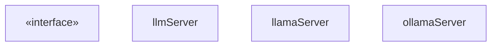
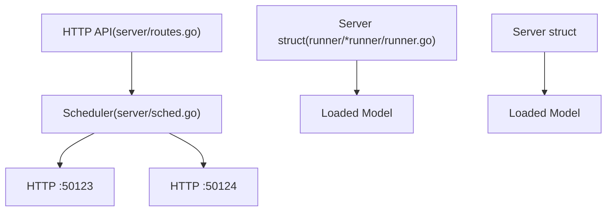
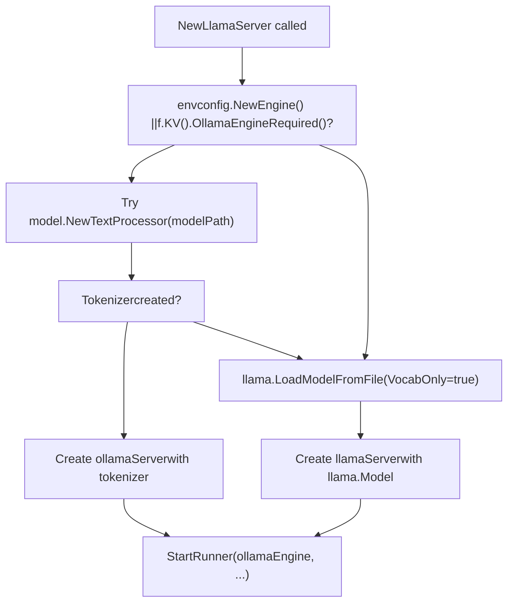
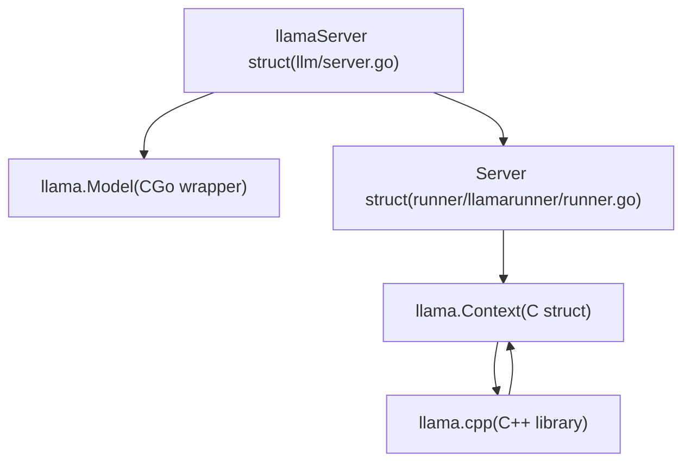
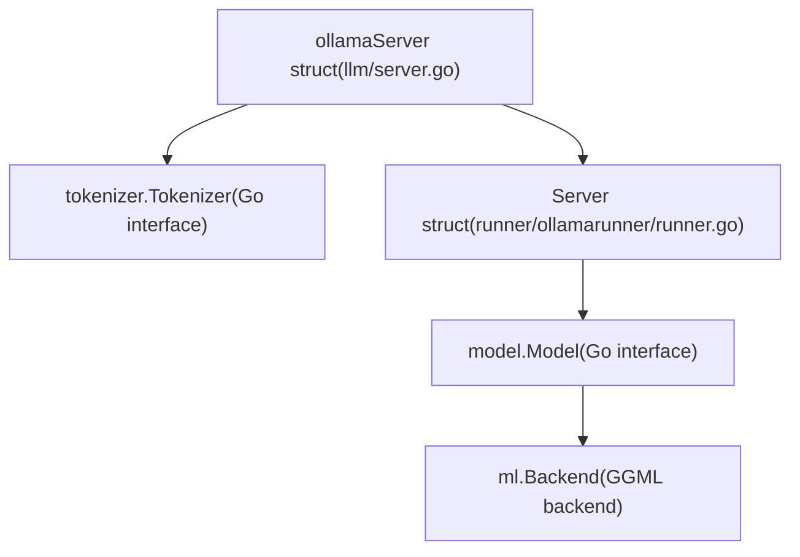
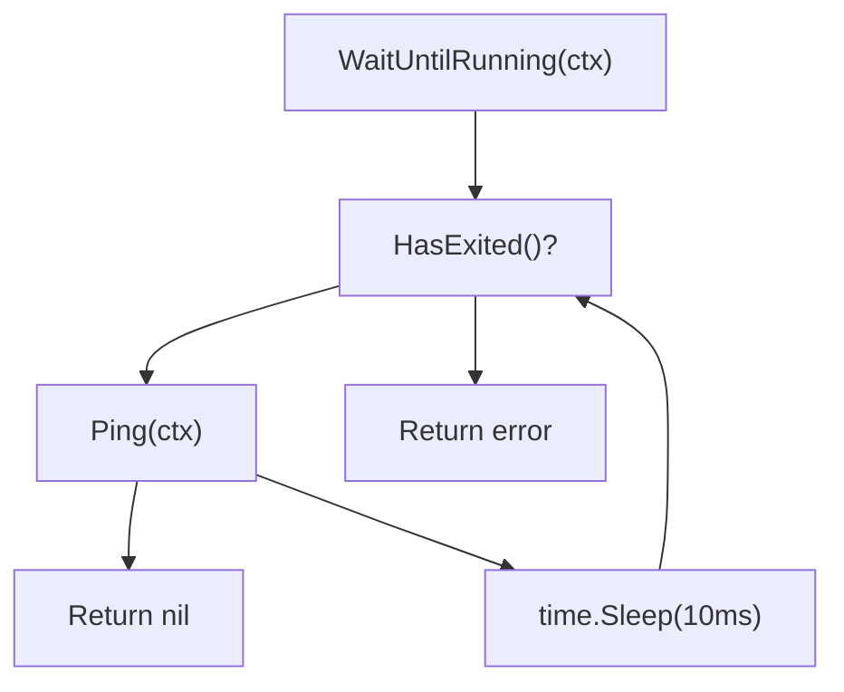
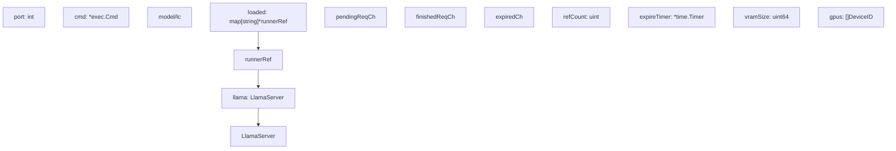

# LlamaServer and Runner Implementation

Relevant source files

-   [envconfig/config.go](https://github.com/ollama/ollama/blob/562c76d7/envconfig/config.go)
-   [envconfig/config\_test.go](https://github.com/ollama/ollama/blob/562c76d7/envconfig/config_test.go)
-   [llama/llama.go](https://github.com/ollama/ollama/blob/562c76d7/llama/llama.go)
-   [llama/sampling\_ext.cpp](https://github.com/ollama/ollama/blob/562c76d7/llama/sampling_ext.cpp)
-   [llama/sampling\_ext.h](https://github.com/ollama/ollama/blob/562c76d7/llama/sampling_ext.h)
-   [llm/server.go](https://github.com/ollama/ollama/blob/562c76d7/llm/server.go)
-   [server/sched.go](https://github.com/ollama/ollama/blob/562c76d7/server/sched.go)
-   [server/sched\_test.go](https://github.com/ollama/ollama/blob/562c76d7/server/sched_test.go)

## Purpose and Scope

This page documents the runner subprocess architecture in Ollama's inference engine. Runners execute in separate processes from the main Ollama server to provide isolation and stability. The runner layer sits between the scheduler (see [2.2](/ollama/ollama/2.2-request-scheduling-and-runner-management)) and performs actual model inference.

**Key Responsibilities:**

-   **Subprocess Management**: Runners execute as separate processes communicating via HTTP
-   **Dual Implementation**: CGo-based (llamaServer) vs Go-native (ollamaServer)
-   **Process Lifecycle**: Startup, initialization, health checking, and graceful shutdown
-   **API Interface**: HTTP endpoints for model loading, inference, and tokenization

For information about GPU memory allocation and layer distribution, see [5.4](/ollama/ollama/5.4-memory-management-and-gpu-allocation). For details on the KV cache system, see [5.3](/ollama/ollama/5.3-kv-cache-system). For batch processing and sequence management within runners, see [2.3](/ollama/ollama/2.3-model-execution-pipeline).

---

## LlamaServer Interface

The `LlamaServer` interface defines the contract that all runner implementations must fulfill. It provides a unified API for the scheduler to interact with loaded models regardless of the underlying implementation.

**LlamaServer Interface and Implementations**


**Key Methods:**

| Method | Purpose |
| --- | --- |
| `Load()` | Allocate memory and load model weights onto GPU/CPU |
| `Completion()` | Execute inference for text generation via HTTP |
| `Embedding()` | Generate embeddings for input text via HTTP |
| `WaitUntilRunning()` | Block until the runner subprocess is ready |
| `Ping()` | Check if subprocess is responsive |
| `Close()` | Shutdown the runner subprocess and free resources |
| `VRAMSize()` | Report total VRAM usage across all GPUs |
| `Pid()` | Get process ID of subprocess |
| `GetPort()` | Get HTTP port for subprocess communication |
| `HasExited()` | Check if subprocess has terminated |

Sources: [llm/server.go67-85](https://github.com/ollama/ollama/blob/562c76d7/llm/server.go#L67-L85) [llm/server.go88-109](https://github.com/ollama/ollama/blob/562c76d7/llm/server.go#L88-L109)

---

## Subprocess Architecture

### Process Separation

Ollama runs model inference in separate subprocesses rather than the main server process. This provides:

-   **Isolation**: Crashes in inference don't take down the main server
-   **Resource Management**: Clean VRAM recovery when processes exit
-   **Flexibility**: Different runner implementations can coexist

**Process Structure Diagram**


Sources: [llm/server.go320-438](https://github.com/ollama/ollama/blob/562c76d7/llm/server.go#L320-L438) [server/sched.go39-60](https://github.com/ollama/ollama/blob/562c76d7/server/sched.go#L39-L60)

### Subprocess Startup

**StartRunner Function Flow**

Sources: [llm/server.go321-438](https://github.com/ollama/ollama/blob/562c76d7/llm/server.go#L321-L438)

**Key Steps in StartRunner** [llm/server.go321-438](https://github.com/ollama/ollama/blob/562c76d7/llm/server.go#L321-L438):

1.  **Binary Path**: Call `os.Executable()` to get current binary, resolve symlinks
2.  **Port Allocation**: Try to bind `localhost:0` to get free port, fall back to random ephemeral port (49152-65535)
3.  **Command Construction**: Build args `["runner", "--ollama-engine" (optional), "--model", path, "--port", port]`
4.  **Environment Setup**:
    -   Set `PATH`/`LD_LIBRARY_PATH`/`DYLD_LIBRARY_PATH` for GPU libraries
    -   Set GPU visibility vars (e.g., `CUDA_VISIBLE_DEVICES`)
    -   Pass through `OLLAMA_*` environment variables
5.  **Process Start**: Call `cmd.Start()` to fork subprocess
6.  **Reaper Goroutine**: Spawn goroutine that calls `cmd.Wait()` and forwards exit to `done` channel

Sources: [llm/server.go321-438](https://github.com/ollama/ollama/blob/562c76d7/llm/server.go#L321-L438)

---

## Runner Implementations

Ollama implements two distinct runner architectures, selected based on model compatibility and configuration.

**Implementation Selection Diagram**


**Selection Logic:**

1.  **ollamaServer** (Go-native): Used when `OLLAMA_NEW_ENGINE=true` or model has GGUF metadata `ollama.engine_required=true`
2.  **llamaServer** (CGo): Used for models not yet compatible with the new engine, relies on llama.cpp via CGo

Sources: [llm/server.go144-319](https://github.com/ollama/ollama/blob/562c76d7/llm/server.go#L144-L319)

### llamaServer (CGo Implementation)

The `llamaServer` uses llama.cpp through CGo bindings. This is the legacy implementation that supports the widest range of model architectures.

**Architecture:**


**Key Components:**

-   **llama.Model** [llama/llama.go450-452](https://github.com/ollama/ollama/blob/562c76d7/llama/llama.go#L450-L452): CGo wrapper around C `llama_model` struct from llama.cpp
-   **llama.Context** [llama/llama.go161-164](https://github.com/ollama/ollama/blob/562c76d7/llama/llama.go#L161-L164): CGo wrapper around C `llama_context` for inference state
-   **Server struct** [runner/llamarunner/runner.go256-308](https://github.com/ollama/ollama/blob/562c76d7/runner/llamarunner/runner.go#L256-L308): Subprocess server managing sequences and batching
-   **CGo Bindings** [llama/llama.go1-60](https://github.com/ollama/ollama/blob/562c76d7/llama/llama.go#L1-L60): C function wrappers for llama.cpp API

**Tokenization Flow:**

> **[Mermaid sequence]**
> *(图表结构无法解析)*

Sources: [llm/server.go111-115](https://github.com/ollama/ollama/blob/562c76d7/llm/server.go#L111-L115) [runner/llamarunner/runner.go256-308](https://github.com/ollama/ollama/blob/562c76d7/runner/llamarunner/runner.go#L256-L308) [llama/llama.go450-452](https://github.com/ollama/ollama/blob/562c76d7/llama/llama.go#L450-L452) [llama/llama.go161-164](https://github.com/ollama/ollama/blob/562c76d7/llama/llama.go#L161-L164)

### ollamaServer (Go-Native Implementation)

The `ollamaServer` uses Ollama's pure-Go inference engine with model implementations in the `model` package.

**Architecture:**


**Key Components:**

-   **tokenizer.Tokenizer** \[tokenizer/tokenizer.go\]: Go interface for text encoding/decoding
-   **model.Model** [model/model.go35-41](https://github.com/ollama/ollama/blob/562c76d7/model/model.go#L35-L41): Go interface for model-specific inference logic
-   **ml.Backend** [ml/backend.go16-32](https://github.com/ollama/ollama/blob/562c76d7/ml/backend.go#L16-L32): Backend abstraction for tensor operations
-   **Server struct** [runner/ollamarunner/runner.go331-388](https://github.com/ollama/ollama/blob/562c76d7/runner/ollamarunner/runner.go#L331-L388): Subprocess server with native Go inference

**Implementation Differences:**

| Aspect | llamaServer (CGo) | ollamaServer (Go-Native) |
| --- | --- | --- |
| **Language** | C++ via CGo | Pure Go (except GGML backend) |
| **Model Loading** | `llama.LoadModelFromFile` | `model.New` |
| **Tokenization** | llama.cpp vocab functions | `tokenizer.Tokenizer` interface |
| **Batching** | `llama.Batch` (C structs) | `input.Batch` (Go structs) |
| **Backend Access** | Indirect via llama.cpp | Direct `ml.Backend` |
| **Architecture Support** | All llama.cpp models | Expanding Go implementations |

Sources: [llm/server.go117-121](https://github.com/ollama/ollama/blob/562c76d7/llm/server.go#L117-L121) [runner/ollamarunner/runner.go331-388](https://github.com/ollama/ollama/blob/562c76d7/runner/ollamarunner/runner.go#L331-L388) [model/model.go35-41](https://github.com/ollama/ollama/blob/562c76d7/model/model.go#L35-L41)

---

## Process Lifecycle

### Creation and Initialization

**Complete Lifecycle Diagram**

Sources: [llm/server.go144-319](https://github.com/ollama/ollama/blob/562c76d7/llm/server.go#L144-L319) [llm/server.go321-438](https://github.com/ollama/ollama/blob/562c76d7/llm/server.go#L321-L438) [llm/server.go497-714](https://github.com/ollama/ollama/blob/562c76d7/llm/server.go#L497-L714)

### Health Checking

The main process must verify the subprocess is ready before sending requests.

**Health Check Implementation**


**Key Methods:**

| Method | Implementation | Purpose |
| --- | --- | --- |
| `Ping()` | HTTP GET `/health` | Quick health check |
| `WaitUntilRunning()` | Loop calling `Ping()` | Block until ready |
| `HasExited()` | Check `done` channel | Detect crashed subprocess |

**Ping Implementation** [llm/server.go1863-1887](https://github.com/ollama/ollama/blob/562c76d7/llm/server.go#L1863-L1887):

```
func (s *llmServer) Ping(ctx context.Context) error {    resp, err := http.Get(fmt.Sprintf("http://127.0.0.1:%d/health", s.port))    if err != nil {        return err    }    defer resp.Body.Close()        if resp.StatusCode != http.StatusOK {        body, _ := io.ReadAll(resp.Body)        return fmt.Errorf("health check failed: %s", body)    }    return nil}
```
**WaitUntilRunning Implementation** [llm/server.go1889-1911](https://github.com/ollama/ollama/blob/562c76d7/llm/server.go#L1889-L1911):

```
func (s *llmServer) WaitUntilRunning(ctx context.Context) error {    for {        select {        case <-ctx.Done():            return ctx.Err()        case err := <-s.done:            return err        default:            if err := s.Ping(ctx); err == nil {                return nil            }            time.Sleep(10 * time.Millisecond)        }    }}
```
Sources: [llm/server.go1863-1911](https://github.com/ollama/ollama/blob/562c76d7/llm/server.go#L1863-L1911)

### Shutdown and Cleanup

**Shutdown Sequence**

> **[Mermaid sequence]**
> *(图表结构无法解析)*

**Close Implementation** [llm/server.go1913-1934](https://github.com/ollama/ollama/blob/562c76d7/llm/server.go#L1913-L1934):

```
func (s *llmServer) Close() error {    if s.cmd != nil && s.cmd.Process != nil {        if runtime.GOOS == "windows" {            s.cmd.Process.Kill()        } else {            s.cmd.Process.Signal(os.Interrupt)        }    }        select {    case err := <-s.done:        return err    case <-time.After(30 * time.Second):        s.cmd.Process.Kill()        return errors.New("shutdown timeout")    }}
```
**Reaper Goroutine** [llm/server.go300-312](https://github.com/ollama/ollama/blob/562c76d7/llm/server.go#L300-L312):

Spawned during `NewLlamaServer` to detect subprocess exit:

```
go func() {    err := s.cmd.Wait()    if err != nil && s.status != nil && s.status.LastErrMsg != "" {        if strings.Contains(s.status.LastErrMsg, "unknown model") {            s.status.LastErrMsg = "this model is not supported by your version of Ollama"        }        s.done <- errors.New(s.status.LastErrMsg)    } else {        s.done <- err    }}()
```
Sources: [llm/server.go300-312](https://github.com/ollama/ollama/blob/562c76d7/llm/server.go#L300-L312) [llm/server.go1913-1934](https://github.com/ollama/ollama/blob/562c76d7/llm/server.go#L1913-L1934)

---

## HTTP API Communication

The main Ollama process communicates with runner subprocesses via HTTP on the allocated port.

### API Endpoints

**Endpoint Overview**

| Endpoint | Method | Purpose | Request Body | Response |
| --- | --- | --- | --- | --- |
| `/health` | GET | Health check | None | HTTP 200 or error |
| `/api/load` | POST | Load model | `LoadRequest` | `LoadResponse` |
| `/api/completion` | POST | Generate text | `CompletionRequest` | Stream of `CompletionResponse` |
| `/api/embeddings` | POST | Generate embeddings | Prompt text | Embedding vector |
| `/api/tokenize` | POST | Tokenize text | Text string | Token IDs |
| `/api/detokenize` | POST | Detokenize | Token IDs | Text string |

Sources: [llm/server.go1679-1861](https://github.com/ollama/ollama/blob/562c76d7/llm/server.go#L1679-L1861)

### Load Request Flow

**Model Loading via HTTP**

> **[Mermaid sequence]**
> *(图表结构无法解析)*

**LoadRequest Structure** [llm/server.go471-488](https://github.com/ollama/ollama/blob/562c76d7/llm/server.go#L471-L488):

```
type LoadRequest struct {    Operation      LoadOperation  // Fit, Alloc, Commit, Close    LoraPath       []string    Parallel       int    BatchSize      int    FlashAttention ml.FlashAttentionType    KvSize         int    KvCacheType    string    NumThreads     int    GPULayers      ml.GPULayersList    MultiUserCache bool        // Legacy fields for llamaServer    ProjectorPath  string    MainGPU        int    UseMmap        bool}
```
Sources: [llm/server.go471-488](https://github.com/ollama/ollama/blob/562c76d7/llm/server.go#L471-L488) [llm/server.go490-493](https://github.com/ollama/ollama/blob/562c76d7/llm/server.go#L490-L493)

### Completion Request Flow

**Streaming Generation**

> **[Mermaid sequence]**
> *(图表结构无法解析)*

**CompletionResponse Structure** [llm/llm.go37-70](https://github.com/ollama/ollama/blob/562c76d7/llm/llm.go#L37-L70):

```
type CompletionResponse struct {    Content         string    Logprobs        []Logprob    Done            bool    DoneReason      DoneReason        // Metrics (only in final response)    PromptEvalCount      int    PromptEvalDuration   time.Duration    EvalCount            int    EvalDuration         time.Duration    LoadDuration         time.Duration    SampleCount          int    SampleDuration       time.Duration        // Timings    Timings Timings}
```
Sources: [llm/llm.go37-70](https://github.com/ollama/ollama/blob/562c76d7/llm/llm.go#L37-L70) [llm/server.go1679-1753](https://github.com/ollama/ollama/blob/562c76d7/llm/server.go#L1679-L1753)

### HTTP Client Implementation

**Request Methods in llmServer**

The `llmServer` base struct implements HTTP communication for both `llamaServer` and `ollamaServer`:

```
func (s *llmServer) Completion(ctx context.Context, req CompletionRequest, fn func(CompletionResponse)) error {    url := fmt.Sprintf("http://127.0.0.1:%d/api/completion", s.port)    body, _ := json.Marshal(req)        httpReq, _ := http.NewRequestWithContext(ctx, "POST", url, bytes.NewReader(body))    resp, err := http.DefaultClient.Do(httpReq)    if err != nil {        return err    }    defer resp.Body.Close()        scanner := bufio.NewScanner(resp.Body)    for scanner.Scan() {        var response CompletionResponse        json.Unmarshal(scanner.Bytes(), &response)        fn(response)                if response.Done {            break        }    }    return scanner.Err()}
```
Sources: [llm/server.go1679-1753](https://github.com/ollama/ollama/blob/562c76d7/llm/server.go#L1679-L1753)

---

## Integration with Scheduler

The scheduler interacts with runners through the `LlamaServer` interface to manage model lifecycle.

### Runner Management


**Reference Counting:**

The scheduler maintains reference counts to track active requests:

1.  **Request Start**: Increment `refCount`, stop expire timer
2.  **Request Complete**: Decrement `refCount`
3.  **Idle**: When `refCount == 0`, start expire timer
4.  **Expiration**: When timer fires and `refCount == 0`, unload model

**Unloading Process:**

> **[Mermaid sequence]**
> *(图表结构无法解析)*

Sources: [server/sched.go284-386](https://github.com/ollama/ollama/blob/562c76d7/server/sched.go#L284-L386) [server/sched.go660-695](https://github.com/ollama/ollama/blob/562c76d7/server/sched.go#L660-L695) [server/sched.go731-860](https://github.com/ollama/ollama/blob/562c76d7/server/sched.go#L731-L860)

### Error Handling

**Subprocess Exit Detection**

The main process monitors subprocess health through multiple mechanisms:

1.  **Reaper Goroutine** [llm/server.go300-312](https://github.com/ollama/ollama/blob/562c76d7/llm/server.go#L300-L312): Detects process exit via `cmd.Wait()`
2.  **Done Channel** [llm/server.go91](https://github.com/ollama/ollama/blob/562c76d7/llm/server.go#L91-L91): Receives exit status and error messages
3.  **HasExited()** [llm/server.go1936-1945](https://github.com/ollama/ollama/blob/562c76d7/llm/server.go#L1936-L1945): Non-blocking check for exit
4.  **StatusWriter** [llm/server.go92](https://github.com/ollama/ollama/blob/562c76d7/llm/server.go#L92-L92): Captures stderr for error diagnostics

**Error Flow Diagram**

> **[Mermaid sequence]**
> *(图表结构无法解析)*

Sources: [llm/server.go91](https://github.com/ollama/ollama/blob/562c76d7/llm/server.go#L91-L91) [llm/server.go300-312](https://github.com/ollama/ollama/blob/562c76d7/llm/server.go#L300-L312) [llm/server.go1936-1945](https://github.com/ollama/ollama/blob/562c76d7/llm/server.go#L1936-L1945)

---

## Summary

The LlamaServer and runner implementation provides:

1.  **Unified Interface**: `LlamaServer` abstracts model execution regardless of backend
2.  **Dual Implementation**: Legacy llama.cpp-based and new pure-Go engine
3.  **Process Isolation**: Runners execute in subprocesses for stability
4.  **Efficient Batching**: Process multiple sequences and tokens per batch
5.  **Prompt Caching**: Reuse KV cache across requests with cache slots
6.  **Parallel Execution**: Support multiple concurrent inference requests
7.  **Graceful Lifecycle**: Clean loading, execution, and unloading with VRAM recovery

The runner layer serves as the bridge between Ollama's scheduling and resource management (scheduler) and the actual inference computation (ML backend and model implementations).
