# KV Cache System

Relevant source files

-   [integration/embed\_test.go](https://github.com/ollama/ollama/blob/562c76d7/integration/embed_test.go)
-   [kvcache/cache.go](https://github.com/ollama/ollama/blob/562c76d7/kvcache/cache.go)
-   [kvcache/causal.go](https://github.com/ollama/ollama/blob/562c76d7/kvcache/causal.go)
-   [kvcache/causal\_test.go](https://github.com/ollama/ollama/blob/562c76d7/kvcache/causal_test.go)
-   [kvcache/encoder.go](https://github.com/ollama/ollama/blob/562c76d7/kvcache/encoder.go)
-   [kvcache/wrapper.go](https://github.com/ollama/ollama/blob/562c76d7/kvcache/wrapper.go)
-   [llama/llama.go](https://github.com/ollama/ollama/blob/562c76d7/llama/llama.go)
-   [llama/sampling\_ext.cpp](https://github.com/ollama/ollama/blob/562c76d7/llama/sampling_ext.cpp)
-   [llama/sampling\_ext.h](https://github.com/ollama/ollama/blob/562c76d7/llama/sampling_ext.h)
-   [ml/backend.go](https://github.com/ollama/ollama/blob/562c76d7/ml/backend.go)
-   [ml/backend/ggml/ggml.go](https://github.com/ollama/ollama/blob/562c76d7/ml/backend/ggml/ggml.go)
-   [model/input/input.go](https://github.com/ollama/ollama/blob/562c76d7/model/input/input.go)
-   [model/model.go](https://github.com/ollama/ollama/blob/562c76d7/model/model.go)
-   [model/model\_test.go](https://github.com/ollama/ollama/blob/562c76d7/model/model_test.go)
-   [runner/llamarunner/cache.go](https://github.com/ollama/ollama/blob/562c76d7/runner/llamarunner/cache.go)
-   [runner/llamarunner/runner.go](https://github.com/ollama/ollama/blob/562c76d7/runner/llamarunner/runner.go)
-   [runner/ollamarunner/cache.go](https://github.com/ollama/ollama/blob/562c76d7/runner/ollamarunner/cache.go)
-   [runner/ollamarunner/cache\_test.go](https://github.com/ollama/ollama/blob/562c76d7/runner/ollamarunner/cache_test.go)
-   [runner/ollamarunner/runner.go](https://github.com/ollama/ollama/blob/562c76d7/runner/ollamarunner/runner.go)
-   [server/internal/internal/backoff/backoff.go](https://github.com/ollama/ollama/blob/562c76d7/server/internal/internal/backoff/backoff.go)

## Purpose and Scope

The KV Cache System stores key (K) and value (V) tensors from attention operations to avoid recomputation during inference. This is critical for performance as it enables incremental token generation without re-processing the entire prompt history. The system supports multiple cache types, multi-sequence batching, sliding window attention, and cross-sequence cache sharing.

This page covers the low-level cache implementations and their integration with the backend. For information about how the scheduler manages model loading and runner lifecycle, see [Request Scheduling and Runner Management](/ollama/ollama/2.2-request-scheduling-and-runner-management). For details on the complete inference pipeline, see [Model Execution Pipeline](/ollama/ollama/2.3-model-execution-pipeline).

## Architecture Overview

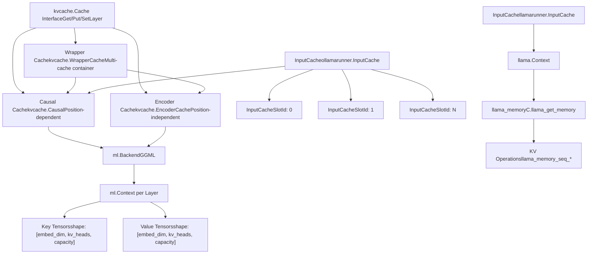
**Sources:** [kvcache/cache.go1-64](https://github.com/ollama/ollama/blob/562c76d7/kvcache/cache.go#L1-L64) [kvcache/causal.go1-644](https://github.com/ollama/ollama/blob/562c76d7/kvcache/causal.go#L1-L644) [kvcache/encoder.go1-141](https://github.com/ollama/ollama/blob/562c76d7/kvcache/encoder.go#L1-L141) [kvcache/wrapper.go1-105](https://github.com/ollama/ollama/blob/562c76d7/kvcache/wrapper.go#L1-L105) [runner/ollamarunner/cache.go1-343](https://github.com/ollama/ollama/blob/562c76d7/runner/ollamarunner/cache.go#L1-L343) [runner/llamarunner/cache.go1-252](https://github.com/ollama/ollama/blob/562c76d7/runner/llamarunner/cache.go#L1-L252)

## Cache Interface

The `kvcache.Cache` interface defines the contract for all cache implementations:

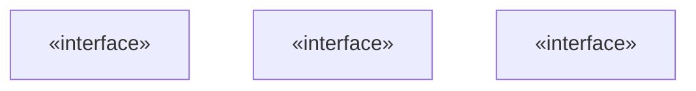
### Core Operations

| Method | Purpose |
| --- | --- |
| `SetLayer(layer int)` | Sets the active layer for subsequent Get/Put operations |
| `Get(ctx ml.Context)` | Returns cached key, value tensors and attention mask for current layer |
| `Put(ctx ml.Context, key, value ml.Tensor)` | Stores key and value tensors in cache for current layer |
| `StartForward(ctx ml.Context, batch input.Batch, reserve bool)` | Prepares cache for forward pass, allocates positions |

### Lifecycle Operations

| Method | Purpose |
| --- | --- |
| `Init(backend, dtype, maxSequences, capacity, maxBatch)` | Initializes cache with backend, allocates storage |
| `SetConfig(config ml.CacheConfig)` | Configures backend-specific optimizations |
| `Close()` | Frees all allocated resources |

### Advanced Operations

| Method | Purpose |
| --- | --- |
| `CopyPrefix(srcSeq, dstSeq, len)` | Copies cache prefix from source to destination sequence |
| `Remove(seq, beginIndex, endIndex)` | Removes tokens from cache range |
| `CanResume(seq, pos)` | Checks if sequence can resume from position |
| `Checkpoint(seq, pos)` | Creates checkpoint for recurrent models |
| `PrepareRestore(seq, pos)` | Prepares restoration from checkpoint |

**Sources:** [kvcache/cache.go15-64](https://github.com/ollama/ollama/blob/562c76d7/kvcache/cache.go#L15-L64)

## Causal Cache Implementation

The `Causal` cache stores K/V tensors according to their position in the sequence and returns history with a causal mask for attending to past tokens.

### Cache Cell Structure

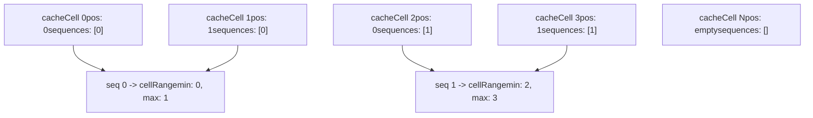
Each cache cell contains:

-   `pos`: Position of the token in its sequence
-   `sequences`: List of sequence IDs referencing this cell (enables sharing)

The `cellRanges` map tracks the storage range `[min, max]` for each sequence, enabling efficient lookups and operations.

**Sources:** [kvcache/causal.go80-88](https://github.com/ollama/ollama/blob/562c76d7/kvcache/causal.go#L80-L88) [kvcache/causal.go68-78](https://github.com/ollama/ollama/blob/562c76d7/kvcache/causal.go#L68-L78)

### Storage Layout

Keys and values are stored per layer with dimensions:

```
Key:   [embed_dim, kv_heads, capacity]
Value: [embed_dim, kv_heads, capacity] (or permuted if PermutedV)
```
When `PermutedV` is enabled, values are stored as `[capacity, embed_dim, kv_heads]` to optimize attention kernels.

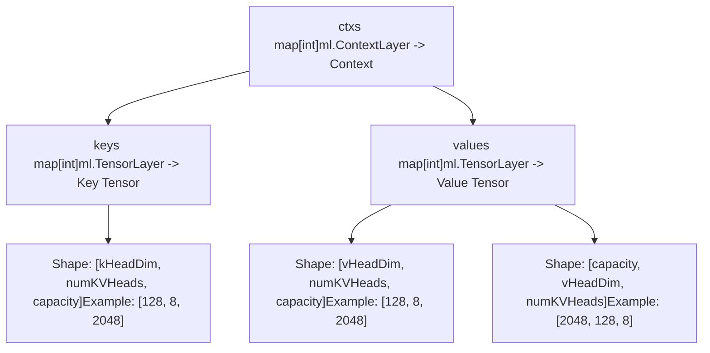
**Sources:** [kvcache/causal.go74-78](https://github.com/ollama/ollama/blob/562c76d7/kvcache/causal.go#L74-L78) [kvcache/causal.go458-473](https://github.com/ollama/ollama/blob/562c76d7/kvcache/causal.go#L458-L473) [kvcache/causal.go480-494](https://github.com/ollama/ollama/blob/562c76d7/kvcache/causal.go#L480-L494)

### Sliding Window Attention (SWA)

SWA limits the attention window to recent tokens while optionally retaining more history for cache reuse:

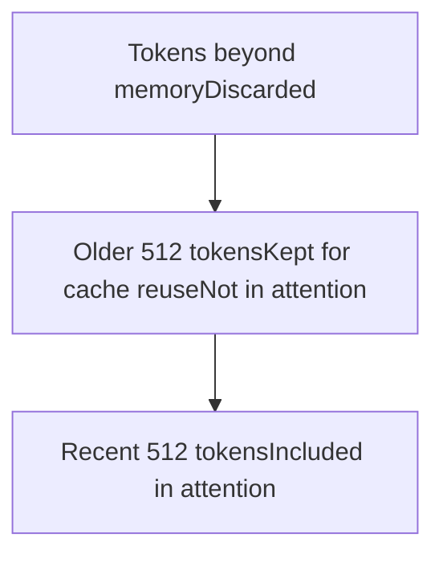
| Parameter | Description |
| --- | --- |
| `swaWindowSize` | Number of tokens included in attention mask |
| `swaMemorySize` | Total tokens retained in cache for reuse |

The system automatically removes tokens beyond `swaMemorySize` during `updateSlidingWindow()`:

**Sources:** [kvcache/causal.go23-28](https://github.com/ollama/ollama/blob/562c76d7/kvcache/causal.go#L23-L28) [kvcache/causal.go99-118](https://github.com/ollama/ollama/blob/562c76d7/kvcache/causal.go#L99-L118) [kvcache/causal.go273-349](https://github.com/ollama/ollama/blob/562c76d7/kvcache/causal.go#L273-L349)

### Cache Operations Flow

> **[Mermaid sequence]**
> *(图表结构无法解析)*

**Sources:** [kvcache/causal.go198-248](https://github.com/ollama/ollama/blob/562c76d7/kvcache/causal.go#L198-L248) [kvcache/causal.go449-495](https://github.com/ollama/ollama/blob/562c76d7/kvcache/causal.go#L449-L495) [kvcache/causal.go411-447](https://github.com/ollama/ollama/blob/562c76d7/kvcache/causal.go#L411-L447)

### Mask Generation

The causal mask ensures each token only attends to past tokens and its own sequence:

```
Mask[i][j] = -Inf if:
  - Cell j's sequence != token i's sequence
  - Cell j's position > token i's position (causality)
  - Cell j's position < token i's position - swaWindowSize (SWA)
  - Chunked attention: Cell j's position < chunk start
Otherwise: 0
```
**Sources:** [kvcache/causal.go362-389](https://github.com/ollama/ollama/blob/562c76d7/kvcache/causal.go#L362-L389)

## Encoder Cache

The `EncoderCache` stores position-independent K/V tensors, typically for encoder outputs in encoder-decoder models:

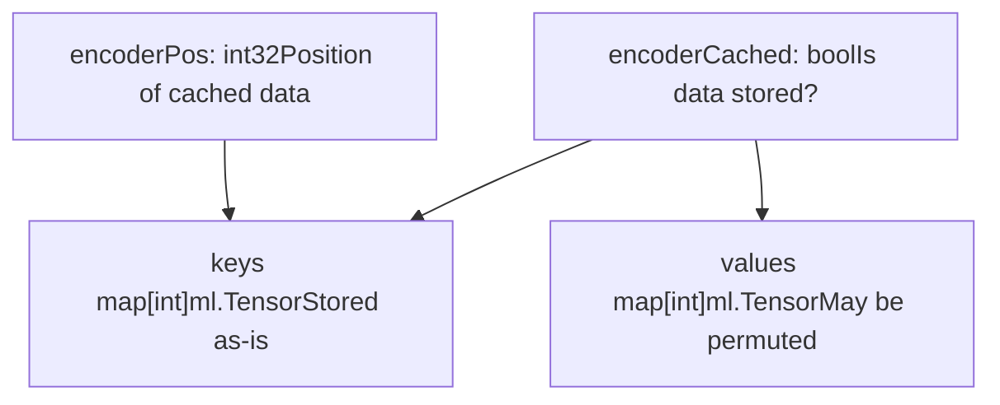
Key differences from Causal cache:

-   No sequence tracking or causal masking
-   Single cached state per layer
-   Tensors returned as stored (no View operations)
-   `EncoderCached()` method indicates if data is present

**Sources:** [kvcache/encoder.go1-141](https://github.com/ollama/ollama/blob/562c76d7/kvcache/encoder.go#L1-L141) [kvcache/encoder.go37-42](https://github.com/ollama/ollama/blob/562c76d7/kvcache/encoder.go#L37-L42) [kvcache/encoder.go106-112](https://github.com/ollama/ollama/blob/562c76d7/kvcache/encoder.go#L106-L112)

## Input Cache Management

The `InputCache` provides a higher-level abstraction over the low-level KV cache, managing cache slots for different sequences and handling prompt reuse.

### Cache Slot Structure

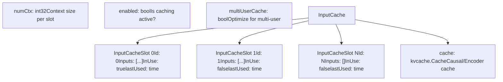
Each `InputCacheSlot` contains:

| Field | Type | Description |
| --- | --- | --- |
| `Id` | `int` | Index in the KV cache |
| `Inputs` | `[]*input.Input` | Cached prompt inputs |
| `InUse` | `bool` | Whether slot is actively processing |
| `lastUsed` | `time.Time` | Last access time for eviction |

**Sources:** [runner/ollamarunner/cache.go16-32](https://github.com/ollama/ollama/blob/562c76d7/runner/ollamarunner/cache.go#L16-L32) [runner/ollamarunner/cache.go82-94](https://github.com/ollama/ollama/blob/562c76d7/runner/ollamarunner/cache.go#L82-L94)

### Prompt Reuse Strategy

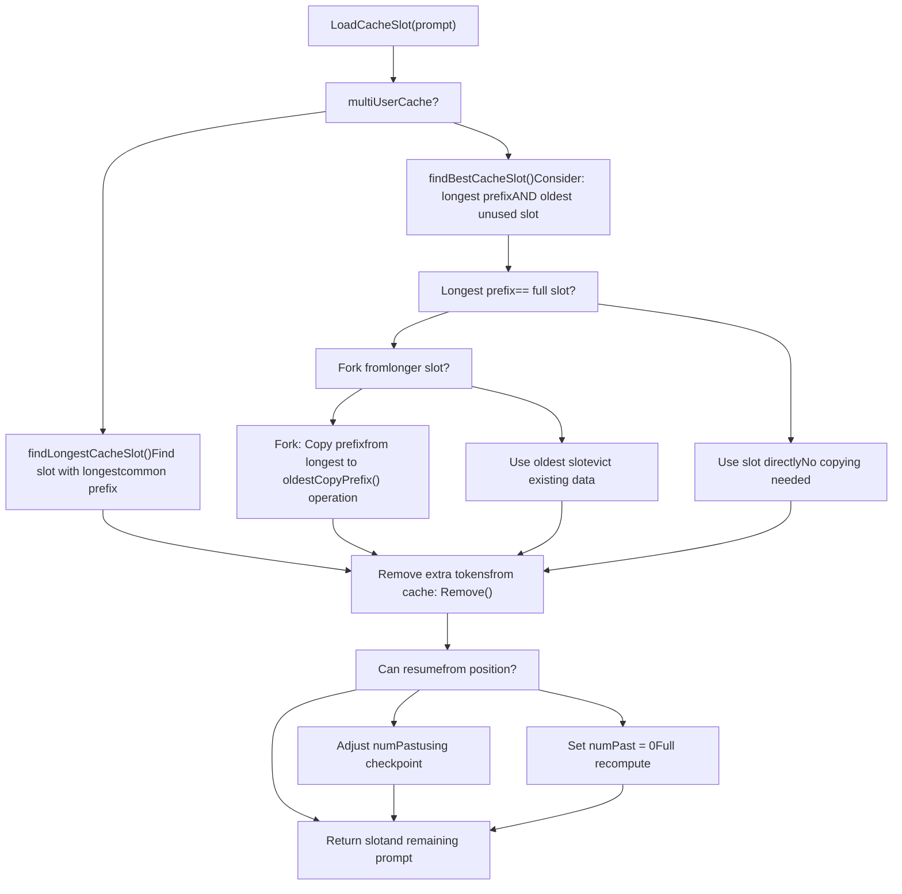
**Key Functions:**

-   `findLongestCacheSlot()`: Single-user optimization - finds slot with longest common prefix
-   `findBestCacheSlot()`: Multi-user optimization - balances prefix length with slot age
-   `countCommonPrefix()`: Compares token sequences and multimodal hashes for equality

**Sources:** [runner/ollamarunner/cache.go96-158](https://github.com/ollama/ollama/blob/562c76d7/runner/ollamarunner/cache.go#L96-L158) [runner/ollamarunner/cache.go160-181](https://github.com/ollama/ollama/blob/562c76d7/runner/ollamarunner/cache.go#L160-L181) [runner/ollamarunner/cache.go183-227](https://github.com/ollama/ollama/blob/562c76d7/runner/ollamarunner/cache.go#L183-L227) [runner/ollamarunner/cache.go229-245](https://github.com/ollama/ollama/blob/562c76d7/runner/ollamarunner/cache.go#L229-L245)

### Cache Shifting

When context window is exceeded, the cache shifts to discard old tokens while preserving recent ones:

> **[Mermaid sequence]**
> *(图表结构无法解析)*

The `ShiftDiscard()` function ensures entire batches (marked with `SameBatch`) are removed together:

**Sources:** [runner/ollamarunner/cache.go249-269](https://github.com/ollama/ollama/blob/562c76d7/runner/ollamarunner/cache.go#L249-L269) [runner/ollamarunner/cache.go271-343](https://github.com/ollama/ollama/blob/562c76d7/runner/ollamarunner/cache.go#L271-L343) [kvcache/causal.go549-613](https://github.com/ollama/ollama/blob/562c76d7/kvcache/causal.go#L549-L613)

## Cache Configuration

The `ml.CacheConfig` structure controls backend-specific optimizations:

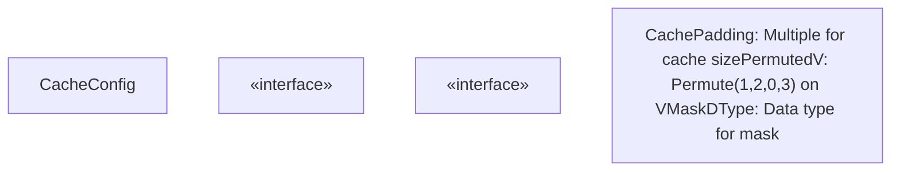
| Field | Type | Default | Description |
| --- | --- | --- | --- |
| `CachePadding` | `int` | 256 | Cache capacity rounded to multiple of this value |
| `PermutedV` | `bool` | Varies | Whether to permute V tensors for kernel optimization |
| `MaskDType` | `DType` | `DTypeF32` | Data type for attention mask (F16 for flash attention) |

### Backend-Specific Settings

```
// GGML backend with Flash Attentionfunc (b *Backend) CacheConfig() ml.CacheConfig {    if b.flashAttention == ml.FlashAttentionEnabled {        return ml.CacheConfig{            CachePadding: 256,            MaskDType: ml.DTypeF16,        }    } else {        return ml.CacheConfig{            CachePadding: 256,            PermutedV: true,        }    }}
```
**Sources:** [ml/backend.go41-57](https://github.com/ollama/ollama/blob/562c76d7/ml/backend.go#L41-L57) [ml/backend/ggml/ggml.go686-692](https://github.com/ollama/ollama/blob/562c76d7/ml/backend/ggml/ggml.go#L686-L692) [kvcache/causal.go130-145](https://github.com/ollama/ollama/blob/562c76d7/kvcache/causal.go#L130-L145)

## Integration with Backends

### GGML Backend Integration

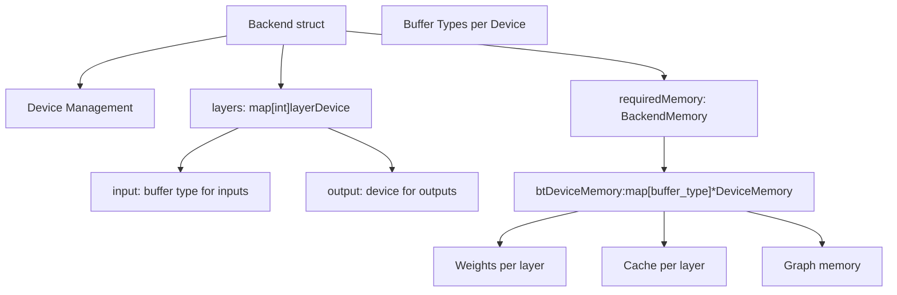
The backend allocates cache memory using `ml.Context.Layer(i)` which returns a context associated with the appropriate device for layer `i`:

```
// Create context for layer-specific cache allocationctx := backend.NewContextSize(2).Layer(layerIndex)keys[layer] = ctx.Zeros(dtype, kHeadDim, numKVHeads, capacity)
```
Memory is tracked per layer in `btDeviceMemory`:

**Sources:** [ml/backend/ggml/ggml.go76-119](https://github.com/ollama/ollama/blob/562c76d7/ml/backend/ggml/ggml.go#L76-L119) [kvcache/causal.go458-473](https://github.com/ollama/ollama/blob/562c76d7/kvcache/causal.go#L458-L473) [ml/backend/ggml/ggml.go909-924](https://github.com/ollama/ollama/blob/562c76d7/ml/backend/ggml/ggml.go#L909-L924)

### llama.cpp Integration

The `llamarunner` integrates with llama.cpp's native KV cache through C bindings:

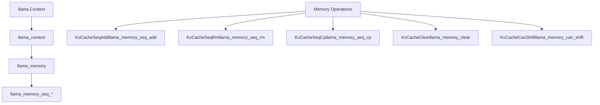
| Go Method | C Function | Purpose |
| --- | --- | --- |
| `KvCacheSeqAdd` | `llama_memory_seq_add` | Shift positions by delta |
| `KvCacheSeqRm` | `llama_memory_seq_rm` | Remove token range |
| `KvCacheSeqCp` | `llama_memory_seq_cp` | Copy sequence prefix |
| `KvCacheClear` | `llama_memory_clear` | Clear entire cache |
| `KvCacheCanShift` | `llama_memory_can_shift` | Check if shift supported |

**Sources:** [llama/llama.go190-208](https://github.com/ollama/ollama/blob/562c76d7/llama/llama.go#L190-L208) [runner/llamarunner/cache.go142-195](https://github.com/ollama/ollama/blob/562c76d7/runner/llamarunner/cache.go#L142-L195)

## Multi-Sequence Support

The cache supports parallel processing of multiple sequences with shared storage:

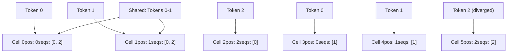
### Copy-on-Write Semantics

The `CopyPrefix()` operation enables efficient forking without data duplication:

1.  Shared cells reference multiple sequences
2.  When a sequence diverges, only new tokens are stored
3.  Common prefix remains shared until overwritten

**Sources:** [kvcache/causal.go497-518](https://github.com/ollama/ollama/blob/562c76d7/kvcache/causal.go#L497-L518)

### Cache Capacity Calculation

```
Total Capacity = maxSequences * (capacity or swaMemorySize) + maxBatch
Rounded to CachePadding multiple
```
For sliding window attention:

-   `swaMemorySize > swaWindowSize`: Enables cache reuse beyond attention window
-   Extra `+1` for stop token when `maxSequences > 1`

**Sources:** [kvcache/causal.go169-176](https://github.com/ollama/ollama/blob/562c76d7/kvcache/causal.go#L169-L176)

## Performance Considerations

### Cache Padding

Padding to 256 improves memory access patterns on GPUs:

```
Actual cache size = roundUp(requested_size, 256)
Cache range returned: roundDown(min, 256) to roundUp(max+1, 256) - 1
```
**Sources:** [kvcache/causal.go351-357](https://github.com/ollama/ollama/blob/562c76d7/kvcache/causal.go#L351-L357) [kvcache/causal.go362-365](https://github.com/ollama/ollama/blob/562c76d7/kvcache/causal.go#L362-L365)

### Multi-User vs Single-User

| Strategy | Use Case | Slot Selection |
| --- | --- | --- |
| Single-user | Sequential requests | Longest common prefix |
| Multi-user | Concurrent users | Best of: longest prefix vs oldest slot |

Single-user maximizes cache hits and minimizes footprint. Multi-user prevents one sequence from monopolizing cache slots.

**Sources:** [runner/ollamarunner/cache.go96-158](https://github.com/ollama/ollama/blob/562c76d7/runner/ollamarunner/cache.go#L96-L158)

### Memory Layout Optimization

**PermutedV**: Stores values as `[capacity, embed_dim, kv_heads]` instead of `[embed_dim, kv_heads, capacity]`. This enables efficient batched attention operations without a `Contiguous()` call.

**Flash Attention**: Uses `DTypeF16` masks and quantized KV cache (`q8_0` or `q4_0`) to reduce memory bandwidth.

**Sources:** [kvcache/causal.go426-444](https://github.com/ollama/ollama/blob/562c76d7/kvcache/causal.go#L426-L444) [kvcache/causal.go480-494](https://github.com/ollama/ollama/blob/562c76d7/kvcache/causal.go#L480-L494) [llama/llama.go139-141](https://github.com/ollama/ollama/blob/562c76d7/llama/llama.go#L139-L141)
