# Memory Management and GPU Allocation

Relevant source files

-   [envconfig/config.go](https://github.com/ollama/ollama/blob/562c76d7/envconfig/config.go)
-   [envconfig/config\_test.go](https://github.com/ollama/ollama/blob/562c76d7/envconfig/config_test.go)
-   [integration/embed\_test.go](https://github.com/ollama/ollama/blob/562c76d7/integration/embed_test.go)
-   [kvcache/cache.go](https://github.com/ollama/ollama/blob/562c76d7/kvcache/cache.go)
-   [kvcache/causal.go](https://github.com/ollama/ollama/blob/562c76d7/kvcache/causal.go)
-   [kvcache/causal\_test.go](https://github.com/ollama/ollama/blob/562c76d7/kvcache/causal_test.go)
-   [kvcache/encoder.go](https://github.com/ollama/ollama/blob/562c76d7/kvcache/encoder.go)
-   [kvcache/wrapper.go](https://github.com/ollama/ollama/blob/562c76d7/kvcache/wrapper.go)
-   [llm/server.go](https://github.com/ollama/ollama/blob/562c76d7/llm/server.go)
-   [ml/backend.go](https://github.com/ollama/ollama/blob/562c76d7/ml/backend.go)
-   [ml/backend/ggml/ggml.go](https://github.com/ollama/ollama/blob/562c76d7/ml/backend/ggml/ggml.go)
-   [model/input/input.go](https://github.com/ollama/ollama/blob/562c76d7/model/input/input.go)
-   [model/model.go](https://github.com/ollama/ollama/blob/562c76d7/model/model.go)
-   [model/model\_test.go](https://github.com/ollama/ollama/blob/562c76d7/model/model_test.go)
-   [runner/llamarunner/cache.go](https://github.com/ollama/ollama/blob/562c76d7/runner/llamarunner/cache.go)
-   [runner/llamarunner/runner.go](https://github.com/ollama/ollama/blob/562c76d7/runner/llamarunner/runner.go)
-   [runner/ollamarunner/cache.go](https://github.com/ollama/ollama/blob/562c76d7/runner/ollamarunner/cache.go)
-   [runner/ollamarunner/cache\_test.go](https://github.com/ollama/ollama/blob/562c76d7/runner/ollamarunner/cache_test.go)
-   [runner/ollamarunner/runner.go](https://github.com/ollama/ollama/blob/562c76d7/runner/ollamarunner/runner.go)
-   [server/internal/internal/backoff/backoff.go](https://github.com/ollama/ollama/blob/562c76d7/server/internal/internal/backoff/backoff.go)
-   [server/sched.go](https://github.com/ollama/ollama/blob/562c76d7/server/sched.go)
-   [server/sched\_test.go](https://github.com/ollama/ollama/blob/562c76d7/server/sched_test.go)

This page describes how Ollama manages memory allocation for models across CPU and GPU devices. It covers memory tracking structures, GPU layer assignment algorithms, memory estimation, and the interaction between the scheduler and backend memory systems.

For information about the KV cache system specifically, see [KV Cache System](/ollama/ollama/5.3-kv-cache-system). For details on model loading and runner lifecycle, see [LlamaServer and Runner Implementation](/ollama/ollama/5.2-llamaserver-and-runner-implementation).

## Overview

Ollama employs a sophisticated memory management system that:

-   Tracks memory requirements per layer (weights and cache)
-   Assigns model layers to CPU or GPU devices based on available memory
-   Estimates compute graph memory requirements
-   Manages multiple loaded models through a scheduler
-   Handles memory allocation through backend-specific buffer types

The system operates in phases: estimation (fit), allocation (alloc), and commitment (commit), allowing models to be loaded incrementally while avoiding out-of-memory errors.

## Memory Tracking Structures

### BackendMemory Structure

The `ml.BackendMemory` structure tracks cumulative memory allocations across all devices:

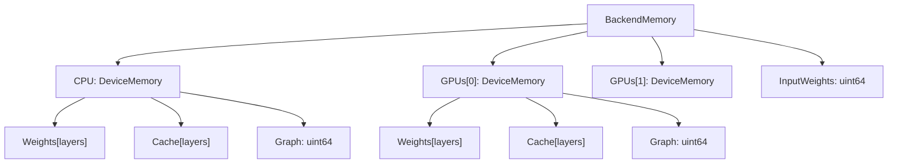
**Memory Tracking by Layer**

Each `DeviceMemory` contains:

-   `Weights[]` - memory for model weights per layer
-   `Cache[]` - KV cache memory per layer
-   `Graph` - compute graph scratch space
-   `DeviceID` - unique device identifier
-   `Name`, `ID`, `Library` - device metadata

Sources: [ml/backend.go1-415](https://github.com/ollama/ollama/blob/562c76d7/ml/backend.go#L1-L415) [llm/server.go502-513](https://github.com/ollama/ollama/blob/562c76d7/llm/server.go#L502-L513)

### Layer-Level Granularity

Memory is tracked at layer granularity to support partial offloading:

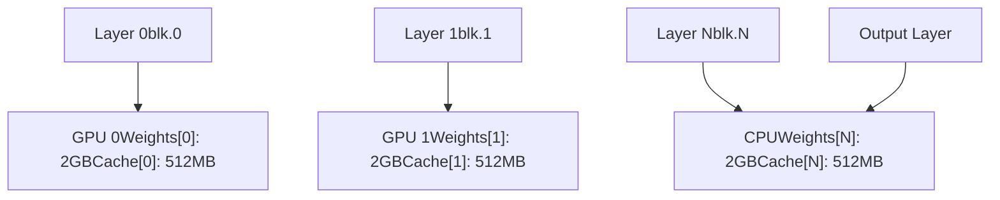
Sources: [llm/server.go540-558](https://github.com/ollama/ollama/blob/562c76d7/llm/server.go#L540-L558) [ml/backend/ggml/ggml.go157-198](https://github.com/ollama/ollama/blob/562c76d7/ml/backend/ggml/ggml.go#L157-L198)

## GPU Layer Assignment

### Assignment Pipeline

The layer assignment process follows this flow:

> **[Mermaid sequence]**
> *(图表结构无法解析)*

Sources: [llm/server.go496-714](https://github.com/ollama/ollama/blob/562c76d7/llm/server.go#L496-L714) [llm/server.go746-899](https://github.com/ollama/ollama/blob/562c76d7/llm/server.go#L746-L899)

### buildLayout Function

The `buildLayout` function creates a memory layout by:

1.  Sorting GPUs by free memory (descending)
2.  Calculating total layer sizes (weights + cache)
3.  Grouping GPUs by library (Metal, CUDA, ROCm, etc.)
4.  Calling `assignLayers` for each library group
5.  Selecting the layout with most offloaded layers

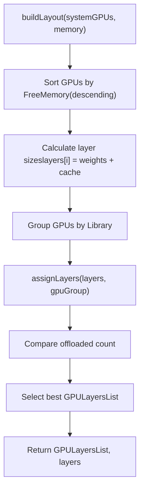
Key logic at [llm/server.go939-998](https://github.com/ollama/ollama/blob/562c76d7/llm/server.go#L939-L998):

-   Reserves free memory accounting for backoff, minimum memory, overhead, and graph size
-   Each GPU gets: `FreeMemory -= (FreeMemory * backoff) + MinimumMemory() + GpuOverhead() + Graph`

Sources: [llm/server.go924-998](https://github.com/ollama/ollama/blob/562c76d7/llm/server.go#L924-L998) [envconfig/config.go272](https://github.com/ollama/ollama/blob/562c76d7/envconfig/config.go#L272-L272)

### assignLayers Algorithm

The `assignLayers` function packs layers onto the minimum number of GPUs:

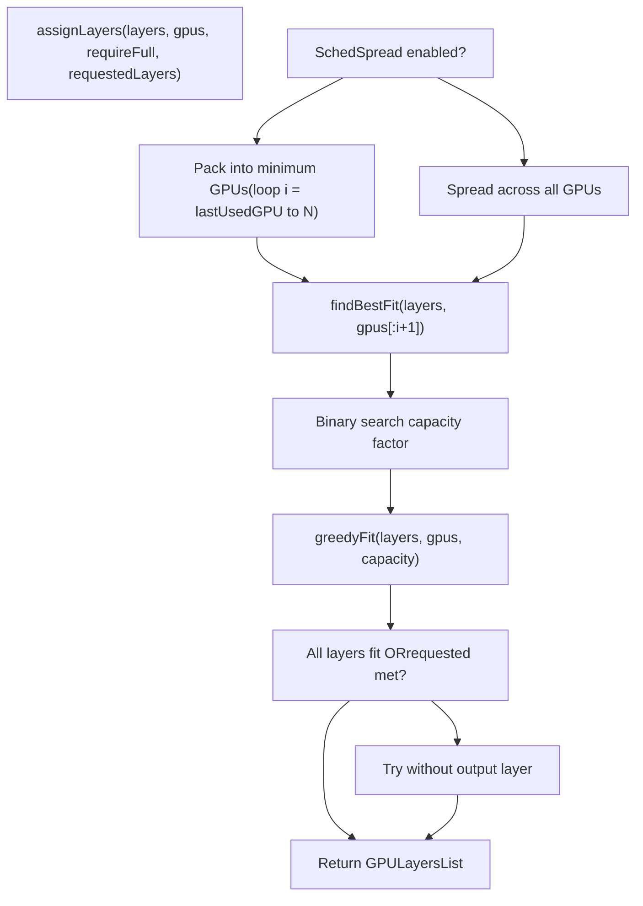
The algorithm has two modes:

-   **Pack mode** (default): Try incrementally more GPUs until layers fit
-   **Spread mode** (`OLLAMA_SCHED_SPREAD=1`): Use all available GPUs

Sources: [llm/server.go1063-1100](https://github.com/ollama/ollama/blob/562c76d7/llm/server.go#L1063-L1100) [envconfig/config.go201](https://github.com/ollama/ollama/blob/562c76d7/envconfig/config.go#L201-L201)

### Binary Search Optimization

The `findBestFit` function uses binary search to find the optimal capacity factor:

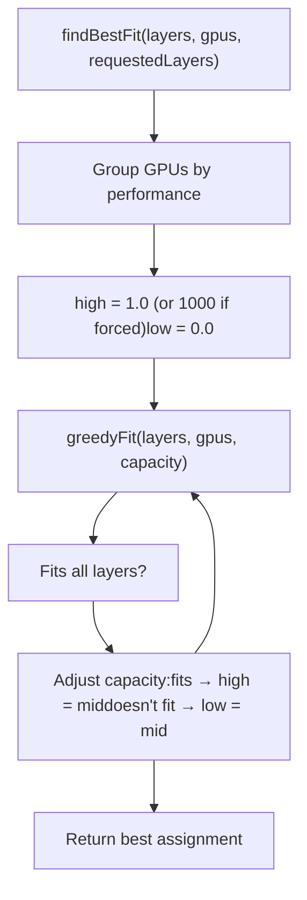
The capacity factor multiplies each GPU's free memory, allowing the algorithm to find the tightest fit that still satisfies requirements.

Sources: [llm/server.go1102-1136](https://github.com/ollama/ollama/blob/562c76d7/llm/server.go#L1102-L1136)

### greedyFit Implementation

The `greedyFit` function assigns layers incrementally to GPUs:

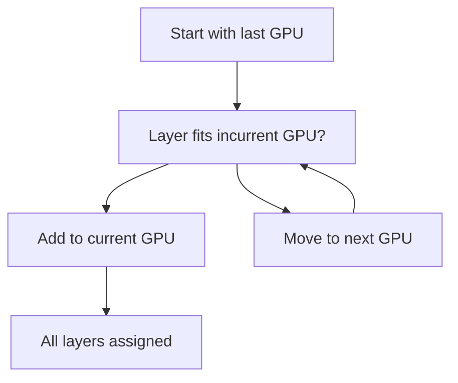
**Algorithm**: [llm/server.go1138-1162](https://github.com/ollama/ollama/blob/562c76d7/llm/server.go#L1138-L1162)

-   Iterates layers from last to first (reverse order)
-   Each GPU has adjusted free space: `freeSpace = FreeMemory * capacity`
-   Layers assigned to highest-index GPU first, spilling to lower-index GPUs as needed
-   Respects `requestedLayers` limit if specified

Sources: [llm/server.go1138-1162](https://github.com/ollama/ollama/blob/562c76d7/llm/server.go#L1138-L1162)

## Memory Estimation and Requirements

### Graph Size Calculation

Compute graph memory is estimated based on context size, batch size, and architecture:

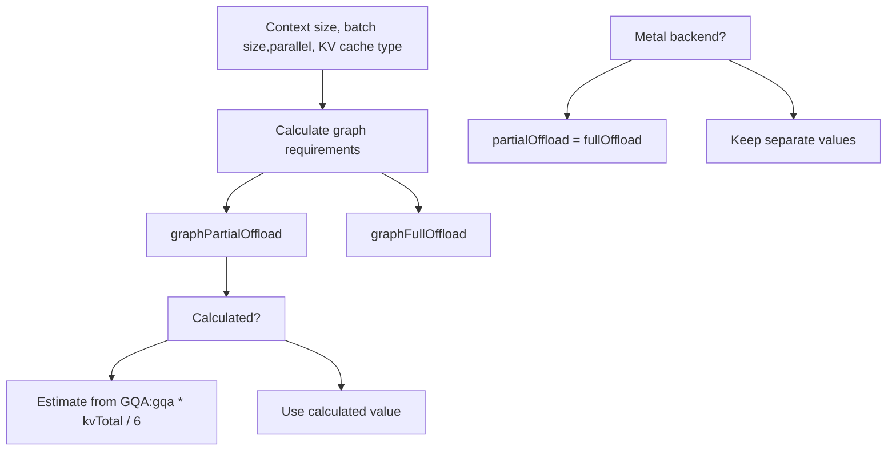
Sources: [llm/server.go522-611](https://github.com/ollama/ollama/blob/562c76d7/llm/server.go#L522-L611)

The graph sizes are added iteratively as more GPUs are included in the layout at [llm/server.go616-637](https://github.com/ollama/ollama/blob/562c76d7/llm/server.go#L616-L637)

### Buffer and Overhead

Several buffer allocations reduce available memory:

| Component | Calculation | Purpose |
| --- | --- | --- |
| Layer buffer | `blk.0 size + kv[0]` | Safety margin per GPU |
| Projector weights | `projectorMemoryRequirements()` | Vision model projector on first discrete GPU |
| GPU overhead | `envconfig.GpuOverhead()` | Reserved VRAM per GPU (user-configurable) |
| Minimum memory | `gpu.MinimumMemory()` | Driver minimum allocation |
| Backoff | `float32(gpu.FreeMemory) * backoff` | Dynamic adjustment factor (0.0-1.0+) |

Sources: [llm/server.go525-538](https://github.com/ollama/ollama/blob/562c76d7/llm/server.go#L525-L538) [llm/server.go562-589](https://github.com/ollama/ollama/blob/562c76d7/llm/server.go#L562-L589) [llm/server.go716-733](https://github.com/ollama/ollama/blob/562c76d7/llm/server.go#L716-L733) [llm/server.go969-980](https://github.com/ollama/ollama/blob/562c76d7/llm/server.go#L969-L980)

### Memory Layout Verification

The `verifyLayout` function ensures the layout meets system constraints:

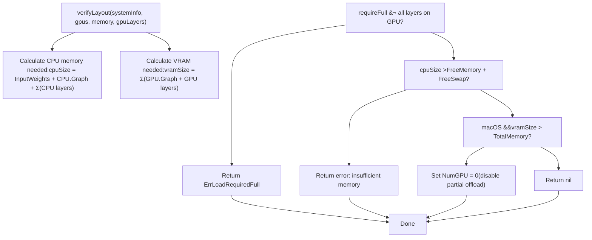
Special handling:

-   **Linux/Windows**: Strict check against available RAM + swap
-   **macOS**: Dynamic swap allows oversubscription, but disables partial offload if VRAM > total system memory

Sources: [llm/server.go1001-1061](https://github.com/ollama/ollama/blob/562c76d7/llm/server.go#L1001-L1061) [llm/server.go1041-1054](https://github.com/ollama/ollama/blob/562c76d7/llm/server.go#L1041-L1054)

## Load Operations

### Operation Types

Ollama uses a three-phase loading approach:

| Operation | Value | Description | Memory Allocation |
| --- | --- | --- | --- |
| `LoadOperationFit` | 0 | Calculate memory requirements | No allocation |
| `LoadOperationAlloc` | 1 | Allocate memory but don't load weights | Allocate only |
| `LoadOperationCommit` | 2 | Load weights into allocated memory | Final load |
| `LoadOperationClose` | 3 | Free all memory | Deallocation |

Sources: [llm/server.go444-468](https://github.com/ollama/ollama/blob/562c76d7/llm/server.go#L444-L468) [runner/ollamarunner/runner.go1-43](https://github.com/ollama/ollama/blob/562c76d7/runner/ollamarunner/runner.go#L1-L43)

### LoadRequest Structure

The `LoadRequest` contains parameters for loading:

```
type LoadRequest struct {    Operation      LoadOperation    LoraPath       []string    Parallel       int    BatchSize      int    FlashAttention ml.FlashAttentionType    KvSize         int    KvCacheType    string    NumThreads     int    GPULayers      ml.GPULayersList    // Assigned by createLayout    MultiUserCache bool        // Legacy fields (llama runner only)    ProjectorPath  string    MainGPU        int    UseMmap        bool}
```
Sources: [llm/server.go470-487](https://github.com/ollama/ollama/blob/562c76d7/llm/server.go#L470-L487)

### Iterative Loading (Ollama Engine)

The new Ollama engine (`ollamaServer`) loads models iteratively to find optimal layout:

> **[Mermaid sequence]**
> *(图表结构无法解析)*

**Key features**:

-   Tracks `pastAllocations` map to detect cycles
-   Applies `backoff` factor if allocation fails repeatedly
-   Explores intermediate layer counts to find optimal fit

Sources: [llm/server.go746-899](https://github.com/ollama/ollama/blob/562c76d7/llm/server.go#L746-L899)

### Legacy Loading (Llama Engine)

The `llamaServer` performs memory estimation upfront:

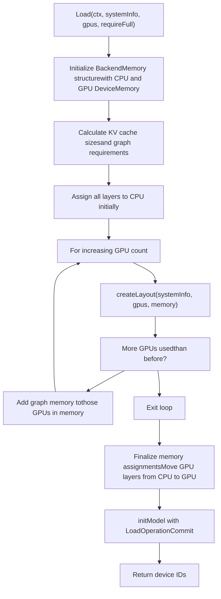
Sources: [llm/server.go496-714](https://github.com/ollama/ollama/blob/562c76d7/llm/server.go#L496-L714)

## Scheduler Memory Management

### Free Space Tracking

The scheduler maintains accurate VRAM tracking by querying loaded runners:

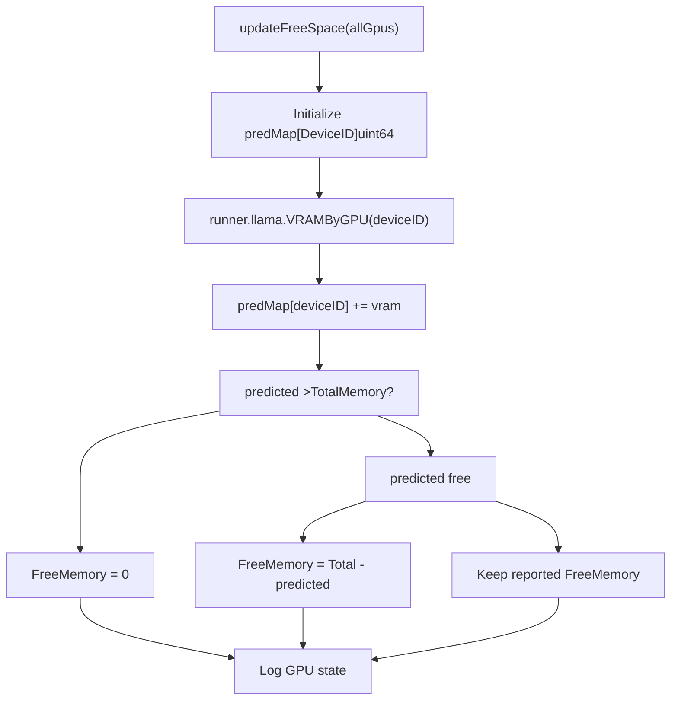
**Key insight**: The scheduler trusts its own predictions when they show less free memory than the GPU reports, avoiding race conditions with GPU memory reporting.

Sources: [server/sched.go647-695](https://github.com/ollama/ollama/blob/562c76d7/server/sched.go#L647-L695)

### Model Loading Decision

When a new model request arrives:

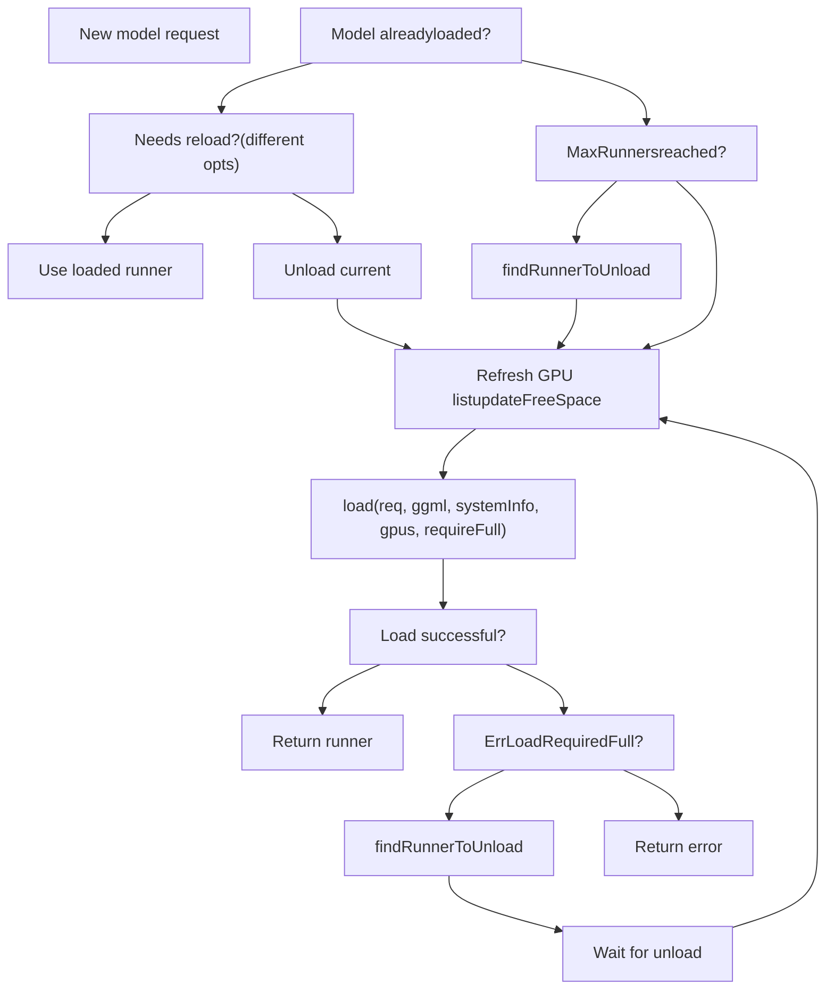
The `requireFull` parameter is `true` when other models are loaded, requiring the new model to fit completely without eviction.

Sources: [server/sched.go155-306](https://github.com/ollama/ollama/blob/562c76d7/server/sched.go#L155-L306)

### Runner Selection for Eviction

The `findRunnerToUnload` function selects a runner to evict:

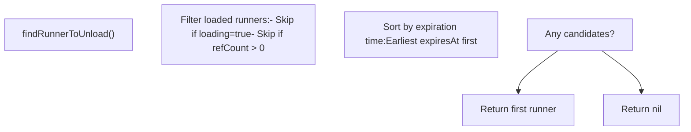
Sources: [server/sched.go697-731](https://github.com/ollama/ollama/blob/562c76d7/server/sched.go#L697-L731)

## Backend Memory Allocation

### GGML Backend Initialization

The GGML backend creates buffer types for each device:

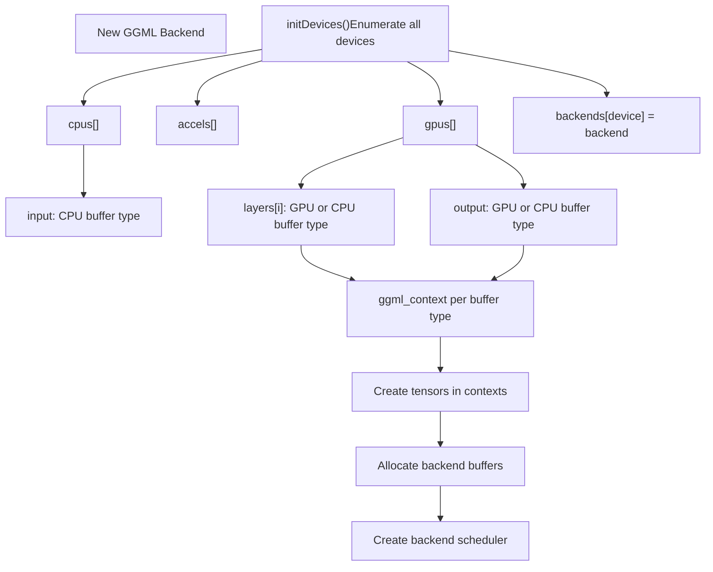
Sources: [ml/backend/ggml/ggml.go47-69](https://github.com/ollama/ollama/blob/562c76d7/ml/backend/ggml/ggml.go#L47-L69) [ml/backend/ggml/ggml.go123-449](https://github.com/ollama/ollama/blob/562c76d7/ml/backend/ggml/ggml.go#L123-L449)

### Tensor Allocation

Tensors are allocated per buffer type with alignment:

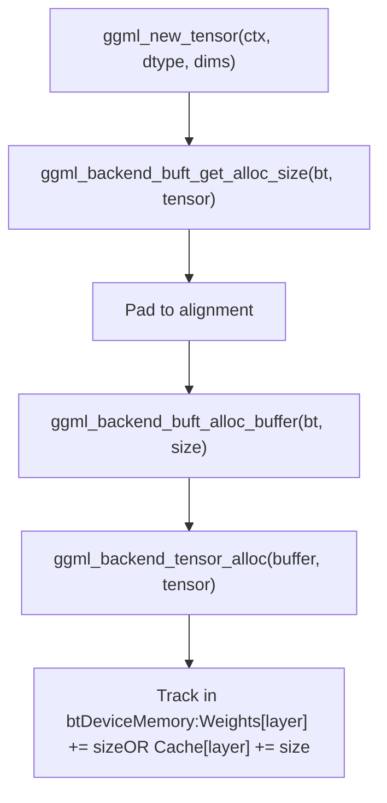
**Buffer usage tracking**: [ml/backend/ggml/ggml.go276-286](https://github.com/ollama/ollama/blob/562c76d7/ml/backend/ggml/ggml.go#L276-L286)

-   `InputWeights` for input layer tensors
-   `Weights[layer]` for model layers
-   `Cache[layer]` for KV cache (allocated by Context.newTensor)

Sources: [ml/backend/ggml/ggml.go244-293](https://github.com/ollama/ollama/blob/562c76d7/ml/backend/ggml/ggml.go#L244-L293) [ml/backend/ggml/ggml.go889-924](https://github.com/ollama/ollama/blob/562c76d7/ml/backend/ggml/ggml.go#L889-L924)

### Scheduler and Graph Execution

The backend scheduler manages compute graph execution:

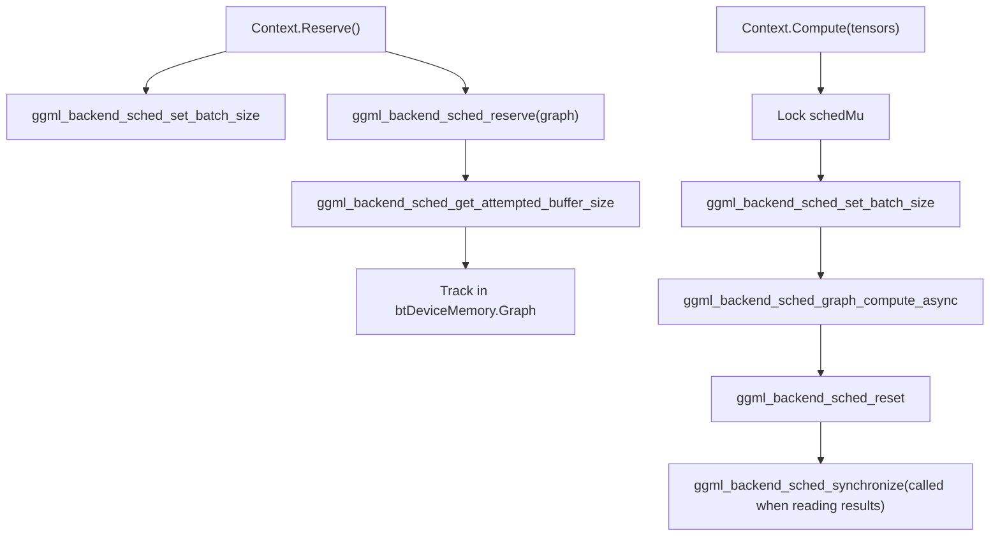
**Graph memory tracking**: The `Reserve` call updates `DeviceMemory.Graph` with the attempted buffer size for each backend at [ml/backend/ggml/ggml.go845-869](https://github.com/ollama/ollama/blob/562c76d7/ml/backend/ggml/ggml.go#L845-L869)

Sources: [ml/backend/ggml/ggml.go810-843](https://github.com/ollama/ollama/blob/562c76d7/ml/backend/ggml/ggml.go#L810-L843) [ml/backend/ggml/ggml.go845-869](https://github.com/ollama/ollama/blob/562c76d7/ml/backend/ggml/ggml.go#L845-L869)

## KV Cache Memory

### Cache Initialization

KV cache memory is allocated separately from model weights:

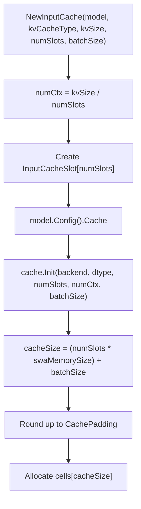
Sources: [runner/ollamarunner/cache.go34-59](https://github.com/ollama/ollama/blob/562c76d7/runner/ollamarunner/cache.go#L34-L59) [kvcache/causal.go130-182](https://github.com/ollama/ollama/blob/562c76d7/kvcache/causal.go#L130-L182)

### Cache Memory Allocation per Layer

When `Context.newTensor` is called during cache operations:

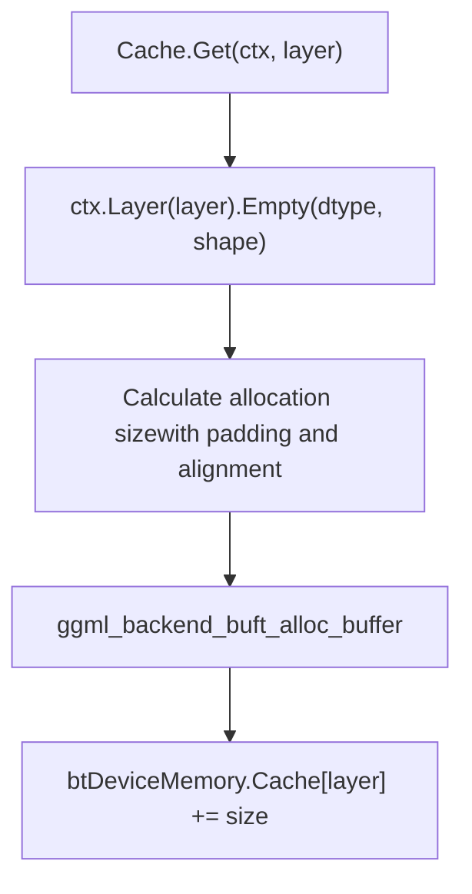
**Cache tensors are allocated on-demand** per layer when first accessed, using the `Context.Layer(i)` context which sets the appropriate buffer type and tracks allocations.

Sources: [ml/backend/ggml/ggml.go889-924](https://github.com/ollama/ollama/blob/562c76d7/ml/backend/ggml/ggml.go#L889-L924) [kvcache/causal.go198-248](https://github.com/ollama/ollama/blob/562c76d7/kvcache/causal.go#L198-L248)

### Memory Layout Optimization

Cache configuration can optimize memory layout:

| Configuration | Effect | Use Case |
| --- | --- | --- |
| `CachePadding` | Rounds history size to multiple | Batch size alignment for kernels |
| `PermutedV` | Pre-permutes V tensor storage | Avoids Contiguous() call in attention |
| `MaskDType` | Data type for attention mask | F16 for flash attention, F32 otherwise |

Sources: [ml/backend.go38-73](https://github.com/ollama/ollama/blob/562c76d7/ml/backend.go#L38-L73) [ml/backend/ggml/ggml.go686-692](https://github.com/ollama/ollama/blob/562c76d7/ml/backend/ggml/ggml.go#L686-L692)

## Configuration and Environment Variables

### Memory-Related Environment Variables

| Variable | Type | Default | Description |
| --- | --- | --- | --- |
| `OLLAMA_GPU_OVERHEAD` | uint64 | 0 | Reserved VRAM per GPU (bytes) |
| `OLLAMA_SCHED_SPREAD` | bool | false | Spread layers across all GPUs |
| `OLLAMA_MAX_LOADED_MODELS` | uint | 0 (auto) | Maximum concurrent loaded models |
| `OLLAMA_FLASH_ATTENTION` | bool | auto | Enable flash attention (affects KV cache) |
| `OLLAMA_KV_CACHE_TYPE` | string | f16 | KV cache quantization (f16, q8\_0, q4\_0) |
| `OLLAMA_MULTIUSER_CACHE` | bool | false | Optimize cache eviction for multi-user |

Sources: [envconfig/config.go191-214](https://github.com/ollama/ollama/blob/562c76d7/envconfig/config.go#L191-L214) [envconfig/config.go248-273](https://github.com/ollama/ollama/blob/562c76d7/envconfig/config.go#L248-L273)

### Flash Attention and KV Cache Quantization

Flash attention affects both performance and memory:

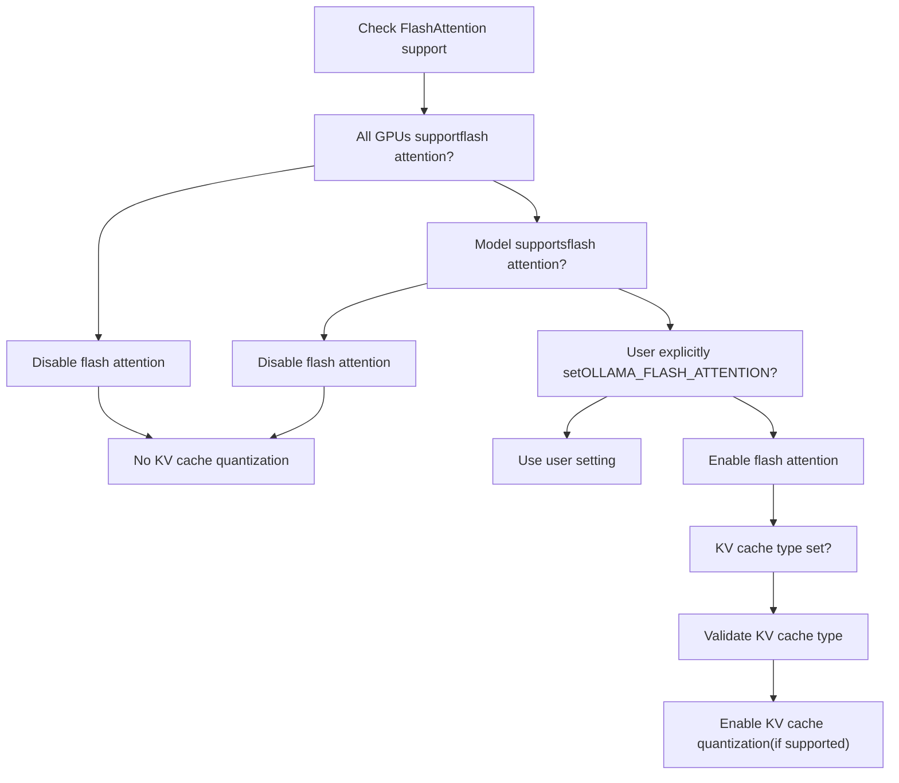
**Quantized KV cache requires flash attention**: The q8\_0 and q4\_0 KV cache types are only available when flash attention is enabled.

Sources: [llm/server.go192-259](https://github.com/ollama/ollama/blob/562c76d7/llm/server.go#L192-L259)

---

**Summary**: Ollama's memory management system tracks allocations at layer granularity, assigns layers to devices using sophisticated packing algorithms, and loads models iteratively to find optimal layouts. The scheduler maintains accurate VRAM tracking across loaded models, while the backend handles actual memory allocation through device-specific buffer types. KV cache memory is allocated separately with support for quantization and layout optimizations.
