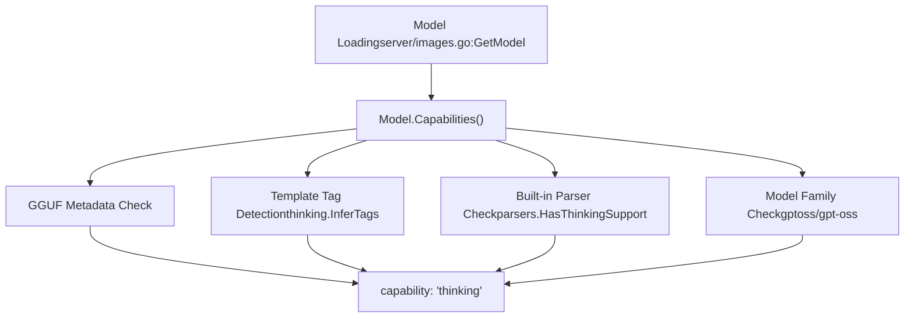
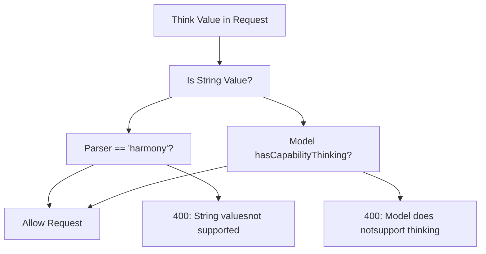
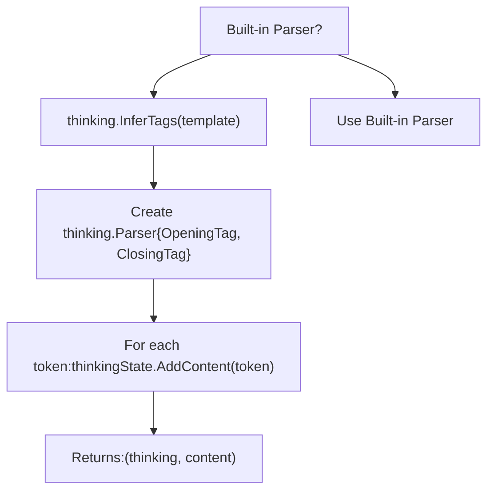
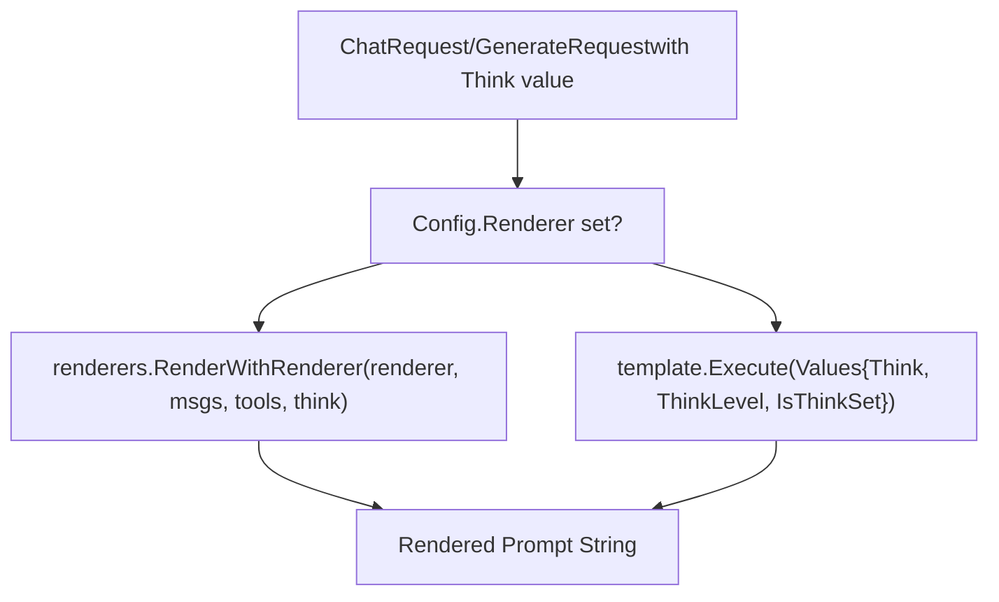
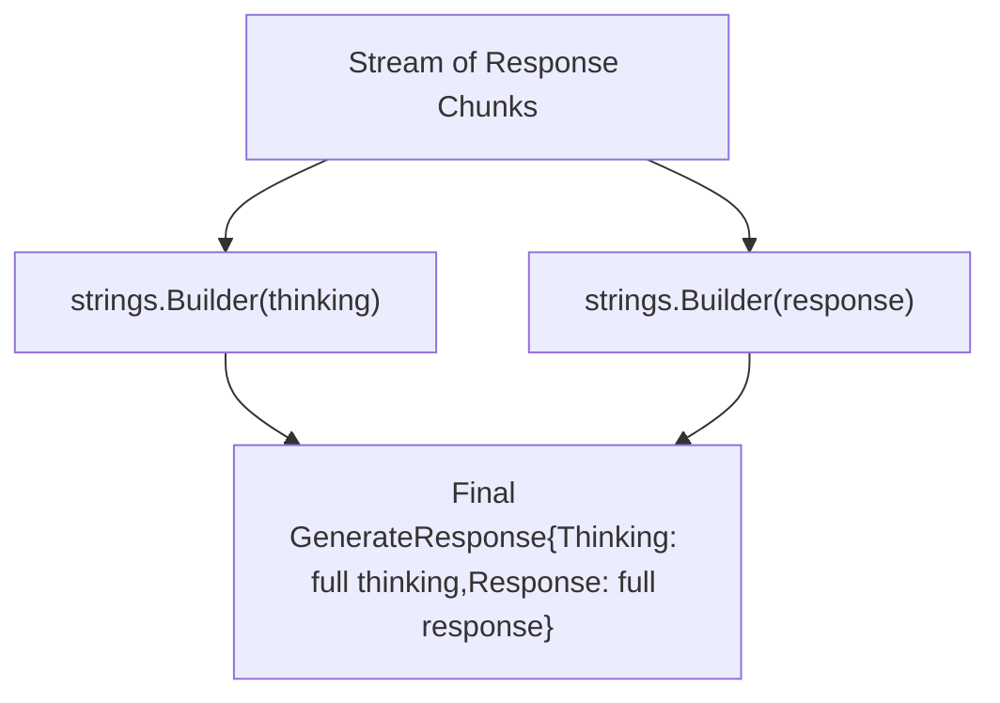
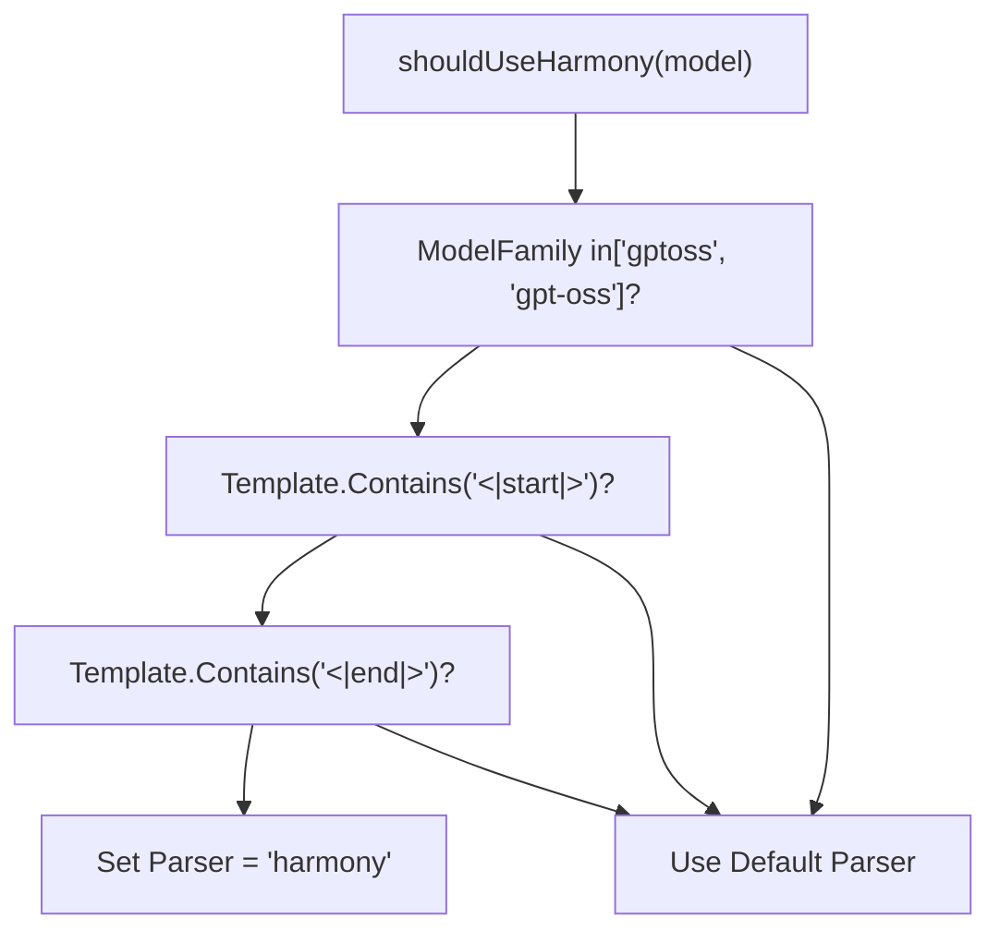
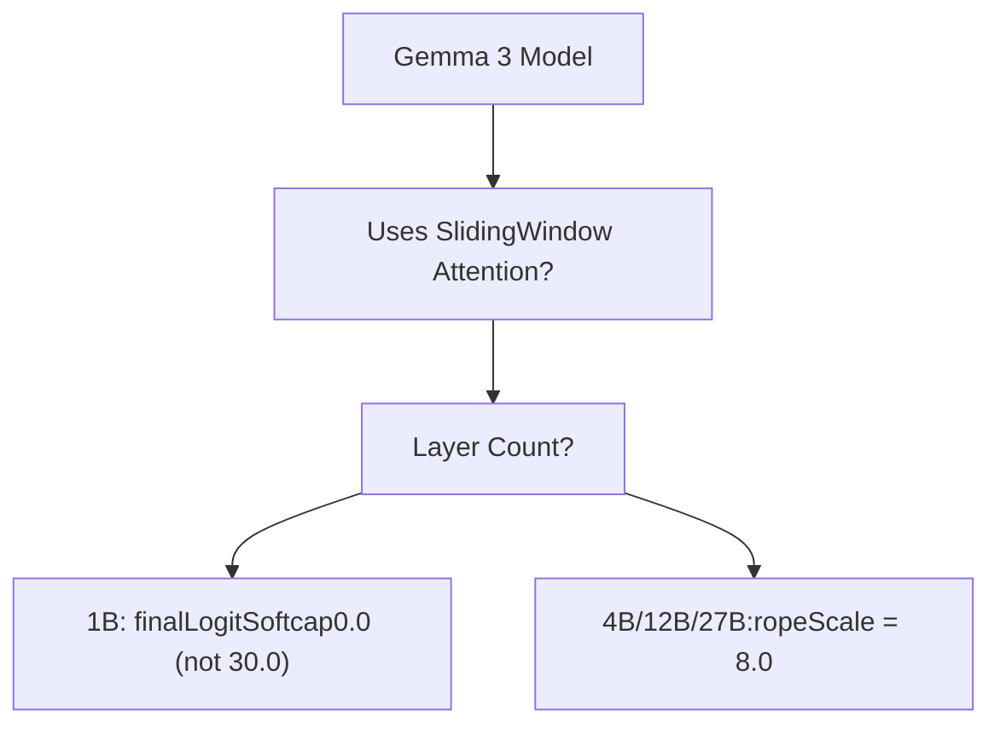
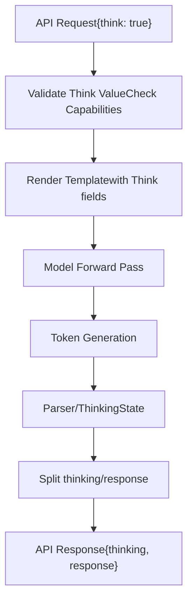

# Thinking Models and Reasoning

Relevant source files

-   [api/client.go](https://github.com/ollama/ollama/blob/562c76d7/api/client.go)
-   [api/client\_test.go](https://github.com/ollama/ollama/blob/562c76d7/api/client_test.go)
-   [api/types.go](https://github.com/ollama/ollama/blob/562c76d7/api/types.go)
-   [api/types\_test.go](https://github.com/ollama/ollama/blob/562c76d7/api/types_test.go)
-   [api/types\_typescript\_test.go](https://github.com/ollama/ollama/blob/562c76d7/api/types_typescript_test.go)
-   [cmd/cmd.go](https://github.com/ollama/ollama/blob/562c76d7/cmd/cmd.go)
-   [middleware/openai.go](https://github.com/ollama/ollama/blob/562c76d7/middleware/openai.go)
-   [middleware/openai\_test.go](https://github.com/ollama/ollama/blob/562c76d7/middleware/openai_test.go)
-   [openai/openai.go](https://github.com/ollama/ollama/blob/562c76d7/openai/openai.go)
-   [openai/openai\_test.go](https://github.com/ollama/ollama/blob/562c76d7/openai/openai_test.go)
-   [openai/responses.go](https://github.com/ollama/ollama/blob/562c76d7/openai/responses.go)
-   [openai/responses\_test.go](https://github.com/ollama/ollama/blob/562c76d7/openai/responses_test.go)
-   [server/images.go](https://github.com/ollama/ollama/blob/562c76d7/server/images.go)
-   [server/routes.go](https://github.com/ollama/ollama/blob/562c76d7/server/routes.go)
-   [server/routes\_generate\_test.go](https://github.com/ollama/ollama/blob/562c76d7/server/routes_generate_test.go)
-   [tools/tools.go](https://github.com/ollama/ollama/blob/562c76d7/tools/tools.go)
-   [tools/tools\_test.go](https://github.com/ollama/ollama/blob/562c76d7/tools/tools_test.go)

This page documents Ollama's support for thinking and reasoning models - models that can generate internal reasoning traces before producing their final answers. This includes models like DeepSeek-R1, Qwen-QwQ, and others that support explicit thinking/reasoning output.

For general model inference concepts, see [Model Execution Pipeline](/ollama/ollama/2.3-model-execution-pipeline). For prompt formatting and templates, see [Template System](/ollama/ollama/7.1-template-system).

## Overview

Thinking models generate two types of output:

1.  **Thinking content** - The model's internal reasoning process
2.  **Response content** - The final answer to the user

Ollama provides infrastructure to:

-   Detect which models support thinking capabilities
-   Configure thinking behavior (enable/disable, intensity levels)
-   Extract thinking tags from model output
-   Separate thinking from response content in API responses

**Think Value Types**

The `Think` parameter can be:

-   `true` / `false` - Boolean to enable/disable thinking
-   `"high"` / `"medium"` / `"low"` - String values for supported models (e.g., GPT-OSS/Harmony models)
-   `nil` - Unset, uses default model behavior

Sources: [api/types.go104-109](https://github.com/ollama/ollama/blob/562c76d7/api/types.go#L104-L109) [api/types.go170-173](https://github.com/ollama/ollama/blob/562c76d7/api/types.go#L170-L173)

## Capability Detection

### Model Capability Advertisement

Models advertise thinking support through the `model.CapabilityThinking` capability:


**Detection Methods:**

1.  **Template Tag Inference** - Extract opening/closing tags from template
2.  **Parser Support** - Check if model's parser (`harmony`, etc.) supports thinking
3.  **Model Family** - Models in `gptoss`/`gpt-oss` families
4.  **Explicit Config** - Capability set in model configuration

Sources: [server/images.go132-138](https://github.com/ollama/ollama/blob/562c76d7/server/images.go#L132-L138) [thinking package](https://github.com/ollama/ollama/blob/562c76d7/thinking package)

### Capability Checking

> **[Mermaid sequence]**
> *(图表结构无法解析)*

Sources: [server/routes.go385-395](https://github.com/ollama/ollama/blob/562c76d7/server/routes.go#L385-L395) [server/images.go177-181](https://github.com/ollama/ollama/blob/562c76d7/server/images.go#L177-L181)

## Request Configuration

### API Request Fields

| Field | Type | Available In | Description |
| --- | --- | --- | --- |
| `think` | `*ThinkValue` | `GenerateRequest`, `ChatRequest` | Controls thinking behavior |
| `thinking` | `string` | `Message`, `GenerateResponse`, `ChatResponse` | Contains extracted thinking content |

**ThinkValue Structure:**

```
type ThinkValue struct {
    Value interface{} // bool or string
}

Methods:
- Bool() bool           // Returns boolean value
- String() string       // Returns string value ("high", "medium", "low")
- IsString() bool       // Checks if value is string type
```
Sources: [api/types.go640-690](https://github.com/ollama/ollama/blob/562c76d7/api/types.go#L640-L690)

### CLI Usage

```
# Enable thinking (boolean)ollama run model --think # Disable thinking explicitly  ollama run model --think=false # Set thinking level (string - for supported models)ollama run model --think=highollama run model --think=mediumollama run model --think=low
```
Sources: [cmd/cmd.go516-537](https://github.com/ollama/ollama/blob/562c76d7/cmd/cmd.go#L516-L537)

### Validation Rules


Sources: [server/routes.go374-395](https://github.com/ollama/ollama/blob/562c76d7/server/routes.go#L374-L395)

## Thinking Tag Parsing

### Tag Inference

Ollama automatically infers thinking tags from model templates:

**Tag Detection Algorithm:**

1.  Parse template for common thinking tag patterns
2.  Look for paired opening/closing tags
3.  Return empty strings if no tags found

Sources: [server/routes.go523-532](https://github.com/ollama/ollama/blob/562c76d7/server/routes.go#L523-L532) [thinking package](https://github.com/ollama/ollama/blob/562c76d7/thinking package)

### Parser-Based Extraction

For models with built-in parsers (like Harmony):

> **[Mermaid sequence]**
> *(图表结构无法解析)*

Sources: [server/routes.go564-607](https://github.com/ollama/ollama/blob/562c76d7/server/routes.go#L564-L607) [model/parsers package](https://github.com/ollama/ollama/blob/562c76d7/model/parsers package)

### Fallback Extraction

For models without built-in parsers:


**Thinking Parser State Machine:**

-   Tracks position relative to thinking tags
-   Separates content inside tags (thinking) from outside (response)
-   Handles partial tag matching across token boundaries

Sources: [server/routes.go521-579](https://github.com/ollama/ollama/blob/562c76d7/server/routes.go#L521-L579)

## Template Integration

### Template Values

Templates receive thinking-related fields:

```
type Values struct {    Messages    []api.Message    Tools       []api.Tool    Think       bool     // Whether thinking is enabled    ThinkLevel  string   // "high", "medium", "low", or ""    IsThinkSet  bool     // Whether think was explicitly set    // ... other fields}
```
**Template Usage Example:**

```
{{- if .Think }}<|im_start|>think{{- end }}{{- range .Messages }}{{ .Role }}: {{ .Content }}{{- end }}{{- if .Think }}<|im_end|>{{- end }}
```
Sources: [template/template.go462-468](https://github.com/ollama/ollama/blob/562c76d7/template/template.go#L462-L468) [server/routes.go463-468](https://github.com/ollama/ollama/blob/562c76d7/server/routes.go#L463-L468)

### Prompt Rendering Flow


Sources: [server/prompt.go111-131](https://github.com/ollama/ollama/blob/562c76d7/server/prompt.go#L111-L131)

## Response Handling

### Streaming Responses

> **[Mermaid sequence]**
> *(图表结构无法解析)*

**Streaming Behavior:**

-   Each chunk contains both `Response` and `Thinking` fields
-   Only chunks with meaningful content are sent
-   Thinking is included incrementally as parsed

Sources: [server/routes.go600-609](https://github.com/ollama/ollama/blob/562c76d7/server/routes.go#L600-L609)

### Non-Streaming Responses


**Accumulation Logic:**

-   Separate builders for thinking and response content
-   Concatenate all chunks at the end
-   Return single response with complete thinking/response

Sources: [server/routes.go620-660](https://github.com/ollama/ollama/blob/562c76d7/server/routes.go#L620-L660)

## Built-in Parser: Harmony

### Harmony Model Detection

Harmony models are detected using heuristics:


Sources: [server/routes.go67-77](https://github.com/ollama/ollama/blob/562c76d7/server/routes.go#L67-L77) [server/routes.go361-363](https://github.com/ollama/ollama/blob/562c76d7/server/routes.go#L361-L363)

### Harmony Parser Features

The Harmony parser (`parsers.ParserForName("harmony")`) provides:

-   **Thinking extraction** - Parses \`\` tags
-   **Tool call parsing** - Extracts function calls from output
-   **Multi-modal support** - Handles images and other modalities
-   **State management** - Maintains parse state across chunks

**Initialization:**

```
builtinParser.Init(    tools,      // Available tools ([]api.Tool)    lastMsg,    // Last message in conversation    think,      // Think configuration (*api.ThinkValue))
```
Sources: [server/routes.go365-371](https://github.com/ollama/ollama/blob/562c76d7/server/routes.go#L365-L371)

## Model-Specific Behavior

### Gemma 3 Family

Gemma 3 models use thinking capabilities but may require special handling:


Sources: [model/models/gemma3/model\_text.go96-110](https://github.com/ollama/ollama/blob/562c76d7/model/models/gemma3/model_text.go#L96-L110)

### DeepSeek-R1 / Qwen3

Special error handling for models that should support thinking:

```
if slices.Contains(errs, errCapabilityThinking) {    if m.Config.ModelFamily == "qwen3" ||        model.ParseName(m.Name).Model == "deepseek-r1" {        return fmt.Errorf("%w. Pull the model again to get " +            "the latest version with full thinking support", err)    }}
```
Sources: [server/images.go177-182](https://github.com/ollama/ollama/blob/562c76d7/server/images.go#L177-L182)

## Data Flow Summary


Sources: [server/routes.go183-663](https://github.com/ollama/ollama/blob/562c76d7/server/routes.go#L183-L663)

## Configuration Summary

| Component | Configuration | Default |
| --- | --- | --- |
| **Request** | `think` field | `nil` (unset) |
| **Model** | `CapabilityThinking` | Auto-detected |
| **Template** | `Think`, `ThinkLevel`, `IsThinkSet` | From request |
| **Parser** | `parser` config field | Auto-selected |
| **Tags** | Inferred from template | Model-specific |

Sources: [api/types.go](https://github.com/ollama/ollama/blob/562c76d7/api/types.go) [server/routes.go](https://github.com/ollama/ollama/blob/562c76d7/server/routes.go) [template/template.go](https://github.com/ollama/ollama/blob/562c76d7/template/template.go)
