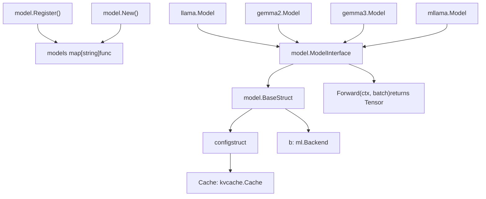
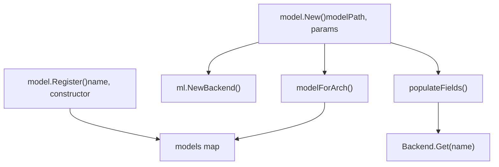
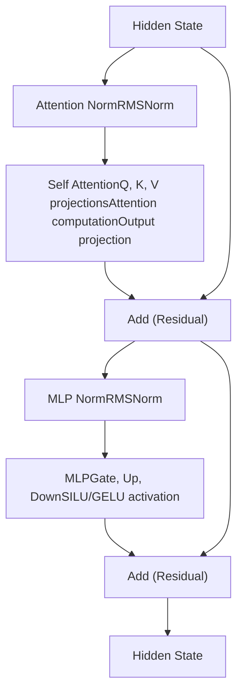
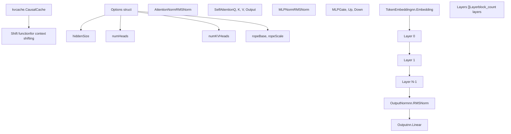
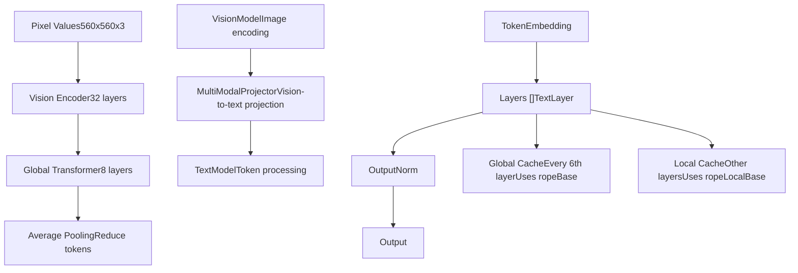
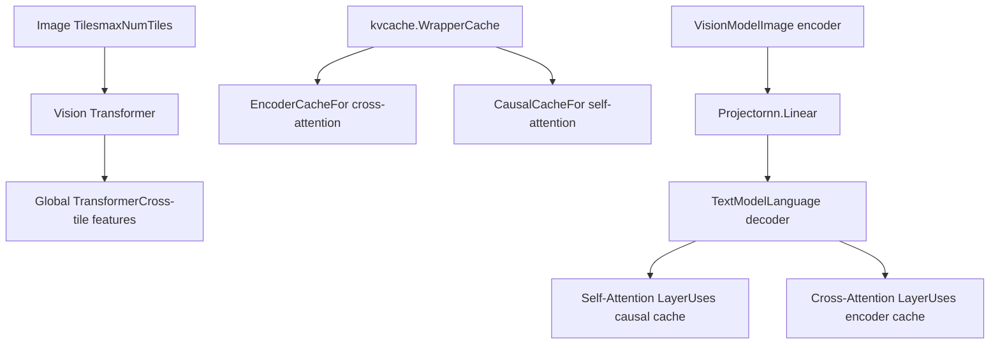
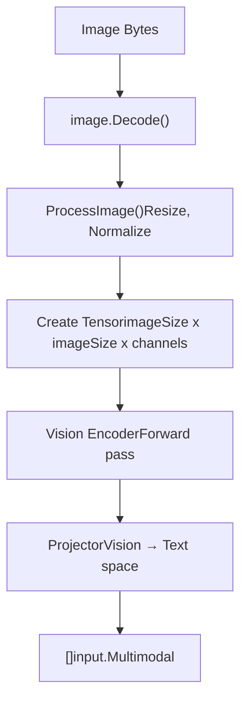
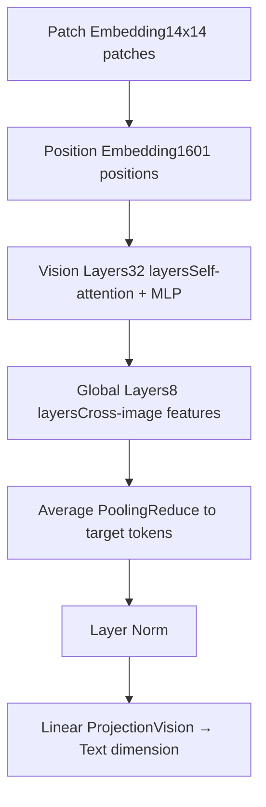
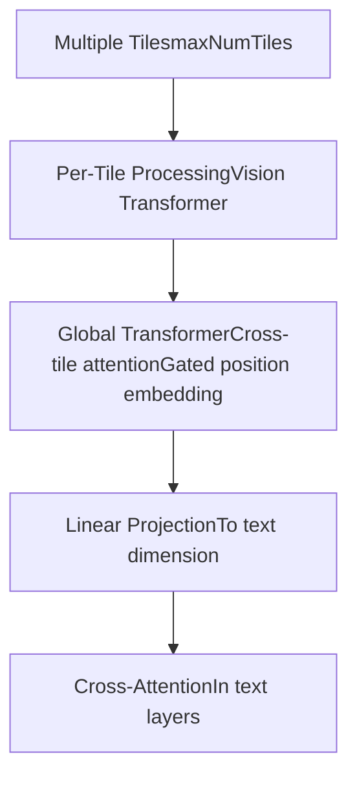
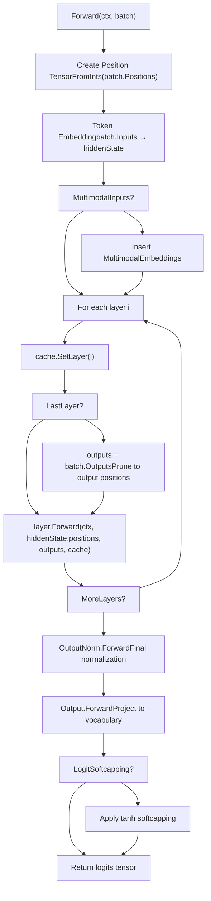

# Model Architectures

Relevant source files

-   [convert/convert\_gemma3.go](https://github.com/ollama/ollama/blob/562c76d7/convert/convert_gemma3.go)
-   [convert/convert\_mllama.go](https://github.com/ollama/ollama/blob/562c76d7/convert/convert_mllama.go)
-   [fs/config.go](https://github.com/ollama/ollama/blob/562c76d7/fs/config.go)
-   [integration/embed\_test.go](https://github.com/ollama/ollama/blob/562c76d7/integration/embed_test.go)
-   [kvcache/cache.go](https://github.com/ollama/ollama/blob/562c76d7/kvcache/cache.go)
-   [kvcache/causal.go](https://github.com/ollama/ollama/blob/562c76d7/kvcache/causal.go)
-   [kvcache/causal\_test.go](https://github.com/ollama/ollama/blob/562c76d7/kvcache/causal_test.go)
-   [kvcache/encoder.go](https://github.com/ollama/ollama/blob/562c76d7/kvcache/encoder.go)
-   [kvcache/wrapper.go](https://github.com/ollama/ollama/blob/562c76d7/kvcache/wrapper.go)
-   [llama/llama.cpp/src/llama-batch.cpp](https://github.com/ollama/ollama/blob/562c76d7/llama/llama.cpp/src/llama-batch.cpp)
-   [ml/backend.go](https://github.com/ollama/ollama/blob/562c76d7/ml/backend.go)
-   [ml/backend/ggml/ggml.go](https://github.com/ollama/ollama/blob/562c76d7/ml/backend/ggml/ggml.go)
-   [model/input/input.go](https://github.com/ollama/ollama/blob/562c76d7/model/input/input.go)
-   [model/model.go](https://github.com/ollama/ollama/blob/562c76d7/model/model.go)
-   [model/model\_test.go](https://github.com/ollama/ollama/blob/562c76d7/model/model_test.go)
-   [model/models/gemma2/model.go](https://github.com/ollama/ollama/blob/562c76d7/model/models/gemma2/model.go)
-   [model/models/gemma3/model.go](https://github.com/ollama/ollama/blob/562c76d7/model/models/gemma3/model.go)
-   [model/models/gemma3/model\_text.go](https://github.com/ollama/ollama/blob/562c76d7/model/models/gemma3/model_text.go)
-   [model/models/gemma3/model\_vision.go](https://github.com/ollama/ollama/blob/562c76d7/model/models/gemma3/model_vision.go)
-   [model/models/gemma3/process\_image.go](https://github.com/ollama/ollama/blob/562c76d7/model/models/gemma3/process_image.go)
-   [model/models/llama/model.go](https://github.com/ollama/ollama/blob/562c76d7/model/models/llama/model.go)
-   [model/models/llama4/process\_image.go](https://github.com/ollama/ollama/blob/562c76d7/model/models/llama4/process_image.go)
-   [model/models/llama4/process\_image\_test.go](https://github.com/ollama/ollama/blob/562c76d7/model/models/llama4/process_image_test.go)
-   [model/models/mllama/model.go](https://github.com/ollama/ollama/blob/562c76d7/model/models/mllama/model.go)
-   [model/models/mllama/model\_text.go](https://github.com/ollama/ollama/blob/562c76d7/model/models/mllama/model_text.go)
-   [model/models/mllama/model\_vision.go](https://github.com/ollama/ollama/blob/562c76d7/model/models/mllama/model_vision.go)
-   [model/models/mllama/process\_image.go](https://github.com/ollama/ollama/blob/562c76d7/model/models/mllama/process_image.go)
-   [runner/llamarunner/cache.go](https://github.com/ollama/ollama/blob/562c76d7/runner/llamarunner/cache.go)
-   [runner/llamarunner/runner.go](https://github.com/ollama/ollama/blob/562c76d7/runner/llamarunner/runner.go)
-   [runner/ollamarunner/cache.go](https://github.com/ollama/ollama/blob/562c76d7/runner/ollamarunner/cache.go)
-   [runner/ollamarunner/cache\_test.go](https://github.com/ollama/ollama/blob/562c76d7/runner/ollamarunner/cache_test.go)
-   [runner/ollamarunner/runner.go](https://github.com/ollama/ollama/blob/562c76d7/runner/ollamarunner/runner.go)
-   [server/internal/internal/backoff/backoff.go](https://github.com/ollama/ollama/blob/562c76d7/server/internal/internal/backoff/backoff.go)

This page documents the model architectures implemented in Ollama, including Llama, Gemma, and their multimodal variants. It covers the common model interface, architecture-specific components, attention mechanisms, and multimodal processing capabilities. For information about the backend execution of these models, see [GGML Backend and ML Context](/ollama/ollama/5.1-ggml-backend-and-ml-context). For cache management during inference, see [KV Cache System](/ollama/ollama/5.3-kv-cache-system).

## Model Interface and Framework

Ollama defines a common interface that all model architectures must implement. The `Model` interface requires a `Forward` method for inference and provides access to the backend and configuration.


**Model Interface Definition**

The core `Model` interface defines the contract all architectures must fulfill:

| Method | Purpose |
| --- | --- |
| `Forward(ml.Context, input.Batch)` | Execute model inference on a batch of inputs |
| `Backend()` | Return the underlying execution backend |
| `Config()` | Return model configuration including cache |

Sources: [model/model.go36-41](https://github.com/ollama/ollama/blob/562c76d7/model/model.go#L36-L41)

**Base Model Structure**

All models embed the `Base` struct which provides common infrastructure:

```
type Base struct {    b ml.Backend    // Execution backend (GGML, MLX, etc.)    config          // Cache and other configuration}
```
The `config` struct contains the KV cache implementation specific to each architecture's attention pattern.

Sources: [model/model.go82-99](https://github.com/ollama/ollama/blob/562c76d7/model/model.go#L82-L99)

**Model Registration and Initialization**

Models register themselves using `model.Register()` with a constructor function. During initialization, `model.New()` performs automatic field population using reflection and GGUF tags:


The `populateFields` function walks the model struct and automatically loads tensors from the GGUF file based on field tags like `gguf:"token_embd"` or `gguf:"blk"` for layer arrays.

Sources: [model/model.go101-173](https://github.com/ollama/ollama/blob/562c76d7/model/model.go#L101-L173) [model/model.go175-279](https://github.com/ollama/ollama/blob/562c76d7/model/model.go#L175-L279)

## Common Model Components

### Token Embeddings

All text models begin with a token embedding layer that converts token IDs to dense vectors:

```
TokenEmbedding *nn.Embedding `gguf:"token_embd"`
```
This is typically the first operation in the `Forward` method:

```
hiddenState := m.TokenEmbedding.Forward(ctx, batch.Inputs)
```
Sources: [model/models/llama/model.go31](https://github.com/ollama/ollama/blob/562c76d7/model/models/llama/model.go#L31-L31) [model/models/gemma3/model\_text.go48](https://github.com/ollama/ollama/blob/562c76d7/model/models/gemma3/model_text.go#L48-L48)

### Layer Structure

Models organize their computation into repeating layers, each containing attention and feed-forward components:


Each layer maintains this pattern with variations in normalization placement and activation functions across architectures.

Sources: [model/models/llama/model.go155-181](https://github.com/ollama/ollama/blob/562c76d7/model/models/llama/model.go#L155-L181) [model/models/gemma3/model\_text.go191-221](https://github.com/ollama/ollama/blob/562c76d7/model/models/gemma3/model_text.go#L191-L221)

### Attention Mechanisms

#### Standard Self-Attention

The self-attention mechanism projects the hidden state to queries, keys, and values, applies rotary position embeddings (RoPE), and computes attention:

```
type SelfAttention struct {    Query  *nn.Linear `gguf:"attn_q"`    Key    *nn.Linear `gguf:"attn_k"`    Value  *nn.Linear `gguf:"attn_v"`    Output *nn.Linear `gguf:"attn_output"`}
```
The forward pass follows this pattern:

1.  Project hidden state to Q, K, V with shape `[headDim, numHeads/numKVHeads, batch]`
2.  Apply RoPE to Q and K
3.  Compute attention using KV cache
4.  Project output back to hidden dimension

Sources: [model/models/llama/model.go111-138](https://github.com/ollama/ollama/blob/562c76d7/model/models/llama/model.go#L111-L138) [model/models/gemma2/model.go83-115](https://github.com/ollama/ollama/blob/562c76d7/model/models/gemma2/model.go#L83-L115)

#### Grouped-Query Attention

Models use grouped-query attention (GQA) where `numKVHeads < numHeads`, allowing multiple query heads to share the same key and value heads:

```
query = query.Reshape(ctx, headDim, opts.numHeads, batchSize)key = key.Reshape(ctx, headDim, opts.numKVHeads, batchSize)value = value.Reshape(ctx, headDim, opts.numKVHeads, batchSize)
```
This reduces the KV cache size while maintaining model quality.

Sources: [model/models/llama/model.go123-130](https://github.com/ollama/ollama/blob/562c76d7/model/models/llama/model.go#L123-L130)

### Feed-Forward Networks (MLP)

The MLP layer uses a gated activation pattern:

```
type MLP struct {    Up   *nn.Linear `gguf:"ffn_up"`    Down *nn.Linear `gguf:"ffn_down"`    Gate *nn.Linear `gguf:"ffn_gate"`} func (mlp *MLP) Forward(ctx ml.Context, hiddenState ml.Tensor) ml.Tensor {    hiddenState = mlp.Gate.Forward(ctx, hiddenState).SILU(ctx, mlp.Up.Forward(ctx, hiddenState))    return mlp.Down.Forward(ctx, hiddenState)}
```
The gate controls information flow through the up projection, using either SILU (Llama) or GELU (Gemma) activation.

Sources: [model/models/llama/model.go144-153](https://github.com/ollama/ollama/blob/562c76d7/model/models/llama/model.go#L144-L153) [model/models/gemma3/model\_text.go180-189](https://github.com/ollama/ollama/blob/562c76d7/model/models/gemma3/model_text.go#L180-L189)

### Rotary Position Embeddings (RoPE)

All architectures use RoPE to inject positional information into the attention mechanism:

```
func (o Options) applyRotaryPositionEmbeddings(ctx ml.Context, states, positions, factors ml.Tensor) ml.Tensor {    return nn.RoPE(ctx, states, positions, ropeDim, ropeBase, 1./ropeScale, rope.WithFactors(factors))}
```
Different architectures vary the RoPE parameters (`ropeBase`, `ropeScale`) to support different context lengths and scaling strategies.

Sources: [model/models/llama/model.go23-25](https://github.com/ollama/ollama/blob/562c76d7/model/models/llama/model.go#L23-L25) [model/models/gemma2/model.go25-27](https://github.com/ollama/ollama/blob/562c76d7/model/models/gemma2/model.go#L25-L27)

## Implemented Architectures

### Llama Architecture


**Llama Configuration**

| Parameter | Description | Typical Values |
| --- | --- | --- |
| `hiddenSize` | Embedding dimension | 4096, 8192 |
| `numHeads` | Number of attention heads | 32, 64 |
| `numKVHeads` | Number of KV heads (GQA) | 8, 16 |
| `headDim` | Dimension per head | 128 |
| `ropeBase` | RoPE frequency base | 10000, 100000 |
| `ropeScale` | RoPE scaling factor | 1.0 |

The Llama architecture uses standard causal attention with support for context window shifting through RoPE factor adjustment.

Sources: [model/models/llama/model.go27-108](https://github.com/ollama/ollama/blob/562c76d7/model/models/llama/model.go#L27-L108)

### Gemma2 Architecture

Gemma2 introduces sliding window attention (SWA) and attention logit softcapping:

```
type Options struct {    hiddenSize, numHeads, numKVHeads int    attnKeyLen, attnValLen           int    attnLogitSoftcap                 float32  // Caps attention scores    finalLogitSoftcap                float32  // Caps final logits    largeModelScaling                bool     // Different scaling for large models}
```
**Sliding Window Attention**

Gemma2 uses a wrapper cache that alternates between sliding window and causal attention:

```
slidingWindowLen := int32(c.Uint("attention.sliding_window"))m.Cache = kvcache.NewWrapperCache(    kvcache.NewSWACache(slidingWindowLen, m.Shift),    kvcache.NewCausalCache(m.Shift),)
```
This reduces memory usage while maintaining long-range dependencies through the periodic causal layers.

**Logit Softcapping**

Gemma2 applies softcapping to prevent extreme logit values:

```
if opts.attnLogitSoftcap > 0.0 {    kq = kq.Scale(ctx, 1.0/float64(opts.attnLogitSoftcap))    kq = kq.Tanh(ctx)    kq = kq.Scale(ctx, float64(opts.attnLogitSoftcap))}
```
Sources: [model/models/gemma2/model.go16-80](https://github.com/ollama/ollama/blob/562c76d7/model/models/gemma2/model.go#L16-L80) [model/models/gemma2/model.go116-124](https://github.com/ollama/ollama/blob/562c76d7/model/models/gemma2/model.go#L116-L124)

### Gemma3 Architecture

Gemma3 extends Gemma2 with multimodal capabilities and more sophisticated attention patterns:


**Alternating Cache Pattern**

Gemma3 alternates between local (sliding window) and global (causal) attention every 6 layers:

```
func (opts *TextConfig) ropeValuesForLayer(layer int) (base float32, scale float32) {    if (layer+1)%gemmaGlobalCacheCount > 0 {        return opts.ropeLocalBase, 1.0  // Local attention    }    return opts.ropeBase, opts.ropeScale  // Global attention}
```
The cache switches type automatically:

```
if (i+1)%gemmaGlobalCacheCount == 0 {    cacheType = cacheTypeCausal} else {    cacheType = cacheTypeSWA}cache.SetLayer(i)wc.SetLayerType(cacheType)
```
Sources: [model/models/gemma3/model\_text.go128-142](https://github.com/ollama/ollama/blob/562c76d7/model/models/gemma3/model_text.go#L128-L142) [model/models/gemma3/model\_text.go240-255](https://github.com/ollama/ollama/blob/562c76d7/model/models/gemma3/model_text.go#L240-L255)

**Vision Components**

The vision model processes images through:

1.  Patch embedding and position encoding
2.  Vision transformer layers (32 layers for typical models)
3.  Global transformer for cross-image features (8 layers)
4.  Average pooling to reduce to target token count (typically 256)
5.  Projection to text embedding space

Sources: [model/models/gemma3/model.go32-55](https://github.com/ollama/ollama/blob/562c76d7/model/models/gemma3/model.go#L32-L55)

### mLlama Architecture (Multimodal Llama)

mLlama combines vision and language models with cross-attention:


**Dual Cache System**

mLlama uses a wrapper cache that routes to different cache types based on layer type:

```
encoderCache := kvcache.NewEncoderCache()m.Cache = kvcache.NewWrapperCache(    encoderCache,    kvcache.NewCausalCache(m.TextModel.Shift),)
```
Cross-attention layers use the encoder cache (position-independent) while self-attention layers use the causal cache.

**Image Tiling**

mLlama processes images in multiple tiles with aspect ratio preservation:

```
pixelValues := ctx.Input().FromFloats(f32s,     m.imageSize, m.imageSize, m.numChannels, m.maxNumTiles)aspectRatio := ctx.Input().FromInts([]int32{int32(ratio.rank)}, 1)
```
The vision model processes all tiles and the global transformer aggregates cross-tile features.

Sources: [model/models/mllama/model.go34-61](https://github.com/ollama/ollama/blob/562c76d7/model/models/mllama/model.go#L34-L61) [model/models/mllama/model.go63-92](https://github.com/ollama/ollama/blob/562c76d7/model/models/mllama/model.go#L63-L92)

## Architecture-Specific Features

### RoPE Variants

Different architectures use different RoPE configurations:

| Architecture | RoPE Type | Base Frequency | Scaling |
| --- | --- | --- | --- |
| Llama | Standard | 10000-100000 | 1.0 or yarn scaling |
| Gemma2 | NeoX | 10000 | 1.0 |
| Gemma3 | NeoX/Yarn | 10000 (local)
1000000 (global) | 1.0 (local)
8.0 (global) |

**Yarn Scaling**

Gemma3 supports yarn scaling for extended context:

```
if o.ropeType == "yarn" {    attnFactor := float32(1.0 / (1.0 + 0.1*math.Log(float64(scale))))    ropeOpts = append(ropeOpts,        rope.WithOriginalContextLength(o.ropeOriginalContext),        rope.WithExtrapolationFactor(o.ropeExtrapolation),        rope.WithAttentionFactor(attnFactor),        rope.WithBetaFast(o.ropeBetaFast),        rope.WithBetaSlow(o.ropeBetaSlow),    )}
```
Sources: [model/models/gemma3/model\_text.go31-44](https://github.com/ollama/ollama/blob/562c76d7/model/models/gemma3/model_text.go#L31-L44)

### Query Normalization

Gemma models normalize query and key projections before applying attention:

```
q = sa.QueryNorm.Forward(ctx, q, opts.eps)k = sa.KeyNorm.Forward(ctx, k, opts.eps)
```
This stabilizes training and improves performance on long sequences.

Sources: [model/models/gemma3/model\_text.go151-163](https://github.com/ollama/ollama/blob/562c76d7/model/models/gemma3/model_text.go#L151-L163)

### Attention Scaling

Different scaling strategies are used across architectures:

**Standard Scaling** (Llama):

```
scaleFactor := 1.0 / math.Sqrt(float64(headDim))
```
**Large Model Scaling** (Gemma3 27B):

```
if opts.largeModelScaling {    q = q.Scale(ctx, 1.0/math.Sqrt(float64(opts.hiddenSize/opts.numHeads)))}
```
Sources: [model/models/llama/model.go135](https://github.com/ollama/ollama/blob/562c76d7/model/models/llama/model.go#L135-L135) [model/models/gemma3/model\_text.go154-158](https://github.com/ollama/ollama/blob/562c76d7/model/models/gemma3/model_text.go#L154-L158)

### Logit Softcapping

Gemma models apply softcapping to prevent extreme values:

```
// Attention logit softcapping (Gemma2)if opts.attnLogitSoftcap > 0.0 {    kq = kq.Scale(ctx, 1.0/float64(opts.attnLogitSoftcap))    kq = kq.Tanh(ctx)    kq = kq.Scale(ctx, float64(opts.attnLogitSoftcap))} // Final logit softcapping (Gemma3)if m.TextConfig.finalLogitSoftcap > 0.0 {    hiddenState = hiddenState.Scale(ctx, 1.0/float64(m.TextConfig.finalLogitSoftcap))    hiddenState = hiddenState.Tanh(ctx)    hiddenState = hiddenState.Scale(ctx, float64(m.TextConfig.finalLogitSoftcap))}
```
Sources: [model/models/gemma2/model.go116-124](https://github.com/ollama/ollama/blob/562c76d7/model/models/gemma2/model.go#L116-L124) [model/models/gemma3/model.go159-163](https://github.com/ollama/ollama/blob/562c76d7/model/models/gemma3/model.go#L159-L163)

## Multimodal Processing

Multimodal models implement the `MultimodalProcessor` interface to handle non-text inputs:

```
type MultimodalProcessor interface {    EncodeMultimodal(ml.Context, []byte) ([]input.Multimodal, error)    PostTokenize([]*input.Input) ([]*input.Input, error)}
```
### Image Encoding Pipeline


**Gemma3 Encoding**:

```
func (m *Model) EncodeMultimodal(ctx ml.Context, data []byte) ([]input.Multimodal, error) {    image, _, err := image.Decode(bytes.NewReader(data))        f32s, err := m.ImageProcessor.ProcessImage(image)    pixelValues := ctx.Input().FromFloats(f32s, m.imageSize, m.imageSize, m.numChannels)        visionOutputs := m.VisionModel.Forward(ctx, pixelValues)    visionOutputs = m.MultiModalProjector.Forward(ctx, visionOutputs, ...)        return []input.Multimodal{{Tensor: visionOutputs}}, nil}
```
Sources: [model/models/gemma3/model.go101-125](https://github.com/ollama/ollama/blob/562c76d7/model/models/gemma3/model.go#L101-L125)

### Token Stream Integration

After encoding, `PostTokenize` integrates image embeddings into the token stream:

**Gemma3 Pattern**:

```
func (m *Model) PostTokenize(inputs []*input.Input) ([]*input.Input, error) {    for _, inp := range inputs {        if len(inp.Multimodal) > 0 {            result = append(result,                &input.Input{Token: 108, SameBatch: numImageTokens + 3}, // "\n\n"                &input.Input{Token: 255999},                             // "<start_of_image>"                &input.Input{Multimodal: imageData},                     // First token with image data            )            // Add placeholder tokens            result = append(result, slices.Repeat([]*input.Input{{Token: 0}}, numImageTokens-1)...)            result = append(result,                &input.Input{Token: 256000}, // "<end_of_image>"                &input.Input{Token: 108},    // "\n\n"            )        }    }    return result, nil}
```
The `SameBatch` field ensures the image prefix and image tokens are processed in a single batch to maintain coherence.

Sources: [model/models/gemma3/model.go127-153](https://github.com/ollama/ollama/blob/562c76d7/model/models/gemma3/model.go#L127-L153)

**mLlama Pattern**:

```
func (m *Model) PostTokenize(inputs []*input.Input) ([]*input.Input, error) {    for i := range inputs {        if inputs[i].Multimodal != nil {            inputs[i].Token = 128256 // <|image|>        }    }    return inputs, nil}
```
mLlama uses a single special token per image, with cross-attention accessing the full image encoding.

Sources: [model/models/mllama/model.go94-102](https://github.com/ollama/ollama/blob/562c76d7/model/models/mllama/model.go#L94-L102)

### Image Preprocessing

Image preprocessing varies by architecture:

| Architecture | Image Size | Preprocessing Steps |
| --- | --- | --- |
| Gemma3 | 560x560 | Resize with aspect ratio, normalize per channel |
| mLlama | 560x560 (per tile) | Multi-tile with aspect ratio preservation |

**Gemma3 Preprocessing**:

```
func (ip *ImageProcessor) ProcessImage(img image.Image) ([]float32, error) {    img = resizeImage(img, ip.imageSize, ip.imageSize)    img = normalizeImage(img, ip.imageMean, ip.imageStd)    return imageToFloat32Array(img), nil}
```
**mLlama Preprocessing**:

```
func (ip *ImageProcessor) ProcessImage(img image.Image) ([]float32, AspectRatio, error) {    ratio := selectAspectRatio(img, ip.maxImageTiles, ip.imageSize)    tiles := tileImage(img, ratio, ip.imageSize)    normalized := normalizeAllTiles(tiles, ip.imageMean, ip.imageStd)    return normalized, ratio, nil}
```
Sources: [model/models/gemma3/process\_image.go21-50](https://github.com/ollama/ollama/blob/562c76d7/model/models/gemma3/process_image.go#L21-L50) [model/models/llama4/process\_image.go50-120](https://github.com/ollama/ollama/blob/562c76d7/model/models/llama4/process_image.go#L50-L120)

### Vision Model Architectures

**Gemma3 Vision**:


**mLlama Vision**:


Sources: [model/models/gemma3/model\_vision.go50-100](https://github.com/ollama/ollama/blob/562c76d7/model/models/gemma3/model_vision.go#L50-L100) [model/models/mllama/model\_vision.go50-150](https://github.com/ollama/ollama/blob/562c76d7/model/models/mllama/model_vision.go#L50-L150)

## Model Forward Pass

The forward pass follows a consistent pattern across architectures:


**Optimization: Output Pruning**

In the final layer, models prune the hidden state to only the positions where logits are needed:

```
if outputs != nil {    hiddenState = hiddenState.Rows(ctx, outputs)    residual = residual.Rows(ctx, outputs)}
```
This significantly reduces computation when only a few tokens need logits (e.g., during decoding).

Sources: [model/models/llama/model.go183-201](https://github.com/ollama/ollama/blob/562c76d7/model/models/llama/model.go#L183-L201) [model/models/gemma3/model\_text.go223-266](https://github.com/ollama/ollama/blob/562c76d7/model/models/gemma3/model_text.go#L223-L266)

## Architecture Comparison

| Feature | Llama | Gemma2 | Gemma3 | mLlama |
| --- | --- | --- | --- | --- |
| Attention Type | Causal | SWA + Causal | SWA + Causal (alternating) | Causal + Cross-attention |
| RoPE Type | Standard | NeoX | NeoX + Yarn | Standard |
| Normalization | RMSNorm | RMSNorm | RMSNorm + Q/K norm | RMSNorm |
| Activation | SILU | GELU | GELU | SILU |
| Logit Softcapping | No | Yes (attention + final) | Yes (final only) | No |
| Multimodal | No | No | Yes (vision) | Yes (vision) |
| Cache Pattern | Single causal | Alternating every layer | Alternating every 6 layers | Dual (encoder + causal) |
| KV Head Strategy | GQA | GQA | GQA | GQA |

Sources: [model/models/llama/model.go39-108](https://github.com/ollama/ollama/blob/562c76d7/model/models/llama/model.go#L39-L108) [model/models/gemma2/model.go45-80](https://github.com/ollama/ollama/blob/562c76d7/model/models/gemma2/model.go#L45-L80) [model/models/gemma3/model\_text.go69-116](https://github.com/ollama/ollama/blob/562c76d7/model/models/gemma3/model_text.go#L69-L116) [model/models/mllama/model.go34-61](https://github.com/ollama/ollama/blob/562c76d7/model/models/mllama/model.go#L34-L61)
