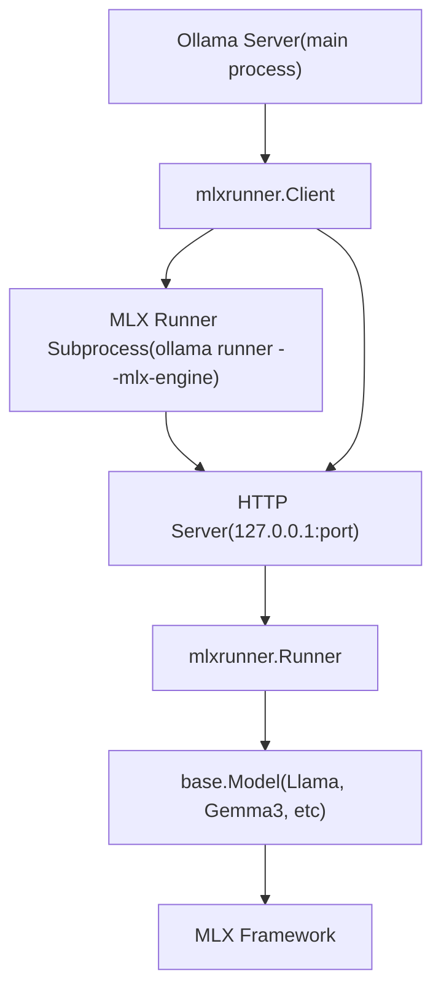
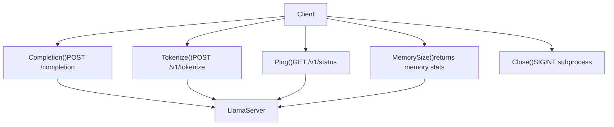
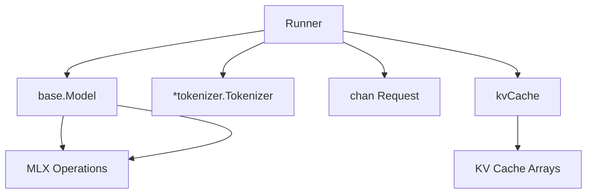
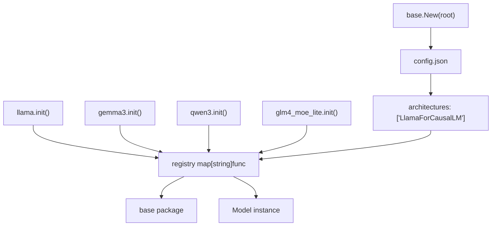
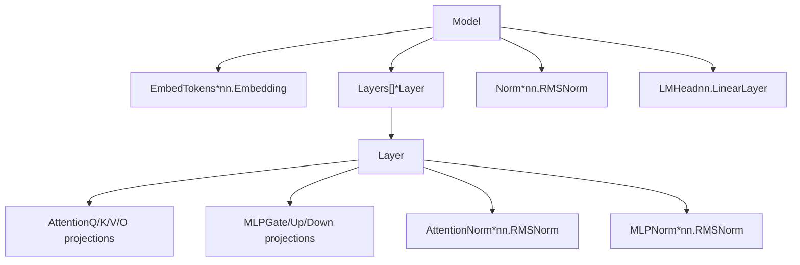
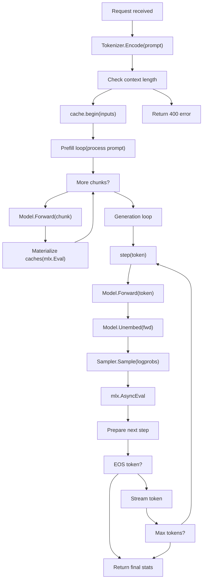
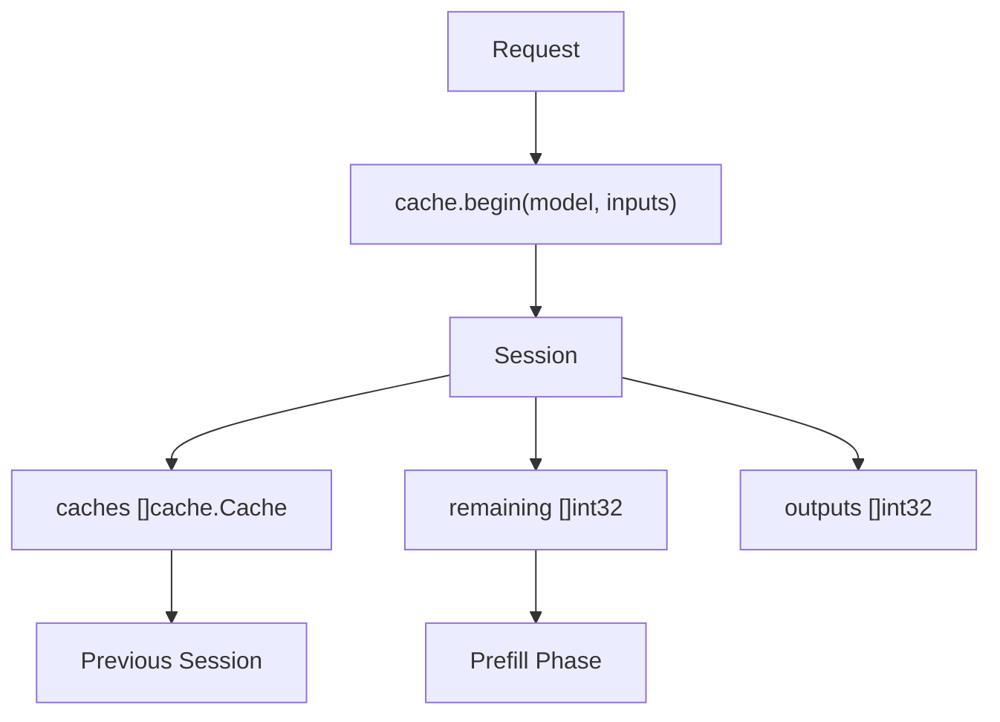
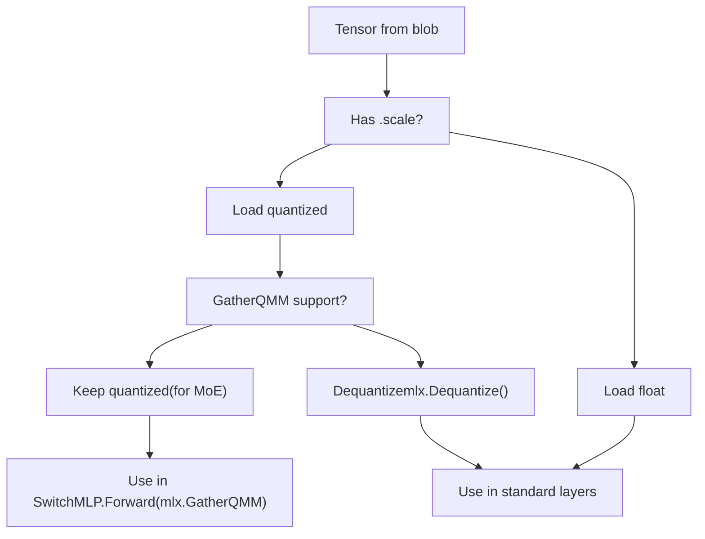

# MLX Runner (Apple Silicon)

Relevant source files

-   [x/mlxrunner/client.go](https://github.com/ollama/ollama/blob/562c76d7/x/mlxrunner/client.go)
-   [x/mlxrunner/model/base/base.go](https://github.com/ollama/ollama/blob/562c76d7/x/mlxrunner/model/base/base.go)
-   [x/mlxrunner/pipeline.go](https://github.com/ollama/ollama/blob/562c76d7/x/mlxrunner/pipeline.go)
-   [x/mlxrunner/runner.go](https://github.com/ollama/ollama/blob/562c76d7/x/mlxrunner/runner.go)
-   [x/mlxrunner/server.go](https://github.com/ollama/ollama/blob/562c76d7/x/mlxrunner/server.go)
-   [x/models/gemma3/gemma3.go](https://github.com/ollama/ollama/blob/562c76d7/x/models/gemma3/gemma3.go)
-   [x/models/glm4\_moe\_lite/glm4\_moe\_lite.go](https://github.com/ollama/ollama/blob/562c76d7/x/models/glm4_moe_lite/glm4_moe_lite.go)
-   [x/models/llama/llama.go](https://github.com/ollama/ollama/blob/562c76d7/x/models/llama/llama.go)
-   [x/models/qwen3/qwen3.go](https://github.com/ollama/ollama/blob/562c76d7/x/models/qwen3/qwen3.go)

## Purpose and Scope

The MLX Runner is a specialized execution backend for Apple Silicon that leverages the MLX framework to run large language models efficiently on Apple's unified memory architecture. This document covers the MLX runner's architecture, client-server communication, model system, and inference pipeline.

For general inference engine concepts and the broader GGML-based backend, see [Inference Engine](/ollama/ollama/5-inference-engine). For information about GPU support and hardware detection across all platforms, see [GPU and Hardware Support](/ollama/ollama/6-gpu-and-hardware-support).

## Architecture Overview

The MLX runner operates as a separate subprocess that communicates with the main Ollama server via HTTP. This design isolates the MLX-specific code and allows the main server to remain platform-agnostic while delegating Apple Silicon workloads to the specialized runner.

### Subprocess Model

**Sources:** [x/mlxrunner/client.go30-144](https://github.com/ollama/ollama/blob/562c76d7/x/mlxrunner/client.go#L30-L144) [x/mlxrunner/server.go25-178](https://github.com/ollama/ollama/blob/562c76d7/x/mlxrunner/server.go#L25-L178)

The `Client` struct in the main server process spawns a subprocess using the same executable with `--mlx-engine` flag. The subprocess starts an HTTP server on a dynamically allocated port, and the client communicates with it using HTTP requests.

### Process Lifecycle

> **[Mermaid sequence]**
> *(图表结构无法解析)*

**Sources:** [x/mlxrunner/client.go44-144](https://github.com/ollama/ollama/blob/562c76d7/x/mlxrunner/client.go#L44-L144) [x/mlxrunner/server.go25-49](https://github.com/ollama/ollama/blob/562c76d7/x/mlxrunner/server.go#L25-L49)

The lifecycle begins with `NewClient` spawning the subprocess and waiting for it to become ready via health checks. The subprocess remains alive for the duration of model inference, processing requests through the HTTP API. When the client is closed, it sends `SIGINT` to gracefully terminate the subprocess.

## Client Implementation

The `Client` struct implements the `llm.LlamaServer` interface, allowing the main Ollama server to treat MLX models identically to GGML-based models.

### Client Structure

| Field | Type | Purpose |
| --- | --- | --- |
| `port` | `int` | Dynamic port for subprocess HTTP server |
| `modelName` | `string` | Model identifier for loading |
| `contextLength` | `atomic.Int64` | Maximum context length from model config |
| `memory` | `atomic.Uint64` | Current memory usage (active + cache) |
| `done` | `chan error` | Signals subprocess exit |
| `client` | `*http.Client` | HTTP client with 10-minute timeout |
| `cmd` | `*exec.Cmd` | Subprocess command handle |

**Sources:** [x/mlxrunner/client.go31-42](https://github.com/ollama/ollama/blob/562c76d7/x/mlxrunner/client.go#L31-L42)

### Key Client Methods

**Sources:** [x/mlxrunner/client.go228-433](https://github.com/ollama/ollama/blob/562c76d7/x/mlxrunner/client.go#L228-L433)

The client translates `llm.LlamaServer` method calls into HTTP requests to the subprocess. For example, `Completion` sends a POST request to `/completion` and streams the response back to the caller.

## Server and Runner

The subprocess side consists of an HTTP server that routes requests to a `Runner` instance.

### HTTP Endpoints

| Endpoint | Method | Purpose |
| --- | --- | --- |
| `/v1/status` | GET | Health check, returns context length and memory |
| `/v1/completions` | POST | Text completion with streaming |
| `/v1/tokenize` | POST | Tokenize input text |
| `/v1/models` | GET/POST/DELETE | Model management (placeholder) |
| `/completion` | POST | Redirect to `/v1/completions` |
| `/health` | GET | Redirect to `/v1/status` |
| `/load` | POST | Redirect to `/v1/models` |

**Sources:** [x/mlxrunner/server.go52-158](https://github.com/ollama/ollama/blob/562c76d7/x/mlxrunner/server.go#L52-L158)

### Runner Structure

**Sources:** [x/mlxrunner/runner.go47-53](https://github.com/ollama/ollama/blob/562c76d7/x/mlxrunner/runner.go#L47-L53)

The `Runner` manages:

-   **Model**: The loaded model implementation (`base.Model` interface)
-   **Tokenizer**: For encoding prompts and decoding tokens
-   **Requests channel**: Sequential request processing
-   **KV cache**: Manages cached key/value states across requests
-   **Context length**: Maximum sequence length from model config

### Request Processing

The runner processes requests sequentially through a channel to ensure safe model access:

[x/mlxrunner/runner.go139-174](https://github.com/ollama/ollama/blob/562c76d7/x/mlxrunner/runner.go#L139-L174)

Each request specifies a pipeline function (e.g., `TextGenerationPipeline`) that executes the inference logic. Responses are streamed back through a channel.

**Sources:** [x/mlxrunner/runner.go139-174](https://github.com/ollama/ollama/blob/562c76d7/x/mlxrunner/runner.go#L139-L174) [x/mlxrunner/server.go82-133](https://github.com/ollama/ollama/blob/562c76d7/x/mlxrunner/server.go#L82-L133)

## Model System

The MLX runner uses a registry-based model system that supports multiple architectures.

### Model Registry

**Sources:** [x/mlxrunner/model/base/base.go31-80](https://github.com/ollama/ollama/blob/562c76d7/x/mlxrunner/model/base/base.go#L31-L80)

Models register themselves during package initialization using `base.Register`. The `base.New` function reads `config.json`, extracts the architecture name, and calls the registered constructor.

### Model Interface

All model implementations must satisfy the `base.Model` interface:

| Method | Purpose |
| --- | --- |
| `Forward(inputs, cache) *mlx.Array` | Compute hidden states for input tokens |
| `Unembed(x) *mlx.Array` | Convert hidden states to logits |
| `NumLayers() int` | Return number of transformer layers |
| `Tokenizer() *tokenizer.Tokenizer` | Return tokenizer instance |
| `MaxContextLength() int` | Return maximum sequence length |
| `LoadWeights(tensors) error` | Assign tensors to model fields |

**Sources:** [x/mlxrunner/model/base/base.go18-29](https://github.com/ollama/ollama/blob/562c76d7/x/mlxrunner/model/base/base.go#L18-L29)

### Model Loading Pipeline

> **[Mermaid sequence]**
> *(图表结构无法解析)*

**Sources:** [x/mlxrunner/runner.go55-83](https://github.com/ollama/ollama/blob/562c76d7/x/mlxrunner/runner.go#L55-L83) [x/mlxrunner/runner.go92-137](https://github.com/ollama/ollama/blob/562c76d7/x/mlxrunner/runner.go#L92-L137)

The loading process involves:

1.  Opening the model manifest
2.  Creating a model instance from the registry
3.  Loading all tensor blobs from disk
4.  Calling `LoadWeights` to assign tensors to model fields
5.  Pinning all arrays and sweeping unreferenced memory

### Tensor Remapping

During loading, tensors may need remapping for compatibility:

[x/mlxrunner/runner.go92-137](https://github.com/ollama/ollama/blob/562c76d7/x/mlxrunner/runner.go#L92-L137)

The loader:

-   Deduplicates blobs by digest
-   Remaps `.scale` → `_scale` and `.bias` → `_qbias` for quantized layers
-   Handles safetensors key suffix conventions

**Sources:** [x/mlxrunner/runner.go92-137](https://github.com/ollama/ollama/blob/562c76d7/x/mlxrunner/runner.go#L92-L137)

## Supported Models

The MLX runner supports multiple model architectures with varying features:

### Model Implementations

| Architecture | Class | Features |
| --- | --- | --- |
| Llama | `LlamaForCausalLM` | Standard transformer, RMSNorm, RoPE |
| Gemma 3 | `Gemma3ForCausalLM` | Q/K norm, sliding window, local RoPE |
| Qwen 3 | `Qwen3ForCausalLM` | Q/K norm, high RoPE base frequency |
| GLM-4 MoE Lite | `Glm4MoeLiteForCausalLM` | Multi-head latent attention, MoE |

**Sources:** [x/models/llama/llama.go19-21](https://github.com/ollama/ollama/blob/562c76d7/x/models/llama/llama.go#L19-L21) [x/models/gemma3/gemma3.go19-22](https://github.com/ollama/ollama/blob/562c76d7/x/models/gemma3/gemma3.go#L19-L22) [x/models/qwen3/qwen3.go19-21](https://github.com/ollama/ollama/blob/562c76d7/x/models/qwen3/qwen3.go#L19-L21) [x/models/glm4\_moe\_lite/glm4\_moe\_lite.go20-23](https://github.com/ollama/ollama/blob/562c76d7/x/models/glm4_moe_lite/glm4_moe_lite.go#L20-L23)

### Example: Llama Model Structure

**Sources:** [x/models/llama/llama.go48-78](https://github.com/ollama/ollama/blob/562c76d7/x/models/llama/llama.go#L48-L78)

### Example: GLM-4 MoE Structure

The GLM-4 MoE Lite model uses advanced techniques:

**Multi-head Latent Attention (MLA):**

-   Compresses K/V into lower-dimensional latent space
-   Uses absorbed attention weights (`kv_b_proj` absorbed into `embed_q`/`unembed_out`)
-   Combines non-position (nope) and position-encoded (PE) components

[x/models/glm4\_moe\_lite/glm4\_moe\_lite.go76-142](https://github.com/ollama/ollama/blob/562c76d7/x/models/glm4_moe_lite/glm4_moe_lite.go#L76-L142)

**Mixture of Experts (MoE):**

-   Routes tokens to top-k experts using sigmoid gating
-   Stacks expert weights for efficient batch processing
-   Supports quantized expert weights via `GatherQMM` kernel
-   Includes shared experts for all tokens

[x/models/glm4\_moe\_lite/glm4\_moe\_lite.go283-307](https://github.com/ollama/ollama/blob/562c76d7/x/models/glm4_moe_lite/glm4_moe_lite.go#L283-L307)

**Sources:** [x/models/glm4\_moe\_lite/glm4\_moe\_lite.go76-307](https://github.com/ollama/ollama/blob/562c76d7/x/models/glm4_moe_lite/glm4_moe_lite.go#L76-L307)

## Text Generation Pipeline

The pipeline implements autoregressive token generation with streaming output.

### Pipeline Flow

**Sources:** [x/mlxrunner/pipeline.go23-176](https://github.com/ollama/ollama/blob/562c76d7/x/mlxrunner/pipeline.go#L23-L176)

### Pipeline Stages

**1\. Prompt Encoding and Validation**

[x/mlxrunner/pipeline.go57-75](https://github.com/ollama/ollama/blob/562c76d7/x/mlxrunner/pipeline.go#L57-L75)

The pipeline encodes the prompt, validates the length, and caps generation to stay within the model's context window.

**2\. Prefill Phase**

[x/mlxrunner/pipeline.go77-108](https://github.com/ollama/ollama/blob/562c76d7/x/mlxrunner/pipeline.go#L77-L108)

The prefill phase processes the prompt in chunks (default 2048 tokens) to build the KV cache. Each chunk is processed through `Model.Forward`, and caches are materialized using `mlx.Eval` to ensure the GPU computations complete before continuing.

**3\. Token Generation Loop**

[x/mlxrunner/pipeline.go110-167](https://github.com/ollama/ollama/blob/562c76d7/x/mlxrunner/pipeline.go#L110-L167)

The generation loop:

-   Computes logits for the current token
-   Samples the next token using temperature/top-p/min-p/top-k
-   Asynchronously evaluates the sample (overlaps with response streaming)
-   Decodes and streams the token
-   Checks for EOS or max token limit

**4\. Memory Management**

[x/mlxrunner/pipeline.go44-55](https://github.com/ollama/ollama/blob/562c76d7/x/mlxrunner/pipeline.go#L44-L55)

The pipeline uses aggressive memory management:

-   Pins sample and logprob arrays to prevent premature cleanup
-   Calls `mlx.Sweep()` to free unreferenced arrays
-   Calls `mlx.ClearCache()` periodically (every 256 tokens) to free compilation cache
-   Reports peak memory usage at completion

**Sources:** [x/mlxrunner/pipeline.go23-176](https://github.com/ollama/ollama/blob/562c76d7/x/mlxrunner/pipeline.go#L23-L176)

### KV Cache Management

The pipeline uses a session-based cache system:

**Sources:** [x/mlxrunner/pipeline.go77-81](https://github.com/ollama/ollama/blob/562c76d7/x/mlxrunner/pipeline.go#L77-L81)

The cache system:

-   Maintains KV caches per layer across requests
-   Reuses cached states when input prefixes match
-   Only processes new tokens during prefill
-   Appends generated tokens to session outputs

### Step Function

The core generation step:

[x/mlxrunner/pipeline.go110-123](https://github.com/ollama/ollama/blob/562c76d7/x/mlxrunner/pipeline.go#L110-L123)

This function:

1.  Expands token to batch dimension
2.  Runs forward pass and unembed
3.  Extracts last token's logits
4.  Computes log probabilities
5.  Samples next token
6.  Pins and asynchronously evaluates result

**Sources:** [x/mlxrunner/pipeline.go110-123](https://github.com/ollama/ollama/blob/562c76d7/x/mlxrunner/pipeline.go#L110-L123)

## Compilation and Optimization

The MLX runner uses MLX's graph compilation for performance:

### Compilation Control

[x/mlxrunner/pipeline.go28-36](https://github.com/ollama/ollama/blob/562c76d7/x/mlxrunner/pipeline.go#L28-L36)

Models can disable compilation by implementing `EnableCompile() bool`. When enabled, MLX compiles the computation graph on first execution, caching optimized kernels for subsequent runs.

### Memory Optimizations

| Technique | Implementation | Purpose |
| --- | --- | --- |
| Array pinning | `mlx.Pin(array)` | Prevent premature garbage collection |
| Sweeping | `mlx.Sweep()` | Free unreferenced arrays |
| Cache clearing | `mlx.ClearCache()` | Free compilation cache periodically |
| Peak tracking | `mlx.PeakMemory()` | Monitor maximum memory usage |

**Sources:** [x/mlxrunner/pipeline.go44-55](https://github.com/ollama/ollama/blob/562c76d7/x/mlxrunner/pipeline.go#L44-L55)

### Quantization Support

The model loading system supports quantized weights:

**Sources:** [x/models/glm4\_moe\_lite/glm4\_moe\_lite.go370-413](https://github.com/ollama/ollama/blob/562c76d7/x/models/glm4_moe_lite/glm4_moe_lite.go#L370-L413)

For MoE models, the system keeps expert weights quantized when using affine quantization (4 or 8 bits), allowing the `GatherQMM` kernel to efficiently select and dequantize experts on demand. Standard layers dequantize weights during loading.

## Example: Request Flow

Here's a complete request flow through the MLX runner:

> **[Mermaid sequence]**
> *(图表结构无法解析)*

**Sources:** [x/mlxrunner/server.go82-133](https://github.com/ollama/ollama/blob/562c76d7/x/mlxrunner/server.go#L82-L133) [x/mlxrunner/pipeline.go23-176](https://github.com/ollama/ollama/blob/562c76d7/x/mlxrunner/pipeline.go#L23-L176)

This flow demonstrates the complete lifecycle from HTTP request to streaming token generation, highlighting the integration between the server, runner, pipeline, model, and MLX framework.
