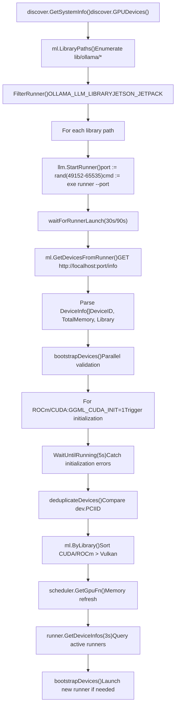
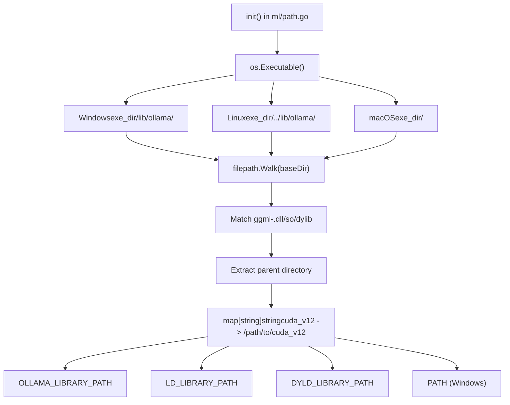
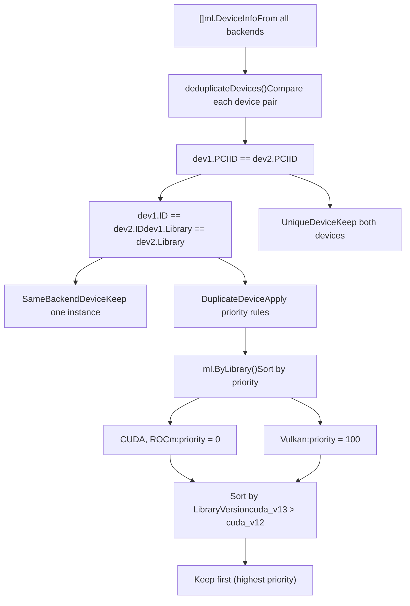
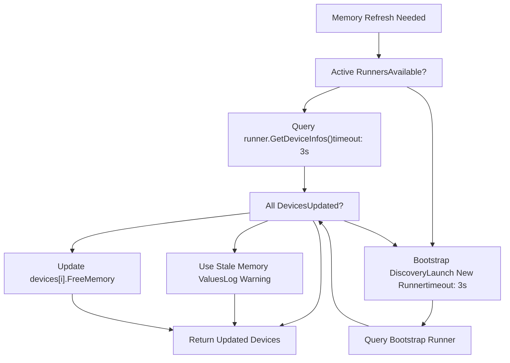

# GPU and Hardware Support

Relevant source files

-   [envconfig/config.go](https://github.com/ollama/ollama/blob/562c76d7/envconfig/config.go)
-   [envconfig/config\_test.go](https://github.com/ollama/ollama/blob/562c76d7/envconfig/config_test.go)
-   [integration/embed\_test.go](https://github.com/ollama/ollama/blob/562c76d7/integration/embed_test.go)
-   [kvcache/cache.go](https://github.com/ollama/ollama/blob/562c76d7/kvcache/cache.go)
-   [kvcache/causal.go](https://github.com/ollama/ollama/blob/562c76d7/kvcache/causal.go)
-   [kvcache/causal\_test.go](https://github.com/ollama/ollama/blob/562c76d7/kvcache/causal_test.go)
-   [kvcache/encoder.go](https://github.com/ollama/ollama/blob/562c76d7/kvcache/encoder.go)
-   [kvcache/wrapper.go](https://github.com/ollama/ollama/blob/562c76d7/kvcache/wrapper.go)
-   [llm/server.go](https://github.com/ollama/ollama/blob/562c76d7/llm/server.go)
-   [ml/backend.go](https://github.com/ollama/ollama/blob/562c76d7/ml/backend.go)
-   [ml/backend/ggml/ggml.go](https://github.com/ollama/ollama/blob/562c76d7/ml/backend/ggml/ggml.go)
-   [model/input/input.go](https://github.com/ollama/ollama/blob/562c76d7/model/input/input.go)
-   [model/model.go](https://github.com/ollama/ollama/blob/562c76d7/model/model.go)
-   [model/model\_test.go](https://github.com/ollama/ollama/blob/562c76d7/model/model_test.go)
-   [runner/llamarunner/cache.go](https://github.com/ollama/ollama/blob/562c76d7/runner/llamarunner/cache.go)
-   [runner/llamarunner/runner.go](https://github.com/ollama/ollama/blob/562c76d7/runner/llamarunner/runner.go)
-   [runner/ollamarunner/cache.go](https://github.com/ollama/ollama/blob/562c76d7/runner/ollamarunner/cache.go)
-   [runner/ollamarunner/cache\_test.go](https://github.com/ollama/ollama/blob/562c76d7/runner/ollamarunner/cache_test.go)
-   [runner/ollamarunner/runner.go](https://github.com/ollama/ollama/blob/562c76d7/runner/ollamarunner/runner.go)
-   [server/internal/internal/backoff/backoff.go](https://github.com/ollama/ollama/blob/562c76d7/server/internal/internal/backoff/backoff.go)
-   [server/sched.go](https://github.com/ollama/ollama/blob/562c76d7/server/sched.go)
-   [server/sched\_test.go](https://github.com/ollama/ollama/blob/562c76d7/server/sched_test.go)

Ollama provides comprehensive GPU acceleration support across NVIDIA, AMD, Apple, and Vulkan platforms. This page documents the hardware detection system, configuration options, memory management, and multi-GPU support. It serves as the primary reference for understanding how Ollama discovers, configures, and utilizes GPU hardware.

**Related Pages:**

-   [GPU Discovery and Backend Loading](/ollama/ollama/6.1-gpu-discovery-and-backend-loading) - Implementation details for device enumeration and library loading
-   [Installation and Setup](/ollama/ollama/6.2-installation-and-setup) - Platform-specific installation and driver configuration
-   [Docker Deployment](/ollama/ollama/6.3-docker-deployment) - Container deployment with GPU passthrough
-   [Troubleshooting and Performance](/ollama/ollama/6.4-troubleshooting-and-performance) - Debugging and optimization guidance

## Supported Hardware Platforms

Ollama implements GPU acceleration through the GGML backend system with multiple platform-specific libraries. Each backend is compiled separately and loaded dynamically based on detected hardware.

### Platform Compatibility Matrix

| Platform | Library Directory | Operating Systems | Driver Requirements | Memory API |
| --- | --- | --- | --- | --- |
| **NVIDIA CUDA 11** | `lib/ollama/cuda_v11/` | Linux, Windows | CUDA 11.8+ | `nvml.dll` / `libnvidia-ml.so.1` |
| **NVIDIA CUDA 12** | `lib/ollama/cuda_v12/` | Linux, Windows, WSL2 | CUDA 12.8+ | NVML |
| **NVIDIA CUDA 13** | `lib/ollama/cuda_v13/` | Linux, Windows | CUDA 13.0+ | NVML |
| **NVIDIA JetPack 5** | `lib/ollama/cuda_jetpack5/` | Linux ARM64 | JetPack 5.x (L4T R35) | `/proc/meminfo` |
| **NVIDIA JetPack 6** | `lib/ollama/cuda_jetpack6/` | Linux ARM64 | JetPack 6.x (L4T R36) | `/proc/meminfo` |
| **AMD ROCm 6** | `lib/ollama/rocm_v6/` | Linux, Windows | ROCm 6.3.3+ | `hipMemGetInfo()` |
| **Apple Metal** | Built-in | macOS 14.0+ | Metal support | Unified Memory (`sysctl`) |
| **Vulkan** | `lib/ollama/vulkan/` | Linux, Windows | Vulkan 1.4.321+ | `vkGetPhysicalDeviceMemoryProperties()` |
| **CPU** | `lib/ollama/` | All platforms | None | `sysconf(_SC_PAGESIZE)` |
| **MLX (Image Gen)** | `lib/ollama/mlx_*/` | macOS (Metal only) | Metal support | Metal API |

### Compute Capability Requirements

**NVIDIA CUDA**:

-   Minimum: Compute Capability 5.0 (Maxwell architecture)
-   Flash Attention: Compute Capability ≥ 7.0 (excluding 7.2)
-   Recommended: Compute Capability 8.0+ (Ampere) for optimal performance

**AMD ROCm**:

-   Minimum: gfx900 (Vega 10)
-   Excluded: gfx906 architectures (removed from distribution)
-   Override: `HSA_OVERRIDE_GFX_VERSION` environment variable

**Apple Metal**:

-   M-series processors (M1, M2, M3, M4)
-   Intel Macs with discrete AMD GPUs
-   Minimum macOS 14.0 for deployment target

**Vulkan**:

-   Vulkan 1.2 API support (1.4.321 SDK for build)
-   Experimental support (requires `OLLAMA_VULKAN=1`)

**Sources**: [Dockerfile1-216](https://github.com/ollama/ollama/blob/562c76d7/Dockerfile#L1-L216) [ml/device.go480-493](https://github.com/ollama/ollama/blob/562c76d7/ml/device.go#L480-L493) [discover/gpu.go16-81](https://github.com/ollama/ollama/blob/562c76d7/discover/gpu.go#L16-L81) [envconfig/config.go211](https://github.com/ollama/ollama/blob/562c76d7/envconfig/config.go#L211-L211)

## Hardware Detection Architecture

Ollama discovers GPUs through a two-phase bootstrap process that enumerates libraries, validates hardware, and deduplicates devices across multiple backends.

### Device Discovery Flow


**Phase 1: Serial Enumeration** (`discover/runner.go:34-119`)

For each library directory in `lib/ollama/`, Ollama launches a bootstrap runner subprocess:

1.  `StartRunner()` spawns `exe runner --port <random>` with library paths in `LD_LIBRARY_PATH`/`PATH`
2.  Subprocess initializes backend (CUDA, ROCm, etc.) and queries available devices
3.  HTTP GET to `localhost:<port>/info` returns `ml.DeviceInfo[]` with device metadata
4.  Timeout: 30 seconds (Linux/macOS), 90 seconds (Windows due to Defender DLL scanning)

**Phase 2: Parallel Validation** (`discover/runner.go:176-243`)

For CUDA and ROCm backends, deep initialization validates device support:

1.  Sets `GGML_CUDA_INIT=1` to force immediate GPU initialization
2.  `WaitUntilRunning(5s)` detects unsupported hardware via initialization crashes
3.  `deduplicateDevices()` removes duplicates by comparing `PCIID` strings
4.  Library priority: CUDA/ROCm preferred over Vulkan for same device

**Runtime Memory Refresh** (`discover/runner.go:258-362`)

After initial discovery, only free memory values are updated:

1.  First attempts to query existing active runners via `runner.GetDeviceInfos(ctx, 3s)`
2.  Falls back to bootstrap discovery if active runners unavailable or incomplete
3.  Metal devices skip refresh (unified memory model)

**Sources**: [discover/runner.go34-362](https://github.com/ollama/ollama/blob/562c76d7/discover/runner.go#L34-L362) [ml/device.go622-669](https://github.com/ollama/ollama/blob/562c76d7/ml/device.go#L622-L669) [llm/server.go321-439](https://github.com/ollama/ollama/blob/562c76d7/llm/server.go#L321-L439)

## Backend Library System

Ollama dynamically loads GPU acceleration libraries based on detected hardware. Libraries are organized in subdirectories with automatic version selection and path resolution.

### Library Path Resolution


**Path Initialization** (`ml/path.go:9-56`)

The `ml.LibOllamaPath` variable is set during package initialization:

1.  Resolve executable path via `os.Executable()` and `filepath.EvalSymlinks()`
2.  Platform-specific base directory:
    -   Windows: `<exe_dir>/lib/ollama/`
    -   Linux: `<exe_dir>/../lib/ollama/`
    -   macOS: `<exe_dir>/`
3.  Walk directory tree and build map of library directories
4.  Each subdirectory containing `*ggml-*` files becomes a backend option

**Library Selection** (`discover/runner.go:55-119`)

Selection algorithm for multi-version backends (e.g., CUDA 11/12/13):

1.  Filter by user override: `OLLAMA_LLM_LIBRARY=cuda_v12`
2.  Filter by platform: Skip JetPack libraries on non-Jetson systems
3.  Sort by version (descending): `cuda_v13` > `cuda_v12` > `cuda_v11`
4.  For multi-GPU: Select newest version that supports **all** detected GPUs
5.  Fallback: Use older version if newer doesn't support all devices

**Environment Variables**

| Variable | Purpose | Example |
| --- | --- | --- |
| `OLLAMA_LLM_LIBRARY` | Force specific backend | `cuda_v12`, `rocm_v6` |
| `JETSON_JETPACK` | Override JetPack detection | `5`, `6` |
| `OLLAMA_VULKAN` | Enable experimental Vulkan | `1` (default: disabled) |
| `OLLAMA_LIBRARY_PATH` | Custom library search path | `/custom/path/to/libs` |

**Runner Subprocess Environment** (`llm/server.go:353-429`)

When launching a runner, Ollama sets library paths in the subprocess environment:

```
// Linux/macOSpathEnv = "LD_LIBRARY_PATH"  // or "DYLD_LIBRARY_PATH" on Darwincmd.Env = append(cmd.Env, "LD_LIBRARY_PATH="+gpuLibPaths)cmd.Env = append(cmd.Env, "OLLAMA_LIBRARY_PATH="+gpuLibs) // Windowscmd.Env = append(cmd.Env, "PATH="+gpuLibPaths)
```
**Sources**: [ml/path.go9-56](https://github.com/ollama/ollama/blob/562c76d7/ml/path.go#L9-L56) [discover/runner.go55-119](https://github.com/ollama/ollama/blob/562c76d7/discover/runner.go#L55-L119) [llm/server.go321-439](https://github.com/ollama/ollama/blob/562c76d7/llm/server.go#L321-L439)

## Device Selection and Priority

Multiple backends can detect the same physical GPU (e.g., CUDA and Vulkan). Ollama deduplicates devices and applies priority rules to select optimal configurations.

### Device Comparison and Deduplication


**Deduplication Algorithm** (`ml/device.go:432-477`)

The `deduplicateDevices()` function compares each device pair:

```
func (a DeviceInfo) Compare(b DeviceInfo) DeviceComparison {    // Same physical device (PCI ID match)    if a.PCIID != "" && a.PCIID == b.PCIID {        if a.ID == b.ID && a.Library == b.Library {            return SameBackendDevice  // Exact duplicate        }        return DuplicateDevice  // Same GPU, different backend    }        // Different physical devices    return UniqueDevice}
```
**Priority Rules** (`ml/device.go:549-560`)

1.  **Library Priority**: `ByLibrary()` sorts devices with library-specific weights:

    -   CUDA backends: priority 0
    -   ROCm backends: priority 0
    -   Vulkan backend: priority 100
    -   Result: CUDA/ROCm preferred over Vulkan
2.  **Version Priority**: Within same library type, sort by version descending:

    -   `cuda_v13` (13.0) > `cuda_v12` (12.8) > `cuda_v11` (11.8)
3.  **Multi-GPU Consistency**: For systems with multiple GPUs, select the newest library version that supports **all** devices. This ensures all GPUs use the same backend.

4.  **Integrated vs Discrete**: During layer allocation (`assignLayers`), discrete GPUs receive layers before integrated GPUs when using default scheduling.


**Environment Variable Filtering** (`ml/device.go:24-119`)

Device visibility can be controlled via environment variables:

| Variable | Platform | Filtering Behavior |
| --- | --- | --- |
| `CUDA_VISIBLE_DEVICES` | NVIDIA CUDA | Only when `mustFilter=true` (default: no filter) |
| `ROCR_VISIBLE_DEVICES` | AMD ROCm | Always filtered (Linux priority) |
| `HIP_VISIBLE_DEVICES` | AMD ROCm | Always filtered (non-Linux) |
| `GGML_VK_VISIBLE_DEVICES` | Vulkan | Filtered via scheduler |
| `GPU_DEVICE_ORDINAL` | AMD (legacy) | Filtered for compatibility |

**CUDA Filtering Special Case**: Ollama avoids filtering CUDA devices by default because ROCm also reads `CUDA_VISIBLE_DEVICES`, which can cause confusion in mixed-vendor systems. CUDA filtering is only enabled when explicitly required.

**Sources**: [ml/device.go432-477](https://github.com/ollama/ollama/blob/562c76d7/ml/device.go#L432-L477) [ml/device.go549-560](https://github.com/ollama/ollama/blob/562c76d7/ml/device.go#L549-L560) [ml/device.go24-119](https://github.com/ollama/ollama/blob/562c76d7/ml/device.go#L24-L119) [discover/runner.go176-243](https://github.com/ollama/ollama/blob/562c76d7/discover/runner.go#L176-L243)

## Memory Management Fundamentals

Ollama queries device memory through platform-specific APIs to determine layer allocation. Memory reporting varies by platform and affects scheduling decisions.

### VRAM Reporting Methods

| Platform | Primary Method | Library | Fallback | Implementation |
| --- | --- | --- | --- | --- |
| **NVIDIA CUDA** | NVML API | `nvml.dll` / `libnvidia-ml.so.1` | `/proc/meminfo` (unified memory) | `ggml_nvml_get_device_memory()` |
| **AMD ROCm** | HIP API | `libamdhip64.so` / `amdhip64.dll` | None | `hipMemGetInfo()` |
| **Apple Metal** | Unified Memory | System API | N/A | `sysctl hw.memsize` |
| **Vulkan** | Vulkan API | `vulkan-1.dll` / `libvulkan.so` | None | `vkGetPhysicalDeviceMemoryProperties()` |
| **CPU** | System Memory | OS APIs | None | `sysconf(_SC_PAGESIZE)` (Linux), `GlobalMemoryStatusEx()` (Windows) |

### NVML Integration

**Dynamic Loading** (`ml/backend/ggml/ggml/src/mem_nvml.cpp:115-197`)

The NVML library is loaded at runtime to avoid hard dependencies:

```
// Search paths for NVML library#ifdef _WIN32  "nvml.dll"  "C:\\Windows\\System32\\nvml.dll"  "C:\\Program Files\\NVIDIA Corporation\\NVSMI\\nvml.dll"#else  "libnvidia-ml.so.1"  // Standard path  "/usr/lib/wsl/lib/libnvidia-ml.so.1"  // WSL2 path#endif
```
**Memory Query Function**:

```
nvmlReturn_t (*nvmlDeviceGetMemoryInfo)(nvmlDevice_t, nvmlMemory_t*);// Returns: .total (total VRAM), .free (available VRAM), .used (allocated)
```
**Fallback for Unified Memory**: When NVML returns `NVML_ERROR_NOT_SUPPORTED` (e.g., Tegra/Jetson), Ollama reads `/proc/meminfo` to determine system memory availability.

### Memory Overhead Accounting

**GPU Overhead** (`ml/device.go:345-353`)

Each backend reserves memory for context structures:

| Backend | Overhead | Configurable |
| --- | --- | --- |
| Metal | 512 MiB | No |
| CUDA | 457 MiB | Yes (`OLLAMA_GPU_OVERHEAD`) |
| ROCm | 457 MiB | Yes (`OLLAMA_GPU_OVERHEAD`) |
| Vulkan | 457 MiB | Yes (`OLLAMA_GPU_OVERHEAD`) |

```
func (dev DeviceInfo) MinimumMemory() uint64 {    if dev.Library == "metal" {        return 512 * 1024 * 1024  // 512 MiB    }    return 457 * 1024 * 1024  // ~450 MiB}
```
**User Override**: Set `OLLAMA_GPU_OVERHEAD` (in bytes) to reserve additional VRAM per GPU:

```
export OLLAMA_GPU_OVERHEAD=$((2 * 1024 * 1024 * 1024))  # 2 GiB reserve
```
### Memory Refresh Strategy

**Refresh Trigger** (`discover/runner.go:258-362`)

Memory is refreshed in two scenarios:

1.  **Initial Load**: Full device discovery during `discover.GPUDevices()`
2.  **Scheduler Refresh**: Before loading new models via `scheduler.GetGpuFn()`

**Refresh Implementation**:

```
func UpdateFreeMemory(ctx context.Context, runners []FilteredRunnerDiscovery) []DeviceInfo {    // Step 1: Try active runners (fast: ~500ms)    for _, runner := range runners {        devices := runner.GetDeviceInfos(ctx)  // 3s timeout        if allDevicesReported(devices) {            return devices        }    }        // Step 2: Bootstrap discovery (slow: ~3s)    return bootstrapDevices(ctx)}
```
**Metal Exception**: On macOS with Metal, free memory is never refreshed because it uses unified memory architecture. The reported value represents total system memory minus a fixed overhead.

**Sources**: [ml/backend/ggml/ggml/src/mem\_nvml.cpp115-273](https://github.com/ollama/ollama/blob/562c76d7/ml/backend/ggml/ggml/src/mem_nvml.cpp#L115-L273) [ml/device.go345-353](https://github.com/ollama/ollama/blob/562c76d7/ml/device.go#L345-L353) [discover/runner.go258-362](https://github.com/ollama/ollama/blob/562c76d7/discover/runner.go#L258-L362) [envconfig/config.go272](https://github.com/ollama/ollama/blob/562c76d7/envconfig/config.go#L272-L272)

### Memory Refresh Strategy


**Runtime Refresh**: After initial discovery, Ollama only refreshes free memory values, not device enumeration. It first attempts to use existing active runners (typical refresh ~500ms), falling back to bootstrap discovery only when necessary. On macOS with Metal, free memory is never refreshed as it uses unified memory.

**Sources**: [discover/runner.go258-362](https://github.com/ollama/ollama/blob/562c76d7/discover/runner.go#L258-L362) [ml/device.go594-621](https://github.com/ollama/ollama/blob/562c76d7/ml/device.go#L594-L621)

## Multi-GPU Support

Ollama supports distributing model layers across multiple GPUs with sophisticated allocation strategies:

### Layer Allocation Strategy

The `fitGPU` algorithm (implemented in `llmServer.createLayout`) allocates layers to GPUs based on:

1.  **Available Memory**: Sorts GPUs by free VRAM (discrete GPUs prioritized over integrated)
2.  **Layer Requirements**: Each layer has a weight size and KV cache requirement
3.  **MinimumMemory Reserve**: Subtracts GPU overhead (457-512 MiB) from available VRAM
4.  **Sequential Allocation**: Assigns layers to the GPU with most free memory that can fit them
5.  **Split Support**: Layers can span multiple GPUs when beneficial

**Example Allocation**:

```
GPU 0 (8GB VRAM):  Layers 0-15
GPU 1 (16GB VRAM): Layers 16-31
CPU:               Layers 32-35
```
### Device Visibility Environment Variables

When launching a runner subprocess, Ollama configures device visibility to control GPU access. This prevents backends from detecting unsupported or unallocated devices.

**Environment Variable Configuration** (`ml/device.go:24-119`)

```
func GetVisibleDevicesEnv(gpus []DeviceInfo, mustFilter bool) map[string]string {    env := make(map[string]string)        for _, gpu := range gpus {        switch gpu.Library {        case "cuda":            if mustFilter {  // Only when explicitly required                env["CUDA_VISIBLE_DEVICES"] = deviceIDs            }        case "rocm":            // Always set for ROCm            if runtime.GOOS == "linux" {                env["ROCR_VISIBLE_DEVICES"] = deviceUUIDs            } else {                env["HIP_VISIBLE_DEVICES"] = deviceIDs            }        }    }    return env}
```
**Device Filtering Behavior**

| Variable | Platform | Set When | Format | Example |
| --- | --- | --- | --- | --- |
| `CUDA_VISIBLE_DEVICES` | NVIDIA CUDA | `mustFilter=true` only | Comma-separated device IDs | `0,2,3` |
| `ROCR_VISIBLE_DEVICES` | AMD ROCm (Linux) | Always | Comma-separated UUIDs | `GPU-abc123,GPU-def456` |
| `HIP_VISIBLE_DEVICES` | AMD ROCm (Windows) | Always | Comma-separated device IDs | `0,1` |
| `GPU_DEVICE_ORDINAL` | AMD (legacy) | Always | Comma-separated device IDs | `0,1` |
| `GGML_VK_VISIBLE_DEVICES` | Vulkan | Via scheduler | Comma-separated device IDs | `0,1` |

**CUDA Filtering Special Case**: Ollama avoids setting `CUDA_VISIBLE_DEVICES` by default because:

1.  ROCm backends also read this variable
2.  In mixed NVIDIA/AMD systems, setting it can confuse ROCm
3.  CUDA has internal filtering that works without environment variables

CUDA filtering is only enabled when:

-   Explicit device filtering is required (e.g., multi-tenant scenarios)
-   `mustFilter=true` is passed to `GetVisibleDevicesEnv()`

**User Environment Variables** (`envconfig/config.go:226-232`)

Users can override device visibility before starting Ollama:

```
# Limit to specific CUDA devicesexport CUDA_VISIBLE_DEVICES=0,2 # Limit to specific AMD devices (Linux)export ROCR_VISIBLE_DEVICES=GPU-abc123,GPU-def456 # Limit to specific AMD devices (Windows)export HIP_VISIBLE_DEVICES=0,1 # Override AMD GPU architectureexport HSA_OVERRIDE_GFX_VERSION=10.3.0
```
**Sources**: [ml/device.go24-119](https://github.com/ollama/ollama/blob/562c76d7/ml/device.go#L24-L119) [ml/device.go521-592](https://github.com/ollama/ollama/blob/562c76d7/ml/device.go#L521-L592) [envconfig/config.go226-232](https://github.com/ollama/ollama/blob/562c76d7/envconfig/config.go#L226-L232)

## Platform-Specific Considerations

### Linux

-   **Driver Installation**: The `install.sh` script automatically detects GPU vendors and installs appropriate drivers (CUDA, ROCm)
-   **GPU Detection**: Uses `lspci` or `lshw` to enumerate PCI devices by vendor ID (10DE for NVIDIA, 1002 for AMD)
-   **User Groups**: Ollama user is automatically added to `render` and `video` groups for GPU access
-   **Kernel Modules**: Ensures `nvidia` and `nvidia_uvm` modules are loaded and configured for boot via `/etc/modules-load.d/nvidia.conf`

### Windows

-   **AV Scanning Delay**: Windows Defender can significantly slow initial discovery (up to 90 seconds) due to sequential DLL scanning
-   **NVML Location**: Searches `Program Files\NVIDIA Corporation\NVSMI\` and `\Windows\System32\`
-   **Error Handling**: Uses `SEM_FAILCRITICALERRORS` to suppress missing DLL error dialogs

### macOS

-   **Metal-Only**: Only Metal backend is supported on macOS
-   **Unified Memory**: Uses system memory shared with CPU; no separate VRAM tracking needed
-   **No Refresh**: Free memory is never refreshed on Metal as it represents system memory

### WSL2

-   **GPU Passthrough**: Only NVIDIA GPUs are supported via nvidia-smi and CUDA passthrough
-   **NVML Path**: Prioritizes `/usr/lib/wsl/lib/libnvidia-ml.so.1` for WSL2-specific NVML library
-   **Detection**: Checks kernel name for "Microsoft\*WSL2" pattern

### NVIDIA JetPack (Jetson Devices)

-   **Detection**: Reads `/etc/nv_tegra_release` to determine L4T version (R35 → JetPack 5, R36 → JetPack 6)
-   **Special Builds**: Uses separate library builds optimized for ARM64 with reduced overhead
-   **Fallback**: Newer systems may use standard SBSA runtime instead of JetPack-specific builds

**Sources**: [scripts/install.sh39-393](https://github.com/ollama/ollama/blob/562c76d7/scripts/install.sh#L39-L393) [discover/runner.go86-94](https://github.com/ollama/ollama/blob/562c76d7/discover/runner.go#L86-L94) [discover/gpu.go51-81](https://github.com/ollama/ollama/blob/562c76d7/discover/gpu.go#L51-L81) [ml/backend/ggml/ggml/src/mem\_nvml.cpp121-197](https://github.com/ollama/ollama/blob/562c76d7/ml/backend/ggml/ggml/src/mem_nvml.cpp#L121-L197)
