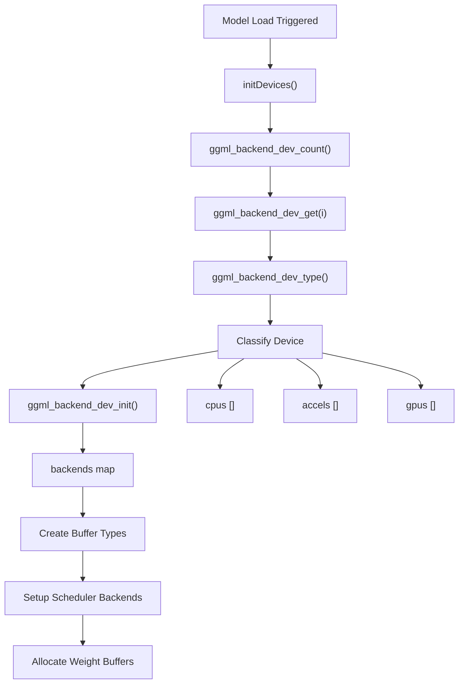
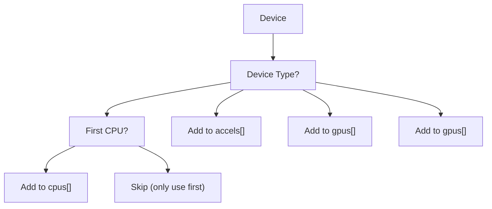
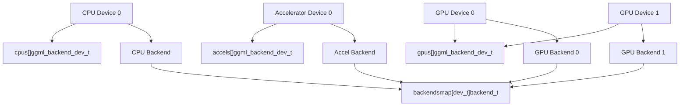
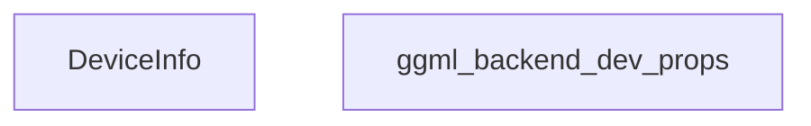
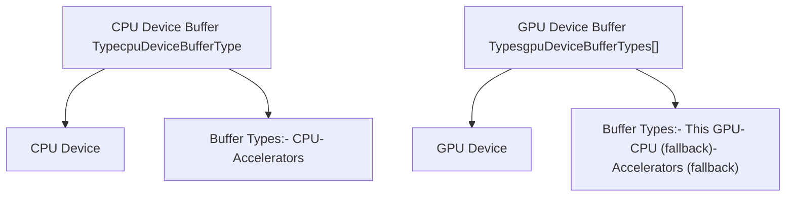
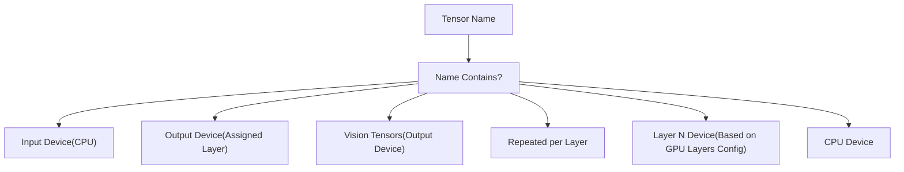
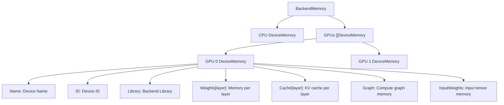
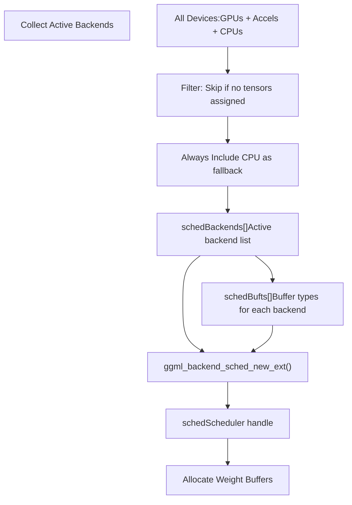
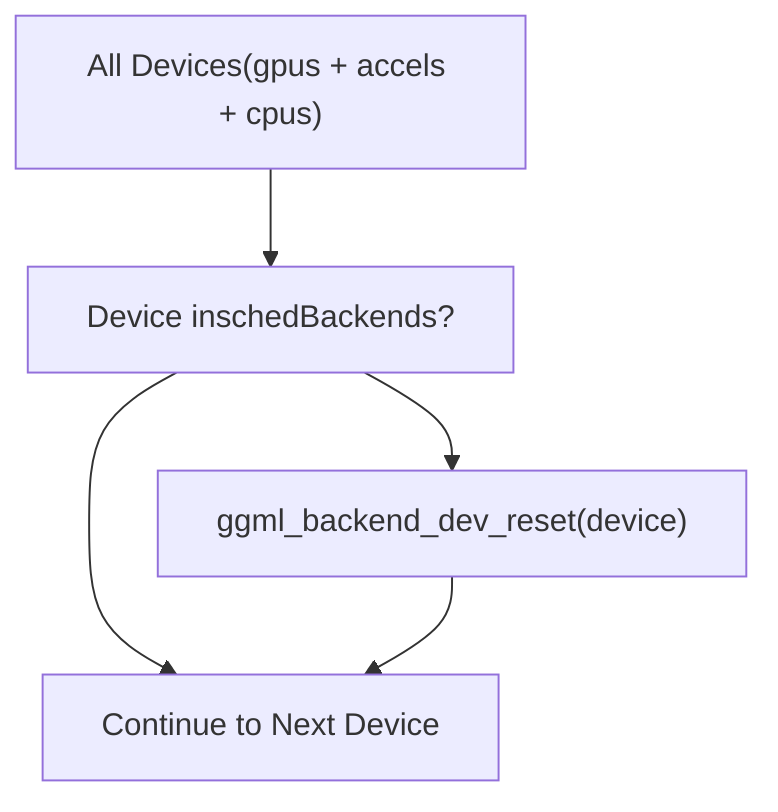
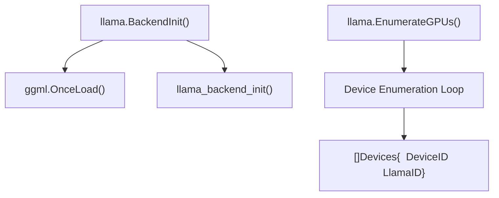

# GPU Discovery and Backend Loading

Relevant source files

-   [integration/embed\_test.go](https://github.com/ollama/ollama/blob/562c76d7/integration/embed_test.go)
-   [kvcache/cache.go](https://github.com/ollama/ollama/blob/562c76d7/kvcache/cache.go)
-   [kvcache/causal.go](https://github.com/ollama/ollama/blob/562c76d7/kvcache/causal.go)
-   [kvcache/causal\_test.go](https://github.com/ollama/ollama/blob/562c76d7/kvcache/causal_test.go)
-   [kvcache/encoder.go](https://github.com/ollama/ollama/blob/562c76d7/kvcache/encoder.go)
-   [kvcache/wrapper.go](https://github.com/ollama/ollama/blob/562c76d7/kvcache/wrapper.go)
-   [llama/llama.go](https://github.com/ollama/ollama/blob/562c76d7/llama/llama.go)
-   [llama/sampling\_ext.cpp](https://github.com/ollama/ollama/blob/562c76d7/llama/sampling_ext.cpp)
-   [llama/sampling\_ext.h](https://github.com/ollama/ollama/blob/562c76d7/llama/sampling_ext.h)
-   [ml/backend.go](https://github.com/ollama/ollama/blob/562c76d7/ml/backend.go)
-   [ml/backend/ggml/ggml.go](https://github.com/ollama/ollama/blob/562c76d7/ml/backend/ggml/ggml.go)
-   [model/input/input.go](https://github.com/ollama/ollama/blob/562c76d7/model/input/input.go)
-   [model/model.go](https://github.com/ollama/ollama/blob/562c76d7/model/model.go)
-   [model/model\_test.go](https://github.com/ollama/ollama/blob/562c76d7/model/model_test.go)
-   [runner/llamarunner/cache.go](https://github.com/ollama/ollama/blob/562c76d7/runner/llamarunner/cache.go)
-   [runner/llamarunner/runner.go](https://github.com/ollama/ollama/blob/562c76d7/runner/llamarunner/runner.go)
-   [runner/ollamarunner/cache.go](https://github.com/ollama/ollama/blob/562c76d7/runner/ollamarunner/cache.go)
-   [runner/ollamarunner/cache\_test.go](https://github.com/ollama/ollama/blob/562c76d7/runner/ollamarunner/cache_test.go)
-   [runner/ollamarunner/runner.go](https://github.com/ollama/ollama/blob/562c76d7/runner/ollamarunner/runner.go)
-   [server/internal/internal/backoff/backoff.go](https://github.com/ollama/ollama/blob/562c76d7/server/internal/internal/backoff/backoff.go)

## Purpose and Scope

This page explains how Ollama discovers available GPU devices and initializes backend systems at runtime. It covers the device enumeration process, device type classification, backend initialization, and buffer type setup for compute graph execution. For information about installing GPU drivers and configuring systems, see [Installation and Setup](/ollama/ollama/6.2-installation-and-setup). For troubleshooting GPU issues, see [Troubleshooting and Performance](/ollama/ollama/6.4-troubleshooting-and-performance).

## Overview

Ollama uses GGML (Georgi Gerganov Machine Learning) as its primary backend for model execution. During initialization, the system:

1.  Enumerates all available compute devices (CPUs, GPUs, accelerators)
2.  Classifies devices by type (CPU, GPU, IGPU, ACCEL)
3.  Initializes backends for each device
4.  Creates buffer types for memory allocation
5.  Configures the compute graph scheduler with available backends

This process happens once per model load and determines which hardware will be used for inference.


Sources: [ml/backend/ggml/ggml.go47-69](https://github.com/ollama/ollama/blob/562c76d7/ml/backend/ggml/ggml.go#L47-L69) [ml/backend/ggml/ggml.go123-449](https://github.com/ollama/ollama/blob/562c76d7/ml/backend/ggml/ggml.go#L123-L449)

## Device Discovery Process

### Device Enumeration

Device discovery begins with the `initDevices` function, which is called once when the GGML backend is first initialized. This function uses a `sync.OnceFunc` to ensure it runs only once per process lifetime.

> **[Mermaid sequence]**
> *(图表结构无法解析)*

The enumeration process iterates through all devices detected by the GGML library:

| GGML Function | Purpose |
| --- | --- |
| `ggml_backend_dev_count()` | Returns total number of available devices |
| `ggml_backend_dev_get(i)` | Gets handle to device at index `i` |
| `ggml_backend_dev_type(d)` | Returns the type classification of device `d` |
| `ggml_backend_dev_init(d, params)` | Initializes backend for device `d` |

Sources: [ml/backend/ggml/ggml.go47-69](https://github.com/ollama/ollama/blob/562c76d7/ml/backend/ggml/ggml.go#L47-L69)

### Device Type Classification

Devices are classified into four categories, each stored in separate global slices:


**Device Type Characteristics:**

| Type | Description | Storage | Notes |
| --- | --- | --- | --- |
| `GGML_BACKEND_DEVICE_TYPE_CPU` | CPU devices | `cpus []C.ggml_backend_dev_t` | Only the first CPU device is stored |
| `GGML_BACKEND_DEVICE_TYPE_ACCEL` | Accelerators (e.g., Apple Neural Engine) | `accels []C.ggml_backend_dev_t` | All accelerator devices are stored |
| `GGML_BACKEND_DEVICE_TYPE_GPU` | Discrete GPUs | `gpus []C.ggml_backend_dev_t` | NVIDIA, AMD, Intel discrete GPUs |
| `GGML_BACKEND_DEVICE_TYPE_IGPU` | Integrated GPUs | `gpus []C.ggml_backend_dev_t` | Integrated graphics (same storage as GPU) |

**Important Implementation Detail:** Only the first CPU device is used, even if multiple CPU devices are detected. This is handled by the condition on line 56-59 of [ml/backend/ggml/ggml.go](https://github.com/ollama/ollama/blob/562c76d7/ml/backend/ggml/ggml.go)

Sources: [ml/backend/ggml/ggml.go54-65](https://github.com/ollama/ollama/blob/562c76d7/ml/backend/ggml/ggml.go#L54-L65)

## Backend Initialization

### Per-Device Backend Creation

For each discovered device, a backend is initialized and stored in a global map:

```
backends[d] = C.ggml_backend_dev_init(d, nil)
```
The `backends` map provides quick lookup from device handles to their initialized backends:


This map is used throughout the backend's lifetime to access initialized backends for compute operations.

Sources: [ml/backend/ggml/ggml.go42-69](https://github.com/ollama/ollama/blob/562c76d7/ml/backend/ggml/ggml.go#L42-L69)

## Device Properties and Information

### Querying Device Information

Device properties are retrieved using `ggml_backend_dev_get_props` and `ggml_backend_dev_memory`:


The `BackendDevices()` method returns device information for all GPUs:

**Device Information Flow:**

1.  Iterate through `gpus` slice
2.  Skip devices not used by the current model (if model is loaded)
3.  Call `ggml_backend_dev_get_props()` to get static properties
4.  Call `ggml_backend_dev_memory()` to get current memory status
5.  Populate `DeviceInfo` struct with all properties

Sources: [ml/backend/ggml/ggml.go694-739](https://github.com/ollama/ollama/blob/562c76d7/ml/backend/ggml/ggml.go#L694-L739) [llama/llama.go72-94](https://github.com/ollama/ollama/blob/562c76d7/llama/llama.go#L72-L94)

## Buffer Types and Memory Allocation

### Buffer Type Hierarchy

Buffer types determine where and how tensors are allocated in memory. The system creates separate buffer types for different device categories:


**Buffer Type Selection Strategy:**

The system creates a priority-ordered list of buffer types for each device category:

| Device Category | Primary Buffer Type | Fallback Buffer Types |
| --- | --- | --- |
| CPU | CPU device buffer | Accelerator buffers |
| GPU N | GPU N device buffer | CPU device buffer, Accelerator buffers |

This fallback mechanism ensures that if a tensor cannot be allocated on the primary device, it can fall back to CPU or accelerator memory.

Sources: [ml/backend/ggml/ggml.go157-198](https://github.com/ollama/ollama/blob/562c76d7/ml/backend/ggml/ggml.go#L157-L198)

### Tensor-to-Device Assignment

Tensors are assigned to devices based on their names and layer indices:


**Layer Assignment Logic:**

The `assignLayer` function determines which device should handle each layer based on the `GPULayers` configuration:

```
assignLayer := func(layer int) deviceBufferType {    for _, p := range params.GPULayers {        for _, l := range p.Layers {            if l == layer {                // Find GPU with matching DeviceID                return gpuDeviceBufferTypes[i]            }        }    }    return cpuDeviceBufferType}
```
Sources: [ml/backend/ggml/ggml.go203-343](https://github.com/ollama/ollama/blob/562c76d7/ml/backend/ggml/ggml.go#L203-L343)

### Memory Tracking

As tensors are created, the system tracks memory usage per device and layer:


Memory is tracked at tensor creation time:

```
size := pad(C.ggml_backend_buft_get_alloc_size(bt, tt),             C.ggml_backend_buft_get_alignment(bt))if layer == -1 {    requiredMemory.InputWeights += uint64(size)} else {    btDeviceMemory[bt].Weights[layer] += uint64(size)}
```
Sources: [ml/backend/ggml/ggml.go149-198](https://github.com/ollama/ollama/blob/562c76d7/ml/backend/ggml/ggml.go#L149-L198) [ml/backend/ggml/ggml.go280-287](https://github.com/ollama/ollama/blob/562c76d7/ml/backend/ggml/ggml.go#L280-L287)

## Compute Graph Scheduler Setup

### Scheduler Backend Configuration

After all tensors are created, the system configures the compute graph scheduler with the backends that will be used:


**Scheduler Creation Process:**

1.  **Backend Collection** - Iterate through devices in priority order: GPUs, accelerators, CPUs
2.  **Tensor Check** - For each backend, verify that at least one tensor is assigned (except CPU, which is always included)
3.  **Buffer Type Extraction** - Get the default buffer type for each backend
4.  **Scheduler Initialization** - Call `ggml_backend_sched_new_ext()` with collected backends and buffer types
5.  **Thread Configuration** - For CPU backends, set the number of threads

Sources: [ml/backend/ggml/ggml.go354-391](https://github.com/ollama/ollama/blob/562c76d7/ml/backend/ggml/ggml.go#L354-L391)

### Weight Buffer Allocation

After the scheduler is created, weight buffers are allocated for each context:

> **[Mermaid sequence]**
> *(图表结构无法解析)*

**Allocation Failure Handling:**

If buffer allocation fails, the system:

1.  Frees all previously allocated buffers
2.  Frees all created contexts
3.  Panics with `ml.ErrNoMem` error containing memory requirements

This ensures clean failure when insufficient memory is available.

Sources: [ml/backend/ggml/ggml.go394-420](https://github.com/ollama/ollama/blob/562c76d7/ml/backend/ggml/ggml.go#L394-L420)

## Device Reset and Cleanup

### Unused Device Cleanup

After the scheduler is set up, unused devices are reset to free any resources they may have allocated:


This cleanup ensures that devices not used by the current model don't hold onto resources unnecessarily.

Sources: [ml/backend/ggml/ggml.go629-638](https://github.com/ollama/ollama/blob/562c76d7/ml/backend/ggml/ggml.go#L629-L638)

## Integration with LLaMA Runner

The LLaMA runner provides a higher-level interface for GPU enumeration:


The `EnumerateGPUs()` function returns a list of GPU devices with both:

-   `DeviceID`: Containing library name and device ID string
-   `LlamaID`: The device index in GGML's enumeration

This information is used by the scheduler to configure which GPUs should be used for model execution.

Sources: [llama/llama.go62-65](https://github.com/ollama/ollama/blob/562c76d7/llama/llama.go#L62-L65) [llama/llama.go72-94](https://github.com/ollama/ollama/blob/562c76d7/llama/llama.go#L72-L94)

## Summary

The GPU discovery and backend loading process in Ollama follows a multi-stage initialization:

| Stage | Key Functions | Purpose |
| --- | --- | --- |
| **Device Discovery** | `initDevices()`, `ggml_backend_dev_count()`, `ggml_backend_dev_get()` | Enumerate all compute devices |
| **Classification** | `ggml_backend_dev_type()` | Categorize devices into CPU, ACCEL, GPU, IGPU |
| **Backend Init** | `ggml_backend_dev_init()` | Initialize backend for each device |
| **Buffer Types** | `ggml_backend_dev_buffer_type()` | Create memory allocation strategies |
| **Tensor Assignment** | `createTensor()`, `assignLayer()` | Assign tensors to specific devices |
| **Scheduler Setup** | `ggml_backend_sched_new_ext()` | Configure compute graph scheduler |
| **Memory Allocation** | `ggml_backend_alloc_ctx_tensors_from_buft()` | Allocate weight buffers |

This architecture allows Ollama to efficiently utilize available hardware across different platforms (Metal on macOS, CUDA on NVIDIA, ROCm on AMD, Vulkan on Intel) through a unified GGML backend interface.

Sources: [ml/backend/ggml/ggml.go47-449](https://github.com/ollama/ollama/blob/562c76d7/ml/backend/ggml/ggml.go#L47-L449) [llama/llama.go62-94](https://github.com/ollama/ollama/blob/562c76d7/llama/llama.go#L62-L94)
