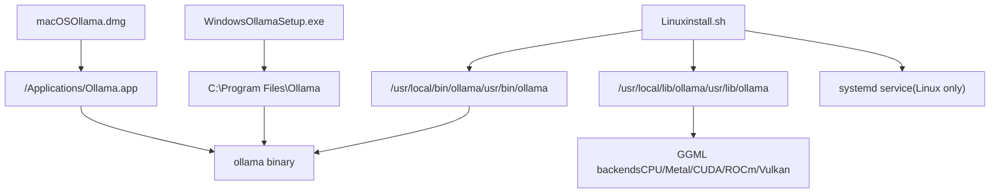
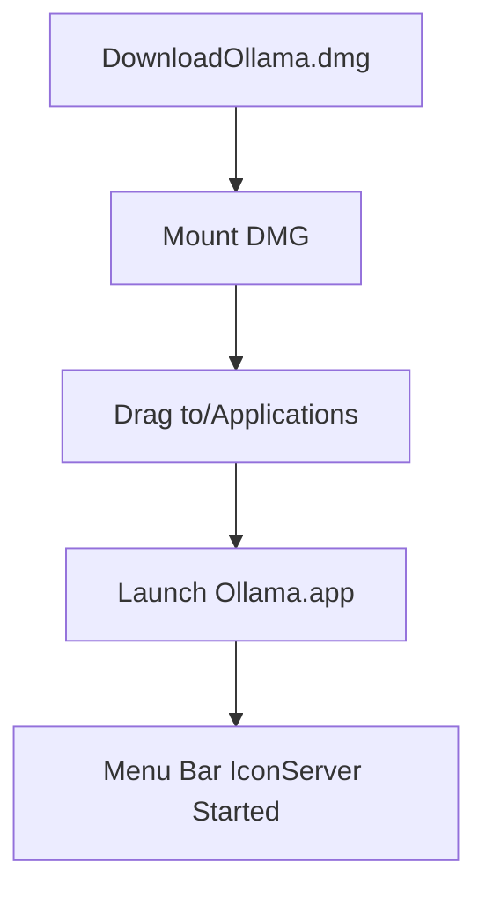
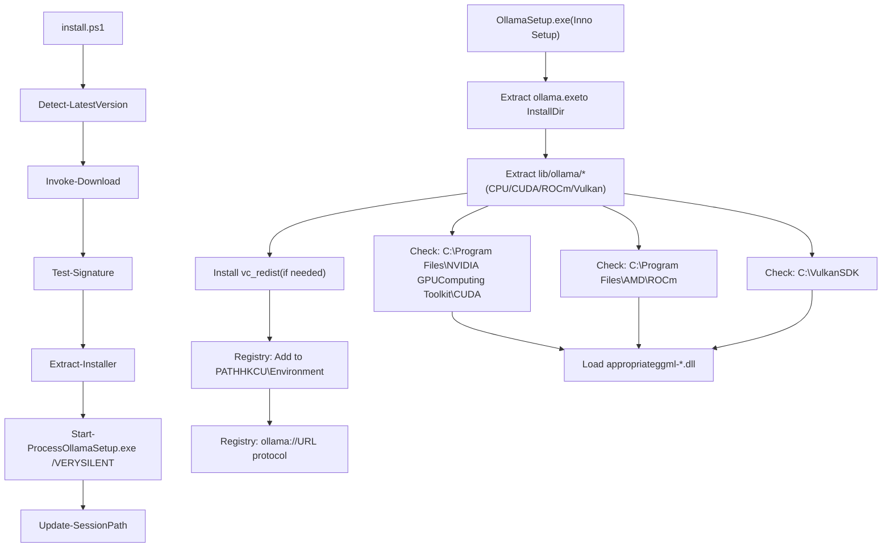
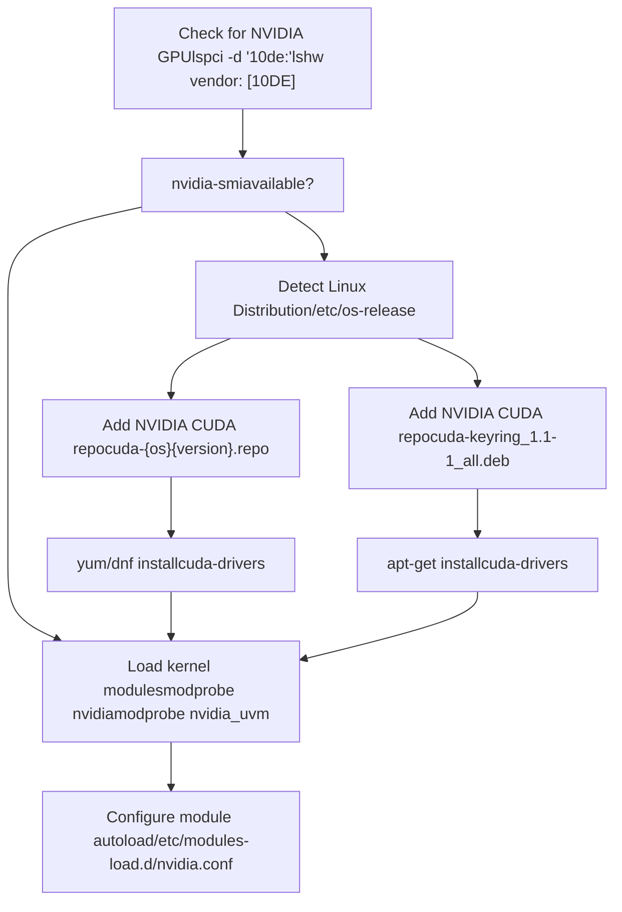
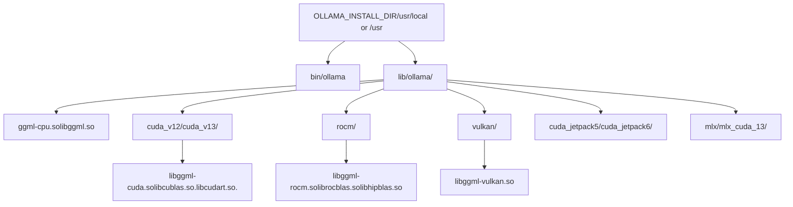

# Installation and Setup

Relevant source files

-   [.github/workflows/release.yaml](https://github.com/ollama/ollama/blob/562c76d7/.github/workflows/release.yaml)
-   [.github/workflows/test-install.yaml](https://github.com/ollama/ollama/blob/562c76d7/.github/workflows/test-install.yaml)
-   [.github/workflows/test.yaml](https://github.com/ollama/ollama/blob/562c76d7/.github/workflows/test.yaml)
-   [Dockerfile](https://github.com/ollama/ollama/blob/562c76d7/Dockerfile)
-   [README.md](https://github.com/ollama/ollama/blob/562c76d7/README.md?plain=1)
-   [app/ollama.iss](https://github.com/ollama/ollama/blob/562c76d7/app/ollama.iss)
-   [docs/README.md](https://github.com/ollama/ollama/blob/562c76d7/docs/README.md?plain=1)
-   [docs/api.md](https://github.com/ollama/ollama/blob/562c76d7/docs/api.md?plain=1)
-   [docs/development.md](https://github.com/ollama/ollama/blob/562c76d7/docs/development.md?plain=1)
-   [docs/images/ollama-keys.png](https://github.com/ollama/ollama/blob/562c76d7/docs/images/ollama-keys.png)
-   [docs/images/signup.png](https://github.com/ollama/ollama/blob/562c76d7/docs/images/signup.png)
-   [scripts/build\_darwin.sh](https://github.com/ollama/ollama/blob/562c76d7/scripts/build_darwin.sh)
-   [scripts/build\_linux.sh](https://github.com/ollama/ollama/blob/562c76d7/scripts/build_linux.sh)
-   [scripts/build\_windows.ps1](https://github.com/ollama/ollama/blob/562c76d7/scripts/build_windows.ps1)
-   [scripts/deduplicate\_cuda\_libs.sh](https://github.com/ollama/ollama/blob/562c76d7/scripts/deduplicate_cuda_libs.sh)
-   [scripts/install.ps1](https://github.com/ollama/ollama/blob/562c76d7/scripts/install.ps1)
-   [scripts/install.sh](https://github.com/ollama/ollama/blob/562c76d7/scripts/install.sh)

This page covers installing Ollama on your system from pre-built binaries and configuring it for first use. This includes platform-specific installation procedures, GPU driver setup, and basic configuration. For building from source, see [Building from Source](/ollama/ollama/8.1-building-from-source). For Docker deployment, see [Docker Deployment](/ollama/ollama/6.3-docker-deployment). For GPU backend selection and loading mechanisms, see [GPU Discovery and Backend Loading](/ollama/ollama/6.1-gpu-discovery-and-backend-loading).

## Installation Methods Overview

Ollama provides platform-specific installers that bundle the complete runtime including the server binary, ML backends, and acceleration libraries.


**Sources:** [README.md11-25](https://github.com/ollama/ollama/blob/562c76d7/README.md?plain=1#L11-L25) [scripts/install.sh99-116](https://github.com/ollama/ollama/blob/562c76d7/scripts/install.sh#L99-L116) [docs/development.md172-179](https://github.com/ollama/ollama/blob/562c76d7/docs/development.md?plain=1#L172-L179)

## macOS Installation

### Installation Procedure

macOS uses a standard DMG installer that includes all necessary components.

| Component | Details |
| --- | --- |
| **Download** | [https://ollama.com/download/Ollama.dmg](https://ollama.com/download/Ollama.dmg) |
| **Installation** | Drag Ollama.app to /Applications |
| **GPU Support** | Metal (Apple Silicon built-in) |
| **Binary Location** | /Applications/Ollama.app/Contents/MacOS/ollama |

The macOS application includes the Metal acceleration backend for Apple Silicon Macs. For Intel Macs, CPU-only inference is used unless additional backends are configured.


### Verification

```
# Verify installationwhich ollama# /Applications/Ollama.app/Contents/MacOS/ollama # Test serverollama run gemma3:1b
```
**Sources:** [README.md11-13](https://github.com/ollama/ollama/blob/562c76d7/README.md?plain=1#L11-L13) [docs/development.md18-20](https://github.com/ollama/ollama/blob/562c76d7/docs/development.md?plain=1#L18-L20)

## Windows Installation

### Installation Methods

Windows supports two installation methods:

1.  **PowerShell Install Script** (Recommended)
2.  **Executable Installer** (OllamaSetup.exe)

#### PowerShell Install Script

The automated PowerShell script provides version control and uninstall capabilities:

```
# Quick install (latest version)irm https://ollama.com/install.ps1 | iex # Specific version$env:OLLAMA_VERSION="0.5.7"; irm https://ollama.com/install.ps1 | iex # Custom install directory$env:OLLAMA_INSTALL_DIR="D:\Ollama"; irm https://ollama.com/install.ps1 | iex # Uninstall$env:OLLAMA_UNINSTALL=1; irm https://ollama.com/install.ps1 | iex
```
**Sources:** [scripts/install.ps11-39](https://github.com/ollama/ollama/blob/562c76d7/scripts/install.ps1#L1-L39) [README.md22-24](https://github.com/ollama/ollama/blob/562c76d7/README.md?plain=1#L22-L24)

#### Executable Installer

The Inno Setup installer provides a GUI installation experience:

| Component | Details |
| --- | --- |
| **Download** | [https://ollama.com/download/OllamaSetup.exe](https://ollama.com/download/OllamaSetup.exe) |
| **Installation Path** | %LOCALAPPDATA%\\Programs\\Ollama |
| **Service** | Auto-start application (not Windows service) |
| **GPU Support** | CUDA, ROCm, Vulkan |

The installer:

1.  Extracts binaries to `%LOCALAPPDATA%\Programs\Ollama`
2.  Adds ollama to user PATH (HKCU\\Environment)
3.  Configures automatic startup via Start menu shortcut
4.  Registers `ollama://` URL protocol handler

**Sources:** [app/ollama.iss19-46](https://github.com/ollama/ollama/blob/562c76d7/app/ollama.iss#L19-L46) [app/ollama.iss160-167](https://github.com/ollama/ollama/blob/562c76d7/app/ollama.iss#L160-L167)

### GPU Backend Installation

Windows supports multiple GPU backends which must be installed separately:

| Backend | GPU Vendor | Installation |
| --- | --- | --- |
| **CUDA 12** | NVIDIA | [https://developer.download.nvidia.com/compute/cuda/12.8.0/local\_installers/cuda\_12.8.0\_571.96\_windows.exe](https://developer.download.nvidia.com/compute/cuda/12.8.0/local_installers/cuda_12.8.0_571.96_windows.exe) |
| **CUDA 13** | NVIDIA | [https://developer.download.nvidia.com/compute/cuda/13.0.0/local\_installers/cuda\_13.0.0\_windows.exe](https://developer.download.nvidia.com/compute/cuda/13.0.0/local_installers/cuda_13.0.0_windows.exe) |
| **ROCm 6** | AMD | [https://download.amd.com/developer/eula/rocm-hub/AMD-Software-PRO-Edition-24.Q4-WinSvr2022-For-HIP.exe](https://download.amd.com/developer/eula/rocm-hub/AMD-Software-PRO-Edition-24.Q4-WinSvr2022-For-HIP.exe) |
| **Vulkan** | AMD/Intel | [https://sdk.lunarg.com/sdk/download/1.4.321.1/windows/vulkansdk-windows-X64-1.4.321.1.exe](https://sdk.lunarg.com/sdk/download/1.4.321.1/windows/vulkansdk-windows-X64-1.4.321.1.exe) |

**Windows Installation Flow:**


**Sources:** [scripts/install.ps1130-178](https://github.com/ollama/ollama/blob/562c76d7/scripts/install.ps1#L130-L178) [app/ollama.iss90-108](https://github.com/ollama/ollama/blob/562c76d7/app/ollama.iss#L90-L108) [.github/workflows/release.yaml75-119](https://github.com/ollama/ollama/blob/562c76d7/.github/workflows/release.yaml#L75-L119)

### Windows ARM

Windows ARM systems do not support GPU acceleration. The ARM64 installer provides CPU-only inference.

**Sources:** [README.md15-17](https://github.com/ollama/ollama/blob/562c76d7/README.md?plain=1#L15-L17) [docs/development.md42-91](https://github.com/ollama/ollama/blob/562c76d7/docs/development.md?plain=1#L42-L91)

## Linux Installation

### Automated Installation Script

Linux installation uses a shell script that detects the system configuration and installs appropriate components. The script also works on macOS.

```
# Linux and macOScurl -fsSL https://ollama.com/install.sh | sh
```
**Script Function Flow:**

```mermaid
flowchart TD
    download_and_extract["download_and_extract()curl | zstd -d | tar"]
    configure_systemd["configure_systemd()Create service"]
    install_cuda_driver_yum["install_cuda_driver_yum()"]
    install_cuda_driver_apt["install_cuda_driver_apt()"]
    available["available()command -v"]
    require["require()Check tools"]
    check_gpu["check_gpu()lspci/lshw/nvidia-smi"]
    main["main()"]
    OS["OS=$(uname -s)Darwin or Linux"]
    ARCH["ARCH=$(uname -m)x86_64→amd64aarch64→arm64"]
    IS_WSL2["KERN=$(uname -r)icrosoftWSL2"]
    JetPack["test -f/etc/nv_tegra_release"]
    BINDIR["for BINDIR in/usr/local/bin/usr/bin /bin"]
    INSTALL_DIR["OLLAMA_INSTALL_DIR=dirname BINDIR"]
    Download["download_and_extractollama-linux-$ARCH"]
    Symlink["ln -s$INSTALL_DIR/ollama$BINDIR/ollama"]
    check_nvidia["check_gpu lspci nvidiaVendor ID: 10de"]
    check_amd["check_gpu lspci amdgpuVendor ID: 1002"]
    cuda_yum["install_cuda_driver_yumrhel/centos/fedora"]
    cuda_apt["install_cuda_driver_aptubuntu/debian"]
    rocm["download_and_extractollama-linux-$ARCH-rocm"]
    systemd_check["available systemctl"]
    useradd["useradd -r -s /bin/false-U -m -d /usr/share/ollamaollama"]
    usermod["usermod -a -Grender,video,ollama"]
    service["cat > /etc/systemd/system/ollama.service"]
    enable["systemctl daemon-reloadsystemctl enable ollamasystemctl restart ollama"]

    main --> OS
    OS --> ARCH
    ARCH --> IS_WSL2
    IS --> WSL2_JetPack
    JetPack --> BINDIR
    BINDIR --> INSTALL_DIR
    INSTALL --> DIR_Download
    Download --> Symlink
    Symlink --> check_nvidia
    Symlink --> check_amd
    check --> nvidia_cuda_yum
    check --> nvidia_cuda_apt
    check --> amd_rocm
    cuda --> yum_systemd_check
    cuda --> apt_systemd_check
    rocm --> systemd_check
    systemd --> check_useradd
    useradd --> usermod
    usermod --> service
    service --> enable
```


**Sources:** [scripts/install.sh7-453](https://github.com/ollama/ollama/blob/562c76d7/scripts/install.sh#L7-L453) [README.md15-32](https://github.com/ollama/ollama/blob/562c76d7/README.md?plain=1#L15-L32)

### Installation Paths

The install script determines installation paths based on PATH configuration:

| Path Component | Default Location | Alternative | Code Reference |
| --- | --- | --- | --- |
| **Binary** | /usr/local/bin/ollama | /usr/bin/ollama | [scripts/install.sh159-162](https://github.com/ollama/ollama/blob/562c76d7/scripts/install.sh#L159-L162) |
| **Libraries** | /usr/local/lib/ollama | /usr/lib/ollama | [scripts/install.sh163-171](https://github.com/ollama/ollama/blob/562c76d7/scripts/install.sh#L163-L171) |
| **Service** | /etc/systemd/system/ollama.service | N/A | [scripts/install.sh214-230](https://github.com/ollama/ollama/blob/562c76d7/scripts/install.sh#L214-L230) |
| **Data** | /usr/share/ollama | N/A | [scripts/install.sh200](https://github.com/ollama/ollama/blob/562c76d7/scripts/install.sh#L200-L200) |

```
# Script logic for determining BINDIR (lines 159-162)for BINDIR in /usr/local/bin /usr/bin /bin; do    echo $PATH | grep -q $BINDIR && break || continuedoneOLLAMA_INSTALL_DIR=$(dirname ${BINDIR}) # Installation commands (lines 169-171)$SUDO install -o0 -g0 -m755 -d $BINDIR$SUDO install -o0 -g0 -m755 -d "$OLLAMA_INSTALL_DIR/lib/ollama"download_and_extract "https://ollama.com/download" "$OLLAMA_INSTALL_DIR" "ollama-linux-${ARCH}"
```
**macOS Installation Paths:**

| Path Component | Location |
| --- | --- |
| **Application** | /Applications/Ollama.app |
| **Binary** | /Applications/Ollama.app/Contents/Resources/ollama |
| **Symlink** | /usr/local/bin/ollama |
| **Data** | ~/.ollama |

**Sources:** [scripts/install.sh159-171](https://github.com/ollama/ollama/blob/562c76d7/scripts/install.sh#L159-L171) [scripts/install.sh66-89](https://github.com/ollama/ollama/blob/562c76d7/scripts/install.sh#L66-L89)

### Architecture Detection

The installer supports x86\_64 and ARM64 architectures:

```
# From install.sh lines 35-40ARCH=$(uname -m)case "$ARCH" in    x86_64) ARCH="amd64" ;;    aarch64|arm64) ARCH="arm64" ;;    *) error "Unsupported architecture: $ARCH" ;;esac
```
Downloads are fetched from `https://ollama.com/download/ollama-linux-${ARCH}.tar.zst` (or `.tgz` for older versions).

**Download Function (lines 129-157):**

```
download_and_extract() {    local url_base="$1"    local dest_dir="$2"    local filename="$3"     # Try .tar.zst first (newer format)    if curl --fail --silent --head --location "${url_base}/${filename}.tar.zst${VER_PARAM}" >/dev/null 2>&1; then        if ! available zstd; then            error "This version requires zstd for extraction..."        fi        curl ... | zstd -d | $SUDO tar -xf - -C "${dest_dir}"    else        # Fall back to .tgz for older versions        curl ... | $SUDO tar -xzf - -C "${dest_dir}"    fi}
```
**Sources:** [scripts/install.sh35-40](https://github.com/ollama/ollama/blob/562c76d7/scripts/install.sh#L35-L40) [scripts/install.sh129-157](https://github.com/ollama/ollama/blob/562c76d7/scripts/install.sh#L129-L157)

### WSL2 Support

The script detects WSL2 and adjusts installation accordingly:

```
KERN=$(uname -r)case "$KERN" in    *icrosoft*WSL2 | *icrosoft*wsl2) IS_WSL2=true;;    *icrosoft) error "Microsoft WSL1 is not currently supported" ;;esac
```
On WSL2:

-   GPU support requires NVIDIA GPU passthrough
-   Checks for `nvidia-smi` to verify CUDA availability
-   Does not attempt driver installation
-   systemd may need manual enablement

**Sources:** [scripts/install.sh39-46](https://github.com/ollama/ollama/blob/562c76d7/scripts/install.sh#L39-L46) [scripts/install.sh194-202](https://github.com/ollama/ollama/blob/562c76d7/scripts/install.sh#L194-L202)

### NVIDIA JetPack Systems

For NVIDIA Jetson devices, the script downloads additional packages:

```
# From install.sh lines 178-187if [ -f /etc/nv_tegra_release ] ; then    if grep R36 /etc/nv_tegra_release > /dev/null ; then        download_and_extract "https://ollama.com/download" "$OLLAMA_INSTALL_DIR" "ollama-linux-${ARCH}-jetpack6"    elif grep R35 /etc/nv_tegra_release > /dev/null ; then        download_and_extract "https://ollama.com/download" "$OLLAMA_INSTALL_DIR" "ollama-linux-${ARCH}-jetpack5"    else        warning "Unsupported JetPack version detected. GPU may not be supported"    fifi
```
Corresponding Dockerfile build stages:

-   **JetPack 5:** [Dockerfile104-114](https://github.com/ollama/ollama/blob/562c76d7/Dockerfile#L104-L114)
-   **JetPack 6:** [Dockerfile116-126](https://github.com/ollama/ollama/blob/562c76d7/Dockerfile#L116-L126)

**Sources:** [scripts/install.sh178-187](https://github.com/ollama/ollama/blob/562c76d7/scripts/install.sh#L178-L187) [scripts/install.sh264-269](https://github.com/ollama/ollama/blob/562c76d7/scripts/install.sh#L264-L269) [Dockerfile104-126](https://github.com/ollama/ollama/blob/562c76d7/Dockerfile#L104-L126)

## GPU Driver Installation

### NVIDIA CUDA Drivers

The install script automatically detects NVIDIA GPUs and installs CUDA drivers if not present.


#### Distribution-Specific Installation

**Ubuntu/Debian (install\_cuda\_driver\_apt function, lines 358-382):**

```
install_cuda_driver_apt() {    status 'Installing NVIDIA repository...'    if curl -I --silent --fail --location "https://developer.download.nvidia.com/compute/cuda/repos/$1$2/$(uname -m | sed -e 's/aarch64/sbsa/')/cuda-keyring_1.1-1_all.deb" >/dev/null ; then        curl -fsSL -o $TEMP_DIR/cuda-keyring.deb https://developer.download.nvidia.com/compute/cuda/repos/$1$2/$(uname -m | sed -e 's/aarch64/sbsa/')/cuda-keyring_1.1-1_all.deb    else        error $CUDA_REPO_ERR_MSG    fi     status 'Installing CUDA driver...'    $SUDO dpkg -i $TEMP_DIR/cuda-keyring.deb    $SUDO apt-get update     [ -n "$SUDO" ] && SUDO_E="$SUDO -E" || SUDO_E=    DEBIAN_FRONTEND=noninteractive $SUDO_E apt-get -y install cuda-drivers -q}
```
**RHEL/CentOS/Fedora (install\_cuda\_driver\_yum function, lines 318-354):**

```
install_cuda_driver_yum() {    status 'Installing NVIDIA repository...'        case $PACKAGE_MANAGER in        yum)            $SUDO $PACKAGE_MANAGER -y install yum-utils            if curl -I --silent --fail --location "https://developer.download.nvidia.com/compute/cuda/repos/$1$2/$(uname -m | sed -e 's/aarch64/sbsa/')/cuda-$1$2.repo" >/dev/null ; then                $SUDO $PACKAGE_MANAGER-config-manager --add-repo https://developer.download.nvidia.com/compute/cuda/repos/$1$2/$(uname -m | sed -e 's/aarch64/sbsa/')/cuda-$1$2.repo            fi            ;;        dnf)            if curl -I --silent --fail --location "https://developer.download.nvidia.com/compute/cuda/repos/$1$2/$(uname -m | sed -e 's/aarch64/sbsa/')/cuda-$1$2.repo" >/dev/null ; then                $SUDO $PACKAGE_MANAGER config-manager --add-repo https://developer.download.nvidia.com/compute/cuda/repos/$1$2/$(uname -m | sed -e 's/aarch64/sbsa/')/cuda-$1$2.repo            fi            ;;    esac     status 'Installing CUDA driver...'    $SUDO $PACKAGE_MANAGER -y install cuda-drivers}
```
**Distribution-specific invocation (lines 404-414):**

```
if ! check_gpu nvidia-smi || [ -z "$(nvidia-smi | grep -o "CUDA Version: [0-9]*\.[0-9]*")" ]; then    case $OS_NAME in        centos|rhel) install_cuda_driver_yum 'rhel' $(echo $OS_VERSION | cut -d '.' -f 1) ;;        rocky) install_cuda_driver_yum 'rhel' $(echo $OS_VERSION | cut -c1) ;;        fedora) [ $OS_VERSION -lt '39' ] && install_cuda_driver_yum $OS_NAME $OS_VERSION || install_cuda_driver_yum $OS_NAME '39';;        amzn) install_cuda_driver_yum 'fedora' '37' ;;        debian) install_cuda_driver_apt $OS_NAME $OS_VERSION ;;        ubuntu) install_cuda_driver_apt $OS_NAME $(echo $OS_VERSION | sed 's/\.//') ;;        *) exit ;;    esacfi
```
**Sources:** [scripts/install.sh318-354](https://github.com/ollama/ollama/blob/562c76d7/scripts/install.sh#L318-L354) [scripts/install.sh358-382](https://github.com/ollama/ollama/blob/562c76d7/scripts/install.sh#L358-L382) [scripts/install.sh404-414](https://github.com/ollama/ollama/blob/562c76d7/scripts/install.sh#L404-L414)

### AMD ROCm Support

For AMD GPUs, the script downloads ROCm-specific libraries:

```
if check_gpu lspci amdgpu || check_gpu lshw amdgpu; then    download_and_extract "https://ollama.com/download" \        "$OLLAMA_INSTALL_DIR" \        "ollama-linux-${ARCH}-rocm"fi
```
ROCm drivers must be pre-installed from AMD's official repositories. The script only adds Ollama's ROCm-compiled backends.

**Sources:** [scripts/install.sh245-250](https://github.com/ollama/ollama/blob/562c76d7/scripts/install.sh#L245-L250)

### GPU Detection Logic

The script uses multiple detection methods via the `check_gpu()` function:

| Method | NVIDIA Check | AMD Check |
| --- | --- | --- |
| **lspci** | `lspci -d '10de:' | grep -q 'NVIDIA'` | `lspci -d '1002:' | grep -q 'AMD'` |
| **lshw** | `lshw -c display -numeric | grep 'vendor: .* [10DE]'` | `lshw -c display -numeric | grep 'vendor: .* [1002]'` |
| **nvidia-smi** | `nvidia-smi` command available | N/A |

```
# check_gpu function (lines 277-292)check_gpu() {    # Look for devices based on vendor ID for NVIDIA and AMD    case $1 in        lspci)            case $2 in                nvidia) available lspci && lspci -d '10de:' | grep -q 'NVIDIA' || return 1 ;;                amdgpu) available lspci && lspci -d '1002:' | grep -q 'AMD' || return 1 ;;            esac ;;        lshw)            case $2 in                nvidia) available lshw && $SUDO lshw -c display -numeric -disable network | grep -q 'vendor: .* \[10DE\]' || return 1 ;;                amdgpu) available lshw && $SUDO lshw -c display -numeric -disable network | grep -q 'vendor: .* \[1002\]' || return 1 ;;            esac ;;        nvidia-smi) available nvidia-smi || return 1 ;;    esac}
```
**Sources:** [scripts/install.sh277-292](https://github.com/ollama/ollama/blob/562c76d7/scripts/install.sh#L277-L292)

### Kernel Module Loading

After driver installation, kernel modules must be loaded:

```
# Load modules immediately (lines 416-424)if ! lsmod | grep -q nvidia || ! lsmod | grep -q nvidia_uvm; then    # Install kernel headers first    KERNEL_RELEASE="$(uname -r)"    case $OS_NAME in        rocky) $SUDO $PACKAGE_MANAGER -y install kernel-devel kernel-headers ;;        centos|rhel|amzn) $SUDO $PACKAGE_MANAGER -y install kernel-devel-$KERNEL_RELEASE kernel-headers-$KERNEL_RELEASE ;;        fedora) $SUDO $PACKAGE_MANAGER -y install kernel-devel-$KERNEL_RELEASE ;;        debian|ubuntu) $SUDO apt-get -y install linux-headers-$KERNEL_RELEASE ;;    esac     # DKMS build (if needed, lines 426-429)    NVIDIA_CUDA_VERSION=$($SUDO dkms status | awk -F: '/added/ { print $1 }')    if [ -n "$NVIDIA_CUDA_VERSION" ]; then        $SUDO dkms install $NVIDIA_CUDA_VERSION    fi     # Check for nouveau driver conflict (lines 431-434)    if lsmod | grep -q nouveau; then        status 'Reboot to complete NVIDIA CUDA driver install.'        exit 0    fi     # Load modules (lines 436-437)    $SUDO modprobe nvidia    $SUDO modprobe nvidia_uvmfi # Configure autoload on boot (lines 440-449)if available nvidia-persistenced; then    $SUDO touch /etc/modules-load.d/nvidia.conf    MODULES="nvidia nvidia-uvm"    for MODULE in $MODULES; do        if ! grep -qxF "$MODULE" /etc/modules-load.d/nvidia.conf; then            echo "$MODULE" | $SUDO tee -a /etc/modules-load.d/nvidia.conf > /dev/null        fi    donefi
```
If the `nouveau` driver is loaded, a reboot is required to complete installation.

**Sources:** [scripts/install.sh416-449](https://github.com/ollama/ollama/blob/562c76d7/scripts/install.sh#L416-L449)

## systemd Service Configuration

### Service File Creation

On Linux systems with systemd, the installer creates a service file via the `configure_systemd()` function:

```
# configure_systemd function (lines 197-248)configure_systemd() {    if ! id ollama >/dev/null 2>&1; then        status "Creating ollama user..."        $SUDO useradd -r -s /bin/false -U -m -d /usr/share/ollama ollama    fi    if getent group render >/dev/null 2>&1; then        status "Adding ollama user to render group..."        $SUDO usermod -a -G render ollama    fi    if getent group video >/dev/null 2>&1; then        status "Adding ollama user to video group..."        $SUDO usermod -a -G video ollama    fi     status "Adding current user to ollama group..."    $SUDO usermod -a -G ollama $(whoami)     status "Creating ollama systemd service..."    cat <<EOF | $SUDO tee /etc/systemd/system/ollama.service >/dev/null[Unit]Description=Ollama ServiceAfter=network-online.target [Service]ExecStart=$BINDIR/ollama serveUser=ollamaGroup=ollamaRestart=alwaysRestartSec=3Environment="PATH=$PATH" [Install]WantedBy=default.targetEOF    # ... service enable logic}
```
**Sources:** [scripts/install.sh197-248](https://github.com/ollama/ollama/blob/562c76d7/scripts/install.sh#L197-L248)

### User and Group Setup

The service runs as a dedicated `ollama` user (created in `configure_systemd()` function):

```
# From lines 198-212if ! id ollama >/dev/null 2>&1; then    status "Creating ollama user..."    $SUDO useradd -r -s /bin/false -U -m -d /usr/share/ollama ollamafiif getent group render >/dev/null 2>&1; then    status "Adding ollama user to render group..."    $SUDO usermod -a -G render ollamafiif getent group video >/dev/null 2>&1; then    status "Adding ollama user to video group..."    $SUDO usermod -a -G video ollamafi status "Adding current user to ollama group..."$SUDO usermod -a -G ollama $(whoami)
```
| User/Group | Purpose |
| --- | --- |
| **ollama** (user) | Service runtime user, home: /usr/share/ollama |
| **render** (group) | GPU access for non-NVIDIA devices |
| **video** (group) | Video device access |
| **ollama** (group) | Model file access permissions |

**Sources:** [scripts/install.sh198-212](https://github.com/ollama/ollama/blob/562c76d7/scripts/install.sh#L198-L212)

### Service Management

```
# Enable service (start on boot)systemctl enable ollama # Start service immediatelysystemctl start ollama # Check service statussystemctl status ollama # View logsjournalctl -u ollama -f
```
The service automatically restarts if it crashes (`Restart=always` with 3-second delay).

**Service Start Logic (lines 231-247):**

```
SYSTEMCTL_RUNNING="$(systemctl is-system-running || true)"case $SYSTEMCTL_RUNNING in    running|degraded)        status "Enabling and starting ollama service..."        $SUDO systemctl daemon-reload        $SUDO systemctl enable ollama         start_service() { $SUDO systemctl restart ollama; }        trap start_service EXIT        ;;    *)        warning "systemd is not running"        if [ "$IS_WSL2" = true ]; then            warning "see https://learn.microsoft.com/en-us/windows/wsl/systemd#how-to-enable-systemd to enable it"        fi        ;;esac
```
**Sources:** [scripts/install.sh231-247](https://github.com/ollama/ollama/blob/562c76d7/scripts/install.sh#L231-L247) [scripts/install.sh250-252](https://github.com/ollama/ollama/blob/562c76d7/scripts/install.sh#L250-L252)

## Environment Configuration

### Environment Variables

Ollama behavior is controlled through environment variables, which can be set in the service file or shell:

| Variable | Purpose | Default |
| --- | --- | --- |
| `OLLAMA_HOST` | Server bind address | 127.0.0.1:11434 |
| `OLLAMA_ORIGINS` | CORS allowed origins | localhost |
| `OLLAMA_MODELS` | Model storage directory | ~/.ollama/models (user)
/usr/share/ollama/.ollama/models (service) |
| `OLLAMA_DEBUG` | Enable debug logging | false |
| `OLLAMA_NUM_PARALLEL` | Concurrent requests | 1 |
| `OLLAMA_MAX_LOADED_MODELS` | Models kept in memory | 1 |
| `OLLAMA_KEEP_ALIVE` | Model unload delay | 5m |

### Service Environment Configuration

To configure environment variables for the systemd service:

```
# Edit service filesystemctl edit ollama # Add environment variables[Service]Environment="OLLAMA_HOST=0.0.0.0:11434"Environment="OLLAMA_MODELS=/mnt/models" # Reload and restartsystemctl daemon-reloadsystemctl restart ollama
```
### User Environment Configuration

For manual server execution:

```
# Linux/macOSexport OLLAMA_HOST=0.0.0.0:11434ollama serve # Windows PowerShell$env:OLLAMA_HOST="0.0.0.0:11434"ollama serve
```
**Sources:** [scripts/install.sh166](https://github.com/ollama/ollama/blob/562c76d7/scripts/install.sh#L166-L166)

## Library Detection and Loading

### Library Search Paths

Ollama searches for acceleration libraries in specific paths relative to the binary. The search is implemented in the backend loading code:

| Platform | Search Paths (in order) | Code Reference |
| --- | --- | --- |
| **Windows** | `./lib/ollama` | Backend loading in llm/server.go |
| **Linux** | `../lib/ollama`, `./lib/ollama` | Backend loading in llm/server.go |
| **macOS** | `.` (current directory) | Backend loading in llm/server.go |
| **Development** | `build/lib/ollama` | Set during build |

**Library Directory Structure:**


**File Locations After Installation:**

```
# Linux installation structure/usr/local/bin/ollama                              # Main binary/usr/local/lib/ollama/libggml.so                   # CPU backend/usr/local/lib/ollama/cuda_v12/libggml-cuda.so    # CUDA 12 backend/usr/local/lib/ollama/cuda_v13/libggml-cuda.so    # CUDA 13 backend/usr/local/lib/ollama/rocm/libggml-rocm.so        # ROCm backend/usr/local/lib/ollama/vulkan/libggml-vulkan.so    # Vulkan backend
```
If libraries are not found in these paths, Ollama falls back to CPU-only mode.

**Sources:** [docs/development.md170-179](https://github.com/ollama/ollama/blob/562c76d7/docs/development.md?plain=1#L170-L179) [Dockerfile179-209](https://github.com/ollama/ollama/blob/562c76d7/Dockerfile#L179-L209) [scripts/install.sh169-171](https://github.com/ollama/ollama/blob/562c76d7/scripts/install.sh#L169-L171)

## Manual Installation

### Pre-Built Binary Installation

For manual installation without the install script:

**Linux:**

```
# Download binarycurl -L https://ollama.com/download/ollama-linux-amd64.tar.zst -o ollama.tar.zst # Extract (requires zstd)zstd -d ollama.tar.zst | tar -xf - -C /usr/local # Create symlinkln -s /usr/local/ollama /usr/local/bin/ollama # Make executablechmod +x /usr/local/bin/ollama
```
**Verify installation:**

```
ollama --version
```
### Running Without systemd

For systems without systemd or for testing:

```
# Start server in foregroundollama serve # Or as background processnohup ollama serve > /var/log/ollama.log 2>&1 &
```
**Sources:** [README.md25](https://github.com/ollama/ollama/blob/562c76d7/README.md?plain=1#L25-L25) [scripts/install.sh69-111](https://github.com/ollama/ollama/blob/562c76d7/scripts/install.sh#L69-L111)

## Installation Verification

### Server Connectivity Test

```
# Check if server is runningcurl http://localhost:11434/api/version # Expected response:# {"version":"0.x.x"}
```
### Model Pull Test

```
# Pull and run a small modelollama pull gemma3:1b # Test inferenceollama run gemma3:1b "Hello"
```
### GPU Verification

```
# Check which GPU backend loaded (Linux)journalctl -u ollama | grep -i "gpu\|cuda\|rocm\|vulkan" # NVIDIA: Check CUDA availabilitynvidia-smi # AMD: Check ROCm availabilityrocm-smi
```
### Library Loading Verification

The server logs indicate which acceleration backend loaded:

```
# Expected log output
time=2024-01-01T00:00:00.000Z level=INFO msg="Loaded CUDA GPU" gpu=0 vram=16GB
```
**Sources:** [README.md41-47](https://github.com/ollama/ollama/blob/562c76d7/README.md?plain=1#L41-L47) [docs/api.md1-3](https://github.com/ollama/ollama/blob/562c76d7/docs/api.md?plain=1#L1-L3)

## Post-Installation Configuration

### Model Storage Location

By default, models are stored in:

-   **Linux (service):** `/usr/share/ollama/.ollama/models`
-   **Linux (user):** `~/.ollama/models`
-   **macOS:** `~/.ollama/models`
-   **Windows:** `C:\Users\<username>\.ollama\models`

To change the location:

```
# Set OLLAMA_MODELS environment variableexport OLLAMA_MODELS=/mnt/storage/ollama-models # For systemd servicesystemctl edit ollama[Service]Environment="OLLAMA_MODELS=/mnt/storage/ollama-models"
```
### Network Access Configuration

By default, Ollama binds to `127.0.0.1:11434` (localhost only). To allow remote access:

```
# Allow all network interfacesexport OLLAMA_HOST=0.0.0.0:11434 # For systemd servicesystemctl edit ollama[Service]Environment="OLLAMA_HOST=0.0.0.0:11434"
```
**Warning:** Binding to 0.0.0.0 exposes the API to the network without authentication. Use firewall rules to restrict access.

### Firewall Configuration

If enabling network access, configure firewall rules:

```
# ufw (Ubuntu/Debian)ufw allow 11434/tcp # firewalld (RHEL/CentOS/Fedora)firewall-cmd --permanent --add-port=11434/tcpfirewall-cmd --reload # iptablesiptables -A INPUT -p tcp --dport 11434 -j ACCEPT
```
**Sources:** [docs/api.md1-3](https://github.com/ollama/ollama/blob/562c76d7/docs/api.md?plain=1#L1-L3)

## Common Installation Issues

### Issue: GPU Not Detected

**Symptoms:** Ollama runs in CPU-only mode despite having a GPU

**Solutions:**

1.  Verify GPU drivers are installed:

    ```
    # NVIDIAnvidia-smi # AMDrocm-smi
    ```

2.  Check kernel modules are loaded:

    ```
    lsmod | grep nvidialsmod | grep amdgpu
    ```

3.  Review Ollama logs for backend loading:

    ```
    journalctl -u ollama | grep -i gpu
    ```


### Issue: Permission Denied Errors

**Symptoms:** Cannot access models or create files

**Solutions:**

1.  Ensure user is in ollama group:

    ```
    groups  # Should include 'ollama' # If not, add and re-loginsudo usermod -a -G ollama $USER
    ```

2.  Check model directory permissions:

    ```
    ls -la /usr/share/ollama/.ollama
    ```


### Issue: Service Fails to Start

**Symptoms:** `systemctl status ollama` shows failed state

**Solutions:**

1.  Check logs for error details:

    ```
    journalctl -u ollama -n 50
    ```

2.  Verify binary is executable:

    ```
    ls -l /usr/local/bin/ollama
    ```

3.  Test manual server start:

    ```
    /usr/local/bin/ollama serve
    ```


For detailed troubleshooting procedures, see [Troubleshooting and Performance](/ollama/ollama/6.4-troubleshooting-and-performance).

**Sources:** [scripts/install.sh137-192](https://github.com/ollama/ollama/blob/562c76d7/scripts/install.sh#L137-L192)
