# Docker Deployment

Relevant source files

-   [.github/workflows/release.yaml](https://github.com/ollama/ollama/blob/562c76d7/.github/workflows/release.yaml)
-   [.github/workflows/test-install.yaml](https://github.com/ollama/ollama/blob/562c76d7/.github/workflows/test-install.yaml)
-   [.github/workflows/test.yaml](https://github.com/ollama/ollama/blob/562c76d7/.github/workflows/test.yaml)
-   [Dockerfile](https://github.com/ollama/ollama/blob/562c76d7/Dockerfile)
-   [README.md](https://github.com/ollama/ollama/blob/562c76d7/README.md?plain=1)
-   [app/ollama.iss](https://github.com/ollama/ollama/blob/562c76d7/app/ollama.iss)
-   [docs/README.md](https://github.com/ollama/ollama/blob/562c76d7/docs/README.md?plain=1)
-   [docs/api.md](https://github.com/ollama/ollama/blob/562c76d7/docs/api.md?plain=1)
-   [docs/development.md](https://github.com/ollama/ollama/blob/562c76d7/docs/development.md?plain=1)
-   [docs/images/ollama-keys.png](https://github.com/ollama/ollama/blob/562c76d7/docs/images/ollama-keys.png)
-   [docs/images/signup.png](https://github.com/ollama/ollama/blob/562c76d7/docs/images/signup.png)
-   [scripts/build\_darwin.sh](https://github.com/ollama/ollama/blob/562c76d7/scripts/build_darwin.sh)
-   [scripts/build\_linux.sh](https://github.com/ollama/ollama/blob/562c76d7/scripts/build_linux.sh)
-   [scripts/build\_windows.ps1](https://github.com/ollama/ollama/blob/562c76d7/scripts/build_windows.ps1)
-   [scripts/deduplicate\_cuda\_libs.sh](https://github.com/ollama/ollama/blob/562c76d7/scripts/deduplicate_cuda_libs.sh)
-   [scripts/install.ps1](https://github.com/ollama/ollama/blob/562c76d7/scripts/install.ps1)
-   [scripts/install.sh](https://github.com/ollama/ollama/blob/562c76d7/scripts/install.sh)

This page documents deployment of Ollama using Docker containers. It covers the official Docker images available on Docker Hub, their variants for different GPU backends, configuration for GPU passthrough, volume management, and building custom images. For information about building Ollama from source, see [Building from Source](/ollama/ollama/8.1-building-from-source). For general installation on bare metal systems, see [Installation and Setup](/ollama/ollama/6.2-installation-and-setup).

## Docker Image Variants

Ollama provides multiple Docker image variants to support different GPU acceleration backends. All images are available at `ollama/ollama` on Docker Hub and are built for both `linux/amd64` and `linux/arm64` architectures.

| Image Tag | GPU Support | Description |
| --- | --- | --- |
| `ollama/ollama:latest` | NVIDIA CUDA, CPU | Default image with CUDA v12, v13, and CPU backends (no Vulkan) |
| `ollama/ollama:latest-rocm` | AMD ROCm, CPU | Image with ROCm 6.3.3 backend for AMD GPUs |
| (deprecated) `ollama/ollama:latest-vulkan` | Vulkan, NVIDIA CUDA, CPU | Image with Vulkan backend for cross-platform GPU support |

The default image (`latest`) is the `novulkan` variant, which includes CUDA support but excludes Vulkan to minimize image size. All variants include CPU fallback support.

**Sources:** [Dockerfile1-202](https://github.com/ollama/ollama/blob/562c76d7/Dockerfile#L1-L202) [README.md27-29](https://github.com/ollama/ollama/blob/562c76d7/README.md?plain=1#L27-L29)

## Multi-Stage Build Architecture

The Ollama Docker images are constructed using a complex multi-stage build process that compiles GPU-specific acceleration libraries separately, then assembles them into final runtime images.

```mermaid
flowchart TD
    base_amd64["base-amd64rocm/dev-almalinux-8:6.3.3"]
    base_arm64["base-arm64almalinux:8"]
    cpu_amd64["cpuBuilds ggml-cpugcc-toolset-11"]
    cuda11["cuda-11CUDA 11.8cuda_v11"]
    cuda12["cuda-12CUDA 12.8cuda_v12"]
    cuda13["cuda-13CUDA 13.0cuda_v13"]
    rocm6["rocm-6ROCm 6.3.3rocm"]
    vulkan_amd64["vulkanVulkan SDK"]
    cpu_arm64["cpuBuilds ggml-cpu"]
    cuda12_arm64["cuda-12CUDA 12.8cuda_v12"]
    cuda13_arm64["cuda-13CUDA 13.0cuda_v13"]
    jetpack5["jetpack-5JetPack r35.4.1cuda_jetpack5"]
    jetpack6["jetpack-6JetPack r36.4.0cuda_jetpack6"]
    build["buildCompiles ollama binarygo build"]
    archive_amd64["amd64Assembles libraries"]
    archive_arm64["arm64Assembles libraries"]
    archive_rocm["rocmROCm libraries only"]
    novulkan["novulkanubuntu:24.04CUDA + CPU"]
    default["defaultubuntu:24.04CUDA + Vulkan + CPU"]
    rocm_final["(rocm image)ubuntu:24.04ROCm + CPU"]

    base --> amd64_cpu_amd64
    base --> amd64_cuda11
    base --> amd64_cuda12
    base --> amd64_cuda13
    base --> amd64_rocm6
    base --> amd64_vulkan_amd64
    base --> arm64_cpu_arm64
    base --> arm64_cuda12_arm64
    base --> arm64_cuda13_arm64
    cpu --> amd64_archive_amd64
    cuda12 --> archive_amd64
    cuda13 --> archive_amd64
    vulkan --> amd64_archive_amd64
    cpu --> arm64_archive_arm64
    cuda12 --> arm64_archive_arm64
    cuda13 --> arm64_archive_arm64
    jetpack5 --> archive_arm64
    jetpack6 --> archive_arm64
    rocm6 --> archive_rocm
    build --> archive_amd64
    build --> archive_arm64
    build --> archive_rocm
    archive --> amd64_novulkan
    archive --> amd64_default
    archive --> arm64_novulkan
    archive --> rocm_rocm_final
```


**Build Process:**

1.  **Base Layer Setup**: Platform-specific base images install CMake, compiler toolchains, and ccache for build acceleration
2.  **Parallel GPU Backend Compilation**: Each GPU backend (CUDA 11/12/13, ROCm 6, Vulkan, JetPack) is built in isolation using CMake presets
3.  **Go Binary Compilation**: The Ollama server binary is compiled with CGO enabled to link against native libraries
4.  **Library Assembly**: GPU-specific libraries are collected into `/lib/ollama` subdirectories (`cuda_v12`, `cuda_v13`, `rocm`, etc.)
5.  **Final Image Assembly**: Runtime dependencies and compiled artifacts are copied into a minimal Ubuntu 24.04 base

Each build stage uses `--mount=type=cache,target=/root/.ccache` to cache compiled objects across builds, significantly reducing build times.

**Sources:** [Dockerfile1-202](https://github.com/ollama/ollama/blob/562c76d7/Dockerfile#L1-L202) [CMakeLists.txt40-48](https://github.com/ollama/ollama/blob/562c76d7/CMakeLists.txt#L40-L48) [.github/workflows/release.yaml295-361](https://github.com/ollama/ollama/blob/562c76d7/.github/workflows/release.yaml#L295-L361)

## Build Workflow and Image Publishing

```mermaid
flowchart TD
    tag["Git Tag Pushv*"]
    build_amd64_novulkan["docker-build-pushlinux/amd64target: novulkan"]
    build_arm64_novulkan["docker-build-pushlinux/arm64target: novulkan"]
    build_amd64_rocm["docker-build-pushlinux/amd64FLAVOR=rocm"]
    build_amd64_vulkan["docker-build-pushlinux/amd64target: defaultsuffix: -vulkan"]
    digest_amd64_novulkan["digest-linux-amd64-.txt"]
    digest_arm64_novulkan["digest-linux-arm64-.txt"]
    digest_amd64_rocm["digest-linux-amd64--rocm.txt"]
    digest_amd64_vulkan["digest-linux-amd64--vulkan.txt"]
    merge_default["docker-merge-pushsuffix: ''Combines amd64 + arm64"]
    merge_rocm["docker-merge-pushsuffix: '-rocm'amd64 only"]
    repo["ollama/ollama:versionollama/ollama:version-rocm"]

    tag --> build_amd64_novulkan
    tag --> build_arm64_novulkan
    tag --> build_amd64_rocm
    tag --> build_amd64_vulkan
    build --> amd64_novulkan_digest_amd64_novulkan
    build --> arm64_novulkan_digest_arm64_novulkan
    build --> amd64_rocm_digest_amd64_rocm
    build --> amd64_vulkan_digest_amd64_vulkan
    digest --> amd64_novulkan_merge_default
    digest --> arm64_novulkan_merge_default
    digest --> amd64_rocm_merge_rocm
    merge --> default_repo
    merge --> rocm_repo
```


Each Docker variant is built separately on native architecture runners (not using QEMU emulation) for reliability and speed. The workflow uses `docker/build-push-action@v6` with `push-by-digest=true` to push individual images, then `docker buildx imagetools create` merges them into multi-architecture manifests.

**Sources:** [.github/workflows/release.yaml295-394](https://github.com/ollama/ollama/blob/562c76d7/.github/workflows/release.yaml#L295-L394)

## Running Ollama in Docker

### Basic Usage (CPU Only)

```
docker run -d -v ollama:/root/.ollama -p 11434:11434 --name ollama ollama/ollama
```
This starts the Ollama server with:

-   Persistent volume `ollama` mounted at `/root/.ollama` for model storage
-   Port `11434` exposed for API access
-   Detached mode (`-d`)

### NVIDIA GPU Support

Docker containers require the `--gpus` flag and NVIDIA Container Toolkit to access host GPUs:

```
docker run -d --gpus=all -v ollama:/root/.ollama -p 11434:11434 --name ollama ollama/ollama
```
The `NVIDIA_VISIBLE_DEVICES=all` and `NVIDIA_DRIVER_CAPABILITIES=compute,utility` environment variables are pre-configured in the image.

**Requirements:**

-   NVIDIA GPU driver installed on host
-   [NVIDIA Container Toolkit](https://docs.nvidia.com/datacenter/cloud-native/container-toolkit/install-guide.html) installed
-   Docker version 19.03 or later

**Sources:** [Dockerfile179-181](https://github.com/ollama/ollama/blob/562c76d7/Dockerfile#L179-L181) [README.md27-29](https://github.com/ollama/ollama/blob/562c76d7/README.md?plain=1#L27-L29)

### AMD GPU Support (ROCm)

For AMD GPUs, use the `-rocm` image variant:

```
docker run -d \  --device=/dev/kfd \  --device=/dev/dri \  --group-add video \  --ipc=host \  --cap-add=SYS_PTRACE \  --security-opt seccomp=unconfined \  -v ollama:/root/.ollama \  -p 11434:11434 \  --name ollama \  ollama/ollama:latest-rocm
```
**ROCm Device Mapping:**

-   `/dev/kfd`: Kernel Fusion Driver for GPU compute
-   `/dev/dri`: Direct Rendering Infrastructure for GPU access
-   `--group-add video`: Required for GPU device access
-   `--ipc=host`: Shared memory for ROCm runtime
-   `--cap-add=SYS_PTRACE`: Required for ROCm profiling tools

**Sources:** [Dockerfile13-30](https://github.com/ollama/ollama/blob/562c76d7/Dockerfile#L13-L30) [Dockerfile87-94](https://github.com/ollama/ollama/blob/562c76d7/Dockerfile#L87-L94)

### Docker Compose Example

```
services:  ollama:    image: ollama/ollama:latest    ports:      - "11434:11434"    volumes:      - ollama:/root/.ollama    deploy:      resources:        reservations:          devices:            - driver: nvidia              count: all              capabilities: [gpu] volumes:  ollama:
```
For ROCm GPUs, replace the `deploy` section with device mappings:

```
    devices:      - /dev/kfd:/dev/kfd      - /dev/dri:/dev/dri    group_add:      - video    ipc: host    cap_add:      - SYS_PTRACE    security_opt:      - seccomp=unconfined
```
**Sources:** [Dockerfile179-185](https://github.com/ollama/ollama/blob/562c76d7/Dockerfile#L179-L185)

## Configuration and Environment Variables

The Ollama Docker container respects the following environment variables:

| Variable | Default | Description |
| --- | --- | --- |
| `OLLAMA_HOST` | `0.0.0.0:11434` | Bind address for HTTP server |
| `OLLAMA_MODELS` | `/root/.ollama/models` | Directory for model storage |
| `OLLAMA_KEEP_ALIVE` | `5m` | Model unload timeout after last request |
| `OLLAMA_DEBUG` | `false` | Enable debug logging |
| `OLLAMA_NUM_PARALLEL` | `1` | Number of parallel requests |
| `OLLAMA_MAX_LOADED_MODELS` | `1` | Maximum models loaded simultaneously |

Example with custom configuration:

```
docker run -d \  --gpus=all \  -e OLLAMA_MODELS=/models \  -e OLLAMA_KEEP_ALIVE=10m \  -e OLLAMA_NUM_PARALLEL=4 \  -v ollama_models:/models \  -p 11434:11434 \  ollama/ollama
```
**Sources:** [Dockerfile182-183](https://github.com/ollama/ollama/blob/562c76d7/Dockerfile#L182-L183)

## Volume Management

The container writes model data to `/root/.ollama`, which should be mounted as a persistent volume to avoid re-downloading models after container restarts.

**Directory Structure:**

```
/root/.ollama/
├── models/
│   ├── manifests/
│   │   └── registry.ollama.ai/library/llama3.2/latest
│   └── blobs/
│       └── sha256-*
└── history
```
**Named Volume (Recommended):**

```
docker volume create ollamadocker run -d -v ollama:/root/.ollama -p 11434:11434 ollama/ollama
```
**Bind Mount:**

```
docker run -d -v /path/on/host:/root/.ollama -p 11434:11434 ollama/ollama
```
The `manifests` directory contains JSON files describing model configurations, while `blobs` stores content-addressed model weights and layers.

**Sources:** [Dockerfile182-183](https://github.com/ollama/ollama/blob/562c76d7/Dockerfile#L182-L183) [discover/path.go9-56](https://github.com/ollama/ollama/blob/562c76d7/discover/path.go#L9-L56)

## Library Path Structure

The Docker image places GPU acceleration libraries in `/usr/lib/ollama` with subdirectories for each backend:

```
/usr/lib/ollama/
├── libggml-cpu.so                    # CPU backend
├── cuda_v12/
│   ├── libggml-cuda.so               # CUDA 12.x backend
│   ├── libcudart.so.12
│   ├── libcublas.so.12
│   └── libcublasLt.so.12
├── cuda_v13/
│   ├── libggml-cuda.so               # CUDA 13.x backend
│   └── ... (CUDA 13 dependencies)
├── cuda_jetpack5/                    # ARM64 only
├── cuda_jetpack6/                    # ARM64 only
├── rocm/
│   ├── libggml-hip.so                # ROCm backend
│   ├── libamdhip64.so
│   ├── librocblas.so
│   └── rocblas/library/*.db          # GPU-specific kernels
└── vulkan/
    └── libggml-vulkan.so             # Vulkan backend
```
The `LD_LIBRARY_PATH` includes `/usr/local/nvidia/lib:/usr/local/nvidia/lib64` for NVIDIA driver compatibility, allowing the container to use host-installed CUDA drivers.

**Sources:** [Dockerfile143-170](https://github.com/ollama/ollama/blob/562c76d7/Dockerfile#L143-L170) [Dockerfile176-179](https://github.com/ollama/ollama/blob/562c76d7/Dockerfile#L176-L179) [discover/path.go26-34](https://github.com/ollama/ollama/blob/562c76d7/discover/path.go#L26-L34)

## Building Custom Docker Images

To build a custom Ollama Docker image with specific GPU support:

### CPU Only

```
docker build --target novulkan -t ollama-custom .
```
### With ROCm Support

```
docker build --build-arg FLAVOR=rocm -t ollama-rocm-custom .
```
### With Vulkan Support

```
docker build --target default -t ollama-vulkan-custom .
```
### Build Arguments

| Argument | Default | Description |
| --- | --- | --- |
| `FLAVOR` | `${TARGETARCH}` | Build flavor: `amd64`, `arm64`, or `rocm` |
| `PARALLEL` | `8` | Parallel build jobs for CMake |
| `ROCMVERSION` | `6.3.3` | ROCm version for AMD GPU support |
| `CMAKEVERSION` | `3.31.2` | CMake version used in builds |
| `VULKANVERSION` | `1.4.321.1` | Vulkan SDK version |
| `GOFLAGS` | (varies) | Go build flags passed to binary compilation |

Example with custom build parallelism:

```
docker build --build-arg PARALLEL=16 --target novulkan -t ollama-fast .
```
**Sources:** [Dockerfile1-11](https://github.com/ollama/ollama/blob/562c76d7/Dockerfile#L1-L11) [Dockerfile127-140](https://github.com/ollama/ollama/blob/562c76d7/Dockerfile#L127-L140)

## Multi-Architecture Manifest Creation

The official images are multi-architecture manifests that automatically select the correct platform variant:

```
# Pull automatically selects linux/amd64 or linux/arm64docker pull ollama/ollama:latest # Explicit platform selectiondocker pull --platform linux/arm64 ollama/ollama:latest
```
To create custom multi-arch manifests:

```
# Build for both platformsdocker buildx build --platform linux/amd64,linux/arm64 \  --target novulkan \  -t myregistry/ollama:latest \  --push .
```
The release workflow builds each architecture separately on native runners, then merges digests using `docker buildx imagetools create` to avoid QEMU performance penalties.

**Sources:** [.github/workflows/release.yaml362-394](https://github.com/ollama/ollama/blob/562c76d7/.github/workflows/release.yaml#L362-L394)

## Entrypoint and Command

The Docker image configures:

```
ENTRYPOINT ["/bin/ollama"]CMD ["serve"]
```
This means the container runs `/bin/ollama serve` by default. To override:

**Run a different command:**

```
docker run ollama/ollama list
```
**Interactive shell:**

```
docker run -it --entrypoint /bin/bash ollama/ollama
```
**Start server with custom arguments:**

```
docker run ollama/ollama serve --verbose
```
**Sources:** [Dockerfile184-185](https://github.com/ollama/ollama/blob/562c76d7/Dockerfile#L184-L185) [Dockerfile200-201](https://github.com/ollama/ollama/blob/562c76d7/Dockerfile#L200-L201)

## Development Builds

For local development, build the Docker image directly:

```
# From repository rootdocker build . # With ROCmdocker build --build-arg FLAVOR=rocm .
```
The Dockerfile uses build caching with `--mount=type=cache,target=/root/.ccache` to speed up repeated builds. To clear the cache:

```
docker buildx prune --filter type=exec.cachemount
```
**Sources:** [docs/development.md105-115](https://github.com/ollama/ollama/blob/562c76d7/docs/development.md?plain=1#L105-L115) [Dockerfile50-53](https://github.com/ollama/ollama/blob/562c76d7/Dockerfile#L50-L53)
