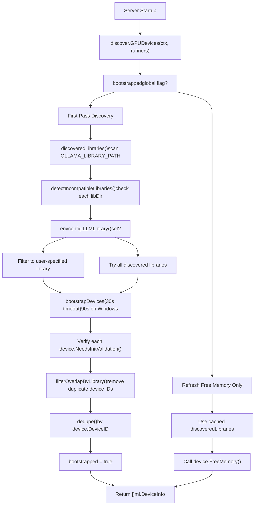
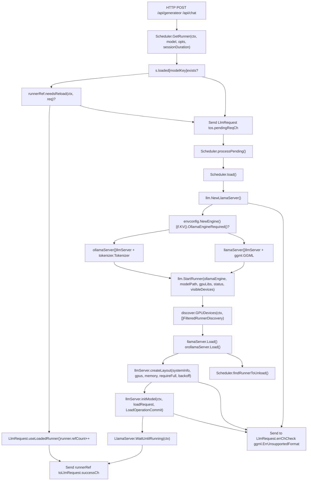
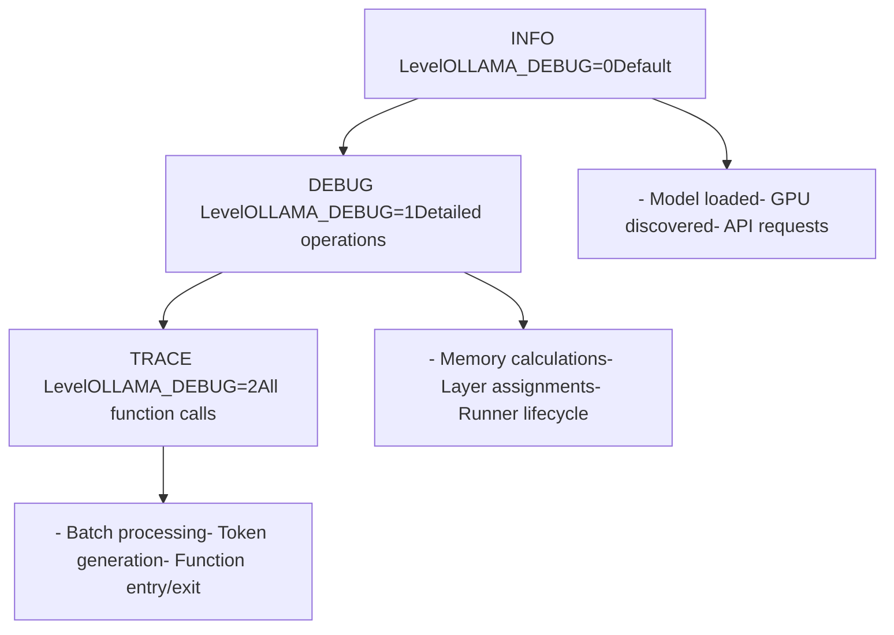
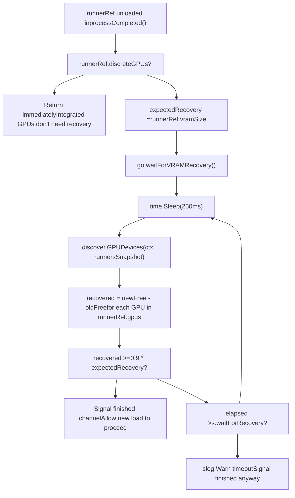

# Troubleshooting and Performance

Relevant source files

-   [envconfig/config.go](https://github.com/ollama/ollama/blob/562c76d7/envconfig/config.go)
-   [envconfig/config\_test.go](https://github.com/ollama/ollama/blob/562c76d7/envconfig/config_test.go)
-   [integration/embed\_test.go](https://github.com/ollama/ollama/blob/562c76d7/integration/embed_test.go)
-   [kvcache/cache.go](https://github.com/ollama/ollama/blob/562c76d7/kvcache/cache.go)
-   [kvcache/causal.go](https://github.com/ollama/ollama/blob/562c76d7/kvcache/causal.go)
-   [kvcache/causal\_test.go](https://github.com/ollama/ollama/blob/562c76d7/kvcache/causal_test.go)
-   [kvcache/encoder.go](https://github.com/ollama/ollama/blob/562c76d7/kvcache/encoder.go)
-   [kvcache/wrapper.go](https://github.com/ollama/ollama/blob/562c76d7/kvcache/wrapper.go)
-   [llm/server.go](https://github.com/ollama/ollama/blob/562c76d7/llm/server.go)
-   [ml/backend.go](https://github.com/ollama/ollama/blob/562c76d7/ml/backend.go)
-   [ml/backend/ggml/ggml.go](https://github.com/ollama/ollama/blob/562c76d7/ml/backend/ggml/ggml.go)
-   [model/input/input.go](https://github.com/ollama/ollama/blob/562c76d7/model/input/input.go)
-   [model/model.go](https://github.com/ollama/ollama/blob/562c76d7/model/model.go)
-   [model/model\_test.go](https://github.com/ollama/ollama/blob/562c76d7/model/model_test.go)
-   [runner/llamarunner/cache.go](https://github.com/ollama/ollama/blob/562c76d7/runner/llamarunner/cache.go)
-   [runner/llamarunner/runner.go](https://github.com/ollama/ollama/blob/562c76d7/runner/llamarunner/runner.go)
-   [runner/ollamarunner/cache.go](https://github.com/ollama/ollama/blob/562c76d7/runner/ollamarunner/cache.go)
-   [runner/ollamarunner/cache\_test.go](https://github.com/ollama/ollama/blob/562c76d7/runner/ollamarunner/cache_test.go)
-   [runner/ollamarunner/runner.go](https://github.com/ollama/ollama/blob/562c76d7/runner/ollamarunner/runner.go)
-   [server/internal/internal/backoff/backoff.go](https://github.com/ollama/ollama/blob/562c76d7/server/internal/internal/backoff/backoff.go)
-   [server/sched.go](https://github.com/ollama/ollama/blob/562c76d7/server/sched.go)
-   [server/sched\_test.go](https://github.com/ollama/ollama/blob/562c76d7/server/sched_test.go)

This page provides diagnostic procedures for common Ollama issues and performance optimization guidance. It covers GPU detection failures, memory allocation errors, model loading problems, request queuing issues, and performance tuning strategies.

## Related Documentation

-   GPU support and hardware: [6](/ollama/ollama/6-gpu-and-hardware-support), [6.1](/ollama/ollama/6.1-gpu-discovery-and-backend-loading), [6.2](/ollama/ollama/6.2-installation-and-setup)
-   Model management: [4](/ollama/ollama/4-model-management), [4.1](/ollama/ollama/4.1-modelfiles), [4.2](/ollama/ollama/4.2-model-registry-and-layers)
-   API reference: [3](/ollama/ollama/3-api-reference), [3.1](/ollama/ollama/3.1-model-management-api), [3.2](/ollama/ollama/3.2-generation-and-chat-api)
-   Architecture overview: [2](/ollama/ollama/2-architecture), [2.2](/ollama/ollama/2.2-request-scheduling-and-runner-management), [2.3](/ollama/ollama/2.3-model-execution-pipeline)

## Scope

-   Runtime error diagnosis and resolution
-   GPU detection and initialization failures
-   Memory allocation issues (VRAM and system RAM)
-   Model loading and compatibility problems
-   Request queue and concurrency issues
-   Performance tuning via environment variables and API parameters
-   Debugging techniques and log analysis

---

## GPU Detection Issues

### GPU Discovery Process

GPU detection occurs during server startup through `discover.GPUDevices()` [discover/runner.go34-253](https://github.com/ollama/ollama/blob/562c76d7/discover/runner.go#L34-L253) The function maintains a cached list of discovered GPUs and only performs full discovery on the first call.


**Key Functions:**

-   `discover.GPUDevices()`: Main entry point for GPU discovery
-   `discoveredLibraries()`: Scans for available GPU libraries (CUDA, ROCm, Metal, etc.)
-   `detectIncompatibleLibraries()`: Filters out libraries that can't be loaded
-   `bootstrapDevices()`: Calls into GPU library to enumerate devices
-   `filterOverlapByLibrary()`: Removes duplicate device IDs across libraries
-   `dedupe()`: Final deduplication by device ID

**Sources:** [discover/runner.go34-253](https://github.com/ollama/ollama/blob/562c76d7/discover/runner.go#L34-L253) [discover/runner.go255-402](https://github.com/ollama/ollama/blob/562c76d7/discover/runner.go#L255-L402)

### Common GPU Detection Problems

#### Problem: No GPU Detected

**Symptoms:**

-   Log message: `"inference compute id=cpu"`
-   Log message: `"loaded runners count=1"` followed by CPU-only metrics
-   Models run on CPU despite GPU being present
-   Generation speed is significantly slower than expected

**Diagnosis:**

1.  **Check GPU discovery logs:**

    ```
    OLLAMA_DEBUG=1 ollama serve 2>&1 | grep -i gpu
    ```

    Look for:

    -   `"discovering available GPUs..."` at startup
    -   Device entries showing `library`, `compute`, `total`, `available` memory
    -   Any error messages about library loading
2.  **Verify driver status:**

    ```
    # NVIDIAnvidia-smi# Should show GPU(s) with memory info # AMD  rocm-smi# Should show GPU(s) and ROCm version # Check driver modules (Linux)lsmod | grep -E '(nvidia|amdgpu)'
    ```

3.  **Check for environment variable conflicts:**

    ```
    env | grep -E '(CUDA_VISIBLE_DEVICES|HIP_VISIBLE_DEVICES|ROCR_VISIBLE_DEVICES|GGML_VK_VISIBLE_DEVICES)'
    ```

    -   These variables may hide GPUs from Ollama
    -   Empty or invalid values prevent GPU detection

**Solutions:**

1.  **Remove environment variable overrides:**

    ```
    unset CUDA_VISIBLE_DEVICESunset HIP_VISIBLE_DEVICESunset ROCR_VISIBLE_DEVICESollama serve
    ```

2.  **Verify driver installation:**

    ```
    # NVIDIA - Install CUDA toolkit# Download from: https://developer.nvidia.com/cuda-downloads # AMD - Install ROCm# Download from: https://rocm.docs.amd.com/ # Verify installationnvidia-smi   # NVIDIArocminfo     # AMD
    ```

3.  **Manually specify GPU library:**

    ```
    # List available librariesls -la ~/.ollama/lib/ollama/# or /usr/lib/ollama/ on Linux # Force specific libraryOLLAMA_LLM_LIBRARY=cuda_v12 ollama serve# or: cuda_v11, rocm, vulkan
    ```

4.  **Check library dependencies:**

    ```
    # Linux - verify shared library dependenciesldd ~/.ollama/lib/ollama/libggml-cuda.so# Should not show "not found" errors # macOS - Metal is built-in, no dependencies # Windows - verify CUDA DLLs in PATHwhere cudart64*.dll
    ```

5.  **Restart with fresh GPU state:**

    ```
    # Stop all Ollama processespkill ollama # Clear GPU memory (NVIDIA)sudo nvidia-smi --gpu-reset # Restart Ollamaollama serve
    ```


#### Problem: GPU Detected but Not Used

**Symptoms:**

-   GPU shows in logs but `num_gpu=0` in model loading
-   `"insufficient VRAM to load any model layers"`

**Diagnosis:**

-   Check `OLLAMA_GPU_OVERHEAD` setting: [envconfig/config.go266](https://github.com/ollama/ollama/blob/562c76d7/envconfig/config.go#L266-L266)
-   Review memory calculation logs: [llm/server.go449-464](https://github.com/ollama/ollama/blob/562c76d7/llm/server.go#L449-L464)

**Solutions:**

1.  **Reduce GPU overhead:**

    ```
    OLLAMA_GPU_OVERHEAD=0
    ```

    -   Default reserves space for system processes
    -   [server/sched.go455-463](https://github.com/ollama/ollama/blob/562c76d7/server/sched.go#L455-L463): Shows per-GPU memory breakdown
2.  **Check available VRAM:**

    -   [llm/server.go528-534](https://github.com/ollama/ollama/blob/562c76d7/llm/server.go#L528-L534): Reserves buffer space (size of blk.0 + kv\[0\])
    -   Actual available = `FreeMemory - buffer - overhead - MinimumMemory()`

#### Problem: Incomplete or Stuck GPU Initialization

**Symptoms:**

-   Server hangs during startup
-   Timeout errors in logs

**Diagnosis:**

-   First pass uses 30s timeout (90s on Windows): [discover/runner.go85-94](https://github.com/ollama/ollama/blob/562c76d7/discover/runner.go#L85-L94)
-   Second pass uses 30s timeout: [discover/runner.go125-126](https://github.com/ollama/ollama/blob/562c76d7/discover/runner.go#L125-L126)

**Solutions:**

1.  **Check for conflicting processes:**

    -   Other GPU-intensive applications may slow initialization
    -   On Windows, Defender AV scanning can delay library loading: [discover/runner.go87-93](https://github.com/ollama/ollama/blob/562c76d7/discover/runner.go#L87-L93)
2.  **Verify device permissions:**

    -   Ensure user is in `render` and `video` groups (Linux): [scripts/install.sh142-149](https://github.com/ollama/ollama/blob/562c76d7/scripts/install.sh#L142-L149)
3.  **Try disabling problem devices:**

    ```
    # Hide specific GPU by indexCUDA_VISIBLE_DEVICES=0  # Use only GPU 0
    ```


**Sources:** [discover/runner.go34-253](https://github.com/ollama/ollama/blob/562c76d7/discover/runner.go#L34-L253) [discover/runner.go454-515](https://github.com/ollama/ollama/blob/562c76d7/discover/runner.go#L454-L515) [discover/types.go29-74](https://github.com/ollama/ollama/blob/562c76d7/discover/types.go#L29-L74) [envconfig/config.go266](https://github.com/ollama/ollama/blob/562c76d7/envconfig/config.go#L266-L266) [llm/server.go449-464](https://github.com/ollama/ollama/blob/562c76d7/llm/server.go#L449-L464) [llm/server.go528-534](https://github.com/ollama/ollama/blob/562c76d7/llm/server.go#L528-L534) [scripts/install.sh142-149](https://github.com/ollama/ollama/blob/562c76d7/scripts/install.sh#L142-L149)

---

## Memory Allocation Failures

### Memory Allocation Architecture

Memory allocation uses an iterative fitting algorithm to determine optimal layer distribution across GPUs and CPU. The `llmServer.createLayout()` function orchestrates this process.

**Key Data Structures:**

-   `ml.BackendMemory`: Stores per-layer memory requirements for CPU and each GPU
-   `ml.GPULayersList`: List of `GPULayers` structs mapping device IDs to layer ranges
-   `llm.LoadRequest`: Contains GPU layer assignments, batch size, KV cache size, flash attention settings

**Allocation Algorithm:**

1.  `buildLayout()`: Calculate memory requirements per layer based on GGML tensor sizes
2.  `assignLayers()`: Binary search for optimal capacity factor to distribute layers
3.  `greedyFit()`: Greedily pack layers onto GPUs from highest performance to lowest
4.  `verifyLayout()`: Check that allocation doesn't exceed available memory
5.  `initModel()`: Commit allocation and load model weights

**Sources:** [llm/server.go922-1059](https://github.com/ollama/ollama/blob/562c76d7/llm/server.go#L922-L1059) [llm/server.go1062-1098](https://github.com/ollama/ollama/blob/562c76d7/llm/server.go#L1062-L1098) [llm/server.go1104-1134](https://github.com/ollama/ollama/blob/562c76d7/llm/server.go#L1104-L1134) [llm/server.go1137-1156](https://github.com/ollama/ollama/blob/562c76d7/llm/server.go#L1137-L1156) [server/sched.go234-264](https://github.com/ollama/ollama/blob/562c76d7/server/sched.go#L234-L264) [server/sched.go719-780](https://github.com/ollama/ollama/blob/562c76d7/server/sched.go#L719-L780)

### Common Memory Issues

#### Problem: "insufficient memory" Error

**Symptoms:**

-   Error message: `"model requires more system memory (X GB) than is available (Y GB)"`
-   Error message: `"model requires more system memory than is available"`
-   Error message: `"failed to allocate memory for model"`
-   Model load fails with memory-related errors

**Root Causes:**

1.  **Insufficient system RAM**: `verifyLayout()` checks `cpuSize <= systemInfo.FreeMemory + systemInfo.FreeSwap` [llm/server.go1040-1045](https://github.com/ollama/ollama/blob/562c76d7/llm/server.go#L1040-L1045)
2.  **Insufficient VRAM**: Not enough GPU memory for requested layers
3.  **KV cache overhead**: `KvSize = opts.NumCtx * numParallel` [llm/server.go173](https://github.com/ollama/ollama/blob/562c76d7/llm/server.go#L173-L173)
4.  **Graph compute memory**: Additional memory for compute operations

**Diagnosis:**

1.  **Check system memory logs:**

    ```
    OLLAMA_DEBUG=1 ollama serve 2>&1 | grep "system memory"
    ```

    Expected output:

    ```
    system memory total=32GB free=26GB free_swap=8GB
    ```

    Logged by `Scheduler.load()` [llm/server.go449-464](https://github.com/ollama/ollama/blob/562c76d7/llm/server.go#L449-L464)

2.  **Check GPU memory logs:**

    ```
    OLLAMA_DEBUG=1 ollama serve 2>&1 | grep "gpu memory"
    ```

    Expected output:

    ```
    gpu memory id=0 library=CUDA available=10.5GB free=11GB minimum=512MB overhead=500MB
    ```

    Shows calculation: `available = FreeMemory - overhead - MinimumMemory()` [llm/server.go455-463](https://github.com/ollama/ollama/blob/562c76d7/llm/server.go#L455-L463)

3.  **Review memory layout estimation:**

    ```
    OLLAMA_DEBUG=1 ollama serve 2>&1 | grep "memory estimate"
    ```

    Shows `BackendMemory` struct with per-layer CPU and GPU allocations

4.  **Check current memory usage:**

    ```
    # System RAMfree -h    # Linuxvm_stat    # macOS # GPU VRAMnvidia-smi    # NVIDIArocm-smi      # AMD
    ```

5.  **Inspect GGML tensor sizes:**

    ```
    # Model stores size metadataOLLAMA_DEBUG=1 ollama serve 2>&1 | grep "blk.0"
    ```

    Shows size of first layer block used for buffer calculation [llm/server.go527-538](https://github.com/ollama/ollama/blob/562c76d7/llm/server.go#L527-L538)


**Solutions:**

1.  **Reduce context size:**

    ```
    # In API request{"num_ctx": 2048}  # Default is 4096
    ```

    -   Smaller context = less KV cache memory: [llm/server.go521-522](https://github.com/ollama/ollama/blob/562c76d7/llm/server.go#L521-L522)
2.  **Reduce batch size:**

    ```
    # Smaller batches use less memory during processing{"num_batch": 512}  # Automatically capped by num_ctx
    ```

    -   [llm/server.go171](https://github.com/ollama/ollama/blob/562c76d7/llm/server.go#L171-L171): `opts.NumBatch = min(opts.NumBatch, opts.NumCtx)`
3.  **Free system memory:**

    -   Close other applications
    -   Linux: `sync && echo 3 > /proc/sys/vm/drop_caches` (as root)
4.  **Adjust GPU overhead:**

    ```
    OLLAMA_GPU_OVERHEAD=500000000  # 500MB in bytes
    ```

    -   Reduce if no other GPU processes: [envconfig/config.go266](https://github.com/ollama/ollama/blob/562c76d7/envconfig/config.go#L266-L266)
5.  **Disable mmap (if disk space limited):**

    ```
    {"use_mmap": false}
    ```

    -   Forces memory allocation vs. file cache: [llm/server.go671-692](https://github.com/ollama/ollama/blob/562c76d7/llm/server.go#L671-L692)

#### Problem: Model Loads but Runs Out of Memory During Inference

**Symptoms:**

-   Initial load succeeds
-   Crashes or errors during generation
-   "could not find a kv cache slot" errors

**Diagnosis:**

-   Check `num_parallel` setting: [envconfig/config.go244](https://github.com/ollama/ollama/blob/562c76d7/envconfig/config.go#L244-L244)
-   Each parallel request multiplies KV cache requirements
-   [llm/server.go173](https://github.com/ollama/ollama/blob/562c76d7/llm/server.go#L173-L173): `KvSize: opts.NumCtx * numParallel`

**Solutions:**

1.  **Reduce parallel requests:**

    ```
    OLLAMA_NUM_PARALLEL=1
    ```

2.  **Reduce loaded models:**

    ```
    OLLAMA_MAX_LOADED_MODELS=1
    ```

    -   Forces unloading before loading new model: [server/sched.go170-173](https://github.com/ollama/ollama/blob/562c76d7/server/sched.go#L170-L173)
3.  **Enable multi-user cache optimization:**

    ```
    OLLAMA_MULTIUSER_CACHE=1
    ```

    -   [llm/server.go173](https://github.com/ollama/ollama/blob/562c76d7/llm/server.go#L173-L173): `MultiUserCache: envconfig.MultiUserCache()`
    -   Optimizes cache sharing across requests

#### Problem: "failed to allocate memory for model"

**Symptoms:**

-   Error after successful layout calculation
-   Runner initialization fails

**Diagnosis:**

-   This occurs in `ollamaServer.Load()`: [llm/server.go744-896](https://github.com/ollama/ollama/blob/562c76d7/llm/server.go#L744-L896)
-   Iterative process attempts multiple layouts before failing

**Solutions:**

1.  **Check for memory fragmentation:**

    -   Restart Ollama service to clear fragmented memory
    -   Linux: Check `/proc/meminfo` for fragmentation
2.  **Review backoff factor:**

    -   System applies progressive backoff: [llm/server.go758-875](https://github.com/ollama/ollama/blob/562c76d7/llm/server.go#L758-L875)
    -   If repeatedly failing, system memory reporting may be inaccurate
3.  **Force CPU mode:**

    ```
    {"num_gpu": 0}
    ```

    -   Bypasses GPU allocation entirely

**Additional Notes:**

Memory allocation failures can occur at different stages:

-   **Layout calculation:** System determines if model can fit
-   **Buffer allocation:** Runner allocates memory structures
-   **Model loading:** Weights are loaded into allocated memory

Each stage may fail for different reasons, requiring different solutions.

**Sources:** [llm/server.go449-464](https://github.com/ollama/ollama/blob/562c76d7/llm/server.go#L449-L464) [llm/server.go521-522](https://github.com/ollama/ollama/blob/562c76d7/llm/server.go#L521-L522) [llm/server.go667-692](https://github.com/ollama/ollama/blob/562c76d7/llm/server.go#L667-L692) [llm/server.go744-896](https://github.com/ollama/ollama/blob/562c76d7/llm/server.go#L744-L896) [llm/server.go922-1059](https://github.com/ollama/ollama/blob/562c76d7/llm/server.go#L922-L1059) [server/sched.go170-173](https://github.com/ollama/ollama/blob/562c76d7/server/sched.go#L170-L173) [envconfig/config.go244](https://github.com/ollama/ollama/blob/562c76d7/envconfig/config.go#L244-L244) [envconfig/config.go266](https://github.com/ollama/ollama/blob/562c76d7/envconfig/config.go#L266-L266)

---

## Model Loading Failures

### Model Loading Pipeline

Model loading is orchestrated by the `Scheduler` which manages runner lifecycle and ensures only compatible models are loaded concurrently.


**Key Types and Functions:**

-   `Scheduler`: Manages model lifecycle and concurrent requests
-   `LlmRequest`: Encapsulates a model load/use request
-   `runnerRef`: Wrapper around `LlamaServer` with reference counting and session duration
-   `LlamaServer` interface: Implemented by `llamaServer` or `ollamaServer`
-   `llm.NewLlamaServer()`: Factory function that creates appropriate runner type
-   `llm.StartRunner()`: Spawns subprocess runner with GPU libraries
-   `schedulerModelKey()`: Generates cache key from ModelPath or manifest digest

**Sources:** [server/sched.go85-117](https://github.com/ollama/ollama/blob/562c76d7/server/sched.go#L85-L117) [server/sched.go131-271](https://github.com/ollama/ollama/blob/562c76d7/server/sched.go#L131-L271) [server/sched.go401-553](https://github.com/ollama/ollama/blob/562c76d7/server/sched.go#L401-L553) [llm/server.go142-317](https://github.com/ollama/ollama/blob/562c76d7/llm/server.go#L142-L317) [llm/server.go319-437](https://github.com/ollama/ollama/blob/562c76d7/llm/server.go#L319-L437) [llm/server.go495-712](https://github.com/ollama/ollama/blob/562c76d7/llm/server.go#L495-L712) [llm/server.go744-896](https://github.com/ollama/ollama/blob/562c76d7/llm/server.go#L744-L896)

### Common Loading Problems

#### Problem: "this model may be incompatible with your version of Ollama"

**Symptoms:**

-   Error immediately on model load attempt
-   Full error message: `"this model may be incompatible with your version of Ollama. If you previously pulled this model, try updating it by running 'ollama pull <model>'"`
-   Model loading fails before memory allocation

**Diagnosis:**

1.  **Check for format incompatibility:**

    ```
    # Look for "failed to load model" in logsOLLAMA_DEBUG=1 ollama serve 2>&1 | grep "failed to load"
    ```

2.  **Verify GGUF version:**

    ```
    # Inspect model file headerod -An -tx1 -N16 ~/.ollama/models/blobs/sha256-<hash> | head -1# Should start with: 47 47 55 46 (GGUF magic)
    ```

3.  **Check model architecture:**

    ```
    # List model detailsollama show <model> --modelfile
    ```


**Solutions:**

1.  **Update the model:**

    ```
    ollama pull <model_name># Re-downloads latest compatible version
    ```

2.  **Update Ollama to latest version:**

    ```
    # Linuxcurl -fsSL https://ollama.com/install.sh | sh # macOSbrew upgrade ollama# or download from https://ollama.com/download # Windows  # Download latest from https://ollama.com/download
    ```

3.  **Enable new engine for newer model formats:**

    ```
    OLLAMA_NEW_ENGINE=1 ollama serve
    ```

    -   Required for some safetensors models
    -   Required for split vision models
4.  **Check model compatibility:**

    ```
    # List supported model families# Documented at: https://ollama.com/library
    ```

5.  **Verify model file integrity:**

    ```
    # Check file size matches expectedls -lh ~/.ollama/models/blobs/sha256-* # Re-pull if corruptedollama rm <model>ollama pull <model>
    ```


#### Problem: "unknown model" Error

**Symptoms:**

-   Runner subprocess terminates immediately
-   Log message: `"unknown model"` in subprocess output
-   Error converted to: `"this model is not supported by your version of Ollama. You may need to upgrade"`
-   Different from incompatibility error - indicates architecture not recognized

**Diagnosis:**

1.  **Check subprocess termination logs:**

    ```
    OLLAMA_DEBUG=1 ollama serve 2>&1 | grep "llama runner terminated"
    ```

2.  **Verify model architecture:**

    ```
    ollama show <model> --modelfile | grep "FROM"
    ```

3.  **Check llama.cpp version:**

    ```
    # Version is built into Ollamaollama --version
    ```


**Solutions:**

1.  **Upgrade Ollama:**

    ```
    # Newer architectures require newer Ollama versionscurl -fsSL https://ollama.com/install.sh | sh
    ```

2.  **Check model source:**

    ```
    # Official models from ollama.com/library are tested# Custom/converted models may not be compatible
    ```

3.  **Try official model variants:**

    ```
    # List available tagsollama pull <model>:latest
    ```

4.  **Verify model file integrity:**

    ```
    # Re-download if corruption suspectedollama rm <model>ollama pull <model> # Check file sizels -lh ~/.ollama/models/blobs/
    ```

5.  **Check for experimental architectures:**

    ```
    # Some architectures may require new engineOLLAMA_NEW_ENGINE=1 ollama serve
    ```


#### Problem: Model Loading Stalls/Times Out

**Symptoms:**

-   Load process hangs
-   Eventually times out after 5 minutes (default)
-   Logs show "loading model" but never completes

**Root Causes:**

1.  **Slow disk I/O**: Reading large model files (10GB+) from slow storage
2.  **Memory allocation delay**: OS taking time to allocate large memory regions
3.  **GPU initialization hang**: Driver or library initialization stalled
4.  **Subprocess crash**: Runner process died before signaling completion

**Diagnosis:**

1.  **Check timeout setting:**

    ```
    env | grep OLLAMA_LOAD_TIMEOUT
    ```

    Default is 5 minutes: `envconfig.LoadTimeout()` [envconfig/config.go120-138](https://github.com/ollama/ollama/blob/562c76d7/envconfig/config.go#L120-L138)

2.  **Monitor disk I/O:**

    ```
    # During model loadiostat -x 1    # Linuxiotop          # Linux, requires root
    ```

3.  **Check subprocess status:**

    ```
    ps aux | grep ollama# Look for runner process with --model flag # Check if process is in uninterruptible sleep (D state)ps -eo pid,stat,comm | grep ollama
    ```

4.  **Review wait conditions:**

    ```
    OLLAMA_DEBUG=1 ollama serve 2>&1 | grep -E '(WaitUntilRunning|Ping)'
    ```

    `WaitUntilRunning()` polls `Ping()` endpoint until ready [llm/server.go694](https://github.com/ollama/ollama/blob/562c76d7/llm/server.go#L694-L694)


**Solutions:**

1.  **Increase timeout for large models:**

    ```
    OLLAMA_LOAD_TIMEOUT=10m
    ```

2.  **Check disk I/O and verify model file integrity:**

    ```
    sha256sum ~/.ollama/models/blobs/sha256-*# Re-pull if corruptedollama rm <model>ollama pull <model>
    ```

3.  **Disable mmap to force eager loading:**

    ```
    {"use_mmap": false}
    ```

    -   [llm/server.go683-692](https://github.com/ollama/ollama/blob/562c76d7/llm/server.go#L683-L692): Conditions that auto-disable mmap
    -   Forces loading entire model into RAM instead of memory-mapped file
    -   Slower initial load but avoids some disk I/O issues
4.  **Check for hung subprocess:**

    ```
    ps aux | grep ollama# Kill hung runner process if foundkill -9 <pid>
    ```

5.  **Verify GPU library initialization:**

    ```
    # Test GPU library can be loadedOLLAMA_DEBUG=1 ollama serve 2>&1 | grep -E '(discovering|bootstrapDevices)'
    ```

    Timeout during GPU discovery indicates driver issues


#### Problem: Flash Attention Warnings

**Symptoms:**

-   Warning: `"flash attention enabled but not supported by gpu"`
-   Warning: `"flash attention enabled but not supported by model"`

**Diagnosis:**

-   [llm/server.go201-209](https://github.com/ollama/ollama/blob/562c76d7/llm/server.go#L201-L209): Flash attention checks
-   Requires specific GPU compute capability and model support

**Solutions:**

1.  **Disable flash attention:**

    ```
    OLLAMA_FLASH_ATTENTION=0
    ```

2.  **Check GPU compute capability:**

    -   Flash attention requires compute capability 7.0+
    -   Run `nvidia-smi --query-gpu=compute_cap --format=csv`
3.  **Verify model support:**

    -   [llm/server.go206-209](https://github.com/ollama/ollama/blob/562c76d7/llm/server.go#L206-L209): `f.SupportsFlashAttention()`
    -   Some model architectures don't support it

#### Problem: Multimodal Model Issues

**Symptoms:**

-   Vision models fail to load
-   Error with image processing

**Diagnosis:**

-   [llm/server.go147-151](https://github.com/ollama/ollama/blob/562c76d7/llm/server.go#L147-L151): Vision models have special requirements
-   Split vision models not supported in new engine

**Solutions:**

1.  **Force legacy engine for split models:**

    ```
    OLLAMA_NEW_ENGINE=0
    ```

2.  **Verify projector files:**

    -   Check model has projector paths: `req.model.ProjectorPaths`
    -   Located in manifest layers

**Sources:** [server/sched.go401-553](https://github.com/ollama/ollama/blob/562c76d7/server/sched.go#L401-L553) [server/sched.go428-434](https://github.com/ollama/ollama/blob/562c76d7/server/sched.go#L428-L434) [llm/server.go142-317](https://github.com/ollama/ollama/blob/562c76d7/llm/server.go#L142-L317) [llm/server.go303-310](https://github.com/ollama/ollama/blob/562c76d7/llm/server.go#L303-L310) [llm/server.go201-209](https://github.com/ollama/ollama/blob/562c76d7/llm/server.go#L201-L209) [llm/server.go147-151](https://github.com/ollama/ollama/blob/562c76d7/llm/server.go#L147-L151) [llm/server.go683-692](https://github.com/ollama/ollama/blob/562c76d7/llm/server.go#L683-L692) [envconfig/config.go120-138](https://github.com/ollama/ollama/blob/562c76d7/envconfig/config.go#L120-L138)

---

## Performance Optimization

### Key Performance Parameters

| Parameter | Environment Variable | Default | Impact | When to Adjust |
| --- | --- | --- | --- | --- |
| Context Length | `OLLAMA_CONTEXT_LENGTH` | 4096 (varies) | Higher = more memory, larger prompts | Long documents, reduce for low memory |
| Parallel Requests | `OLLAMA_NUM_PARALLEL` | 1 | Higher = more concurrent requests, more VRAM | Multi-user scenarios |
| Max Loaded Models | `OLLAMA_MAX_LOADED_MODELS` | 0 (auto: 3×GPUs) | Limits simultaneous loaded models | Low VRAM, high throughput |
| Max Queue | `OLLAMA_MAX_QUEUE` | 512 | Maximum pending requests | Prevent overload |
| Batch Size | API: `num_batch` | From `num_ctx` | Larger = faster processing, more memory | Tune based on hardware |
| GPU Layers | API: `num_gpu` | \-1 (auto) | Layers offloaded to GPU | Force CPU/GPU split |
| Thread Count | API: `num_thread` | Auto-detected | CPU inference parallelism | Tune for CPU inference |
| Flash Attention | `OLLAMA_FLASH_ATTENTION` | Auto | 2-4× faster attention | Supported GPUs only |
| KV Cache Type | `OLLAMA_KV_CACHE_TYPE` | f16 | Quantized = less VRAM, slight accuracy loss | Low VRAM scenarios |
| Keep Alive | `OLLAMA_KEEP_ALIVE` | 5m | Model stays loaded in memory | Balance reload vs. memory |
| Load Timeout | `OLLAMA_LOAD_TIMEOUT` | 5m | Maximum model load time | Large models, slow disks |
| GPU Overhead | `OLLAMA_GPU_OVERHEAD` | 0 | Reserved VRAM per GPU | Other GPU processes running |
| Multi-User Cache | `OLLAMA_MULTIUSER_CACHE` | false | Shared prompt caching | Multiple users, repeated prompts |
| Schedule Spread | `OLLAMA_SCHED_SPREAD` | false | Distribute layers across all GPUs | Multi-GPU systems |

**Performance Impact Summary:**

-   **Memory:** `num_ctx`, `num_parallel`, `num_gpu`, `OLLAMA_GPU_OVERHEAD`
-   **Speed:** `num_batch`, `num_thread`, `OLLAMA_FLASH_ATTENTION`, `num_gpu`
-   **Throughput:** `OLLAMA_NUM_PARALLEL`, `OLLAMA_MAX_LOADED_MODELS`, `OLLAMA_MAX_QUEUE`
-   **Latency:** `OLLAMA_KEEP_ALIVE`, `num_gpu`, `OLLAMA_FLASH_ATTENTION`

**Sources:** [envconfig/config.go188-318](https://github.com/ollama/ollama/blob/562c76d7/envconfig/config.go#L188-L318)

### Performance Tuning Strategies

#### Strategy 1: Optimize for Throughput (Multiple Users)

```
# Configuration for high concurrencyOLLAMA_NUM_PARALLEL=4          # Handle 4 concurrent requestsOLLAMA_MULTIUSER_CACHE=1       # Share cache across usersOLLAMA_MAX_LOADED_MODELS=1     # Keep one model loadedOLLAMA_KEEP_ALIVE=30m          # Keep models loaded longer
```
**Rationale:**

-   [envconfig/config.go244](https://github.com/ollama/ollama/blob/562c76d7/envconfig/config.go#L244-L244): `NumParallel` determines concurrent request capacity
-   [envconfig/config.go200](https://github.com/ollama/ollama/blob/562c76d7/envconfig/config.go#L200-L200): `MultiUserCache` optimizes prompt sharing
-   [server/sched.go402-407](https://github.com/ollama/ollama/blob/562c76d7/server/sched.go#L402-L407): Embedding models always use `parallel=1`

**Trade-offs:**

-   Higher VRAM usage: `KV cache size = num_ctx * num_parallel`
-   May need to reduce `num_ctx` to fit in memory

#### Strategy 2: Optimize for Latency (Single User)

```
# Configuration for low latencyOLLAMA_NUM_PARALLEL=1           # Single request at a timeOLLAMA_FLASH_ATTENTION=1        # Enable if supportedOLLAMA_KV_CACHE_TYPE=f16        # Full precision cacheOLLAMA_MAX_LOADED_MODELS=3      # Keep recently used models
```
**Rationale:**

-   Single parallel = minimal KV cache overhead
-   Flash attention = faster computation: [llm/server.go191-258](https://github.com/ollama/ollama/blob/562c76d7/llm/server.go#L191-L258)
-   Multiple loaded models = avoid reloading

#### Strategy 3: Optimize for Memory-Constrained Systems

```
# Configuration for limited VRAM/RAMOLLAMA_CONTEXT_LENGTH=2048      # Reduce from default 4096OLLAMA_MAX_LOADED_MODELS=1      # Only one model at a timeOLLAMA_KEEP_ALIVE=0             # Unload immediately when idleOLLAMA_GPU_OVERHEAD=0           # Use all available VRAM # In API requests:{"num_ctx": 2048, "num_batch": 512, "num_gpu": 999}
```
**Rationale:**

-   Smaller context = less memory: [llm/server.go521-522](https://github.com/ollama/ollama/blob/562c76d7/llm/server.go#L521-L522)
-   Immediate unload = free resources quickly
-   `num_gpu: 999` = load maximum layers: [llm/server.go1109-1112](https://github.com/ollama/ollama/blob/562c76d7/llm/server.go#L1109-L1112)

#### Strategy 4: Multi-GPU Optimization

```
# Configuration for multiple GPUsOLLAMA_SCHED_SPREAD=1           # Use all GPUsOLLAMA_MAX_LOADED_MODELS=0      # Auto-calculate (3 per GPU) # Optional: Control GPU visibilityCUDA_VISIBLE_DEVICES=0,1        # Use only GPU 0 and 1
```
**Rationale:**

-   [envconfig/config.go198](https://github.com/ollama/ollama/blob/562c76d7/envconfig/config.go#L198-L198): `SchedSpread` distributes across GPUs
-   [server/sched.go185-196](https://github.com/ollama/ollama/blob/562c76d7/server/sched.go#L185-L196): Auto `maxRunners = defaultModelsPerGPU * max(len(gpus), 1)`
-   [server/sched.go63](https://github.com/ollama/ollama/blob/562c76d7/server/sched.go#L63-L63): `defaultModelsPerGPU = 3`

#### Strategy 5: CPU-Only Optimization

```
# Configuration for CPU inferenceOLLAMA_NUM_PARALLEL=1           # Single requestOLLAMA_KEEP_ALIVE=5m            # Default keep alive # In API requests:{"num_gpu": 0, "num_thread": 8}  # Explicit CPU mode
```
**Rationale:**

-   [llm/server.go175-180](https://github.com/ollama/ollama/blob/562c76d7/llm/server.go#L175-L180): Thread count auto-detected or set via `num_thread`
-   CPU mode uses system RAM instead of VRAM
-   [llm/server.go686-688](https://github.com/ollama/ollama/blob/562c76d7/llm/server.go#L686-L688): CPU loads have `use_mmap=false` by default

### Performance Monitoring

#### Key Metrics to Monitor

1.  **Token Generation Speed:**

    -   Logged in API responses: `"eval_count"`, `"eval_duration"`
    -   Tokens/second = `eval_count / (eval_duration / 1e9)`
2.  **VRAM Usage:**

    -   [discover/runner.go304-418](https://github.com/ollama/ollama/blob/562c76d7/discover/runner.go#L304-L418): Per-GPU VRAM tracking
    -   Check `nvidia-smi` or `rocm-smi` during inference
3.  **Model Loading Time:**

    -   [llm/server.go103](https://github.com/ollama/ollama/blob/562c76d7/llm/server.go#L103-L103): `loadStart` timestamp recorded
    -   Compare to `WaitUntilRunning()` completion
4.  **Request Queue Depth:**

    -   [server/sched.go68-73](https://github.com/ollama/ollama/blob/562c76d7/server/sched.go#L68-L73): `pendingReqCh` size
    -   [envconfig/config.go248](https://github.com/ollama/ollama/blob/562c76d7/envconfig/config.go#L248-L248): Max 512 by default
5.  **Runner Eviction Frequency:**

    -   [server/sched.go319-372](https://github.com/ollama/ollama/blob/562c76d7/server/sched.go#L319-L372): `expiredCh` events
    -   Frequent evictions indicate memory pressure

#### Enable Performance Logging

```
# Full debug outputOLLAMA_DEBUG=2 # Trace-level logging (very verbose)OLLAMA_DEBUG=1
```
-   [envconfig/config.go173-186](https://github.com/ollama/ollama/blob/562c76d7/envconfig/config.go#L173-L186): Debug levels
    -   `0` or `false`: INFO (default)
    -   `1` or `true`: DEBUG
    -   `2`: TRACE (-4 level)

**Sources:** [envconfig/config.go188-318](https://github.com/ollama/ollama/blob/562c76d7/envconfig/config.go#L188-L318) [envconfig/config.go244](https://github.com/ollama/ollama/blob/562c76d7/envconfig/config.go#L244-L244) [envconfig/config.go200](https://github.com/ollama/ollama/blob/562c76d7/envconfig/config.go#L200-L200) [envconfig/config.go198](https://github.com/ollama/ollama/blob/562c76d7/envconfig/config.go#L198-L198) [server/sched.go63](https://github.com/ollama/ollama/blob/562c76d7/server/sched.go#L63-L63) [server/sched.go185-196](https://github.com/ollama/ollama/blob/562c76d7/server/sched.go#L185-L196) [server/sched.go402-407](https://github.com/ollama/ollama/blob/562c76d7/server/sched.go#L402-L407) [server/sched.go319-372](https://github.com/ollama/ollama/blob/562c76d7/server/sched.go#L319-L372) [llm/server.go103](https://github.com/ollama/ollama/blob/562c76d7/llm/server.go#L103-L103) [llm/server.go175-180](https://github.com/ollama/ollama/blob/562c76d7/llm/server.go#L175-L180) [llm/server.go191-258](https://github.com/ollama/ollama/blob/562c76d7/llm/server.go#L191-L258) [llm/server.go521-522](https://github.com/ollama/ollama/blob/562c76d7/llm/server.go#L521-L522) [llm/server.go686-688](https://github.com/ollama/ollama/blob/562c76d7/llm/server.go#L686-L688) [llm/server.go1109-1112](https://github.com/ollama/ollama/blob/562c76d7/llm/server.go#L1109-L1112)

---

## Debugging Techniques

### Debug Logging Levels


**Sources:** [envconfig/config.go173-186](https://github.com/ollama/ollama/blob/562c76d7/envconfig/config.go#L173-L186)

### Useful Debug Commands

#### 1\. Check Environment Configuration

```
# View all Ollama environment variablesollama show <model> --verbose # Or use the APIcurl http://localhost:11434/api/version
```
Configuration is loaded from: [envconfig/config.go274-321](https://github.com/ollama/ollama/blob/562c76d7/envconfig/config.go#L274-L321)

#### 2\. Inspect GPU Detection

```
# Run with debug loggingOLLAMA_DEBUG=1 ollama serve 2>&1 | grep -i gpu # Look for:# - "discovering available GPUs"# - "inference compute" entries# - Device details (id, library, compute, memory)
```
Output from: [discover/types.go29-74](https://github.com/ollama/ollama/blob/562c76d7/discover/types.go#L29-L74) [discover/runner.go67](https://github.com/ollama/ollama/blob/562c76d7/discover/runner.go#L67-L67)

#### 3\. Monitor Memory Allocation

```
# Enable debug logging and watch memoryOLLAMA_DEBUG=1 ollama serve 2>&1 | grep -E '(memory|VRAM|available)' # Look for:# - "system memory total=... free=..."# - "gpu memory id=... available=..."# - "memory estimate=..."# - "updated VRAM based on existing loaded models"
```
Output from: [llm/server.go449-464](https://github.com/ollama/ollama/blob/562c76d7/llm/server.go#L449-L464) [llm/server.go667-668](https://github.com/ollama/ollama/blob/562c76d7/llm/server.go#L667-L668) [server/sched.go598-637](https://github.com/ollama/ollama/blob/562c76d7/server/sched.go#L598-L637)

#### 4\. Trace Request Processing

```
# Trace-level loggingOLLAMA_DEBUG=2 ollama serve 2>&1 | grep -E '(sequence|batch|token)' # Shows:# - Sequence creation# - Batch processing# - Token generation# - Cache operations
```
Trace logs from: [runner/ollamarunner/runner.go](https://github.com/ollama/ollama/blob/562c76d7/runner/ollamarunner/runner.go) [logutil package](https://github.com/ollama/ollama/blob/562c76d7/logutil package)

#### 5\. Check Runner Status

```
# List running processesps aux | grep ollama # Check runner subprocessespgrep -a ollama # Monitor system resourceshtop  # or top
```
Runner process started at: [llm/server.go319-437](https://github.com/ollama/ollama/blob/562c76d7/llm/server.go#L319-L437)

### Common Debug Scenarios

#### Scenario 1: Model Not Loading on GPU

**Debug Steps:**

1.  Check GPU detection:

```
OLLAMA_DEBUG=1 ollama serve 2>&1 | tee /tmp/ollama.loggrep "inference compute" /tmp/ollama.log
```
2.  Verify no environment overrides:

```
env | grep -E '(CUDA_VISIBLE_DEVICES|HIP_VISIBLE_DEVICES|OLLAMA_LLM_LIBRARY)'
```
3.  Check memory calculations:

```
grep "memory estimate" /tmp/ollama.loggrep "available" /tmp/ollama.log
```
4.  Try forcing GPU:

```
curl http://localhost:11434/api/generate -d '{  "model": "llama2",  "prompt": "test",  "num_gpu": 999}'
```
#### Scenario 2: Slow Performance

**Debug Steps:**

1.  Check token generation rate:

```
# In API response, look for:# "eval_count": 50,# "eval_duration": 2000000000  # 2 seconds in nanoseconds# Rate = 50 / 2 = 25 tokens/second
```
2.  Verify flash attention:

```
grep -i "flash attention" /tmp/ollama.log
```
3.  Check if using GPU:

```
# During generationnvidia-smi  # or rocm-smi # Look for GPU utilization
```
4.  Review layer allocation:

```
grep "gpu memory" /tmp/ollama.loggrep "loaded layers" /tmp/ollama.log
```
#### Scenario 3: Out of Memory During Generation

**Debug Steps:**

1.  Check KV cache size:

```
# Calculate: num_ctx * num_parallel * size_per_token# Log shows: "batch_size": ...
```
2.  Review parallel requests:

```
grep "parallel" /tmp/ollama.log
```
3.  Check for multiple loaded models:

```
curl http://localhost:11434/api/tags | jq '.models[].name'
```
4.  Monitor VRAM during generation:

```
# In another terminal while generatingwatch -n 1 nvidia-smi
```
#### Scenario 4: Runner Crashes

**Debug Steps:**

1.  Check subprocess logs:

```
# Runner stderr is piped to main processgrep "llama runner terminated" /tmp/ollama.log
```
2.  Look for error messages:

```
grep -i error /tmp/ollama.loggrep -i "unknown model" /tmp/ollama.log
```
3.  Verify model file integrity:

```
# Check for corruptionls -lh ~/.ollama/models/blobs/sha256-*# Compare sizes to expected values
```
4.  Try with minimal configuration:

```
curl http://localhost:11434/api/generate -d '{  "model": "llama2",  "prompt": "test",  "num_ctx": 512,  "num_gpu": 0}'
```
### Diagnostic Environment Variables

```
# === Logging and Debugging ===OLLAMA_DEBUG=1              # Enable debug logging (0=INFO, 1=DEBUG, 2=TRACE) # === GPU Configuration ===OLLAMA_LLM_LIBRARY=cuda_v12 # Force specific GPU library (cuda_v12, cuda_v11, rocm, vulkan)CUDA_VISIBLE_DEVICES=0      # Limit to specific GPUs (comma-separated)OLLAMA_GPU_OVERHEAD=0       # Skip GPU overhead reservation # === Memory Management ===OLLAMA_CONTEXT_LENGTH=512   # Reduce context for testingOLLAMA_NUM_PARALLEL=1       # Limit concurrent requestsOLLAMA_MAX_LOADED_MODELS=1  # Only one model at a timeOLLAMA_KEEP_ALIVE=0         # Immediate unload for memory testingOLLAMA_LOAD_TIMEOUT=10m     # Extend timeout for large modelsOLLAMA_MAX_QUEUE=128        # Reduce queue size # === Performance Tuning ===OLLAMA_FLASH_ATTENTION=0    # Disable flash attention for testingOLLAMA_KV_CACHE_TYPE=f16    # Use full precision KV cacheOLLAMA_MULTIUSER_CACHE=0    # Disable multi-user cache optimizationOLLAMA_SCHED_SPREAD=0       # Disable GPU spreading # === Experimental Features ===OLLAMA_NEW_ENGINE=1         # Enable new Ollama engineOLLAMA_VULKAN=1             # Enable Vulkan backend (Linux/Windows) # === API Parameters (in request JSON) ==={  "num_gpu": 0,             # Force CPU mode  "num_ctx": 2048,          # Override context length  "num_batch": 512,         # Set batch size  "num_thread": 8,          # Set CPU threads  "use_mmap": false         # Disable memory mapping}
```
**Common Diagnostic Combinations:**

```
# Test GPU detection issuesOLLAMA_DEBUG=1 ollama serve 2>&1 | grep -i gpu # Test memory constraintsOLLAMA_DEBUG=1 OLLAMA_CONTEXT_LENGTH=512 OLLAMA_MAX_LOADED_MODELS=1 ollama serve # Test CPU-only modeOLLAMA_DEBUG=1 ollama serve# Then: curl -d '{"num_gpu": 0, ...}' http://localhost:11434/api/generate # Test library loading issuesOLLAMA_DEBUG=1 OLLAMA_LLM_LIBRARY=cuda_v12 ollama serve # Monitor memory allocationOLLAMA_DEBUG=1 ollama serve 2>&1 | grep -E '(memory|VRAM|available)'
```
**Sources:** [envconfig/config.go173-318](https://github.com/ollama/ollama/blob/562c76d7/envconfig/config.go#L173-L318) [llm/server.go319-437](https://github.com/ollama/ollama/blob/562c76d7/llm/server.go#L319-L437) [llm/server.go429-430](https://github.com/ollama/ollama/blob/562c76d7/llm/server.go#L429-L430) [llm/server.go449-464](https://github.com/ollama/ollama/blob/562c76d7/llm/server.go#L449-L464) [llm/server.go667-668](https://github.com/ollama/ollama/blob/562c76d7/llm/server.go#L667-L668) [server/sched.go598-637](https://github.com/ollama/ollama/blob/562c76d7/server/sched.go#L598-L637) [discover/runner.go67](https://github.com/ollama/ollama/blob/562c76d7/discover/runner.go#L67-L67) [discover/types.go29-74](https://github.com/ollama/ollama/blob/562c76d7/discover/types.go#L29-L74)

---

## Request Queue and Concurrency Issues

### Problem: "server busy, please try again. maximum pending requests exceeded"

**Symptoms:**

-   HTTP 503 error or similar error message
-   Error message: `"server busy, please try again. maximum pending requests exceeded"`
-   Occurs when many requests arrive simultaneously

**Diagnosis:**

```
# Check queue sizeOLLAMA_DEBUG=1 ollama serve 2>&1 | grep -E '(pending|queue)'
```
Queue is full when `len(pendingReqCh) >= OLLAMA_MAX_QUEUE`

**Solutions:**

1.  **Increase queue size:**

    ```
    OLLAMA_MAX_QUEUE=1024 ollama serve# Default is 512
    ```

2.  **Increase concurrent processing:**

    ```
    OLLAMA_NUM_PARALLEL=4 ollama serve# Process more requests simultaneously
    ```

3.  **Reduce model loading time:**

    ```
    OLLAMA_MAX_LOADED_MODELS=0  # Keep models loadedOLLAMA_KEEP_ALIVE=30m       # Don't unload frequently
    ```

4.  **Implement request throttling in client:**

    ```
    # Limit concurrent requests from your applicationimport asynciosemaphore = asyncio.Semaphore(5)  # Max 5 concurrent
    ```


**Sources:** [server/sched.go68-73](https://github.com/ollama/ollama/blob/562c76d7/server/sched.go#L68-L73) [server/sched.go111-115](https://github.com/ollama/ollama/blob/562c76d7/server/sched.go#L111-L115) [envconfig/config.go248](https://github.com/ollama/ollama/blob/562c76d7/envconfig/config.go#L248-L248)

### Problem: Requests Timeout or Hang

**Symptoms:**

-   Requests never complete
-   Client timeouts
-   No error messages in logs

**Diagnosis:**

1.  **Check if request is queued:**

    ```
    OLLAMA_DEBUG=1 ollama serve 2>&1 | grep "pending request"
    ```

2.  **Check for runner issues:**

    ```
    ps aux | grep ollama# Look for hung runner subprocesses
    ```

3.  **Monitor request completion:**

    ```
    OLLAMA_DEBUG=1 ollama serve 2>&1 | grep "context for request finished"
    ```


**Solutions:**

1.  **Increase load timeout:**

    ```
    OLLAMA_LOAD_TIMEOUT=10m ollama serve
    ```

2.  **Check for deadlocked requests:**

    ```
    # Kill hung processespkill -9 ollamaollama serve
    ```

3.  **Reduce concurrent load:**

    ```
    # Temporarily reduce parallelismOLLAMA_NUM_PARALLEL=1 ollama serve
    ```

4.  **Enable trace logging:**

    ```
    OLLAMA_DEBUG=2 ollama serve 2>&1 | tee /tmp/ollama-trace.log# Review for stuck operations
    ```


**Sources:** [server/sched.go131-271](https://github.com/ollama/ollama/blob/562c76d7/server/sched.go#L131-L271) [envconfig/config.go120-138](https://github.com/ollama/ollama/blob/562c76d7/envconfig/config.go#L120-L138)

### Problem: High Memory Usage with Multiple Requests

**Symptoms:**

-   Memory grows with each request
-   System OOM killer activates
-   Slow performance under load

**Diagnosis:**

KV cache size = `num_ctx × num_parallel × size_per_token`

```
# Check parallel settingenv | grep OLLAMA_NUM_PARALLEL # Monitor memory during loadwatch -n 1 'free -h'  # Linux
```
**Solutions:**

1.  **Reduce parallel requests:**

    ```
    OLLAMA_NUM_PARALLEL=1 ollama serve
    ```

2.  **Reduce context length:**

    ```
    OLLAMA_CONTEXT_LENGTH=2048 ollama serve
    ```

3.  **Enable multi-user cache:**

    ```
    OLLAMA_MULTIUSER_CACHE=1 ollama serve# Shares cache across requests with common prefixes
    ```

4.  **Limit loaded models:**

    ```
    OLLAMA_MAX_LOADED_MODELS=1 ollama serve
    ```

5.  **Reduce keep-alive:**

    ```
    OLLAMA_KEEP_ALIVE=1m ollama serve# Unload models sooner
    ```


**Sources:** [llm/server.go173](https://github.com/ollama/ollama/blob/562c76d7/llm/server.go#L173-L173) [server/sched.go402-407](https://github.com/ollama/ollama/blob/562c76d7/server/sched.go#L402-L407) [envconfig/config.go200](https://github.com/ollama/ollama/blob/562c76d7/envconfig/config.go#L200-L200) [envconfig/config.go244](https://github.com/ollama/ollama/blob/562c76d7/envconfig/config.go#L244-L244)

---

## Platform-Specific Issues

### Linux

#### Issue: Permission Denied Errors

**Symptoms:**

-   Cannot access GPU devices
-   `/dev/dri/*` or `/dev/nvidia*` permission errors

**Solutions:**

1.  Add user to required groups:

```
sudo usermod -a -G render,video $USER
```
-   Installation script adds these: [scripts/install.sh142-149](https://github.com/ollama/ollama/blob/562c76d7/scripts/install.sh#L142-L149)

2.  Verify group membership:

```
groups $USER
```
3.  Log out and back in for changes to take effect

#### Issue: Missing GPU Libraries

**Symptoms:**

-   `"unable to locate library"` errors
-   GPU detected but not usable

**Solutions:**

1.  Install CUDA drivers:

```
# Detected and installed by install script# See: scripts/install.sh:253-354
```
2.  Check library paths:

```
echo $LD_LIBRARY_PATHls -la /usr/local/lib/ollama/
```
3.  Verify driver installation:

```
nvidia-smi  # NVIDIArocm-smi    # AMD
```
### macOS

#### Issue: Metal Performance

**Symptoms:**

-   Slower than expected on Apple Silicon
-   Memory warnings

**Solutions:**

1.  Metal automatically used on Apple Silicon

    -   No configuration needed
    -   [llm/server.go607-610](https://github.com/ollama/ollama/blob/562c76d7/llm/server.go#L607-L610): Metal has no partial offload overhead
2.  Check Rosetta translation:


```
# Ensure native ARM buildfile $(which ollama)# Should show: arm64
```
3.  Monitor unified memory:

```
# macOS uses unified memory# VRAM and system RAM are shared
```
### Windows

#### Issue: Slow Initial Load

**Symptoms:**

-   Very slow first model load (90+ seconds)
-   Subsequent loads are faster

**Diagnosis:**

-   Windows Defender AV scanning: [discover/runner.go87-93](https://github.com/ollama/ollama/blob/562c76d7/discover/runner.go#L87-L93)
-   Bootstrap timeout extended to 90s on Windows

**Solutions:**

1.  Add Ollama to Defender exclusions:

```
Add-MpPreference -ExclusionPath "C:\Program Files\Ollama"
```
2.  Wait for first scan to complete
    -   Results are cached for subsequent loads

#### Issue: CUDA Not Detected

**Symptoms:**

-   NVIDIA GPU present but not used
-   Falls back to CPU

**Solutions:**

1.  Verify CUDA installation:

```
nvidia-smi
```
2.  Check PATH includes CUDA:

```
echo $env:PATH
```
3.  Ensure CUDA DLLs accessible:

```
# Should find CUDA DLLsdir "C:\Program Files\NVIDIA GPU Computing Toolkit\CUDA"
```
4.  Try manual library selection:

```
$env:OLLAMA_LLM_LIBRARY="cuda_v12"ollama serve
```
#### Issue: mmap Performance

**Symptoms:**

-   Slower inference than expected

**Diagnosis:**

-   [llm/server.go683-686](https://github.com/ollama/ollama/blob/562c76d7/llm/server.go#L683-L686): Windows CUDA disables mmap by default

**Solutions:**

1.  This is optimal for Windows CUDA
2.  If forcing mmap, expect slower performance:

```
# In API request{"use_mmap": true}
```
**Sources:** [scripts/install.sh142-149](https://github.com/ollama/ollama/blob/562c76d7/scripts/install.sh#L142-L149) [scripts/install.sh253-354](https://github.com/ollama/ollama/blob/562c76d7/scripts/install.sh#L253-L354) [discover/runner.go87-93](https://github.com/ollama/ollama/blob/562c76d7/discover/runner.go#L87-L93) [llm/server.go607-610](https://github.com/ollama/ollama/blob/562c76d7/llm/server.go#L607-L610) [llm/server.go683-692](https://github.com/ollama/ollama/blob/562c76d7/llm/server.go#L683-L692)

---

## Advanced Troubleshooting

### Memory Leak Investigation

#### Symptoms:

-   Memory usage grows over time
-   Eventually leads to OOM

#### Investigation Steps:

1.  **Monitor runner lifecycle:**

```
# Check for runners not being unloadedOLLAMA_DEBUG=1 ollama serve 2>&1 | grep -E '(loaded runners count|unload)'
```
Expected: [server/sched.go526](https://github.com/ollama/ollama/blob/562c76d7/server/sched.go#L526-L526) logs `"loaded runners count=N"` after load

2.  **Check reference counts:**

```
# Look for refCount in logsgrep "refCount" /tmp/ollama.log
```
Reference counting: [server/sched.go288-317](https://github.com/ollama/ollama/blob/562c76d7/server/sched.go#L288-L317) [server/sched.go640-661](https://github.com/ollama/ollama/blob/562c76d7/server/sched.go#L640-L661)

3.  **Verify unload on idle:**

```
# Check keep-alive is workinggrep "expired" /tmp/ollama.log
```
Expiration: [server/sched.go319-372](https://github.com/ollama/ollama/blob/562c76d7/server/sched.go#L319-L372)

4.  **Force unload:**

```
# Set zero keep-alive to unload immediatelyOLLAMA_KEEP_ALIVE=0
```
### VRAM Recovery Issues

#### Symptoms:

-   GPU shows free VRAM but Ollama can't use it
-   "waiting for VRAM recovery" in logs
-   New model load waits unnecessarily long

#### Root Cause:

GPU drivers may not immediately report freed VRAM after a process exits. The `Scheduler.waitForVRAMRecovery()` function polls GPU memory status until at least 90% of the expected VRAM is reported as free.

**Recovery Process:**


**Key Code Entities:**

-   `Scheduler.waitForVRAMRecovery()`: Polling loop [server/sched.go719-780](https://github.com/ollama/ollama/blob/562c76d7/server/sched.go#L719-L780)
-   `runnerRef.discreteGPUs`: Set to `true` for non-integrated GPUs [server/sched.go524-535](https://github.com/ollama/ollama/blob/562c76d7/server/sched.go#L524-L535)
-   `runnerRef.vramSize`: Total VRAM used by model [server/sched.go506-537](https://github.com/ollama/ollama/blob/562c76d7/server/sched.go#L506-L537)
-   `s.waitForRecovery`: Default 5 seconds [server/sched.go78](https://github.com/ollama/ollama/blob/562c76d7/server/sched.go#L78-L78)

**Debug Steps:**

1.  **Check if recovery is needed:**

    ```
    grep "discreteGPUs" /tmp/ollama.log# Only discrete GPUs require recovery
    ```

2.  **Monitor VRAM during recovery:**

    ```
    # In another terminalwatch -n 0.25 nvidia-smi# Watch for VRAM usage to drop after unload
    ```

3.  **Check recovery timeout:**

    ```
    # Default 5 seconds: s.waitForRecovery in InitScheduler()grep "waitForRecovery" /tmp/ollama.log
    ```

4.  **Verify GPU memory is actually freed:**

    ```
    nvidia-smi pmon -c 1# Check for lingering GPU processes
    ```

5.  **If recovery stalls:**

    ```
    # Find hung GPU processesnvidia-smi pmon# Kill if necessarykill -9 <pid>
    ```


**Common Issues:**

-   GPU driver delays: CUDA/ROCm may cache memory for performance
-   Hung subprocess: Runner process didn't fully exit
-   GPU process leak: Other processes using the GPU

**Sources:** [server/sched.go78](https://github.com/ollama/ollama/blob/562c76d7/server/sched.go#L78-L78) [server/sched.go524-535](https://github.com/ollama/ollama/blob/562c76d7/server/sched.go#L524-L535) [server/sched.go719-780](https://github.com/ollama/ollama/blob/562c76d7/server/sched.go#L719-L780)

### Scheduler Deadlock

#### Symptoms:

-   Requests hang indefinitely
-   No progress in logs

#### Investigation:

Scheduler channels: [server/sched.go37-57](https://github.com/ollama/ollama/blob/562c76d7/server/sched.go#L37-L57)

**Debug Steps:**

1.  Check channel states:

```
OLLAMA_DEBUG=2 ollama serve 2>&1 | grep -E '(pending|finished|expired|unloaded)'
```
2.  Look for lock contention:

```
# Search for "got lock" messagesgrep "got lock" /tmp/ollama.log
```
3.  Check for orphaned runners:

```
# Compare PIDs in logs to running processesps aux | grep ollama
```
4.  Verify request completion:

```
# Each request should have matching start/finishgrep "context for request finished" /tmp/ollama.log
```
**Sources:** [server/sched.go37-57](https://github.com/ollama/ollama/blob/562c76d7/server/sched.go#L37-L57) [server/sched.go288-317](https://github.com/ollama/ollama/blob/562c76d7/server/sched.go#L288-L317) [server/sched.go319-372](https://github.com/ollama/ollama/blob/562c76d7/server/sched.go#L319-L372) [server/sched.go526](https://github.com/ollama/ollama/blob/562c76d7/server/sched.go#L526-L526) [server/sched.go640-661](https://github.com/ollama/ollama/blob/562c76d7/server/sched.go#L640-L661) [server/sched.go719-780](https://github.com/ollama/ollama/blob/562c76d7/server/sched.go#L719-L780)
