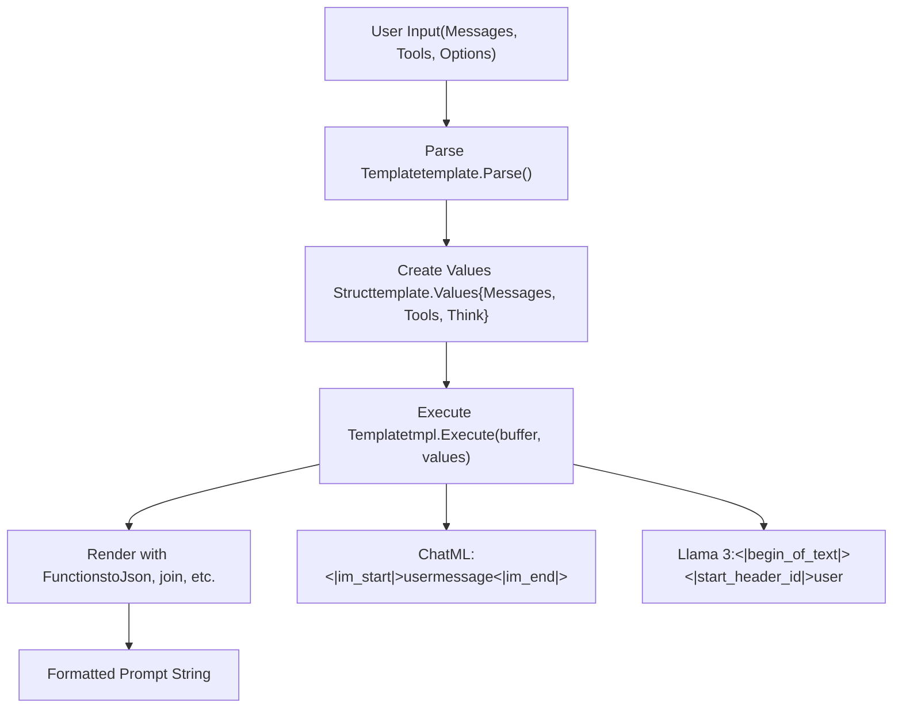
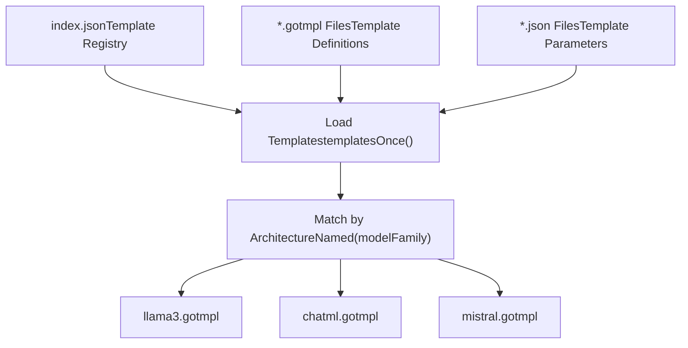
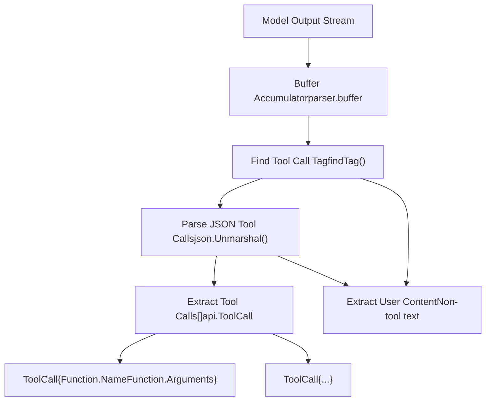
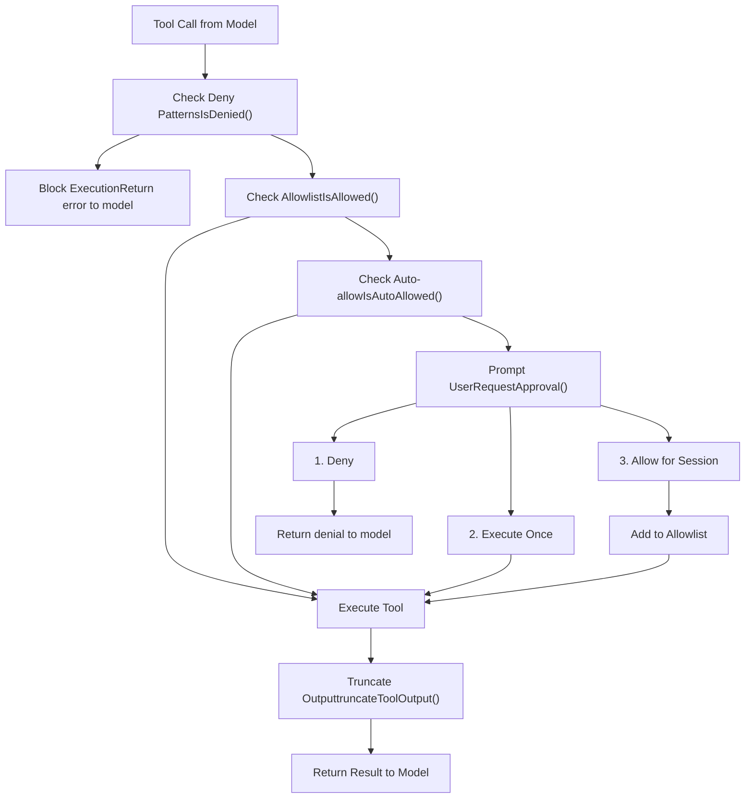
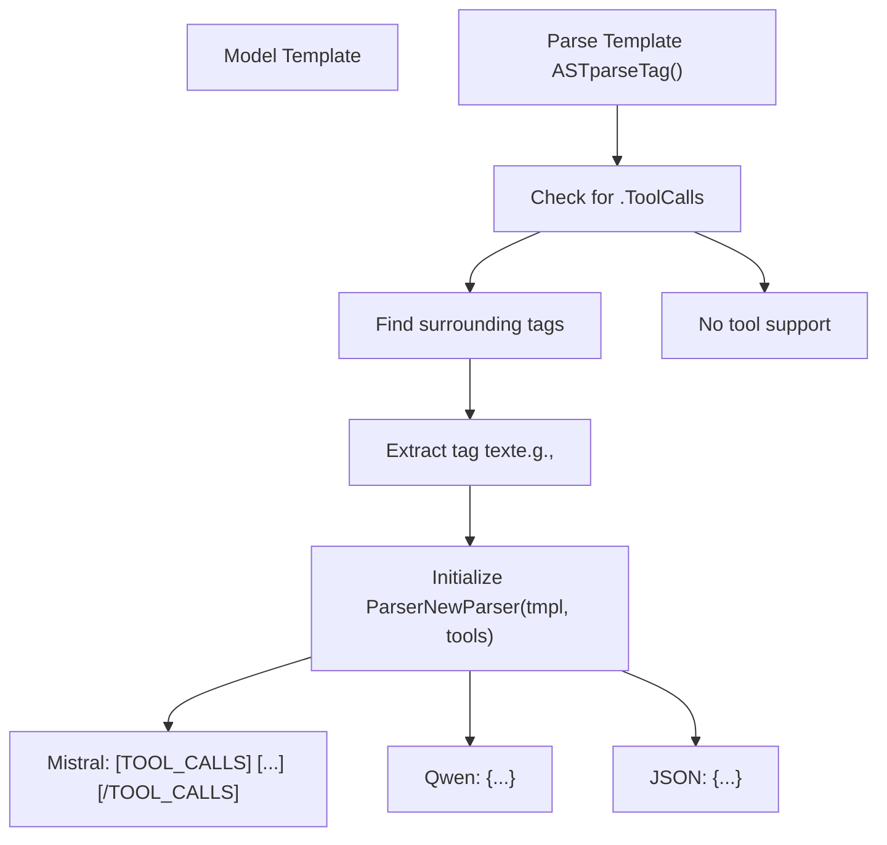
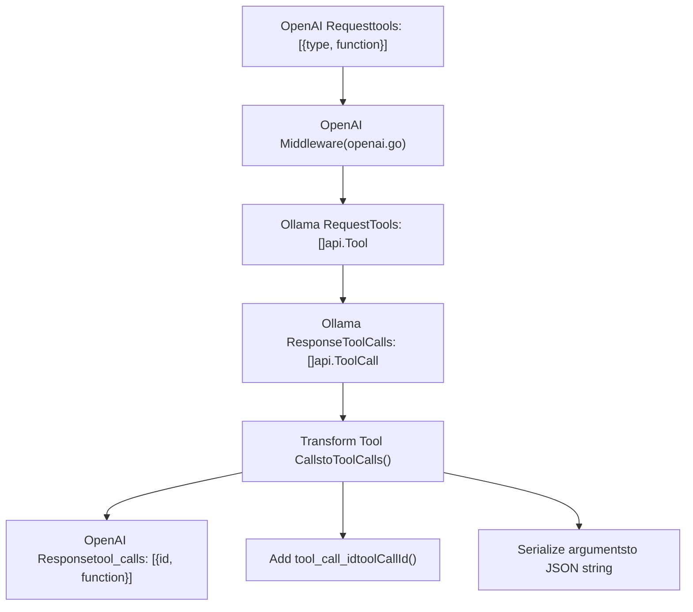
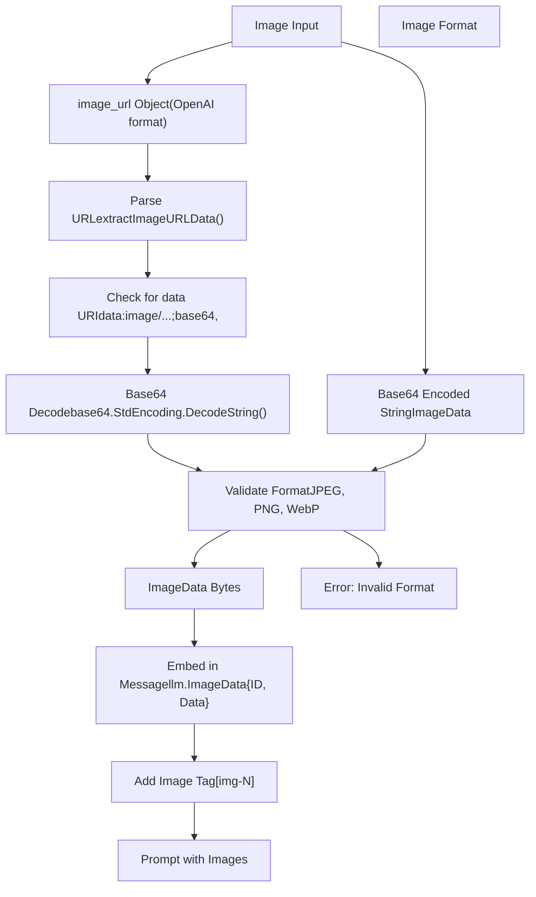
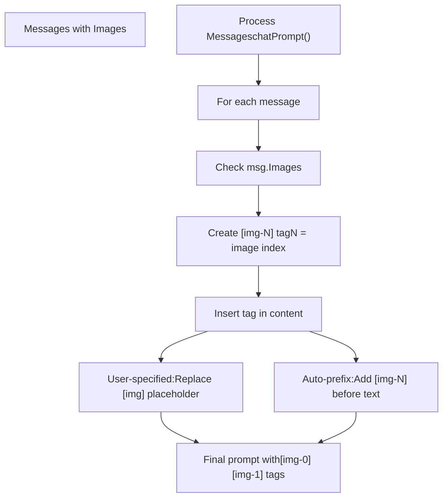
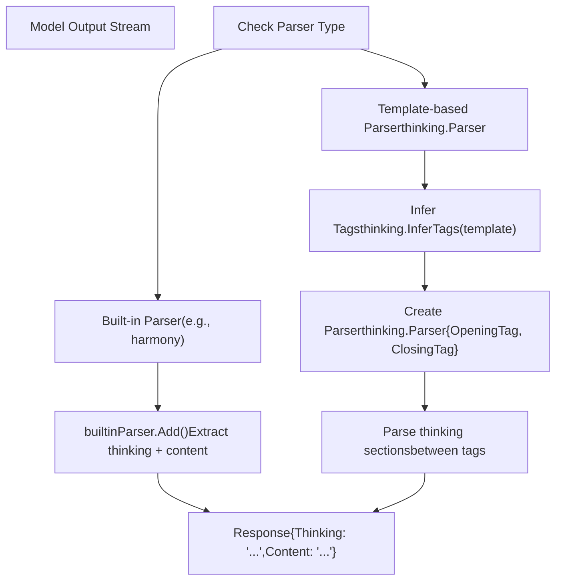

# Advanced Features

Relevant source files

-   [anthropic/anthropic.go](https://github.com/ollama/ollama/blob/562c76d7/anthropic/anthropic.go)
-   [anthropic/anthropic\_test.go](https://github.com/ollama/ollama/blob/562c76d7/anthropic/anthropic_test.go)
-   [api/client.go](https://github.com/ollama/ollama/blob/562c76d7/api/client.go)
-   [api/client\_test.go](https://github.com/ollama/ollama/blob/562c76d7/api/client_test.go)
-   [api/types.go](https://github.com/ollama/ollama/blob/562c76d7/api/types.go)
-   [cmd/cmd.go](https://github.com/ollama/ollama/blob/562c76d7/cmd/cmd.go)
-   [cmd/config/claude.go](https://github.com/ollama/ollama/blob/562c76d7/cmd/config/claude.go)
-   [cmd/config/config.go](https://github.com/ollama/ollama/blob/562c76d7/cmd/config/config.go)
-   [cmd/config/config\_test.go](https://github.com/ollama/ollama/blob/562c76d7/cmd/config/config_test.go)
-   [cmd/config/droid.go](https://github.com/ollama/ollama/blob/562c76d7/cmd/config/droid.go)
-   [cmd/config/droid\_test.go](https://github.com/ollama/ollama/blob/562c76d7/cmd/config/droid_test.go)
-   [cmd/config/integrations.go](https://github.com/ollama/ollama/blob/562c76d7/cmd/config/integrations.go)
-   [cmd/config/integrations\_test.go](https://github.com/ollama/ollama/blob/562c76d7/cmd/config/integrations_test.go)
-   [cmd/config/opencode.go](https://github.com/ollama/ollama/blob/562c76d7/cmd/config/opencode.go)
-   [cmd/config/opencode\_test.go](https://github.com/ollama/ollama/blob/562c76d7/cmd/config/opencode_test.go)
-   [cmd/config/selector.go](https://github.com/ollama/ollama/blob/562c76d7/cmd/config/selector.go)
-   [cmd/config/selector\_test.go](https://github.com/ollama/ollama/blob/562c76d7/cmd/config/selector_test.go)
-   [cmd/tui/tui.go](https://github.com/ollama/ollama/blob/562c76d7/cmd/tui/tui.go)
-   [middleware/anthropic.go](https://github.com/ollama/ollama/blob/562c76d7/middleware/anthropic.go)
-   [server/aliases.go](https://github.com/ollama/ollama/blob/562c76d7/server/aliases.go)
-   [server/images.go](https://github.com/ollama/ollama/blob/562c76d7/server/images.go)
-   [server/routes.go](https://github.com/ollama/ollama/blob/562c76d7/server/routes.go)
-   [server/routes\_aliases\_test.go](https://github.com/ollama/ollama/blob/562c76d7/server/routes_aliases_test.go)
-   [server/routes\_cloud\_test.go](https://github.com/ollama/ollama/blob/562c76d7/server/routes_cloud_test.go)

This document covers advanced capabilities in Ollama: the template system for prompt formatting, tool calling for function execution, multimodal support for processing images alongside text, integrations with external tools and IDEs, and parsers/renderers for structured input/output. For basic generation and chat functionality, see [Generation and Chat API](/ollama/ollama/3.2-generation-and-chat-api). For model management, see [Model Management](/ollama/ollama/4-model-management).

---

## Template System

Ollama uses Go templates to format prompts before sending them to models. Templates convert user messages, system prompts, and tool definitions into the specific format expected by each model architecture. The template engine is implemented in [template/template.go](https://github.com/ollama/ollama/blob/562c76d7/template/template.go) and provides custom functions beyond standard Go template capabilities.

### Template Structure

Templates execute against a `Values` struct containing:

| Field | Type | Description |
| --- | --- | --- |
| `Messages` | `[]api.Message` | Conversation history with roles and content |
| `Tools` | `[]api.Tool` | Available function definitions |
| `System` | `string` | System prompt override |
| `Prompt` | `string` | Single-turn prompt text |
| `Suffix` | `string` | Text after insertion point (for infill models) |
| `Think` | `bool` | Whether to enable thinking/reasoning output |
| `ThinkLevel` | `string` | Thinking level ("high", "medium", "low") |
| `IsThinkSet` | `bool` | Whether Think was explicitly set |

Templates are parsed and executed in [template/template.go173-217](https://github.com/ollama/ollama/blob/562c76d7/template/template.go#L173-L217) using the `Execute` method, which renders the template against the provided values and writes the result to a buffer.

### Custom Template Functions

The template engine provides additional functions beyond Go's standard library:

| Function | Purpose | Example Usage |
| --- | --- | --- |
| `json` | Convert any value to JSON string | `{{ .Tools | json }}` |
| `currentDate` | Get current date in YYYY-MM-DD format | `{{ currentDate }}` |
| `yesterdayDate` | Get yesterday's date in YYYY-MM-DD format | `{{ yesterdayDate }}` |
| `toTypeScriptType` | Convert tool property to TypeScript type string | `{{ .Type | toTypeScriptType }}` |

The template engine also supports all standard Go template functions including control flow (`if`, `range`, `with`), string operations (`printf`, `print`, `println`), and comparisons (`eq`, `ne`, `lt`, `le`, `gt`, `ge`).

Sources: [template/template.go120-143](https://github.com/ollama/ollama/blob/562c76d7/template/template.go#L120-L143)

### Template Execution Flow


Sources: [template/template.go173-217](https://github.com/ollama/ollama/blob/562c76d7/template/template.go#L173-L217) [server/routes.go374-432](https://github.com/ollama/ollama/blob/562c76d7/server/routes.go#L374-L432) [server/prompt.go23-99](https://github.com/ollama/ollama/blob/562c76d7/server/prompt.go#L23-L99)

### Named Templates

Ollama includes pre-defined templates for popular model architectures. Templates are loaded from embedded files and matched to models based on their architecture name:


The matching algorithm uses Levenshtein distance to find the closest template name [template/template.go72-101](https://github.com/ollama/ollama/blob/562c76d7/template/template.go#L72-L101) Each template can include associated parameters like stop sequences [template/template.go63-66](https://github.com/ollama/ollama/blob/562c76d7/template/template.go#L63-L66)

Sources: [template/template.go23-56](https://github.com/ollama/ollama/blob/562c76d7/template/template.go#L23-L56) [template/template.go72-101](https://github.com/ollama/ollama/blob/562c76d7/template/template.go#L72-L101)

### Template Variables

Templates can check for specific variables to enable features:

| Variable Check | Purpose | Example |
| --- | --- | --- |
| `{{ if .Tools }}` | Render tools section | Function definitions for tool calling |
| `{{ if .Suffix }}` | Render infill mode | Code completion with prefix and suffix |
| `{{ if .Think }}` | Enable thinking output | Reasoning before response |
| `{{ if .Messages }}` | Render conversation | Multi-turn chat formatting |

The template system automatically detects capabilities based on which variables are referenced. For example, if a template uses `.Tools`, the model is marked as supporting tool calling [server/images.go108-110](https://github.com/ollama/ollama/blob/562c76d7/server/images.go#L108-L110)

Sources: [template/template.go](https://github.com/ollama/ollama/blob/562c76d7/template/template.go) [server/images.go73-136](https://github.com/ollama/ollama/blob/562c76d7/server/images.go#L73-L136)

---

## Tool Calling and Function Execution

Tool calling enables models to invoke external functions during generation. Models generate structured tool call requests, which applications can execute and return results to the model for further processing. Ollama includes built-in tools for common tasks and supports custom tool definitions.

### Built-in Tools

Ollama provides several built-in tools through the `x/tools` package:

| Tool | Purpose | Implementation |
| --- | --- | --- |
| `bash` | Execute shell commands in a sandboxed environment | [x/tools/bash.go](https://github.com/ollama/ollama/blob/562c76d7/x/tools/bash.go) |
| `web_search` | Search the web via ollama.com search API | [x/tools/websearch.go58-104](https://github.com/ollama/ollama/blob/562c76d7/x/tools/websearch.go#L58-L104) |
| `web_fetch` | Fetch and extract content from web pages | [x/tools/websearch.go106-152](https://github.com/ollama/ollama/blob/562c76d7/x/tools/websearch.go#L106-L152) |

Built-in tools are registered in `DefaultRegistry()` [x/tools/registry.go117-131](https://github.com/ollama/ollama/blob/562c76d7/x/tools/registry.go#L117-L131) and can be disabled via environment variables:

-   `OLLAMA_AGENT_DISABLE_BASH=1` - Disable bash tool
-   `OLLAMA_AGENT_DISABLE_WEBSEARCH=1` - Disable web search tools

Sources: [x/tools/registry.go117-131](https://github.com/ollama/ollama/blob/562c76d7/x/tools/registry.go#L117-L131) [x/tools/bash.go](https://github.com/ollama/ollama/blob/562c76d7/x/tools/bash.go) [x/tools/websearch.go58-152](https://github.com/ollama/ollama/blob/562c76d7/x/tools/websearch.go#L58-L152)

### Tool Registry

The `Registry` type manages available tools [x/tools/registry.go24-34](https://github.com/ollama/ollama/blob/562c76d7/x/tools/registry.go#L24-L34) It provides methods for registering, unregistering, and executing tools:

```
// Core registry operationsRegister(tool Tool)           // Add a toolUnregister(name string)       // Remove a tool by nameGet(name string) (Tool, bool) // Retrieve a toolHas(name string) bool         // Check if tool existsExecute(call api.ToolCall) (string, error) // Execute a tool callTools() api.Tools            // Get all tools in API format
```
Tools must implement the `Tool` interface [x/tools/registry.go13-22](https://github.com/ollama/ollama/blob/562c76d7/x/tools/registry.go#L13-L22):

```
type Tool interface {    Name() string                    // Unique identifier    Description() string             // Human-readable description    Schema() api.ToolFunction        // Parameter schema for LLM    Execute(args map[string]any) (string, error) // Execute with arguments}
```
Sources: [x/tools/registry.go13-34](https://github.com/ollama/ollama/blob/562c76d7/x/tools/registry.go#L13-L34) [x/tools/registry.go93-100](https://github.com/ollama/ollama/blob/562c76d7/x/tools/registry.go#L93-L100)

### Tool Definition Format

Tools are defined using JSON Schema to specify function signatures:

```
// From api/types.go:203-321type Tool struct {    Type     string       // "function"    Function ToolFunction} type ToolFunction struct {    Name        string    Description string    Parameters  ToolFunctionParameters} type ToolFunctionParameters struct {    Type       string                  // "object"    Required   []string                // Required parameter names    Properties map[string]ToolProperty // Parameter definitions} type ToolProperty struct {    Type        PropertyType // "string", "number", "boolean", etc.    Description string    Enum        []any // Valid values (optional)}
```
Tools are passed in chat requests [api/types.go132-133](https://github.com/ollama/ollama/blob/562c76d7/api/types.go#L132-L133) and rendered into prompts via templates [server/prompt.go23-99](https://github.com/ollama/ollama/blob/562c76d7/server/prompt.go#L23-L99)

Sources: [api/types.go203-321](https://github.com/ollama/ollama/blob/562c76d7/api/types.go#L203-L321) [api/types.go148-153](https://github.com/ollama/ollama/blob/562c76d7/api/types.go#L148-L153)

### Tool Call Parsing

The tool parser extracts structured tool calls from model output:


The parser operates in three states defined in [tools/tools.go12-18](https://github.com/ollama/ollama/blob/562c76d7/tools/tools.go#L12-L18):

1.  `toolsState_LookingForTag`: Searching for the tool call delimiter
2.  `toolsState_ToolCalling`: Inside a tool call block, accumulating JSON
3.  `toolsState_Done`: Tool call parsing complete

Sources: [tools/tools.go12-70](https://github.com/ollama/ollama/blob/562c76d7/tools/tools.go#L12-L70) [tools/tools.go34-57](https://github.com/ollama/ollama/blob/562c76d7/tools/tools.go#L34-L57)

### Tool Approval System

When using the interactive agent mode (`ollama run --experimental`), tool calls require user approval before execution. The approval system implements safety checks and user confirmation [x/agent/approval.go138-151](https://github.com/ollama/ollama/blob/562c76d7/x/agent/approval.go#L138-L151)

#### Approval Flow


The approval manager maintains session-specific allowlists [x/agent/approval.go138-151](https://github.com/ollama/ollama/blob/562c76d7/x/agent/approval.go#L138-L151) and supports prefix matching for related commands [x/agent/approval.go200-300](https://github.com/ollama/ollama/blob/562c76d7/x/agent/approval.go#L200-L300)

Sources: [x/agent/approval.go138-194](https://github.com/ollama/ollama/blob/562c76d7/x/agent/approval.go#L138-L194) [x/agent/approval.go200-300](https://github.com/ollama/ollama/blob/562c76d7/x/agent/approval.go#L200-L300) [x/cmd/run.go346-414](https://github.com/ollama/ollama/blob/562c76d7/x/cmd/run.go#L346-L414)

#### Safety Mechanisms

The approval system implements three layers of safety:

**Auto-allowed Commands** [x/agent/approval.go62-92](https://github.com/ollama/ollama/blob/562c76d7/x/agent/approval.go#L62-L92) - Safe, read-only commands that never require approval:

-   Basic info: `pwd`, `echo`, `date`, `whoami`, `hostname`, `uname`
-   Git read operations: `git status`, `git log`, `git diff`, `git branch`
-   Package manager read: `npm list`, `pip list`, `go list`
-   Build commands: `go build`, `go test`, `make`, `cargo build`

**Deny Patterns** [x/agent/approval.go95-122](https://github.com/ollama/ollama/blob/562c76d7/x/agent/approval.go#L95-L122) - Dangerous patterns that are always blocked:

-   Destructive: `rm -rf`, `mkfs`, `dd if=`, `shred`
-   Privilege escalation: `sudo`, `chmod 777`, `chown`
-   Network exfiltration: `curl -d`, `wget --post`, `nc`, `scp`
-   Credential access: `.ssh/id_rsa`, `.aws/credentials`, `/etc/shadow`

**Prefix Allowlisting** [x/agent/approval.go200-285](https://github.com/ollama/ollama/blob/562c76d7/x/agent/approval.go#L200-L285) - Allowing commands on specific directories:

-   Extracted from paths in approved commands (e.g., `cat tools/file.go` → allow `cat:tools/`)
-   Prevents directory traversal (`../` escapes are rejected)
-   Scoped to current working directory for security

Sources: [x/agent/approval.go62-122](https://github.com/ollama/ollama/blob/562c76d7/x/agent/approval.go#L62-L122) [x/agent/approval.go200-285](https://github.com/ollama/ollama/blob/562c76d7/x/agent/approval.go#L200-L285)

### Tool Call Execution Flow

> **[Mermaid sequence]**
> *(图表结构无法解析)*

Sources: [server/routes.go1540-1733](https://github.com/ollama/ollama/blob/562c76d7/server/routes.go#L1540-L1733) [tools/tools.go46-70](https://github.com/ollama/ollama/blob/562c76d7/tools/tools.go#L46-L70) [server/prompt.go99-117](https://github.com/ollama/ollama/blob/562c76d7/server/prompt.go#L99-L117) [x/cmd/run.go336-463](https://github.com/ollama/ollama/blob/562c76d7/x/cmd/run.go#L336-L463)

### Tool Call Format Detection

Different models use different formats for tool calls. The parser detects the format by examining the template:


The tag is extracted by walking the template's parse tree and identifying text nodes adjacent to `{{ .ToolCalls }}` [tools/tools.go82-137](https://github.com/ollama/ollama/blob/562c76d7/tools/tools.go#L82-L137)

Sources: [tools/tools.go82-137](https://github.com/ollama/ollama/blob/562c76d7/tools/tools.go#L82-L137) [tools/tools.go34-44](https://github.com/ollama/ollama/blob/562c76d7/tools/tools.go#L34-L44)

### Bash Tool Implementation

The bash tool executes shell commands with safety constraints [x/tools/bash.go](https://github.com/ollama/ollama/blob/562c76d7/x/tools/bash.go):

```
// Bash tool schemaName: "bash"Parameters: {    Type: "object",    Required: ["command"],    Properties: {        "command": {Type: "string", Description: "Shell command to execute"}    }}
```
**Execution Environment:**

-   Working directory: Current directory (`os.Getwd()`)
-   Shell: System shell (`/bin/sh` on Unix, `cmd.exe` on Windows)
-   Output capture: Combined stdout and stderr
-   Timeout: Configurable per execution

**Safety Features:**

-   No automatic privilege escalation
-   Output truncation to prevent context overflow [x/cmd/run.go66-79](https://github.com/ollama/ollama/blob/562c76d7/x/cmd/run.go#L66-L79)
-   Integration with approval system for dangerous commands
-   Current working directory scope (no automatic access to parent directories)

Sources: [x/tools/bash.go](https://github.com/ollama/ollama/blob/562c76d7/x/tools/bash.go) [x/cmd/run.go66-79](https://github.com/ollama/ollama/blob/562c76d7/x/cmd/run.go#L66-L79)

### Web Search Tools

Ollama provides web search capabilities through ollama.com's search API:

**web\_search Tool** [x/tools/websearch.go58-104](https://github.com/ollama/ollama/blob/562c76d7/x/tools/websearch.go#L58-L104)

```
Parameters: {    "query": "Search query string",    "num_results": "Number of results (default: 5, max: 10)"}
```
Returns formatted search results with titles, URLs, and snippets.

**web\_fetch Tool** [x/tools/websearch.go106-152](https://github.com/ollama/ollama/blob/562c76d7/x/tools/websearch.go#L106-L152)

```
Parameters: {    "url": "URL to fetch content from"}
```
Fetches and extracts readable content from web pages using the Jina Reader API.

**Authentication:** Web search tools require authentication via `ollama signin` [x/cmd/run.go82-121](https://github.com/ollama/ollama/blob/562c76d7/x/cmd/run.go#L82-L121):

1.  On 401 error, display signin URL
2.  Poll `/api/whoami` endpoint until authenticated
3.  Retry the search request

Sources: [x/tools/websearch.go20-152](https://github.com/ollama/ollama/blob/562c76d7/x/tools/websearch.go#L20-L152) [x/cmd/run.go82-121](https://github.com/ollama/ollama/blob/562c76d7/x/cmd/run.go#L82-L121)

### OpenAI-Compatible Tool Calling

The OpenAI compatibility layer translates tool calls between OpenAI and Ollama formats:


The transformation adds OpenAI-specific fields like `tool_call_id` [openai/openai.go231-257](https://github.com/ollama/ollama/blob/562c76d7/openai/openai.go#L231-L257) and serializes function arguments [openai/openai.go248-254](https://github.com/ollama/ollama/blob/562c76d7/openai/openai.go#L248-L254)

Sources: [openai/openai.go92-109](https://github.com/ollama/ollama/blob/562c76d7/openai/openai.go#L92-L109) [openai/openai.go231-257](https://github.com/ollama/ollama/blob/562c76d7/openai/openai.go#L231-L257) [openai/openai.go259-282](https://github.com/ollama/ollama/blob/562c76d7/openai/openai.go#L259-L282)

---

## Multimodal and Vision Support

Ollama supports multimodal models that can process images alongside text. Images are encoded as base64 data and embedded into prompts with special tags that vision models recognize.

### Image Data Format

Images are represented as byte arrays and passed through the API:

```
// From api/types.go:54-55type ImageData []byte // Messages can contain both text and images// From api/types.go:163-172type Message struct {    Role      string    Content   string    Images    []ImageData    // Base64-encoded image data    ToolCalls []ToolCall}
```
Images are accepted in requests in two ways:

1.  As base64-encoded data in message content [openai/openai.go413-445](https://github.com/ollama/ollama/blob/562c76d7/openai/openai.go#L413-L445)
2.  As separate `Images` array in the message [api/types.go169](https://github.com/ollama/ollama/blob/562c76d7/api/types.go#L169-L169)

Sources: [api/types.go54-55](https://github.com/ollama/ollama/blob/562c76d7/api/types.go#L54-L55) [api/types.go163-172](https://github.com/ollama/ollama/blob/562c76d7/api/types.go#L163-L172)

### Image Processing Pipeline


The image validation checks for supported formats by examining the decoded data [openai/openai.go420-445](https://github.com/ollama/ollama/blob/562c76d7/openai/openai.go#L420-L445) WebP images are specially handled [server/routes.go29](https://github.com/ollama/ollama/blob/562c76d7/server/routes.go#L29-L29)

Sources: [openai/openai.go413-465](https://github.com/ollama/ollama/blob/562c76d7/openai/openai.go#L413-L465) [server/routes.go368-371](https://github.com/ollama/ollama/blob/562c76d7/server/routes.go#L368-L371) [server/routes.go400-406](https://github.com/ollama/ollama/blob/562c76d7/server/routes.go#L400-L406)

### Image Tag Embedding

Images are embedded into prompts using numbered tags:


The image embedding logic is in [server/prompt.go72-96](https://github.com/ollama/ollama/blob/562c76d7/server/prompt.go#L72-L96) If the user includes `[img]` in their message, it's replaced with `[img-N]`. Otherwise, image tags are prepended to the message content.

Sources: [server/prompt.go72-96](https://github.com/ollama/ollama/blob/562c76d7/server/prompt.go#L72-L96) [server/routes.go400-406](https://github.com/ollama/ollama/blob/562c76d7/server/routes.go#L400-L406)

### Vision Model Support

Vision models are detected through multiple mechanisms:

| Detection Method | Implementation | Location |
| --- | --- | --- |
| Projector paths | `len(m.ProjectorPaths) > 0` | [server/images.go118-120](https://github.com/ollama/ollama/blob/562c76d7/server/images.go#L118-L120) |
| Vision capability | `model.CapabilityVision` in capabilities list | [server/images.go88-90](https://github.com/ollama/ollama/blob/562c76d7/server/images.go#L88-L90) |
| Vision metadata | `"vision.block_count"` in GGUF metadata | [server/images.go88-90](https://github.com/ollama/ollama/blob/562c76d7/server/images.go#L88-L90) |
| Template variable | Template uses image-related variables | [server/routes.go431-444](https://github.com/ollama/ollama/blob/562c76d7/server/routes.go#L431-L444) |

For OpenAI compatibility, the system checks `ProjectorInfo` in model details [cmd/cmd.go436-444](https://github.com/ollama/ollama/blob/562c76d7/cmd/cmd.go#L436-L444)

Sources: [server/images.go73-136](https://github.com/ollama/ollama/blob/562c76d7/server/images.go#L73-L136) [cmd/cmd.go436-444](https://github.com/ollama/ollama/blob/562c76d7/cmd/cmd.go#L436-L444)

### Multimodal Request Example

> **[Mermaid sequence]**
> *(图表结构无法解析)*

Some models like `mllama` only support a single image [server/routes.go363-366](https://github.com/ollama/ollama/blob/562c76d7/server/routes.go#L363-L366) which is validated before processing.

Sources: [server/routes.go1540-1733](https://github.com/ollama/ollama/blob/562c76d7/server/routes.go#L1540-L1733) [server/routes.go363-366](https://github.com/ollama/ollama/blob/562c76d7/server/routes.go#L363-L366) [server/prompt.go23-99](https://github.com/ollama/ollama/blob/562c76d7/server/prompt.go#L23-L99)

### Image Format Support

Supported image formats and processing:

```
// Supported MIME types"image/jpeg" - JPEG images"image/jpg"  - JPEG images (alternate)"image/png"  - PNG images  "image/webp" - WebP images (requires golang.org/x/image/webp)
```
WebP support is explicitly imported [server/routes.go29](https://github.com/ollama/ollama/blob/562c76d7/server/routes.go#L29-L29) and processed using the `golang.org/x/image/webp` package. Images are decoded from base64 when embedded in OpenAI-style requests [openai/openai.go420-445](https://github.com/ollama/ollama/blob/562c76d7/openai/openai.go#L420-L445)

Sources: [server/routes.go29](https://github.com/ollama/ollama/blob/562c76d7/server/routes.go#L29-L29) [openai/openai.go413-465](https://github.com/ollama/ollama/blob/562c76d7/openai/openai.go#L413-L465)

---

## Thinking/Reasoning Models

Some models support explicit thinking or reasoning steps before generating responses. This feature allows models to show their reasoning process.

### Thinking Configuration

Thinking can be enabled via the `Think` parameter:

```
// From api/types.go:103-107Think *ThinkValue `json:"think,omitempty"` // ThinkValue can be:// - Boolean: true/false// - String: "high", "medium", "low" (for models supporting levels)
```
The thinking configuration is passed through templates [template/template.go61-81](https://github.com/ollama/ollama/blob/562c76d7/template/template.go#L61-L81) and affects prompt rendering [server/routes.go408-413](https://github.com/ollama/ollama/blob/562c76d7/server/routes.go#L408-L413)

Sources: [api/types.go103-107](https://github.com/ollama/ollama/blob/562c76d7/api/types.go#L103-L107) [api/types.go139-141](https://github.com/ollama/ollama/blob/562c76d7/api/types.go#L139-L141) [template/template.go61-81](https://github.com/ollama/ollama/blob/562c76d7/template/template.go#L61-L81)

### Thinking Output Parsing


The thinking parser separates reasoning text from final response content. Tags are inferred from the template [server/routes.go449-459](https://github.com/ollama/ollama/blob/562c76d7/server/routes.go#L449-L459) or provided by built-in parsers [server/routes.go310-321](https://github.com/ollama/ollama/blob/562c76d7/server/routes.go#L310-L321)

Sources: [server/routes.go447-500](https://github.com/ollama/ollama/blob/562c76d7/server/routes.go#L447-L500) [thinking/thinking.go](https://github.com/ollama/ollama/blob/562c76d7/thinking/thinking.go)

### Thinking Capability Detection

Models advertise thinking support through capabilities:

```
// From server/images.go:127-133openingTag, closingTag := thinking.InferTags(m.Template.Template)hasTags := openingTag != "" && closingTag != ""isGptoss := slices.Contains([]string{"gptoss", "gpt-oss"}, m.Config.ModelFamily)if hasTags || isGptoss || (builtinParser != nil && builtinParser.HasThinkingSupport()) {    capabilities = append(capabilities, model.CapabilityThinking)}
```
The capability is checked before allowing thinking requests [server/routes.go324-338](https://github.com/ollama/ollama/blob/562c76d7/server/routes.go#L324-L338)

Sources: [server/images.go127-133](https://github.com/ollama/ollama/blob/562c76d7/server/images.go#L127-L133) [server/routes.go324-338](https://github.com/ollama/ollama/blob/562c76d7/server/routes.go#L324-L338)
