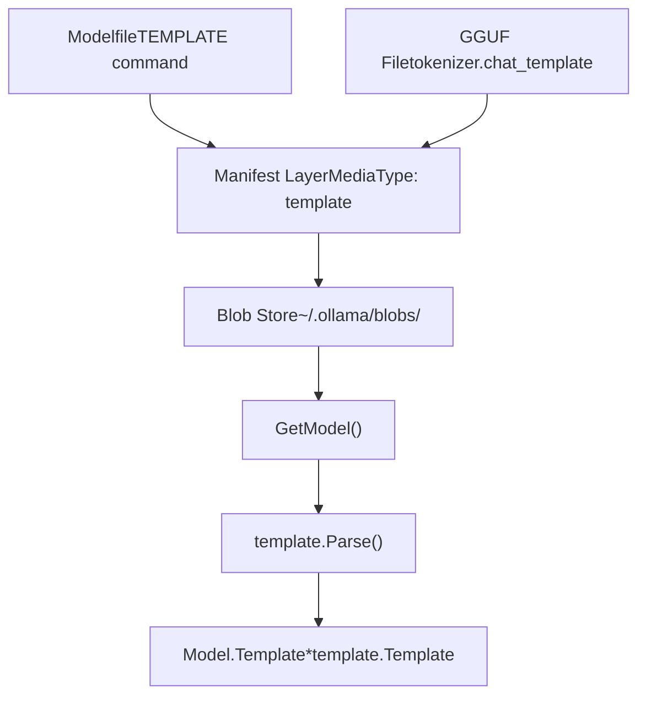
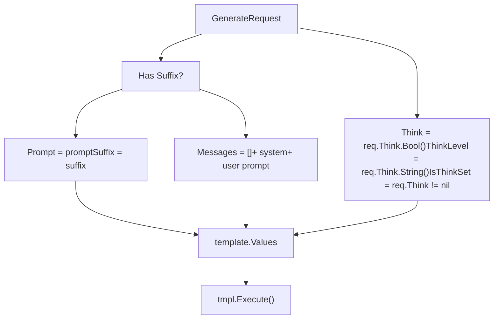
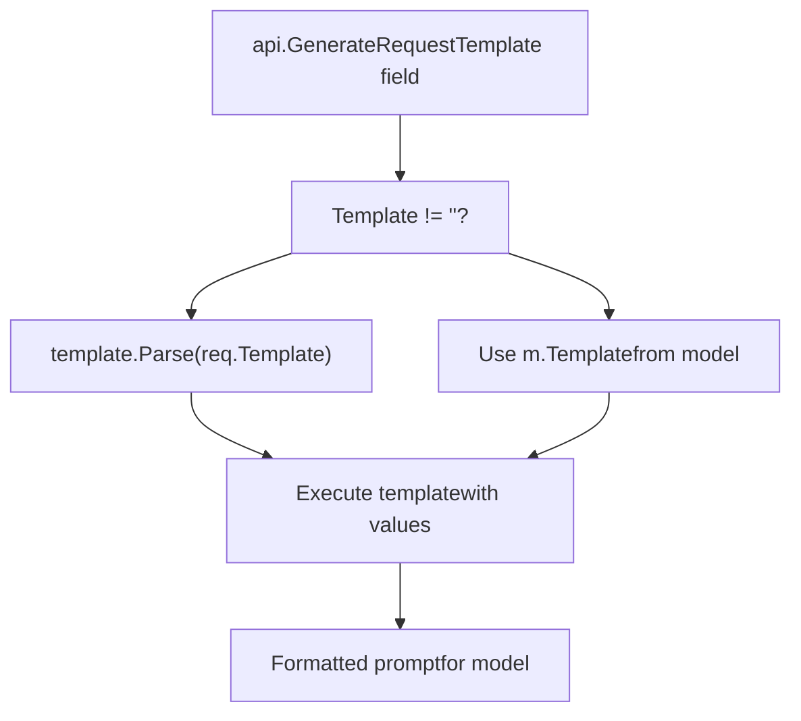
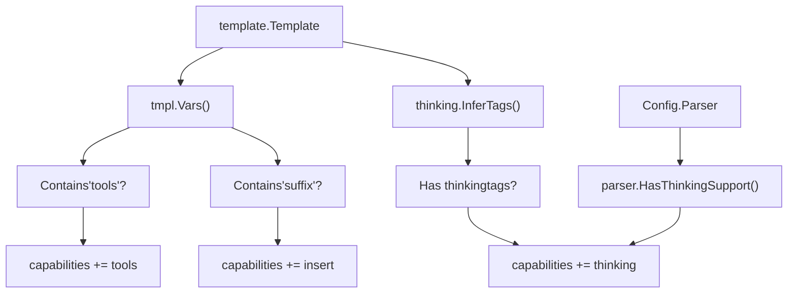
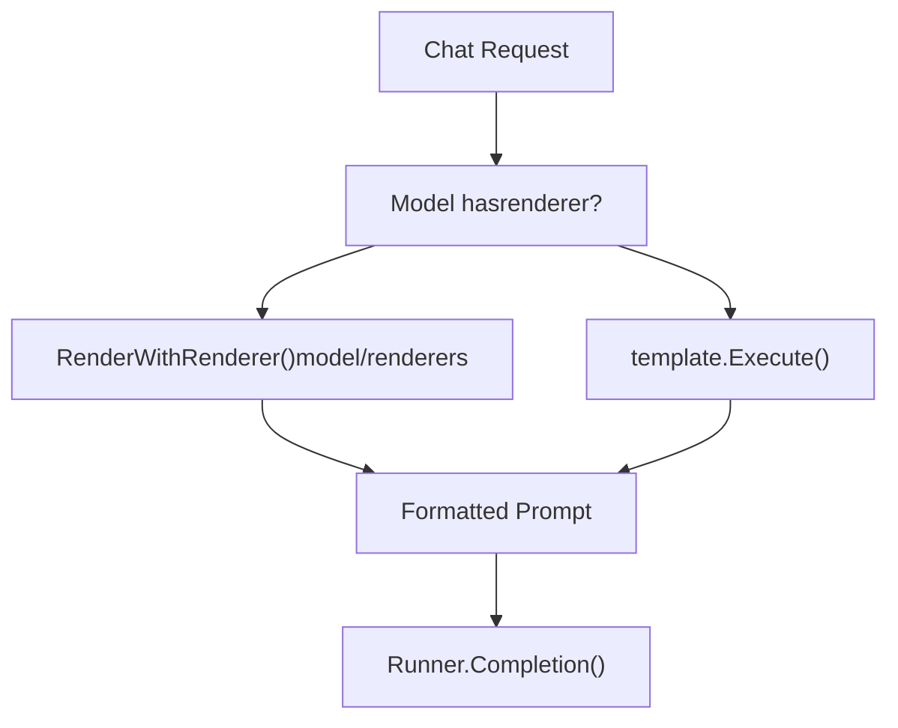
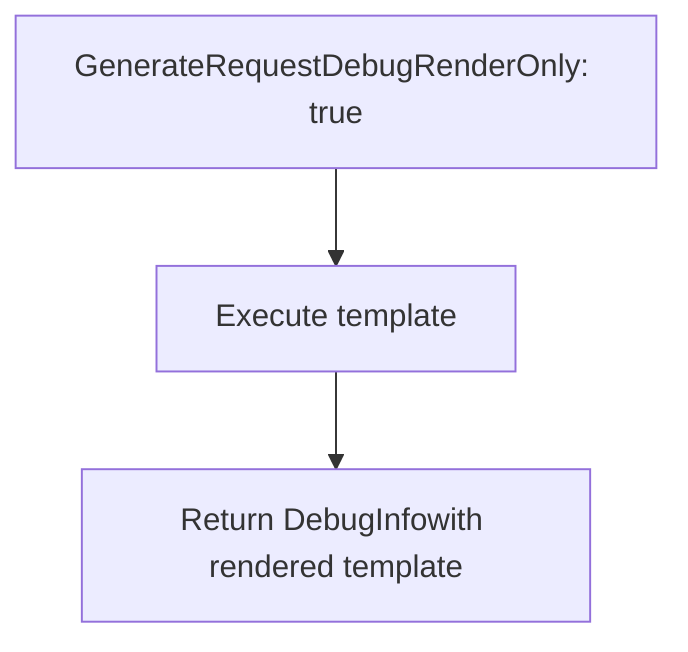

# Template System

Relevant source files

-   [api/client.go](https://github.com/ollama/ollama/blob/562c76d7/api/client.go)
-   [api/client\_test.go](https://github.com/ollama/ollama/blob/562c76d7/api/client_test.go)
-   [api/types.go](https://github.com/ollama/ollama/blob/562c76d7/api/types.go)
-   [cmd/cmd.go](https://github.com/ollama/ollama/blob/562c76d7/cmd/cmd.go)
-   [convert/convert.go](https://github.com/ollama/ollama/blob/562c76d7/convert/convert.go)
-   [fs/ggml/ggml.go](https://github.com/ollama/ollama/blob/562c76d7/fs/ggml/ggml.go)
-   [fs/ggml/ggml\_test.go](https://github.com/ollama/ollama/blob/562c76d7/fs/ggml/ggml_test.go)
-   [model/models/models.go](https://github.com/ollama/ollama/blob/562c76d7/model/models/models.go)
-   [model/parsers/parsers.go](https://github.com/ollama/ollama/blob/562c76d7/model/parsers/parsers.go)
-   [model/parsers/parsers\_test.go](https://github.com/ollama/ollama/blob/562c76d7/model/parsers/parsers_test.go)
-   [model/renderers/glmocr.go](https://github.com/ollama/ollama/blob/562c76d7/model/renderers/glmocr.go)
-   [model/renderers/glmocr\_test.go](https://github.com/ollama/ollama/blob/562c76d7/model/renderers/glmocr_test.go)
-   [model/renderers/renderer.go](https://github.com/ollama/ollama/blob/562c76d7/model/renderers/renderer.go)
-   [server/images.go](https://github.com/ollama/ollama/blob/562c76d7/server/images.go)
-   [server/routes.go](https://github.com/ollama/ollama/blob/562c76d7/server/routes.go)

## Overview

The template system in Ollama converts high-level chat messages and prompts into the specific text format expected by different language models. Each model family (Llama, Gemma, Qwen, etc.) uses different special tokens and formatting conventions, and the template system provides a flexible mechanism to handle these differences through Go template syntax.

For information about how templates interact with thinking/reasoning output, see [Thinking Models and Reasoning](/ollama/ollama/5.5-thinking-models-and-reasoning). For details on tool calling format within templates, see [Tool Calling and Function Execution](/ollama/ollama/7.2-tool-calling-and-function-execution).

**Sources:** [server/routes.go1-658](https://github.com/ollama/ollama/blob/562c76d7/server/routes.go#L1-L658) [server/images.go57-73](https://github.com/ollama/ollama/blob/562c76d7/server/images.go#L57-L73) [api/types.go62-144](https://github.com/ollama/ollama/blob/562c76d7/api/types.go#L62-L144)

## Template Storage and Retrieval

### Template Storage in Model Manifests

Templates are stored as distinct layers within model manifests using the media type `application/vnd.ollama.image.template`. When a model is loaded, the template is read from the blob storage and parsed into a `template.Template` object.

**Diagram: Template Loading Flow**

The `GetModel()` function in [server/images.go275-373](https://github.com/ollama/ollama/blob/562c76d7/server/images.go#L275-L373) loads templates from manifest layers. When a layer has media type `"application/vnd.ollama.image.template"` or the deprecated `"application/vnd.ollama.image.prompt"`, the template content is read and parsed at lines 324-334.

**Sources:** [server/images.go324-334](https://github.com/ollama/ollama/blob/562c76d7/server/images.go#L324-L334) [server/images.go286](https://github.com/ollama/ollama/blob/562c76d7/server/images.go#L286-L286)

### Default Templates

If no template is explicitly provided, models receive a `DefaultTemplate` as shown at [server/images.go286](https://github.com/ollama/ollama/blob/562c76d7/server/images.go#L286-L286) This ensures every model has a working template even if none was specified.

**Sources:** [server/images.go286](https://github.com/ollama/ollama/blob/562c76d7/server/images.go#L286-L286)

### Template Extraction from GGUF Metadata

Templates can also be embedded in GGUF model files as part of the tokenizer metadata. The key `tokenizer.chat_template` in GGUF key-value storage contains the template string, which is extracted during model conversion.

**Sources:** [convert/convert.go146](https://github.com/ollama/ollama/blob/562c76d7/convert/convert.go#L146-L146) [fs/ggml/ggml.go141-143](https://github.com/ollama/ollama/blob/562c76d7/fs/ggml/ggml.go#L141-L143)

## Template Variables

Templates are executed with a `template.Values` struct that provides variables for the model-specific formatting. The following variables are available:

| Variable | Type | Purpose |
| --- | --- | --- |
| `Messages` | `[]api.Message` | Chat message history for multi-turn conversations |
| `Prompt` | `string` | User prompt for single-turn completion |
| `Suffix` | `string` | Text after cursor for infill/insert tasks |
| `Tools` | `[]api.Tool` | Available function definitions for tool calling |
| `Think` | `bool` | Whether thinking/reasoning should be enabled |
| `ThinkLevel` | `string` | Thinking intensity level ("high", "medium", "low") |
| `IsThinkSet` | `bool` | Whether Think parameter was explicitly set |

**Sources:** [server/routes.go434-462](https://github.com/ollama/ollama/blob/562c76d7/server/routes.go#L434-L462)

### Variable Population in Generation Requests

For `/api/generate` requests, template variables are populated at [server/routes.go434-462](https://github.com/ollama/ollama/blob/562c76d7/server/routes.go#L434-L462):

**Diagram: Template Variable Population**

The system message comes from either the request (`req.System`) or the model's default (`m.System`) as shown at lines 440-443. User messages are constructed with prompt content and any attached images.

**Sources:** [server/routes.go434-462](https://github.com/ollama/ollama/blob/562c76d7/server/routes.go#L434-L462)

## Template Execution Flow

### Request to Prompt Rendering

The template execution process transforms API requests into model-ready prompts through several stages:

> **[Mermaid sequence]**
> *(图表结构无法解析)*

**Diagram: Template Execution Sequence**

The key decision point at [server/routes.go480-501](https://github.com/ollama/ollama/blob/562c76d7/server/routes.go#L480-L501) determines whether to use the chat-like flow (which supports renderers and better multi-turn handling) or the legacy template execution flow.

**Sources:** [server/routes.go423-501](https://github.com/ollama/ollama/blob/562c76d7/server/routes.go#L423-L501)

### Template Override Mechanism

Templates can be overridden at request time through the `Template` field in `GenerateRequest`:

**Diagram: Template Selection Logic**

This override capability is implemented at [server/routes.go425-432](https://github.com/ollama/ollama/blob/562c76d7/server/routes.go#L425-L432) and allows callers to experiment with different prompt formats without modifying the model itself.

**Sources:** [server/routes.go425-432](https://github.com/ollama/ollama/blob/562c76d7/server/routes.go#L425-L432) [api/types.go76](https://github.com/ollama/ollama/blob/562c76d7/api/types.go#L76-L76)

### Raw Mode

When `Raw: true` is set in the request, template execution is skipped entirely at [server/routes.go355-358](https://github.com/ollama/ollama/blob/562c76d7/server/routes.go#L355-L358) This mode requires that template, system, and context fields are not set, and passes the prompt directly to the model without any formatting.

**Sources:** [server/routes.go355-358](https://github.com/ollama/ollama/blob/562c76d7/server/routes.go#L355-L358)

## Capability Detection from Templates

The template system participates in model capability detection by analyzing template structure. The `Capabilities()` method at [server/images.go78-145](https://github.com/ollama/ollama/blob/562c76d7/server/images.go#L78-L145) examines templates to determine supported features:

| Capability | Detection Method |
| --- | --- |
| `tools` | Template contains `tools` variable or uses parser with tool support |
| `insert` | Template contains `suffix` variable |
| `thinking` | Template has thinking tags or uses thinking parser |

**Example capability detection logic:**

**Diagram: Template-Based Capability Detection**

**Sources:** [server/images.go111-143](https://github.com/ollama/ollama/blob/562c76d7/server/images.go#L111-L143)

## Chat Template Format Detection

### GGUF Chat Template Extraction

Chat templates are extracted from GGUF files during model conversion. The `ChatTemplate()` method at [fs/ggml/ggml.go141-143](https://github.com/ollama/ollama/blob/562c76d7/fs/ggml/ggml.go#L141-L143) retrieves the template string from the `tokenizer.chat_template` key in the GGUF key-value store.

During conversion from HuggingFace/Safetensors format to GGUF, the template is preserved in the tokenizer configuration at [convert/convert.go145-147](https://github.com/ollama/ollama/blob/562c76d7/convert/convert.go#L145-L147)

**Sources:** [fs/ggml/ggml.go141-143](https://github.com/ollama/ollama/blob/562c76d7/fs/ggml/ggml.go#L141-L143) [convert/convert.go145-147](https://github.com/ollama/ollama/blob/562c76d7/convert/convert.go#L145-L147)

### Template Variable Analysis

The `Vars()` method on templates returns a list of variable names that the template references. This is used for capability detection as shown above, checking for presence of variables like `tools`, `suffix`, and message-related variables.

**Sources:** [server/images.go113-116](https://github.com/ollama/ollama/blob/562c76d7/server/images.go#L113-L116)

## Renderers and Parsers Integration

The template system integrates with two specialized subsystems for advanced model-specific handling:

### Renderer System

Renderers provide an alternative to Go templates for models that require complex formatting logic. When a model has `Config.Renderer` set, the renderer takes precedence over template execution for chat requests.

**Diagram: Renderer vs Template Selection**

Available renderers are registered in [model/renderers/renderer.go45-97](https://github.com/ollama/ollama/blob/562c76d7/model/renderers/renderer.go#L45-L97) and include specialized implementations for models like `qwen3-vl-instruct`, `deepseek3.1`, `glm-ocr`, etc.

**Sources:** [model/renderers/renderer.go1-98](https://github.com/ollama/ollama/blob/562c76d7/model/renderers/renderer.go#L1-L98)

### Parser System

Parsers handle model-specific output format parsing, including tool call extraction and thinking block detection. The parser is specified via `Config.Parser` and integrates with template execution at [server/routes.go360-371](https://github.com/ollama/ollama/blob/562c76d7/server/routes.go#L360-L371)

For example, the harmony parser is used for `gptoss` models when certain tags are detected at [server/routes.go67-77](https://github.com/ollama/ollama/blob/562c76d7/server/routes.go#L67-L77)

**Sources:** [server/routes.go360-371](https://github.com/ollama/ollama/blob/562c76d7/server/routes.go#L360-L371) [model/parsers/parsers.go41-90](https://github.com/ollama/ollama/blob/562c76d7/model/parsers/parsers.go#L41-L90)

## Debug and Development Features

### Debug Render Mode

The `DebugRenderOnly` flag in `GenerateRequest` allows developers to see the rendered template without executing the model. When set to `true`, the system returns the formatted prompt in the response at [server/routes.go504-514](https://github.com/ollama/ollama/blob/562c76d7/server/routes.go#L504-L514)

**Diagram: Debug Render Flow**

This feature is useful for debugging template formatting issues without consuming model inference resources.

**Sources:** [server/routes.go504-514](https://github.com/ollama/ollama/blob/562c76d7/server/routes.go#L504-L514) [api/types.go119-121](https://github.com/ollama/ollama/blob/562c76d7/api/types.go#L119-L121)

## Template Error Handling

Template parsing and execution can fail in several ways:

| Error Type | Handling | Location |
| --- | --- | --- |
| Parse error | Return 500 with error message | [server/routes.go427-431](https://github.com/ollama/ollama/blob/562c76d7/server/routes.go#L427-L431) |
| Execution error | Return 500 with error message | [server/routes.go494-497](https://github.com/ollama/ollama/blob/562c76d7/server/routes.go#L494-L497) |
| Missing template | Use DefaultTemplate | [server/images.go286](https://github.com/ollama/ollama/blob/562c76d7/server/images.go#L286-L286) |

When template execution fails, the error is returned to the client as shown at [server/routes.go494-497](https://github.com/ollama/ollama/blob/562c76d7/server/routes.go#L494-L497) allowing users to correct template syntax issues.

**Sources:** [server/routes.go427-497](https://github.com/ollama/ollama/blob/562c76d7/server/routes.go#L427-L497) [server/images.go286](https://github.com/ollama/ollama/blob/562c76d7/server/images.go#L286-L286)

## Remote Model Templates

For remote/cloud models, templates can be sent to the upstream server along with the request. At [server/routes.go262-264](https://github.com/ollama/ollama/blob/562c76d7/server/routes.go#L262-L264) if a template exists in the model and none is provided in the request, the model's template is included in the forwarded request.

This allows remote models to maintain consistent formatting even when served from different hosts.

**Sources:** [server/routes.go240-333](https://github.com/ollama/ollama/blob/562c76d7/server/routes.go#L240-L333)
