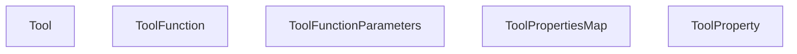
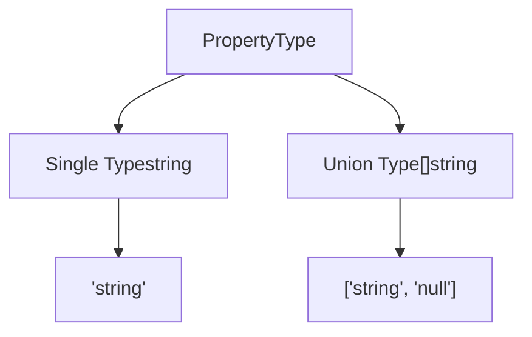
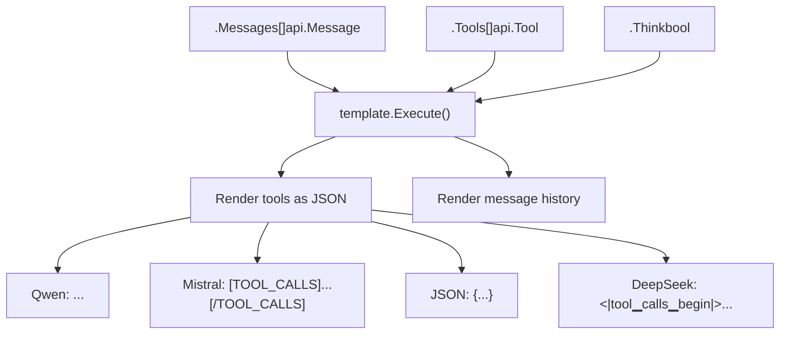
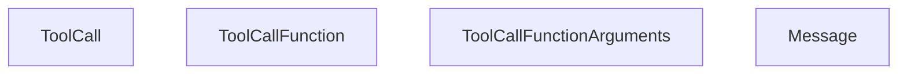
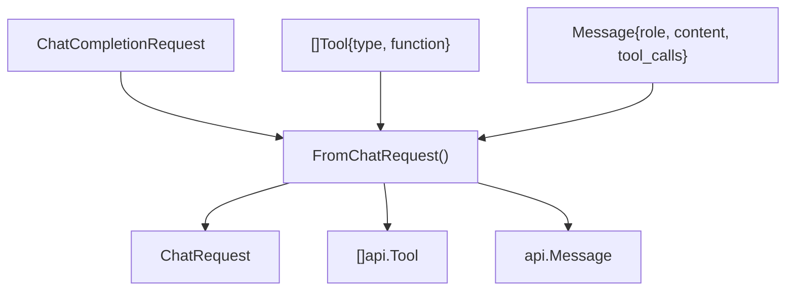
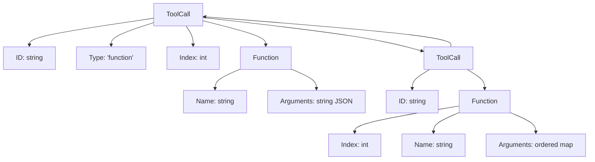
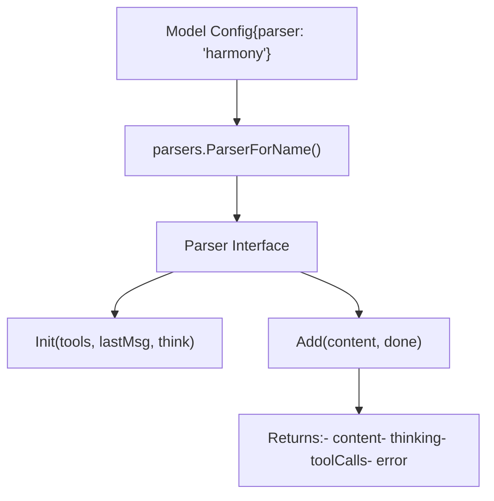
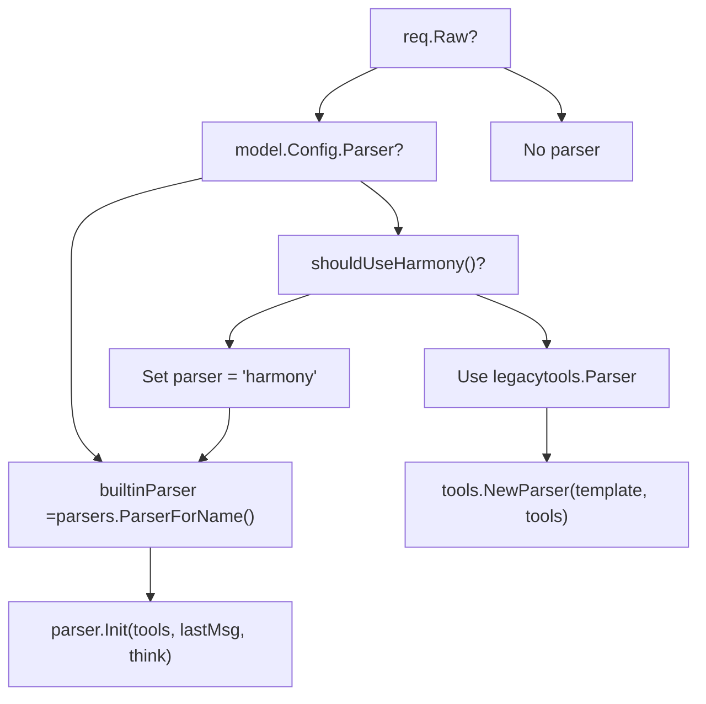
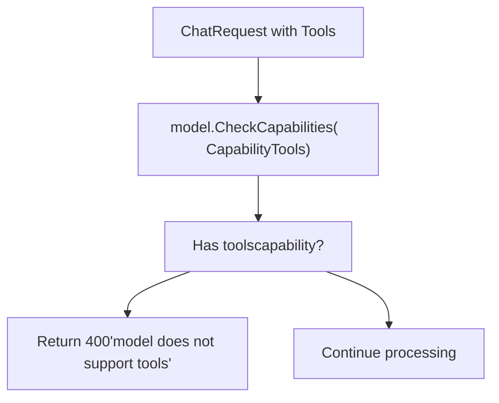
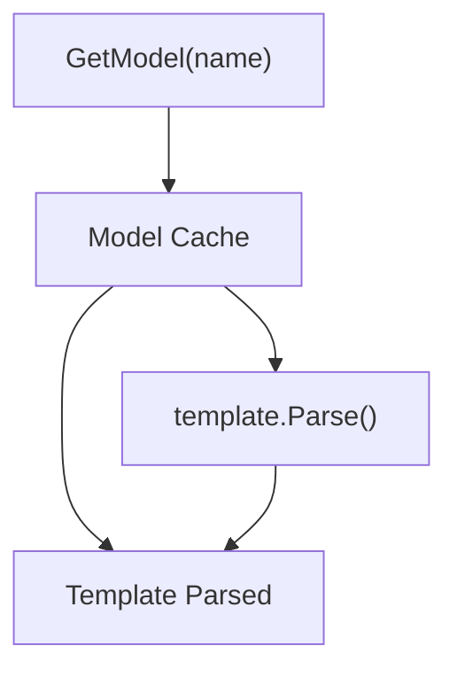

# Tool Calling and Function Execution

Relevant source files

-   [api/client.go](https://github.com/ollama/ollama/blob/562c76d7/api/client.go)
-   [api/client\_test.go](https://github.com/ollama/ollama/blob/562c76d7/api/client_test.go)
-   [api/types.go](https://github.com/ollama/ollama/blob/562c76d7/api/types.go)
-   [api/types\_test.go](https://github.com/ollama/ollama/blob/562c76d7/api/types_test.go)
-   [api/types\_typescript\_test.go](https://github.com/ollama/ollama/blob/562c76d7/api/types_typescript_test.go)
-   [cmd/cmd.go](https://github.com/ollama/ollama/blob/562c76d7/cmd/cmd.go)
-   [middleware/openai.go](https://github.com/ollama/ollama/blob/562c76d7/middleware/openai.go)
-   [middleware/openai\_test.go](https://github.com/ollama/ollama/blob/562c76d7/middleware/openai_test.go)
-   [openai/openai.go](https://github.com/ollama/ollama/blob/562c76d7/openai/openai.go)
-   [openai/openai\_test.go](https://github.com/ollama/ollama/blob/562c76d7/openai/openai_test.go)
-   [openai/responses.go](https://github.com/ollama/ollama/blob/562c76d7/openai/responses.go)
-   [openai/responses\_test.go](https://github.com/ollama/ollama/blob/562c76d7/openai/responses_test.go)
-   [server/images.go](https://github.com/ollama/ollama/blob/562c76d7/server/images.go)
-   [server/routes.go](https://github.com/ollama/ollama/blob/562c76d7/server/routes.go)
-   [server/routes\_generate\_test.go](https://github.com/ollama/ollama/blob/562c76d7/server/routes_generate_test.go)
-   [tools/tools.go](https://github.com/ollama/ollama/blob/562c76d7/tools/tools.go)
-   [tools/tools\_test.go](https://github.com/ollama/ollama/blob/562c76d7/tools/tools_test.go)

This page documents how Ollama implements tool calling (function calling) capabilities, allowing models to request execution of predefined functions during generation. This includes the protocol for defining tools, how tool calls are parsed from model output, and how responses flow through the system.

For information about model capabilities and capability detection, see [Model Architectures](/ollama/ollama/5.6-model-architectures). For template rendering details, see [Template System](/ollama/ollama/7.1-template-system). For OpenAI API compatibility, see [OpenAI Compatibility Layer](/ollama/ollama/3.4-openai-compatibility-layer).

---

## Overview

Tool calling enables language models to invoke external functions during text generation. The workflow involves:

1.  Client defines available tools using JSON Schema format
2.  Tools are rendered into the prompt via templates
3.  Model generates response including tool call requests
4.  Parser extracts tool calls from model output
5.  Client receives tool calls and can execute them
6.  Tool results can be sent back to continue the conversation

The implementation supports multiple tool calling formats across different model families, with automatic parsing based on model templates.

**Sources:** [api/types.go196-509](https://github.com/ollama/ollama/blob/562c76d7/api/types.go#L196-L509) [tools/tools.go1-280](https://github.com/ollama/ollama/blob/562c76d7/tools/tools.go#L1-L280) [server/routes.go52-58](https://github.com/ollama/ollama/blob/562c76d7/server/routes.go#L52-L58)

---

## Tool Definition Schema

### Core Types

Tools are defined using the following type hierarchy:


**Sources:** [api/types.go196-503](https://github.com/ollama/ollama/blob/562c76d7/api/types.go#L196-L503)

### Property Types

The `PropertyType` supports both single types and union types:

| Type | Description | Example |
| --- | --- | --- |
| `string` | Single type | `"string"` |
| `[]string` | Union type | `["string", "null"]` |


**Sources:** [api/types.go325-365](https://github.com/ollama/ollama/blob/562c76d7/api/types.go#L325-L365)

### Ordered Properties

Tool properties and function arguments maintain insertion order using `orderedmap.Map`:

| Type | Purpose | Key Methods |
| --- | --- | --- |
| `ToolPropertiesMap` | Tool parameter definitions | `Get()`, `Set()`, `All()`, `ToMap()` |
| `ToolCallFunctionArguments` | Function call arguments | `Get()`, `Set()`, `All()`, `ToMap()` |

**Sources:** [api/types.go246-317](https://github.com/ollama/ollama/blob/562c76d7/api/types.go#L246-L317) [api/types.go367-430](https://github.com/ollama/ollama/blob/562c76d7/api/types.go#L367-L430)

---

## Request Flow

### Chat Request with Tools

> **[Mermaid sequence]**
> *(图表结构无法解析)*

**Sources:** [server/routes.go1307-1646](https://github.com/ollama/ollama/blob/562c76d7/server/routes.go#L1307-L1646) [server/routes\_chat.go1-457](https://github.com/ollama/ollama/blob/562c76d7/server/routes_chat.go#L1-L457)

### Template Integration

Tools are rendered into prompts via the `{{ .Tools }}` template variable. Different models use different formats:


**Sources:** [server/routes\_chat.go50-180](https://github.com/ollama/ollama/blob/562c76d7/server/routes_chat.go#L50-L180) [tools/tools\_test.go36-60](https://github.com/ollama/ollama/blob/562c76d7/tools/tools_test.go#L36-L60)

---

## Tool Call Parsing

### Parser State Machine

The `tools.Parser` extracts tool calls from streaming model output:

**Sources:** [tools/tools.go46-98](https://github.com/ollama/ollama/blob/562c76d7/tools/tools.go#L46-L98) [tools/tools.go119-153](https://github.com/ollama/ollama/blob/562c76d7/tools/tools.go#L119-L153)

---

## Tool Call Representation

### API Tool Call Structure


**Sources:** [api/types.go235-317](https://github.com/ollama/ollama/blob/562c76d7/api/types.go#L235-L317)

### Tool Call Lifecycle

> **[Mermaid sequence]**
> *(图表结构无法解析)*

**Sources:** [tools/tools.go46-98](https://github.com/ollama/ollama/blob/562c76d7/tools/tools.go#L46-L98) [server/routes\_chat.go220-457](https://github.com/ollama/ollama/blob/562c76d7/server/routes_chat.go#L220-L457)

---

## OpenAI Compatibility

### Request Transformation


**Sources:** [openai/openai.go434-687](https://github.com/ollama/ollama/blob/562c76d7/openai/openai.go#L434-L687) [middleware/openai.go1-449](https://github.com/ollama/ollama/blob/562c76d7/middleware/openai.go#L1-L449)

### Tool Call Format Conversion

The OpenAI format uses different field names and structure:

| Aspect | OpenAI Format | Ollama Format |
| --- | --- | --- |
| Tool call ID | `id` (string) | `ID` (string) |
| Function name | `function.name` | `function.Name` |
| Arguments | `function.arguments` (string) | `function.Arguments` (ordered map) |
| Index | `index` (int) | `function.Index` (int) |
| Type | `type` (always "function") | Not present |


**Sources:** [openai/openai.go178-187](https://github.com/ollama/ollama/blob/562c76d7/openai/openai.go#L178-L187) [openai/openai.go241-259](https://github.com/ollama/ollama/blob/562c76d7/openai/openai.go#L241-L259) [api/types.go235-244](https://github.com/ollama/ollama/blob/562c76d7/api/types.go#L235-L244)

### Response Streaming

Streaming responses handle tool calls incrementally:

> **[Mermaid sequence]**
> *(图表结构无法解析)*

**Sources:** [middleware/openai.go70-134](https://github.com/ollama/ollama/blob/562c76d7/middleware/openai.go#L70-L134) [openai/openai.go294-324](https://github.com/ollama/ollama/blob/562c76d7/openai/openai.go#L294-L324)

---

## Built-in Parsers

Ollama includes specialized parsers for certain model families in the `model/parsers` package. These parsers provide integrated tool calling and thinking support.

### Parser Interface

Models can specify custom parsers via the `parser` field in their configuration:

| Parser Name | Model Family | Features |
| --- | --- | --- |
| `harmony` | GPT-OSS | Tool calls, thinking blocks |
| (others) | Various | Model-specific parsing |


**Sources:** [server/routes.go360-371](https://github.com/ollama/ollama/blob/562c76d7/server/routes.go#L360-L371) [server/routes\_chat.go113-141](https://github.com/ollama/ollama/blob/562c76d7/server/routes_chat.go#L113-L141)

### Parser Selection


**Sources:** [server/routes.go67-77](https://github.com/ollama/ollama/blob/562c76d7/server/routes.go#L67-L77) [server/routes.go360-371](https://github.com/ollama/ollama/blob/562c76d7/server/routes.go#L360-L371) [server/routes\_chat.go113-141](https://github.com/ollama/ollama/blob/562c76d7/server/routes_chat.go#L113-L141)

---

## Tool Call Examples

### Basic Tool Definition

```
{  "type": "function",  "function": {    "name": "get_weather",    "description": "Get current weather for a location",    "parameters": {      "type": "object",      "required": ["location"],      "properties": {        "location": {          "type": "string",          "description": "City name"        },        "units": {          "type": "string",          "enum": ["celsius", "fahrenheit"],          "description": "Temperature units"        }      }    }  }}
```
### Model Output Formats

Different models use different tool calling syntaxes:

| Model Family | Format | Example |
| --- | --- | --- |
| Qwen | `<tool_call>{...}</tool_call>` | `<tool_call>{"name": "get_weather", "arguments": {"location": "Paris"}}</tool_call>` |
| Mistral | `[TOOL_CALLS][...]` | `[TOOL_CALLS] [{"name": "get_weather", "arguments": {...}}]` |
| DeepSeek | `<|tool▁calls▁begin|>...` | `<|tool▁call▁begin|>function<|tool▁sep|>get_weather...` |
| JSON models | `{...}` or `[...]` | `{"name": "get_weather", "arguments": {...}}` |

**Sources:** [tools/tools\_test.go36-60](https://github.com/ollama/ollama/blob/562c76d7/tools/tools_test.go#L36-L60) [tools/tools.go230-280](https://github.com/ollama/ollama/blob/562c76d7/tools/tools.go#L230-L280)

### Response with Tool Calls

```
{  "model": "qwen3:8b",  "message": {    "role": "assistant",    "content": "",    "tool_calls": [      {        "id": "call_abc123",        "function": {          "name": "get_weather",          "arguments": {            "location": "Paris",            "units": "celsius"          },          "index": 0        }      }    ]  },  "done": true}
```
**Sources:** [api/types.go211-221](https://github.com/ollama/ollama/blob/562c76d7/api/types.go#L211-L221) [api/types.go235-244](https://github.com/ollama/ollama/blob/562c76d7/api/types.go#L235-L244)

---

## Error Handling

### Capability Validation

Before processing tool calls, the server validates model capabilities:


**Sources:** [server/routes\_chat.go84-111](https://github.com/ollama/ollama/blob/562c76d7/server/routes_chat.go#L84-L111) [server/images.go147-189](https://github.com/ollama/ollama/blob/562c76d7/server/images.go#L147-L189)

### Parser Error Handling

The parser validates tool calls during extraction:

| Error Condition | Handling |
| --- | --- |
| Invalid JSON in arguments | Return error, stop parsing |
| Unknown tool name | Wait for more data (may be partial) |
| Malformed tool call | Return error to client |
| Missing required arguments | Validated by client, not parser |

**Sources:** [tools/tools.go228-280](https://github.com/ollama/ollama/blob/562c76d7/tools/tools.go#L228-L280)

---

## Implementation Details

### Argument Ordering

Tool call arguments maintain insertion order using `orderedmap.Map`. This is critical for deterministic serialization:

```
type ToolCallFunctionArguments struct {    om *orderedmap.Map[string, any]}
```
Methods:

-   `Get(key string) (any, bool)` - Retrieve value
-   `Set(key string, value any)` - Set value, preserving order
-   `All() iter.Seq2[string, any]` - Iterate in insertion order
-   `ToMap() map[string]any` - Convert to regular map (order lost)

**Sources:** [api/types.go246-317](https://github.com/ollama/ollama/blob/562c76d7/api/types.go#L246-L317)

### Property Ordering

Tool properties also use ordered maps:

```
type ToolPropertiesMap struct {    om *orderedmap.Map[string, ToolProperty]}
```
This ensures JSON Schema properties are serialized consistently.

**Sources:** [api/types.go367-430](https://github.com/ollama/ollama/blob/562c76d7/api/types.go#L367-L430)

### Parser Buffer Management

The parser maintains a buffer of unparsed content:

```
type Parser struct {    tag    string            // Tool calling tag from template    tools  []api.Tool        // Available tools    state  toolsState        // Current parsing state    buffer []byte            // Unparsed content    n      int               // Tool call index counter}
```
The buffer grows as content arrives and shrinks as tool calls are parsed.

**Sources:** [tools/tools.go20-27](https://github.com/ollama/ollama/blob/562c76d7/tools/tools.go#L20-L27)

---

## Performance Considerations

### Incremental Parsing

The parser is designed for streaming contexts:

1.  Content arrives in chunks
2.  Parser buffers incomplete tool calls
3.  Complete tool calls extracted immediately
4.  Remaining content kept for next chunk

This enables low-latency tool call detection in streaming scenarios.

**Sources:** [tools/tools.go46-98](https://github.com/ollama/ollama/blob/562c76d7/tools/tools.go#L46-L98)

### Template Caching

Templates are parsed once per model and cached:


**Sources:** [server/images.go275-372](https://github.com/ollama/ollama/blob/562c76d7/server/images.go#L275-L372)

---

## Testing

The codebase includes comprehensive tests for tool calling:

| Test File | Coverage |
| --- | --- |
| `tools/tools_test.go` | Parser logic, multiple formats |
| `openai/openai_test.go` | Format conversion |
| `middleware/openai_test.go` | Request/response transformation |
| `server/routes_generate_test.go` | End-to-end tool calling |

**Sources:** [tools/tools\_test.go35-568](https://github.com/ollama/ollama/blob/562c76d7/tools/tools_test.go#L35-L568) [openai/openai\_test.go169-235](https://github.com/ollama/ollama/blob/562c76d7/openai/openai_test.go#L169-L235) [middleware/openai\_test.go79-449](https://github.com/ollama/ollama/blob/562c76d7/middleware/openai_test.go#L79-L449)
