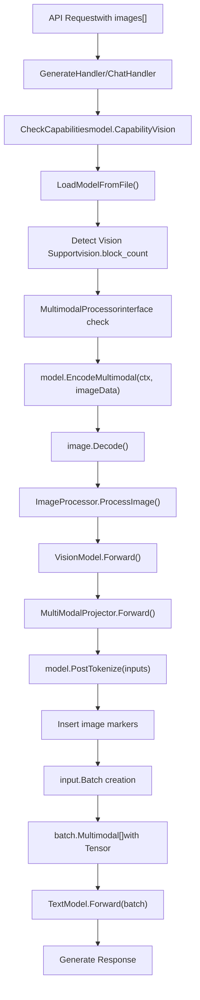
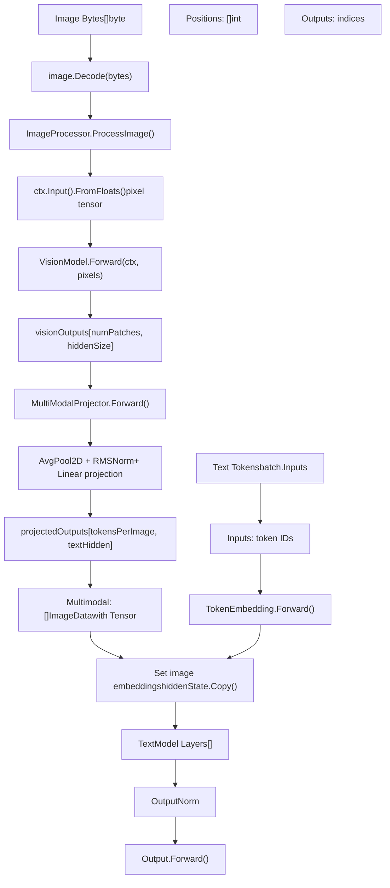

# Multimodal and Vision Support

Relevant source files

-   [convert/convert\_gemma3.go](https://github.com/ollama/ollama/blob/562c76d7/convert/convert_gemma3.go)
-   [convert/convert\_mllama.go](https://github.com/ollama/ollama/blob/562c76d7/convert/convert_mllama.go)
-   [fs/config.go](https://github.com/ollama/ollama/blob/562c76d7/fs/config.go)
-   [llama/llama.cpp/src/llama-batch.cpp](https://github.com/ollama/ollama/blob/562c76d7/llama/llama.cpp/src/llama-batch.cpp)
-   [llama/llama.go](https://github.com/ollama/ollama/blob/562c76d7/llama/llama.go)
-   [llama/sampling\_ext.cpp](https://github.com/ollama/ollama/blob/562c76d7/llama/sampling_ext.cpp)
-   [llama/sampling\_ext.h](https://github.com/ollama/ollama/blob/562c76d7/llama/sampling_ext.h)
-   [model/models/gemma2/model.go](https://github.com/ollama/ollama/blob/562c76d7/model/models/gemma2/model.go)
-   [model/models/gemma3/model.go](https://github.com/ollama/ollama/blob/562c76d7/model/models/gemma3/model.go)
-   [model/models/gemma3/model\_text.go](https://github.com/ollama/ollama/blob/562c76d7/model/models/gemma3/model_text.go)
-   [model/models/gemma3/model\_vision.go](https://github.com/ollama/ollama/blob/562c76d7/model/models/gemma3/model_vision.go)
-   [model/models/gemma3/process\_image.go](https://github.com/ollama/ollama/blob/562c76d7/model/models/gemma3/process_image.go)
-   [model/models/llama/model.go](https://github.com/ollama/ollama/blob/562c76d7/model/models/llama/model.go)
-   [model/models/llama4/process\_image.go](https://github.com/ollama/ollama/blob/562c76d7/model/models/llama4/process_image.go)
-   [model/models/llama4/process\_image\_test.go](https://github.com/ollama/ollama/blob/562c76d7/model/models/llama4/process_image_test.go)
-   [model/models/mllama/model.go](https://github.com/ollama/ollama/blob/562c76d7/model/models/mllama/model.go)
-   [model/models/mllama/model\_text.go](https://github.com/ollama/ollama/blob/562c76d7/model/models/mllama/model_text.go)
-   [model/models/mllama/model\_vision.go](https://github.com/ollama/ollama/blob/562c76d7/model/models/mllama/model_vision.go)
-   [model/models/mllama/process\_image.go](https://github.com/ollama/ollama/blob/562c76d7/model/models/mllama/process_image.go)

## Purpose and Scope

This document describes Ollama's multimodal and vision capabilities, which enable language models to process and understand image inputs alongside text. It covers the image input processing pipeline, vision model architectures, multimodal projection mechanisms, and API integration.

For template rendering and prompt formatting, see [Template System](/ollama/ollama/7.1-template-system). For tool calling capabilities, see [Tool Calling and Function Execution](/ollama/ollama/7.2-tool-calling-and-function-execution). For model architectures in general, see [Model Architectures](/ollama/ollama/5.6-model-architectures).

---

## Overview

Ollama supports multimodal models that can process both text and images in a single inference session. The system:

-   Accepts images in multiple formats (JPEG, PNG, BMP, WebP, TIFF) through the API
-   Processes images through vision encoders to generate embeddings
-   Projects visual embeddings into the text model's embedding space via multimodal projectors
-   Integrates image embeddings seamlessly into the text token sequence
-   Supports both streaming and non-streaming responses with image inputs

The multimodal capability is detected automatically based on model metadata and architecture, with no additional configuration required from users beyond providing image data in API requests.

Sources: [server/images.go74-141](https://github.com/ollama/ollama/blob/562c76d7/server/images.go#L74-L141) [model/model.go50-69](https://github.com/ollama/ollama/blob/562c76d7/model/model.go#L50-L69) [api/types.go56-98](https://github.com/ollama/ollama/blob/562c76d7/api/types.go#L56-L98)

---

## Multimodal Data Flow


**Multimodal Request Processing Flow**

This diagram shows the complete flow from API request through vision processing to model inference. The `EncodeMultimodal()` method processes images into embeddings, and `PostTokenize()` adjusts the token sequence to include image markers and embeddings.

Sources: [model/models/gemma3/model.go101-125](https://github.com/ollama/ollama/blob/562c76d7/model/models/gemma3/model.go#L101-L125) [model/models/gemma3/model.go127-153](https://github.com/ollama/ollama/blob/562c76d7/model/models/gemma3/model.go#L127-L153) [model/models/mllama/model.go63-92](https://github.com/ollama/ollama/blob/562c76d7/model/models/mllama/model.go#L63-L92)

---

## Image Input Format

### ImageData Type

Images are passed to Ollama as raw byte arrays through the `ImageData` type:

```
// api/types.gotype ImageData []byte
```
The `GenerateRequest` and `ChatRequest` structures include an `Images` field:

```
type GenerateRequest struct {    Images []ImageData `json:"images,omitempty"`    // ... other fields} type Message struct {    Images []ImageData `json:"images,omitempty"`    // ... other fields}
```
Images are typically base64-encoded in JSON API requests and decoded by the client libraries before being sent as raw bytes.

Sources: [api/types.go56-98](https://github.com/ollama/ollama/blob/562c76d7/api/types.go#L56-L98) [api/types.go211-221](https://github.com/ollama/ollama/blob/562c76d7/api/types.go#L211-L221)

### Image Processing in Models

Images are passed directly to models through the `EncodeMultimodal()` method. The multimodal data is stored with the input sequence rather than using placeholder syntax in prompts. Each model's `PostTokenize()` implementation determines how to insert image embeddings into the token sequence.

For example, in Gemma3:

```
// Insert image markers and embeddingsresult = append(result,    &input.Input{Token: 108, SameBatch: inputMultimodal.Dim(1) + 3}, // "\n\n"    &input.Input{Token: 255999},                                      // "<start_of_image>"    &input.Input{Multimodal: []input.Multimodal{{Tensor: inputMultimodal}},                  MultimodalHash: inp.MultimodalHash},                 // image data)// Add image token placeholdersresult = append(result, slices.Repeat([]*input.Input{{Token: 0}},                                        inputMultimodal.Dim(1)-1)...)result = append(result,    &input.Input{Token: 256000}, // <end_of_image>    &input.Input{Token: 108},    // "\n\n")
```
Sources: [model/models/gemma3/model.go127-153](https://github.com/ollama/ollama/blob/562c76d7/model/models/gemma3/model.go#L127-L153)

---

## Multimodal Model Architecture


**Multimodal Model Architecture**

This diagram shows the complete architecture for multimodal models. Images flow through the vision pipeline and projector to create embeddings that are integrated into the text model's forward pass via the `input.Batch.Multimodal` field.

Sources: [model/models/gemma3/model.go101-125](https://github.com/ollama/ollama/blob/562c76d7/model/models/gemma3/model.go#L101-L125) [model/models/gemma3/model.go155-166](https://github.com/ollama/ollama/blob/562c76d7/model/models/gemma3/model.go#L155-L166) [model/models/gemma3/model\_text.go223-266](https://github.com/ollama/ollama/blob/562c76d7/model/models/gemma3/model_text.go#L223-L266)

---

## MultimodalProcessor Interface

Models that support vision inputs must implement the `MultimodalProcessor` interface:

```
// model/model.gotype MultimodalProcessor interface {    // EncodeMultimodal processes image bytes and returns multimodal embeddings    EncodeMultimodal(ml.Context, []byte) ([]input.Multimodal, error)        // PostTokenize adjusts the input sequence after tokenization    PostTokenize([]*input.Input) ([]*input.Input, error)}
```
### EncodeMultimodal

This method handles the complete vision pipeline:

1.  **Image Decoding**: Converts raw bytes to `image.Image`

    ```
    image, _, err := image.Decode(bytes.NewReader(multimodalData))
    ```

2.  **Preprocessing**: Resizes and normalizes the image

    ```
    f32s, err := m.ImageProcessor.ProcessImage(image)pixelValues := ctx.Input().FromFloats(f32s, imageSize, imageSize, numChannels)
    ```

3.  **Vision Encoding**: Processes through vision transformer

    ```
    visionOutputs := m.VisionModel.Forward(ctx, pixelValues)
    ```

4.  **Projection**: Maps vision embeddings to text space

    ```
    visionOutputs = m.MultiModalProjector.Forward(ctx, visionOutputs, ...)
    ```

5.  **Return**: Wraps tensor in `input.Multimodal` struct

    ```
    return []input.Multimodal{{Tensor: visionOutputs}}, nil
    ```


### PostTokenize

After tokenization, `PostTokenize()` inserts image-related tokens and embeddings. Different models have different strategies:

**Gemma3 Approach**: Inserts special tokens around the image region

-   `<start_of_image>` token (ID: 255999)
-   Image placeholder tokens (ID: 0)
-   `<end_of_image>` token (ID: 256000)
-   Newline tokens before and after

**mLlama Approach**: Replaces specific tokens with image marker

-   Changes token ID to 128256 (`<|image|>`)

The `SameBatch` field ensures multi-token image embeddings stay together during batch processing.

Sources: [model/models/gemma3/model.go101-125](https://github.com/ollama/ollama/blob/562c76d7/model/models/gemma3/model.go#L101-L125) [model/models/gemma3/model.go127-153](https://github.com/ollama/ollama/blob/562c76d7/model/models/gemma3/model.go#L127-L153) [model/models/mllama/model.go94-102](https://github.com/ollama/ollama/blob/562c76d7/model/models/mllama/model.go#L94-L102)

---

## Vision Model Components

### Vision Encoder

The vision encoder processes images through transformer layers. Component structure varies by architecture:

**Gemma3 Vision Model (VisionModel struct):**

```
VisionModel
├── PatchEmbedding: *nn.Conv2D - Projects patches to embeddings
├── PositionEmbedding: *nn.Embedding - Adds positional info
├── Layers: []VisionEncoderLayer
│   ├── LayerNorm1: *nn.LayerNorm
│   ├── SelfAttention: *VisionSelfAttention
│   │   ├── Query: *nn.Linear
│   │   ├── Key: *nn.Linear
│   │   ├── Value: *nn.Linear
│   │   └── Output: *nn.Linear
│   ├── LayerNorm2: *nn.LayerNorm
│   └── MLP: *VisionMLP
│       ├── FC1: *nn.Linear
│       └── FC2: *nn.Linear
└── PostLayerNorm: *nn.LayerNorm
```
Forward pass:

1.  Convert image to patches via `PatchEmbedding.Forward()`
2.  Reshape to `[numPatches, hiddenSize]`
3.  Add position embeddings
4.  Process through transformer layers
5.  Apply final layer normalization

**mLlama Vision Model** has a more complex architecture with global and local transformers, pre/post tile position embeddings, and gated attention mechanisms.

Sources: [model/models/gemma3/model\_vision.go78-119](https://github.com/ollama/ollama/blob/562c76d7/model/models/gemma3/model_vision.go#L78-L119) [model/models/mllama/model\_vision.go146-223](https://github.com/ollama/ollama/blob/562c76d7/model/models/mllama/model_vision.go#L146-L223)

### Multimodal Projector

The projector transforms vision embeddings to match text model dimensions:

**Gemma3 MultiModalProjector:**

```
type MultiModalProjector struct {    SoftEmbNorm     *nn.RMSNorm `gguf:"mm_soft_emb_norm"`    InputProjection *nn.Linear  `gguf:"mm_input_projection"`    tokensPerImage  int}
```
Forward pass:

1.  Permute dimensions: `[L, H, W, C]` → `[W, H, L, C]`
2.  Reshape to square grid
3.  Apply average pooling to reduce token count
4.  Apply RMSNorm for stability
5.  Linear projection (transposed) to text dimension

**mLlama Projector** is simpler - just a single linear layer (`Projector: *nn.Linear`).

Sources: [model/models/gemma3/model.go32-55](https://github.com/ollama/ollama/blob/562c76d7/model/models/gemma3/model.go#L32-L55) [model/models/mllama/model.go24](https://github.com/ollama/ollama/blob/562c76d7/model/models/mllama/model.go#L24-L24)

### Image Processor

Each model implements its own `ImageProcessor` struct with a `ProcessImage()` method:

**Gemma3 ImageProcessor:**

```
type ImageProcessor struct {    imageSize, patchSize, numChannels int} func (p ImageProcessor) ProcessImage(img image.Image) ([]float32, error) {    // 1. Composite to remove transparency    newImage := imageproc.Composite(img)    // 2. Resize to fixed size    newImage = imageproc.Resize(newImage, outputSize, imageproc.ResizeBilinear)    // 3. Normalize with ImageNet mean/std    data := p.pack(newImage, imageproc.ImageNetStandardMean, imageproc.ImageNetStandardSTD)    return data, nil}
```
**mLlama ImageProcessor** is more sophisticated:

-   Determines optimal tile arrangement for the image
-   Splits image into tiles based on aspect ratio
-   Pads to match expected canvas size
-   Supports up to `maxNumTiles` (e.g., 4) tiles per image

Sources: [model/models/gemma3/process\_image.go14-58](https://github.com/ollama/ollama/blob/562c76d7/model/models/gemma3/process_image.go#L14-L58) [model/models/mllama/process\_image.go26-222](https://github.com/ollama/ollama/blob/562c76d7/model/models/mllama/process_image.go#L26-L222)

---

## Multimodal Tokenization Pipeline

**Multimodal Tokenization Sequence**

This diagram shows how images are encoded and integrated into the token sequence. The `EncodeMultimodal()` method processes images into tensors, and `PostTokenize()` inserts special tokens and placeholders around the image embeddings.

Sources: [model/models/gemma3/model.go101-125](https://github.com/ollama/ollama/blob/562c76d7/model/models/gemma3/model.go#L101-L125) [model/models/gemma3/model.go127-153](https://github.com/ollama/ollama/blob/562c76d7/model/models/gemma3/model.go#L127-L153)

---

## Vision Capability Detection

### Automatic Detection

Ollama automatically detects whether a model supports vision through multiple mechanisms:

**Detection Methods:**

1.  **GGUF Metadata Check:**

```
// Check for vision.block_count in GGUF fileif f.KeyValue("vision.block_count").Valid() {    capabilities = append(capabilities, model.CapabilityVision)}
```
2.  **Projector Path Check:**

```
// Check for projector files in model layersif len(m.ProjectorPaths) > 0 {    capabilities = append(capabilities, model.CapabilityVision)}
```
3.  **Config Capabilities:**

```
// Explicit capability in model configif slices.Contains(m.Config.Capabilities, "vision") {    capabilities = append(capabilities, model.CapabilityVision)}
```
Sources: [server/images.go74-141](https://github.com/ollama/ollama/blob/562c76d7/server/images.go#L74-L141)

### Backwards Compatibility

For backwards compatibility with older model formats, additional checks are performed:

```
// Check for projector info in model metadataif len(info.ProjectorInfo) != 0 {    opts.MultiModal = true} // Check for vision-related keys in model infofor k := range info.ModelInfo {    if strings.Contains(k, ".vision.") {        opts.MultiModal = true        break    }}
```
Sources: [cmd/cmd.go634-642](https://github.com/ollama/ollama/blob/562c76d7/cmd/cmd.go#L634-L642)

### Model Validation

When a model is scheduled for inference, capabilities are validated:

```
// Validate that model supports required capabilitiesif err := model.CheckCapabilities(caps...); err != nil {    return nil, nil, nil, fmt.Errorf("%s %w", name, err)}
```
If vision capability is required but not available, an error is returned to the user.

Sources: [server/routes.go149-151](https://github.com/ollama/ollama/blob/562c76d7/server/routes.go#L149-L151)

---

## Multimodal Store and Memory Management

### multimodalStore

The `multimodalStore` manages image embeddings during inference to handle memory efficiently:

```
type multimodalStore interface {    addMultimodal(ml.Tensor)    // Manages embedding lifecycle    // Splits embeddings across batches if needed}
```
### Memory Considerations

Image embeddings can be large (hundreds or thousands of tokens worth of embeddings), requiring careful memory management:

1.  **Context Allocation:** Each image gets its own `ml.Context` that lives for the sequence duration
2.  **Finalizers:** Go finalizers ensure contexts are cleaned up when no longer needed
3.  **Batch Splitting:** Large image embeddings may be split across multiple batches
4.  **Caching:** Image hashes enable reuse of embeddings for repeated images

```
ctx := s.model.Backend().NewContext()runtime.SetFinalizer(ctx, func(c ml.Context) { c.Close() })ctxs = append(ctxs, ctx)
```
Sources: [runner/ollamarunner/runner.go271-273](https://github.com/ollama/ollama/blob/562c76d7/runner/ollamarunner/runner.go#L271-L273)

---

## Input Representation

### input.Input Structure

The unified input representation supports both tokens and multimodal embeddings:

```
type Input struct {    Token          int32      // Text token ID    Multimodal     ml.Tensor  // Image embedding tensor    MultimodalHash uint64     // Hash for caching    SameBatch      int        // Grouping for unbreakable sequences}
```
A sequence of inputs can mix tokens and embeddings:

```
[Token: 1234] [Token: 5678] [Multimodal: <tensor>] [Token: 9012]
```
The forward pass processes this heterogeneous sequence, with the model treating multimodal embeddings as if they were token embeddings in the appropriate dimension.

Sources: [model/input/input.go1-50](https://github.com/ollama/ollama/blob/562c76d7/model/input/input.go#L1-L50)

---

## Supported Model Architectures

### Gemma3 Vision

**Model Structure:**

```
type Model struct {    model.Base    tokenizer.Tokenizer        *VisionModel           `gguf:"v"`    *TextModel    *MultiModalProjector   `gguf:"mm"`    ImageProcessor}
```
**Key Characteristics:**

-   Vision encoder with patch embeddings and position embeddings
-   Average pooling to reduce token count (e.g., 256 tokens per image)
-   RMSNorm and linear projection to text dimension
-   Inserts special tokens: `<start_of_image>` (255999) and `<end_of_image>` (256000)
-   Text model uses alternating sliding window and causal attention

**Forward Pass Integration:**

```
func (m *TextModel) Forward(ctx ml.Context, batch input.Batch, cache kvcache.Cache) ml.Tensor {    hiddenState := m.TokenEmbedding.Forward(ctx, batch.Inputs)        // Set image embeddings at their positions    for _, image := range batch.Multimodal {        visionOutputs := image.Multimodal[0].Tensor        ctx.Forward(visionOutputs.Copy(ctx, hiddenState.View(...)))    }        // Process through text layers...}
```
Sources: [model/models/gemma3/model.go18-99](https://github.com/ollama/ollama/blob/562c76d7/model/models/gemma3/model.go#L18-L99) [model/models/gemma3/model\_text.go223-266](https://github.com/ollama/ollama/blob/562c76d7/model/models/gemma3/model_text.go#L223-L266)

### mLlama (Meta Llama with Vision)

**Model Structure:**

```
type Model struct {    model.Base    tokenizer.Tokenizer        *VisionModel `gguf:"v"`    *TextModel    Projector *nn.Linear `gguf:"mm.0"`    ImageProcessor}
```
**Key Characteristics:**

-   Complex vision encoder with global and local transformers
-   Tile-based image processing (up to 4 tiles per image)
-   Precomputed position and aspect ratio embeddings
-   Single linear layer projector
-   Cross-attention layers in text model for vision-text fusion
-   Replaces placeholder with `<|image|>` token (128256)

**Cross-Attention Architecture:** The text model has two types of layers:

-   `TextSelfAttentionDecoderLayer`: Standard self-attention layers
-   `TextCrossAttentionDecoderLayer`: Layers with cross-attention to vision embeddings

Cross-attention uses gated mechanisms to control information flow from vision to text.

**Vision Encoder Cache:** mLlama uses an `EncoderCache` (separate from the causal cache) to store cross-attention keys and values. This allows the vision embeddings to be computed once and reused across text generation.

Sources: [model/models/mllama/model.go17-61](https://github.com/ollama/ollama/blob/562c76d7/model/models/mllama/model.go#L17-L61) [model/models/mllama/model\_text.go93-167](https://github.com/ollama/ollama/blob/562c76d7/model/models/mllama/model_text.go#L93-L167) [model/models/mllama/model\_vision.go146-203](https://github.com/ollama/ollama/blob/562c76d7/model/models/mllama/model_vision.go#L146-L203)

### Architecture Comparison

| Feature | Gemma3 Vision | mLlama |
| --- | --- | --- |
| Vision Encoder | Single transformer | Global + local transformers |
| Image Tokens | ~256 | Variable (tile-based) |
| Projector | RMSNorm + Linear | Single Linear |
| Text Integration | Direct embedding insertion | Cross-attention layers |
| Special Tokens | `<start/end_of_image>` | `<|image|>` |
| Cache Strategy | Unified causal cache | Separate encoder cache |
| Tile Support | No | Yes (up to 4 tiles) |

Sources: [model/models/gemma3/model.go18-99](https://github.com/ollama/ollama/blob/562c76d7/model/models/gemma3/model.go#L18-L99) [model/models/mllama/model.go17-61](https://github.com/ollama/ollama/blob/562c76d7/model/models/mllama/model.go#L17-L61)

---

## API Integration

### Generate Endpoint with Images

```
POST /api/generate{  "model": "gemma3:12b-vision",  "prompt": "Describe this image [img-0] in detail",  "images": ["<base64-encoded-image>"],  "stream": true}
```
The handler converts images to `llm.ImageData` and validates vision capability:

```
images := make([]llm.ImageData, len(req.Images))for i := range req.Images {    images[i] = llm.ImageData{ID: i, Data: req.Images[i]}}
```
Sources: [server/routes.go424-427](https://github.com/ollama/ollama/blob/562c76d7/server/routes.go#L424-L427)

### Chat Endpoint with Images

Images can be included in chat messages:

```
POST /api/chat{  "model": "gemma3:12b-vision",  "messages": [    {      "role": "user",      "content": "What's in this picture?",      "images": ["<base64-encoded-image>"]    }  ]}
```
The chat handler processes multimodal messages through the same pipeline as generate requests.

Sources: [server/routes.go456-460](https://github.com/ollama/ollama/blob/562c76d7/server/routes.go#L456-L460)

### Error Handling

Common errors:

-   **No Vision Support:** Model doesn't have vision capability
-   **Missing Image:** Referenced `[img-n]` doesn't exist in images array
-   **Invalid Format:** Image bytes cannot be decoded
-   **Out of Memory:** Image embeddings exceed available context

Sources: [runner/ollamarunner/runner.go267-269](https://github.com/ollama/ollama/blob/562c76d7/runner/ollamarunner/runner.go#L267-L269) [model/model.go30](https://github.com/ollama/ollama/blob/562c76d7/model/model.go#L30-L30)

---

## Implementation Details

### Batch Processing

Multimodal inputs affect batch construction:

-   Image embeddings may span multiple batch entries due to size
-   `SameBatch` field ensures image embeddings aren't split inappropriately
-   Position indices are adjusted to account for image embedding length

### KV Cache Considerations

Image embeddings are cached like text tokens:

-   Each embedding position has a corresponding KV cache entry
-   Hash-based caching enables reuse across sequences with same images
-   Sliding window attention handles long multimodal sequences

Sources: [kvcache/causal.go1-100](https://github.com/ollama/ollama/blob/562c76d7/kvcache/causal.go#L1-L100)

### Template Compatibility

Multimodal models may have special template requirements:

-   Some models need image tokens wrapped in special markers
-   Template rendering must preserve `[img-n]` tags during processing
-   Post-tokenization adjustments handle model-specific formatting

Sources: [template/template.go1-100](https://github.com/ollama/ollama/blob/562c76d7/template/template.go#L1-L100)

---

## Code Reference Summary

| Component | Purpose | Key Files |
| --- | --- | --- |
| `MultimodalProcessor` | Interface for vision-capable models | [model/model.go50-69](https://github.com/ollama/ollama/blob/562c76d7/model/model.go#L50-L69) |
| `EncodeMultimodal()` | Processes image bytes into embeddings | [model/models/gemma3/model.go101-125](https://github.com/ollama/ollama/blob/562c76d7/model/models/gemma3/model.go#L101-L125) |
| `PostTokenize()` | Adjusts token sequence with image markers | [model/models/gemma3/model.go127-153](https://github.com/ollama/ollama/blob/562c76d7/model/models/gemma3/model.go#L127-L153) |
| `VisionModel` | Image encoder transformer | [model/models/gemma3/model\_vision.go78-119](https://github.com/ollama/ollama/blob/562c76d7/model/models/gemma3/model_vision.go#L78-L119) |
| `MultiModalProjector` | Vision-to-text projection | [model/models/gemma3/model.go32-55](https://github.com/ollama/ollama/blob/562c76d7/model/models/gemma3/model.go#L32-L55) |
| `ImageProcessor` | Image preprocessing | [model/models/gemma3/process\_image.go14-58](https://github.com/ollama/ollama/blob/562c76d7/model/models/gemma3/process_image.go#L14-L58) |
| `input.Batch.Multimodal` | Stores image embeddings in batch | [model/input/input.go1-50](https://github.com/ollama/ollama/blob/562c76d7/model/input/input.go#L1-L50) |
| `TextModel.Forward()` | Integrates image embeddings | [model/models/gemma3/model\_text.go223-266](https://github.com/ollama/ollama/blob/562c76d7/model/models/gemma3/model_text.go#L223-L266) |
| Vision capability detection | Checks GGUF metadata | [server/images.go74-141](https://github.com/ollama/ollama/blob/562c76d7/server/images.go#L74-L141) |
| Cross-attention layers (mLlama) | Vision-text fusion | [model/models/mllama/model\_text.go93-167](https://github.com/ollama/ollama/blob/562c76d7/model/models/mllama/model_text.go#L93-L167) |

---

Sources: All sections above include inline citations to specific file locations.
