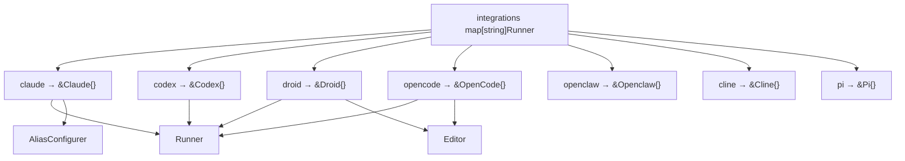
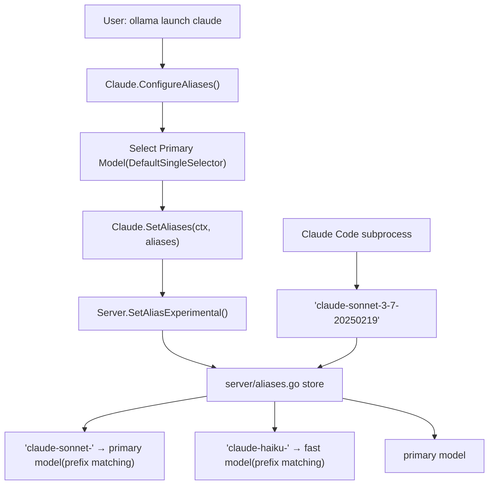
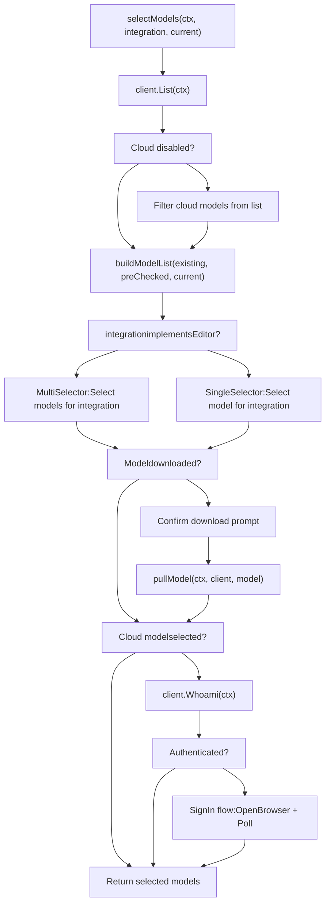

# Integrations and IDE Support

Relevant source files

-   [README.md](https://github.com/ollama/ollama/blob/562c76d7/README.md?plain=1)
-   [anthropic/anthropic.go](https://github.com/ollama/ollama/blob/562c76d7/anthropic/anthropic.go)
-   [anthropic/anthropic\_test.go](https://github.com/ollama/ollama/blob/562c76d7/anthropic/anthropic_test.go)
-   [cmd/config/claude.go](https://github.com/ollama/ollama/blob/562c76d7/cmd/config/claude.go)
-   [cmd/config/config.go](https://github.com/ollama/ollama/blob/562c76d7/cmd/config/config.go)
-   [cmd/config/config\_test.go](https://github.com/ollama/ollama/blob/562c76d7/cmd/config/config_test.go)
-   [cmd/config/droid.go](https://github.com/ollama/ollama/blob/562c76d7/cmd/config/droid.go)
-   [cmd/config/droid\_test.go](https://github.com/ollama/ollama/blob/562c76d7/cmd/config/droid_test.go)
-   [cmd/config/integrations.go](https://github.com/ollama/ollama/blob/562c76d7/cmd/config/integrations.go)
-   [cmd/config/integrations\_test.go](https://github.com/ollama/ollama/blob/562c76d7/cmd/config/integrations_test.go)
-   [cmd/config/opencode.go](https://github.com/ollama/ollama/blob/562c76d7/cmd/config/opencode.go)
-   [cmd/config/opencode\_test.go](https://github.com/ollama/ollama/blob/562c76d7/cmd/config/opencode_test.go)
-   [cmd/config/selector.go](https://github.com/ollama/ollama/blob/562c76d7/cmd/config/selector.go)
-   [cmd/config/selector\_test.go](https://github.com/ollama/ollama/blob/562c76d7/cmd/config/selector_test.go)
-   [cmd/tui/tui.go](https://github.com/ollama/ollama/blob/562c76d7/cmd/tui/tui.go)
-   [docs/README.md](https://github.com/ollama/ollama/blob/562c76d7/docs/README.md?plain=1)
-   [docs/api.md](https://github.com/ollama/ollama/blob/562c76d7/docs/api.md?plain=1)
-   [docs/development.md](https://github.com/ollama/ollama/blob/562c76d7/docs/development.md?plain=1)
-   [docs/images/ollama-keys.png](https://github.com/ollama/ollama/blob/562c76d7/docs/images/ollama-keys.png)
-   [docs/images/signup.png](https://github.com/ollama/ollama/blob/562c76d7/docs/images/signup.png)
-   [middleware/anthropic.go](https://github.com/ollama/ollama/blob/562c76d7/middleware/anthropic.go)
-   [server/aliases.go](https://github.com/ollama/ollama/blob/562c76d7/server/aliases.go)
-   [server/routes\_aliases\_test.go](https://github.com/ollama/ollama/blob/562c76d7/server/routes_aliases_test.go)
-   [server/routes\_cloud\_test.go](https://github.com/ollama/ollama/blob/562c76d7/server/routes_cloud_test.go)

This document describes Ollama's integration system that enables external coding tools and IDEs (Claude Code, Codex, Droid, OpenCode, etc.) to use Ollama models. The system provides a unified interface for launching integrations, configuring models, and routing requests through OpenAI-compatible or Anthropic-compatible middleware.

For information about the OpenAI and Anthropic compatibility layers themselves, see [OpenAI Compatibility Layer](/ollama/ollama/3.4-openai-compatibility-layer) and [Anthropic Compatibility Layer](/ollama/ollama/3.5-anthropic-compatibility-layer). For details about the template system used by integrations, see [Template System](/ollama/ollama/7.1-template-system).

## Integration Architecture

The integration system is built around three composable interfaces defined in [cmd/config/integrations.go26-50](https://github.com/ollama/ollama/blob/562c76d7/cmd/config/integrations.go#L26-L50):

```
type Runner interface {    Run(model string, args []string) error    String() string} type Editor interface {    Paths() []string    Edit(models []string) error    Models() []string} type AliasConfigurer interface {    ConfigureAliases(ctx context.Context, primaryModel string,                     existing map[string]string, force bool) (map[string]string, bool, error)    SetAliases(ctx context.Context, aliases map[string]string) error}
```
**Runner**: Executes an integration with a specified model. All integrations implement this interface.

**Editor**: Supports multi-model selection by modifying integration-specific config files. Integrations like OpenCode and Droid implement this to allow users to configure multiple models.

**AliasConfigurer**: Configures server-side model aliases for routing. Claude Code implements this to route subagent model requests (e.g., `claude-sonnet-*` → primary model, `claude-haiku-*` → fast model).

Sources: [cmd/config/integrations.go26-50](https://github.com/ollama/ollama/blob/562c76d7/cmd/config/integrations.go#L26-L50)

### Integration Registry

The integration registry maps integration names to their implementations:


Sources: [cmd/config/integrations.go53-63](https://github.com/ollama/ollama/blob/562c76d7/cmd/config/integrations.go#L53-L63) [cmd/config/claude.go15-19](https://github.com/ollama/ollama/blob/562c76d7/cmd/config/claude.go#L15-L19) [cmd/config/opencode.go19-20](https://github.com/ollama/ollama/blob/562c76d7/cmd/config/opencode.go#L19-L20) [cmd/config/droid.go17-18](https://github.com/ollama/ollama/blob/562c76d7/cmd/config/droid.go#L17-L18)

## Launch Command Flow

The `ollama launch` command provides the primary entry point for integrations. The flow varies depending on whether the integration uses single-model or multi-model configuration:

> **[Mermaid sequence]**
> *(图表结构无法解析)*

Sources: [cmd/config/integrations.go749-866](https://github.com/ollama/ollama/blob/562c76d7/cmd/config/integrations.go#L749-L866) [cmd/tui/tui.go354-481](https://github.com/ollama/ollama/blob/562c76d7/cmd/tui/tui.go#L354-L481)

### Launch Command Implementation

The command is created by `LaunchCmd()` which accepts a heartbeat checker and TUI callback:

| Parameter | Type | Purpose |
| --- | --- | --- |
| `checkServerHeartbeat` | `func(*cobra.Command, []string) error` | Validates Ollama server is running before launch |
| `showTUI` | `func(*cobra.Command)` | Shows interactive TUI when no arguments provided |

The command supports these flags:

| Flag | Type | Description |
| --- | --- | --- |
| `--model` | string | Pre-select a model (skips interactive selection) |
| `--config` | bool | Force model reconfiguration even if already configured |

Sources: [cmd/config/integrations.go749-866](https://github.com/ollama/ollama/blob/562c76d7/cmd/config/integrations.go#L749-L866)

## Configuration Storage

Integration configurations are stored in `~/.ollama/config.json` with this structure:

```
type config struct {    Integrations  map[string]*integration `json:"integrations"`    LastModel     string                  `json:"last_model,omitempty"`    LastSelection string                  `json:"last_selection,omitempty"`} type integration struct {    Models    []string          `json:"models"`    Aliases   map[string]string `json:"aliases,omitempty"`    Onboarded bool              `json:"onboarded,omitempty"`}
```
Example configuration:

```
{  "integrations": {    "claude": {      "models": ["glm-5:cloud"],      "aliases": {        "primary": "glm-5:cloud",        "fast": "glm-5:cloud"      },      "onboarded": true    },    "opencode": {      "models": ["llama3.2", "qwen3:8b"],      "onboarded": true    }  },  "last_model": "llama3.2",  "last_selection": "claude"}
```
The configuration is managed by these functions:

| Function | Purpose |
| --- | --- |
| `SaveIntegration(name, models)` | Saves model list for an integration |
| `loadIntegration(name)` | Loads integration config |
| `saveAliases(name, aliases)` | Saves alias configuration |
| `LastModel() / SetLastModel()` | Tracks last used model |
| `LastSelection() / SetLastSelection()` | Tracks last selected integration |

Sources: [cmd/config/config.go17-301](https://github.com/ollama/ollama/blob/562c76d7/cmd/config/config.go#L17-L301)

## Claude Code Integration

Claude Code is a special integration that implements both `Runner` and `AliasConfigurer` interfaces. It uses server-side prefix-based aliasing to route model requests.

### Environment Variables

When launching Claude Code, Ollama sets these environment variables:

```
env := append(os.Environ(),    "ANTHROPIC_BASE_URL="+envconfig.Host().String(),    "ANTHROPIC_API_KEY=",    "ANTHROPIC_AUTH_TOKEN=ollama",    "ANTHROPIC_DEFAULT_OPUS_MODEL=" + primary,    "ANTHROPIC_DEFAULT_SONNET_MODEL=" + primary,    "ANTHROPIC_DEFAULT_HAIKU_MODEL=" + fast,    "CLAUDE_CODE_SUBAGENT_MODEL=" + primary,)
```
This routes all Claude model tiers through Ollama's Anthropic middleware.

Sources: [cmd/config/claude.go62-71](https://github.com/ollama/ollama/blob/562c76d7/cmd/config/claude.go#L62-L71) [cmd/config/claude.go74-92](https://github.com/ollama/ollama/blob/562c76d7/cmd/config/claude.go#L74-L92)

### Alias Configuration Flow

Claude Code uses prefix-based aliases to route subagent requests:


The alias resolution happens in two steps:

1.  **Configuration Time** ([cmd/config/claude.go94-151](https://github.com/ollama/ollama/blob/562c76d7/cmd/config/claude.go#L94-L151)):

    -   User selects primary model (e.g., `glm-5:cloud`)
    -   For cloud models, fast model defaults to primary model
    -   For local models, fast alias is deleted (subagent routing disabled)
2.  **Runtime Resolution** ([server/aliases.go153-194](https://github.com/ollama/ollama/blob/562c76d7/server/aliases.go#L153-L194)):

    -   Claude Code requests `claude-sonnet-3-7-20250219`
    -   Server resolves prefix `claude-sonnet-` → primary model
    -   Request forwarded to resolved model

Sources: [cmd/config/claude.go94-192](https://github.com/ollama/ollama/blob/562c76d7/cmd/config/claude.go#L94-L192) [server/aliases.go153-194](https://github.com/ollama/ollama/blob/562c76d7/server/aliases.go#L153-L194)

### Alias Cycle Detection

The server prevents alias cycles using depth-limited resolution:

```
func (s *store) resolve(name string, depth int) (model.Name, bool) {    const maxAliasDepth = 10    if depth >= maxAliasDepth {        return model.Name{}, false    }    // ... resolution logic}
```
Sources: [server/aliases.go153-194](https://github.com/ollama/ollama/blob/562c76d7/server/aliases.go#L153-L194)

## OpenCode Integration

OpenCode implements both `Runner` and `Editor` interfaces, supporting multi-model configuration. It modifies two config files:

### Configuration Files

| File | Purpose |
| --- | --- |
| `~/.config/opencode/opencode.json` | Provider and model definitions |
| `~/.local/state/opencode/model.json` | Recent models list |

#### Provider Configuration

OpenCode models are registered in the `provider.ollama.models` section:

```
{  "$schema": "https://opencode.ai/config.json",  "provider": {    "ollama": {      "npm": "@ai-sdk/openai-compatible",      "name": "Ollama",      "options": {        "baseURL": "http://localhost:11434/v1"      },      "models": {        "llama3.2": {          "name": "llama3.2",          "_launch": true        },        "qwen3:8b": {          "name": "qwen3:8b",          "_launch": true,          "limit": {            "context": 131072,            "output": 8192          }        }      }    }  }}
```
The `_launch` marker identifies models managed by `ollama launch`. When models are reconfigured, entries without `_launch` are preserved (user-added models).

Sources: [cmd/config/opencode.go94-252](https://github.com/ollama/ollama/blob/562c76d7/cmd/config/opencode.go#L94-L252)

#### Cloud Model Limits

Cloud models receive context/output limits from `cloudModelLimits` map:

```
var cloudModelLimits = map[string]cloudModelLimit{    "minimax-m2.5":        {Context: 204_800, Output: 128_000},    "glm-5":               {Context: 202_752, Output: 131_072},    "kimi-k2.5":           {Context: 262_144, Output: 262_144},    // ...}
```
Sources: [cmd/config/integrations.go77-94](https://github.com/ollama/ollama/blob/562c76d7/cmd/config/integrations.go#L77-L94) [cmd/config/opencode.go28-41](https://github.com/ollama/ollama/blob/562c76d7/cmd/config/opencode.go#L28-L41)

#### Recent Models State

The state file tracks recently used models:

```
{  "recent": [    {"providerID": "ollama", "modelID": "llama3.2"},    {"providerID": "ollama", "modelID": "qwen3:8b"}  ],  "favorite": [],  "variant": {}}
```
When models are updated, `ollama launch` deduplicates and prepends them to maintain up to 10 recent entries.

Sources: [cmd/config/opencode.go203-251](https://github.com/ollama/ollama/blob/562c76d7/cmd/config/opencode.go#L203-L251)

## Droid Integration

Droid also implements `Runner` and `Editor`, modifying `~/.factory/settings.json`:

```
{  "customModels": [    {      "model": "llama3.2",      "displayName": "llama3.2",      "baseUrl": "http://localhost:11434/v1",      "apiKey": "ollama",      "provider": "generic-chat-completion-api",      "maxOutputTokens": 64000,      "supportsImages": false,      "id": "custom:llama3.2-0",      "index": 0    }  ],  "sessionDefaultSettings": {    "model": "custom:llama3.2-0",    "reasoningEffort": "none"  }}
```
### Model Entry Structure

Droid models use sequential indices and composite IDs:

| Field | Description |
| --- | --- |
| `model` | Model name as known to Ollama |
| `id` | Composite ID: `custom:{model}-{index}` |
| `index` | Sequential index starting at 0 |
| `apiKey` | Set to `"ollama"` to identify managed models |
| `baseUrl` | Ollama's OpenAI-compatible endpoint |

The `apiKey: "ollama"` marker identifies models managed by `ollama launch`. When reconfiguring, non-Ollama models are preserved.

Sources: [cmd/config/droid.go88-207](https://github.com/ollama/ollama/blob/562c76d7/cmd/config/droid.go#L88-L207)

## Model Selection Flow

Model selection uses a multi-step flow with pull-if-needed and cloud authentication:


### Model List Building

The `buildModelList()` function ([cmd/config/integrations.go1151-1267](https://github.com/ollama/ollama/blob/562c76d7/cmd/config/integrations.go#L1151-L1267)) constructs the selection list with this prioritization:

1.  **Pre-checked models first**: If integration has saved models, place them at the top
2.  **Recommended models**: Cloud-first for mixed installations, local-first for local-only
3.  **Other installed models**: Sorted alphabetically
4.  **Recommended not-downloaded**: Marked with "(not downloaded)" suffix

Recommended models are defined in [cmd/config/integrations.go67-73](https://github.com/ollama/ollama/blob/562c76d7/cmd/config/integrations.go#L67-L73):

```
var recommendedModels = []ModelItem{    {Name: "minimax-m2.5:cloud", Description: "Fast, efficient coding and real-world productivity", Recommended: true},    {Name: "glm-5:cloud", Description: "Reasoning and code generation", Recommended: true},    {Name: "kimi-k2.5:cloud", Description: "Multimodal reasoning with subagents", Recommended: true},    {Name: "glm-4.7-flash", Description: "Reasoning and code generation locally", Recommended: true},    {Name: "qwen3:8b", Description: "Efficient all-purpose assistant", Recommended: true},}
```
Sources: [cmd/config/integrations.go67-73](https://github.com/ollama/ollama/blob/562c76d7/cmd/config/integrations.go#L67-L73) [cmd/config/integrations.go1151-1267](https://github.com/ollama/ollama/blob/562c76d7/cmd/config/integrations.go#L1151-L1267) [cmd/config/integrations.go464-552](https://github.com/ollama/ollama/blob/562c76d7/cmd/config/integrations.go#L464-L552)

### Cloud Model Authentication

Cloud models require sign-in via the `/api/whoami` endpoint. The authentication flow:

> **[Mermaid sequence]**
> *(图表结构无法解析)*

The polling implementation uses a ticker with spinner animation in CLI mode, or delegates to `DefaultSignIn` callback for TUI mode.

Sources: [cmd/config/integrations.go639-710](https://github.com/ollama/ollama/blob/562c76d7/cmd/config/integrations.go#L639-L710) [cmd/tui/tui.go234-285](https://github.com/ollama/ollama/blob/562c76d7/cmd/tui/tui.go#L234-L285)

## TUI Integration Selector

The TUI provides an interactive menu for selecting integrations and models. It's implemented in [cmd/tui/tui.go45-480](https://github.com/ollama/ollama/blob/562c76d7/cmd/tui/tui.go#L45-L480)

### Menu Structure

The main menu displays:

```
Run a model                    Start an interactive chat with a model
Launch Claude Code             Agentic coding across large codebases
Launch Codex                   OpenAI's open-source coding agent
Launch OpenClaw                Personal AI with 100+ skills
More...                        Show additional integrations
```
When "More..." is selected, it expands to show all registered integrations using `config.ListIntegrationInfos()`.

### Model Modal

When "Run a model" or an integration is selected, a modal appears with model selection:

```
Select model:

★ minimax-m2.5:cloud          Fast, efficient coding and real-world productivity (not downloaded)
★ glm-5:cloud                 Reasoning and code generation (not downloaded)
★ kimi-k2.5:cloud             Multimodal reasoning with subagents (not downloaded)
★ glm-4.7-flash               Reasoning and code generation locally
★ qwen3:8b                    Efficient all-purpose assistant

  llama3.2                    [last used]
  mistral

↑/↓ navigate • enter select • ← back
```
The modal supports:

-   Single-select for `Runner` integrations (`selectorModel`)
-   Multi-select for `Editor` integrations (`multiSelectorModel`)
-   Cloud authentication with sign-in modal
-   Download confirmation for non-installed models

Sources: [cmd/tui/tui.go45-480](https://github.com/ollama/ollama/blob/562c76d7/cmd/tui/tui.go#L45-L480) [cmd/tui/selector.go1-256](https://github.com/ollama/ollama/blob/562c76d7/cmd/tui/selector.go#L1-L256) [cmd/tui/multiselector.go1-232](https://github.com/ollama/ollama/blob/562c76d7/cmd/tui/multiselector.go#L1-L232)

## Integration Detection and Installation

The system can detect whether an integration is installed and provide hints:

```
func IsIntegrationInstalled(name string) bool {    switch name {    case "claude":        c := &Claude{}        _, err := c.findPath()        return err == nil    case "openclaw":        if _, err := exec.LookPath("openclaw"); err == nil {            return true        }        return false    // ... other integrations    }}
```
For auto-installable integrations (OpenClaw), `EnsureInstalled()` offers to install via npm if missing.

Installation hints are provided via:

```
var integrationInstallHints = map[string]string{    "claude":   "https://code.claude.com/docs/en/quickstart",    "codex":    "https://developers.openai.com/codex/cli/",    "droid":    "https://docs.factory.ai/cli/getting-started/quickstart",    "opencode": "https://opencode.ai",    "pi":       "https://github.com/badlogic/pi-mono",}
```
Sources: [cmd/config/integrations.go197-230](https://github.com/ollama/ollama/blob/562c76d7/cmd/config/integrations.go#L197-L230) [cmd/config/integrations.go108-117](https://github.com/ollama/ollama/blob/562c76d7/cmd/config/integrations.go#L108-L117)

## Integration List

Current registered integrations:

| Name | Display Name | Implements | Description |
| --- | --- | --- | --- |
| `claude` | Claude Code | Runner, AliasConfigurer | Anthropic's coding tool with subagent routing |
| `codex` | Codex | Runner | OpenAI's open-source coding agent |
| `droid` | Droid | Runner, Editor | Factory's multi-model coding agent |
| `opencode` | OpenCode | Runner, Editor | Anomaly's multi-model coding agent |
| `openclaw` | OpenClaw | Runner | Personal AI with 100+ skills (auto-installable) |
| `cline` | Cline | Runner | Autonomous coding agent with parallel execution |
| `pi` | Pi | Runner | Minimal AI agent toolkit with plugin support |

Aliases for backward compatibility:

-   `clawdbot` → `openclaw`
-   `moltbot` → `openclaw`

Sources: [cmd/config/integrations.go53-63](https://github.com/ollama/ollama/blob/562c76d7/cmd/config/integrations.go#L53-L63) [cmd/config/integrations.go103-107](https://github.com/ollama/ollama/blob/562c76d7/cmd/config/integrations.go#L103-L107) [cmd/config/integrations.go132-140](https://github.com/ollama/ollama/blob/562c76d7/cmd/config/integrations.go#L132-L140)

## Related Middleware

Integrations use Ollama's compatibility middleware layers:

### Anthropic Middleware

Claude Code routes through [middleware/anthropic.go1-700](https://github.com/ollama/ollama/blob/562c76d7/middleware/anthropic.go#L1-L700) which:

-   Transforms requests from Anthropic Messages API to Ollama Chat API
-   Transforms responses from Ollama format to Anthropic streaming/non-streaming format
-   Supports tool calling with `web_search_20250305` server-side tool
-   Handles thinking blocks for reasoning models

### OpenAI Middleware

Codex, Droid, and OpenCode route through OpenAI-compatible endpoints:

-   `/v1/chat/completions` for chat requests
-   `/v1/embeddings` for embedding generation
-   `/v1/models` for model listing

Sources: [middleware/anthropic.go1-700](https://github.com/ollama/ollama/blob/562c76d7/middleware/anthropic.go#L1-L700) [README.md42-152](https://github.com/ollama/ollama/blob/562c76d7/README.md?plain=1#L42-L152)
