# Parsers and Renderers

Relevant source files

-   [api/client.go](https://github.com/ollama/ollama/blob/562c76d7/api/client.go)
-   [api/client\_test.go](https://github.com/ollama/ollama/blob/562c76d7/api/client_test.go)
-   [api/types.go](https://github.com/ollama/ollama/blob/562c76d7/api/types.go)
-   [cmd/cmd.go](https://github.com/ollama/ollama/blob/562c76d7/cmd/cmd.go)
-   [convert/convert.go](https://github.com/ollama/ollama/blob/562c76d7/convert/convert.go)
-   [fs/ggml/ggml.go](https://github.com/ollama/ollama/blob/562c76d7/fs/ggml/ggml.go)
-   [fs/ggml/ggml\_test.go](https://github.com/ollama/ollama/blob/562c76d7/fs/ggml/ggml_test.go)
-   [model/models/models.go](https://github.com/ollama/ollama/blob/562c76d7/model/models/models.go)
-   [model/parsers/parsers.go](https://github.com/ollama/ollama/blob/562c76d7/model/parsers/parsers.go)
-   [model/parsers/parsers\_test.go](https://github.com/ollama/ollama/blob/562c76d7/model/parsers/parsers_test.go)
-   [model/renderers/glmocr.go](https://github.com/ollama/ollama/blob/562c76d7/model/renderers/glmocr.go)
-   [model/renderers/glmocr\_test.go](https://github.com/ollama/ollama/blob/562c76d7/model/renderers/glmocr_test.go)
-   [model/renderers/renderer.go](https://github.com/ollama/ollama/blob/562c76d7/model/renderers/renderer.go)
-   [server/images.go](https://github.com/ollama/ollama/blob/562c76d7/server/images.go)
-   [server/routes.go](https://github.com/ollama/ollama/blob/562c76d7/server/routes.go)

## Purpose and Scope

This page explains the parser and renderer systems in Ollama, which handle model-specific prompt formatting and output processing across different model architectures. Parsers extract structured information from model outputs (such as thinking tags and tool calls), while renderers convert messages, tools, and other inputs into model-specific prompt formats.

For information about the template syntax itself, including variables and functions available in templates, see [Template System](/ollama/ollama/7.1-template-system). For tool calling mechanisms and execution, see [Tool Calling and Function Execution](/ollama/ollama/7.2-tool-calling-and-function-execution).

---

## System Overview

The parser and renderer system handles bidirectional transformation between Ollama's unified API and model-specific formats:

-   **Renderers** convert structured API requests (messages, tools, options) into model-specific prompt strings
-   **Parsers** extract structured information (thinking, tool calls) from model output streams

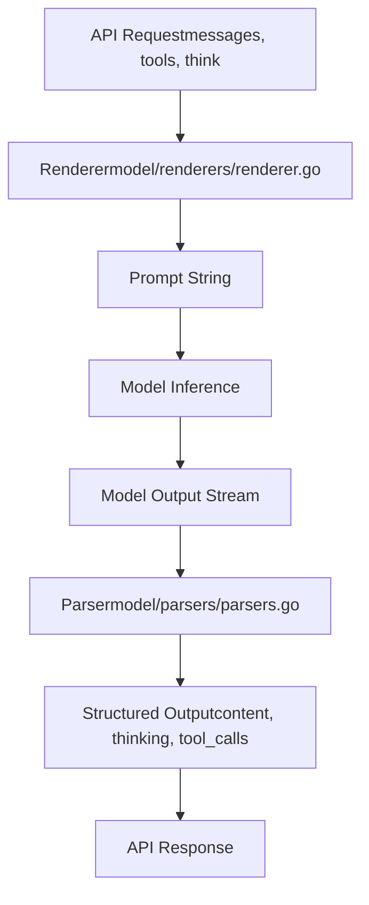
Both systems use registration patterns allowing custom implementations for specific models.

**Sources:** [model/parsers/parsers.go12-21](https://github.com/ollama/ollama/blob/562c76d7/model/parsers/parsers.go#L12-L21) [model/renderers/renderer.go9-11](https://github.com/ollama/ollama/blob/562c76d7/model/renderers/renderer.go#L9-L11) [server/routes.go360-371](https://github.com/ollama/ollama/blob/562c76d7/server/routes.go#L360-L371) [server/routes.go559-574](https://github.com/ollama/ollama/blob/562c76d7/server/routes.go#L559-L574)

---

## Parser System

Parsers process model output streams to extract structured information. They run during generation to separate regular content from special markers like thinking tags and tool calls.

### Parser Interface

The `Parser` interface defines four methods:

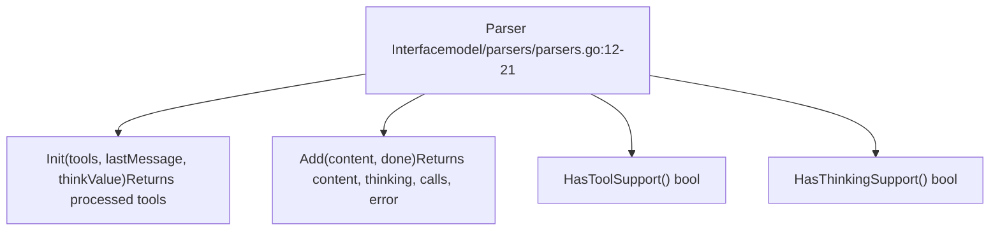
| Method | Purpose | Called When |
| --- | --- | --- |
| `Init` | Initialize parser with tools and options | Before generation starts |
| `Add` | Process streamed content chunk | Each output token/chunk |
| `HasToolSupport` | Check if parser supports tools | Capability detection |
| `HasThinkingSupport` | Check if parser supports thinking | Capability detection |

**Sources:** [model/parsers/parsers.go12-21](https://github.com/ollama/ollama/blob/562c76d7/model/parsers/parsers.go#L12-L21)

### Built-in Parsers

Ollama includes parsers for models with specialized output formats:

| Parser Name | Model Family | Features |
| --- | --- | --- |
| `passthrough` | Generic | No parsing, returns content as-is |
| `harmony` | GPT-OSS | Full parsing with `<start>` and `<end>` tags |
| `qwen3` | Qwen3 | Basic tool support |
| `qwen3-thinking` | Qwen3 variants | Tool and thinking support |
| `qwen3.5` | Qwen3.5 | Advanced thinking levels |
| `qwen3-coder` | Qwen3-Coder | Code-specific tool calls |
| `qwen3-vl-instruct` | Qwen3-VL | Vision + tool support |
| `qwen3-vl-thinking` | Qwen3-VL variants | Vision + thinking support |
| `ministral` | Ministral | Basic tool support |
| `cogito` | Cogito | Thinking-focused parsing |
| `deepseek3` | DeepSeek v3 | Thinking and tool support |
| `olmo3` | OLMo 3 | Standard parsing |
| `olmo3-think` | OLMo 3 Think | Specialized thinking |
| `nemotron-3-nano` | Nemotron 3 Nano | Nvidia format |
| `functiongemma` | Function Gemma | Tool-focused |
| `glm-4.7` | GLM-4.7 | Tool and thinking |
| `glm-ocr` | GLM-OCR | Vision + OCR parsing |
| `lfm2` | LFM2 | Basic support |
| `lfm2-thinking` | LFM2 Think | With thinking |

**Sources:** [model/parsers/parsers.go41-89](https://github.com/ollama/ollama/blob/562c76d7/model/parsers/parsers.go#L41-L89)

### Parser Registration

Custom parsers can be registered using the `Register` function:

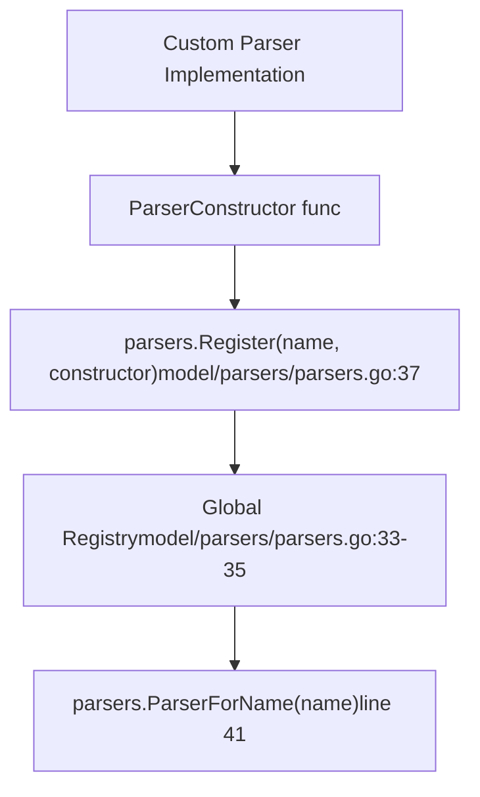
Example registration:

```
// Register a custom parserparsers.Register("custom-model", func() parsers.Parser {    return &CustomParser{}}) // Later, retrieve itparser := parsers.ParserForName("custom-model")
```
The registry allows overriding built-in parsers by registering with the same name.

**Sources:** [model/parsers/parsers.go23-39](https://github.com/ollama/ollama/blob/562c76d7/model/parsers/parsers.go#L23-L39) [model/parsers/parsers\_test.go30-50](https://github.com/ollama/ollama/blob/562c76d7/model/parsers/parsers_test.go#L30-L50)

### Parser Usage in Generation

Parsers are integrated into the generation pipeline in `server/routes.go`:

> **[Mermaid sequence]**
> *(图表结构无法解析)*

**Sources:** [server/routes.go360-371](https://github.com/ollama/ollama/blob/562c76d7/server/routes.go#L360-L371) [server/routes.go559-574](https://github.com/ollama/ollama/blob/562c76d7/server/routes.go#L559-L574) [server/routes.go516-528](https://github.com/ollama/ollama/blob/562c76d7/server/routes.go#L516-L528)

### Thinking Tag Extraction

When no custom parser is configured, models with thinking capability use a fallback parser that detects thinking tags:

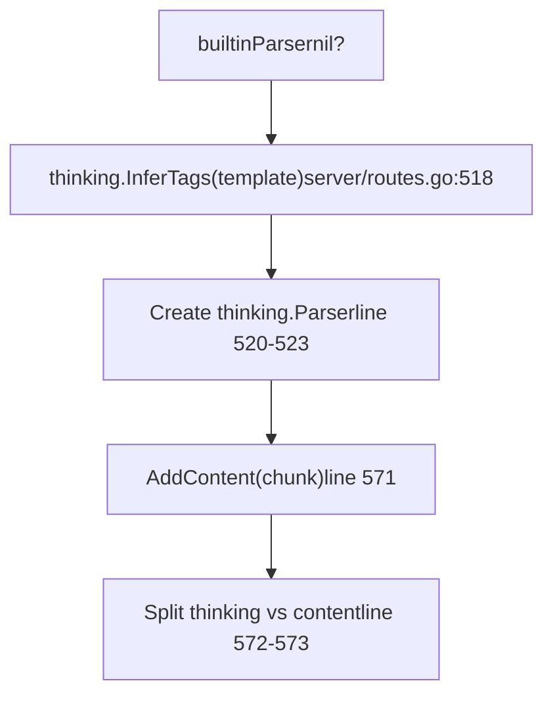
The `thinking.InferTags` function scans the template for common thinking markers like `<think>`, `<thinking>`, `<reasoning>`, etc.

**Sources:** [server/routes.go516-528](https://github.com/ollama/ollama/blob/562c76d7/server/routes.go#L516-L528) [server/routes.go570-574](https://github.com/ollama/ollama/blob/562c76d7/server/routes.go#L570-L574)

---

## Renderer System

Renderers transform API messages, tools, and options into model-specific prompt strings. They provide an alternative to templates for complex formatting logic.

### Renderer Interface

The `Renderer` interface has a single method:

```
type Renderer interface {    Render(messages []api.Message, tools []api.Tool, think *api.ThinkValue) (string, error)}
```
**Sources:** [model/renderers/renderer.go9-11](https://github.com/ollama/ollama/blob/562c76d7/model/renderers/renderer.go#L9-L11)

### Built-in Renderers

Ollama includes renderers for models requiring complex prompt formatting:

| Renderer Name | Model Family | Key Features |
| --- | --- | --- |
| `qwen3-coder` | Qwen3-Coder | Code completion format |
| `qwen3-vl-instruct` | Qwen3-VL | Vision instruction format |
| `qwen3-vl-thinking` | Qwen3-VL Think | Vision + thinking tags |
| `qwen3.5` | Qwen3.5 | Advanced thinking levels |
| `cogito` | Cogito | Thinking-focused format |
| `deepseek3.1` | DeepSeek 3.1 | Thinking variant |
| `olmo3` | OLMo 3 | Standard format |
| `olmo3.1` | OLMo 3.1 | Extended system messages |
| `olmo3-think` | OLMo 3 Think | Thinking variant (7B, 32B) |
| `olmo3-32b-think` | OLMo 3 32B Think | 32B-specific variant |
| `nemotron-3-nano` | Nemotron 3 Nano | Nvidia format |
| `functiongemma` | Function Gemma | Tool-focused format |
| `glm-4.7` | GLM-4.7 | Tool and thinking |
| `glm-ocr` | GLM-OCR | Vision + OCR format |
| `lfm2` | LFM2 | Standard format |
| `lfm2-thinking` | LFM2 Think | With thinking support |

**Sources:** [model/renderers/renderer.go45-97](https://github.com/ollama/ollama/blob/562c76d7/model/renderers/renderer.go#L45-L97)

### Renderer Registration

Custom renderers use the same registration pattern as parsers:

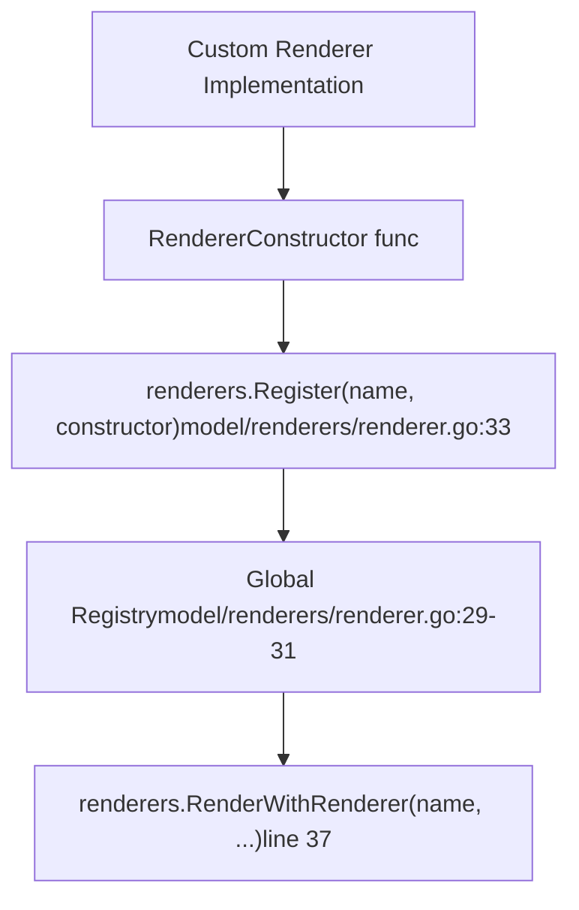
**Sources:** [model/renderers/renderer.go14-36](https://github.com/ollama/ollama/blob/562c76d7/model/renderers/renderer.go#L14-L36)

### RenderImgTags Flag

Renderers respect a global flag controlling image tag format:

```
// Set by server package on initrenderers.RenderImgTags = true  // Use [img-N] tags
```
When `RenderImgTags` is true, renderers insert `[img-0]`, `[img-1]`, etc. for images. When false, images are handled by other means (e.g., multimodal token insertion).

**Sources:** [model/renderers/renderer.go20-23](https://github.com/ollama/ollama/blob/562c76d7/model/renderers/renderer.go#L20-L23) [server/routes.go107-109](https://github.com/ollama/ollama/blob/562c76d7/server/routes.go#L107-L109)

### Renderer Selection in Prompt Pipeline

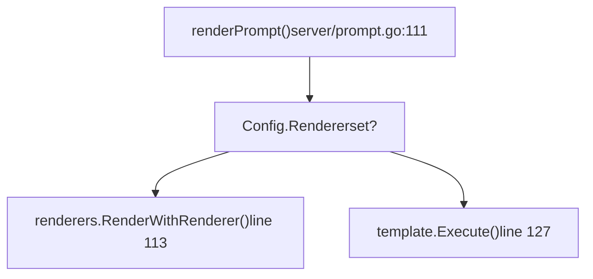
Models specify their renderer in `Model.Config.Renderer`. If set, the custom renderer is used; otherwise, the template system is used.

**Sources:** [server/prompt.go111-131](https://github.com/ollama/ollama/blob/562c76d7/server/prompt.go#L111-L131)

---

## Template System (Default Renderer)

The template system is Ollama's default prompt rendering mechanism, using Go's `text/template` package with custom extensions. It handles most models that don't require complex programmatic formatting.

### Template Structure and Parsing

Templates are parsed from strings containing Go template syntax with special variables and functions:

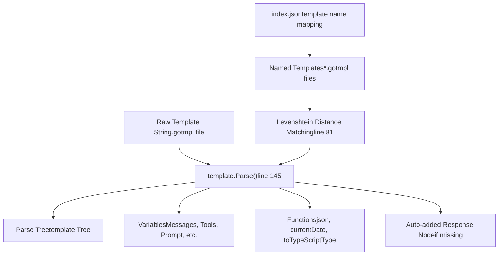
**Sources:** [template/template.go145-164](https://github.com/ollama/ollama/blob/562c76d7/template/template.go#L145-L164) [template/template.go72-92](https://github.com/ollama/ollama/blob/562c76d7/template/template.go#L72-L92) [template/template.go30-56](https://github.com/ollama/ollama/blob/562c76d7/template/template.go#L30-L56)

### Template Variables

The template system provides several variables for rendering prompts:

| Variable | Type | Description | Availability |
| --- | --- | --- | --- |
| `Messages` | `[]templateMessage` | Collated message history | Modern templates (with `.Messages` var) |
| `Tools` | `templateTools` | Available tool definitions | Modern templates |
| `Prompt` | `string` | Current user prompt | Legacy templates |
| `Response` | `string` | Assistant response | Legacy templates |
| `System` | `string` | System message content | Both modes |
| `Think` | `bool` | Whether thinking is enabled | All templates |
| `ThinkLevel` | `string` | Thinking level if set | All templates |
| `IsThinkSet` | `bool` | Whether Think was explicitly set | All templates |
| `Suffix` | `string` | Code completion suffix | Code completion mode |

**Sources:** [template/template.go195-209](https://github.com/ollama/ollama/blob/562c76d7/template/template.go#L195-L209) [template/template.go257-282](https://github.com/ollama/ollama/blob/562c76d7/template/template.go#L257-L282)

### Template Functions

Built-in functions extend template capabilities:

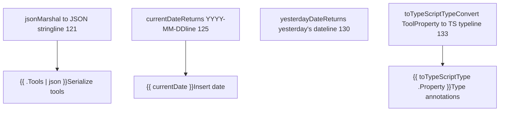
**Sources:** [template/template.go120-143](https://github.com/ollama/ollama/blob/562c76d7/template/template.go#L120-L143) [template/template\_test.go455-519](https://github.com/ollama/ollama/blob/562c76d7/template/template_test.go#L455-L519)

### Template Execution Modes

Templates execute in two modes depending on whether they use modern or legacy variables:

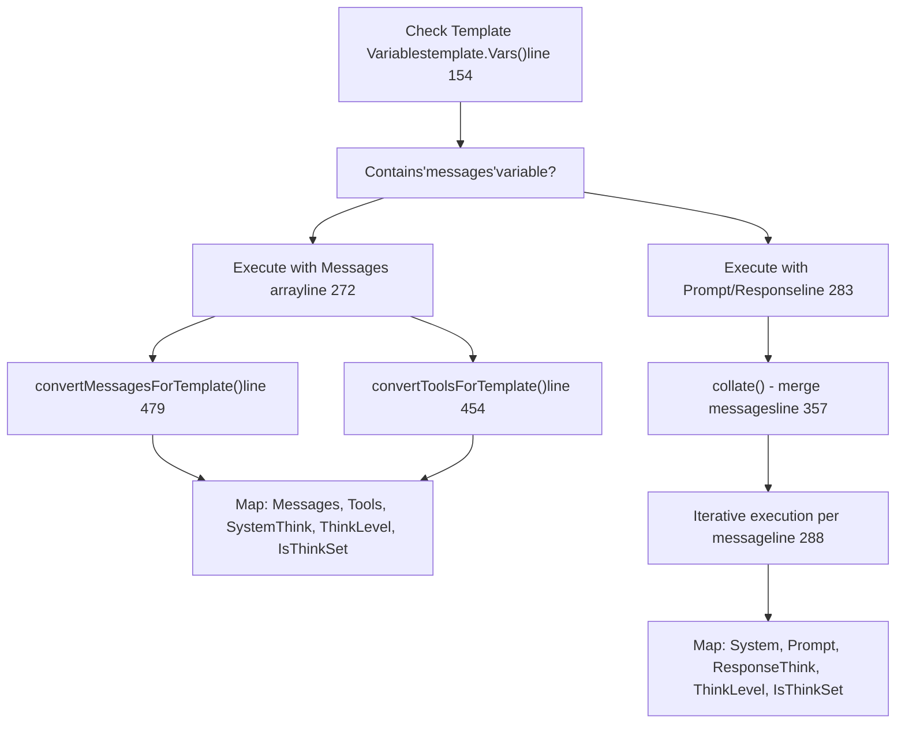
**Sources:** [template/template.go257-350](https://github.com/ollama/ollama/blob/562c76d7/template/template.go#L257-L350) [template/template.go357-374](https://github.com/ollama/ollama/blob/562c76d7/template/template.go#L357-L374) [template/template.go454-508](https://github.com/ollama/ollama/blob/562c76d7/template/template.go#L454-L508)

### Message Collation

The `collate` function processes messages before template execution:

-   Merges consecutive messages with the same role (except tool messages)
-   Extracts all system messages into a single string
-   Preserves tool message metadata (ToolName, ToolCallID)

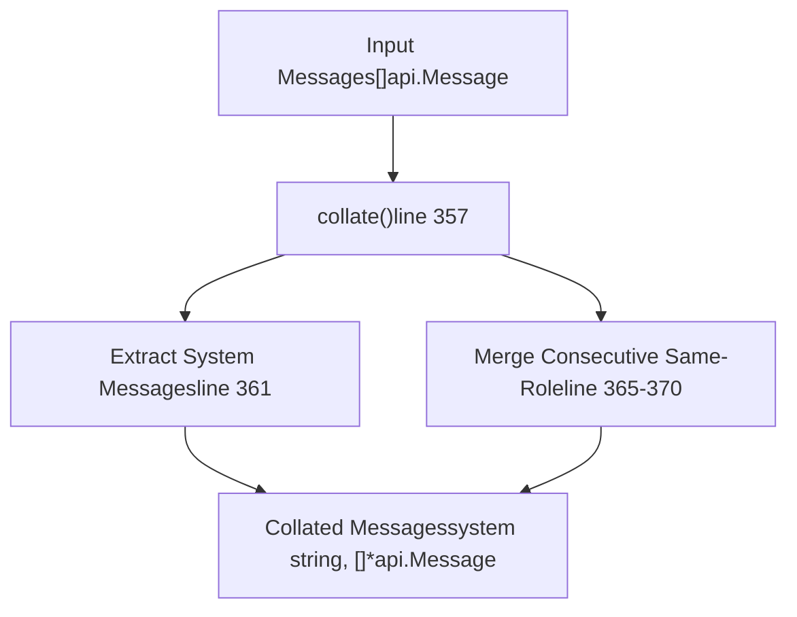
**Sources:** [template/template.go357-374](https://github.com/ollama/ollama/blob/562c76d7/template/template.go#L357-L374) [template/template\_test.go521-615](https://github.com/ollama/ollama/blob/562c76d7/template/template_test.go#L521-L615)

### Template Type Conversion

Templates cannot directly range over certain Go types, so conversion functions create template-friendly representations:

| Source Type | Template Type | Conversion Function | Purpose |
| --- | --- | --- | --- |
| `api.Message` | `templateMessage` | `convertMessagesForTemplate()` | Enables ranging and field access |
| `api.Tool` | `templateTool` | `convertToolsForTemplate()` | Converts Properties map for ranging |
| `api.ToolCallFunctionArguments` | `templateArgs` | Automatic in conversion | Enables ranging over arguments |
| `api.ToolPropertiesMap` | `templateProperties` | Automatic in conversion | Enables ranging over properties |

These types implement `String()` methods that marshal to JSON, allowing both ranging and JSON serialization:

**Sources:** [template/template.go376-508](https://github.com/ollama/ollama/blob/562c76d7/template/template.go#L376-L508) [template/template\_test.go617-771](https://github.com/ollama/ollama/blob/562c76d7/template/template_test.go#L617-L771)

---

## Renderer System

The renderer system provides an alternative to templates for models requiring custom prompt formatting logic that cannot be easily expressed in Go templates.

### Renderer Selection

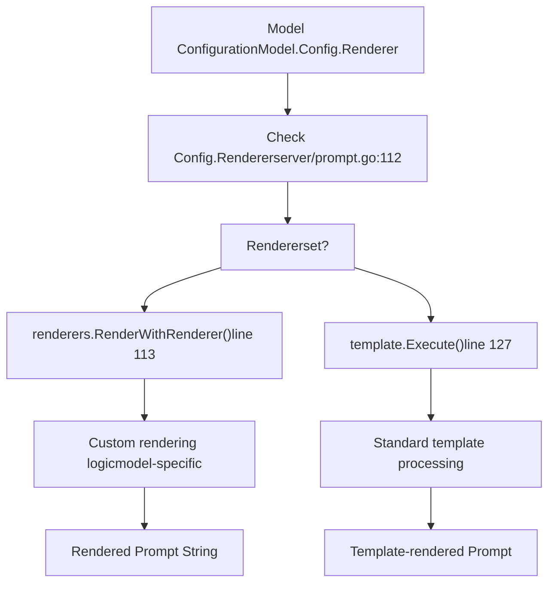
**Sources:** [server/prompt.go111-131](https://github.com/ollama/ollama/blob/562c76d7/server/prompt.go#L111-L131)

The renderer interface allows models to implement complex formatting requirements such as:

-   Interleaving image tokens with text in specific patterns
-   Complex tool formatting beyond template capabilities
-   Dynamic prompt structure based on context
-   Special token sequences requiring programmatic logic

---

## Example: Custom Parser and Renderer

Here's how a model would implement custom parsing and rendering:

### Custom Parser Implementation

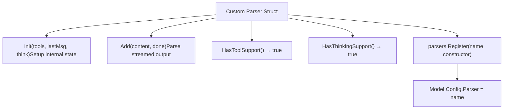
The parser processes output incrementally, extracting structured elements:

| Method Call | Input | Output |
| --- | --- | --- |
| `Init(...)` | Tools, last message, think value | Processed tools (may rename/transform) |
| `Add("text", false)` | Partial output chunk | content, thinking, calls (empty), nil |
| `Add("<tool>...</tool>", true)` | Final chunk with tool | "", "", \[ToolCall{...}\], nil |

**Sources:** [model/parsers/parsers.go12-21](https://github.com/ollama/ollama/blob/562c76d7/model/parsers/parsers.go#L12-L21) [server/routes.go360-371](https://github.com/ollama/ollama/blob/562c76d7/server/routes.go#L360-L371)

### Custom Renderer Implementation

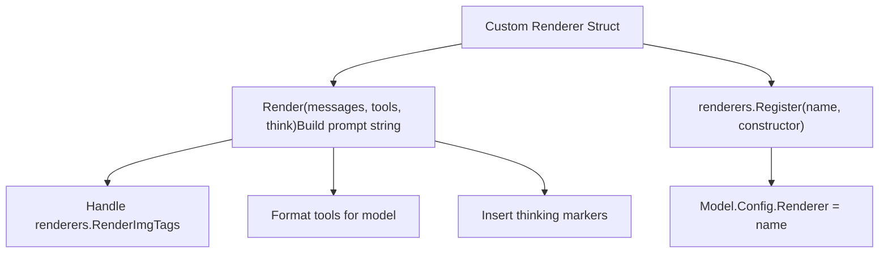
The renderer builds a complete prompt string from structured inputs.

**Sources:** [model/renderers/renderer.go9-11](https://github.com/ollama/ollama/blob/562c76d7/model/renderers/renderer.go#L9-L11) [model/renderers/glmocr.go11-104](https://github.com/ollama/ollama/blob/562c76d7/model/renderers/glmocr.go#L11-L104)

### GLM-OCR Example

The GLM-OCR model demonstrates both custom parsing and rendering:

**Renderer** (`glmocr.go`):

-   Inserts `[img-N]` tags when `RenderImgTags` is true
-   Formats tools in XML-style tags: `<tools>`, `<tool_call>`
-   Handles thinking with `<think>` tags and `/nothink` directive
-   Uses special tokens: `[gMASK]<sop>`, `<|user|>`, `<|assistant|>`, `<|observation|>`

**Parser** (`glmocr_parser.go`):

-   Extracts content between `<think>` tags as thinking
-   Parses `<tool_call>` blocks with `<arg_key>`/`<arg_value>` pairs
-   Removes XML markers from final content

**Sources:** [model/renderers/glmocr.go11-127](https://github.com/ollama/ollama/blob/562c76d7/model/renderers/glmocr.go#L11-L127) [model/parsers/glmocr.go1-150](https://github.com/ollama/ollama/blob/562c76d7/model/parsers/glmocr.go#L1-L150)

---

## Prompt Rendering Pipeline

The complete prompt rendering pipeline handles message truncation, image tag insertion, and template/renderer execution.

### Pipeline Flow

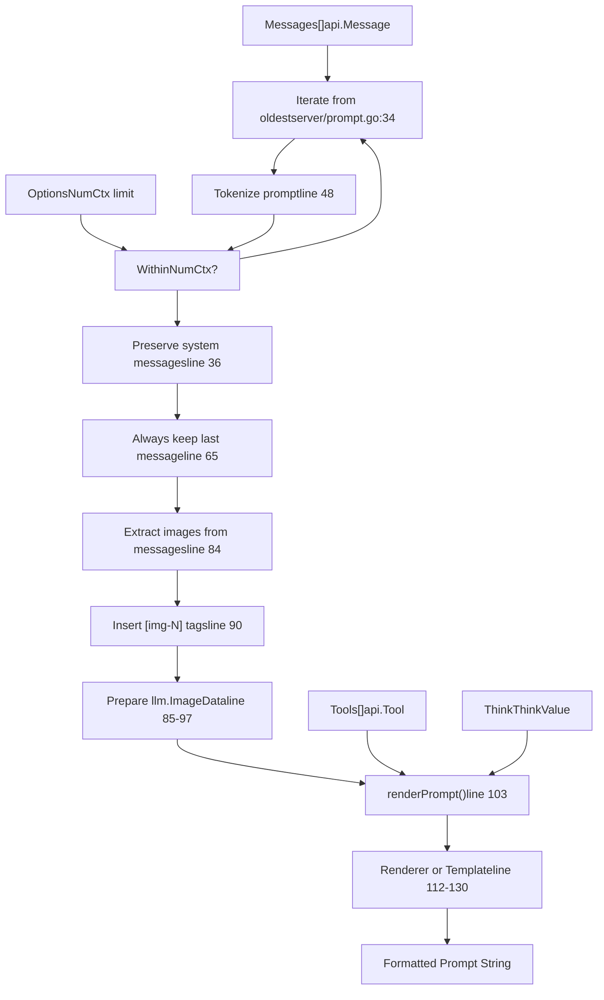
**Sources:** [server/prompt.go23-109](https://github.com/ollama/ollama/blob/562c76d7/server/prompt.go#L23-L109)

### Message Truncation Strategy

The truncation algorithm ensures prompts fit within the context window while preserving critical information:

1.  **Start with all messages** - Begin with the complete message history
2.  **Iterate from oldest to newest** - Try progressively fewer messages
3.  **Preserve system messages** - Always include system messages from the truncated portion
4.  **Keep last message** - Always include the most recent user message
5.  **Account for images** - Add 768 tokens per image for vision models (approximate)
6.  **Tokenize and measure** - Check if the rendered prompt fits in `NumCtx`

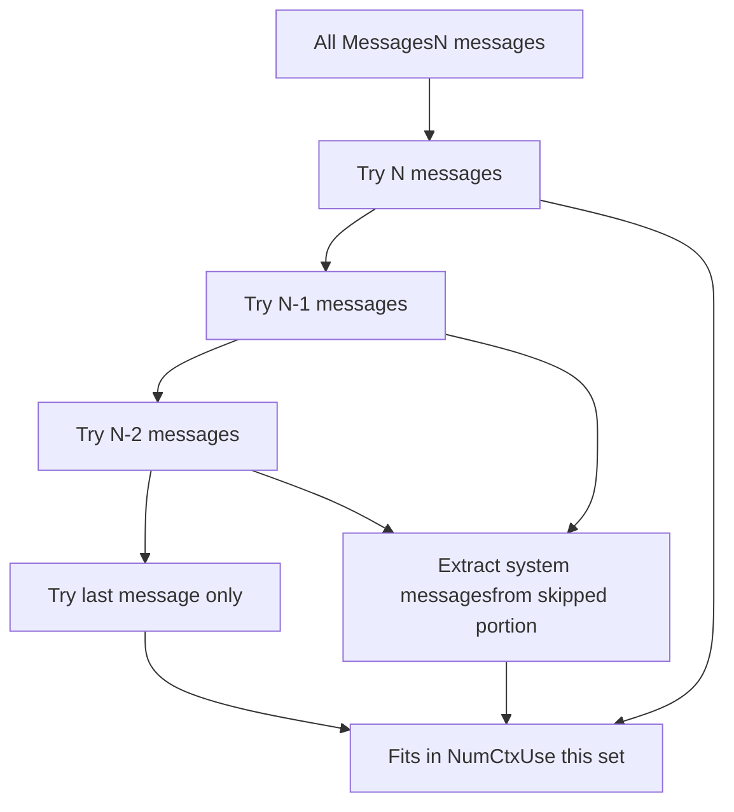
**Sources:** [server/prompt.go34-70](https://github.com/ollama/ollama/blob/562c76d7/server/prompt.go#L34-L70) [server/prompt\_test.go14-267](https://github.com/ollama/ollama/blob/562c76d7/server/prompt_test.go#L14-L267)

### Image Tag Insertion

Images are replaced with numbered tags (`[img-0]`, `[img-1]`, etc.) in the prompt text:

| Scenario | Behavior | Example |
| --- | --- | --- |
| Image with content | Prefix tag | `[img-0]What is this?` |
| Content with `[img]` | Replace first occurrence | `What is [img-0]?` |
| Multiple images | Increment IDs | `[img-0][img-1]Compare these` |

The `llm.ImageData` structures are collected separately with matching IDs for later processing.

**Sources:** [server/prompt.go84-100](https://github.com/ollama/ollama/blob/562c76d7/server/prompt.go#L84-L100)

---

## Integration with Model Architectures

Different model architectures integrate parsing and rendering at various stages:

### Model-Specific Integration Points

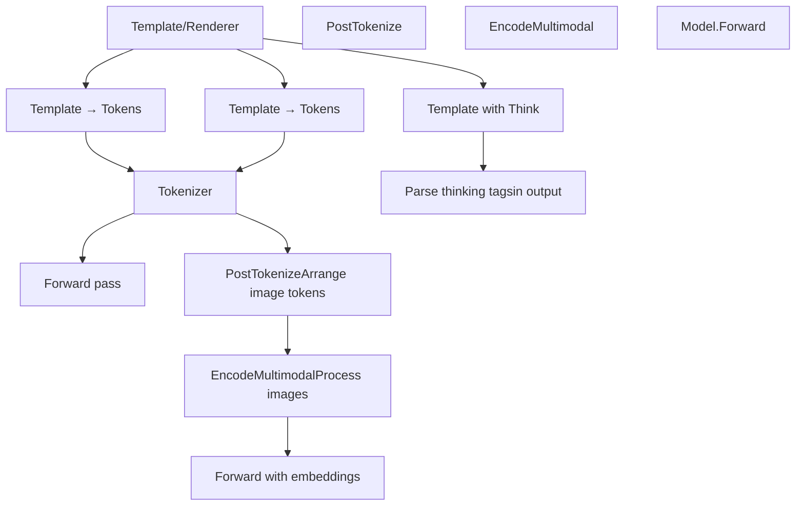
**Sources:** [server/prompt.go111-131](https://github.com/ollama/ollama/blob/562c76d7/server/prompt.go#L111-L131) [model/models/gemma3/model.go101-125](https://github.com/ollama/ollama/blob/562c76d7/model/models/gemma3/model.go#L101-L125) [model/models/mistral3/model.go103-166](https://github.com/ollama/ollama/blob/562c76d7/model/models/mistral3/model.go#L103-L166)

### Multimodal Processing Chain

For vision models, the processing chain involves multiple transformation steps:

1.  **Template/Renderer** - Inserts image placeholders
2.  **Tokenization** - Converts text to tokens
3.  **PostTokenize** - Arranges token sequence with multimodal markers
4.  **EncodeMultimodal** - Processes image data into embeddings
5.  **Forward Pass** - Inserts embeddings at marker positions

Each model implements `EncodeMultimodal` and `PostTokenize` to match its architecture requirements:

| Model | Image Processing | Post-Tokenization Strategy |
| --- | --- | --- |
| Gemma3 | Vision transformer + projector | Newlines + start/end markers |
| Mistral3 | Vision model + patch merger | Row-based with break tokens |
| Llama4 | Local + global tiles | Tile separators + global view |
| Qwen2.5-VL | Spatial patches + grid | Position cache for MRoPE |
| MLlama | Cross-attention encoder | Image token as attention key |

**Sources:** [model/models/gemma3/model.go101-125](https://github.com/ollama/ollama/blob/562c76d7/model/models/gemma3/model.go#L101-L125) [model/models/mistral3/model.go103-130](https://github.com/ollama/ollama/blob/562c76d7/model/models/mistral3/model.go#L103-L130) [model/models/llama4/model.go65-126](https://github.com/ollama/ollama/blob/562c76d7/model/models/llama4/model.go#L65-L126) [model/models/qwen25vl/model.go76-88](https://github.com/ollama/ollama/blob/562c76d7/model/models/qwen25vl/model.go#L76-L88) [model/models/mllama/model.go63-92](https://github.com/ollama/ollama/blob/562c76d7/model/models/mllama/model.go#L63-L92)

---

## Summary

The parser and renderer system in Ollama provides a flexible framework for handling diverse model architectures:

-   **Templates** serve as the default rendering mechanism with Go template syntax
-   **Renderers** provide custom logic for models with complex formatting needs
-   **Post-tokenization** transforms token sequences for model-specific requirements
-   **Type conversion** ensures template compatibility with complex data structures
-   **Message truncation** maintains prompt quality within context limits
-   **Image handling** coordinates multimodal data across the processing pipeline

This architecture allows Ollama to support a wide variety of model families while presenting a unified API to users.

**Sources:** [template/template.go1-647](https://github.com/ollama/ollama/blob/562c76d7/template/template.go#L1-L647) [server/prompt.go1-132](https://github.com/ollama/ollama/blob/562c76d7/server/prompt.go#L1-L132) [model/models/gemma3/model.go1-172](https://github.com/ollama/ollama/blob/562c76d7/model/models/gemma3/model.go#L1-L172) [model/models/mistral3/model.go1-171](https://github.com/ollama/ollama/blob/562c76d7/model/models/mistral3/model.go#L1-L171) [model/models/llama4/model.go1-181](https://github.com/ollama/ollama/blob/562c76d7/model/models/llama4/model.go#L1-L181)
