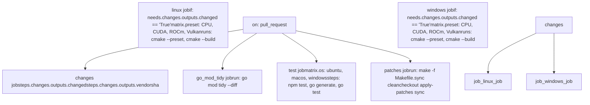
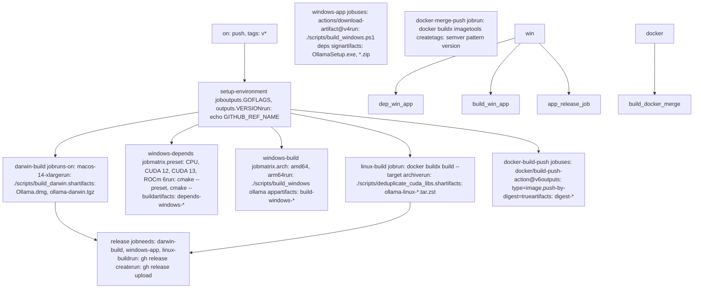
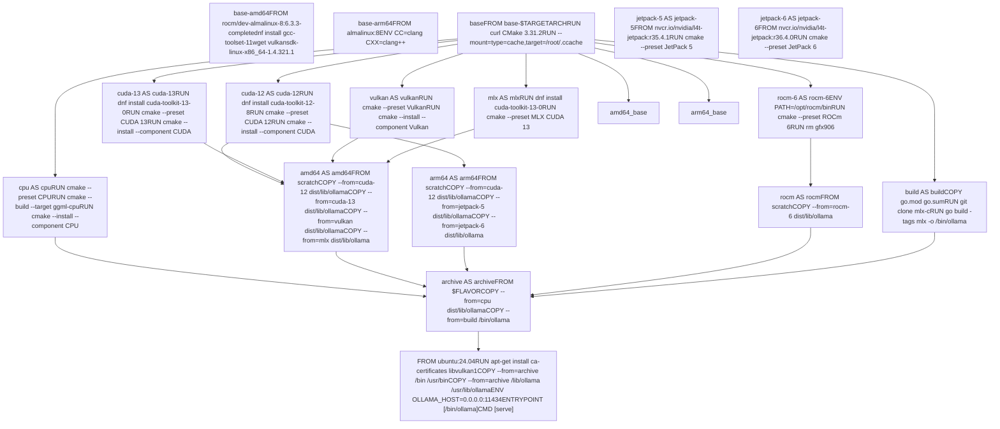
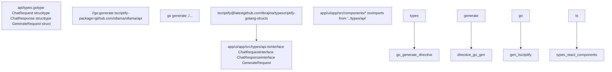

# Development Guide

Relevant source files

-   [.github/workflows/release.yaml](https://github.com/ollama/ollama/blob/562c76d7/.github/workflows/release.yaml)
-   [.github/workflows/test-install.yaml](https://github.com/ollama/ollama/blob/562c76d7/.github/workflows/test-install.yaml)
-   [.github/workflows/test.yaml](https://github.com/ollama/ollama/blob/562c76d7/.github/workflows/test.yaml)
-   [Dockerfile](https://github.com/ollama/ollama/blob/562c76d7/Dockerfile)
-   [app/ollama.iss](https://github.com/ollama/ollama/blob/562c76d7/app/ollama.iss)
-   [cmd/config/claude\_test.go](https://github.com/ollama/ollama/blob/562c76d7/cmd/config/claude_test.go)
-   [cmd/config/codex.go](https://github.com/ollama/ollama/blob/562c76d7/cmd/config/codex.go)
-   [cmd/config/codex\_test.go](https://github.com/ollama/ollama/blob/562c76d7/cmd/config/codex_test.go)
-   [go.mod](https://github.com/ollama/ollama/blob/562c76d7/go.mod)
-   [go.sum](https://github.com/ollama/ollama/blob/562c76d7/go.sum)
-   [scripts/build\_darwin.sh](https://github.com/ollama/ollama/blob/562c76d7/scripts/build_darwin.sh)
-   [scripts/build\_linux.sh](https://github.com/ollama/ollama/blob/562c76d7/scripts/build_linux.sh)
-   [scripts/build\_windows.ps1](https://github.com/ollama/ollama/blob/562c76d7/scripts/build_windows.ps1)
-   [scripts/deduplicate\_cuda\_libs.sh](https://github.com/ollama/ollama/blob/562c76d7/scripts/deduplicate_cuda_libs.sh)
-   [scripts/install.ps1](https://github.com/ollama/ollama/blob/562c76d7/scripts/install.ps1)
-   [scripts/install.sh](https://github.com/ollama/ollama/blob/562c76d7/scripts/install.sh)

This guide covers the development workflow, build system architecture, and contribution process for Ollama. It provides an overview of how the codebase is organized, how builds are configured, and how the CI/CD pipeline operates.

For step-by-step build instructions for your platform, see [Building from Source](/ollama/ollama/8.1-building-from-source). For platform-specific compilation details, see [Platform-Specific Build Details](/ollama/ollama/8.2-platform-specific-build-details). For information about testing, see [Testing and Quality Assurance](/ollama/ollama/8.3-testing-and-quality-assurance). For desktop app development, see [Desktop Application Development](/ollama/ollama/8.4-desktop-application-development).

---

## Repository Structure

The Ollama repository is organized into several key directories, each with distinct responsibilities:

| Directory | Purpose | Key Files |
| --- | --- | --- |
| `cmd/` | CLI entry point | `cmd.go` - main command implementation |
| `server/` | HTTP server, API handlers, scheduler | `routes.go`, `sched.go`, `images.go` |
| `llm/` | LLM runner interface and server management | `server.go`, `payload_*.go` |
| `runner/` | Runner implementations | `ollamarunner/`, `llamarunner/` |
| `ml/backend/ggml/` | Native ML backend (GGML) | `ggml/` submodule |
| `x/ml/backend/mlx/` | Experimental MLX backend | `mlx/` submodule |
| `model/` | Model architecture implementations | `gemma3/`, `llama/`, `mllama/` |
| `kvcache/` | KV cache management | `cache.go` |
| `convert/` | Model conversion utilities | `convert.go`, `convert_*.go` |
| `template/` | Chat template system | `template.go`, `named.go` |
| `tools/` | Tool calling system | `parser.go`, `registry.go` |
| `discover/` | GPU discovery and enumeration | `gpu_*.go` |
| `app/` | Desktop application | `ui/app/` - React UI, `cmd/app/` - Go backend |
| `scripts/` | Build and release scripts | `build_darwin.sh`, `build_windows.ps1`, `build_linux.sh` |
| `.github/workflows/` | CI/CD definitions | `test.yaml`, `release.yaml` |
| `integration/` | Integration tests | `*_test.go` |

**Repository Structure and Build Flow**

```mermaid
flowchart TD
    cmd_main["cmd/cmd.gocmd.Execute()"]
    routes["server/routes.goServer.Serve()"]
    sched["server/sched.goScheduler.GetRunner()"]
    images["server/images.goCreateModel()"]
    llm_server["llm/server.gollama.LlamaServer"]
    ollamarunner["runner/ollamarunner/ollamarunner.NewServer()"]
    llamarunner["runner/llamarunner/llamarunner.NewLlamaServer()"]
    ggml_backend["ml/backend/ggml/ggml.goggml.Backend"]
    ggml_submod["ml/backend/ggml/ggml/ggml.c, ggml-cuda.cu"]
    cmake["CMakeLists.txttargets: ggml-cpu, ggml-cuda"]
    presets["CMakePresets.jsonpresets: CPU, CUDA 12, CUDA 13"]
    build_win["scripts/build_windows.ps1functions: cpu(), cuda12(), ollama()"]
    build_mac["scripts/build_darwin.shfunctions: _build_darwin(), _sign_darwin()"]
    build_lin["scripts/build_linux.shdocker buildx build --target archive"]
    test_yaml[".github/workflows/test.yamljobs: changes, linux, windows, test"]
    release_yaml[".github/workflows/release.yamljobs: darwin-build, windows-app, release"]

    cmd --> main_routes
    routes --> sched
    sched --> llm_server
    llm --> server_ollamarunner
    llm --> server_llamarunner
    ollamarunner --> ggml_backend
    llamarunner --> ggml_backend
    cmake --> ggml_submod
    presets --> cmake
    build --> win_cmake
    build --> mac_cmake
    build --> lin_cmake
    test --> yaml_build_win
    test --> yaml_build_mac
    release --> yaml_build_win
    release --> yaml_build_mac
    release --> yaml_build_lin
```


Sources: [cmd/cmd.go1-100](https://github.com/ollama/ollama/blob/562c76d7/cmd/cmd.go#L1-L100) [server/routes.go1-50](https://github.com/ollama/ollama/blob/562c76d7/server/routes.go#L1-L50) [server/sched.go1-50](https://github.com/ollama/ollama/blob/562c76d7/server/sched.go#L1-L50) [llm/server.go1-50](https://github.com/ollama/ollama/blob/562c76d7/llm/server.go#L1-L50) [CMakeLists.txt1-219](https://github.com/ollama/ollama/blob/562c76d7/CMakeLists.txt#L1-L219) [CMakePresets.json1-183](https://github.com/ollama/ollama/blob/562c76d7/CMakePresets.json#L1-L183)

---

## Build System Architecture

Ollama uses a hybrid build system combining CMake for native libraries and Go for the application layer. The build process follows a three-stage pipeline: native library compilation, Go binary compilation, and packaging.

### CMake Presets System

CMake presets define build configurations for different platforms and acceleration backends. Each preset specifies compiler flags, target architectures, and installation paths.

**CMake Preset to Target Mapping**

```mermaid
flowchart TD
    cpu_preset["configurePresets[0]name: CPU"]
    cuda11_preset["configurePresets[2]name: CUDA 11"]
    cuda12_preset["configurePresets[3]name: CUDA 12"]
    cuda13_preset["configurePresets[4]name: CUDA 13"]
    rocm6_preset["configurePresets[8]name: ROCm 6"]
    vulkan_preset["configurePresets[9]name: Vulkan"]
    mlx_preset["configurePresets[10]name: MLX"]
    ggml_cpu["add_library(ggml-cpu)STATIC ggml/src/ggml.c"]
    ggml_cuda["add_library(ggml-cuda)SHARED ggml/src/ggml-cuda.cu"]
    ggml_hip["add_library(ggml-hip)SHARED ggml/src/ggml-hip.cu"]
    ggml_vulkan["add_library(ggml-vulkan)SHARED ggml/src/ggml-vulkan.cpp"]
    mlx_mlxc["add_custom_commandOUTPUT libmlx.dylib libmlxc.dylib"]
    cpu_out["dist/lib/ollama/libggml-cpu.so"]
    cuda_out["dist/lib/ollama/cuda_v*/libggml-cuda.so"]
    rocm_out["dist/lib/ollama/rocm/libggml-hip.so"]
    vulkan_out["dist/lib/ollama/vulkan/libggml-vulkan.so"]
    mlx_out["dist/lib/ollama/mlx/libmlx.dylib, libmlxc.dylib"]

    cpu --> preset_ggml_cpu
    cuda11 --> preset_ggml_cuda
    cuda12 --> preset_ggml_cuda
    cuda13 --> preset_ggml_cuda
    rocm6 --> preset_ggml_hip
    vulkan --> preset_ggml_vulkan
    mlx --> preset_mlx_mlxc
    ggml --> cpu_cpu_out
    ggml --> cuda_cuda_out
    ggml --> hip_rocm_out
    ggml --> vulkan_vulkan_out
    mlx --> mlxc_mlx_out
```


Sources: [CMakePresets.json14-93](https://github.com/ollama/ollama/blob/562c76d7/CMakePresets.json#L14-L93) [CMakeLists.txt82-219](https://github.com/ollama/ollama/blob/562c76d7/CMakeLists.txt#L82-L219) [scripts/build\_windows.ps1105-229](https://github.com/ollama/ollama/blob/562c76d7/scripts/build_windows.ps1#L105-L229) [scripts/build\_darwin.sh50-79](https://github.com/ollama/ollama/blob/562c76d7/scripts/build_darwin.sh#L50-L79)

**Key CMake Presets:**

| Preset | Platform | Target | Output Component |
| --- | --- | --- | --- |
| `CPU` | All | `ggml-cpu` | `CPU` |
| `CUDA 11` | Windows, Linux | `ggml-cuda` | `CUDA` |
| `CUDA 12` | Windows, Linux | `ggml-cuda` | `CUDA` |
| `CUDA 13` | Windows, Linux | `ggml-cuda` | `CUDA` |
| `ROCm 6` | Windows, Linux | `ggml-hip` | `HIP` |
| `Vulkan` | All | `ggml-vulkan` | `Vulkan` |
| `JetPack 5` | Linux ARM64 | `ggml-cuda` | `CUDA` |
| `JetPack 6` | Linux ARM64 | `ggml-cuda` | `CUDA` |
| `MLX` | macOS | `mlx mlxc` | `MLX` |
| `MLX CUDA 13` | Linux | `mlx mlxc` | `MLX` |

The presets are referenced in build scripts:

-   Windows: [scripts/build\_windows.ps199-103](https://github.com/ollama/ollama/blob/562c76d7/scripts/build_windows.ps1#L99-L103) for CPU, [scripts/build\_windows.ps1126-131](https://github.com/ollama/ollama/blob/562c76d7/scripts/build_windows.ps1#L126-L131) for CUDA
-   macOS: [scripts/build\_darwin.sh50-60](https://github.com/ollama/ollama/blob/562c76d7/scripts/build_darwin.sh#L50-L60) for amd64, [scripts/build\_darwin.sh66-71](https://github.com/ollama/ollama/blob/562c76d7/scripts/build_darwin.sh#L66-L71) for arm64
-   Linux (Docker): [Dockerfile48-159](https://github.com/ollama/ollama/blob/562c76d7/Dockerfile#L48-L159) for all presets

### Go Build Tags

Go build tags control which features are compiled into the binary. The primary tag is `mlx`, which enables experimental MLX backend support.

**Build without MLX (default):**

```
go build .
```
**Build with MLX:**

```
go build -tags mlx .
```
The MLX tag is used in:

-   [Dockerfile175](https://github.com/ollama/ollama/blob/562c76d7/Dockerfile#L175-L175) - Linux build with MLX support
-   [scripts/build\_darwin.sh76](https://github.com/ollama/ollama/blob/562c76d7/scripts/build_darwin.sh#L76-L76) - macOS build with MLX support
-   [README.md276](https://github.com/ollama/ollama/blob/562c76d7/README.md?plain=1#L276-L276) - MLX build instructions

**Complete Build Pipeline with Script Functions**

```mermaid
flowchart TD
    cmake_config["cmake --preset CPU/CUDA/ROCm/Vulkan/MLX"]
    cmake_build["cmake --build --parallel"]
    cmake_install["cmake --install build --component CPU/CUDA/HIP"]
    go_generate["go generate ./...runs tscriptify on api/types.go"]
    go_build["go build -trimpath-ldflags with version.Version"]
    win_cpu["cpu() - line 99"]
    win_cuda12["cuda12() - line 176"]
    win_ollama["ollama() - line 231"]
    win_sign["sign() - line 304signtool.exe with KEY_CONTAINER"]
    win_installer["installer() - line 326ISCC.exe app/ollama.iss"]
    win_zip["zip() - line 342Compress-Archive"]
    mac_build["_build_darwin() - line 42lipo creates universal binary"]
    mac_sign["_sign_darwin() - line 83codesign with APPLE_IDENTITY"]
    mac_app["_build_macapp() - line 107creates Ollama.app bundle"]
    lin_docker["docker buildx build - line 28--target archive"]
    lin_compress["tar + zstd - line 60--ultra -22 -T0"]

    cmake --> config_cmake_build
    cmake --> build_cmake_install
    go --> generate_go_build
    win --> cpu_win_ollama
    win --> cuda12_win_ollama
    win --> ollama_win_sign
    win --> sign_win_installer
    win --> sign_win_zip
    mac --> build_mac_sign
    mac --> sign_mac_app
    lin --> docker_lin_compress
    cmake --> install_go_build
    go --> build_win_ollama
    go --> build_mac_build
    go --> build_lin_docker
```


Sources: [scripts/build\_windows.ps193-375](https://github.com/ollama/ollama/blob/562c76d7/scripts/build_windows.ps1#L93-L375) [scripts/build\_darwin.sh42-230](https://github.com/ollama/ollama/blob/562c76d7/scripts/build_darwin.sh#L42-L230) [scripts/build\_linux.sh1-75](https://github.com/ollama/ollama/blob/562c76d7/scripts/build_linux.sh#L1-L75)

**Build Environment Variables:**

| Variable | Purpose | Set In |
| --- | --- | --- |
| `VERSION` | Version string embedded in binary | [scripts/build\_darwin.sh15](https://github.com/ollama/ollama/blob/562c76d7/scripts/build_darwin.sh#L15-L15) |
| `GOFLAGS` | Go linker flags (version, mode) | [scripts/build\_darwin.sh16](https://github.com/ollama/ollama/blob/562c76d7/scripts/build_darwin.sh#L16-L16) [.github/workflows/release.yaml25](https://github.com/ollama/ollama/blob/562c76d7/.github/workflows/release.yaml#L25-L25) |
| `CGO_ENABLED` | Enable CGO for native integration | [scripts/build\_windows.ps158](https://github.com/ollama/ollama/blob/562c76d7/scripts/build_windows.ps1#L58-L58) |
| `CGO_CFLAGS` | C compiler flags | [scripts/build\_darwin.sh17](https://github.com/ollama/ollama/blob/562c76d7/scripts/build_darwin.sh#L17-L17) [scripts/build\_windows.ps162-63](https://github.com/ollama/ollama/blob/562c76d7/scripts/build_windows.ps1#L62-L63) |
| `CGO_LDFLAGS` | Linker flags | [scripts/build\_darwin.sh19](https://github.com/ollama/ollama/blob/562c76d7/scripts/build_darwin.sh#L19-L19) [scripts/build\_windows.ps163-64](https://github.com/ollama/ollama/blob/562c76d7/scripts/build_windows.ps1#L63-L64) |
| `VULKAN_SDK` | Vulkan SDK path | [scripts/build\_windows.ps166](https://github.com/ollama/ollama/blob/562c76d7/scripts/build_windows.ps1#L66-L66) |

---

## Development Workflow

### Local Development Setup

**Prerequisites by Platform:**

**macOS:**

```
# Apple Silicon - Metal built-ingo version  # Go 1.21+ # Intel - requires CMakebrew install cmake
```
**Windows:**

```
# Requiredcmake --version# Visual Studio 2022 with C++ Desktop Development # Optional - GPU support# CUDA: CUDA SDK 12.8 or 13.0# ROCm: AMD ROCm 6.x# Vulkan: Vulkan SDK 1.4.321.1
```
**Linux:**

```
# Requiredsudo apt install cmake  # or dnf install cmake # Optional - GPU support# CUDA: CUDA SDK 12.8 or 13.0# ROCm: ROCm 6.x# Vulkan: vulkan-sdk
```
Sources: [docs/development.md3-119](https://github.com/ollama/ollama/blob/562c76d7/docs/development.md?plain=1#L3-L119)

### Building Native Libraries

Native libraries must be built before the Go binary. The process varies by platform:

**Windows (CPU only):**

```
cmake -B buildcmake --build build --config Release
```
**Windows (with CUDA 13):**

```
cmake -B build --preset "CUDA 13"cmake --build build --config Release
```
**macOS (Metal):**

```
cmake --preset MLXcmake --build --preset MLX --parallel
```
**Linux (CPU):**

```
cmake -B buildcmake --build build
```
Sources: [docs/development.md28-119](https://github.com/ollama/ollama/blob/562c76d7/docs/development.md?plain=1#L28-L119) [scripts/build\_windows.ps199-223](https://github.com/ollama/ollama/blob/562c76d7/scripts/build_windows.ps1#L99-L223)

### Building and Running Ollama

After native libraries are built, compile and run the Ollama binary:

```
# Build the binarygo run . serve # Or build and run separatelygo build ../ollama serve
```
The binary will automatically discover native libraries in these locations relative to the executable:

-   `./lib/ollama` (Windows)
-   `../lib/ollama` (Linux)
-   `.` (macOS)
-   `build/lib/ollama` (development)

Sources: [docs/development.md8-16](https://github.com/ollama/ollama/blob/562c76d7/docs/development.md?plain=1#L8-L16) [docs/development.md170-179](https://github.com/ollama/ollama/blob/562c76d7/docs/development.md?plain=1#L170-L179)

### Common Development Tasks

**Rebuild after native code changes:**

```
# Clear Go build cache to force CGO recompilationgo clean -cachego run . serve
```
The cache clear forces CGO to recompile native bindings, which is necessary when C/C++ header files or data structures change.

**Using ccache for faster rebuilds:**

The build system uses ccache to speed up recompilation of unchanged C/C++ files:

```
# Install ccache# macOS: brew install ccache# Ubuntu: sudo apt install ccache# Windows: choco install ccache # ccache is automatically used by CMake buildscmake -B buildcmake --build build  # Subsequent builds will be faster
```
Cache directories:

-   Linux/macOS: `/github/home/.cache/ccache` (CI) or `~/.cache/ccache` (local)
-   Windows: `${{ github.workspace }}\.ccache` (CI) or `%LOCALAPPDATA%\.ccache` (local)

Sources: [Dockerfile50](https://github.com/ollama/ollama/blob/562c76d7/Dockerfile#L50-L50) [.github/workflows/test.yaml85-88](https://github.com/ollama/ollama/blob/562c76d7/.github/workflows/test.yaml#L85-L88) [.github/workflows/release.yaml127](https://github.com/ollama/ollama/blob/562c76d7/.github/workflows/release.yaml#L127-L127)

**Run all tests:**

```
# Unit testsgo test ./... # Integration tests (requires build)go test -tags=integration ./integration -v # Integration tests with model testinggo test -tags=integration,models ./integration -v -timeout 60m # Specific testgo test -run TestBlueSky ./integration -tags=integration -v
```
Sources: [integration/README.md1-16](https://github.com/ollama/ollama/blob/562c76d7/integration/README.md?plain=1#L1-L16) [integration/basic\_test.go1-191](https://github.com/ollama/ollama/blob/562c76d7/integration/basic_test.go#L1-L191)

**Run tests with coverage:**

```
go test -cover ./...
```
**Generate TypeScript types (for UI development):**

```
# Install code generatorgo install github.com/tkrajina/typescriptify-golang-structs/tscriptify@latest # Generate TypeScript types from Go structsgo generate ./...
```
This updates `app/ui/app/src/types/` with TypeScript definitions matching Go API types.

Sources: [scripts/build\_windows.ps1246-254](https://github.com/ollama/ollama/blob/562c76d7/scripts/build_windows.ps1#L246-L254) [.github/workflows/test.yaml220-228](https://github.com/ollama/ollama/blob/562c76d7/.github/workflows/test.yaml#L220-L228)

**Format code:**

```
# Format all Go filesgo fmt ./... # Check formatting without changinggo fmt -l ./...
```
**Run linter:**

```
# Using golangci-lint (used in CI)golangci-lint run
```
Sources: [.github/workflows/test.yaml234-236](https://github.com/ollama/ollama/blob/562c76d7/.github/workflows/test.yaml#L234-L236)

**Test installation scripts:**

The installation scripts can be tested locally before distribution:

```
# Test Linux/macOS installation scriptsh ./scripts/install.sh # Test Windows installation scriptpowershell -ExecutionPolicy Bypass -File .\scripts\install.ps1 # Test with custom parametersexport OLLAMA_VERSION="0.5.0"export OLLAMA_NO_START=1  # Don't start app after installsh ./scripts/install.sh
```
The CI validates installation scripts on every PR that modifies them using the `test-install` workflow.

Sources: [scripts/install.sh1-456](https://github.com/ollama/ollama/blob/562c76d7/scripts/install.sh#L1-L456) [scripts/install.ps11-324](https://github.com/ollama/ollama/blob/562c76d7/scripts/install.ps1#L1-L324) [.github/workflows/test-install.yaml1-23](https://github.com/ollama/ollama/blob/562c76d7/.github/workflows/test-install.yaml#L1-L23)

---

## CI/CD Pipeline

The CI/CD pipeline consists of two primary workflows: `test` for continuous integration and `release` for building and publishing releases.

**Test Workflow Job Dependencies**


Sources: [.github/workflows/test.yaml14-245](https://github.com/ollama/ollama/blob/562c76d7/.github/workflows/test.yaml#L14-L245)

**Change Detection Logic:**

The workflow uses a custom change detection script to determine if native code has changed, avoiding unnecessary builds:

```
# Implemented in bash/python hybridgit diff-tree -r --no-commit-id --name-only "$MERGE_BASE" "$HEAD" \  | xargs python3 -c "import sys; from pathlib import Path;      print(any(Path(x).match(glob) for x in sys.argv[1:]      for glob in '$*'.split(' ')))"
```
Patterns checked: `llama/llama.cpp/**/*`, `ml/backend/ggml/ggml/**/*`

Sources: [.github/workflows/test.yaml30-41](https://github.com/ollama/ollama/blob/562c76d7/.github/workflows/test.yaml#L30-L41)

**Test Job Matrix:**

| Job | Platforms | Purpose |
| --- | --- | --- |
| `changes` | `ubuntu-latest` | Detect native code changes |
| `linux` | `linux` | Build and test native backends in containers |
| `windows` | `windows` | Build and test native backends |
| `go_mod_tidy` | `ubuntu-latest` | Verify `go mod tidy` is clean |
| `test` | `ubuntu-latest`, `macos-latest`, `windows-latest` | Run Go and UI tests |
| `patches` | `ubuntu-latest` | Verify patches apply cleanly |

**Test Containers:**

The Linux test job uses specialized containers for each backend:

-   CPU: Base Ubuntu
-   CUDA: `nvidia/cuda:13.0.0-devel-ubuntu22.04`
-   ROCm: `rocm/dev-ubuntu-22.04:6.1.2`
-   Vulkan: Ubuntu with LunarG Vulkan SDK

Sources: [.github/workflows/test.yaml43-91](https://github.com/ollama/ollama/blob/562c76d7/.github/workflows/test.yaml#L43-L91)

### Release Workflow

The release workflow builds platform-specific binaries, Docker images, and creates GitHub releases.

**Release Workflow Job Dependencies**


Sources: [.github/workflows/release.yaml3-549](https://github.com/ollama/ollama/blob/562c76d7/.github/workflows/release.yaml#L3-L549)

**Release Job Breakdown:**

1.  **setup-environment** ([.github/workflows/release.yaml13-27](https://github.com/ollama/ollama/blob/562c76d7/.github/workflows/release.yaml#L13-L27)):

    -   Extracts version from git tag: `${GITHUB_REF_NAME#v}`
    -   Sets `GOFLAGS` with version and release mode: `-ldflags="-w -s -X=github.com/ollama/ollama/version.Version=... -X=github.com/ollama/ollama/server.mode=release"`
    -   Computes vendor SHA for cache keys using `make -f Makefile.sync print-base`
2.  **darwin-build** ([.github/workflows/release.yaml29-73](https://github.com/ollama/ollama/blob/562c76d7/.github/workflows/release.yaml#L29-L73)):

    -   Runs on `macos-14-xlarge` (M2 Ultra)
    -   Builds universal binaries (arm64 + amd64) via `./scripts/build_darwin.sh`
    -   Code signs with Apple certificate using identity `$APPLE_IDENTITY`
    -   Notarizes binaries using `xcrun notarytool submit` with 20-minute timeout
    -   Produces: `ollama-darwin.tgz`, `ollama-darwin.tar.zst`, `Ollama-darwin.zip`, `Ollama.dmg`
3.  **windows-depends** ([.github/workflows/release.yaml75-211](https://github.com/ollama/ollama/blob/562c76d7/.github/workflows/release.yaml#L75-L211)):

    -   Matrix builds for each backend: CPU, CUDA 12, CUDA 13, ROCm 6, Vulkan
    -   Each matrix job:
        -   Installs SDK (CUDA from `developer.download.nvidia.com`, ROCm from AMD, Vulkan from LunarG)
        -   Configures environment variables (`CUDA_PATH`, `HIP_PATH`, `VULKAN_SDK`)
        -   Runs CMake with appropriate preset
        -   Uses ccache with cache key based on vendorsha
    -   Caches SDKs at `C:\Program Files\NVIDIA GPU Computing Toolkit\CUDA`, `C:\Program Files\AMD\ROCm`, `C:\VulkanSDK`
    -   Uploads artifacts: `depends-windows-{os}-{arch}-{preset}`
4.  **windows-build** ([.github/workflows/release.yaml213-285](https://github.com/ollama/ollama/blob/562c76d7/.github/workflows/release.yaml#L213-L285)):

    -   Matrix: amd64, arm64
    -   Installs Node.js and builds Electron app via `./scripts/build_windows ollama app`
    -   Uses `llvm-mingw` for proper UTF-16 handling (critical for Windows)
    -   Verifies gcc is clang-based: `gcc -v 2>&1` must contain "clang"
    -   Uploads artifacts: `build-windows-{os}-{arch}`
5.  **windows-app** ([.github/workflows/release.yaml287-340](https://github.com/ollama/ollama/blob/562c76d7/.github/workflows/release.yaml#L287-L340)):

    -   Downloads all `depends-*` and `build-*` artifacts
    -   Authenticates with GCP for code signing: `credentials_json: ${{ secrets.GOOGLE_SIGNING_CREDENTIALS }}`
    -   Installs Windows SDK and Google Cloud KMS CNG plugin
    -   Signs all executables, DLLs, and scripts using:
        -   Tool: `signtool.exe` (Windows Kits 8.1, not 10 due to KMS plugin compatibility)
        -   Certificate: `ollama_inc.crt`
        -   Key container: `${{ vars.KEY_CONTAINER }}` (GCP KMS)
        -   CSP: `"Google Cloud KMS Provider"`
        -   Timestamp server: `http://timestamp.digicert.com`
    -   Creates Inno Setup installer via `./scripts/build_windows.ps1 deps sign installer zip`
    -   Produces: `OllamaSetup.exe`, `ollama-windows-amd64.zip`, `ollama-windows-amd64-rocm.zip`, `ollama-windows-arm64.zip`, `install.ps1`
6.  **linux-build** ([.github/workflows/release.yaml342-406](https://github.com/ollama/ollama/blob/562c76d7/.github/workflows/release.yaml#L342-L406)):

    -   Docker multi-stage build via Dockerfile
    -   Matrix: amd64 (archive, rocm), arm64 (archive)
    -   Runs `./scripts/deduplicate_cuda_libs.sh` to create symlinks for duplicate CUDA libraries
    -   Compresses with zstd: `tar c ... | zstd --ultra -22 -T0`
    -   Produces: `ollama-linux-amd64.tar.zst`, `ollama-linux-amd64-rocm.tar.zst`, `ollama-linux-arm64.tar.zst`, `ollama-linux-arm64-jetpack5.tar.zst`, `ollama-linux-arm64-jetpack6.tar.zst`
7.  **docker-build-push** ([.github/workflows/release.yaml408-462](https://github.com/ollama/ollama/blob/562c76d7/.github/workflows/release.yaml#L408-L462)):

    -   Builds images for each arch/flavor combination
    -   Uses `docker buildx build` with `--output type=image,push-by-digest=true,name-canonical=true,push=true`
    -   Pushes by digest (not by tag) to enable multi-arch manifest merging
    -   Caches layers with `cache-from: type=registry,ref=${{ vars.DOCKER_REPO }}:latest`
    -   Saves digest to text file for merge job
8.  **docker-merge-push** ([.github/workflows/release.yaml464-496](https://github.com/ollama/ollama/blob/562c76d7/.github/workflows/release.yaml#L464-L496)):

    -   Uses `docker buildx imagetools create` to combine digests into multi-arch manifests
    -   Creates separate manifests for base and `-rocm` flavors
    -   Tags: semver pattern `{{version}}` (e.g., `0.5.0`, `0.5.0-rocm`)
    -   Example: `ollama/ollama:0.5.0` (multi-arch: linux/amd64, linux/arm64)
9.  **release** ([.github/workflows/release.yaml498-549](https://github.com/ollama/ollama/blob/562c76d7/.github/workflows/release.yaml#L498-L549)):

    -   Downloads all `bundles-*` artifacts
    -   Copies `scripts/install.sh` to dist for easy access
    -   Generates `sha256sum.txt` for all artifacts
    -   Creates or updates GitHub Release:
        -   If release exists with same version, updates tag to new commit
        -   Otherwise creates new draft pre-release
        -   Uses `--generate-notes` for automatic release notes
    -   Uploads artifacts in parallel with background jobs
    -   Release artifacts: all `.exe`, `.dmg`, `.zip`, `.tgz`, `.tar.zst`, `.ps1`, `.sh`, `.txt` files

**Build Artifact Flow**

```mermaid
flowchart TD
    docker_build["docker-build-push--output type=image,push-by-digestartifacts: digest-linux-amd64-.txt"]
    docker_merge["docker-merge-pushimagetools createtags: semver pattern"]
    docker_out["DOCKER_REPO:0.5.0DOCKER_REPO:0.5.0-rocm"]
    win_depends["windows-dependsartifacts: depends-windows-amd64-*dist/lib/ollama/cuda_v12/"]
    win_build["windows-buildartifacts: build-windows-amd64dist/windows-amd64/ollama.exe"]
    win_app["windows-appsigntool.exe /csp Google Cloud KMSISCC.exe app/ollama.issartifacts: OllamaSetup.exe"]
    darwin["darwin-build_build_darwin(), _sign_darwin()lipo -create dist/darwin-*/ollama"]
    darwin_out["artifacts: Ollama.dmgollama-darwin.tgzollama-darwin.tar.zst"]
    linux["linux-builddocker buildx --target archivededuplicate_cuda_libs.sh"]
    linux_out["artifacts:ollama-linux-amd64.tar.zstollama-linux-arm64.tar.zst"]
    release_create["release jobgh release create GITHUB_REF_NAMEgh release upload"]
    artifacts["sha256sum.txtinstall.sh, install.ps1All .exe, .dmg, .zip, .tar.zst"]

    win --> depends_win_app
    win --> build_win_app
    darwin --> darwin_out
    linux --> linux_out
    win --> app_release_create
    darwin --> out_release_create
    linux --> out_release_create
    release --> create_artifacts
    docker --> build_docker_merge
    docker --> merge_docker_out
```


Sources: [.github/workflows/release.yaml1-550](https://github.com/ollama/ollama/blob/562c76d7/.github/workflows/release.yaml#L1-L550)

### Docker Build System

The Dockerfile uses multi-stage builds to produce optimized images for different platforms and acceleration backends.

**Dockerfile Multi-Stage Build Flow**


Sources: [Dockerfile13-215](https://github.com/ollama/ollama/blob/562c76d7/Dockerfile#L13-L215)

**Key Dockerfile Features:**

1.  **Platform-specific base images:**

    -   AMD64: `rocm/dev-almalinux-8:${ROCMVERSION}-complete` with GCC 10 toolset and Vulkan SDK ([Dockerfile13-30](https://github.com/ollama/ollama/blob/562c76d7/Dockerfile#L13-L30))
        -   GCC 10 required: GCC 11+ has regressions, GCC 10.3 from Rocky Linux 8.5 AppStream
        -   Vulkan SDK 1.4.321.1 built from source with `shaderc` support
    -   ARM64: `almalinux:8` with Clang compiler ([Dockerfile32-37](https://github.com/ollama/ollama/blob/562c76d7/Dockerfile#L32-L37))
        -   Uses Clang via `CC=clang CXX=clang++` environment variables
2.  **CMake version:**

    -   Downloads CMake 3.31.2 for consistent builds across all platforms ([Dockerfile40-41](https://github.com/ollama/ollama/blob/562c76d7/Dockerfile#L40-L41))
    -   Installed to `/usr/local` via tar extraction
3.  **Acceleration library stages:**

    -   Each stage builds specific backend targets and installs to `dist/lib/ollama/` subdirectories:
        -   `ggml-cpu` → `dist/lib/ollama/*.so`
        -   `ggml-cuda` → `dist/lib/ollama/cuda_v{11,12,13}/*.so`
        -   `ggml-hip` → `dist/lib/ollama/rocm/*.so` (with gfx906 libraries removed for size)
        -   `ggml-vulkan` → `dist/lib/ollama/vulkan/*.so`
        -   `mlx mlxc` → `dist/lib/ollama/mlx/*.dylib, *.metallib`
    -   Parallel builds using `--parallel ${PARALLEL}` (default 8) ([Dockerfile52](https://github.com/ollama/ollama/blob/562c76d7/Dockerfile#L52-L52))
    -   ccache enabled with `--mount=type=cache,target=/root/.ccache` for faster rebuilds ([Dockerfile50](https://github.com/ollama/ollama/blob/562c76d7/Dockerfile#L50-L50))
    -   JetPack stages use NVIDIA L4T containers: `nvcr.io/nvidia/l4t-jetpack:{r35.4.1,r36.4.0}` ([Dockerfile104-126](https://github.com/ollama/ollama/blob/562c76d7/Dockerfile#L104-L126))
4.  **Go build stage:**

    -   Clones mlx-c headers from GitHub for CGO compilation ([Dockerfile169](https://github.com/ollama/ollama/blob/562c76d7/Dockerfile#L169-L169))
    -   Sets `CGO_CFLAGS` to include mlx-c headers: `-I/go/src/github.com/ollama/ollama/build/_deps/mlx-c-src` ([Dockerfile174](https://github.com/ollama/ollama/blob/562c76d7/Dockerfile#L174-L174))
    -   Builds with `-tags mlx -trimpath -buildmode=pie` ([Dockerfile177](https://github.com/ollama/ollama/blob/562c76d7/Dockerfile#L177-L177))
5.  **Final image:**

    -   Based on `ubuntu:24.04` ([Dockerfile201](https://github.com/ollama/ollama/blob/562c76d7/Dockerfile#L201-L201))
    -   Includes runtime dependencies:
        -   `ca-certificates` - for HTTPS connections
        -   `libvulkan1` - Vulkan runtime
        -   `libopenblas0` - BLAS library for CPU inference
    -   Sets environment variables:
        -   `OLLAMA_HOST=0.0.0.0:11434` - bind to all interfaces for container networking
        -   `LD_LIBRARY_PATH=/usr/local/nvidia/lib:/usr/local/nvidia/lib64` - NVIDIA runtime
        -   `NVIDIA_DRIVER_CAPABILITIES=compute,utility` - required GPU capabilities
        -   `NVIDIA_VISIBLE_DEVICES=all` - expose all GPUs
    -   Exposes port 11434 ([Dockerfile213](https://github.com/ollama/ollama/blob/562c76d7/Dockerfile#L213-L213))
    -   Entrypoint: `/bin/ollama` with default command `serve` ([Dockerfile214-215](https://github.com/ollama/ollama/blob/562c76d7/Dockerfile#L214-L215))
6.  **Build arguments:**

    -   `FLAVOR=${TARGETARCH}` - selects platform-specific libraries (amd64/arm64/rocm) ([Dockerfile3](https://github.com/ollama/ollama/blob/562c76d7/Dockerfile#L3-L3))
    -   `PARALLEL=8` - number of parallel build jobs ([Dockerfile4](https://github.com/ollama/ollama/blob/562c76d7/Dockerfile#L4-L4))
    -   `ROCMVERSION=6.3.3` - ROCm version for base image ([Dockerfile6](https://github.com/ollama/ollama/blob/562c76d7/Dockerfile#L6-L6))
    -   `JETPACK5VERSION=r35.4.1` / `JETPACK6VERSION=r36.4.0` - NVIDIA JetPack versions ([Dockerfile7-8](https://github.com/ollama/ollama/blob/562c76d7/Dockerfile#L7-L8))
    -   `CMAKEVERSION=3.31.2` - CMake version ([Dockerfile9](https://github.com/ollama/ollama/blob/562c76d7/Dockerfile#L9-L9))
    -   `VULKANVERSION=1.4.321.1` - Vulkan SDK version ([Dockerfile10](https://github.com/ollama/ollama/blob/562c76d7/Dockerfile#L10-L10))
    -   `GOFLAGS` - Go linker flags passed from CI workflow ([Dockerfile170](https://github.com/ollama/ollama/blob/562c76d7/Dockerfile#L170-L170))
    -   `CGO_CFLAGS`, `CGO_CXXFLAGS` - C/C++ compiler flags passed from CI ([Dockerfile172-173](https://github.com/ollama/ollama/blob/562c76d7/Dockerfile#L172-L173))
7.  **CUDA library deduplication:**

    -   Linux build script runs `./scripts/deduplicate_cuda_libs.sh` after extraction
    -   Finds identical `.so*` files in `mlx_cuda_*` and corresponding `cuda_*` directories
    -   Replaces duplicates with relative symlinks to save space
    -   Example: `mlx_cuda_v13/libcudart.so.13.0.0` → `../cuda_v13/libcudart.so.13.0.0`

Sources: [Dockerfile3-215](https://github.com/ollama/ollama/blob/562c76d7/Dockerfile#L3-L215) [scripts/deduplicate\_cuda\_libs.sh1-61](https://github.com/ollama/ollama/blob/562c76d7/scripts/deduplicate_cuda_libs.sh#L1-L61) [scripts/build\_linux.sh52-57](https://github.com/ollama/ollama/blob/562c76d7/scripts/build_linux.sh#L52-L57)

---

## Code Generation and Type Safety

Ollama uses code generation to maintain type safety between Go backend and TypeScript frontend.

**Type Generation Flow**


**Running code generation:**

```
# Install tscriptify toolgo install github.com/tkrajina/typescriptify-golang-structs/tscriptify@latest # Generate TypeScript types from Go structsgo generate ./...
```
This is required before building the desktop application to ensure UI components have correct type definitions for API requests and responses. The generation is also run automatically during the test workflow.

Sources: [scripts/build\_windows.ps1246-254](https://github.com/ollama/ollama/blob/562c76d7/scripts/build_windows.ps1#L246-L254) [scripts/build\_darwin.sh119-124](https://github.com/ollama/ollama/blob/562c76d7/scripts/build_darwin.sh#L119-L124) [.github/workflows/test.yaml220-228](https://github.com/ollama/ollama/blob/562c76d7/.github/workflows/test.yaml#L220-L228)

---

## Contributing Guidelines

### Code Organization Principles

1.  **Separation of Concerns:**

    -   API layer (`server/routes.go`) handles HTTP concerns
    -   Business logic (`server/sched.go`, `server/model.go`) manages state
    -   Execution layer (`llm/server.go`, `runner/`) handles model inference
    -   Storage layer (`server/manifest.go`) manages persistence
2.  **Interface-based Design:**

    -   `LlamaServer` interface ([llm/server.go](https://github.com/ollama/ollama/blob/562c76d7/llm/server.go)) defines runner contract
    -   Multiple implementations: `OllamaRunner`, legacy `LlamaRunner`
    -   GPU discovery abstraction ([discover/runner.go](https://github.com/ollama/ollama/blob/562c76d7/discover/runner.go))
3.  **Platform Abstraction:**

    -   Platform-specific code in separate files: `*_windows.go`, `*_darwin.go`, `*_linux.go`
    -   Build tags for conditional compilation: `//go:build !mlx`

### Testing Requirements

Tests must pass on all platforms before merge. The test workflow validates:

1.  **Native library builds** for changed code - Uses `changes` job output to conditionally build ([.github/workflows/test.yaml21-41](https://github.com/ollama/ollama/blob/562c76d7/.github/workflows/test.yaml#L21-L41))
2.  **Go tests** across platforms - Runs on ubuntu-latest, macos-latest, windows-latest ([.github/workflows/test.yaml199-232](https://github.com/ollama/ollama/blob/562c76d7/.github/workflows/test.yaml#L199-L232))
3.  **UI tests** on Ubuntu - `npm ci && npm test` in app/ui/app ([.github/workflows/test.yaml217-226](https://github.com/ollama/ollama/blob/562c76d7/.github/workflows/test.yaml#L217-L226))
4.  **go mod tidy** cleanliness - Ensures `go mod tidy --diff` is clean ([.github/workflows/test.yaml192-197](https://github.com/ollama/ollama/blob/562c76d7/.github/workflows/test.yaml#L192-L197))
5.  **Patch application** - Verifies `make -f Makefile.sync clean checkout apply-patches sync` ([.github/workflows/test.yaml238-245](https://github.com/ollama/ollama/blob/562c76d7/.github/workflows/test.yaml#L238-L245))

**Integration Test Structure:**

Integration tests are located in `integration/` and use build tags to organize test suites:

| Tag | Purpose | Example Files |
| --- | --- | --- |
| `integration` | Basic integration tests | `basic_test.go`, `concurrency_test.go` |
| `integration,models` | Model architecture tests | `model_arch_test.go` |
| `integration,library` | Library model tests | `library_models_test.go` |
| `integration,perf` | Performance benchmarks | `model_perf_test.go` |

**Running integration tests:**

```
# Basic integration tests (requires local build)go test -tags=integration ./integration -v -timeout 10m # Model architecture tests (requires VRAM)go test -tags=integration,models ./integration -v -timeout 60m # Performance testsgo test -tags=integration,perf ./integration -v -timeout 90m
```
**Test utilities:**

The integration tests provide several helper functions in `integration/utils_test.go`:

-   `InitServerConnection(ctx, t)` - Starts server if needed, returns client ([integration/utils\_test.go477-538](https://github.com/ollama/ollama/blob/562c76d7/integration/utils_test.go#L477-L538))
-   `PullIfMissing(ctx, client, model)` - Ensures model is available ([integration/utils\_test.go421-471](https://github.com/ollama/ollama/blob/562c76d7/integration/utils_test.go#L421-L471))
-   `DoChat(ctx, t, client, req, expectedWords, ...)` - Executes and validates chat ([integration/utils\_test.go657-721](https://github.com/ollama/ollama/blob/562c76d7/integration/utils_test.go#L657-L721))
-   `DoGenerate(ctx, t, client, req, expectedWords, ...)` - Executes and validates generation ([integration/utils\_test.go549-615](https://github.com/ollama/ollama/blob/562c76d7/integration/utils_test.go#L549-L615))

Sources: [.github/workflows/test.yaml21-245](https://github.com/ollama/ollama/blob/562c76d7/.github/workflows/test.yaml#L21-L245) [integration/README.md1-16](https://github.com/ollama/ollama/blob/562c76d7/integration/README.md?plain=1#L1-L16) [integration/utils\_test.go421-721](https://github.com/ollama/ollama/blob/562c76d7/integration/utils_test.go#L421-L721)

### Pull Request Process

1.  **Fork and branch:**

    ```
    git clone https://github.com/your-username/ollama.gitcd ollamagit checkout -b feature/my-feature
    ```

2.  **Build native libraries (first time):**

    ```
    # macOScmake --preset MLXcmake --build --preset MLX --parallel # Windowscmake -B build --preset CPUcmake --build build --config Release # Linuxcmake -B buildcmake --build build
    ```

3.  **Make changes and test locally:**

    ```
    # Generate TypeScript types if API types changedgo generate ./... # Run unit testsgo test ./... # Run integration tests (requires ollama binary)go build .go test -tags=integration ./integration -v
    ```

4.  **Ensure code quality:**

    ```
    # Format codego fmt ./... # Verify go.mod is cleango mod tidygit diff go.mod go.sum # Run linter (same as CI)golangci-lint run
    ```

5.  **Create pull request:**

    -   CI automatically runs test workflow ([.github/workflows/test.yaml1-246](https://github.com/ollama/ollama/blob/562c76d7/.github/workflows/test.yaml#L1-L246))
    -   Native builds conditionally run based on changed files ([.github/workflows/test.yaml30-41](https://github.com/ollama/ollama/blob/562c76d7/.github/workflows/test.yaml#L30-L41))
    -   All tests must pass: go\_mod\_tidy, test, patches jobs
    -   golangci-lint runs with `only-new-issues: true` ([.github/workflows/test.yaml234-236](https://github.com/ollama/ollama/blob/562c76d7/.github/workflows/test.yaml#L234-L236))
6.  **Code review:**

    -   Maintainers review for correctness, performance, maintainability
    -   Address feedback and push updates
    -   CI re-runs automatically on each push
    -   Merge requires all checks passing

Sources: [.github/workflows/test.yaml1-246](https://github.com/ollama/ollama/blob/562c76d7/.github/workflows/test.yaml#L1-L246) [integration/README.md1-16](https://github.com/ollama/ollama/blob/562c76d7/integration/README.md?plain=1#L1-L16)

### Common Development Patterns

**Adding a new model architecture:**

1.  Create converter in `convert/convert_<model>.go` implementing the conversion logic
2.  Register converter in `convert/convert.go` by adding to converter map
3.  Add model-specific implementation in `model/models/<model>/` if needed
4.  Update template mappings in `template/named.go` if architecture requires special chat template
5.  Test with sample model using `ollama create` command

**Adding a new API endpoint:**

1.  Define request/response types in `api/types.go`:

    ```
    type MyRequest struct {    Model string `json:"model"`    // ... other fields}
    ```

2.  Implement handler function in `server/routes.go`:

    ```
    func (s *Server) MyHandler(c *gin.Context) {    var req api.MyRequest    if err := c.ShouldBindJSON(&req); err != nil {        c.JSON(http.StatusBadRequest, gin.H{"error": err.Error()})        return    }    // ... handler logic}
    ```

3.  Register route in `server/routes.go` Serve() function:

    ```
    r.POST("/api/myendpoint", s.MyHandler)
    ```

4.  Add OpenAI compatibility in `openai/openai.go` if applicable

5.  Run `go generate ./...` to update TypeScript types for UI

6.  Add integration test in `integration/` using appropriate test helper functions


**Adding GPU backend support:**

1.  Add CMake preset in `CMakePresets.json`:

    ```
    {  "name": "MyBackend",  "inherits": ["Default"],  "cacheVariables": {    "OLLAMA_RUNNER_DIR": "mybackend"  }}
    ```

2.  Update `Dockerfile` with build stage for new backend

3.  Update platform build scripts:

    -   Add function in `scripts/build_windows.ps1` or `scripts/build_darwin.sh`
    -   Add detection logic for SDK/toolkit
4.  Add GPU discovery in `discover/gpu_<platform>.go` if needed

5.  Update CI matrices:

    -   Add to `test.yaml` matrix for testing ([.github/workflows/test.yaml48-62](https://github.com/ollama/ollama/blob/562c76d7/.github/workflows/test.yaml#L48-L62))
    -   Add to `release.yaml` for release builds ([.github/workflows/release.yaml76-119](https://github.com/ollama/ollama/blob/562c76d7/.github/workflows/release.yaml#L76-L119))
6.  Test on target platform with appropriate GPU hardware


**Adding integration test:**

1.  Create test file in `integration/` with appropriate build tags:

    ```
    //go:build integration package integration func TestMyFeature(t *testing.T) {    ctx, cancel := context.WithTimeout(context.Background(), 2*time.Minute)    defer cancel()    client, _, cleanup := InitServerConnection(ctx, t)    defer cleanup()        // ... test logic using DoChat or DoGenerate helpers}
    ```

2.  Use helper functions from `utils_test.go`:

    -   `InitServerConnection()` for server setup
    -   `PullIfMissing()` to ensure model availability
    -   `DoChat()` or `DoGenerate()` for inference testing
3.  Run with appropriate tags:

    ```
    go test -tags=integration ./integration -run TestMyFeature -v
    ```


Sources: [convert/convert.go1-50](https://github.com/ollama/ollama/blob/562c76d7/convert/convert.go#L1-L50) [server/routes.go1-100](https://github.com/ollama/ollama/blob/562c76d7/server/routes.go#L1-L100) [CMakePresets.json1-183](https://github.com/ollama/ollama/blob/562c76d7/CMakePresets.json#L1-L183) [.github/workflows/test.yaml48-119](https://github.com/ollama/ollama/blob/562c76d7/.github/workflows/test.yaml#L48-L119) [integration/utils\_test.go421-721](https://github.com/ollama/ollama/blob/562c76d7/integration/utils_test.go#L421-L721)

---

This development guide provides the foundation for contributing to Ollama. For detailed build instructions, see [Building from Source](/ollama/ollama/8.1-building-from-source). For testing practices, see [Testing and Quality Assurance](/ollama/ollama/8.3-testing-and-quality-assurance).
