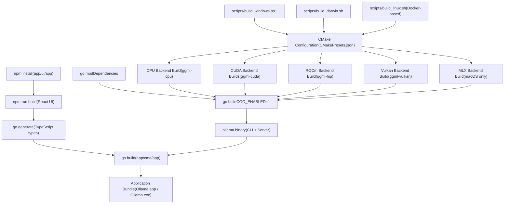
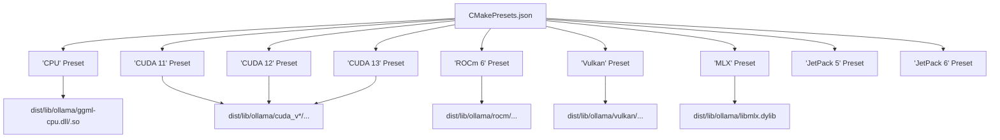
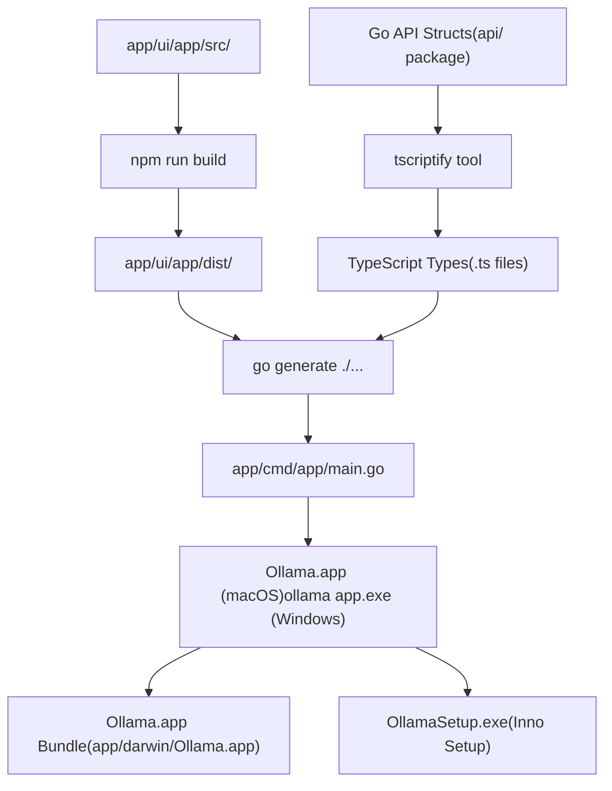
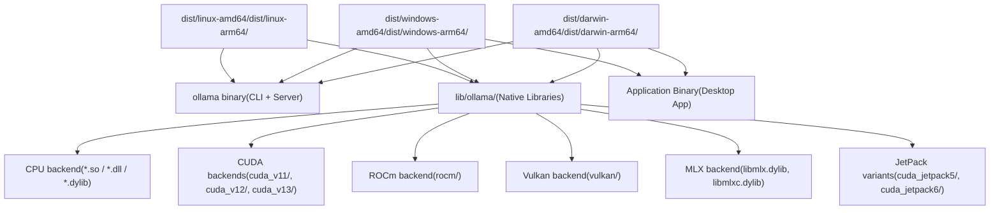
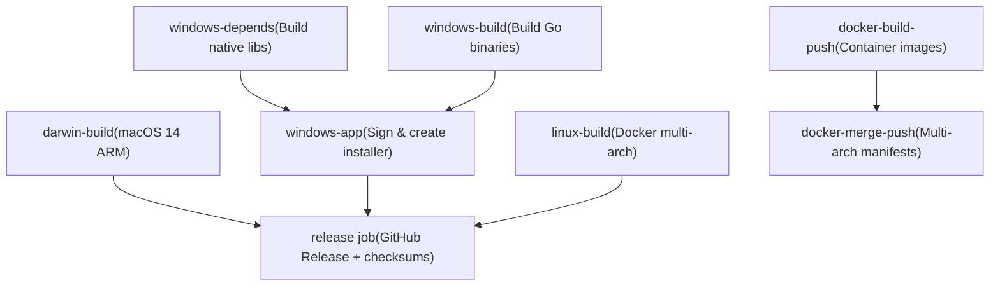

# Building from Source

Relevant source files

-   [.github/workflows/release.yaml](https://github.com/ollama/ollama/blob/562c76d7/.github/workflows/release.yaml)
-   [.github/workflows/test-install.yaml](https://github.com/ollama/ollama/blob/562c76d7/.github/workflows/test-install.yaml)
-   [.github/workflows/test.yaml](https://github.com/ollama/ollama/blob/562c76d7/.github/workflows/test.yaml)
-   [Dockerfile](https://github.com/ollama/ollama/blob/562c76d7/Dockerfile)
-   [README.md](https://github.com/ollama/ollama/blob/562c76d7/README.md?plain=1)
-   [app/ollama.iss](https://github.com/ollama/ollama/blob/562c76d7/app/ollama.iss)
-   [docs/README.md](https://github.com/ollama/ollama/blob/562c76d7/docs/README.md?plain=1)
-   [docs/api.md](https://github.com/ollama/ollama/blob/562c76d7/docs/api.md?plain=1)
-   [docs/development.md](https://github.com/ollama/ollama/blob/562c76d7/docs/development.md?plain=1)
-   [docs/images/ollama-keys.png](https://github.com/ollama/ollama/blob/562c76d7/docs/images/ollama-keys.png)
-   [docs/images/signup.png](https://github.com/ollama/ollama/blob/562c76d7/docs/images/signup.png)
-   [scripts/build\_darwin.sh](https://github.com/ollama/ollama/blob/562c76d7/scripts/build_darwin.sh)
-   [scripts/build\_linux.sh](https://github.com/ollama/ollama/blob/562c76d7/scripts/build_linux.sh)
-   [scripts/build\_windows.ps1](https://github.com/ollama/ollama/blob/562c76d7/scripts/build_windows.ps1)
-   [scripts/deduplicate\_cuda\_libs.sh](https://github.com/ollama/ollama/blob/562c76d7/scripts/deduplicate_cuda_libs.sh)
-   [scripts/install.ps1](https://github.com/ollama/ollama/blob/562c76d7/scripts/install.ps1)
-   [scripts/install.sh](https://github.com/ollama/ollama/blob/562c76d7/scripts/install.sh)

This page provides an overview of building Ollama from source code, including prerequisites, the high-level build process, and basic quick-start instructions for each platform. For detailed platform-specific build configurations and troubleshooting, see [Platform-Specific Build Details](/ollama/ollama/8.2-platform-specific-build-details).

Building Ollama from source involves compiling both native machine learning libraries (GGML backends) and Go application code. The build system supports multiple acceleration backends (CPU, CUDA, ROCm, Vulkan, Metal/MLX) and produces platform-specific binaries with optional desktop application bundling.

## Prerequisites Overview

Building Ollama requires a combination of system tools, compilers, and optional acceleration libraries depending on the target platform and desired GPU support.

### Core Requirements

| Tool | Purpose | All Platforms |
| --- | --- | --- |
| **Go** | Application compilation | Required (version from [go.mod1](https://github.com/ollama/ollama/blob/562c76d7/go.mod#L1-L1)) |
| **C/C++ Compiler** | Native library compilation | Required |
| **CMake** | Build system for native code | Required (except Windows ARM) |

### Platform-Specific Compilers

| Platform | Compiler Options | Notes |
| --- | --- | --- |
| **macOS** | Clang (built-in) | Xcode Command Line Tools |
| **Windows (amd64)** | TDM-GCC, llvm-mingw, MSVC | [scripts/build\_windows.ps178-82](https://github.com/ollama/ollama/blob/562c76d7/scripts/build_windows.ps1#L78-L82) requires clang for proper UTF-16 |
| **Windows (arm64)** | llvm-mingw | [scripts/build\_windows.ps1246-253](https://github.com/ollama/ollama/blob/562c76d7/scripts/build_windows.ps1#L246-L253) |
| **Linux** | GCC 10+ or Clang | [Dockerfile12-20](https://github.com/ollama/ollama/blob/562c76d7/Dockerfile#L12-L20) requires gcc-toolset-10 minimum |

### Optional GPU Acceleration Libraries

| Backend | Platforms | Install Source | Build Flag |
| --- | --- | --- | --- |
| **CUDA 11** | Windows, Linux (amd64) | [NVIDIA CUDA Toolkit](https://developer.nvidia.com/cuda-downloads) | `--preset "CUDA 11"` |
| **CUDA 12** | Windows, Linux (amd64/arm64) | NVIDIA CUDA Toolkit | `--preset "CUDA 12"` |
| **CUDA 13** | Windows, Linux (amd64/arm64) | NVIDIA CUDA Toolkit | `--preset "CUDA 13"` |
| **ROCm** | Windows, Linux (amd64) | [AMD ROCm](https://rocm.docs.amd.com/) | `--preset "ROCm 6"` |
| **Vulkan** | Windows, Linux | [LunarG Vulkan SDK](https://vulkan.lunarg.com/) | `--preset Vulkan` |
| **Metal/MLX** | macOS (Apple Silicon) | Built-in to macOS | `--preset MLX` |
| **JetPack 5** | Linux (arm64) | NVIDIA JetPack SDK | `--preset "JetPack 5"` |
| **JetPack 6** | Linux (arm64) | NVIDIA JetPack SDK | `--preset "JetPack 6"` |

### Desktop Application Requirements

Building the Electron-based desktop application requires additional tools:

-   **Node.js** and **npm** - For building the React UI ([scripts/build\_windows.ps1236-240](https://github.com/ollama/ollama/blob/562c76d7/scripts/build_windows.ps1#L236-L240))
-   **TypeScript** compiler (`tsc`) - For compiling TypeScript code
-   **tscriptify** - Go tool for generating TypeScript types ([scripts/build\_windows.ps1246-252](https://github.com/ollama/ollama/blob/562c76d7/scripts/build_windows.ps1#L246-L252))

**Sources:** [docs/development.md1-180](https://github.com/ollama/ollama/blob/562c76d7/docs/development.md?plain=1#L1-L180) [scripts/build\_windows.ps178-90](https://github.com/ollama/ollama/blob/562c76d7/scripts/build_windows.ps1#L78-L90) [scripts/build\_darwin.sh1-21](https://github.com/ollama/ollama/blob/562c76d7/scripts/build_darwin.sh#L1-L21) [Dockerfile12-46](https://github.com/ollama/ollama/blob/562c76d7/Dockerfile#L12-L46)

## Build Process Overview

The Ollama build process consists of three main phases: native library compilation, Go binary compilation, and optional desktop application bundling.


**Sources:** [CMakeLists.txt1](https://github.com/ollama/ollama/blob/562c76d7/CMakeLists.txt#L1-L1) [CMakePresets.json1](https://github.com/ollama/ollama/blob/562c76d7/CMakePresets.json#L1-L1) [scripts/build\_windows.ps192-375](https://github.com/ollama/ollama/blob/562c76d7/scripts/build_windows.ps1#L92-L375) [scripts/build\_darwin.sh42-214](https://github.com/ollama/ollama/blob/562c76d7/scripts/build_darwin.sh#L42-L214) [scripts/build\_linux.sh1-75](https://github.com/ollama/ollama/blob/562c76d7/scripts/build_linux.sh#L1-L75)

### Build Configuration System

The build system uses CMake presets to configure different backend builds. Each preset targets a specific acceleration backend:


**Sources:** [CMakePresets.json1](https://github.com/ollama/ollama/blob/562c76d7/CMakePresets.json#L1-L1) [scripts/build\_windows.ps193-223](https://github.com/ollama/ollama/blob/562c76d7/scripts/build_windows.ps1#L93-L223) [Dockerfile44-160](https://github.com/ollama/ollama/blob/562c76d7/Dockerfile#L44-L160)

## Quick Start by Platform

### macOS

For basic CPU-only build with Metal/MLX support (Apple Silicon):

```
# Simple development buildgo run . serve
```
For full build with all backends:

```
./scripts/build_darwin.sh
```
The macOS build script [scripts/build\_darwin.sh42-81](https://github.com/ollama/ollama/blob/562c76d7/scripts/build_darwin.sh#L42-L81) automatically builds:

-   CPU backend for both amd64 and arm64
-   MLX backend for Apple Silicon acceleration
-   Universal binary combining both architectures

**Sources:** [docs/development.md18-39](https://github.com/ollama/ollama/blob/562c76d7/docs/development.md?plain=1#L18-L39) [scripts/build\_darwin.sh1-231](https://github.com/ollama/ollama/blob/562c76d7/scripts/build_darwin.sh#L1-L231) [README.md245-262](https://github.com/ollama/ollama/blob/562c76d7/README.md?plain=1#L245-L262)

### Windows

For development build (CPU-only, no CMake needed on ARM):

```
go run . serve
```
For full build with all backends:

```
.\scripts\build_windows.ps1
```
The Windows build script [scripts/build\_windows.ps1356-375](https://github.com/ollama/ollama/blob/562c76d7/scripts/build_windows.ps1#L356-L375) builds all available backends by default:

-   CPU backend
-   CUDA 12 and 13 (if installed)
-   ROCm (if installed)
-   Vulkan (if VULKAN\_SDK set)
-   Desktop application
-   Inno Setup installer

**Sources:** [docs/development.md41-90](https://github.com/ollama/ollama/blob/562c76d7/docs/development.md?plain=1#L41-L90) [scripts/build\_windows.ps11-382](https://github.com/ollama/ollama/blob/562c76d7/scripts/build_windows.ps1#L1-L382) [README.md245-262](https://github.com/ollama/ollama/blob/562c76d7/README.md?plain=1#L245-L262)

### Linux

For development build:

```
go run . serve
```
For full Docker-based build:

```
./scripts/build_linux.sh
```
The Linux build uses Docker multi-stage builds ([Dockerfile1-214](https://github.com/ollama/ollama/blob/562c76d7/Dockerfile#L1-L214)) to produce:

-   CPU backend
-   CUDA 11, 12, 13 backends
-   ROCm backend (amd64 only)
-   JetPack 5 and 6 backends (arm64 only)
-   Vulkan backend
-   Compressed tar.zst archives for distribution

**Sources:** [docs/development.md92-125](https://github.com/ollama/ollama/blob/562c76d7/docs/development.md?plain=1#L92-L125) [scripts/build\_linux.sh1-75](https://github.com/ollama/ollama/blob/562c76d7/scripts/build_linux.sh#L1-L75) [Dockerfile1-214](https://github.com/ollama/ollama/blob/562c76d7/Dockerfile#L1-L214)

## Build Components

### Native Library Targets

The CMake build system produces different shared libraries for each backend:

| Target | CMake Target Name | Output Location | Platforms |
| --- | --- | --- | --- |
| CPU Backend | `ggml-cpu` | `lib/ollama/` | All |
| CUDA Backend | `ggml-cuda` | `lib/ollama/cuda_v*/` | Windows, Linux |
| ROCm Backend | `ggml-hip` | `lib/ollama/rocm/` | Windows (amd64), Linux (amd64) |
| Vulkan Backend | `ggml-vulkan` | `lib/ollama/vulkan/` | Windows, Linux |
| MLX Backend | `mlx`, `mlxc` | `lib/ollama/` | macOS |

Build commands follow this pattern:

```
# Configurecmake --preset "CUDA 12" # Build specific targetcmake --build --preset "CUDA 12" --target ggml-cuda --parallel # Install to distribution directorycmake --install build --component CUDA --strip
```
**Sources:** [scripts/build\_windows.ps193-223](https://github.com/ollama/ollama/blob/562c76d7/scripts/build_windows.ps1#L93-L223) [scripts/build\_darwin.sh42-81](https://github.com/ollama/ollama/blob/562c76d7/scripts/build_darwin.sh#L42-L81) [Dockerfile44-160](https://github.com/ollama/ollama/blob/562c76d7/Dockerfile#L44-L160)

### Go Binary Compilation

The Go binary is built with CGO enabled to link against the native libraries:

```
go build \  -trimpath \  -ldflags "-s -w -X=github.com/ollama/ollama/version.Version=$VERSION" \  .
```
Key build flags:

-   `CGO_ENABLED=1` - Required to link native libraries
-   `-trimpath` - Remove absolute paths from binary
-   `-ldflags="-s -w"` - Strip debug symbols
-   `-X=github.com/ollama/ollama/version.Version` - Embed version string
-   `-X=github.com/ollama/ollama/server.mode=release` - Set release mode

For macOS with MLX support, additional CGO flags are required ([scripts/build\_darwin.sh62-76](https://github.com/ollama/ollama/blob/562c76d7/scripts/build_darwin.sh#L62-L76)):

```
CGO_CFLAGS="-O3 -I$(pwd)/build/_deps/mlx-c-src -mmacosx-version-min=14.0"CGO_LDFLAGS="-lc++ -framework Metal -framework Foundation -framework Accelerate"go build -tags mlx -o dist/darwin-arm64/ollama .
```
**Sources:** [scripts/build\_windows.ps1225-231](https://github.com/ollama/ollama/blob/562c76d7/scripts/build_windows.ps1#L225-L231) [scripts/build\_darwin.sh62-81](https://github.com/ollama/ollama/blob/562c76d7/scripts/build_darwin.sh#L62-L81) [Dockerfile161-176](https://github.com/ollama/ollama/blob/562c76d7/Dockerfile#L161-L176) [.github/workflows/release.yaml16-26](https://github.com/ollama/ollama/blob/562c76d7/.github/workflows/release.yaml#L16-L26)

### Desktop Application Bundle

The desktop application consists of multiple components:


Build steps:

1.  Install npm dependencies: `npm install` in [app/ui/app](https://github.com/ollama/ollama/blob/562c76d7/app/ui/app)
2.  Build React UI: `npm run build` ([scripts/build\_windows.ps1261-266](https://github.com/ollama/ollama/blob/562c76d7/scripts/build_windows.ps1#L261-L266))
3.  Generate TypeScript types: `go generate ./...` ([scripts/build\_windows.ps1283](https://github.com/ollama/ollama/blob/562c76d7/scripts/build_windows.ps1#L283-L283))
4.  Build Go app binary: `go build ./app/cmd/app/` ([scripts/build\_windows.ps1285](https://github.com/ollama/ollama/blob/562c76d7/scripts/build_windows.ps1#L285-L285) [scripts/build\_darwin.sh134-138](https://github.com/ollama/ollama/blob/562c76d7/scripts/build_darwin.sh#L134-L138))
5.  Bundle for platform:
    -   **macOS**: Copy into `Ollama.app` bundle structure ([scripts/build\_darwin.sh127-148](https://github.com/ollama/ollama/blob/562c76d7/scripts/build_darwin.sh#L127-L148))
    -   **Windows**: Create Inno Setup installer ([scripts/build\_windows.ps1310-324](https://github.com/ollama/ollama/blob/562c76d7/scripts/build_windows.ps1#L310-L324))

**Sources:** [scripts/build\_windows.ps1233-287](https://github.com/ollama/ollama/blob/562c76d7/scripts/build_windows.ps1#L233-L287) [scripts/build\_darwin.sh107-214](https://github.com/ollama/ollama/blob/562c76d7/scripts/build_darwin.sh#L107-L214) [app/ollama.iss1-375](https://github.com/ollama/ollama/blob/562c76d7/app/ollama.iss#L1-L375)

## Build Artifacts Structure

The build process produces artifacts organized by platform in the `dist/` directory:


### Distribution Archives

Final distribution artifacts are created as compressed archives:

| Platform | Archive Format | Contents | Script |
| --- | --- | --- | --- |
| **macOS** | `.tgz` | Universal binary + libraries | [scripts/build\_darwin.sh101-105](https://github.com/ollama/ollama/blob/562c76d7/scripts/build_darwin.sh#L101-L105) |
| **macOS App** | `.dmg` | Signed/notarized application | [scripts/build\_darwin.sh190-210](https://github.com/ollama/ollama/blob/562c76d7/scripts/build_darwin.sh#L190-L210) |
| **Windows** | `.zip` | Binaries + libraries per arch | [scripts/build\_windows.ps1326-349](https://github.com/ollama/ollama/blob/562c76d7/scripts/build_windows.ps1#L326-L349) |
| **Windows Installer** | `OllamaSetup.exe` | Inno Setup installer | [app/ollama.iss1-375](https://github.com/ollama/ollama/blob/562c76d7/app/ollama.iss#L1-L375) |
| **Linux** | `.tar.zst` | Binaries + libraries | [scripts/build\_linux.sh59-74](https://github.com/ollama/ollama/blob/562c76d7/scripts/build_linux.sh#L59-L74) |

Linux creates separate archives for different variants ([scripts/build\_linux.sh61-74](https://github.com/ollama/ollama/blob/562c76d7/scripts/build_linux.sh#L61-L74)):

-   `ollama-linux-{arch}.tar.zst` - Base package with CPU and CUDA
-   `ollama-linux-amd64-rocm.tar.zst` - ROCm libraries
-   `ollama-linux-arm64-jetpack5.tar.zst` - JetPack 5 libraries
-   `ollama-linux-arm64-jetpack6.tar.zst` - JetPack 6 libraries

**Sources:** [scripts/build\_darwin.sh101-105](https://github.com/ollama/ollama/blob/562c76d7/scripts/build_darwin.sh#L101-L105) [scripts/build\_windows.ps1326-349](https://github.com/ollama/ollama/blob/562c76d7/scripts/build_windows.ps1#L326-L349) [scripts/build\_linux.sh59-74](https://github.com/ollama/ollama/blob/562c76d7/scripts/build_linux.sh#L59-L74) [.github/workflows/release.yaml375-407](https://github.com/ollama/ollama/blob/562c76d7/.github/workflows/release.yaml#L375-L407)

## Library Discovery at Runtime

After building, Ollama searches for acceleration libraries relative to the executable:

| Platform | Search Paths |
| --- | --- |
| **Windows** | `./lib/ollama` |
| **Linux** | `../lib/ollama` |
| **macOS** | `.` (current directory) |
| **Development** | `build/lib/ollama` |

This search order is documented in [docs/development.md170-180](https://github.com/ollama/ollama/blob/562c76d7/docs/development.md?plain=1#L170-L180) The desktop application bundles libraries into the application package structure for distribution.

**Sources:** [docs/development.md170-180](https://github.com/ollama/ollama/blob/562c76d7/docs/development.md?plain=1#L170-L180)

## CI/CD Build Pipeline

The GitHub Actions workflows automate the complete build and release process:

### Test Workflow

The test workflow [.github/workflows/test.yaml1-246](https://github.com/ollama/ollama/blob/562c76d7/.github/workflows/test.yaml#L1-L246) validates builds on pull requests:

-   Detects changes to native code ([.github/workflows/test.yaml40-41](https://github.com/ollama/ollama/blob/562c76d7/.github/workflows/test.yaml#L40-L41))
-   Builds CPU, CUDA, ROCm, and Vulkan variants
-   Runs Go tests: `go test ./...` ([.github/workflows/test.yaml232](https://github.com/ollama/ollama/blob/562c76d7/.github/workflows/test.yaml#L232-L232))
-   Verifies patches apply cleanly ([.github/workflows/test.yaml238-246](https://github.com/ollama/ollama/blob/562c76d7/.github/workflows/test.yaml#L238-L246))

### Release Workflow

The release workflow [.github/workflows/release.yaml1-550](https://github.com/ollama/ollama/blob/562c76d7/.github/workflows/release.yaml#L1-L550) produces signed release artifacts:


Key steps:

1.  **darwin-build** ([.github/workflows/release.yaml29-74](https://github.com/ollama/ollama/blob/562c76d7/.github/workflows/release.yaml#L29-L74)): Builds universal macOS binaries, signs with Apple credentials
2.  **windows-depends** ([.github/workflows/release.yaml75-212](https://github.com/ollama/ollama/blob/562c76d7/.github/workflows/release.yaml#L75-L212)): Builds CUDA, ROCm, Vulkan libraries
3.  **windows-build** ([.github/workflows/release.yaml213-286](https://github.com/ollama/ollama/blob/562c76d7/.github/workflows/release.yaml#L213-L286)): Builds Go binaries for amd64/arm64
4.  **windows-app** ([.github/workflows/release.yaml287-341](https://github.com/ollama/ollama/blob/562c76d7/.github/workflows/release.yaml#L287-L341)): Signs executables, creates installer
5.  **linux-build** ([.github/workflows/release.yaml342-407](https://github.com/ollama/ollama/blob/562c76d7/.github/workflows/release.yaml#L342-L407)): Docker-based multi-arch builds
6.  **docker-build-push** ([.github/workflows/release.yaml409-463](https://github.com/ollama/ollama/blob/562c76d7/.github/workflows/release.yaml#L409-L463)): Creates Docker images per arch/flavor
7.  **docker-merge-push** ([.github/workflows/release.yaml465-497](https://github.com/ollama/ollama/blob/562c76d7/.github/workflows/release.yaml#L465-L497)): Merges into multi-arch manifests
8.  **release** ([.github/workflows/release.yaml499-550](https://github.com/ollama/ollama/blob/562c76d7/.github/workflows/release.yaml#L499-L550)): Uploads artifacts to GitHub Release

**Sources:** [.github/workflows/test.yaml1-246](https://github.com/ollama/ollama/blob/562c76d7/.github/workflows/test.yaml#L1-L246) [.github/workflows/release.yaml1-550](https://github.com/ollama/ollama/blob/562c76d7/.github/workflows/release.yaml#L1-L550)

## Next Steps

For detailed platform-specific build instructions including:

-   Exact compiler versions and installation steps
-   Platform-specific compilation flags
-   Troubleshooting common build issues
-   Cross-compilation configuration
-   Optimization flags and build tuning

See [Platform-Specific Build Details](/ollama/ollama/8.2-platform-specific-build-details).

For information about testing the build, see [Testing and Quality Assurance](/ollama/ollama/8.3-testing-and-quality-assurance).

For developing the desktop application with hot-reloading, see [Desktop Application Development](/ollama/ollama/8.4-desktop-application-development).

**Sources:** [docs/development.md1-180](https://github.com/ollama/ollama/blob/562c76d7/docs/development.md?plain=1#L1-L180) [README.md245-262](https://github.com/ollama/ollama/blob/562c76d7/README.md?plain=1#L245-L262)
