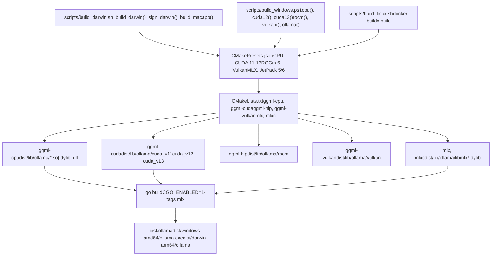
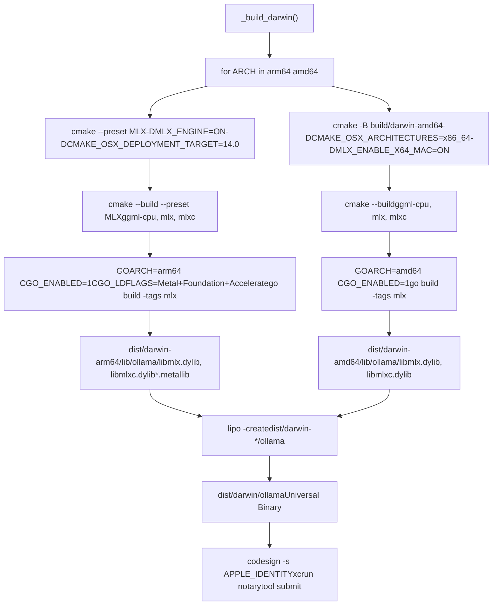
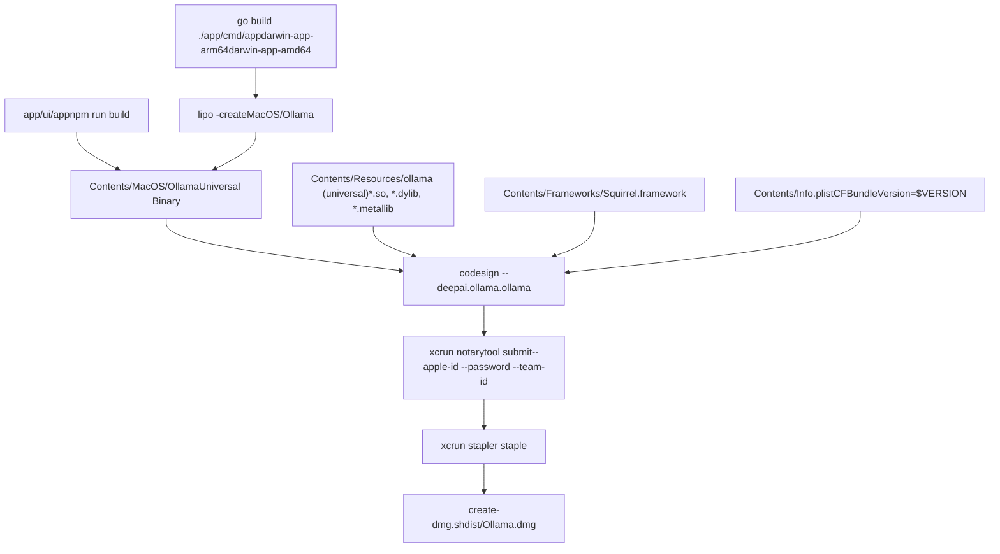
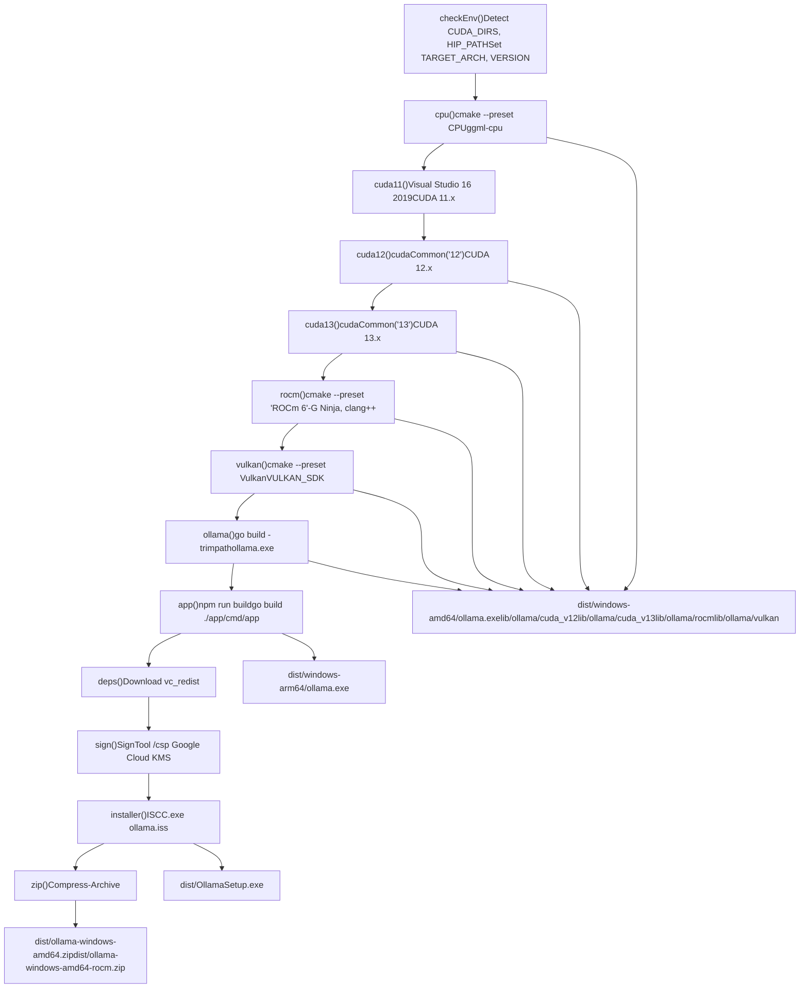
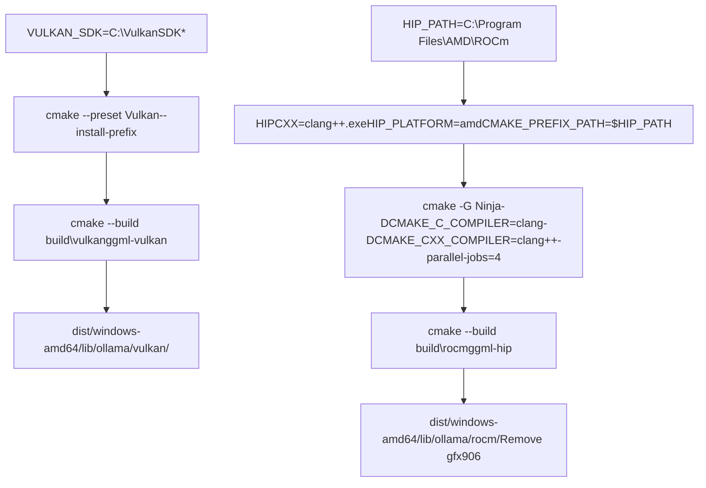
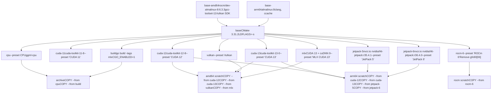
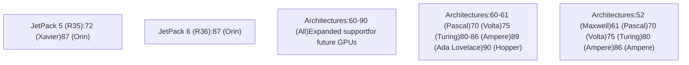
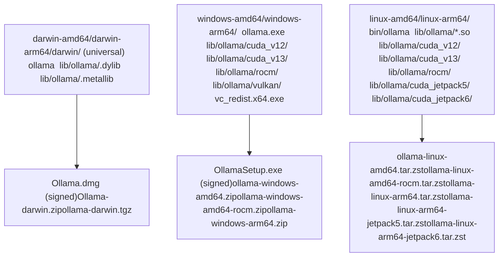
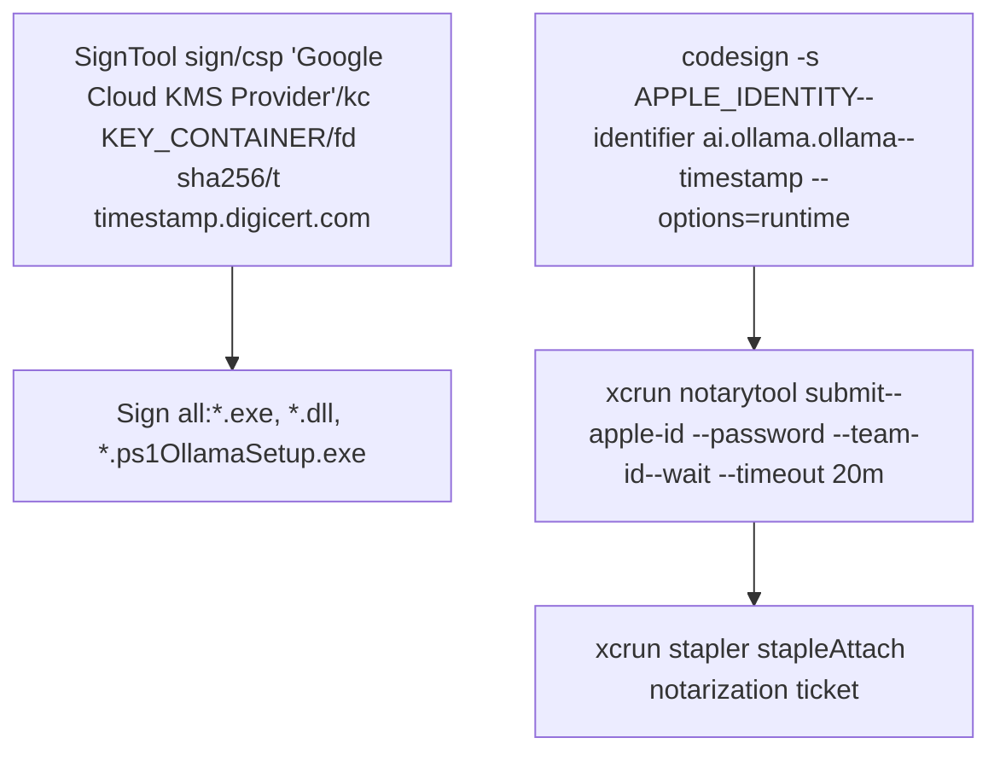

# Platform-Specific Build Details

Relevant source files

-   [.github/workflows/release.yaml](https://github.com/ollama/ollama/blob/562c76d7/.github/workflows/release.yaml)
-   [.github/workflows/test-install.yaml](https://github.com/ollama/ollama/blob/562c76d7/.github/workflows/test-install.yaml)
-   [.github/workflows/test.yaml](https://github.com/ollama/ollama/blob/562c76d7/.github/workflows/test.yaml)
-   [Dockerfile](https://github.com/ollama/ollama/blob/562c76d7/Dockerfile)
-   [app/ollama.iss](https://github.com/ollama/ollama/blob/562c76d7/app/ollama.iss)
-   [scripts/build\_darwin.sh](https://github.com/ollama/ollama/blob/562c76d7/scripts/build_darwin.sh)
-   [scripts/build\_linux.sh](https://github.com/ollama/ollama/blob/562c76d7/scripts/build_linux.sh)
-   [scripts/build\_windows.ps1](https://github.com/ollama/ollama/blob/562c76d7/scripts/build_windows.ps1)
-   [scripts/deduplicate\_cuda\_libs.sh](https://github.com/ollama/ollama/blob/562c76d7/scripts/deduplicate_cuda_libs.sh)
-   [scripts/install.ps1](https://github.com/ollama/ollama/blob/562c76d7/scripts/install.ps1)
-   [scripts/install.sh](https://github.com/ollama/ollama/blob/562c76d7/scripts/install.sh)

This page documents the platform-specific build configurations, scripts, and workflows used to compile Ollama across macOS, Windows, and Linux. It covers CMake presets, toolchain requirements, GPU library compilation, and packaging processes for each platform.

For general build instructions and prerequisites, see [Building from Source](/ollama/ollama/8.1-building-from-source). For information about the release process and artifact distribution, see [Release Process](/ollama/ollama/8.6-release-process).

## Build System Overview

Ollama uses a multi-layered build system that produces platform-specific binaries and GPU-accelerated libraries. The build process is coordinated through platform-specific scripts that invoke CMake with predefined presets for different GPU backends.

**Sources:** [.github/workflows/release.yaml1-554](https://github.com/ollama/ollama/blob/562c76d7/.github/workflows/release.yaml#L1-L554) [scripts/build\_darwin.sh1-231](https://github.com/ollama/ollama/blob/562c76d7/scripts/build_darwin.sh#L1-L231) [scripts/build\_windows.ps11-398](https://github.com/ollama/ollama/blob/562c76d7/scripts/build_windows.ps1#L1-L398) [Dockerfile1-211](https://github.com/ollama/ollama/blob/562c76d7/Dockerfile#L1-L211)

## macOS Build Process

The macOS build is handled by `scripts/build_darwin.sh`, which creates universal binaries supporting both Intel (amd64) and Apple Silicon (arm64) architectures.

### Architecture-Specific Build Flow

**Sources:** [scripts/build\_darwin.sh42-81](https://github.com/ollama/ollama/blob/562c76d7/scripts/build_darwin.sh#L42-L81) [scripts/build\_darwin.sh83-105](https://github.com/ollama/ollama/blob/562c76d7/scripts/build_darwin.sh#L83-L105)

### macOS Build Configuration

The macOS build uses specific compiler flags and deployment targets:

| Variable | arm64 Value | amd64 Value |
| --- | --- | --- |
| `CMAKE_OSX_ARCHITECTURES` | arm64 (default) | x86\_64 |
| `CMAKE_OSX_DEPLOYMENT_TARGET` | 14.0 | 14.0 |
| `CGO_CFLAGS` | `-O3 -I.../mlx-c-src -mmacosx-version-min=14.0` | Same |
| `CGO_LDFLAGS` (arm64) | `-lc++ -framework Metal -framework Foundation -framework Accelerate` | N/A |
| `CGO_LDFLAGS` (amd64) | N/A | `-ldl -lc++ -framework Accelerate` |
| `DMLX_ENABLE_X64_MAC` | OFF | ON |

**Sources:** [scripts/build\_darwin.sh17-19](https://github.com/ollama/ollama/blob/562c76d7/scripts/build_darwin.sh#L17-L19) [scripts/build\_darwin.sh62-74](https://github.com/ollama/ollama/blob/562c76d7/scripts/build_darwin.sh#L62-L74) [.github/workflows/release.yaml42-44](https://github.com/ollama/ollama/blob/562c76d7/.github/workflows/release.yaml#L42-L44)

### macOS App Bundle Creation

The `_build_macapp` function creates the `Ollama.app` bundle with embedded resources:

**Sources:** [scripts/build\_darwin.sh107-214](https://github.com/ollama/ollama/blob/562c76d7/scripts/build_darwin.sh#L107-L214) [.github/workflows/release.yaml29-73](https://github.com/ollama/ollama/blob/562c76d7/.github/workflows/release.yaml#L29-L73)

## Windows Build Process

Windows builds are orchestrated by `scripts/build_windows.ps1`, which supports multiple GPU backends and architecture targets.

### Windows Build Functions

The build script defines separate functions for each build component:

**Sources:** [scripts/build\_windows.ps199-365](https://github.com/ollama/ollama/blob/562c76d7/scripts/build_windows.ps1#L99-L365) [scripts/build\_windows.ps1373-391](https://github.com/ollama/ollama/blob/562c76d7/scripts/build_windows.ps1#L373-L391)

### Windows CUDA Build Configuration

CUDA builds on Windows require specific Visual Studio and CUDA toolkit versions:

| CUDA Version | Preset Name | Visual Studio | Required Components |
| --- | --- | --- | --- |
| 11.x | `CUDA 11` | VS 2019 | cudart, nvcc, cublas, cublas\_dev |
| 12.x | `CUDA 12` | VS 2022 | cudart, nvcc, cublas, cublas\_dev |
| 13.x | `CUDA 13` | VS 2022 | cudart, nvcc, cublas, cublas\_dev, crt, nvvm, nvptxcompiler |

The CUDA 11 build explicitly uses Visual Studio 2019 due to compatibility issues with newer MSVC versions:

**Sources:** [scripts/build\_windows.ps1114-145](https://github.com/ollama/ollama/blob/562c76d7/scripts/build_windows.ps1#L114-L145) [.github/workflows/release.yaml85-106](https://github.com/ollama/ollama/blob/562c76d7/.github/workflows/release.yaml#L85-L106)

### Windows ROCm and Vulkan Builds

ROCm and Vulkan builds use Clang instead of MSVC:

**Sources:** [scripts/build\_windows.ps1184-215](https://github.com/ollama/ollama/blob/562c76d7/scripts/build_windows.ps1#L184-L215) [scripts/build\_windows.ps1217-229](https://github.com/ollama/ollama/blob/562c76d7/scripts/build_windows.ps1#L217-L229) [.github/workflows/release.yaml109-119](https://github.com/ollama/ollama/blob/562c76d7/.github/workflows/release.yaml#L109-L119)

### Windows Code Signing

Windows binaries are signed using Google Cloud KMS:

**Sources:** [scripts/build\_windows.ps1304-324](https://github.com/ollama/ollama/blob/562c76d7/scripts/build_windows.ps1#L304-L324) [.github/workflows/release.yaml294-341](https://github.com/ollama/ollama/blob/562c76d7/.github/workflows/release.yaml#L294-L341)

## Linux Build Process

Linux builds use Docker multi-stage builds defined in the `Dockerfile`, supporting CPU, CUDA (11, 12, 13), ROCm, Vulkan, JetPack (ARM), and MLX backends.

### Docker Multi-Stage Build Architecture

**Sources:** [Dockerfile1-211](https://github.com/ollama/ollama/blob/562c76d7/Dockerfile#L1-L211) [.github/workflows/release.yaml343-408](https://github.com/ollama/ollama/blob/562c76d7/.github/workflows/release.yaml#L343-L408)

### Linux Build Invocation

The `scripts/build_linux.sh` wrapper script invokes Docker buildx:

**Sources:** [scripts/build\_linux.sh1-75](https://github.com/ollama/ollama/blob/562c76d7/scripts/build_linux.sh#L1-L75)

### CUDA Library Deduplication

Linux builds deduplicate shared CUDA libraries between MLX and CUDA directories:

**Sources:** [scripts/deduplicate\_cuda\_libs.sh1-61](https://github.com/ollama/ollama/blob/562c76d7/scripts/deduplicate_cuda_libs.sh#L1-L61) [.github/workflows/release.yaml376-378](https://github.com/ollama/ollama/blob/562c76d7/.github/workflows/release.yaml#L376-L378)

## CMake Presets Configuration

All platforms use CMake presets defined in `CMakePresets.json`. Each preset specifies the build configuration, compiler flags, and backend-specific settings.

### Preset Matrix

**Sources:** [Dockerfile46-60](https://github.com/ollama/ollama/blob/562c76d7/Dockerfile#L46-L60) [Dockerfile62-86](https://github.com/ollama/ollama/blob/562c76d7/Dockerfile#L62-L86) [.github/workflows/test.yaml49-62](https://github.com/ollama/ollama/blob/562c76d7/.github/workflows/test.yaml#L49-L62)

### Build Components and Install Targets

Each preset builds specific components with corresponding install components:

| Preset | Build Target | Install Component | Output Path |
| --- | --- | --- | --- |
| CPU | `ggml-cpu` | CPU | \`lib/ollama/\*.so |
| CUDA 11-13 | `ggml-cuda` | CUDA | `lib/ollama/cuda_v11` through `cuda_v13` |
| ROCm 6 | `ggml-hip` | HIP | `lib/ollama/rocm` |
| Vulkan | `ggml-vulkan` | Vulkan | `lib/ollama/vulkan` |
| MLX | `mlx`, `mlxc` | MLX | `lib/ollama/libmlx.dylib`, `libmlxc.dylib` |
| JetPack 5/6 | `ggml-cuda` | CUDA | `lib/ollama/cuda_jetpack5`, `cuda_jetpack6` |

**Sources:** [Dockerfile43-61](https://github.com/ollama/ollama/blob/562c76d7/Dockerfile#L43-L61) [Dockerfile88-97](https://github.com/ollama/ollama/blob/562c76d7/Dockerfile#L88-L97) [scripts/build\_windows.ps1105-110](https://github.com/ollama/ollama/blob/562c76d7/scripts/build_windows.ps1#L105-L110)

## GPU Library Compilation Details

### CUDA Architecture Targets

Different CUDA versions support different GPU architectures:

**Sources:** [.github/workflows/release.yaml85-106](https://github.com/ollama/ollama/blob/562c76d7/.github/workflows/release.yaml#L85-L106) [Dockerfile99-122](https://github.com/ollama/ollama/blob/562c76d7/Dockerfile#L99-L122)

### ROCm GPU Architecture Targets

ROCm builds target specific AMD GPU architectures:

**Sources:** [Dockerfile88-97](https://github.com/ollama/ollama/blob/562c76d7/Dockerfile#L88-L97) [.github/workflows/test.yaml53-56](https://github.com/ollama/ollama/blob/562c76d7/.github/workflows/test.yaml#L53-L56) [scripts/build\_windows.ps1196-210](https://github.com/ollama/ollama/blob/562c76d7/scripts/build_windows.ps1#L196-L210)

### Vulkan SDK Integration

Vulkan builds require the LunarG Vulkan SDK:

| Platform | SDK Version | Installation Method |
| --- | --- | --- |
| Linux (amd64) | 1.4.321.1 | Downloaded and built from source in Dockerfile |
| Windows | 1.4.321.1 | Downloaded installer, cached in CI |
| Linux (test) | 1.4.313 | Installed from LunarG apt repository |

**Sources:** [Dockerfile16-25](https://github.com/ollama/ollama/blob/562c76d7/Dockerfile#L16-L25) [.github/workflows/release.yaml117-118](https://github.com/ollama/ollama/blob/562c76d7/.github/workflows/release.yaml#L117-L118) [.github/workflows/test.yaml70-82](https://github.com/ollama/ollama/blob/562c76d7/.github/workflows/test.yaml#L70-L82)

### MLX Backend Compilation

The MLX backend (macOS and Linux amd64 only) requires additional dependencies:

**Sources:** [Dockerfile131-155](https://github.com/ollama/ollama/blob/562c76d7/Dockerfile#L131-L155) [scripts/build\_darwin.sh54-74](https://github.com/ollama/ollama/blob/562c76d7/scripts/build_darwin.sh#L54-L74)

## Cross-Compilation and Universal Binaries

### macOS Universal Binary Creation

The `lipo` tool combines architecture-specific binaries:

**Sources:** [scripts/build\_darwin.sh84-99](https://github.com/ollama/ollama/blob/562c76d7/scripts/build_darwin.sh#L84-L99) [scripts/build\_darwin.sh156-167](https://github.com/ollama/ollama/blob/562c76d7/scripts/build_darwin.sh#L156-L167)

### Windows ARM64 Cross-Compilation

Windows ARM64 builds use llvm-mingw for cross-compilation on x64 hosts:

**Sources:** [.github/workflows/release.yaml232-253](https://github.com/ollama/ollama/blob/562c76d7/.github/workflows/release.yaml#L232-L253) [scripts/build\_windows.ps112-24](https://github.com/ollama/ollama/blob/562c76d7/scripts/build_windows.ps1#L12-L24)

### Linux Multi-Architecture Builds

Linux uses Docker buildx for native or emulated multi-architecture builds:

**Sources:** [.github/workflows/release.yaml410-464](https://github.com/ollama/ollama/blob/562c76d7/.github/workflows/release.yaml#L410-L464) [scripts/build\_linux.sh28-49](https://github.com/ollama/ollama/blob/562c76d7/scripts/build_linux.sh#L28-L49)

## Build Artifacts and Packaging

### Output Directory Structure

Each platform produces a consistent directory structure:

**Sources:** [.github/workflows/release.yaml515-523](https://github.com/ollama/ollama/blob/562c76d7/.github/workflows/release.yaml#L515-L523) [.github/workflows/release.yaml379-407](https://github.com/ollama/ollama/blob/562c76d7/.github/workflows/release.yaml#L379-L407)

### Tarball and Archive Creation

Linux and macOS create compressed archives with specific content filters:

**Sources:** [scripts/build\_linux.sh59-74](https://github.com/ollama/ollama/blob/562c76d7/scripts/build_linux.sh#L59-L74) [scripts/build\_darwin.sh101-104](https://github.com/ollama/ollama/blob/562c76d7/scripts/build_darwin.sh#L101-L104) [scripts/build\_windows.ps1342-365](https://github.com/ollama/ollama/blob/562c76d7/scripts/build_windows.ps1#L342-L365)

### Installer Generation

Platform-specific installers are created from the build artifacts:

| Platform | Installer Tool | Configuration | Output |
| --- | --- | --- | --- |
| macOS | `create-dmg.sh` | Background image, icon positioning | `Ollama.dmg` |
| Windows | Inno Setup (`ISCC.exe`) | `app/ollama.iss` | `OllamaSetup.exe` |
| Linux | N/A | Direct tarball distribution | `*.tar.zst` |

**Sources:** [scripts/build\_darwin.sh192-210](https://github.com/ollama/ollama/blob/562c76d7/scripts/build_darwin.sh#L192-L210) [scripts/build\_windows.ps1326-340](https://github.com/ollama/ollama/blob/562c76d7/scripts/build_windows.ps1#L326-L340) [app/ollama.iss1-375](https://github.com/ollama/ollama/blob/562c76d7/app/ollama.iss#L1-L375)

### Code Signing and Notarization

macOS and Windows binaries require signing for distribution:

**Sources:** [scripts/build\_darwin.sh89-98](https://github.com/ollama/ollama/blob/562c76d7/scripts/build_darwin.sh#L89-L98) [scripts/build\_darwin.sh184-210](https://github.com/ollama/ollama/blob/562c76d7/scripts/build_darwin.sh#L184-L210) [scripts/build\_windows.ps1309-323](https://github.com/ollama/ollama/blob/562c76d7/scripts/build_windows.ps1#L309-L323) [.github/workflows/release.yaml295-341](https://github.com/ollama/ollama/blob/562c76d7/.github/workflows/release.yaml#L295-L341)

## Environment Variables and Build Flags

### Common Build Environment Variables

| Variable | Purpose | Example Value |
| --- | --- | --- |
| `GOFLAGS` | Go linker flags for version/mode | `'-ldflags=-w -s "-X=...Version=0.5.7"'` |
| `CGO_ENABLED` | Enable CGo for native libraries | `1` |
| `CGO_CFLAGS` | C compiler optimization flags | `-O3` (release), `-mmacosx-version-min=14.0` (macOS) |
| `CGO_CXXFLAGS` | C++ compiler flags | `-O3` |
| `VERSION` | Ollama version string | `0.5.7` (from git tag) |
| `PKG_VERSION` | Package version (major.minor.patch) | `0.5.7` |

**Sources:** [.github/workflows/release.yaml8-27](https://github.com/ollama/ollama/blob/562c76d7/.github/workflows/release.yaml#L8-L27) [scripts/build\_darwin.sh15-19](https://github.com/ollama/ollama/blob/562c76d7/scripts/build_darwin.sh#L15-L19) [scripts/build\_windows.ps159-81](https://github.com/ollama/ollama/blob/562c76d7/scripts/build_windows.ps1#L59-L81)

### Platform-Specific Environment Variables

**macOS:**

-   `APPLE_IDENTITY`, `APPLE_ID`, `APPLE_PASSWORD`, `APPLE_TEAM_ID`: Code signing credentials
-   `MACOS_SIGNING_KEY`, `MACOS_SIGNING_KEY_PASSWORD`: Certificate credentials

**Windows:**

-   `KEY_CONTAINER`: Google Cloud KMS key for code signing
-   `VULKAN_SDK`: Path to Vulkan SDK installation
-   `CUDAToolkit_ROOT`: Path to CUDA installation
-   `HIP_PATH`, `HIPCXX`, `HIP_PLATFORM`, `CMAKE_PREFIX_PATH`: ROCm configuration

**Linux (Docker):**

-   `FLAVOR`: Build flavor (`rocm` for AMD GPU build)
-   `PARALLEL`: Number of parallel build jobs

**Sources:** [.github/workflows/release.yaml36-44](https://github.com/ollama/ollama/blob/562c76d7/.github/workflows/release.yaml#L36-L44) [.github/workflows/release.yaml161-165](https://github.com/ollama/ollama/blob/562c76d7/.github/workflows/release.yaml#L161-L165) [Dockerfile3-4](https://github.com/ollama/ollama/blob/562c76d7/Dockerfile#L3-L4)

### Compiler Toolchain Detection

Each platform detects available compilers and SDKs:

**Sources:** [scripts/build\_windows.ps128-55](https://github.com/ollama/ollama/blob/562c76d7/scripts/build_windows.ps1#L28-L55) [.github/workflows/release.yaml125-177](https://github.com/ollama/ollama/blob/562c76d7/.github/workflows/release.yaml#L125-L177)
