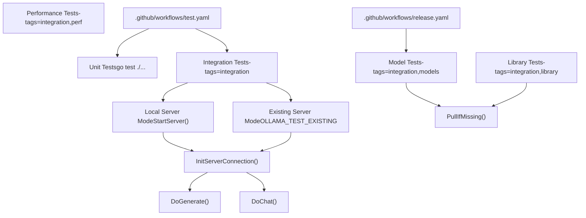
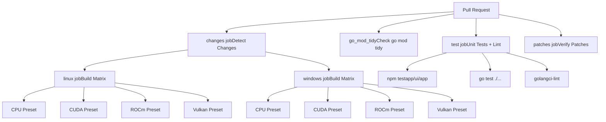
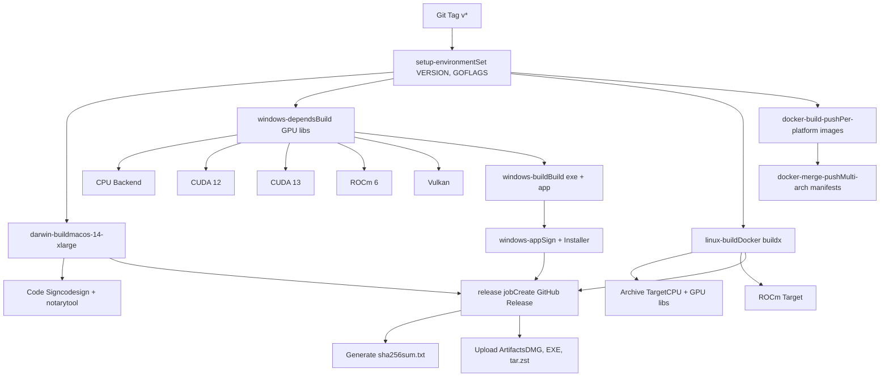
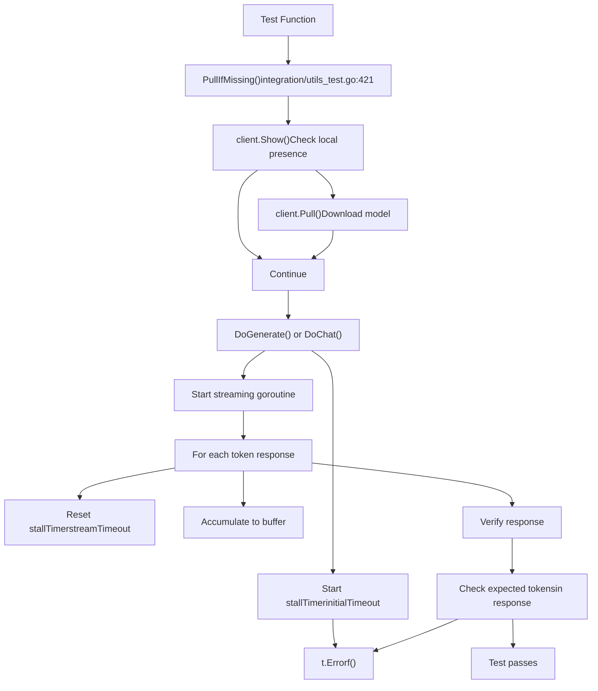
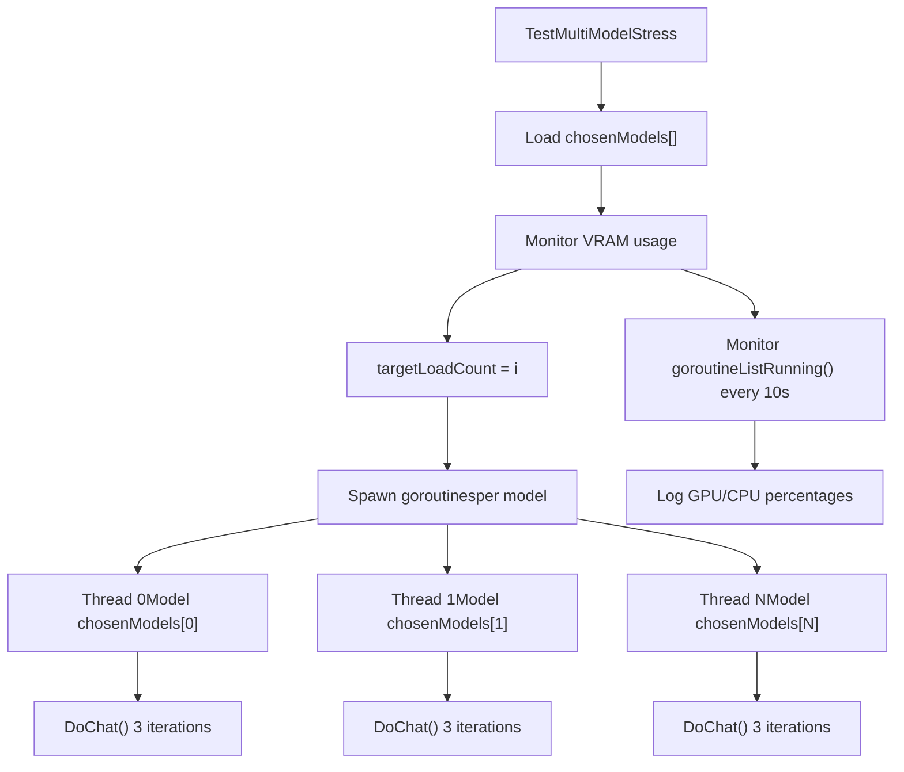
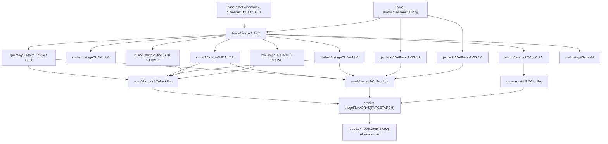
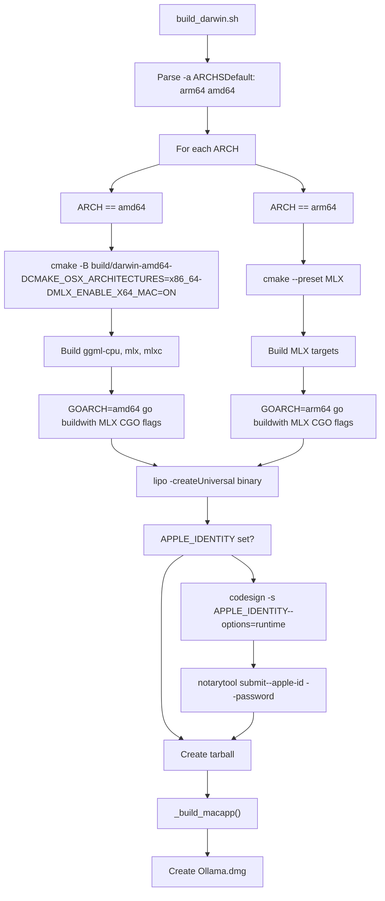

# Testing and Quality Assurance

Relevant source files

-   [api/types\_test.go](https://github.com/ollama/ollama/blob/562c76d7/api/types_test.go)
-   [api/types\_typescript\_test.go](https://github.com/ollama/ollama/blob/562c76d7/api/types_typescript_test.go)
-   [cmd/cmd\_test.go](https://github.com/ollama/ollama/blob/562c76d7/cmd/cmd_test.go)
-   [middleware/openai.go](https://github.com/ollama/ollama/blob/562c76d7/middleware/openai.go)
-   [middleware/openai\_test.go](https://github.com/ollama/ollama/blob/562c76d7/middleware/openai_test.go)
-   [openai/openai.go](https://github.com/ollama/ollama/blob/562c76d7/openai/openai.go)
-   [openai/openai\_test.go](https://github.com/ollama/ollama/blob/562c76d7/openai/openai_test.go)
-   [openai/responses.go](https://github.com/ollama/ollama/blob/562c76d7/openai/responses.go)
-   [openai/responses\_test.go](https://github.com/ollama/ollama/blob/562c76d7/openai/responses_test.go)
-   [server/create.go](https://github.com/ollama/ollama/blob/562c76d7/server/create.go)
-   [server/model.go](https://github.com/ollama/ollama/blob/562c76d7/server/model.go)
-   [server/routes\_create\_test.go](https://github.com/ollama/ollama/blob/562c76d7/server/routes_create_test.go)
-   [server/routes\_delete\_test.go](https://github.com/ollama/ollama/blob/562c76d7/server/routes_delete_test.go)
-   [server/routes\_generate\_test.go](https://github.com/ollama/ollama/blob/562c76d7/server/routes_generate_test.go)
-   [server/routes\_list\_test.go](https://github.com/ollama/ollama/blob/562c76d7/server/routes_list_test.go)
-   [server/routes\_test.go](https://github.com/ollama/ollama/blob/562c76d7/server/routes_test.go)
-   [tools/tools.go](https://github.com/ollama/ollama/blob/562c76d7/tools/tools.go)
-   [tools/tools\_test.go](https://github.com/ollama/ollama/blob/562c76d7/tools/tools_test.go)

This document covers Ollama's testing infrastructure, continuous integration workflows, and quality assurance processes. It details the test categories, integration test framework, CI/CD pipelines, and build verification procedures that ensure code quality and compatibility across multiple platforms and GPU backends.

For information about building from source, see [Building from Source](/ollama/ollama/8.1-building-from-source). For platform-specific build details, see [Platform-Specific Build Details](/ollama/ollama/8.2-platform-specific-build-details).

## Test Infrastructure Overview

Ollama's testing strategy combines unit tests, integration tests, and multi-platform build verification through GitHub Actions. The test suite validates model inference, concurrent operations, hardware compatibility, and end-to-end functionality across diverse configurations.


**Sources:** [integration/README.md1-17](https://github.com/ollama/ollama/blob/562c76d7/integration/README.md?plain=1#L1-L17) [integration/utils\_test.go1-810](https://github.com/ollama/ollama/blob/562c76d7/integration/utils_test.go#L1-L810)

## GitHub Actions CI/CD Pipeline

### Test Workflow

The `test.yaml` workflow runs on every pull request and validates code changes across multiple dimensions:

| Check | Purpose | Platforms |
| --- | --- | --- |
| `go_mod_tidy` | Verify `go.mod` is clean | ubuntu-latest |
| `test` | Run unit tests and linters | ubuntu-latest, macos-latest, windows-latest |
| `patches` | Verify patches apply cleanly | ubuntu-latest |
| `linux`, `windows` | Build GPU backends | Multiple presets (CPU, CUDA, ROCm, Vulkan) |


**Sources:** [.github/workflows/test.yaml1-246](https://github.com/ollama/ollama/blob/562c76d7/.github/workflows/test.yaml#L1-L246)

#### Build Matrix Configuration

The test workflow uses matrix builds to verify GPU backend compilation across different configurations:

**Linux Matrix:**

```
- preset: CPU- preset: CUDA (container: nvidia/cuda:13.0.0-devel-ubuntu22.04)- preset: ROCm (container: rocm/dev-ubuntu-22.04:6.1.2)- preset: Vulkan (container: ubuntu:22.04)
```
**Windows Matrix:**

```
- preset: CPU- preset: CUDA (install CUDA 13.0)- preset: ROCm (install AMD ROCm)- preset: Vulkan (install Vulkan SDK)
```
**Sources:** [.github/workflows/test.yaml46-117](https://github.com/ollama/ollama/blob/562c76d7/.github/workflows/test.yaml#L46-L117)

### Release Workflow

The `release.yaml` workflow orchestrates multi-platform builds, code signing, and artifact publication when tags are pushed:


**Sources:** [.github/workflows/release.yaml1-550](https://github.com/ollama/ollama/blob/562c76d7/.github/workflows/release.yaml#L1-L550)

#### Release Build Jobs

| Job | Runner | Outputs |
| --- | --- | --- |
| `darwin-build` | macos-14-xlarge | `ollama-darwin.tgz`, `Ollama.dmg` |
| `windows-depends` | windows (matrix) | GPU backend libraries per preset |
| `windows-build` | windows (matrix) | `windows-{arch}/ollama.exe`, `windows-ollama-app-{arch}.exe` |
| `windows-app` | windows | Signed `OllamaSetup.exe`, `ollama-windows-{arch}.zip` |
| `linux-build` | linux (matrix) | `ollama-linux-{arch}.tar.zst`, `ollama-linux-{arch}-rocm.tar.zst` |
| `docker-build-push` | per-platform | Docker image digests |
| `docker-merge-push` | linux | Multi-arch manifest tags |

**Sources:** [.github/workflows/release.yaml29-496](https://github.com/ollama/ollama/blob/562c76d7/.github/workflows/release.yaml#L29-L496)

## Integration Test Framework

### Test Server Lifecycle

The integration tests manage an Ollama server instance for testing, with two operational modes:

> **[Mermaid sequence]**
> *(图表结构无法解析)*

**Sources:** [integration/utils\_test.go362-538](https://github.com/ollama/ollama/blob/562c76d7/integration/utils_test.go#L362-L538)

### Core Test Utilities

The test framework provides helper functions to simplify integration testing:

| Function | Purpose | Key Parameters |
| --- | --- | --- |
| `InitServerConnection()` | Start or connect to server | `ctx`, `*testing.T` |
| `PullIfMissing()` | Ensure model is downloaded | `ctx`, `*api.Client`, `modelName` |
| `DoGenerate()` | Execute and validate generate request | `ctx`, `*testing.T`, `*api.Client`, `api.GenerateRequest`, `expectedTokens[]`, timeouts |
| `DoChat()` | Execute and validate chat request | `ctx`, `*testing.T`, `*api.Client`, `api.ChatRequest`, `expectedTokens[]`, timeouts |
| `GetTestEndpoint()` | Parse OLLAMA\_HOST environment | Returns `*api.Client`, `endpoint` |
| `FindPort()` | Allocate random ephemeral port | Returns port string |

**Sources:** [integration/utils\_test.go311-721](https://github.com/ollama/ollama/blob/562c76d7/integration/utils_test.go#L311-L721)

### Request Validation Pattern


**Sources:** [integration/utils\_test.go549-721](https://github.com/ollama/ollama/blob/562c76d7/integration/utils_test.go#L549-L721)

## Test Categories

### Basic Functionality Tests

Located in `integration/basic_test.go`, these tests validate core inference capabilities:

| Test | Model | Purpose |
| --- | --- | --- |
| `TestBlueSky` | `llama3.2:1b` | Verify basic factual responses |
| `TestUnicode` | `deepseek-coder-v2:16b-lite-instruct-q2_K` | Unicode tokenization torture test |
| `TestExtendedUnicodeOutput` | `gemma2:2b` | Emoji output validation |
| `TestUnicodeModelDir` | `llama3.2:1b` | UTF-16 path handling (Windows) |
| `TestNumPredict` | `qwen3:0.6b` | Exact token count verification |

**Sources:** [integration/basic\_test.go1-191](https://github.com/ollama/ollama/blob/562c76d7/integration/basic_test.go#L1-L191)

### Concurrency Tests

Located in `integration/concurrency_test.go`:

**TestConcurrentChat:**

-   Sends `OLLAMA_NUM_PARALLEL + 1` concurrent chat requests
-   Validates scheduler handles parallel load
-   Each thread runs `iterLimit * len(requests)` iterations
-   Timeout management: soft (8min) and hard (10min) limits

**TestMultiModelStress:**

-   Loads multiple models to exceed VRAM capacity
-   Forces scheduler to unload/reload models
-   Monitors GPU/CPU split with `ListRunning()` API
-   Validates thrashing behavior under memory pressure


**Sources:** [integration/concurrency\_test.go1-217](https://github.com/ollama/ollama/blob/562c76d7/integration/concurrency_test.go#L1-L217)

### Context and History Tests

Located in `integration/context_test.go`:

| Test | Focus | Configuration |
| --- | --- | --- |
| `TestLongInputContext` | Large prompt handling | `num_ctx: 128`, `OLLAMA_NUM_PARALLEL=1` |
| `TestContextExhaustion` | Context window limits | `num_ctx: 128`, emoji-heavy output |
| `TestParallelGenerateWithHistory` | Concurrent with context | `numParallel=2`, `iterLimit=2` |
| `TestGenerateWithHistory` | Sequential followup prompts | Rainbow prompt + 6 followups |
| `TestParallelChatWithHistory` | Concurrent chat history | Append assistant responses |
| `TestChatWithHistory` | Sequential chat history | Message array growth |

**Sources:** [integration/context\_test.go1-285](https://github.com/ollama/ollama/blob/562c76d7/integration/context_test.go#L1-L285)

### Vision Model Tests

Located in `integration/llm_image_test.go`:

Tests vision models with base64-encoded image data:

```
// Tested modelstestCases := []testCase{    {model: "qwen2.5vl"},    {model: "llama3.2-vision"},    {model: "gemma3"},    {model: "qwen3-vl:8b"},    {model: "qwen3-vl:30b"}, // MoE    {model: "ministral-3"},}
```
**TestIntegrationSplitBatch:**

-   Tests image batching across multiple chunks
-   Uses large system prompt to fill batch
-   Validates partial image spillover handling

**Sources:** [integration/llm\_image\_test.go1-250](https://github.com/ollama/ollama/blob/562c76d7/integration/llm_image_test.go#L1-L250)

### Model Architecture Tests

Located in `integration/model_arch_test.go` (requires `models` tag):

**TestModelsChat:**

-   Iterates through `ollamaEngineChatModels` and `llamaRunnerChatModels`
-   Skips models exceeding available VRAM (`OLLAMA_MAX_VRAM`)
-   Validates blue sky prompt responses
-   Adjusts timeouts based on GPU percentage

**TestModelsEmbed:**

-   Tests embedding models from `integration/testdata/embed.json`
-   Validates embedding vector lengths and values
-   Compares cosine similarity against expected embeddings

**Sources:** [integration/model\_arch\_test.go1-144](https://github.com/ollama/ollama/blob/562c76d7/integration/model_arch_test.go#L1-L144)

### Performance Tests

Located in `integration/model_perf_test.go` (requires `perf` tag):

Generates CSV performance data with columns:

| Column | Description |
| --- | --- |
| Model | Model name with tag |
| Architecture | From `general.architecture` |
| Quantization | From model metadata |
| Size | Model size in bytes |
| NumParams | Parameter count |
| TestName | "BlueSky" or "Shakespeare" |
| ContextSize | `num_ctx` option |
| GPULayers | Number of layers on GPU |
| GPUPercent | Percentage loaded to GPU |
| PromptTokens | Input token count |
| EvalTokens | Generated token count |
| LoadDuration | Model load time (ns) |
| PromptDuration | Prompt processing time (ns) |
| EvalDuration | Generation time (ns) |
| PromptTPS | Prompt tokens per second |
| EvalTPS | Eval tokens per second |

**Sources:** [integration/model\_perf\_test.go1-289](https://github.com/ollama/ollama/blob/562c76d7/integration/model_perf_test.go#L1-L289)

### Library Model Tests

Located in `integration/library_models_test.go` (requires `library` tag):

Tests extensive model library from `libraryChatModels` array (250+ models). Supports architecture filtering via `OLLAMA_TEST_ARCHITECTURE`.

**Sources:** [integration/library\_models\_test.go1-76](https://github.com/ollama/ollama/blob/562c76d7/integration/library_models_test.go#L1-L76)

## Build Verification

### Multi-Stage Docker Builds

The `Dockerfile` creates specialized build stages for each GPU backend:


**Sources:** [Dockerfile1-216](https://github.com/ollama/ollama/blob/562c76d7/Dockerfile#L1-L216)

### Platform Build Scripts

#### macOS Build Process (`scripts/build_darwin.sh`)


**Sources:** [scripts/build\_darwin.sh1-231](https://github.com/ollama/ollama/blob/562c76d7/scripts/build_darwin.sh#L1-L231)

#### Windows Build Process (`scripts/build_windows.ps1`)

The Windows build script provides modular targets:

| Function | Purpose | Outputs |
| --- | --- | --- |
| `checkEnv` | Detect ARCH, CUDA, ROCm paths | Set environment variables |
| `cpu` | Build CPU backend | `dist/windows-${ARCH}/lib/ollama/*.dll` |
| `cuda11`, `cuda12`, `cuda13` | Build CUDA backends | CUDA version-specific DLLs |
| `rocm` | Build ROCm backend | `dist/windows-${ARCH}/lib/ollama/rocm/` |
| `vulkan` | Build Vulkan backend | Vulkan DLLs |
| `ollama` | Build CLI | `dist/windows-${ARCH}/ollama.exe` |
| `app` | Build desktop app | `windows-ollama-app-${ARCH}.exe` |
| `deps` | Download VC redistributables | `vc_redist.x64.exe`, `vc_redist.arm64.exe` |
| `sign` | Code sign with KMS | Signs all `.exe` and `.dll` files |
| `installer` | Build Inno Setup installer | `dist/OllamaSetup.exe` |
| `zip` | Create portable archives | `ollama-windows-${ARCH}.zip` |

**Sources:** [scripts/build\_windows.ps11-388](https://github.com/ollama/ollama/blob/562c76d7/scripts/build_windows.ps1#L1-L388)

#### Linux Build Process (`scripts/build_linux.sh`)

```
docker buildx build \    --output type=local,dest=./dist/ \    --platform=${PLATFORM} \    --target archive
```
Creates compressed archives:

-   `ollama-linux-amd64.tar.zst`
-   `ollama-linux-amd64-rocm.tar.zst`
-   `ollama-linux-arm64.tar.zst`
-   `ollama-linux-arm64-jetpack5.tar.zst`
-   `ollama-linux-arm64-jetpack6.tar.zst`

**Deduplication:** After build, `scripts/deduplicate_cuda_libs.sh` creates symlinks for identical CUDA libraries shared between `mlx_cuda_*` and `cuda_*` directories.

**Sources:** [scripts/build\_linux.sh1-75](https://github.com/ollama/ollama/blob/562c76d7/scripts/build_linux.sh#L1-L75) [scripts/deduplicate\_cuda\_libs.sh1-61](https://github.com/ollama/ollama/blob/562c76d7/scripts/deduplicate_cuda_libs.sh#L1-L61)

## Running Tests Locally

### Unit Tests

```
# All unit testsgo test ./... # With coveragego test -cover ./... # Specific packagego test ./api
```
### Integration Tests

```
# Build ollama binary firstgo build . # Basic integration testsgo test -tags=integration ./integration -v -timeout 10m # Model architecture testsgo test -tags=integration,models ./integration -v -timeout 60m -run TestModelsChat # Library model tests (requires large disk and VRAM)go test -tags=integration,library ./integration -v -timeout 120m # Performance benchmarksgo test -tags=integration,perf ./integration -v -timeout 90m -run TestModelsPerf
```
### Environment Variables

| Variable | Purpose | Example |
| --- | --- | --- |
| `OLLAMA_HOST` | Server endpoint | `http://127.0.0.1:11434` |
| `OLLAMA_TEST_EXISTING` | Use existing server | Any non-empty value |
| `OLLAMA_TEST_DEFAULT_MODEL` | Override default model | `qwen3:0.6b` |
| `OLLAMA_MAX_VRAM` | Skip large models | `8000000000` (bytes) |
| `OLLAMA_NUM_PARALLEL` | Concurrent request limit | `4` |
| `OLLAMA_TEST_ARCHITECTURE` | Filter by architecture | `llama`, `qwen2`, `gemma2` |

### Test Against Existing Server

```
# Start server./ollama serve # In another terminalexport OLLAMA_TEST_EXISTING=1export OLLAMA_HOST=http://localhost:11434go test -tags=integration ./integration -v
```
**Sources:** [integration/README.md1-17](https://github.com/ollama/ollama/blob/562c76d7/integration/README.md?plain=1#L1-L17) [integration/utils\_test.go301-360](https://github.com/ollama/ollama/blob/562c76d7/integration/utils_test.go#L301-L360)

## Code Signing and Release Artifacts

### macOS Code Signing

> **[Mermaid sequence]**
> *(图表结构无法解析)*

**Sources:** [scripts/build\_darwin.sh83-214](https://github.com/ollama/ollama/blob/562c76d7/scripts/build_darwin.sh#L83-L214) [.github/workflows/release.yaml36-99](https://github.com/ollama/ollama/blob/562c76d7/.github/workflows/release.yaml#L36-L99)

### Windows Code Signing

The Windows build uses Google Cloud KMS for code signing:

1.  Install KMS CNG provider plugin
2.  Import certificate to keychain
3.  Sign using `signtool.exe` with KMS provider:

```
& "${script:SignTool}" sign /v /fd sha256 `    /t http://timestamp.digicert.com `    /f "${script:OLLAMA_CERT}" `    /csp "Google Cloud KMS Provider" `    /kc ${env:KEY_CONTAINER} `    $(get-childitem -path "dist\windows-*" -r -include @('*.exe', '*.dll'))
```
**Sources:** [scripts/build\_windows.ps1304-314](https://github.com/ollama/ollama/blob/562c76d7/scripts/build_windows.ps1#L304-L314) [.github/workflows/release.yaml296-310](https://github.com/ollama/ollama/blob/562c76d7/.github/workflows/release.yaml#L296-L310)

### Inno Setup Installer

The Windows installer (`app/ollama.iss`) includes:

-   File installation with architecture detection (`IsArm64()`)
-   VC++ Redistributable installation
-   PATH environment variable update
-   Registry keys for `ollama://` protocol handler
-   Custom uninstall dialog with model cleanup option
-   Code signing integration

**Model Cleanup Dialog:**

```
procedure InitializeUninstallProgressForm();var  DeleteModelsCheckbox: TNewCheckBox;  ModelsSize: Int64;begin  ModelsSize := GetDirSize(ModelsDir);  DeleteModelsCheckbox.Caption := 'Remove models (' + IntToStr(ModelsSize/GiB) + ' GB)';  DeleteModelsCheckbox.Checked := True;  // ... show modal dialogend;
```
**Sources:** [app/ollama.iss1-375](https://github.com/ollama/ollama/blob/562c76d7/app/ollama.iss#L1-L375)
