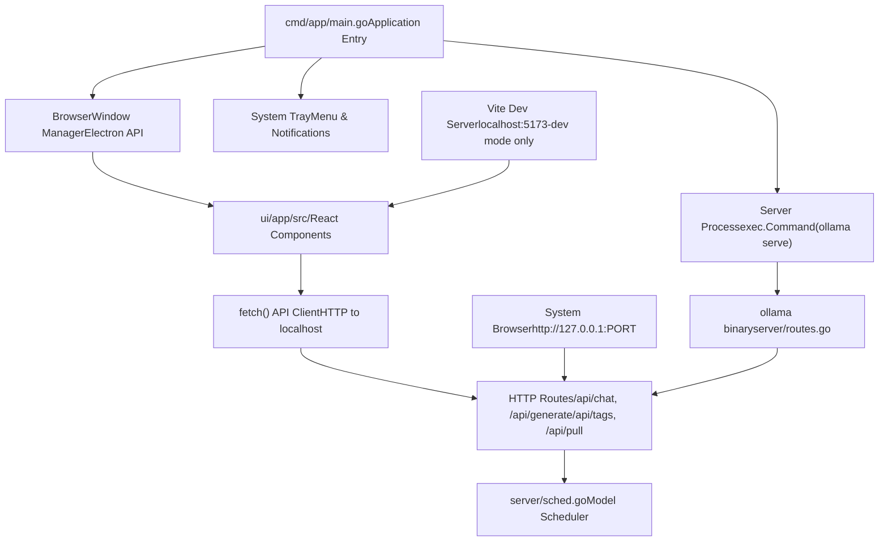
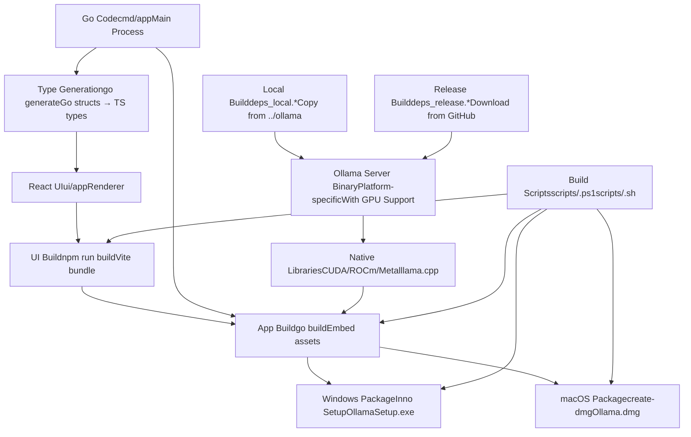
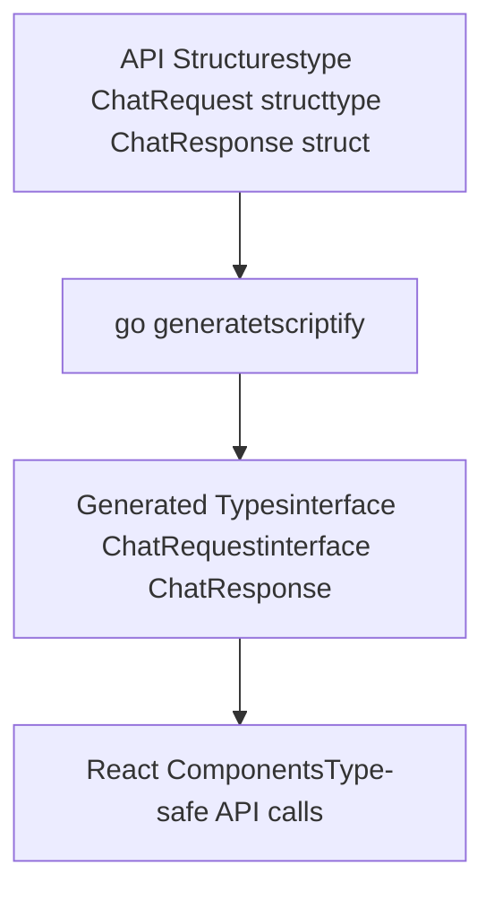

# Desktop Application Development

Relevant source files

-   [app/README.md](https://github.com/ollama/ollama/blob/562c76d7/app/README.md?plain=1)

## Purpose and Scope

This document covers the development, architecture, and build processes for Ollama's desktop application for macOS and Windows. The desktop app provides a native GUI wrapper around the Ollama HTTP API server, packaging both the Ollama backend and a React-based user interface into a standalone application using Electron.

For information about the underlying HTTP server and API that the desktop app communicates with, see [HTTP Server and API Layer](/ollama/ollama/2.1-http-server-and-api-layer). For details about building the Ollama backend from source, see [Building from Source](/ollama/ollama/8.1-building-from-source).

**Sources:** [app/README.md1-98](https://github.com/ollama/ollama/blob/562c76d7/app/README.md?plain=1#L1-L98)

---

## Architecture Overview

The Ollama desktop application uses Electron's multi-process architecture, embedding the full Ollama HTTP server within the application. The application consists of a main process (`cmd/app`) that spawns both the server and renderer processes.

### Component Architecture


**Diagram: Electron Multi-Process Architecture with Code Paths**

The desktop application consists of three independent processes:

1.  **Main Process** (`cmd/app/main.go`) - Electron app lifecycle, spawns server subprocess via `exec.Command`, manages `BrowserWindow` and system tray
2.  **Renderer Process** (`ui/app/src/`) - Isolated web context running React UI, communicates with server via fetch API
3.  **Server Process** (Ollama binary) - Separate OS process running the full HTTP server from `server/routes.go`

**Sources:** [app/README.md8-50](https://github.com/ollama/ollama/blob/562c76d7/app/README.md?plain=1#L8-L50)

### Development vs Production Modes

The application supports two operational modes controlled by the `-dev` command-line flag:

| Mode | UI Source | Server Port | CORS Headers | Reload |
| --- | --- | --- | --- | --- |
| **Development** | `http://localhost:5173` (Vite) | Fixed `127.0.0.1:3001` | `Access-Control-Allow-Origin: *` | Hot reload via HMR |
| **Production** | Embedded `ui/app/dist/` bundle | Dynamic (OS-assigned) | Not set | Requires restart |

Development mode (`-dev` flag) configures:

-   `BrowserWindow.loadURL("http://localhost:5173")` instead of `loadFile("dist/index.html")`
-   Fixed server port via environment variable for consistent CORS setup
-   CORS middleware injection in server routes
-   Vite's WebSocket connection for Hot Module Replacement (HMR)

**Sources:** [app/README.md44-50](https://github.com/ollama/ollama/blob/562c76d7/app/README.md?plain=1#L44-L50)

---

## Development Setup

### Prerequisites

Required tools and their purposes:

| Tool | Purpose | Installation |
| --- | --- | --- |
| **Go 1.21+** | Build `cmd/app` main process and server | [https://go.dev/dl/](https://go.dev/dl/) |
| **Node.js 18+** | Run Vite dev server, build React UI | [https://nodejs.org/](https://nodejs.org/) |
| **Electron** | Desktop app runtime | `npm install` (via package.json) |
| **tscriptify** | Generate TypeScript interfaces from Go structs | `go install github.com/tkrajina/typescriptify-golang-structs/tscriptify@latest` |

Install the TypeScript type generator:

```
go install github.com/tkrajina/typescriptify-golang-structs/tscriptify@latest
```
This tool reads Go struct tags (e.g., `` `json:"model"` ``) and generates corresponding TypeScript interfaces in `ui/app/src/types/`.

**Sources:** [app/README.md18-25](https://github.com/ollama/ollama/blob/562c76d7/app/README.md?plain=1#L18-L25)

### Running the Desktop App

To run the desktop application with production UI bundle:

```
go generate ./... &&go run ./cmd/app
```
This command executes:

1.  `go generate ./...` - Invokes `//go:generate` directives to run `tscriptify` for type generation
2.  `go run ./cmd/app` - Compiles and runs `cmd/app/main.go`
3.  `main.go` spawns server subprocess: `exec.Command("ollama", "serve")`
4.  Electron `BrowserWindow` loads `file:///.../ui/app/dist/index.html`

**Sources:** [app/README.md12-15](https://github.com/ollama/ollama/blob/562c76d7/app/README.md?plain=1#L12-L15)

### UI Development with Hot-Reload

For rapid UI development with automatic reloading, use a two-terminal workflow:

**Terminal 1 - Start Vite Dev Server:**

```
cd ui/appnpm installnpm run dev
```
This starts Vite on `http://localhost:5173`:

-   Serves React components from `ui/app/src/`
-   Establishes WebSocket connection for Hot Module Replacement (HMR)
-   Rebuilds on file changes (`.tsx`, `.ts`, `.css`)

**Terminal 2 - Start Electron App in Dev Mode:**

```
go generate ./... &&OLLAMA_DEBUG=1 go run ./cmd/app -dev
```
The `-dev` flag enables:

-   `BrowserWindow.loadURL("http://localhost:5173")` - Load from Vite instead of `dist/`
-   Fixed server port `127.0.0.1:3001` - Set via `OLLAMA_HOST` environment variable
-   CORS middleware - Adds `Access-Control-Allow-Origin: http://localhost:5173`
-   Server logs - `OLLAMA_DEBUG=1` enables verbose logging to stdout

With this setup, editing React components in `ui/app/src/` triggers instant HMR updates without restarting Electron.

**Sources:** [app/README.md27-50](https://github.com/ollama/ollama/blob/562c76d7/app/README.md?plain=1#L27-L50) </old\_str>

## <old\_str>

## Debugging

### Console and DevTools

Access Electron DevTools in development mode:

```
# Run with DevTools auto-openOLLAMA_DEBUG=1 go run ./cmd/app -dev
```
Then press `Cmd+Option+I` (macOS) or `Ctrl+Shift+I` (Windows/Linux) to open Chrome DevTools.

### Logging

Enable verbose logging:

```
# Server logsOLLAMA_DEBUG=1 go run ./cmd/app -dev # Electron main process logs# Prints to terminal stdout/stderr
```
Log locations:

-   **Main process**: stdout (terminal running `go run`)
-   **Renderer process**: DevTools Console tab
-   **Server process**: stdout with `OLLAMA_DEBUG=1`

### Common Issues

| Issue | Cause | Solution |
| --- | --- | --- |
| UI not loading | Vite not running | Start `npm run dev` in Terminal 1 |
| CORS errors | Wrong port/no CORS | Verify `-dev` flag and port 3001 |
| API 404 errors | Server not started | Check `exec.Command` spawn succeeded |
| HMR not working | WebSocket blocked | Check firewall/antivirus settings |

### Debugging Server Communication

Monitor HTTP requests between renderer and server:

1.  Open DevTools Network tab
2.  Filter by `127.0.0.1:3001`
3.  Inspect request/response payloads
4.  Check for CORS headers in responses

**Sources:** [app/README.md27-50](https://github.com/ollama/ollama/blob/562c76d7/app/README.md?plain=1#L27-L50)

---

## Code Structure

The desktop application codebase is organized into key directories with specific responsibilities:

```
app/
├── cmd/
│   └── app/
│       └── main.go              # Electron main process entry, spawns server
├── ui/
│   └── app/
│       ├── src/
│       │   ├── components/       # React UI components
│       │   ├── types/            # Generated TS types from Go
│       │   ├── api/              # fetch() API client
│       │   └── App.tsx           # Root component
│       ├── package.json          # npm dependencies (electron, react, vite)
│       ├── vite.config.ts        # Vite build config
│       └── tsconfig.json         # TypeScript compiler config
├── scripts/
│   ├── build_windows.ps1         # Builds OllamaSetup.exe with Inno Setup
│   ├── build_darwin.sh           # Builds Ollama.dmg with create-dmg
│   ├── deps_local.ps1/.sh        # Copy local ollama build
│   └── deps_release.ps1/.sh      # Download release binaries
└── README.md
```
### Main Process (`cmd/app/main.go`)

Responsibilities:

-   Call `app.Ready()` to initialize Electron
-   Spawn server: `cmd := exec.Command("ollama", "serve")` with environment variables
-   Create `BrowserWindow` with `webPreferences.nodeIntegration: false` (security)
-   Register IPC handlers for system tray, file dialogs
-   Handle `will-quit` event to terminate server subprocess

**Sources:** [app/README.md12-15](https://github.com/ollama/ollama/blob/562c76d7/app/README.md?plain=1#L12-L15)

### React UI (`ui/app/src/`)

Structure:

-   **Components**: `Chat.tsx`, `ModelList.tsx`, `Settings.tsx` - UI elements
-   **API Client**: `api/client.ts` - Wraps `fetch()` for type-safe server communication
-   **Types**: `types/api.ts` - Auto-generated from Go structs via `tscriptify`
-   **State**: React hooks (`useState`, `useEffect`) for local state management

Build outputs:

-   `npm run dev` → Vite dev server on port 5173
-   `npm run build` → Static bundle in `ui/app/dist/`

**Sources:** [app/README.md27-35](https://github.com/ollama/ollama/blob/562c76d7/app/README.md?plain=1#L27-L35)

---

## Debugging

### Console and DevTools

Access Electron DevTools in development mode:

```
# Run with DevTools auto-openOLLAMA_DEBUG=1 go run ./cmd/app -dev
```
Then press `Cmd+Option+I` (macOS) or `Ctrl+Shift+I` (Windows/Linux) to open Chrome DevTools.

### Logging

Enable verbose logging:

```
# Server logsOLLAMA_DEBUG=1 go run ./cmd/app -dev # Electron main process logs# Prints to terminal stdout/stderr
```
Log locations:

-   **Main process**: stdout (terminal running `go run`)
-   **Renderer process**: DevTools Console tab
-   **Server process**: stdout with `OLLAMA_DEBUG=1`

### Common Issues

| Issue | Cause | Solution |
| --- | --- | --- |
| UI not loading | Vite not running | Start `npm run dev` in Terminal 1 |
| CORS errors | Wrong port/no CORS | Verify `-dev` flag and port 3001 |
| API 404 errors | Server not started | Check `exec.Command` spawn succeeded |
| HMR not working | WebSocket blocked | Check firewall/antivirus settings |

### Debugging Server Communication

Monitor HTTP requests between renderer and server:

1.  Open DevTools Network tab
2.  Filter by `127.0.0.1:3001`
3.  Inspect request/response payloads
4.  Check for CORS headers in responses

**Sources:** [app/README.md27-50](https://github.com/ollama/ollama/blob/562c76d7/app/README.md?plain=1#L27-L50) </old\_str>

<new\_str>

### Development Workflow

The development workflow involves running both the Vite dev server and the Electron app in development mode simultaneously:

> **[Mermaid sequence]**
> *(图表结构无法解析)*

**Diagram: Hot-Reload Development Sequence**

**Sources:** [app/README.md27-50](https://github.com/ollama/ollama/blob/562c76d7/app/README.md?plain=1#L27-L50)

---

## Build Process

The desktop application supports two primary distribution platforms, each with distinct build processes and installer formats.

### Windows Build

Windows builds produce an executable installer using Inno Setup.

#### Dependencies Management

Before building, acquire the Ollama backend binaries either from a local build or a GitHub release:

**Local Dependencies:**

```
.\scripts\deps_local.ps1
```
Copies locally-built Ollama binaries from the main repository build output.

**Release Dependencies:**

```
.\scripts\deps_release.ps1 0.6.8
```
Downloads pre-built binaries from the specified GitHub release version.

#### Building

Execute the Windows build script:

```
.\scripts\build_windows.ps1
```
This script:

1.  Bundles the React UI into static assets
2.  Compiles the Electron main process
3.  Embeds the Ollama backend binaries
4.  Packages everything using Inno Setup
5.  Produces `OllamaSetup.exe` installer

**External Dependency:** Inno Setup must be installed from [https://jrsoftware.org/isinfo.php](https://jrsoftware.org/isinfo.php)

**Sources:** [app/README.md54-71](https://github.com/ollama/ollama/blob/562c76d7/app/README.md?plain=1#L54-L71)

### macOS Build

macOS builds produce a `.dmg` disk image containing the signed `.app` bundle.

#### Xcode Version Compatibility

The CI system builds with Xcode 14.1 to maintain compatibility with macOS 11+. For manual builds targeting older OS versions:

```
export CGO_CFLAGS=-mmacosx-version-min=12.0export CGO_CXXFLAGS=-mmacosx-version-min=12.0export CGO_LDFLAGS=-mmacosx-version-min=12.0export SDKROOT=/Applications/Xcode_14.1.0.app/Contents/Developer/Platforms/MacOSX.platform/Developer/SDKs/MacOSX.sdkexport DEVELOPER_DIR=/Applications/Xcode_14.1.0.app/Contents/Developer
```
These environment variables configure the minimum deployment target and SDK paths for backward compatibility.

#### Dependencies Management

**Local Dependencies:**

```
./scripts/deps_local.sh
```
**Release Dependencies:**

```
./scripts/deps_release.sh 0.6.8
```
#### Building

Execute the macOS build script:

```
./scripts/build_darwin.sh
```
This script:

1.  Builds the React UI bundle
2.  Compiles the Electron main process for macOS
3.  Embeds Ollama backend with Metal acceleration support
4.  Creates the `.app` bundle
5.  Signs the application (if certificates are available)
6.  Generates `Ollama.dmg` disk image

**Sources:** [app/README.md73-97](https://github.com/ollama/ollama/blob/562c76d7/app/README.md?plain=1#L73-L97)

### Build Artifact Summary

| Platform | Artifacts | Format | Installer Type |
| --- | --- | --- | --- |
| **Windows** | `OllamaSetup.exe` | Inno Setup Installer | GUI Installer with shortcuts |
| **macOS** | `Ollama.dmg`, `Ollama.app` | Disk Image, App Bundle | Drag-and-drop installation |

**Sources:** [app/README.md3-7](https://github.com/ollama/ollama/blob/562c76d7/app/README.md?plain=1#L3-L7)

---

## Build Dependencies Flow


**Diagram: Build Dependencies and Artifact Flow**

**Sources:** [app/README.md51-97](https://github.com/ollama/ollama/blob/562c76d7/app/README.md?plain=1#L51-L97)

---

## Communication Between UI and Backend

The React UI communicates with the embedded Ollama server using the browser's `fetch()` API. The server runs as a separate process spawned by the Electron main process.

> **[Mermaid sequence]**
> *(图表结构无法解析)*

**Diagram: UI-Server Communication with Code Entities**

### API Endpoint Usage

Desktop UI makes HTTP requests to these server endpoints:

| Endpoint | Method | Request Body | Response Type | Handler Location |
| --- | --- | --- | --- | --- |
| `/api/chat` | POST | `ChatRequest` | `text/event-stream` | `server/routes.go:ChatHandler` |
| `/api/generate` | POST | `GenerateRequest` | `text/event-stream` | `server/routes.go:GenerateHandler` |
| `/api/pull` | POST | `PullRequest` | `text/event-stream` | `server/routes.go:PullHandler` |
| `/api/tags` | GET | \- | `application/json` | `server/routes.go:ListHandler` |
| `/api/create` | POST | `CreateRequest` | `text/event-stream` | `server/routes.go:CreateHandler` |
| `/api/delete` | DELETE | `DeleteRequest` | `application/json` | `server/routes.go:DeleteHandler` |

Request/response types are defined in Go and auto-generated to TypeScript via `tscriptify`.

For complete API documentation, see [Generation and Chat API](/ollama/ollama/3.2-generation-and-chat-api) and [Model Management API](/ollama/ollama/3.1-model-management-api).

**Sources:** [app/README.md38-50](https://github.com/ollama/ollama/blob/562c76d7/app/README.md?plain=1#L38-L50)

---

## Type Safety and Code Generation

The desktop application maintains type safety between the Go backend and TypeScript frontend through automated code generation:


**Diagram: Type Generation Pipeline**

The `tscriptify` tool analyzes Go struct definitions and generates corresponding TypeScript interfaces, ensuring that API request and response types remain synchronized between the backend and frontend.

**Sources:** [app/README.md21-25](https://github.com/ollama/ollama/blob/562c76d7/app/README.md?plain=1#L21-L25)

---

## Distribution and Release

The desktop application binaries are distributed through GitHub Releases:

-   **Windows:** `OllamaSetup.exe` - Installable executable
-   **macOS:** `Ollama.dmg` - Disk image with drag-and-drop installation

Downloads are available at:

-   macOS: [https://github.com/ollama/app/releases/download/latest/Ollama.dmg](https://github.com/ollama/app/releases/download/latest/Ollama.dmg)
-   Windows: [https://github.com/ollama/app/releases/download/latest/OllamaSetup.exe](https://github.com/ollama/app/releases/download/latest/OllamaSetup.exe)

The release process is automated through GitHub Actions workflows that:

1.  Build platform-specific artifacts
2.  Sign executables (macOS: code signing, Windows: optional authenticode)
3.  Create GitHub release with binaries
4.  Generate checksums for verification

For information about the broader release pipeline including Linux and Docker distributions, see [Build, Test, and Release Pipeline (Diagram 4)](/ollama/ollama/1-overview).

**Sources:** [app/README.md3-7](https://github.com/ollama/ollama/blob/562c76d7/app/README.md?plain=1#L3-L7)
