# Go Module Dependencies

Relevant source files

-   [cmd/config/claude\_test.go](https://github.com/ollama/ollama/blob/562c76d7/cmd/config/claude_test.go)
-   [cmd/config/codex.go](https://github.com/ollama/ollama/blob/562c76d7/cmd/config/codex.go)
-   [cmd/config/codex\_test.go](https://github.com/ollama/ollama/blob/562c76d7/cmd/config/codex_test.go)
-   [go.mod](https://github.com/ollama/ollama/blob/562c76d7/go.mod)
-   [go.sum](https://github.com/ollama/ollama/blob/562c76d7/go.sum)

## Purpose and Scope

This page documents the Go module dependencies used in the Ollama codebase, organized by functional category. It covers direct and indirect dependencies, their versions, and their roles in the system. For information about building from source and managing dependencies during development, see [Building from Source](/ollama/ollama/8.1-building-from-source). For platform-specific build requirements, see [Platform-Specific Build Details](/ollama/ollama/8.2-platform-specific-build-details).

The Ollama project requires Go 1.24.1 as specified in [go.mod3](https://github.com/ollama/ollama/blob/562c76d7/go.mod#L3-L3) and uses approximately 40 direct dependencies with over 70 indirect transitive dependencies.

## Dependency Organization

Dependencies are declared in three sections within [go.mod5-110](https://github.com/ollama/ollama/blob/562c76d7/go.mod#L5-L110):

1.  **Primary required dependencies** [go.mod5-20](https://github.com/ollama/ollama/blob/562c76d7/go.mod#L5-L20) - Core runtime dependencies
2.  **Secondary required dependencies** [go.mod22-42](https://github.com/ollama/ollama/blob/562c76d7/go.mod#L22-L42) - Additional functionality
3.  **Tertiary required dependencies** [go.mod44-80](https://github.com/ollama/ollama/blob/562c76d7/go.mod#L44-L80) and [go.mod82-110](https://github.com/ollama/ollama/blob/562c76d7/go.mod#L82-L110) - Supporting libraries and transitive dependencies

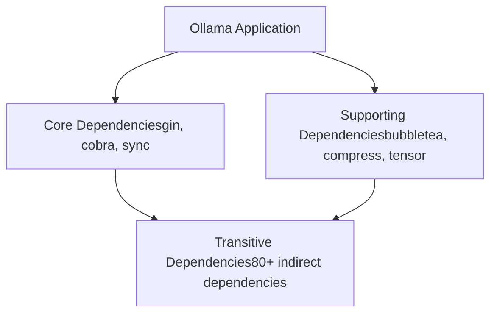
**Sources:** [go.mod1-111](https://github.com/ollama/ollama/blob/562c76d7/go.mod#L1-L111)

## Key Dependency Categories

### HTTP Server and API Framework

Ollama uses the Gin web framework for its HTTP API layer, providing routing, middleware, and request handling.

| Package | Version | Purpose |
| --- | --- | --- |
| `github.com/gin-gonic/gin` | v1.10.0 | Core HTTP router and middleware framework |
| `github.com/gin-contrib/cors` | v1.7.2 | CORS middleware for cross-origin requests |
| `github.com/gin-contrib/sse` | v0.1.0 | Server-sent events for streaming responses |

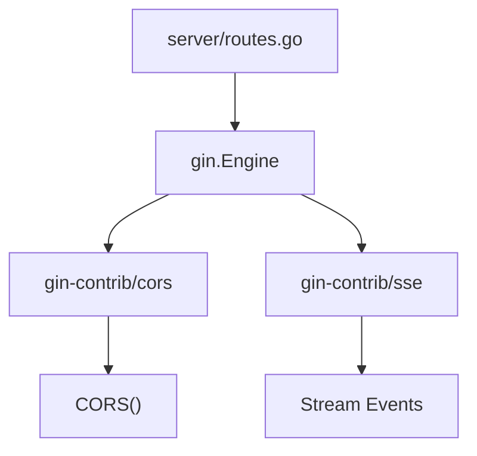
**Sources:** [go.mod8](https://github.com/ollama/ollama/blob/562c76d7/go.mod#L8-L8) [go.mod85-86](https://github.com/ollama/ollama/blob/562c76d7/go.mod#L85-L86)

The Gin framework is initialized in the server package and provides the foundation for all API endpoints including `/api/chat`, `/api/generate`, and OpenAI/Anthropic compatibility endpoints.

### Command Line Interface

The CLI is built using the Cobra framework, which provides command parsing, help generation, and subcommand management.

| Package | Version | Purpose |
| --- | --- | --- |
| `github.com/spf13/cobra` | v1.7.0 | CLI command framework and routing |
| `github.com/spf13/pflag` | v1.0.5 | POSIX-style command-line flags |

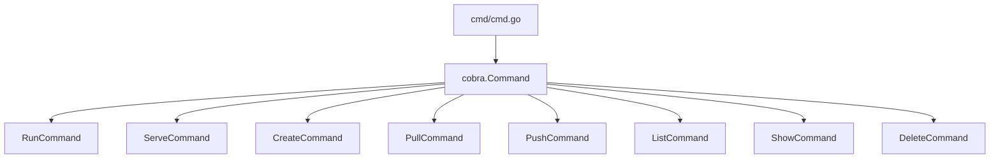
**Sources:** [go.mod15](https://github.com/ollama/ollama/blob/562c76d7/go.mod#L15-L15) [go.mod99](https://github.com/ollama/ollama/blob/562c76d7/go.mod#L99-L99)

All CLI commands are implemented using Cobra's command structure, with each subcommand registered in the root command tree.

### Terminal User Interface

For interactive terminal experiences, Ollama uses the Bubble Tea framework with styling provided by Lipgloss.

| Package | Version | Purpose |
| --- | --- | --- |
| `github.com/charmbracelet/bubbletea` | v1.3.10 | Terminal UI framework with event loop |
| `github.com/charmbracelet/lipgloss` | v1.1.0 | Terminal text styling and layout |
| `github.com/olekukonko/tablewriter` | v0.0.5 | ASCII table rendering for output |
| `github.com/containerd/console` | v1.0.3 | Console terminal handling |
| `github.com/mattn/go-runewidth` | v0.0.16 | Unicode width calculation |

**Sources:** [go.mod24-25](https://github.com/ollama/ollama/blob/562c76d7/go.mod#L24-L25) [go.mod14](https://github.com/ollama/ollama/blob/562c76d7/go.mod#L14-L14) [go.mod7](https://github.com/ollama/ollama/blob/562c76d7/go.mod#L7-L7) [go.mod30](https://github.com/ollama/ollama/blob/562c76d7/go.mod#L30-L30)

These dependencies power interactive progress displays, formatted output, and terminal-based user interfaces throughout the CLI.

### Machine Learning and Numerical Computing

Core numerical operations and tensor manipulation are provided by specialized libraries.

| Package | Version | Purpose |
| --- | --- | --- |
| `gonum.org/v1/gonum` | v0.15.0 | Matrix operations and linear algebra |
| `github.com/pdevine/tensor` | v0.0.0-20240510204454 | Tensor operations for model data |
| `github.com/x448/float16` | v0.8.4 | Float16 (half-precision) support |
| `github.com/d4l3k/go-bfloat16` | v0.0.0-20211005043715 | BFloat16 support for ML operations |
| `github.com/nlpodyssey/gopickle` | v0.3.0 | Python pickle format parser |

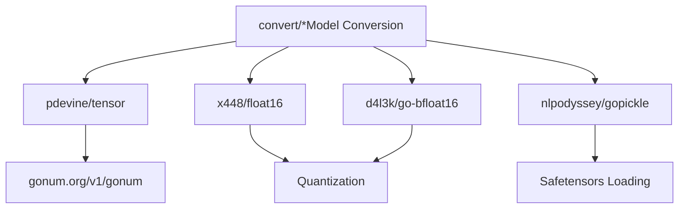
**Sources:** [go.mod41](https://github.com/ollama/ollama/blob/562c76d7/go.mod#L41-L41) [go.mod32](https://github.com/ollama/ollama/blob/562c76d7/go.mod#L32-L32) [go.mod17](https://github.com/ollama/ollama/blob/562c76d7/go.mod#L17-L17) [go.mod26](https://github.com/ollama/ollama/blob/562c76d7/go.mod#L26-L26) [go.mod31](https://github.com/ollama/ollama/blob/562c76d7/go.mod#L31-L31)

These libraries are critical for model conversion, quantization, and handling various numeric formats used in machine learning models.

### Code Parsing and Analysis

Tree-sitter bindings enable syntax-aware code processing for tool calling and code analysis features.

| Package | Version | Purpose |
| --- | --- | --- |
| `github.com/tree-sitter/go-tree-sitter` | v0.25.0 | Core Tree-sitter bindings |
| `github.com/tree-sitter/tree-sitter-cpp` | v0.23.4 | C++ language grammar |
| `github.com/dlclark/regexp2` | v1.11.4 | Advanced regex with backreferences |

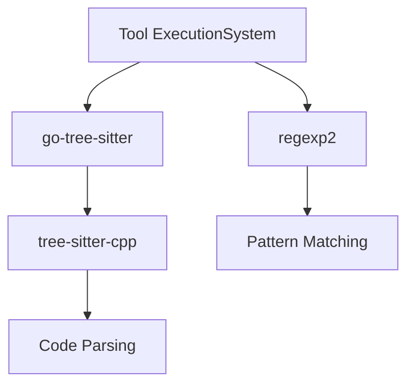
**Sources:** [go.mod35-36](https://github.com/ollama/ollama/blob/562c76d7/go.mod#L35-L36) [go.mod27](https://github.com/ollama/ollama/blob/562c76d7/go.mod#L27-L27)

Tree-sitter provides syntax-aware parsing capabilities used in tool calling features and code analysis.

### Data Compression and Serialization

Multiple compression and serialization formats are supported for model storage and transfer.

| Package | Version | Purpose |
| --- | --- | --- |
| `github.com/klauspost/compress` | v1.18.3 | High-performance compression (zstd, gzip) |
| `google.golang.org/protobuf` | v1.34.1 | Protocol Buffers serialization |
| `github.com/golang/protobuf` | v1.5.4 | Legacy protobuf support |

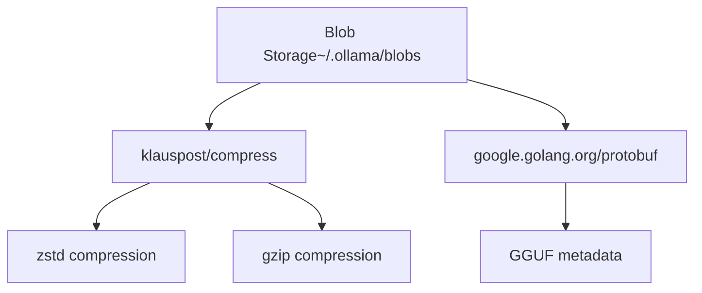
**Sources:** [go.mod29](https://github.com/ollama/ollama/blob/562c76d7/go.mod#L29-L29) [go.mod108](https://github.com/ollama/ollama/blob/562c76d7/go.mod#L108-L108) [go.mod9](https://github.com/ollama/ollama/blob/562c76d7/go.mod#L9-L9)

The compression library is heavily used for model blob storage, while protobuf handles structured metadata.

### Document Processing

PDF processing capabilities are provided for multimodal document understanding.

| Package | Version | Purpose |
| --- | --- | --- |
| `github.com/ledongthuc/pdf` | v0.0.0-20250511090121 | PDF file parsing and text extraction |

**Sources:** [go.mod12](https://github.com/ollama/ollama/blob/562c76d7/go.mod#L12-L12)

This dependency enables PDF document processing for multimodal models that support document understanding.

### Data Structures and Collections

Advanced data structures complement Go's standard library.

| Package | Version | Purpose |
| --- | --- | --- |
| `github.com/emirpasic/gods/v2` | v2.0.0-alpha | Generic collections (trees, lists, maps) |
| `github.com/wk8/go-ordered-map/v2` | v2.1.8 | Ordered map with deterministic iteration |

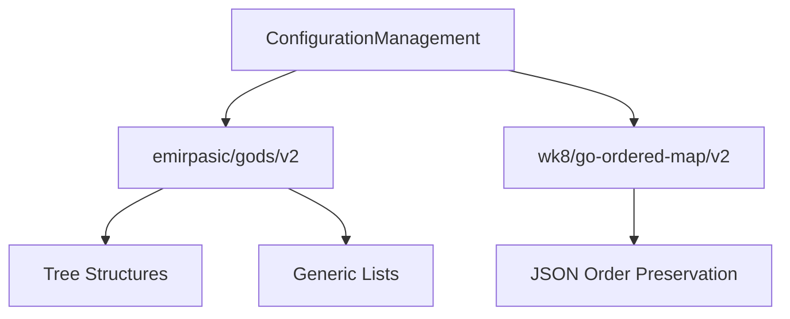
**Sources:** [go.mod28](https://github.com/ollama/ollama/blob/562c76d7/go.mod#L28-L28) [go.mod37](https://github.com/ollama/ollama/blob/562c76d7/go.mod#L37-L37)

Ordered maps are particularly important for preserving JSON key order in model manifests and configuration files.

### Storage and Databases

SQLite provides local persistent storage for model metadata and configuration.

| Package | Version | Purpose |
| --- | --- | --- |
| `github.com/mattn/go-sqlite3` | v1.14.24 | CGo-based SQLite driver |

**Sources:** [go.mod13](https://github.com/ollama/ollama/blob/562c76d7/go.mod#L13-L13)

SQLite is used for storing model metadata, conversation history, and persistent configuration.

### Testing and Quality Assurance

Comprehensive testing utilities ensure code quality and correctness.

| Package | Version | Purpose |
| --- | --- | --- |
| `github.com/stretchr/testify` | v1.10.0 | Test assertions and mocking |
| `github.com/google/go-cmp` | v0.7.0 | Deep value comparison for tests |

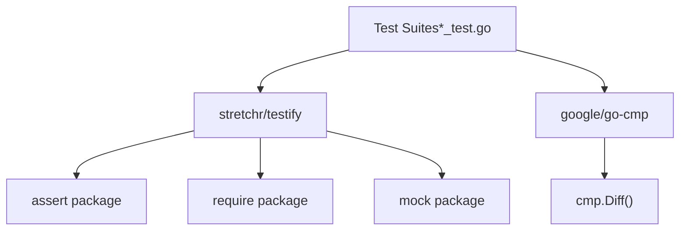
**Sources:** [go.mod16](https://github.com/ollama/ollama/blob/562c76d7/go.mod#L16-L16) [go.mod10](https://github.com/ollama/ollama/blob/562c76d7/go.mod#L10-L10)

Testify provides assertion helpers and mocking capabilities, while go-cmp offers detailed difference reporting for complex structures.

### Standard Library Extensions

Go's extended standard library packages provide critical system-level functionality.

| Package | Version | Purpose |
| --- | --- | --- |
| `golang.org/x/sync` | v0.17.0 | Advanced concurrency primitives (errgroup, semaphore) |
| `golang.org/x/sys` | v0.37.0 | Low-level system calls and OS interfaces |
| `golang.org/x/crypto` | v0.43.0 | Cryptographic functions and hashing |
| `golang.org/x/net` | v0.46.0 | Network protocol implementations |
| `golang.org/x/text` | v0.30.0 | Text encoding and Unicode support |
| `golang.org/x/image` | v0.22.0 | Image encoding/decoding |
| `golang.org/x/term` | v0.36.0 | Terminal control and ANSI handling |
| `golang.org/x/mod` | v0.30.0 | Go module utilities |
| `golang.org/x/tools` | v0.38.0 | Go tooling libraries |

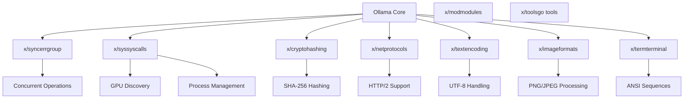
**Sources:** [go.mod18-19](https://github.com/ollama/ollama/blob/562c76d7/go.mod#L18-L19) [go.mod103-107](https://github.com/ollama/ollama/blob/562c76d7/go.mod#L103-L107) [go.mod39-40](https://github.com/ollama/ollama/blob/562c76d7/go.mod#L39-L40)

These extensions are used throughout the codebase for system-level operations, concurrency management, cryptographic operations, and terminal handling.

### Utility Libraries

Miscellaneous utilities provide various support functions.

| Package | Version | Purpose |
| --- | --- | --- |
| `github.com/google/uuid` | v1.6.0 | UUID generation for tracking |
| `github.com/agnivade/levenshtein` | v1.1.1 | String similarity for suggestions |
| `github.com/pkg/browser` | v0.0.0-20240102092130 | Cross-platform browser launching |
| `github.com/tkrajina/typescriptify-golang-structs` | v0.2.0 | TypeScript type generation |

**Sources:** [go.mod11](https://github.com/ollama/ollama/blob/562c76d7/go.mod#L11-L11) [go.mod23](https://github.com/ollama/ollama/blob/562c76d7/go.mod#L23-L23) [go.mod33](https://github.com/ollama/ollama/blob/562c76d7/go.mod#L33-L33) [go.mod34](https://github.com/ollama/ollama/blob/562c76d7/go.mod#L34-L34)

These utilities handle various support functions from generating unique identifiers to launching web browsers for authentication flows.

### Platform-Specific Dependencies

Windows-specific dependencies provide platform integration.

| Package | Version | Purpose |
| --- | --- | --- |
| `github.com/TheTitanrain/w32` | v0.0.0-20180517000239 | Windows API bindings |

**Sources:** [go.mod6](https://github.com/ollama/ollama/blob/562c76d7/go.mod#L6-L6)

Windows-specific functionality is isolated to platform-specific build tags and uses this dependency for Windows API access.

## Dependency Management Practices

### Version Pinning

All dependencies use explicit version pinning to ensure reproducible builds. Direct dependencies specify semantic versions [go.mod5-110](https://github.com/ollama/ollama/blob/562c76d7/go.mod#L5-L110) while the `go.sum` file [go.sum1-454](https://github.com/ollama/ollama/blob/562c76d7/go.sum#L1-L454) contains cryptographic checksums for verification.

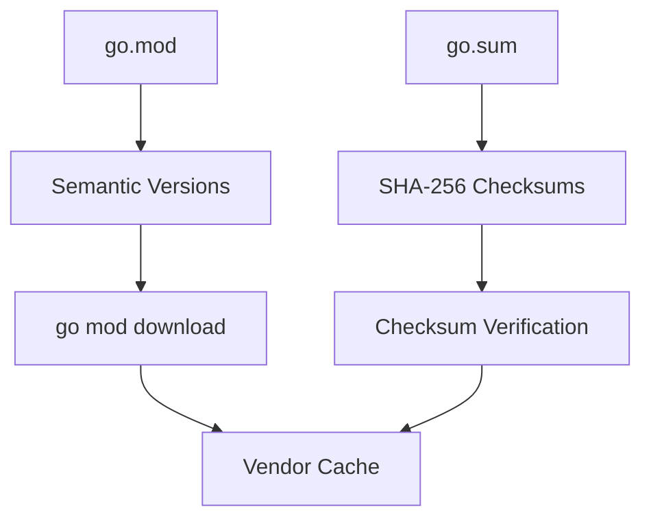
**Sources:** [go.mod1-111](https://github.com/ollama/ollama/blob/562c76d7/go.mod#L1-L111) [go.sum1-454](https://github.com/ollama/ollama/blob/562c76d7/go.sum#L1-L454)

### Direct vs. Indirect Dependencies

Dependencies are organized into direct and indirect categories:

-   **Direct dependencies** - Explicitly imported by Ollama code
-   **Indirect dependencies** - Required by direct dependencies (marked with `// indirect`)

Example indirect dependencies from [go.mod45-80](https://github.com/ollama/ollama/blob/562c76d7/go.mod#L45-L80):

-   `github.com/apache/arrow/go/arrow` - Required by tensor library
-   `github.com/bytedance/sonic/loader` - Required by Gin framework
-   `github.com/cloudwego/base64x` - Required by sonic

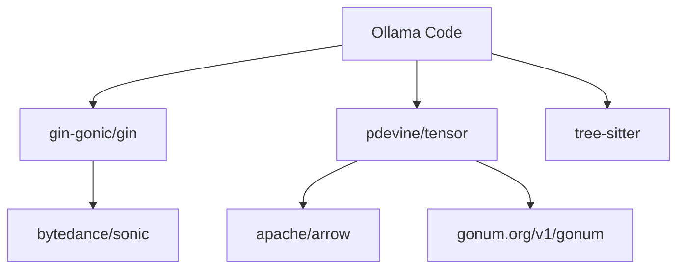
**Sources:** [go.mod5-80](https://github.com/ollama/ollama/blob/562c76d7/go.mod#L5-L80)

### Dependency Updates

Dependencies are updated through standard Go module commands:

-   `go get -u` - Update dependencies
-   `go mod tidy` - Clean up unused dependencies
-   `go mod verify` - Verify checksums

The `go.sum` file must be committed to version control to ensure all developers and CI systems use identical dependency versions.

## Integration Points

### Server Initialization

The HTTP server initialization integrates multiple dependencies:

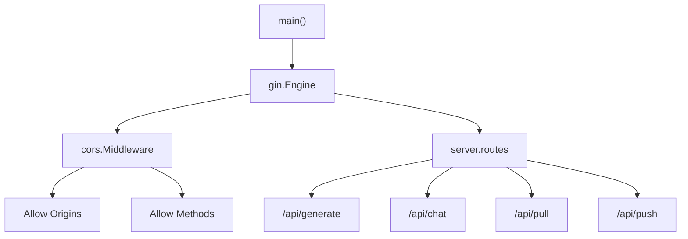
**Sources:** [go.mod8](https://github.com/ollama/ollama/blob/562c76d7/go.mod#L8-L8) [go.mod85](https://github.com/ollama/ollama/blob/562c76d7/go.mod#L85-L85)

### Model Conversion Pipeline

The model conversion system integrates numerical and serialization libraries:

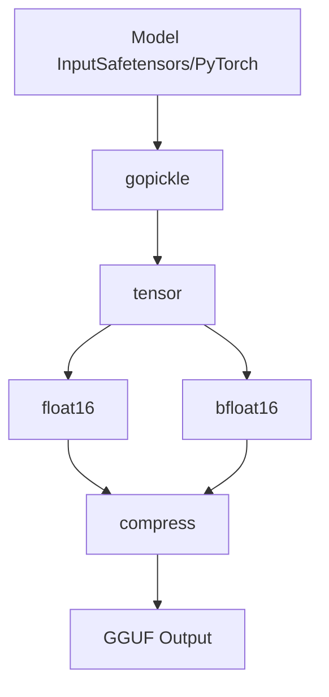
**Sources:** [go.mod31](https://github.com/ollama/ollama/blob/562c76d7/go.mod#L31-L31) [go.mod32](https://github.com/ollama/ollama/blob/562c76d7/go.mod#L32-L32) [go.mod17](https://github.com/ollama/ollama/blob/562c76d7/go.mod#L17-L17) [go.mod26](https://github.com/ollama/ollama/blob/562c76d7/go.mod#L26-L26) [go.mod29](https://github.com/ollama/ollama/blob/562c76d7/go.mod#L29-L29)

### CLI Command Processing

The CLI integrates multiple UI and processing libraries:

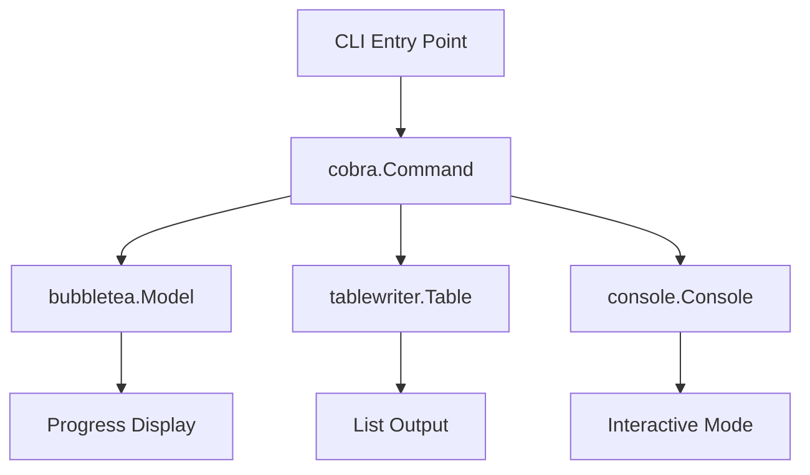
**Sources:** [go.mod15](https://github.com/ollama/ollama/blob/562c76d7/go.mod#L15-L15) [go.mod24](https://github.com/ollama/ollama/blob/562c76d7/go.mod#L24-L24) [go.mod14](https://github.com/ollama/ollama/blob/562c76d7/go.mod#L14-L14) [go.mod7](https://github.com/ollama/ollama/blob/562c76d7/go.mod#L7-L7)

## Transitive Dependency Graph

Major transitive dependency chains:

| Direct Dependency | Key Transitive Dependencies | Purpose |
| --- | --- | --- |
| `gin-gonic/gin` | `bytedance/sonic`, `go-playground/validator`, `ugorji/go/codec` | JSON encoding, validation, codec |
| `pdevine/tensor` | `apache/arrow`, `gonum.org/v1/gonum`, `gorgonia.org/vecf32` | Array operations, linear algebra |
| `charmbracelet/bubbletea` | `charmbracelet/x/*`, `muesli/termenv`, `containerd/console` | Terminal rendering, color support |
| `tree-sitter` | Multiple `tree-sitter-*` language grammars | Language-specific parsers |

**Sources:** [go.mod44-80](https://github.com/ollama/ollama/blob/562c76d7/go.mod#L44-L80) [go.mod82-110](https://github.com/ollama/ollama/blob/562c76d7/go.mod#L82-L110)

## Dependency Size and Impact

### Build Size Contributors

Major contributors to binary size:

1.  **GGML/llama.cpp (CGo)** - Largest component, ML inference engine
2.  **gin-gonic/gin** - Web framework with full HTTP stack
3.  **tree-sitter grammars** - Multiple language parsers
4.  **gonum** - Numerical computing library

### Runtime Dependencies

Some dependencies are only required at specific times:

-   **Build time**: `golang.org/x/tools`, `typescriptify-golang-structs`
-   **Runtime**: All others
-   **Platform-specific**: `w32` (Windows only)

**Sources:** [go.mod6](https://github.com/ollama/ollama/blob/562c76d7/go.mod#L6-L6) [go.mod34](https://github.com/ollama/ollama/blob/562c76d7/go.mod#L34-L34) [go.mod40](https://github.com/ollama/ollama/blob/562c76d7/go.mod#L40-L40)

## Security Considerations

### Cryptographic Dependencies

Cryptographic operations use vetted libraries:

-   `golang.org/x/crypto` [go.mod103](https://github.com/ollama/ollama/blob/562c76d7/go.mod#L103-L103) - Standard cryptographic primitives
-   SHA-256 hashing for content addressing in blob storage
-   No custom cryptographic implementations

### Supply Chain Security

The project uses `go.sum` [go.sum1-454](https://github.com/ollama/ollama/blob/562c76d7/go.sum#L1-L454) for supply chain security:

-   All dependencies have cryptographic checksums
-   Go module proxy caching reduces single-point-of-failure risks
-   Checksum database validation through sum.golang.org

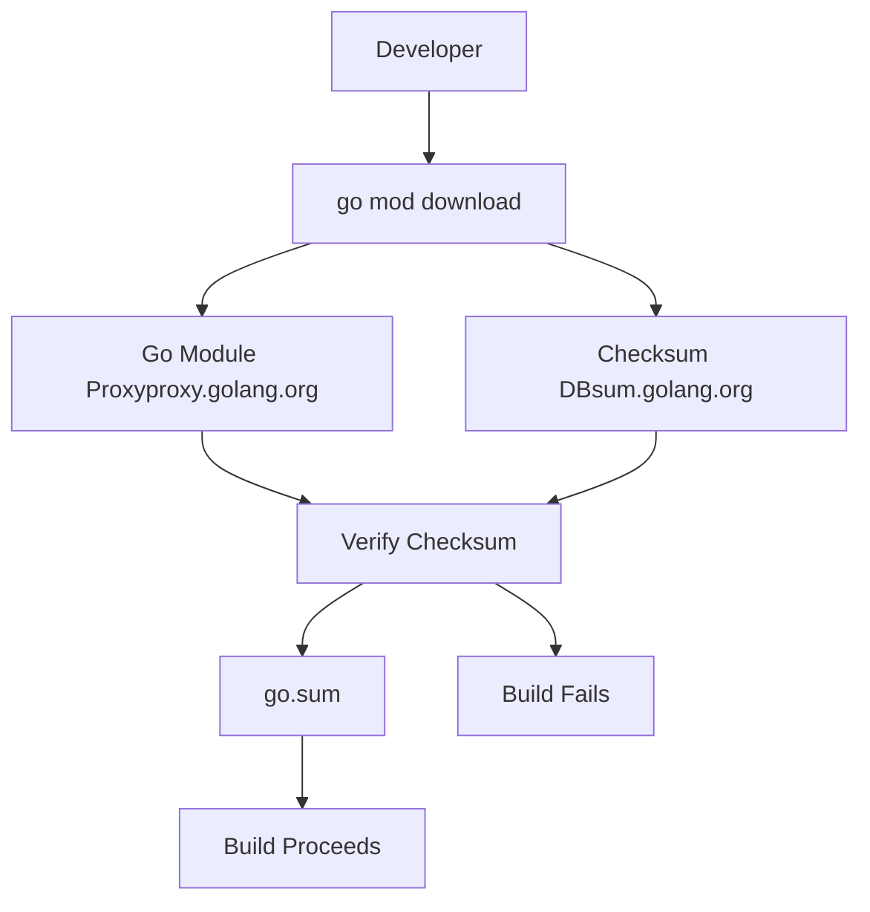
**Sources:** [go.sum1-454](https://github.com/ollama/ollama/blob/562c76d7/go.sum#L1-L454)

## Maintenance and Updates

### Update Strategy

Dependencies are updated periodically with consideration for:

1.  **Security patches** - Applied immediately for CVEs
2.  **Bug fixes** - Applied during regular maintenance windows
3.  **Feature updates** - Evaluated for benefit vs. risk
4.  **Breaking changes** - Coordinated with major version releases

### Compatibility Requirements

Some dependencies have specific version requirements:

-   Go 1.24.1 minimum [go.mod3](https://github.com/ollama/ollama/blob/562c76d7/go.mod#L3-L3)
-   CGo enabled for `mattn/go-sqlite3` [go.mod13](https://github.com/ollama/ollama/blob/562c76d7/go.mod#L13-L13)
-   Platform-specific builds for Windows dependencies [go.mod6](https://github.com/ollama/ollama/blob/562c76d7/go.mod#L6-L6)

**Sources:** [go.mod3](https://github.com/ollama/ollama/blob/562c76d7/go.mod#L3-L3) [go.mod13](https://github.com/ollama/ollama/blob/562c76d7/go.mod#L13-L13) [go.mod6](https://github.com/ollama/ollama/blob/562c76d7/go.mod#L6-L6)
