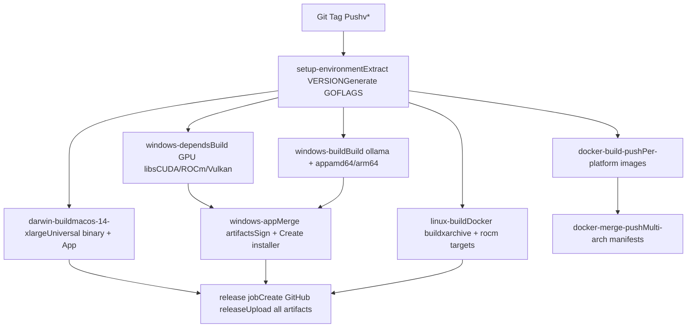
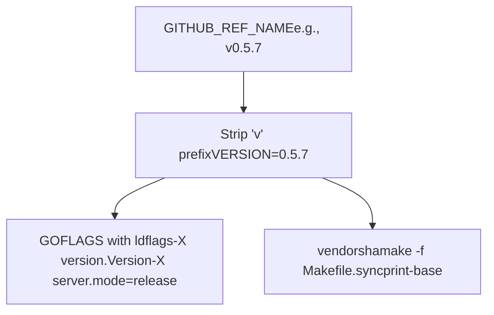
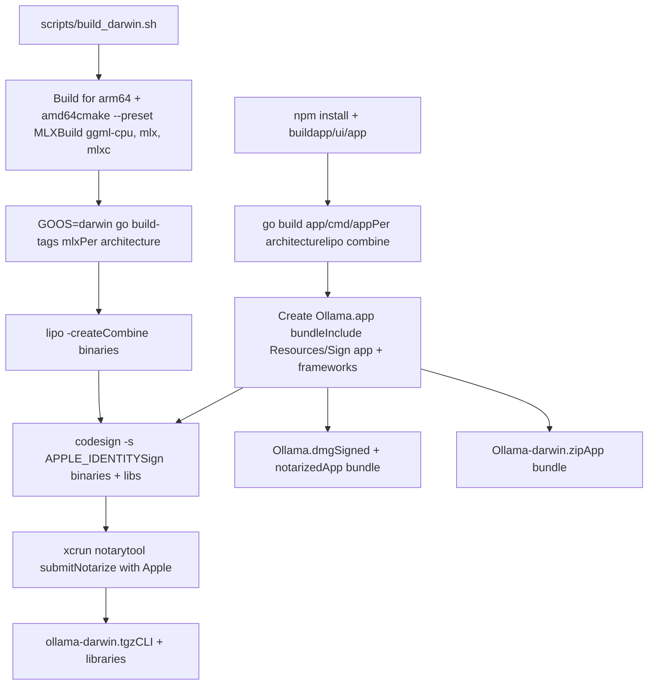
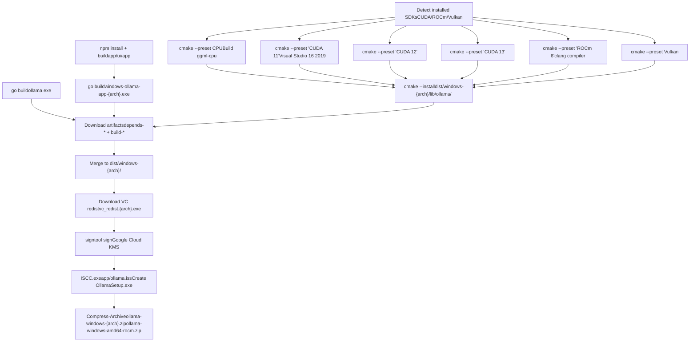
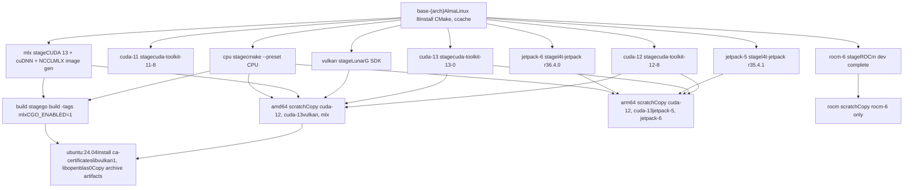
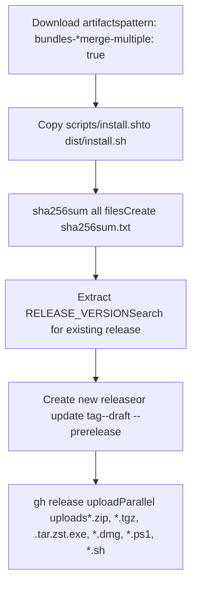

# Release Process

Relevant source files

-   [.github/workflows/release.yaml](https://github.com/ollama/ollama/blob/562c76d7/.github/workflows/release.yaml)
-   [.github/workflows/test-install.yaml](https://github.com/ollama/ollama/blob/562c76d7/.github/workflows/test-install.yaml)
-   [.github/workflows/test.yaml](https://github.com/ollama/ollama/blob/562c76d7/.github/workflows/test.yaml)
-   [Dockerfile](https://github.com/ollama/ollama/blob/562c76d7/Dockerfile)
-   [app/ollama.iss](https://github.com/ollama/ollama/blob/562c76d7/app/ollama.iss)
-   [scripts/build\_darwin.sh](https://github.com/ollama/ollama/blob/562c76d7/scripts/build_darwin.sh)
-   [scripts/build\_linux.sh](https://github.com/ollama/ollama/blob/562c76d7/scripts/build_linux.sh)
-   [scripts/build\_windows.ps1](https://github.com/ollama/ollama/blob/562c76d7/scripts/build_windows.ps1)
-   [scripts/deduplicate\_cuda\_libs.sh](https://github.com/ollama/ollama/blob/562c76d7/scripts/deduplicate_cuda_libs.sh)
-   [scripts/install.ps1](https://github.com/ollama/ollama/blob/562c76d7/scripts/install.ps1)
-   [scripts/install.sh](https://github.com/ollama/ollama/blob/562c76d7/scripts/install.sh)

This document describes the automated release process for Ollama, including multi-platform builds, code signing, artifact generation, and distribution. The release process produces platform-specific installers, Docker images, and standalone archives for macOS, Windows, and Linux across multiple architectures and GPU backends.

For information about building from source during development, see [Building from Source](/ollama/ollama/8.1-building-from-source). For platform-specific build details and CMake configuration, see [Platform-Specific Build Details](/ollama/ollama/8.2-platform-specific-build-details).

## Overview

The release process is triggered by pushing a Git tag matching the pattern `v*`. The workflow builds binaries for all supported platforms and architectures, signs executables where applicable, generates installers and archives, builds multi-architecture Docker images, and publishes all artifacts to a GitHub release.

**Supported Platforms:**

-   **macOS**: Universal binaries (arm64 + amd64), DMG installer, desktop app
-   **Windows**: amd64 and arm64, signed EXE installer, desktop app, ZIP archives
-   **Linux**: amd64 and arm64, tar.zst archives, Docker images

**GPU Backend Variants:**

-   CUDA 11, CUDA 12, CUDA 13 (NVIDIA)
-   ROCm 6 (AMD)
-   Vulkan (cross-vendor)
-   JetPack 5 and 6 (NVIDIA Jetson)
-   MLX (Apple Silicon)

Sources: [.github/workflows/release.yaml1-554](https://github.com/ollama/ollama/blob/562c76d7/.github/workflows/release.yaml#L1-L554)

## Release Workflow Overview


**Diagram: Release Workflow Jobs and Dependencies**

Sources: [.github/workflows/release.yaml12-503](https://github.com/ollama/ollama/blob/562c76d7/.github/workflows/release.yaml#L12-L503)

## Version and Build Flags

The `setup-environment` job extracts version information from the Git tag and configures build flags used by all downstream jobs.


**Diagram: Version Extraction and Build Flag Generation**

The version is embedded into Go binaries via `-ldflags` and used for package naming:

-   `GOFLAGS`: `'-ldflags=-w -s "-X=github.com/ollama/ollama/version.Version=${VERSION}" "-X=github.com/ollama/ollama/server.mode=release"'`
-   `VERSION`: Used in installer filenames and package metadata
-   `vendorsha`: Cache key for vendor dependencies

Sources: [.github/workflows/release.yaml14-27](https://github.com/ollama/ollama/blob/562c76d7/.github/workflows/release.yaml#L14-L27)

## macOS Build Process

The `darwin-build` job runs on `macos-14-xlarge` and produces a universal binary, standalone tarball, DMG installer, and desktop application.


**Diagram: macOS Build and Packaging Pipeline**

### Build Steps

1.  **Backend Libraries**: Build GGML CPU and MLX backends for both architectures using CMake presets
2.  **Go Binary**: Compile with MLX support (`-tags mlx`) for each architecture
3.  **Universal Binary**: Combine arm64 and amd64 binaries using `lipo`
4.  **Desktop App**: Build React UI, compile Electron app, create universal binary
5.  **Code Signing**: Sign all binaries, libraries, and app bundle with `APPLE_IDENTITY`
6.  **Notarization**: Submit to Apple for notarization using `notarytool`
7.  **DMG Creation**: Create DMG installer with background image and app icon

### Code Signing Requirements

Code signing requires environment variables:

-   `APPLE_IDENTITY`: Developer certificate
-   `APPLE_ID`: Apple ID for notarization
-   `APPLE_PASSWORD`: App-specific password
-   `APPLE_TEAM_ID`: Developer team ID
-   `MACOS_SIGNING_KEY`: Base64-encoded P12 certificate
-   `MACOS_SIGNING_KEY_PASSWORD`: Certificate password

Sources: [.github/workflows/release.yaml29-74](https://github.com/ollama/ollama/blob/562c76d7/.github/workflows/release.yaml#L29-L74) [scripts/build\_darwin.sh1-231](https://github.com/ollama/ollama/blob/562c76d7/scripts/build_darwin.sh#L1-L231)

## Windows Build Process

Windows builds are split into three jobs: dependency building, binary compilation, and final assembly with signing.


**Diagram: Windows Build Pipeline**

### GPU Backend Installation

The `windows-depends` job installs GPU SDKs from cached or fresh downloads:

| Backend | Installer URL | Components | Version |
| --- | --- | --- | --- |
| CUDA 12 | `cuda_12.8.0_571.96_windows.exe` | cudart, nvcc, cublas, cublas\_dev | 12.8 |
| CUDA 13 | `cuda_13.0.0_windows.exe` | cudart, nvcc, cublas, cublas\_dev, crt, nvvm, nvptxcompiler | 13.0 |
| ROCm 6 | `AMD-Software-PRO-Edition-24.Q4-WinSvr2022-For-HIP.exe` | Full installation | 6.2 |
| Vulkan | `vulkansdk-windows-X64-1.4.321.1.exe` | Full SDK | 1.4.321.1 |

Sources: [.github/workflows/release.yaml75-211](https://github.com/ollama/ollama/blob/562c76d7/.github/workflows/release.yaml#L75-L211)

### Build Tools and Compilation

Each GPU backend is built with specific CMake presets:

-   **CPU**: `cmake --preset CPU` with clang compiler
-   **CUDA 11**: `cmake --preset "CUDA 11" -G "Visual Studio 16 2019"` (MSVC compatibility)
-   **CUDA 12/13**: `cmake --preset "CUDA 12"` with default generator
-   **ROCm**: `cmake --preset "ROCm 6" -G Ninja` with clang
-   **Vulkan**: `cmake --preset Vulkan`

The `windows-build` job compiles Go binaries for amd64 and arm64:

```
go build -trimpath -ldflags "-s -w -X=github.com/ollama/ollama/version.Version=$VERSION -X=github.com/ollama/ollama/server.mode=release" .
```
Sources: [.github/workflows/release.yaml213-286](https://github.com/ollama/ollama/blob/562c76d7/.github/workflows/release.yaml#L213-L286) [scripts/build\_windows.ps199-229](https://github.com/ollama/ollama/blob/562c76d7/scripts/build_windows.ps1#L99-L229)

### Assembly and Signing

The `windows-app` job:

1.  **Downloads Artifacts**: Collects all `depends-windows-*` and `build-windows-*` artifacts
2.  **Downloads VC Redistributables**: `vc_redist.x64.exe` and `vc_redist.arm64.exe`
3.  **Signs Binaries**: Uses `signtool.exe` with Google Cloud KMS Provider

    ```
    signtool sign /fd sha256 /t http://timestamp.digicert.com /f ollama_inc.crt /csp "Google Cloud KMS Provider" /kc $KEY_CONTAINER
    ```

4.  **Creates Installer**: Runs Inno Setup compiler (`ISCC.exe`) on `app/ollama.iss`
5.  **Creates ZIP Archives**: Standalone distributions for direct extraction

### Inno Setup Configuration

The installer is defined in `app/ollama.iss` with:

-   **AppId**: `{44E83376-CE68-45EB-8FC1-393500EB558C}`
-   **Default Install Dir**: `{localappdata}\Programs\Ollama`
-   **Privileges**: `lowest` (per-user installation)
-   **Architecture Support**: `x64compatible arm64`
-   **Registry**: Adds to user PATH, registers `ollama://` URL protocol
-   **Files**: Conditionally includes amd64/arm64 binaries based on architecture check

Sources: [.github/workflows/release.yaml287-342](https://github.com/ollama/ollama/blob/562c76d7/.github/workflows/release.yaml#L287-L342) [app/ollama.iss1-375](https://github.com/ollama/ollama/blob/562c76d7/app/ollama.iss#L1-L375) [scripts/build\_windows.ps1304-365](https://github.com/ollama/ollama/blob/562c76d7/scripts/build_windows.ps1#L304-L365)

## Linux Build Process

Linux builds use Docker with multi-stage Dockerfile to produce standalone archives and Docker images.


**Diagram: Linux Dockerfile Multi-Stage Build**

### Build Configuration

The `linux-build` job uses Docker Buildx with platform-specific targets:

| Matrix | Platform | Target | Output |
| --- | --- | --- | --- |
| amd64 archive | linux/amd64 | archive | All GPU backends + CPU |
| amd64 rocm | linux/amd64 | rocm | ROCm-only variant |
| arm64 archive | linux/arm64 | archive | CUDA, JetPack variants |

The build passes environment variables:

-   `GOFLAGS`: Build flags with version
-   `CGO_CFLAGS`: `-O3` optimization
-   `CGO_CXXFLAGS`: `-O3` optimization

Sources: [.github/workflows/release.yaml343-408](https://github.com/ollama/ollama/blob/562c76d7/.github/workflows/release.yaml#L343-L408) [Dockerfile1-211](https://github.com/ollama/ollama/blob/562c76d7/Dockerfile#L1-L211)

### Archive Generation

After building, the job creates separate tar.zst archives:

1.  **Creates manifests**: Lists files to include in each archive variant

    -   Standard: `bin/ollama*`, `lib/ollama/*.so*`, `lib/ollama/cuda_v*`, `lib/ollama/vulkan*`, `lib/ollama/mlx*`
    -   JetPack 5: `lib/ollama/cuda_jetpack5`
    -   JetPack 6: `lib/ollama/cuda_jetpack6`
    -   ROCm: `lib/ollama/rocm`
2.  **Deduplicates CUDA libraries**: Runs `scripts/deduplicate_cuda_libs.sh` to replace duplicate `.so` files with symlinks

3.  **Creates compressed archives**: `tar + zstd --ultra -22` for maximum compression


```
tar c -C dist/$os-$arch -T $archive.tar.in --owner 0 --group 0 | zstd --ultra -22 -T0 >$(basename ${archive}.tar.zst)
```
Sources: [.github/workflows/release.yaml376-407](https://github.com/ollama/ollama/blob/562c76d7/.github/workflows/release.yaml#L376-L407) [scripts/deduplicate\_cuda\_libs.sh1-61](https://github.com/ollama/ollama/blob/562c76d7/scripts/deduplicate_cuda_libs.sh#L1-L61)

## Docker Image Build and Publishing

Docker images are built per-platform, then merged into multi-architecture manifests.

**Diagram: Docker Multi-Architecture Image Build**

### Build Process

Each platform builds independently using `docker/build-push-action@v6`:

-   **Platforms**: `linux/amd64`, `linux/arm64`
-   **Build Args**: `CGO_CFLAGS`, `CGO_CXXFLAGS`, `GOFLAGS`, `FLAVOR` (for ROCm)
-   **Output**: `type=image,push-by-digest=true,name-canonical=true`
-   **Cache**: Registry cache from `ollama/ollama:latest`

The job uploads the digest as an artifact for the merge step.

Sources: [.github/workflows/release.yaml410-464](https://github.com/ollama/ollama/blob/562c76d7/.github/workflows/release.yaml#L410-L464)

### Manifest Merging

The `docker-merge-push` job creates multi-architecture manifests:

1.  **Downloads Digests**: Collects all digest artifacts
2.  **Generates Metadata**: Uses `docker/metadata-action@v4` to create tags
    -   `type=semver,pattern={{version}}`: e.g., `0.5.7`
    -   `type=ref,event=pr`: e.g., `pr-1234`
    -   Suffix: `-rocm` for ROCm variant
3.  **Creates Manifest**: `docker buildx imagetools create` combines per-platform images
4.  **Inspects Manifest**: Verifies multi-arch manifest was created

Example command:

```
docker buildx imagetools create \  -t ollama/ollama:0.5.7 \  ollama/ollama@sha256:... ollama/ollama@sha256:...
```
Sources: [.github/workflows/release.yaml466-497](https://github.com/ollama/ollama/blob/562c76d7/.github/workflows/release.yaml#L466-L497)

## Release Assembly and Distribution

The `release` job collects all artifacts and publishes them to GitHub.


**Diagram: Release Assembly and Upload**

### Artifact Types

| Pattern | Platform | Description |
| --- | --- | --- |
| `*.dmg` | macOS | Signed DMG installer with app bundle |
| `*.zip` | macOS, Windows | Ollama-darwin.zip, ollama-windows-{arch}.zip |
| `*.tgz` | macOS | ollama-darwin.tgz (CLI + libs) |
| `*.tar.zst` | Linux | ollama-linux-{arch}.tar.zst with variants |
| `*.exe` | Windows | OllamaSetup.exe signed installer |
| `*.ps1` | Windows | install.ps1 signed PowerShell script |
| `*.sh` | Linux, macOS | install.sh installation script |
| `sha256sum.txt` | All | Checksums for verification |

Sources: [.github/workflows/release.yaml500-553](https://github.com/ollama/ollama/blob/562c76d7/.github/workflows/release.yaml#L500-L553)

### Release Strategy

The workflow creates or updates a GitHub release:

1.  **Version Extraction**: `RELEASE_VERSION=$(echo ${GITHUB_REF_NAME} | cut -f1 -d-)`
2.  **Existing Release Check**: `gh release ls --json name,tagName`
3.  **Create or Update**:
    -   If exists: `gh release edit ${OLD_TAG} --tag ${GITHUB_REF_NAME}`
    -   If new: `gh release create ${GITHUB_REF_NAME} --title ${RELEASE_VERSION} --draft --generate-notes --prerelease`
4.  **Parallel Upload**: Uploads all artifacts concurrently with `--clobber` to overwrite

Sources: [.github/workflows/release.yaml524-553](https://github.com/ollama/ollama/blob/562c76d7/.github/workflows/release.yaml#L524-L553)

## Code Signing

Code signing is performed on macOS and Windows to ensure artifact authenticity.

### macOS Code Signing

Uses Apple Developer certificates and notarization:

```
# Sign binariescodesign -f --timestamp -s "$APPLE_IDENTITY" \  --identifier ai.ollama.ollama \  --options=runtime \  dist/darwin/ollama # Sign app bundlecodesign -f --timestamp -s "$APPLE_IDENTITY" \  --identifier com.electron.ollama \  --deep --options=runtime \  dist/Ollama.app # Notarizexcrun notarytool submit dist/Ollama-darwin.zip \  --wait --timeout 20m \  --apple-id $APPLE_ID \  --password $APPLE_PASSWORD \  --team-id $APPLE_TEAM_ID # Staple notarizationxcrun stapler staple dist/Ollama.appxcrun stapler staple dist/Ollama.dmg
```
Sources: [scripts/build\_darwin.sh89-99](https://github.com/ollama/ollama/blob/562c76d7/scripts/build_darwin.sh#L89-L99) [scripts/build\_darwin.sh171-210](https://github.com/ollama/ollama/blob/562c76d7/scripts/build_darwin.sh#L171-L210)

### Windows Code Signing

Uses Google Cloud KMS via Windows SDK signtool:

```
# Install Google Cloud KMS ProviderInvoke-WebRequest -Uri "https://github.com/GoogleCloudPlatform/kms-integrations/releases/download/cng-v1.0/kmscng-1.0-windows-amd64.zip"Expand-Archive -Path "$plugin.zip"& "kmscng.msi" /quiet # Sign executables and librariessigntool sign /v /fd sha256 /t http://timestamp.digicert.com `  /f "ollama_inc.crt" `  /csp "Google Cloud KMS Provider" `  /kc $KEY_CONTAINER `  dist\windows-*\*.exe dist\windows-*\*.dll # Sign installer (via Inno Setup)ISCC.exe /SMySignTool="signtool sign ..." app\ollama.iss
```
The signing process:

1.  Loads certificate from `ollama_inc.crt`
2.  Uses Google Cloud KMS Provider as CSP (Cryptographic Service Provider)
3.  References key container via `$KEY_CONTAINER` environment variable
4.  Timestamps signature via DigiCert timestamp server
5.  Signs with SHA-256 algorithm

Sources: [.github/workflows/release.yaml296-320](https://github.com/ollama/ollama/blob/562c76d7/.github/workflows/release.yaml#L296-L320) [scripts/build\_windows.ps1309-324](https://github.com/ollama/ollama/blob/562c76d7/scripts/build_windows.ps1#L309-L324)

## Installation Scripts

Two installation scripts are distributed for automated setup.

### Linux/macOS Installation Script

`scripts/install.sh` supports:

-   **Platform Detection**: Linux or macOS via `uname -s`
-   **Architecture Detection**: x86\_64 → amd64, aarch64/arm64 → arm64
-   **Version Selection**: `OLLAMA_VERSION` environment variable
-   **macOS**: Downloads `Ollama-darwin.zip`, extracts to `/Applications/Ollama.app`
-   **Linux**: Downloads `ollama-linux-{arch}.tar.zst`, extracts to `/usr/local` or `/usr`
    -   JetPack Detection: Checks `/etc/nv_tegra_release` for R35/R36
    -   ROCm Detection: Checks for AMD GPU via `lspci`/`lshw`, downloads ROCm variant
    -   CUDA Driver Installation: Installs NVIDIA drivers if GPU detected
-   **Systemd Service**: Creates `ollama.service` with user/group configuration

```
# Download and extractdownload_and_extract() {    local url_base="$1"    local dest_dir="$2"    local filename="$3"        # Try .tar.zst first (newer), fall back to .tgz    if curl --fail --silent --head "${url_base}/${filename}.tar.zst${VER_PARAM}"; then        curl "${url_base}/${filename}.tar.zst${VER_PARAM}" | \            zstd -d | tar -xf - -C "${dest_dir}"    else        curl "${url_base}/${filename}.tgz${VER_PARAM}" | \            tar -xzf - -C "${dest_dir}"    fi}
```
Sources: [scripts/install.sh1-456](https://github.com/ollama/ollama/blob/562c76d7/scripts/install.sh#L1-L456)

### Windows PowerShell Installation Script

`scripts/install.ps1` provides:

-   **Quick Install**: `irm https://ollama.com/install.ps1 | iex`
-   **Version Selection**: `$env:OLLAMA_VERSION`
-   **Custom Install Directory**: `$env:OLLAMA_INSTALL_DIR`
-   **Uninstall Support**: `$env:OLLAMA_UNINSTALL=1`
-   **Signature Verification**: Validates Authenticode signature from "Ollama Inc."
-   **Silent Installation**: Runs installer with `/VERYSILENT /NORESTART`
-   **Upgrade Marker**: Creates `%LOCALAPPDATA%\Ollama\upgraded` to start app hidden
-   **PATH Update**: Updates session PATH immediately after installation

```
# Signature verificationfunction Test-Signature {    param([string]$FilePath)        $sig = Get-AuthenticodeSignature -FilePath $FilePath    if ($sig.Status -ne "Valid") { return $false }        $subject = $sig.SignerCertificate.Subject    if ($subject -notmatch "(^|, )O=Ollama Inc\.(,|$)") {        return $false    }        return $true}
```
Sources: [scripts/install.ps11-324](https://github.com/ollama/ollama/blob/562c76d7/scripts/install.ps1#L1-L324)

## Build Environment Variables

The following environment variables control the build and release process:

| Variable | Usage | Example |
| --- | --- | --- |
| `VERSION` | Embedded version string | `0.5.7` |
| `GOFLAGS` | Go build flags with ldflags | `-ldflags="-X version.Version=..."` |
| `CGO_CFLAGS` | C compiler optimization | `-O3` |
| `CGO_CXXFLAGS` | C++ compiler optimization | `-O3` |
| `APPLE_IDENTITY` | macOS code signing cert | Developer ID |
| `APPLE_ID` | Apple ID for notarization | [email@example.com](mailto:email@example.com) |
| `APPLE_PASSWORD` | App-specific password | app-password |
| `APPLE_TEAM_ID` | Developer team ID | ABCD1234 |
| `KEY_CONTAINER` | Windows signing key | GCP KMS key path |
| `PKG_VERSION` | Package version for installers | `0.5.7` |
| `OLLAMA_CERT` | Certificate file path | `ollama_inc.crt` |
| `DOCKER_REPO` | Docker registry repository | `ollama/ollama` |

Sources: [.github/workflows/release.yaml8-10](https://github.com/ollama/ollama/blob/562c76d7/.github/workflows/release.yaml#L8-L10) [.github/workflows/release.yaml22-26](https://github.com/ollama/ollama/blob/562c76d7/.github/workflows/release.yaml#L22-L26) [.github/workflows/release.yaml33-44](https://github.com/ollama/ollama/blob/562c76d7/.github/workflows/release.yaml#L33-L44)
