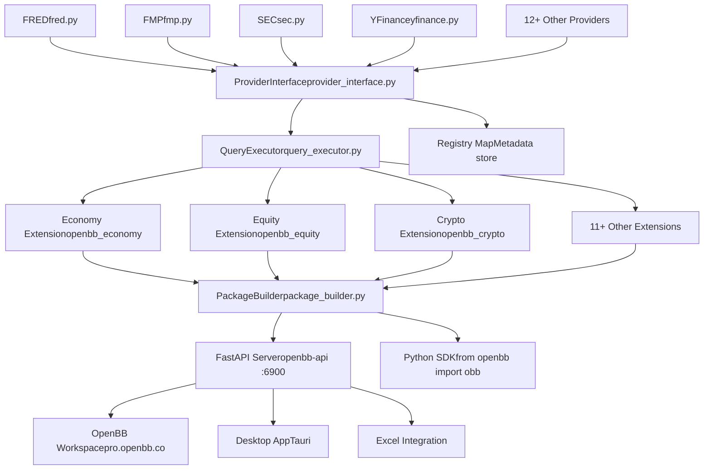
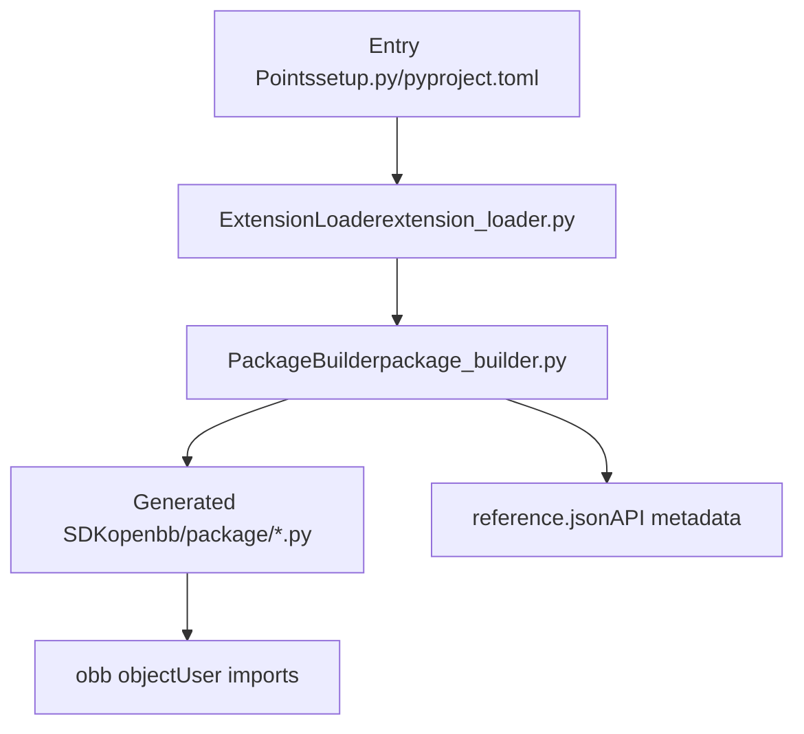
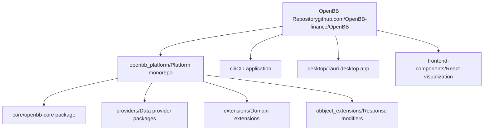

# Overview

Relevant source files

-   [.pre-commit-config.yaml](https://github.com/OpenBB-finance/OpenBB/blob/dddc3b32/.pre-commit-config.yaml)
-   [README.md](https://github.com/OpenBB-finance/OpenBB/blob/dddc3b32/README.md?plain=1)
-   [cli/poetry.lock](https://github.com/OpenBB-finance/OpenBB/blob/dddc3b32/cli/poetry.lock)
-   [openbb\_platform/core/openbb/assets/reference.json](https://github.com/OpenBB-finance/OpenBB/blob/dddc3b32/openbb_platform/core/openbb/assets/reference.json)
-   [openbb\_platform/core/poetry.lock](https://github.com/OpenBB-finance/OpenBB/blob/dddc3b32/openbb_platform/core/poetry.lock)
-   [openbb\_platform/core/pyproject.toml](https://github.com/OpenBB-finance/OpenBB/blob/dddc3b32/openbb_platform/core/pyproject.toml)
-   [openbb\_platform/dev\_install.py](https://github.com/OpenBB-finance/OpenBB/blob/dddc3b32/openbb_platform/dev_install.py)
-   [openbb\_platform/extensions/devtools/poetry.lock](https://github.com/OpenBB-finance/OpenBB/blob/dddc3b32/openbb_platform/extensions/devtools/poetry.lock)
-   [openbb\_platform/extensions/devtools/pyproject.toml](https://github.com/OpenBB-finance/OpenBB/blob/dddc3b32/openbb_platform/extensions/devtools/pyproject.toml)
-   [openbb\_platform/poetry.lock](https://github.com/OpenBB-finance/OpenBB/blob/dddc3b32/openbb_platform/poetry.lock)
-   [openbb\_platform/providers/yfinance/poetry.lock](https://github.com/OpenBB-finance/OpenBB/blob/dddc3b32/openbb_platform/providers/yfinance/poetry.lock)
-   [openbb\_platform/pyproject.toml](https://github.com/OpenBB-finance/OpenBB/blob/dddc3b32/openbb_platform/pyproject.toml)

This document introduces the OpenBB Platform and its underlying Open Data Platform (ODP) architecture. It explains the fundamental "connect once, consume everywhere" design philosophy and provides an overview of the major system components and their relationships.

For installation and setup instructions, see [Installation and Setup](/OpenBB-finance/OpenBB/1.1-installation-and-setup). For quick examples of using the platform, see [Quick Start Guide](/OpenBB-finance/OpenBB/1.2-quick-start-guide). For detailed architecture documentation, see [Core Architecture](/OpenBB-finance/OpenBB/2-core-architecture).

---

## What is the Open Data Platform?

The **Open Data Platform (ODP)** is an open-source infrastructure layer that enables data engineers to integrate proprietary, licensed, and public data sources once, then expose that data to multiple downstream applications simultaneously. Instead of building separate data integrations for Python notebooks, web dashboards, Excel spreadsheets, and AI agents, ODP acts as a unified abstraction layer that connects data providers to consumption surfaces.

The platform operates on a **"connect once, consume everywhere"** principle: data integrations are implemented once as providers, then automatically become available through:

-   Python SDK (`openbb` package)
-   REST API server (`openbb-api` command)
-   OpenBB Workspace (enterprise UI at pro.openbb.co)
-   Excel integration
-   MCP servers for AI agents
-   Desktop application (Tauri-based)

Sources: [README.md1-20](https://github.com/OpenBB-finance/OpenBB/blob/dddc3b32/README.md?plain=1#L1-L20)

---

## High-Level Architecture

The OpenBB Platform consists of four primary architectural layers that work together to enable the "connect once, consume everywhere" model:

### Architecture Layers Diagram


Sources: [README.md18-44](https://github.com/OpenBB-finance/OpenBB/blob/dddc3b32/README.md?plain=1#L18-L44) [openbb\_platform/core/pyproject.toml1-36](https://github.com/OpenBB-finance/OpenBB/blob/dddc3b32/openbb_platform/core/pyproject.toml#L1-L36) [openbb\_platform/pyproject.toml1-118](https://github.com/OpenBB-finance/OpenBB/blob/dddc3b32/openbb_platform/pyproject.toml#L1-L118)

---

## Core Components

### 1\. Data Integration Layer

The platform supports **12+ data providers** that integrate various data sources:

| Provider Type | Examples | Package Location |
| --- | --- | --- |
| Economic Data | FRED, Federal Reserve, OECD, IMF | `openbb_platform/providers/fred/`, `openbb_platform/providers/federal_reserve/` |
| Financial Data | FMP, Intrinio, Benzinga, YFinance | `openbb_platform/providers/fmp/`, `openbb_platform/providers/intrinio/` |
| Regulatory Data | SEC, Congress.gov | `openbb_platform/providers/sec/`, `openbb_platform/providers/congress_gov/` |
| Community | CBOE, TMX, Nasdaq, Alpha Vantage | `openbb_platform/providers/cboe/`, `openbb_platform/providers/tmx/` |

Each provider implements a standardized interface defined by `ProviderInterface` in [openbb\_platform/core/openbb\_core/app/provider\_interface.py](https://github.com/OpenBB-finance/OpenBB/blob/dddc3b32/openbb_platform/core/openbb_core/app/provider_interface.py) allowing multiple providers to supply the same type of data (e.g., historical equity prices) while preserving provider-specific capabilities.

Sources: [openbb\_platform/pyproject.toml16-62](https://github.com/OpenBB-finance/OpenBB/blob/dddc3b32/openbb_platform/pyproject.toml#L16-L62)

### 2\. Platform Core (`openbb-core`)

The **openbb-core** package [openbb\_platform/core/](https://github.com/OpenBB-finance/OpenBB/blob/dddc3b32/openbb_platform/core/) provides the foundational infrastructure:

-   **ProviderInterface**: Singleton coordinator that manages provider registration and query routing
-   **QueryExecutor**: Executes three-stage data fetching pipeline (transform\_query → aextract\_data → transform\_data)
-   **Router System**: Decorators and command mapping for API endpoint generation
-   **OBBject**: Standardized response wrapper with conversion methods (`.to_dataframe()`, `.to_dict()`)
-   **Settings Management**: System and user configuration via `SystemSettings` and `UserSettings`

The core is dependency-injected into all extensions and providers, ensuring consistent behavior across the platform.

Sources: [openbb\_platform/core/pyproject.toml1-36](https://github.com/OpenBB-finance/OpenBB/blob/dddc3b32/openbb_platform/core/pyproject.toml#L1-L36)

### 3\. Extension System

Extensions organize platform functionality by financial domain:

| Extension | Purpose | Package |
| --- | --- | --- |
| `openbb_economy` | Economic indicators, calendars, FRED data | `openbb_platform/extensions/economy/` |
| `openbb_equity` | Stock prices, fundamentals, ownership | `openbb_platform/extensions/equity/` |
| `openbb_crypto` | Cryptocurrency prices and data | `openbb_platform/extensions/crypto/` |
| `openbb_derivatives` | Options, futures data | `openbb_platform/extensions/derivatives/` |
| `openbb_etf` | ETF holdings, prices | `openbb_platform/extensions/etf/` |

Extensions are discovered via Python entry points and loaded by `ExtensionLoader`. Each extension registers routers that define commands accessible through the SDK and API.

Sources: [openbb\_platform/pyproject.toml34-66](https://github.com/OpenBB-finance/OpenBB/blob/dddc3b32/openbb_platform/pyproject.toml#L34-L66)

### 4\. Dynamic Code Generation

The **PackageBuilder** [openbb\_platform/core/openbb\_core/app/static/package\_builder.py](https://github.com/OpenBB-finance/OpenBB/blob/dddc3b32/openbb_platform/core/openbb_core/app/static/package_builder.py) dynamically generates Python SDK code based on installed extensions:


When extensions are installed or removed, the builder regenerates SDK modules to expose the appropriate commands. This enables the "plugin" architecture where functionality can be added without modifying core code.

The `AUTO_BUILD` configuration flag determines whether the platform automatically rebuilds on startup when extension changes are detected.

Sources: [openbb\_platform/core/pyproject.toml30-31](https://github.com/OpenBB-finance/OpenBB/blob/dddc3b32/openbb_platform/core/pyproject.toml#L30-L31)

---

## Key Code Entities

Understanding these core code entities helps navigate the codebase:

| Entity | Type | Location | Purpose |
| --- | --- | --- | --- |
| `openbb_core` | Package | `openbb_platform/core/` | Core platform infrastructure |
| `obb` | Object | Generated dynamically | Main entry point for Python SDK users |
| `ProviderInterface` | Class | `openbb_core/app/provider_interface.py` | Coordinates provider registration and queries |
| `Router` | Decorator | `openbb_core/app/router.py` | Marks functions as API/SDK commands |
| `OBBject` | Class | `openbb_core/app/model/obbject.py` | Standardized response container |
| `PackageBuilder` | Class | `openbb_core/app/static/package_builder.py` | Generates SDK code from extensions |
| `CommandRunner` | Class | `openbb_core/app/command_runner.py` | Executes commands with validation |
| `QueryExecutor` | Class | Provider implementations | Three-stage data fetching pattern |

Sources: [openbb\_platform/core/pyproject.toml1-36](https://github.com/OpenBB-finance/OpenBB/blob/dddc3b32/openbb_platform/core/pyproject.toml#L1-L36) [openbb\_platform/core/openbb/assets/reference.json1-15](https://github.com/OpenBB-finance/OpenBB/blob/dddc3b32/openbb_platform/core/openbb/assets/reference.json#L1-L15)

---

## Installation and Basic Usage

The platform is distributed via PyPI as the `openbb` package:

```
pip install openbb
```
For all providers and extensions:

```
pip install "openbb[all]"
```
Basic usage in Python:

```
from openbb import obb # Fetch equity historical prices (uses default provider)result = obb.equity.price.historical("AAPL") # Convert to pandas DataFramedf = result.to_dataframe()
```
To start the REST API server:

```
openbb-api
```
This launches a FastAPI server at `http://127.0.0.1:6900` with auto-generated OpenAPI documentation.

Sources: [README.md28-34](https://github.com/OpenBB-finance/OpenBB/blob/dddc3b32/README.md?plain=1#L28-L34) [README.md67-79](https://github.com/OpenBB-finance/OpenBB/blob/dddc3b32/README.md?plain=1#L67-L79)

---

## Repository Structure

The repository follows a monorepo structure with clear separation of concerns:


| Directory | Contents |
| --- | --- |
| `openbb_platform/` | Platform monorepo root |
| `openbb_platform/core/` | Core infrastructure (`openbb-core`) |
| `openbb_platform/providers/` | Data provider implementations (12+ providers) |
| `openbb_platform/extensions/` | Domain-specific extensions (economy, equity, etc.) |
| `openbb_platform/obbject_extensions/` | Extensions that modify OBBject behavior (charting) |
| `cli/` | Command-line interface application |
| `desktop/` | Tauri-based desktop application |
| `frontend-components/` | React visualization components (Plotly, Table) |

Sources: [openbb\_platform/pyproject.toml1-118](https://github.com/OpenBB-finance/OpenBB/blob/dddc3b32/openbb_platform/pyproject.toml#L1-L118) [README.md1-214](https://github.com/OpenBB-finance/OpenBB/blob/dddc3b32/README.md?plain=1#L1-L214)

---

## Integration with OpenBB Workspace

While the Open Data Platform is fully open-source and self-contained, it integrates seamlessly with **OpenBB Workspace**, a commercial enterprise UI for visualization and AI agents.

The integration works by:

1.  Running the local API server (`openbb-api` at `127.0.0.1:6900`)
2.  Connecting OpenBB Workspace to the local backend
3.  Workspace automatically discovers available commands via OpenAPI spec
4.  Widget system generates UI components from `widgets.json`

This architecture maintains **data sovereignty** (data stays on user's machine) while leveraging cloud-based UI capabilities.

Sources: [README.md40-96](https://github.com/OpenBB-finance/OpenBB/blob/dddc3b32/README.md?plain=1#L40-L96)

---

## Development Model

The platform uses **Poetry** for dependency management and supports local development installation via the `dev_install.py` script [openbb\_platform/dev\_install.py](https://github.com/OpenBB-finance/OpenBB/blob/dddc3b32/openbb_platform/dev_install.py) This script:

1.  Temporarily modifies `pyproject.toml` to use local path dependencies
2.  Regenerates `poetry.lock` with local packages
3.  Installs dependencies in development mode
4.  Restores original configuration files after installation

Quality assurance is enforced through:

-   **Pre-commit hooks** [.pre-commit-config.yaml1-95](https://github.com/OpenBB-finance/OpenBB/blob/dddc3b32/.pre-commit-config.yaml#L1-L95) running Black, Ruff, MyPy, Pylint
-   **GitHub Actions** workflows for linting, testing, and deployment
-   **VCR cassettes** for deterministic integration tests
-   **Nightly builds** with date-based versioning

Sources: [openbb\_platform/dev\_install.py1-215](https://github.com/OpenBB-finance/OpenBB/blob/dddc3b32/openbb_platform/dev_install.py#L1-L215) [.pre-commit-config.yaml1-95](https://github.com/OpenBB-finance/OpenBB/blob/dddc3b32/.pre-commit-config.yaml#L1-L95)

---

## Next Steps

This overview has introduced the fundamental architecture and components of the OpenBB Platform. For more detailed information:

-   **Installation**: See [Installation and Setup](/OpenBB-finance/OpenBB/1.1-installation-and-setup) for detailed installation options
-   **Usage Examples**: See [Quick Start Guide](/OpenBB-finance/OpenBB/1.2-quick-start-guide) for common use cases
-   **Architecture Deep Dive**: See [Core Architecture](/OpenBB-finance/OpenBB/2-core-architecture) for detailed component interactions
-   **Extension Development**: See [Creating Extensions](/OpenBB-finance/OpenBB/6.3-creating-extensions) for building custom extensions
-   **Provider Integration**: See [Provider Architecture](/OpenBB-finance/OpenBB/2.3-provider-architecture) for adding new data sources

Sources: [README.md1-214](https://github.com/OpenBB-finance/OpenBB/blob/dddc3b32/README.md?plain=1#L1-L214)
