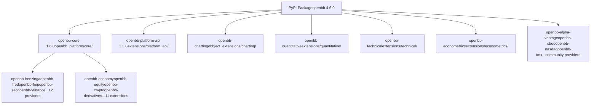
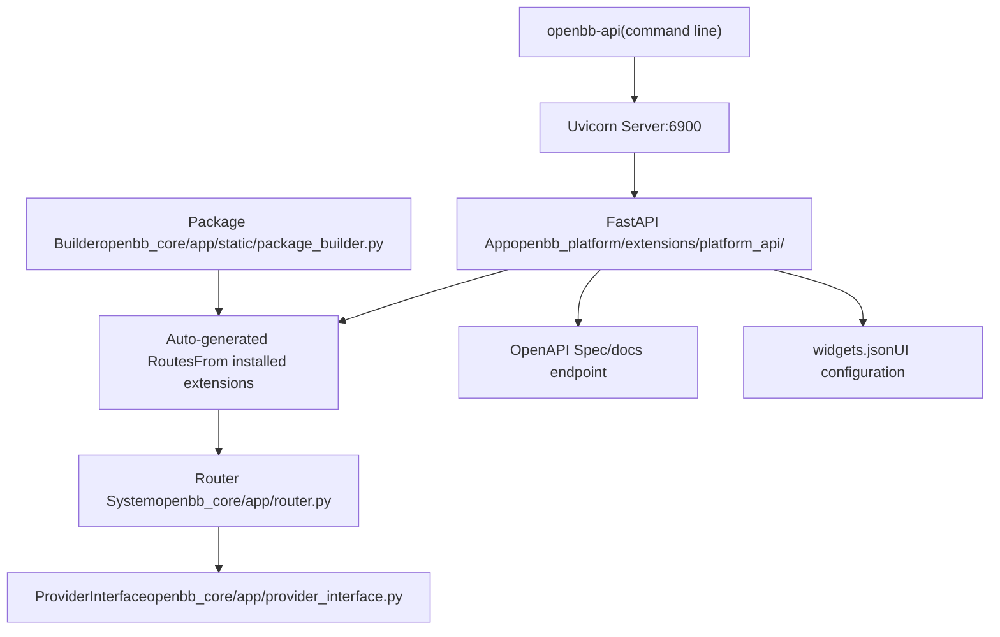
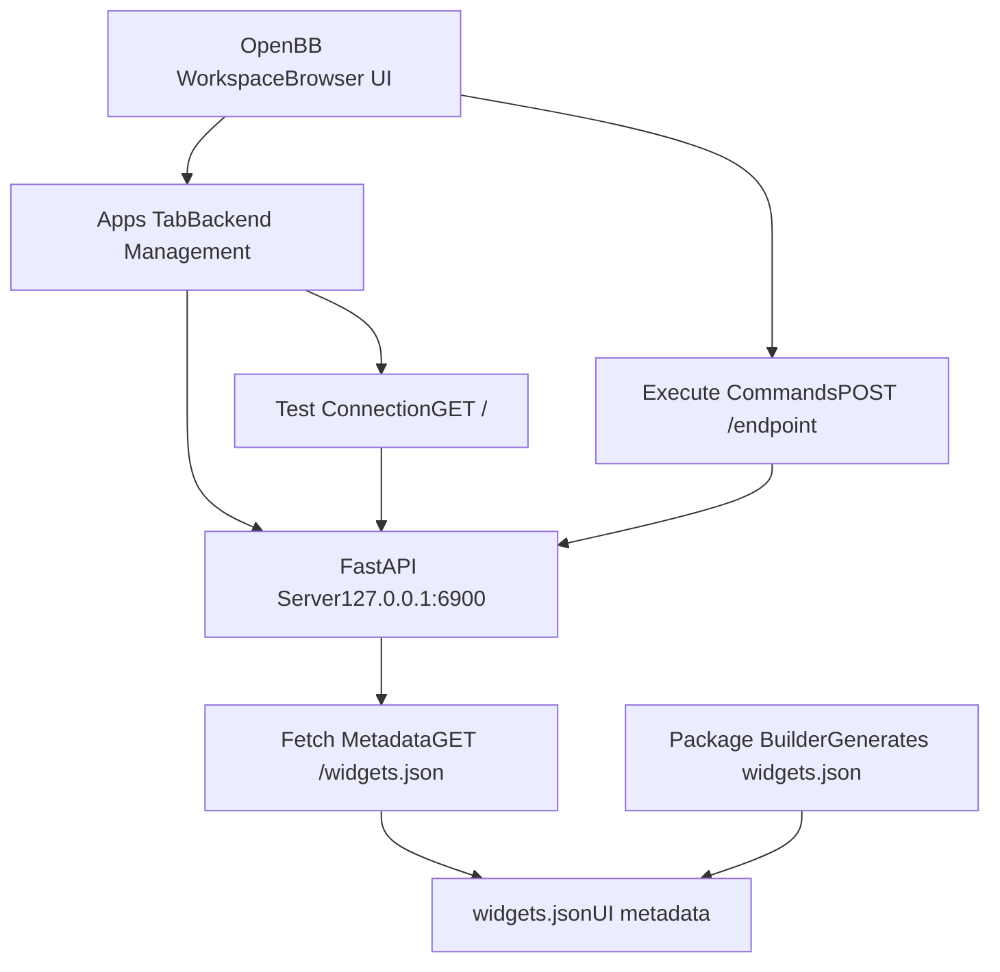
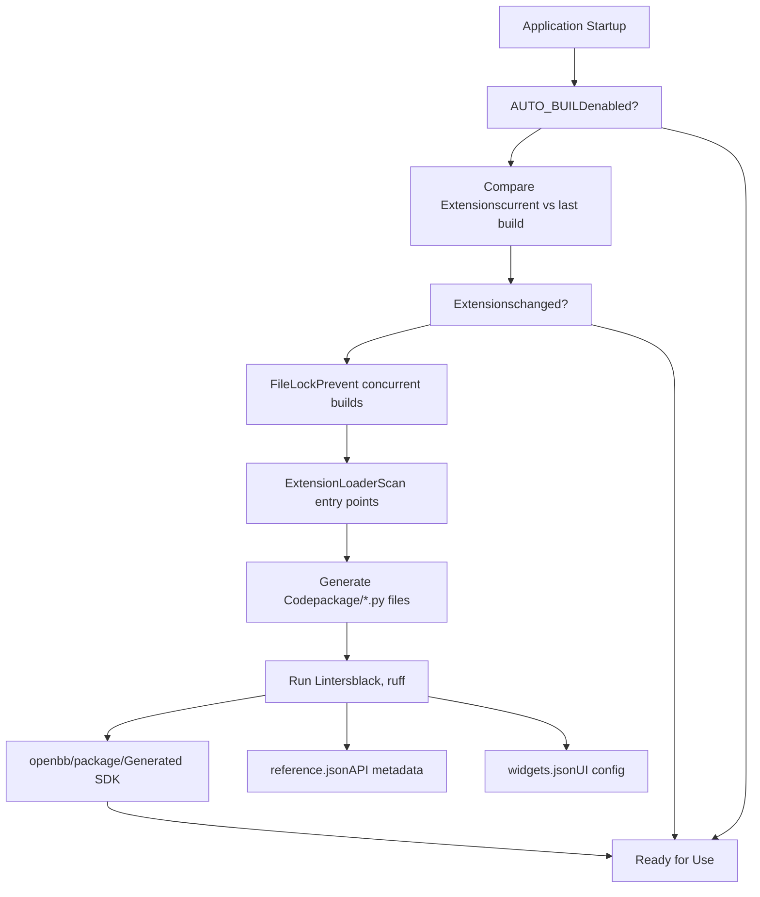
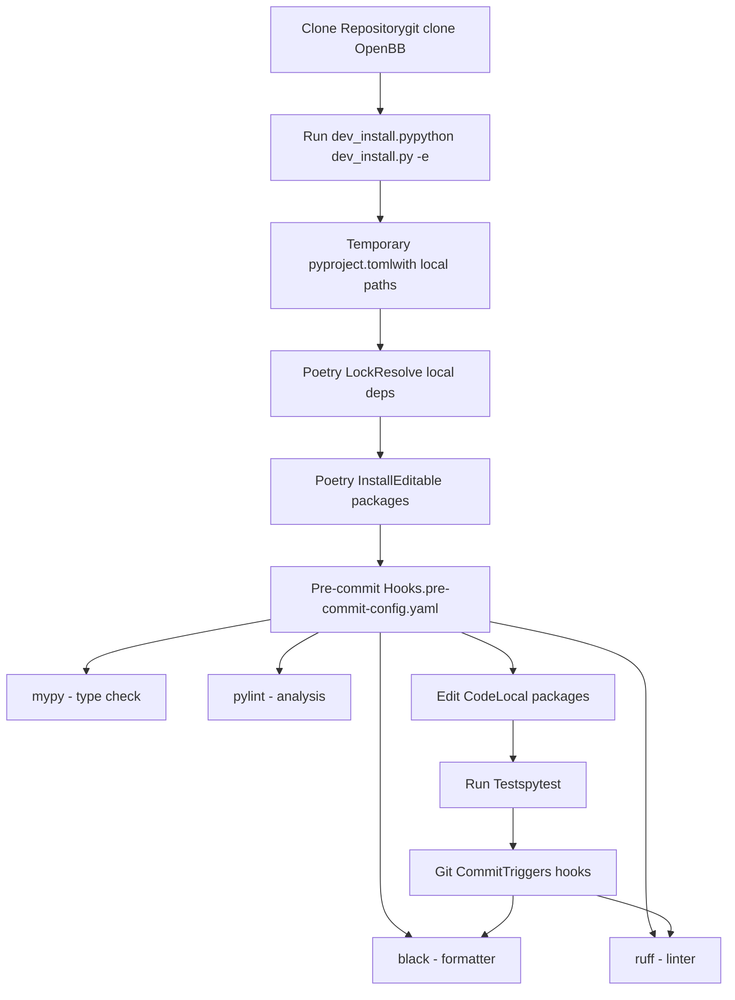

# Installation and Setup

Relevant source files

-   [.pre-commit-config.yaml](https://github.com/OpenBB-finance/OpenBB/blob/dddc3b32/.pre-commit-config.yaml)
-   [README.md](https://github.com/OpenBB-finance/OpenBB/blob/dddc3b32/README.md?plain=1)
-   [cli/poetry.lock](https://github.com/OpenBB-finance/OpenBB/blob/dddc3b32/cli/poetry.lock)
-   [openbb\_platform/core/openbb/assets/reference.json](https://github.com/OpenBB-finance/OpenBB/blob/dddc3b32/openbb_platform/core/openbb/assets/reference.json)
-   [openbb\_platform/core/poetry.lock](https://github.com/OpenBB-finance/OpenBB/blob/dddc3b32/openbb_platform/core/poetry.lock)
-   [openbb\_platform/core/pyproject.toml](https://github.com/OpenBB-finance/OpenBB/blob/dddc3b32/openbb_platform/core/pyproject.toml)
-   [openbb\_platform/dev\_install.py](https://github.com/OpenBB-finance/OpenBB/blob/dddc3b32/openbb_platform/dev_install.py)
-   [openbb\_platform/extensions/devtools/poetry.lock](https://github.com/OpenBB-finance/OpenBB/blob/dddc3b32/openbb_platform/extensions/devtools/poetry.lock)
-   [openbb\_platform/extensions/devtools/pyproject.toml](https://github.com/OpenBB-finance/OpenBB/blob/dddc3b32/openbb_platform/extensions/devtools/pyproject.toml)
-   [openbb\_platform/poetry.lock](https://github.com/OpenBB-finance/OpenBB/blob/dddc3b32/openbb_platform/poetry.lock)
-   [openbb\_platform/providers/yfinance/poetry.lock](https://github.com/OpenBB-finance/OpenBB/blob/dddc3b32/openbb_platform/providers/yfinance/poetry.lock)
-   [openbb\_platform/pyproject.toml](https://github.com/OpenBB-finance/OpenBB/blob/dddc3b32/openbb_platform/pyproject.toml)

This page covers installing the OpenBB Platform, running the API server, and connecting to OpenBB Workspace. For information about the CLI installation, see the OpenBB documentation. For details on the build system and package generation, see [Package Builder and Code Generation](/OpenBB-finance/OpenBB/2.4-package-builder-and-code-generation).

---

## Installation Methods

The OpenBB Platform is distributed as a Python package on PyPI and can be installed in multiple ways depending on your use case.

### Standard Installation

The simplest installation includes the core platform and standard data providers:

```
pip install openbb
```
This installs the `openbb` package which includes:

-   **openbb-core** - Core platform functionality ([openbb\_platform/core/pyproject.toml1-36](https://github.com/OpenBB-finance/OpenBB/blob/dddc3b32/openbb_platform/core/pyproject.toml#L1-L36))
-   **openbb-platform-api** - FastAPI REST API server ([openbb\_platform/pyproject.toml14](https://github.com/OpenBB-finance/OpenBB/blob/dddc3b32/openbb_platform/pyproject.toml#L14-L14))
-   Standard providers: benzinga, bls, cftc, econdb, federal-reserve, fmp, fred, intrinio, sec, yfinance, and others ([openbb\_platform/pyproject.toml16-32](https://github.com/OpenBB-finance/OpenBB/blob/dddc3b32/openbb_platform/pyproject.toml#L16-L32))
-   Standard extensions: commodity, crypto, currency, derivatives, economy, equity, etf, fixedincome, index, news, regulators ([openbb\_platform/pyproject.toml34-44](https://github.com/OpenBB-finance/OpenBB/blob/dddc3b32/openbb_platform/pyproject.toml#L34-L44))

**Python Version Requirement**: Python 3.10 to 3.12 ([openbb\_platform/pyproject.toml12](https://github.com/OpenBB-finance/OpenBB/blob/dddc3b32/openbb_platform/pyproject.toml#L12-L12))

### Installation with Extensions

To install all optional extensions and community providers:

```
pip install "openbb[all]"
```
The `[all]` extra includes additional providers and extensions defined in the extras section ([openbb\_platform/pyproject.toml92-113](https://github.com/OpenBB-finance/OpenBB/blob/dddc3b32/openbb_platform/pyproject.toml#L92-L113)):

-   Community providers: alpha-vantage, biztoc, cboe, deribit, ecb, finra, finviz, nasdaq, tmx, tradier, wsj
-   Analysis extensions: charting, econometrics, quantitative, technical
-   MCP server extension

Individual extras can be installed selectively:

```
pip install "openbb[charting,quantitative]"
```
**Installation Architecture Diagram**


**Sources**: [openbb\_platform/pyproject.toml1-118](https://github.com/OpenBB-finance/OpenBB/blob/dddc3b32/openbb_platform/pyproject.toml#L1-L118) [README.md28-34](https://github.com/OpenBB-finance/OpenBB/blob/dddc3b32/README.md?plain=1#L28-L34) [README.md113-119](https://github.com/OpenBB-finance/OpenBB/blob/dddc3b32/README.md?plain=1#L113-L119)

---

## Running the API Server

The OpenBB Platform includes a FastAPI-based REST API server that exposes all platform functionality over HTTP.

### Starting the Server

After installation, start the API server with:

```
openbb-api
```
This launches a Uvicorn server at `http://127.0.0.1:6900` by default ([README.md73-79](https://github.com/OpenBB-finance/OpenBB/blob/dddc3b32/README.md?plain=1#L73-L79)).

The `openbb-api` command is registered as a script entry point in the platform-api extension. The server provides:

-   Auto-generated OpenAPI specification at `http://127.0.0.1:6900/docs`
-   RESTful access to all installed extensions and providers
-   Widget metadata generation for OpenBB Workspace integration

### API Server Components


**Verification**: Visit `http://127.0.0.1:6900` to confirm the server is running ([README.md79](https://github.com/OpenBB-finance/OpenBB/blob/dddc3b32/README.md?plain=1#L79-L79)).

**Sources**: [README.md71-79](https://github.com/OpenBB-finance/OpenBB/blob/dddc3b32/README.md?plain=1#L71-L79) [openbb\_platform/core/pyproject.toml30-31](https://github.com/OpenBB-finance/OpenBB/blob/dddc3b32/openbb_platform/core/pyproject.toml#L30-L31)

---

## Connecting to OpenBB Workspace

OpenBB Workspace ([https://pro.openbb.co](https://pro.openbb.co)) is the enterprise UI that connects to a local API backend, implementing the "connect once, consume everywhere" architecture.

### Connection Setup

**Step 1: Start the Local Backend**

```
pip install "openbb[all]"openbb-api
```
The server must be running at `http://127.0.0.1:6900` ([README.md66-77](https://github.com/OpenBB-finance/OpenBB/blob/dddc3b32/README.md?plain=1#L66-L77)).

**Step 2: Connect from Workspace**

1.  Sign in to OpenBB Workspace at [https://pro.openbb.co](https://pro.openbb.co)
2.  Navigate to the "Apps" tab
3.  Click "Connect backend"
4.  Fill in the connection form:
    -   **Name**: Open Data Platform
    -   **URL**: [http://127.0.0.1:6900](http://127.0.0.1:6900)
5.  Click "Test" - should return "Test successful" with the number of apps found
6.  Click "Add"

([README.md83-94](https://github.com/OpenBB-finance/OpenBB/blob/dddc3b32/README.md?plain=1#L83-L94))

### Connection Architecture


**Data Sovereignty**: The OpenBB Workspace UI runs in the cloud, but all data processing occurs locally. The workspace only receives results from your local backend ([README.md40-53](https://github.com/OpenBB-finance/OpenBB/blob/dddc3b32/README.md?plain=1#L40-L53)).

**Sources**: [README.md59-96](https://github.com/OpenBB-finance/OpenBB/blob/dddc3b32/README.md?plain=1#L59-L96) [openbb\_platform/extensions/platform\_api/README.md](https://github.com/OpenBB-finance/OpenBB/blob/dddc3b32/openbb_platform/extensions/platform_api/README.md?plain=1)

---

## Configuration and Build System

### Environment Configuration

The platform uses environment variables and configuration files for customization. Key configuration aspects:

| Configuration Type | Location | Purpose |
| --- | --- | --- |
| User Settings | Runtime loaded | Provider credentials, preferences |
| System Settings | Runtime loaded | Logging, caching, AUTO\_BUILD |
| Provider Credentials | User-specific | API keys for data providers |

### AUTO\_BUILD Setting

The platform includes an automatic rebuild system that detects changes in installed extensions:

-   **AUTO\_BUILD=true** (default): On startup, compares installed extensions with the last build and triggers a rebuild if changes are detected
-   **AUTO\_BUILD=false**: Skips automatic rebuilds, requiring manual `openbb-build` command

The build process is managed by the `PackageBuilder` class ([openbb\_platform/core/openbb\_core/app/static/package\_builder.py](https://github.com/OpenBB-finance/OpenBB/blob/dddc3b32/openbb_platform/core/openbb_core/app/static/package_builder.py)) which generates Python SDK modules dynamically based on installed extensions.

**Build Process Diagram**


**Sources**: [openbb\_platform/core/openbb\_core/app/static/package\_builder.py](https://github.com/OpenBB-finance/OpenBB/blob/dddc3b32/openbb_platform/core/openbb_core/app/static/package_builder.py) [openbb\_platform/core/pyproject.toml30-31](https://github.com/OpenBB-finance/OpenBB/blob/dddc3b32/openbb_platform/core/pyproject.toml#L30-L31)

---

## Development Setup

For contributors developing the OpenBB Platform itself, a development installation script is provided.

### Development Installation Script

The `dev_install.py` script configures the platform to use local path dependencies instead of PyPI packages ([openbb\_platform/dev\_install.py1-215](https://github.com/OpenBB-finance/OpenBB/blob/dddc3b32/openbb_platform/dev_install.py#L1-L215)):

```
python dev_install.py
```
**Options**:

-   `-e` or `--extras`: Install all development dependencies from all packages
-   `-c` or `--cli`: Also set up the CLI for development

### What the Script Does

**Development Dependencies Table**

| Component | Type | Path | Purpose |
| --- | --- | --- | --- |
| openbb-core | Core | `./core` | Platform core with develop=true |
| openbb-platform-api | Extension | `./extensions/platform_api` | API server |
| openbb-devtools | Extension | `./extensions/devtools` | Dev tools (pytest, ruff, mypy) |
| Standard Providers | Providers | `./providers/*` | 15+ providers as local paths |
| Standard Extensions | Extensions | `./extensions/*` | 11+ extensions as local paths |
| Optional Providers | Providers | `./providers/*` | Community providers |
| Optional Extensions | Extensions | `./extensions/*` | Analysis extensions |

The script ([openbb\_platform/dev\_install.py113-165](https://github.com/OpenBB-finance/OpenBB/blob/dddc3b32/openbb_platform/dev_install.py#L113-L165)):

1.  **Backs up original files**: Saves `pyproject.toml` and `poetry.lock`
2.  **Injects local dependencies**: Replaces PyPI dependencies with local paths ([openbb\_platform/dev\_install.py18-77](https://github.com/OpenBB-finance/OpenBB/blob/dddc3b32/openbb_platform/dev_install.py#L18-L77))
3.  **Aggregates dev dependencies**: Collects development dependencies from all packages ([openbb\_platform/dev\_install.py102-110](https://github.com/OpenBB-finance/OpenBB/blob/dddc3b32/openbb_platform/dev_install.py#L102-L110))
4.  **Runs poetry**: Executes `poetry lock --regenerate` and `poetry install`
5.  **Restores originals**: Reverts files to original state after installation ([openbb\_platform/dev\_install.py158-164](https://github.com/OpenBB-finance/OpenBB/blob/dddc3b32/openbb_platform/dev_install.py#L158-L164))

### Development Dependencies

The devtools extension provides all development tools ([openbb\_platform/extensions/devtools/pyproject.toml11-30](https://github.com/OpenBB-finance/OpenBB/blob/dddc3b32/openbb_platform/extensions/devtools/pyproject.toml#L11-L30)):

**Linting & Formatting**:

-   `ruff` - Fast Python linter ([.pre-commit-config.yaml17-20](https://github.com/OpenBB-finance/OpenBB/blob/dddc3b32/.pre-commit-config.yaml#L17-L20))
-   `black` - Code formatter ([.pre-commit-config.yaml13-16](https://github.com/OpenBB-finance/OpenBB/blob/dddc3b32/.pre-commit-config.yaml#L13-L16))
-   `pylint` - Comprehensive linter
-   `mypy` - Type checking ([.pre-commit-config.yaml45-57](https://github.com/OpenBB-finance/OpenBB/blob/dddc3b32/.pre-commit-config.yaml#L45-L57))
-   `pydocstyle` - Docstring conventions ([.pre-commit-config.yaml21-32](https://github.com/OpenBB-finance/OpenBB/blob/dddc3b32/.pre-commit-config.yaml#L21-L32))

**Testing**:

-   `pytest` - Test framework
-   `pytest-recorder` - VCR cassette recording
-   `pytest-asyncio` - Async test support
-   `pytest-cov` - Coverage reporting

**Pre-commit Integration**: All quality checks are enforced via pre-commit hooks ([.pre-commit-config.yaml1-95](https://github.com/OpenBB-finance/OpenBB/blob/dddc3b32/.pre-commit-config.yaml#L1-L95)):

```
pre-commit install
```
### Development Workflow Diagram


**Sources**: [openbb\_platform/dev\_install.py1-215](https://github.com/OpenBB-finance/OpenBB/blob/dddc3b32/openbb_platform/dev_install.py#L1-L215) [openbb\_platform/extensions/devtools/pyproject.toml1-36](https://github.com/OpenBB-finance/OpenBB/blob/dddc3b32/openbb_platform/extensions/devtools/pyproject.toml#L1-L36) [.pre-commit-config.yaml1-95](https://github.com/OpenBB-finance/OpenBB/blob/dddc3b32/.pre-commit-config.yaml#L1-L95)

---

## Verification and Troubleshooting

### Verifying Installation

**Python SDK**:

```
from openbb import obboutput = obb.equity.price.historical("AAPL")df = output.to_dataframe()print(df.head())
```
**API Server**:

```
curl http://127.0.0.1:6900/
```
**Workspace Connection**:

1.  Workspace test should return success message
2.  Check that widgets appear in the Apps tab
3.  Try executing a command from the Workspace UI

### Common Issues

| Issue | Cause | Solution |
| --- | --- | --- |
| Python version error | Python < 3.10 or >= 4.0 | Install Python 3.10-3.12 |
| Import errors | Missing dependencies | Run `pip install "openbb[all]"` |
| API server won't start | Port 6900 in use | Use different port or kill existing process |
| Workspace can't connect | Server not running | Verify `openbb-api` is running at :6900 |
| Build failures in dev | Corrupted lock files | Delete poetry.lock and re-run dev\_install.py |

### Build Command

For manual package rebuilds without starting the application:

```
openbb-build
```
This command is registered by openbb-core ([openbb\_platform/core/pyproject.toml30-31](https://github.com/OpenBB-finance/OpenBB/blob/dddc3b32/openbb_platform/core/pyproject.toml#L30-L31)) and triggers the PackageBuilder directly.

**Sources**: [README.md28-34](https://github.com/OpenBB-finance/OpenBB/blob/dddc3b32/README.md?plain=1#L28-L34) [README.md73-79](https://github.com/OpenBB-finance/OpenBB/blob/dddc3b32/README.md?plain=1#L73-L79) [README.md83-94](https://github.com/OpenBB-finance/OpenBB/blob/dddc3b32/README.md?plain=1#L83-L94) [openbb\_platform/core/pyproject.toml30-31](https://github.com/OpenBB-finance/OpenBB/blob/dddc3b32/openbb_platform/core/pyproject.toml#L30-L31)
