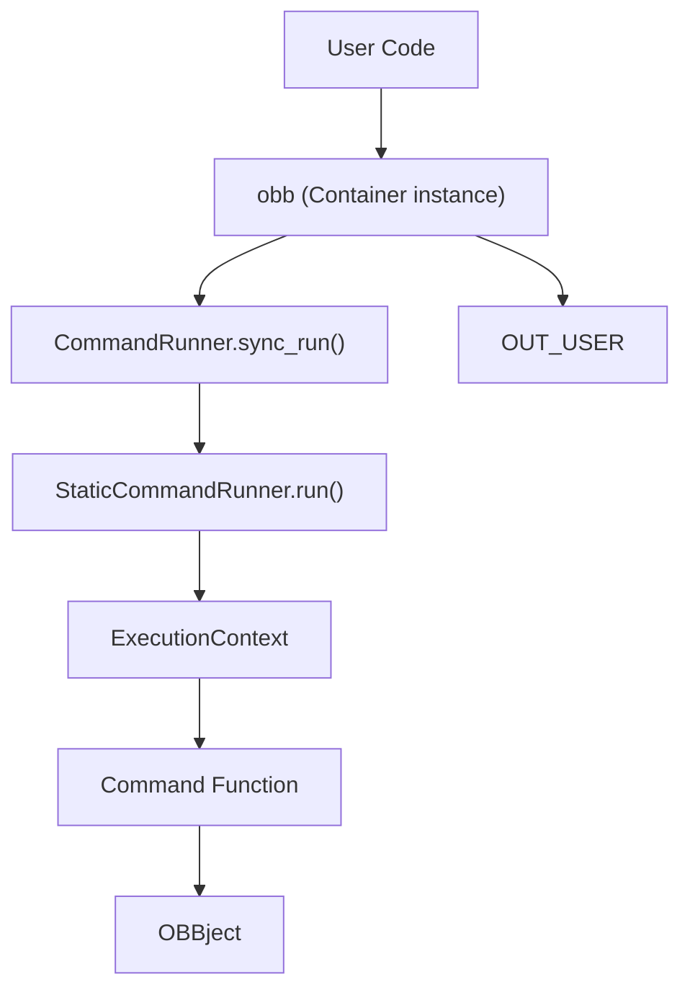
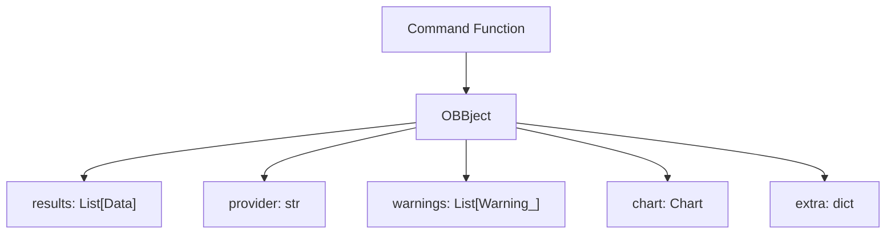
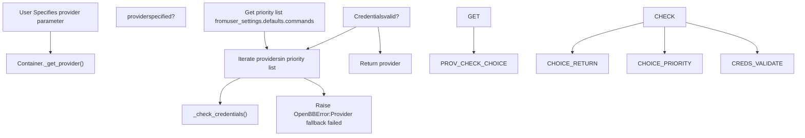
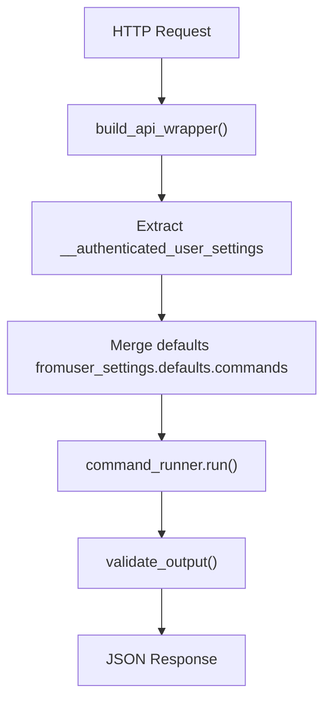
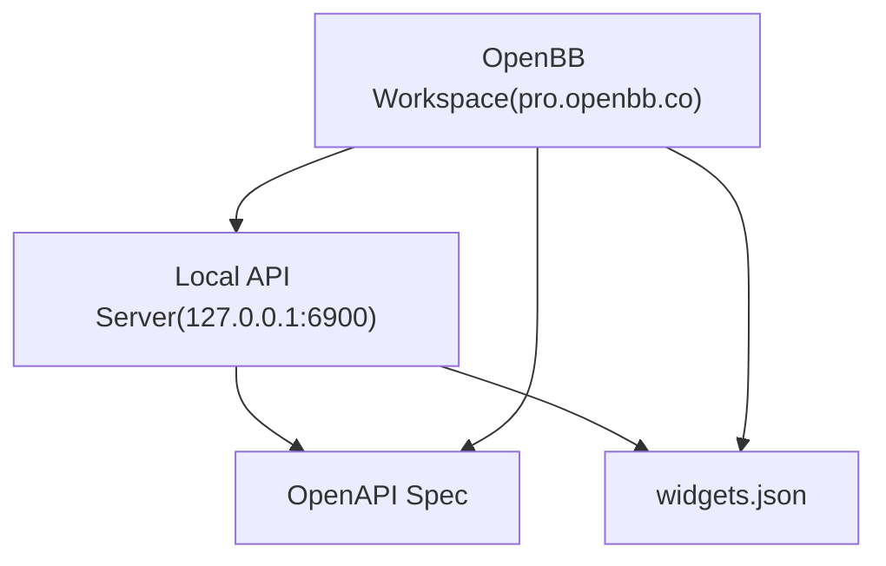

# Quick Start Guide

Relevant source files

-   [.pre-commit-config.yaml](https://github.com/OpenBB-finance/OpenBB/blob/dddc3b32/.pre-commit-config.yaml)
-   [README.md](https://github.com/OpenBB-finance/OpenBB/blob/dddc3b32/README.md?plain=1)
-   [frontend-components/plotly/src/data/mockup.ts](https://github.com/OpenBB-finance/OpenBB/blob/dddc3b32/frontend-components/plotly/src/data/mockup.ts)
-   [openbb\_platform/core/openbb\_core/api/router/commands.py](https://github.com/OpenBB-finance/OpenBB/blob/dddc3b32/openbb_platform/core/openbb_core/api/router/commands.py)
-   [openbb\_platform/core/openbb\_core/app/command\_runner.py](https://github.com/OpenBB-finance/OpenBB/blob/dddc3b32/openbb_platform/core/openbb_core/app/command_runner.py)
-   [openbb\_platform/core/openbb\_core/app/extension\_loader.py](https://github.com/OpenBB-finance/OpenBB/blob/dddc3b32/openbb_platform/core/openbb_core/app/extension_loader.py)
-   [openbb\_platform/core/openbb\_core/app/logs/handlers\_manager.py](https://github.com/OpenBB-finance/OpenBB/blob/dddc3b32/openbb_platform/core/openbb_core/app/logs/handlers_manager.py)
-   [openbb\_platform/core/openbb\_core/app/logs/logging\_service.py](https://github.com/OpenBB-finance/OpenBB/blob/dddc3b32/openbb_platform/core/openbb_core/app/logs/logging_service.py)
-   [openbb\_platform/core/openbb\_core/app/logs/models/logging\_settings.py](https://github.com/OpenBB-finance/OpenBB/blob/dddc3b32/openbb_platform/core/openbb_core/app/logs/models/logging_settings.py)
-   [openbb\_platform/core/openbb\_core/app/model/abstract/tagged.py](https://github.com/OpenBB-finance/OpenBB/blob/dddc3b32/openbb_platform/core/openbb_core/app/model/abstract/tagged.py)
-   [openbb\_platform/core/openbb\_core/app/model/charts/charting\_settings.py](https://github.com/OpenBB-finance/OpenBB/blob/dddc3b32/openbb_platform/core/openbb_core/app/model/charts/charting_settings.py)
-   [openbb\_platform/core/openbb\_core/app/model/defaults.py](https://github.com/OpenBB-finance/OpenBB/blob/dddc3b32/openbb_platform/core/openbb_core/app/model/defaults.py)
-   [openbb\_platform/core/openbb\_core/app/model/extension.py](https://github.com/OpenBB-finance/OpenBB/blob/dddc3b32/openbb_platform/core/openbb_core/app/model/extension.py)
-   [openbb\_platform/core/openbb\_core/app/model/obbject.py](https://github.com/OpenBB-finance/OpenBB/blob/dddc3b32/openbb_platform/core/openbb_core/app/model/obbject.py)
-   [openbb\_platform/core/openbb\_core/app/model/system\_settings.py](https://github.com/OpenBB-finance/OpenBB/blob/dddc3b32/openbb_platform/core/openbb_core/app/model/system_settings.py)
-   [openbb\_platform/core/openbb\_core/app/service/system\_service.py](https://github.com/OpenBB-finance/OpenBB/blob/dddc3b32/openbb_platform/core/openbb_core/app/service/system_service.py)
-   [openbb\_platform/core/openbb\_core/app/static/container.py](https://github.com/OpenBB-finance/OpenBB/blob/dddc3b32/openbb_platform/core/openbb_core/app/static/container.py)
-   [openbb\_platform/core/openbb\_core/env.py](https://github.com/OpenBB-finance/OpenBB/blob/dddc3b32/openbb_platform/core/openbb_core/env.py)
-   [openbb\_platform/core/tests/app/logs/test\_handlers\_manager.py](https://github.com/OpenBB-finance/OpenBB/blob/dddc3b32/openbb_platform/core/tests/app/logs/test_handlers_manager.py)
-   [openbb\_platform/core/tests/app/logs/test\_logging\_service.py](https://github.com/OpenBB-finance/OpenBB/blob/dddc3b32/openbb_platform/core/tests/app/logs/test_logging_service.py)
-   [openbb\_platform/core/tests/app/model/test\_extension.py](https://github.com/OpenBB-finance/OpenBB/blob/dddc3b32/openbb_platform/core/tests/app/model/test_extension.py)
-   [openbb\_platform/core/tests/app/model/test\_obbject.py](https://github.com/OpenBB-finance/OpenBB/blob/dddc3b32/openbb_platform/core/tests/app/model/test_obbject.py)
-   [openbb\_platform/core/tests/app/model/test\_system\_settings.py](https://github.com/OpenBB-finance/OpenBB/blob/dddc3b32/openbb_platform/core/tests/app/model/test_system_settings.py)
-   [openbb\_platform/core/tests/app/test\_command\_runner.py](https://github.com/OpenBB-finance/OpenBB/blob/dddc3b32/openbb_platform/core/tests/app/test_command_runner.py)
-   [openbb\_platform/obbject\_extensions/charting/openbb\_charting/charts/helpers.py](https://github.com/OpenBB-finance/OpenBB/blob/dddc3b32/openbb_platform/obbject_extensions/charting/openbb_charting/charts/helpers.py)

This guide provides quick examples of common use cases for the OpenBB Platform. It covers basic Python SDK usage, working with data providers, running the API server, and connecting to OpenBB Workspace. For detailed information about the underlying architecture and command execution pipeline, see [Command Execution Pipeline](/OpenBB-finance/OpenBB/2.1-command-execution-pipeline). For provider-specific configurations, see [Provider Interface and Integration](/OpenBB-finance/OpenBB/4.1-provider-interface-and-integration). For complete installation instructions and development setup, see [Installation and Setup](/OpenBB-finance/OpenBB/1.1-installation-and-setup).

---

## Installation

Install the OpenBB Platform Python package from PyPI:

```
pip install openbb
```
For all available providers and extensions:

```
pip install "openbb[all]"
```
The package installation process triggers the `PackageBuilder` to generate the Python SDK interface dynamically based on installed extensions ([openbb\_platform/core/openbb\_core/app/static/package\_builder.py1-500](https://github.com/OpenBB-finance/OpenBB/blob/dddc3b32/openbb_platform/core/openbb_core/app/static/package_builder.py#L1-L500)).

**Sources:** [README.md113-119](https://github.com/OpenBB-finance/OpenBB/blob/dddc3b32/README.md?plain=1#L113-L119) [openbb\_platform/core/openbb\_core/app/static/package\_builder.py](https://github.com/OpenBB-finance/OpenBB/blob/dddc3b32/openbb_platform/core/openbb_core/app/static/package_builder.py)

---

## Basic Python Usage

### Importing and Running Commands

The main entry point is the `obb` object, which provides access to all platform functionality:

```
from openbb import obb # Fetch equity price dataoutput = obb.equity.price.historical("AAPL")
```
The `obb` object is a `Container` instance that wraps the `CommandRunner` ([openbb\_platform/core/openbb\_core/app/static/container.py11-22](https://github.com/OpenBB-finance/OpenBB/blob/dddc3b32/openbb_platform/core/openbb_core/app/static/container.py#L11-L22)). When you call a method like `obb.equity.price.historical()`, the `Container._run()` method ([openbb\_platform/core/openbb\_core/app/static/container.py23-58](https://github.com/OpenBB-finance/OpenBB/blob/dddc3b32/openbb_platform/core/openbb_core/app/static/container.py#L23-L58)) executes the command through the `CommandRunner.sync_run()` method ([openbb\_platform/core/openbb\_core/app/command\_runner.py713-722](https://github.com/OpenBB-finance/OpenBB/blob/dddc3b32/openbb_platform/core/openbb_core/app/command_runner.py#L713-L722)).


**Sources:** [README.md30-34](https://github.com/OpenBB-finance/OpenBB/blob/dddc3b32/README.md?plain=1#L30-L34) [openbb\_platform/core/openbb\_core/app/static/container.py11-58](https://github.com/OpenBB-finance/OpenBB/blob/dddc3b32/openbb_platform/core/openbb_core/app/static/container.py#L11-L58) [openbb\_platform/core/openbb\_core/app/command\_runner.py642-722](https://github.com/OpenBB-finance/OpenBB/blob/dddc3b32/openbb_platform/core/openbb_core/app/command_runner.py#L642-L722)

### Understanding OBBject

All commands return an `OBBject` instance, which wraps the results and provides metadata:

```
output = obb.equity.price.historical("AAPL") # OBBject structureprint(output.results)    # Raw data (List[Data] or similar)print(output.provider)   # Provider used (e.g., 'yfinance')print(output.warnings)   # Any warnings generatedprint(output.chart)      # Chart object if charting extension installedprint(output.extra)      # Extra metadata
```
The `OBBject` class is defined in [openbb\_platform/core/openbb\_core/app/model/obbject.py36-383](https://github.com/OpenBB-finance/OpenBB/blob/dddc3b32/openbb_platform/core/openbb_core/app/model/obbject.py#L36-L383) Key attributes:

| Attribute | Type | Description |
| --- | --- | --- |
| `results` | `T | None` | Serializable results data |
| `provider` | `str | None` | Provider name used for the query |
| `warnings` | `list[Warning_] | None` | List of warnings generated during execution |
| `chart` | `Chart | None` | Chart object if visualization available |
| `extra` | `dict[str, Any]` | Additional metadata including execution info |


**Sources:** [openbb\_platform/core/openbb\_core/app/model/obbject.py36-72](https://github.com/OpenBB-finance/OpenBB/blob/dddc3b32/openbb_platform/core/openbb_core/app/model/obbject.py#L36-L72) [openbb\_platform/core/tests/app/model/test\_obbject.py13-28](https://github.com/OpenBB-finance/OpenBB/blob/dddc3b32/openbb_platform/core/tests/app/model/test_obbject.py#L13-L28)

### Converting Outputs

The `OBBject` provides multiple conversion methods:

```
# Convert to pandas DataFramedf = output.to_dataframe()# ordf = output.to_df() # Convert to dictionarydata_dict = output.to_dict(orient='records') # Convert to polars DataFramepolars_df = output.to_polars() # Convert to numpy arrayarray = output.to_numpy()
```
The `to_dataframe()` method ([openbb\_platform/core/openbb\_core/app/model/obbject.py121-285](https://github.com/OpenBB-finance/OpenBB/blob/dddc3b32/openbb_platform/core/openbb_core/app/model/obbject.py#L121-L285)) handles multiple input formats:

-   `List[BaseModel]`
-   `List[Dict]`
-   `Dict[str, List]`
-   `Dict[str, Dict]`
-   Single `BaseModel` instances

```
# With optional parametersdf = output.to_dataframe(    index="date",        # Set index column    sort_by="value",     # Sort by column    ascending=True       # Sort order)
```
The conversion logic uses `basemodel_to_df()` utility ([openbb\_platform/core/openbb\_core/app/utils.py](https://github.com/OpenBB-finance/OpenBB/blob/dddc3b32/openbb_platform/core/openbb_core/app/utils.py)) for Pydantic models and handles timezone-aware datetime objects correctly ([openbb\_platform/core/tests/app/model/test\_obbject.py269-292](https://github.com/OpenBB-finance/OpenBB/blob/dddc3b32/openbb_platform/core/tests/app/model/test_obbject.py#L269-L292)).

**Sources:** [openbb\_platform/core/openbb\_core/app/model/obbject.py81-336](https://github.com/OpenBB-finance/OpenBB/blob/dddc3b32/openbb_platform/core/openbb_core/app/model/obbject.py#L81-L336) [openbb\_platform/core/tests/app/model/test\_obbject.py59-267](https://github.com/OpenBB-finance/OpenBB/blob/dddc3b32/openbb_platform/core/tests/app/model/test_obbject.py#L59-L267)

---

## Working with Providers

### Specifying a Provider

Many commands support multiple data providers. Specify the provider using the `provider` parameter:

```
# Use Financial Modeling Prepoutput = obb.equity.price.historical("AAPL", provider="fmp") # Use Intriniooutput = obb.equity.price.historical("AAPL", provider="intrinio")
```
The provider selection is handled by `Container._get_provider()` ([openbb\_platform/core/openbb\_core/app/static/container.py68-114](https://github.com/OpenBB-finance/OpenBB/blob/dddc3b32/openbb_platform/core/openbb_core/app/static/container.py#L68-L114)), which:

1.  Checks if the provider is specified
2.  Falls back to the configured priority list in user settings
3.  Validates credentials for each provider in the priority list
4.  Returns the first provider with valid credentials


### Provider-Specific Parameters

Each provider may have specific parameters. These are passed as additional keyword arguments:

```
# FMP-specific parameteroutput = obb.equity.price.historical(    "AAPL",    provider="fmp",    interval="1d"  # FMP-specific interval format)
```
Provider-specific parameters are validated by the `ParametersBuilder.validate_kwargs()` method ([openbb\_platform/core/openbb\_core/app/command\_runner.py181-206](https://github.com/OpenBB-finance/OpenBB/blob/dddc3b32/openbb_platform/core/openbb_core/app/command_runner.py#L181-L206)). Invalid parameters generate an `OpenBBWarning` ([openbb\_platform/core/openbb\_core/app/command\_runner.py146-169](https://github.com/OpenBB-finance/OpenBB/blob/dddc3b32/openbb_platform/core/openbb_core/app/command_runner.py#L146-L169)).

**Sources:** [openbb\_platform/core/openbb\_core/app/static/container.py60-114](https://github.com/OpenBB-finance/OpenBB/blob/dddc3b32/openbb_platform/core/openbb_core/app/static/container.py#L60-L114) [openbb\_platform/core/openbb\_core/app/command\_runner.py146-236](https://github.com/OpenBB-finance/OpenBB/blob/dddc3b32/openbb_platform/core/openbb_core/app/command_runner.py#L146-L236) [README.md36](https://github.com/OpenBB-finance/OpenBB/blob/dddc3b32/README.md?plain=1#L36-L36)

---

## Running the API Server

### Starting the Server

Start the FastAPI server using the `openbb-api` command:

```
openbb-api
```
This launches a Uvicorn server at `http://127.0.0.1:6900` ([README.md73-77](https://github.com/OpenBB-finance/OpenBB/blob/dddc3b32/README.md?plain=1#L73-L77)).

The API server is initialized in [openbb\_platform/core/openbb\_core/api/router/commands.py354-356](https://github.com/OpenBB-finance/OpenBB/blob/dddc3b32/openbb_platform/core/openbb_core/api/router/commands.py#L354-L356):

```
system_settings = SystemService(logging_sub_app="api").system_settingscommand_runner_instance = CommandRunner(system_settings=system_settings)add_command_map(command_runner=command_runner_instance, api_router=router)
```
### API Endpoints

The API automatically generates endpoints for all installed commands. For example:

```
# GET request to fetch equity pricescurl "http://127.0.0.1:6900/equity/price/historical?symbol=AAPL&provider=yfinance"
```
Each endpoint is wrapped by `build_api_wrapper()` ([openbb\_platform/core/openbb\_core/api/router/commands.py212-342](https://github.com/OpenBB-finance/OpenBB/blob/dddc3b32/openbb_platform/core/openbb_core/api/router/commands.py#L212-L342)), which:

1.  Extracts user settings from authentication headers
2.  Merges command defaults from user settings
3.  Executes the command via `CommandRunner.run()`
4.  Validates and serializes the `OBBject` output


**Sources:** [README.md73-79](https://github.com/OpenBB-finance/OpenBB/blob/dddc3b32/README.md?plain=1#L73-L79) [openbb\_platform/core/openbb\_core/api/router/commands.py212-356](https://github.com/OpenBB-finance/OpenBB/blob/dddc3b32/openbb_platform/core/openbb_core/api/router/commands.py#L212-L356) [openbb\_platform/extensions/platform\_api/README.md](https://github.com/OpenBB-finance/OpenBB/blob/dddc3b32/openbb_platform/extensions/platform_api/README.md?plain=1)

### Checking the Server

Verify the server is running:

```
curl http://127.0.0.1:6900
```
The OpenAPI documentation is automatically generated and available at `http://127.0.0.1:6900/docs`.

**Sources:** [README.md79](https://github.com/OpenBB-finance/OpenBB/blob/dddc3b32/README.md?plain=1#L79-L79)

---

## Connecting to OpenBB Workspace

### Backend Integration

The OpenBB Workspace connects to your local API server to access data:

1.  **Start the API server:**

```
openbb-api
```
2.  **Access OpenBB Workspace:**

Navigate to [https://pro.openbb.co](https://pro.openbb.co)

3.  **Connect the backend:**

-   Go to the "Apps" tab
-   Click "Connect backend"
-   Fill in the form:
    -   **Name:** Open Data Platform
    -   **URL:** `http://127.0.0.1:6900`
-   Click "Test" to verify connection
-   Click "Add" to save


The Workspace fetches `widgets.json` from the API server, which defines UI components for each endpoint. This file is generated by the widget generation system from the OpenAPI specification ([openbb\_platform/extensions/platform\_api/README.md](https://github.com/OpenBB-finance/OpenBB/blob/dddc3b32/openbb_platform/extensions/platform_api/README.md?plain=1)).

**Sources:** [README.md59-96](https://github.com/OpenBB-finance/OpenBB/blob/dddc3b32/README.md?plain=1#L59-L96) [openbb\_platform/extensions/platform\_api/README.md](https://github.com/OpenBB-finance/OpenBB/blob/dddc3b32/openbb_platform/extensions/platform_api/README.md?plain=1)

### Data Sovereignty

This architecture maintains data sovereignty: your data queries execute on your local machine, and only the results are displayed in the cloud-based Workspace UI. The API server never sends credentials or raw queries to the Workspace.

**Sources:** [README.md42-50](https://github.com/OpenBB-finance/OpenBB/blob/dddc3b32/README.md?plain=1#L42-L50)

---

## Configuration and Settings

### User Settings

Configure default providers, output formats, and credentials in `~/.openbb_platform/user_settings.json`:

```
{  "credentials": {    "fmp_api_key": "your_api_key"  },  "preferences": {    "output_type": "OBBject",    "show_warnings": true  },  "defaults": {    "commands": {      "equity.price.historical": {        "provider": ["fmp", "yfinance"]      }    }  }}
```
The `UserSettings` model ([openbb\_platform/core/openbb\_core/app/model/user\_settings.py](https://github.com/OpenBB-finance/OpenBB/blob/dddc3b32/openbb_platform/core/openbb_core/app/model/user_settings.py)) is loaded by `UserService.read_from_file()` and used throughout command execution.

### System Settings

System-level settings are stored in `~/.openbb_platform/system_settings.json` and managed by `SystemSettings` ([openbb\_platform/core/openbb\_core/app/model/system\_settings.py22-105](https://github.com/OpenBB-finance/OpenBB/blob/dddc3b32/openbb_platform/core/openbb_core/app/model/system_settings.py#L22-L105)):

```
{  "test_mode": false,  "debug_mode": false,  "logging_suppress": true,  "allow_mutable_extensions": false,  "allow_on_command_output": false}
```
These settings control logging behavior, extension permissions, and system-wide configurations.

**Sources:** [openbb\_platform/core/openbb\_core/app/model/system\_settings.py22-105](https://github.com/OpenBB-finance/OpenBB/blob/dddc3b32/openbb_platform/core/openbb_core/app/model/system_settings.py#L22-L105) [openbb\_platform/core/openbb\_core/app/service/system\_service.py1-110](https://github.com/OpenBB-finance/OpenBB/blob/dddc3b32/openbb_platform/core/openbb_core/app/service/system_service.py#L1-L110) [openbb\_platform/core/openbb\_core/app/constants.py](https://github.com/OpenBB-finance/OpenBB/blob/dddc3b32/openbb_platform/core/openbb_core/app/constants.py)

---

## Quick Reference: Common Commands

```
from openbb import obb # Equity price dataprices = obb.equity.price.historical("AAPL", start_date="2024-01-01") # Company fundamentalsincome = obb.equity.fundamental.income("AAPL", provider="fmp") # Economic datagdp = obb.economy.gdp.real(provider="fred") # Convert to DataFramedf = prices.to_dataframe() # Access specific fieldsprint(prices.provider)print(prices.warnings)
```
### Output Type Control

Control the default output type via user settings or programmatically:

```
# Set output type in code (affects all subsequent commands)obb._command_runner.user_settings.preferences.output_type = "dataframe" # Now commands return DataFrames directlydf = obb.equity.price.historical("AAPL")
```
The `Container._run()` method checks the `output_type` preference ([openbb\_platform/core/openbb\_core/app/static/container.py53-58](https://github.com/OpenBB-finance/OpenBB/blob/dddc3b32/openbb_platform/core/openbb_core/app/static/container.py#L53-L58)) and automatically converts `OBBject` to the desired format using methods like `to_dataframe()`, `to_dict()`, etc.

**Sources:** [openbb\_platform/core/openbb\_core/app/static/container.py23-58](https://github.com/OpenBB-finance/OpenBB/blob/dddc3b32/openbb_platform/core/openbb_core/app/static/container.py#L23-L58) [openbb\_platform/core/openbb\_core/app/model/obbject.py81-336](https://github.com/OpenBB-finance/OpenBB/blob/dddc3b32/openbb_platform/core/openbb_core/app/model/obbject.py#L81-L336)

---

## Next Steps

-   For detailed architecture information, see [Core Architecture](/OpenBB-finance/OpenBB/2-core-architecture)
-   To understand how commands are executed, see [Command Execution Pipeline](/OpenBB-finance/OpenBB/2.1-command-execution-pipeline)
-   To learn about creating custom extensions, see [Creating Extensions](/OpenBB-finance/OpenBB/6.3-creating-extensions)
-   For provider-specific documentation, see [Data Providers](/OpenBB-finance/OpenBB/4-data-providers)
-   To explore the widget system for Workspace integration, see [Widget System](/OpenBB-finance/OpenBB/5.4-widget-system)
