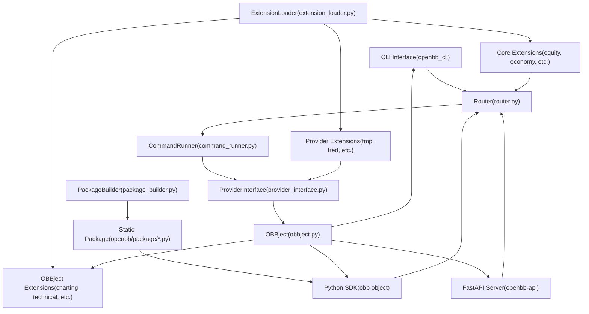
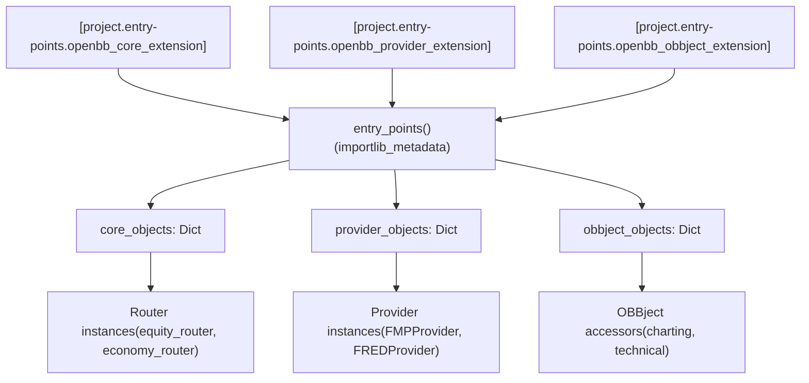
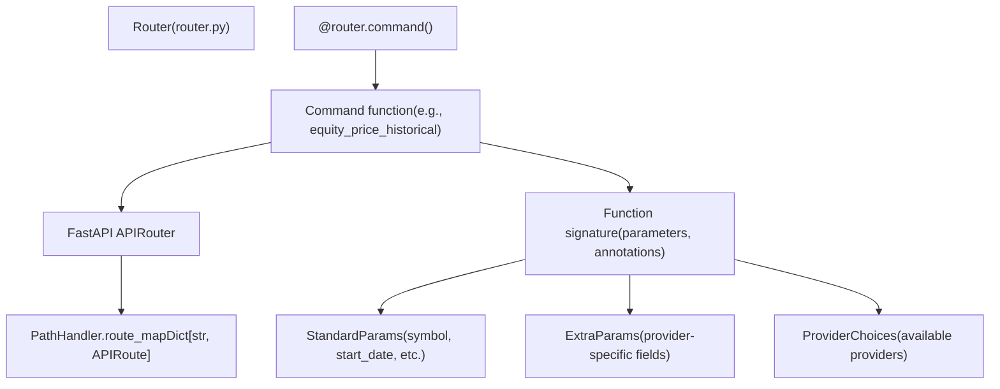
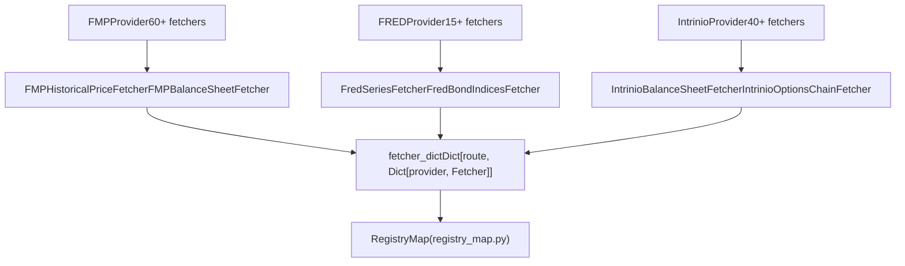
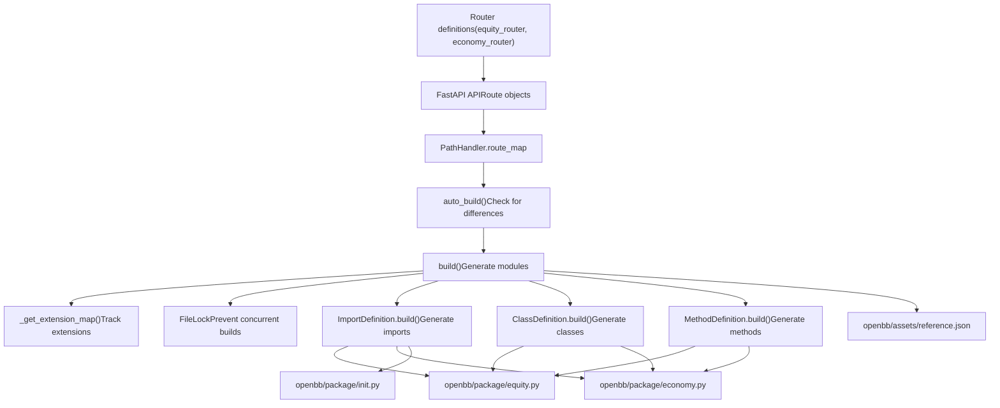

# Architecture

Relevant source files

-   [.pre-commit-config.yaml](https://github.com/OpenBB-finance/OpenBB/blob/dddc3b32/.pre-commit-config.yaml)
-   [README.md](https://github.com/OpenBB-finance/OpenBB/blob/dddc3b32/README.md?plain=1)
-   [cli/poetry.lock](https://github.com/OpenBB-finance/OpenBB/blob/dddc3b32/cli/poetry.lock)
-   [cli/tests/test\_argparse\_translator\_obbject\_registry.py](https://github.com/OpenBB-finance/OpenBB/blob/dddc3b32/cli/tests/test_argparse_translator_obbject_registry.py)
-   [openbb\_platform/core/openbb/assets/reference.json](https://github.com/OpenBB-finance/OpenBB/blob/dddc3b32/openbb_platform/core/openbb/assets/reference.json)
-   [openbb\_platform/core/openbb\_core/api/app\_loader.py](https://github.com/OpenBB-finance/OpenBB/blob/dddc3b32/openbb_platform/core/openbb_core/api/app_loader.py)
-   [openbb\_platform/core/openbb\_core/api/exception\_handlers.py](https://github.com/OpenBB-finance/OpenBB/blob/dddc3b32/openbb_platform/core/openbb_core/api/exception_handlers.py)
-   [openbb\_platform/core/openbb\_core/api/rest\_api.py](https://github.com/OpenBB-finance/OpenBB/blob/dddc3b32/openbb_platform/core/openbb_core/api/rest_api.py)
-   [openbb\_platform/core/openbb\_core/api/router/coverage.py](https://github.com/OpenBB-finance/OpenBB/blob/dddc3b32/openbb_platform/core/openbb_core/api/router/coverage.py)
-   [openbb\_platform/core/openbb\_core/app/provider\_interface.py](https://github.com/OpenBB-finance/OpenBB/blob/dddc3b32/openbb_platform/core/openbb_core/app/provider_interface.py)
-   [openbb\_platform/core/openbb\_core/app/router.py](https://github.com/OpenBB-finance/OpenBB/blob/dddc3b32/openbb_platform/core/openbb_core/app/router.py)
-   [openbb\_platform/core/openbb\_core/app/static/package\_builder.py](https://github.com/OpenBB-finance/OpenBB/blob/dddc3b32/openbb_platform/core/openbb_core/app/static/package_builder.py)
-   [openbb\_platform/core/openbb\_core/app/static/utils/filters.py](https://github.com/OpenBB-finance/OpenBB/blob/dddc3b32/openbb_platform/core/openbb_core/app/static/utils/filters.py)
-   [openbb\_platform/core/openbb\_core/app/utils.py](https://github.com/OpenBB-finance/OpenBB/blob/dddc3b32/openbb_platform/core/openbb_core/app/utils.py)
-   [openbb\_platform/core/openbb\_core/provider/registry\_map.py](https://github.com/OpenBB-finance/OpenBB/blob/dddc3b32/openbb_platform/core/openbb_core/provider/registry_map.py)
-   [openbb\_platform/core/openbb\_core/provider/standard\_models/fred\_release\_table.py](https://github.com/OpenBB-finance/OpenBB/blob/dddc3b32/openbb_platform/core/openbb_core/provider/standard_models/fred_release_table.py)
-   [openbb\_platform/core/openbb\_core/provider/standard\_models/futures\_curve.py](https://github.com/OpenBB-finance/OpenBB/blob/dddc3b32/openbb_platform/core/openbb_core/provider/standard_models/futures_curve.py)
-   [openbb\_platform/core/openbb\_core/provider/standard\_models/yield\_curve.py](https://github.com/OpenBB-finance/OpenBB/blob/dddc3b32/openbb_platform/core/openbb_core/provider/standard_models/yield_curve.py)
-   [openbb\_platform/core/poetry.lock](https://github.com/OpenBB-finance/OpenBB/blob/dddc3b32/openbb_platform/core/poetry.lock)
-   [openbb\_platform/core/pyproject.toml](https://github.com/OpenBB-finance/OpenBB/blob/dddc3b32/openbb_platform/core/pyproject.toml)
-   [openbb\_platform/core/tests/app/static/test\_filters.py](https://github.com/OpenBB-finance/OpenBB/blob/dddc3b32/openbb_platform/core/tests/app/static/test_filters.py)
-   [openbb\_platform/core/tests/app/static/test\_package\_builder.py](https://github.com/OpenBB-finance/OpenBB/blob/dddc3b32/openbb_platform/core/tests/app/static/test_package_builder.py)
-   [openbb\_platform/core/tests/app/test\_platform\_router.py](https://github.com/OpenBB-finance/OpenBB/blob/dddc3b32/openbb_platform/core/tests/app/test_platform_router.py)
-   [openbb\_platform/core/tests/app/test\_provider\_interface.py](https://github.com/OpenBB-finance/OpenBB/blob/dddc3b32/openbb_platform/core/tests/app/test_provider_interface.py)
-   [openbb\_platform/dev\_install.py](https://github.com/OpenBB-finance/OpenBB/blob/dddc3b32/openbb_platform/dev_install.py)
-   [openbb\_platform/extensions/devtools/poetry.lock](https://github.com/OpenBB-finance/OpenBB/blob/dddc3b32/openbb_platform/extensions/devtools/poetry.lock)
-   [openbb\_platform/extensions/devtools/pyproject.toml](https://github.com/OpenBB-finance/OpenBB/blob/dddc3b32/openbb_platform/extensions/devtools/pyproject.toml)
-   [openbb\_platform/obbject\_extensions/charting/tests/test\_charting.py](https://github.com/OpenBB-finance/OpenBB/blob/dddc3b32/openbb_platform/obbject_extensions/charting/tests/test_charting.py)
-   [openbb\_platform/poetry.lock](https://github.com/OpenBB-finance/OpenBB/blob/dddc3b32/openbb_platform/poetry.lock)
-   [openbb\_platform/providers/bls/openbb\_bls/utils/helpers.py](https://github.com/OpenBB-finance/OpenBB/blob/dddc3b32/openbb_platform/providers/bls/openbb_bls/utils/helpers.py)
-   [openbb\_platform/providers/cboe/openbb\_cboe/models/futures\_curve.py](https://github.com/OpenBB-finance/OpenBB/blob/dddc3b32/openbb_platform/providers/cboe/openbb_cboe/models/futures_curve.py)
-   [openbb\_platform/providers/cboe/tests/test\_cboe\_fetchers.py](https://github.com/OpenBB-finance/OpenBB/blob/dddc3b32/openbb_platform/providers/cboe/tests/test_cboe_fetchers.py)
-   [openbb\_platform/providers/fred/openbb\_fred/models/release\_table.py](https://github.com/OpenBB-finance/OpenBB/blob/dddc3b32/openbb_platform/providers/fred/openbb_fred/models/release_table.py)
-   [openbb\_platform/providers/yfinance/poetry.lock](https://github.com/OpenBB-finance/OpenBB/blob/dddc3b32/openbb_platform/providers/yfinance/poetry.lock)
-   [openbb\_platform/pyproject.toml](https://github.com/OpenBB-finance/OpenBB/blob/dddc3b32/openbb_platform/pyproject.toml)

## Purpose and Scope

This document describes the high-level architecture of the OpenBB Platform, explaining how commands flow from user interfaces through the core platform layer and back as structured results. It covers the extension system, command execution engine, provider abstraction, and static code generation mechanisms that enable the platform's "connect once, consume everywhere" philosophy.

For details on specific user interfaces (Python SDK, CLI, API, Workspace), see [User Interfaces](/OpenBB-finance/OpenBB/5-user-interfaces). For information on individual data extensions and providers, see [Data Extensions](/OpenBB-finance/OpenBB/3-data-extensions) and [Data Providers](/OpenBB-finance/OpenBB/4-data-providers). For the command execution implementation details, see [Command Execution Engine](/OpenBB-finance/OpenBB/2.1-command-execution-pipeline).

## Architectural Overview

The OpenBB Platform uses a layered architecture that separates user interfaces from data providers through a unified core platform layer. Commands are defined dynamically through routers, statically generated into Python modules for IDE support, and executed through a standardized pipeline that abstracts away provider-specific details.

### Core Platform Layers


**Sources:** [openbb\_platform/core/openbb\_core/app/router.py1-100](https://github.com/OpenBB-finance/OpenBB/blob/dddc3b32/openbb_platform/core/openbb_core/app/router.py#L1-L100) [openbb\_platform/core/openbb\_core/app/command\_runner.py1-100](https://github.com/OpenBB-finance/OpenBB/blob/dddc3b32/openbb_platform/core/openbb_core/app/command_runner.py#L1-L100) [openbb\_platform/core/openbb\_core/app/extension\_loader.py1-50](https://github.com/OpenBB-finance/OpenBB/blob/dddc3b32/openbb_platform/core/openbb_core/app/extension_loader.py#L1-L50) [openbb\_platform/core/openbb\_core/app/static/package\_builder.py134-169](https://github.com/OpenBB-finance/OpenBB/blob/dddc3b32/openbb_platform/core/openbb_core/app/static/package_builder.py#L134-L169)

The platform consists of four major layers:

| Layer | Components | Purpose |
| --- | --- | --- |
| **Interface Layer** | CLI, Python SDK, FastAPI Server | User-facing entry points |
| **Core Platform Layer** | Router, CommandRunner, ExtensionLoader, ProviderInterface | Command routing and execution |
| **Extension System** | Core, Provider, OBBject extensions | Modular functionality |
| **Build System** | PackageBuilder, Static Package | IDE autocomplete support |

## Extension Discovery and Loading

The platform uses Python entry points defined in `pyproject.toml` files to discover and load extensions at runtime. Extensions are categorized into three types, each serving a distinct purpose.

### Extension Entry Points


**Sources:** [openbb\_platform/core/openbb\_core/app/extension\_loader.py1-150](https://github.com/OpenBB-finance/OpenBB/blob/dddc3b32/openbb_platform/core/openbb_core/app/extension_loader.py#L1-L150) [openbb\_platform/pyproject.toml1-118](https://github.com/OpenBB-finance/OpenBB/blob/dddc3b32/openbb_platform/pyproject.toml#L1-L118)

The `ExtensionLoader` class discovers extensions through three entry point groups:

| Entry Point Group | Extension Type | Example Extensions |
| --- | --- | --- |
| `openbb_core_extension` | Router modules organizing commands | `openbb-equity`, `openbb-economy`, `openbb-etf` |
| `openbb_provider_extension` | Data provider implementations | `openbb-fmp`, `openbb-fred`, `openbb-intrinio` |
| `openbb_obbject_extension` | OBBject output processors | `openbb-charting`, `openbb-technical`, `openbb-quantitative` |

### Extension Loading Process

> **[Mermaid sequence]**
> *(图表结构无法解析)*

**Sources:** [openbb\_platform/core/openbb\_core/app/extension\_loader.py40-120](https://github.com/OpenBB-finance/OpenBB/blob/dddc3b32/openbb_platform/core/openbb_core/app/extension_loader.py#L40-L120)

The `ExtensionLoader` class implements the Singleton pattern and loads extensions lazily using `@lru_cache` decorators on its properties. Entry points are discovered via `importlib_metadata.entry_points()` and loaded into dictionaries indexed by extension name.

## Command Routing and Execution

Commands flow through a multi-stage pipeline that validates parameters, resolves providers, executes fetchers, and wraps results in `OBBject` containers.

### Router Command Registration


**Sources:** [openbb\_platform/core/openbb\_core/app/router.py79-250](https://github.com/OpenBB-finance/OpenBB/blob/dddc3b32/openbb_platform/core/openbb_core/app/router.py#L79-L250) [openbb\_platform/core/openbb\_core/app/static/package\_builder.py145-146](https://github.com/OpenBB-finance/OpenBB/blob/dddc3b32/openbb_platform/core/openbb_core/app/static/package_builder.py#L145-L146)

The `Router.command()` decorator registers functions as API routes. Each command:

1.  Defines `standard_params` - common parameters across all providers
2.  Optionally defines `extra_params` - provider-specific parameters
3.  Specifies available `providers` through the `ProviderInterface`
4.  Returns an `OBBject` containing results and metadata

### Command Execution Pipeline

> **[Mermaid sequence]**
> *(图表结构无法解析)*

**Sources:** [openbb\_platform/core/openbb\_core/app/command\_runner.py34-237](https://github.com/OpenBB-finance/OpenBB/blob/dddc3b32/openbb_platform/core/openbb_core/app/command_runner.py#L34-L237) [openbb\_platform/core/openbb\_core/app/provider\_interface.py70-350](https://github.com/OpenBB-finance/OpenBB/blob/dddc3b32/openbb_platform/core/openbb_core/app/provider_interface.py#L70-L350)

The execution pipeline consists of:

| Stage | Component | Responsibility |
| --- | --- | --- |
| **Context Creation** | `ExecutionContext` | Holds route, system settings, user settings |
| **Parameter Building** | `ParametersBuilder` | Merges args/kwargs, validates types, injects `CommandContext` |
| **Command Execution** | `CommandRunner` | Orchestrates execution, handles errors, triggers extensions |
| **Provider Resolution** | `ProviderInterface` | Maps route to fetcher, resolves provider choice |
| **Data Fetching** | `Fetcher` | Transforms query, calls external API, transforms data |
| **Result Wrapping** | `OBBject` | Contains results, provider, warnings, chart, metadata |

### ExecutionContext and Settings

The `ExecutionContext` class provides access to system and user settings during command execution:

```
# From command_runner.py:34-57class ExecutionContext:    def __init__(        self,        command_map: "CommandMap",        route: str,        system_settings: "SystemSettings",        user_settings: "UserSettings",    ) -> None:        self.command_map = command_map        self.route = route        self.system_settings = system_settings        self.user_settings = user_settings
```
**Sources:** [openbb\_platform/core/openbb\_core/app/command\_runner.py34-57](https://github.com/OpenBB-finance/OpenBB/blob/dddc3b32/openbb_platform/core/openbb_core/app/command_runner.py#L34-L57)

The `CommandContext` is injected into functions that have a `cc` parameter:

```
# From command_runner.py:126-144@staticmethoddef update_command_context(    func: Callable,    kwargs: dict[str, Any],    system_settings: "SystemSettings",    user_settings: "UserSettings",) -> dict[str, Any]:    argcount = func.__code__.co_argcount    if "cc" in func.__code__.co_varnames[:argcount]:        kwargs["cc"] = CommandContext(            user_settings=user_settings,            system_settings=system_settings,        )    return kwargs
```
**Sources:** [openbb\_platform/core/openbb\_core/app/command\_runner.py126-144](https://github.com/OpenBB-finance/OpenBB/blob/dddc3b32/openbb_platform/core/openbb_core/app/command_runner.py#L126-L144)

### Parameter Validation

The `ParametersBuilder.validate_kwargs()` method creates a dynamic Pydantic model to validate and coerce parameters:

```
# From command_runner.py:180-206@staticmethoddef validate_kwargs(    func: Callable,    kwargs: dict[str, Any],) -> dict[str, Any]:    sig = signature(func)    fields: dict[str, tuple[Any, Any]] = {}    for name, param in sig.parameters.items():        if param.kind is Parameter.VAR_KEYWORD:            continue        annotation = (            Any if param.annotation is Parameter.empty else param.annotation        )        default = ... if param.default is Parameter.empty else param.default        fields[name] = (annotation, default)    config = ConfigDict(extra="allow", arbitrary_types_allowed=True)    ValidationModel = create_model(func.__name__, __config__=config, **fields)    model = ValidationModel(**kwargs)    ParametersBuilder._warn_kwargs(        ParametersBuilder._as_dict(kwargs.get("extra_params", {})),        ValidationModel,    )    return dict(model)
```
**Sources:** [openbb\_platform/core/openbb\_core/app/command\_runner.py180-206](https://github.com/OpenBB-finance/OpenBB/blob/dddc3b32/openbb_platform/core/openbb_core/app/command_runner.py#L180-L206)

## Provider Abstraction

The `ProviderInterface` enables multiple data providers to implement the same data types with consistent output. It dynamically generates parameter models and routes queries to the appropriate fetcher.

### Provider Registration


**Sources:** [openbb\_platform/core/openbb\_core/provider/registry\_map.py1-150](https://github.com/OpenBB-finance/OpenBB/blob/dddc3b32/openbb_platform/core/openbb_core/provider/registry_map.py#L1-L150)

The `RegistryMap` maintains a mapping of routes to available providers and their fetchers:

```
# Structure of fetcher_dict{    "/equity/price/historical": {        "fmp": FMPHistoricalPriceFetcher,        "intrinio": IntrinioHistoricalPriceFetcher,        "yfinance": YFinanceHistoricalPriceFetcher,    },    "/equity/fundamental/balance": {        "fmp": FMPBalanceSheetFetcher,        "intrinio": IntrinioBalanceSheetFetcher,    },}
```
### Query Execution Flow

> **[Mermaid sequence]**
> *(图表结构无法解析)*

**Sources:** [openbb\_platform/core/openbb\_core/app/provider\_interface.py150-450](https://github.com/OpenBB-finance/OpenBB/blob/dddc3b32/openbb_platform/core/openbb_core/app/provider_interface.py#L150-L450)

Each fetcher implements two key methods:

| Method | Purpose | Responsibilities |
| --- | --- | --- |
| `transform_query(params, credentials)` | Prepare API request | Convert standard params to provider-specific format, add authentication |
| `transform_data(query, data, **kwargs)` | Process API response | Parse JSON, convert to standard models, handle errors |

### Standard Models

Standard models define the common schema across providers:

```
# Example standard model structureclass HistoricalPriceData(Data):    date: datetime    open: float    high: float    low: float    close: float    volume: int
```
Provider-specific models extend the standard:

```
# Provider-specific extensionclass FMPHistoricalPriceData(HistoricalPriceData):    adj_close: Optional[float] = None    change: Optional[float] = None    change_percent: Optional[float] = None
```
**Sources:** [openbb\_platform/core/openbb\_core/app/provider\_interface.py200-350](https://github.com/OpenBB-finance/OpenBB/blob/dddc3b32/openbb_platform/core/openbb_core/app/provider_interface.py#L200-L350)

## Static Code Generation

The `PackageBuilder` generates static Python modules from dynamic route definitions, enabling IDE autocomplete while maintaining runtime flexibility.

### Build Process


**Sources:** [openbb\_platform/core/openbb\_core/app/static/package\_builder.py134-305](https://github.com/OpenBB-finance/OpenBB/blob/dddc3b32/openbb_platform/core/openbb_core/app/static/package_builder.py#L134-L305)

### Build Trigger and Locking

The `PackageBuilder.auto_build()` method automatically triggers a build when extensions change:

```
# From package_builder.py:149-168def auto_build(self) -> None:    if Env().AUTO_BUILD:        reference = PackageBuilder._read(            self.directory / "assets" / "reference.json"        )        ext_map = reference.get("info", {}).get("extensions", {})        add, remove = PackageBuilder._diff(ext_map)        if add:            a = ", ".join(sorted(add))            print(f"Extensions to add: {a}")        if remove:            r = ", ".join(sorted(remove))            print(f"Extensions to remove: {r}")        if add or remove:            print("\nBuilding...")            self.build()
```
**Sources:** [openbb\_platform/core/openbb\_core/app/static/package\_builder.py149-168](https://github.com/OpenBB-finance/OpenBB/blob/dddc3b32/openbb_platform/core/openbb_core/app/static/package_builder.py#L149-L168)

A file lock prevents concurrent builds:

```
# From package_builder.py:174-205def build(self, modules: str | list[str] | None = None) -> None:    self._lock_path.touch(exist_ok=True)    with open(self._lock_path, "w", encoding="utf-8") as lock_file:        file_lock = FileLock(lock_file)        try:            file_lock.acquire(blocking=False)            lock_file.write(str(os.getpid()))            lock_file.flush()                        # Build steps            self._clean(modules)            ext_map = self._get_extension_map()            self._save_modules(modules, ext_map)            self._save_reference_file(ext_map)            self._save_package()            if self.lint:                self._run_linters()        except BlockingIOError:            raise RuntimeError(                f"Another build process is running and has locked {self._lock_path}"            )        finally:            with contextlib.suppress(Exception):                file_lock.release()
```
**Sources:** [openbb\_platform/core/openbb\_core/app/static/package\_builder.py174-205](https://github.com/OpenBB-finance/OpenBB/blob/dddc3b32/openbb_platform/core/openbb_core/app/static/package_builder.py#L174-L205)

### Module Generation

The `ModuleBuilder` generates a complete Python module for each router:

```
# From package_builder.py:363-374@staticmethoddef build(path: str, ext_map: dict[str, list[str]] | None = None) -> str:    code = f'"""Autogenerated OpenBB {path} Module."""\n\n'    code += "### THIS FILE IS AUTO-GENERATED. DO NOT EDIT. ###\n\n"    code += "#  pylint: disable=R0917,C0103,C0415\n\n"    code += ImportDefinition.build(path)    code += ClassDefinition.build(path, ext_map)    return code
```
**Sources:** [openbb\_platform/core/openbb\_core/app/static/package\_builder.py363-374](https://github.com/OpenBB-finance/OpenBB/blob/dddc3b32/openbb_platform/core/openbb_core/app/static/package_builder.py#L363-L374)

#### Import Generation

`ImportDefinition.build()` extracts type hints from route functions and generates appropriate imports:

```
# From package_builder.py:529-664@classmethoddef build(cls, path: str) -> str:    hint_type_list = cls.get_path_hint_type_list(path=path)    code = "from openbb_core.app.static.container import Container"    code += "\nfrom openbb_core.app.model.obbject import OBBject"        # Standard imports    code += "\nimport openbb_core.provider"    code += "\nfrom openbb_core.provider.abstract.data import Data"    code += "\nimport pandas"    code += "\nfrom pandas import DataFrame, Series"    # ... more imports        # Group types by module    module_types: dict = {}    for hint_type in hint_type_list:        if hasattr(hint_type, "__module__"):            module = hint_type.__module__            # ... extract type names            module_types[module].add(sanitized_name)        # Generate from-import statements    for module, types in sorted(module_types.items()):        # ... generate imports        return code + "\n"
```
**Sources:** [openbb\_platform/core/openbb\_core/app/static/package\_builder.py529-664](https://github.com/OpenBB-finance/OpenBB/blob/dddc3b32/openbb_platform/core/openbb_core/app/static/package_builder.py#L529-L664)

#### Class Generation

`ClassDefinition.build()` creates a class with properties for sub-routers and methods for commands:

```
# From package_builder.py:667-759@staticmethoddef build(path: str, ext_map: dict[str, list[str]] | None = None) -> str:    class_name = PathHandler.build_module_class(path=path)    code = f"class {class_name}(Container):\n"        # Build docstring    doc = f'    """{path}\n' if path else '    # fmt: off\n    """\nRouters:\n'    methods = ""        for c in child_path_list:        route = PathHandler.get_route(c, route_map)        has_subroutes = any(r.startswith(c + "/") and r != c for r in route_map)                if route is None:            if has_subroutes:                # Sub-router property                doc += "    /" + c.split("/")[-1] + "\n"                methods += MethodDefinition.build_class_loader_method(path=c)            continue                if is_command_route:            # Command method            doc += f"    {route.name}\n"            methods += MethodDefinition.build_command_method(...)        return code + doc + methods
```
**Sources:** [openbb\_platform/core/openbb\_core/app/static/package\_builder.py667-759](https://github.com/OpenBB-finance/OpenBB/blob/dddc3b32/openbb_platform/core/openbb_core/app/static/package_builder.py#L667-L759)

#### Method Generation

`MethodDefinition.build_command_method()` generates command methods with full signatures:

```
# Example generated method@validate@exception_handlerdef historical(    self,    symbol: Annotated[Union[str, List[str]], OpenBBField(description="Symbol...")],    start_date: Annotated[Union[datetime, str, None], OpenBBField(description="Start date...")] = None,    end_date: Annotated[Union[datetime, str, None], OpenBBField(description="End date...")] = None,    provider: Annotated[Optional[Literal["fmp", "intrinio", "yfinance"]], ...] = None,    **kwargs,) -> OBBject:    """Get historical price data."""    return self._run(        "/equity/price/historical",        **filter_inputs(            provider_choices={"provider": self._get_provider(...), ...},            standard_params={                "symbol": symbol,                "start_date": start_date,                "end_date": end_date,            },            extra_params=kwargs,        ),    )
```
**Sources:** [openbb\_platform/core/openbb\_core/app/static/package\_builder.py1000-1400](https://github.com/OpenBB-finance/OpenBB/blob/dddc3b32/openbb_platform/core/openbb_core/app/static/package_builder.py#L1000-L1400)

### Reference JSON Generation

The `reference.json` file tracks installed extensions and available routes:

```
{    "openbb": "1.5.9core",    "info": {        "title": "OpenBB Platform (Python)",        "description": "Investment research for everyone, anywhere.",        "core": "1.5.9",        "extensions": {            "openbb_core_extension": [                "commodity@1.4.2",                "equity@1.5.1"            ],            "openbb_provider_extension": [                "fmp@1.5.2",                "fred@1.5.1"            ],            "openbb_obbject_extension": [                "openbb_charting@2.4.1"            ]        }    },    "paths": {        "/equity/price/historical": {...}    },    "routers": {        "/equity": {...}    }}
```
**Sources:** [openbb\_platform/core/openbb/assets/reference.json1-15](https://github.com/OpenBB-finance/OpenBB/blob/dddc3b32/openbb_platform/core/openbb/assets/reference.json#L1-L15) [openbb\_platform/core/openbb\_core/app/static/package\_builder.py268-285](https://github.com/OpenBB-finance/OpenBB/blob/dddc3b32/openbb_platform/core/openbb_core/app/static/package_builder.py#L268-L285)

## OBBject Result Container

The `OBBject` class provides a standardized container for command results with conversion methods and extension accessors.

### OBBject Structure

```mermaid
flowchart TD
    Route["_route: str | None(e.g., '/equity/price/historical')"]
    StandardParams["_standard_params: Dict[str, Any]"]
    ExtraParams["_extra_params: Dict[str, Any]"]
    Results["results: T | None(List[Data], DataFrame, dict)"]
    Provider["provider: str | None(e.g., 'fmp', 'fred')"]
    Warnings["warnings: List[Warning_] | None"]
    Chart["chart: Chart | None"]
    Extra["extra: Dict[str, Any]"]
    ToDF["to_dataframe()/to_df()Returns pandas DataFrame"]
    ToDict["to_dict()Returns dict"]
    ToNumpy["to_numpy()Returns ndarray"]
    ToPolars["to_polars()Returns PolarsDataFrame"]
    Charting["charting(if openbb-charting installed)"]
    Technical["technical(if openbb-technical installed)"]
    Quantitative["quantitative(if openbb-quantitative installed)"]

    Results --> ToDF
    Results --> ToDict
    Results --> ToNumpy
    Results --> ToPolars
    Results --> Charting
    Results --> Technical
    Results --> Quantitative
    Route --> StandardParams
    Route --> ExtraParams
```


**Sources:** [openbb\_platform/core/openbb\_core/app/model/obbject.py36-150](https://github.com/OpenBB-finance/OpenBB/blob/dddc3b32/openbb_platform/core/openbb_core/app/model/obbject.py#L36-L150)

The `OBBject` class uses `PrivateAttr` for internal metadata:

```
# From obbject.py:36-72class OBBject(Tagged, Generic[T]):    accessors: ClassVar[set[str]] = set()    _user_settings: ClassVar[BaseModel | None] = None    _system_settings: ClassVar[BaseModel | None] = None     results: T | None = Field(        default=None,        description="Serializable results.",    )    provider: str | None = Field(        default=None,        description="Provider name.",    )    warnings: list[Warning_] | None = Field(        default=None,        description="List of warnings.",    )    chart: Chart | None = Field(        default=None,        description="Chart object.",    )    extra: dict[str, Any] = Field(        default_factory=dict,        description="Extra info.",    )    _route: str | None = PrivateAttr(default=None)    _standard_params: dict[str, Any] | None = PrivateAttr(default_factory=dict)    _extra_params: dict[str, Any] | None = PrivateAttr(default_factory=dict)
```
**Sources:** [openbb\_platform/core/openbb\_core/app/model/obbject.py36-72](https://github.com/OpenBB-finance/OpenBB/blob/dddc3b32/openbb_platform/core/openbb_core/app/model/obbject.py#L36-L72)

### Data Conversion Methods

The `OBBject` provides methods to convert results to various formats:

| Method | Return Type | Description |
| --- | --- | --- |
| `to_dataframe()` / `to_df()` | `pandas.DataFrame` | Convert to pandas DataFrame with optional sorting |
| `to_dict()` | `dict` | Convert to dictionary (orient="list" by default) |
| `to_numpy()` | `numpy.ndarray` | Convert to NumPy array |
| `to_polars()` | `polars.DataFrame` | Convert to Polars DataFrame |

**Sources:** [openbb\_platform/core/openbb\_core/app/model/obbject.py81-300](https://github.com/OpenBB-finance/OpenBB/blob/dddc3b32/openbb_platform/core/openbb_core/app/model/obbject.py#L81-L300)

## Data Flow Through Architecture

The complete data flow from user request to result illustrates how all architectural components interact.

> **[Mermaid sequence]**
> *(图表结构无法解析)*

**Sources:** [openbb\_platform/core/openbb\_core/app/static/container.py1-100](https://github.com/OpenBB-finance/OpenBB/blob/dddc3b32/openbb_platform/core/openbb_core/app/static/container.py#L1-L100) [openbb\_platform/core/openbb\_core/app/command\_runner.py240-400](https://github.com/OpenBB-finance/OpenBB/blob/dddc3b32/openbb_platform/core/openbb_core/app/command_runner.py#L240-L400) [openbb\_platform/core/openbb\_core/app/provider\_interface.py200-450](https://github.com/OpenBB-finance/OpenBB/blob/dddc3b32/openbb_platform/core/openbb_core/app/provider_interface.py#L200-L450)

### Key Data Transformations

| Stage | Input | Output | Component |
| --- | --- | --- | --- |
| **User Call** | Function call with parameters | Validated parameter dict | `ParametersBuilder` |
| **Provider Resolution** | Route + provider name | Fetcher class instance | `ProviderInterface` |
| **Query Transform** | Standard parameters | Provider-specific API params | `Fetcher.transform_query()` |
| **Data Transform** | Raw API response | List of standard models | `Fetcher.transform_data()` |
| **Result Wrapping** | Data + metadata | `OBBject` instance | `CommandRunner` |
| **User Conversion** | `OBBject` | DataFrame/dict/array | `OBBject.to_*()` methods |

**Sources:** [openbb\_platform/core/openbb\_core/app/command\_runner.py1-400](https://github.com/OpenBB-finance/OpenBB/blob/dddc3b32/openbb_platform/core/openbb_core/app/command_runner.py#L1-L400) [openbb\_platform/core/openbb\_core/app/provider\_interface.py1-600](https://github.com/OpenBB-finance/OpenBB/blob/dddc3b32/openbb_platform/core/openbb_core/app/provider_interface.py#L1-L600)
