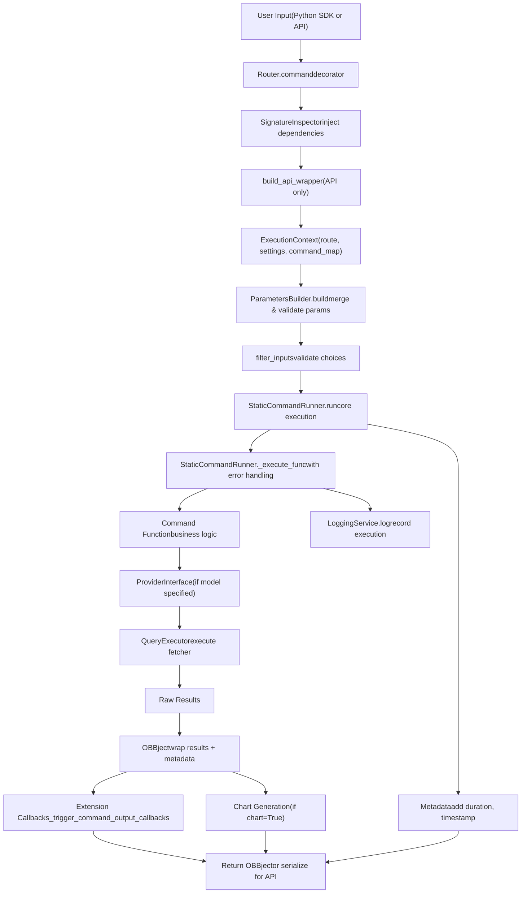
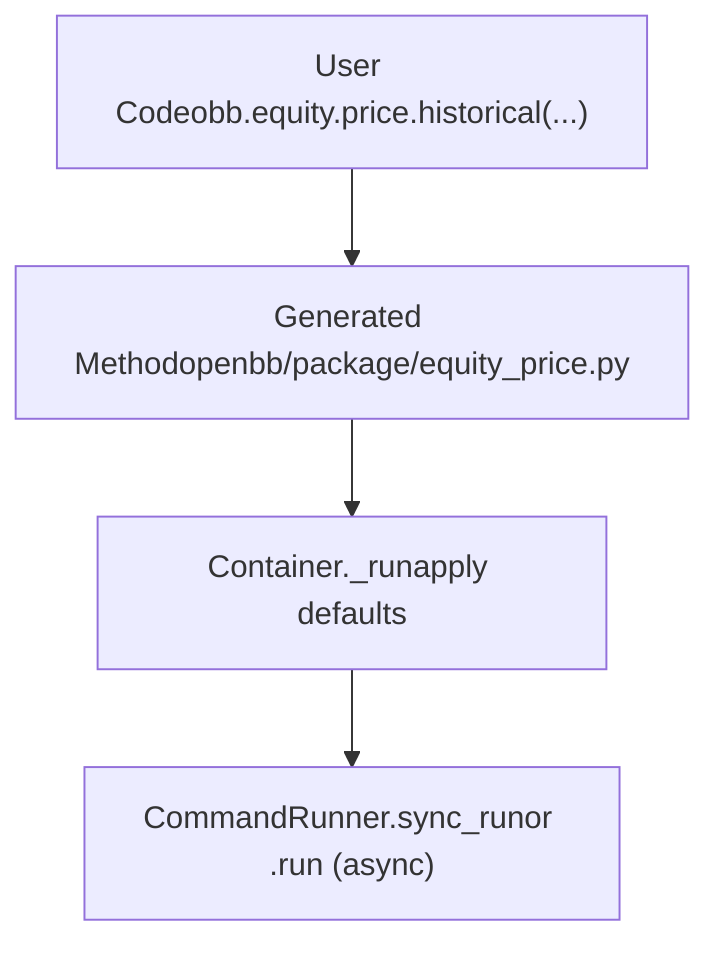
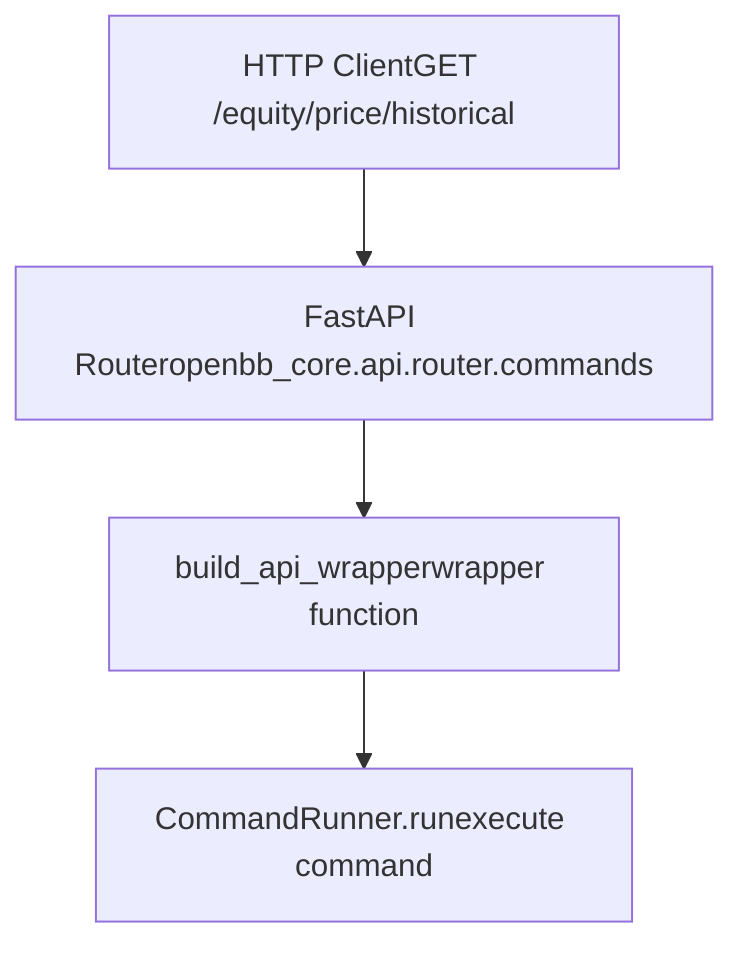
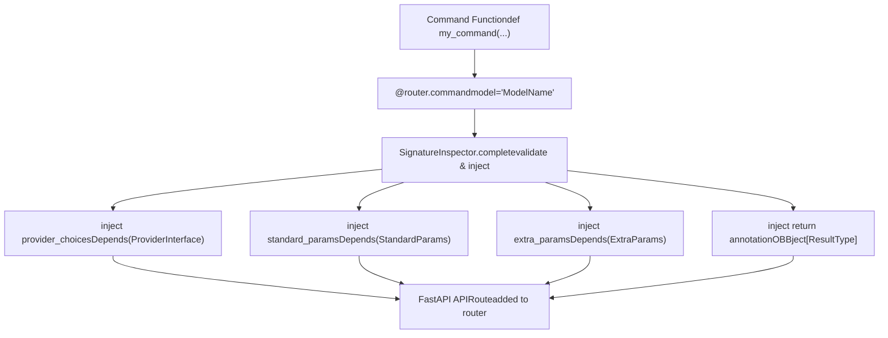
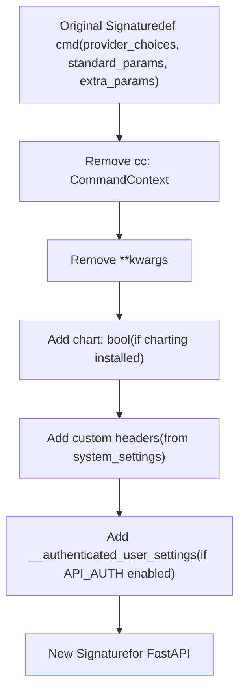
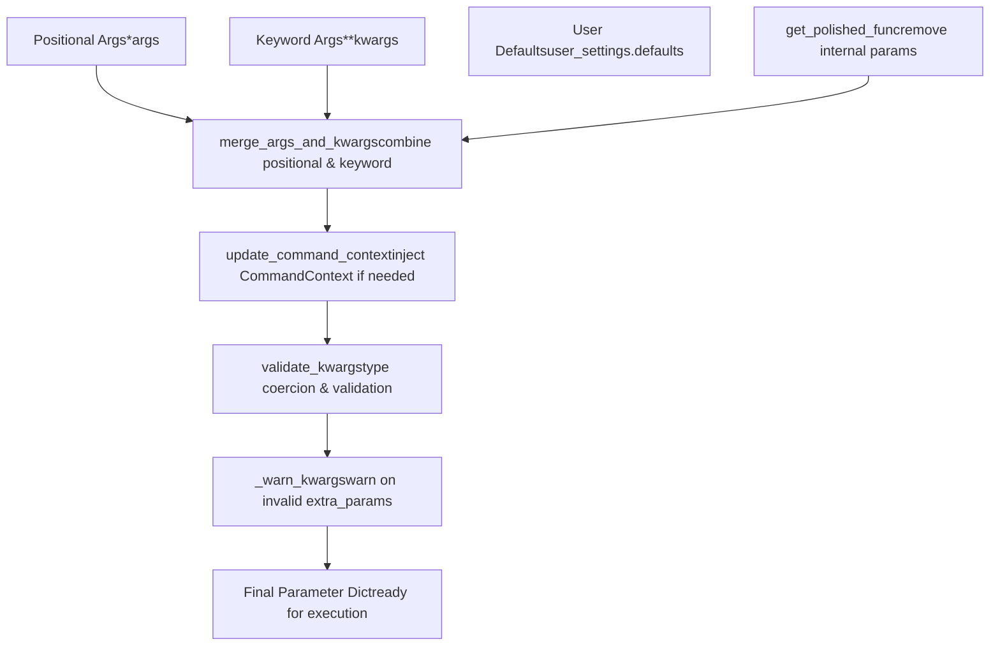
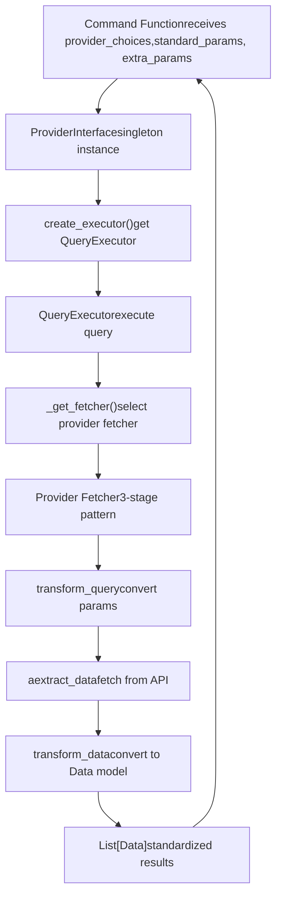
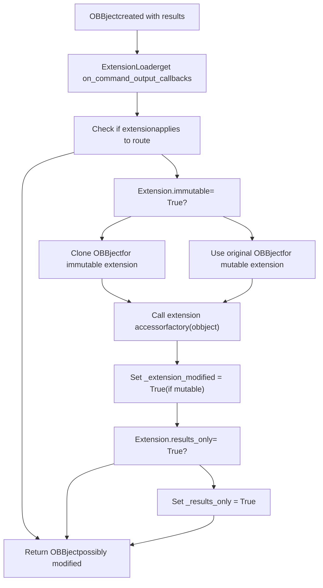
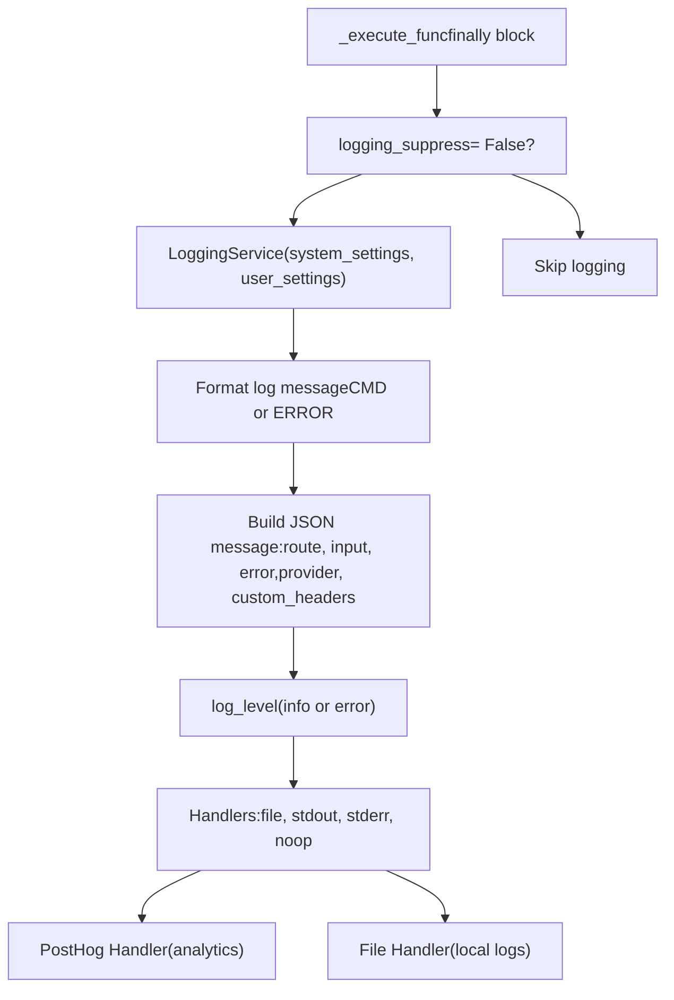
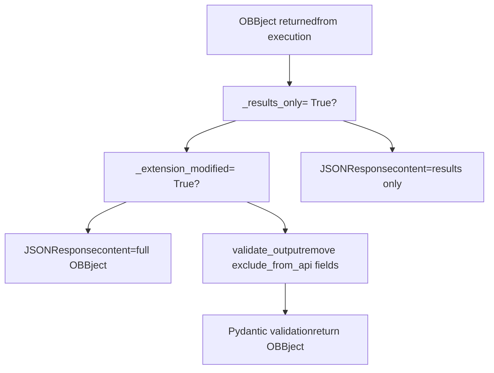

# Command Execution Pipeline

Relevant source files

-   [cli/tests/test\_argparse\_translator\_obbject\_registry.py](https://github.com/OpenBB-finance/OpenBB/blob/dddc3b32/cli/tests/test_argparse_translator_obbject_registry.py)
-   [frontend-components/plotly/src/data/mockup.ts](https://github.com/OpenBB-finance/OpenBB/blob/dddc3b32/frontend-components/plotly/src/data/mockup.ts)
-   [openbb\_platform/core/openbb\_core/api/app\_loader.py](https://github.com/OpenBB-finance/OpenBB/blob/dddc3b32/openbb_platform/core/openbb_core/api/app_loader.py)
-   [openbb\_platform/core/openbb\_core/api/exception\_handlers.py](https://github.com/OpenBB-finance/OpenBB/blob/dddc3b32/openbb_platform/core/openbb_core/api/exception_handlers.py)
-   [openbb\_platform/core/openbb\_core/api/rest\_api.py](https://github.com/OpenBB-finance/OpenBB/blob/dddc3b32/openbb_platform/core/openbb_core/api/rest_api.py)
-   [openbb\_platform/core/openbb\_core/api/router/commands.py](https://github.com/OpenBB-finance/OpenBB/blob/dddc3b32/openbb_platform/core/openbb_core/api/router/commands.py)
-   [openbb\_platform/core/openbb\_core/api/router/coverage.py](https://github.com/OpenBB-finance/OpenBB/blob/dddc3b32/openbb_platform/core/openbb_core/api/router/coverage.py)
-   [openbb\_platform/core/openbb\_core/app/command\_runner.py](https://github.com/OpenBB-finance/OpenBB/blob/dddc3b32/openbb_platform/core/openbb_core/app/command_runner.py)
-   [openbb\_platform/core/openbb\_core/app/extension\_loader.py](https://github.com/OpenBB-finance/OpenBB/blob/dddc3b32/openbb_platform/core/openbb_core/app/extension_loader.py)
-   [openbb\_platform/core/openbb\_core/app/logs/handlers\_manager.py](https://github.com/OpenBB-finance/OpenBB/blob/dddc3b32/openbb_platform/core/openbb_core/app/logs/handlers_manager.py)
-   [openbb\_platform/core/openbb\_core/app/logs/logging\_service.py](https://github.com/OpenBB-finance/OpenBB/blob/dddc3b32/openbb_platform/core/openbb_core/app/logs/logging_service.py)
-   [openbb\_platform/core/openbb\_core/app/logs/models/logging\_settings.py](https://github.com/OpenBB-finance/OpenBB/blob/dddc3b32/openbb_platform/core/openbb_core/app/logs/models/logging_settings.py)
-   [openbb\_platform/core/openbb\_core/app/model/abstract/tagged.py](https://github.com/OpenBB-finance/OpenBB/blob/dddc3b32/openbb_platform/core/openbb_core/app/model/abstract/tagged.py)
-   [openbb\_platform/core/openbb\_core/app/model/charts/charting\_settings.py](https://github.com/OpenBB-finance/OpenBB/blob/dddc3b32/openbb_platform/core/openbb_core/app/model/charts/charting_settings.py)
-   [openbb\_platform/core/openbb\_core/app/model/defaults.py](https://github.com/OpenBB-finance/OpenBB/blob/dddc3b32/openbb_platform/core/openbb_core/app/model/defaults.py)
-   [openbb\_platform/core/openbb\_core/app/model/extension.py](https://github.com/OpenBB-finance/OpenBB/blob/dddc3b32/openbb_platform/core/openbb_core/app/model/extension.py)
-   [openbb\_platform/core/openbb\_core/app/model/obbject.py](https://github.com/OpenBB-finance/OpenBB/blob/dddc3b32/openbb_platform/core/openbb_core/app/model/obbject.py)
-   [openbb\_platform/core/openbb\_core/app/model/system\_settings.py](https://github.com/OpenBB-finance/OpenBB/blob/dddc3b32/openbb_platform/core/openbb_core/app/model/system_settings.py)
-   [openbb\_platform/core/openbb\_core/app/provider\_interface.py](https://github.com/OpenBB-finance/OpenBB/blob/dddc3b32/openbb_platform/core/openbb_core/app/provider_interface.py)
-   [openbb\_platform/core/openbb\_core/app/router.py](https://github.com/OpenBB-finance/OpenBB/blob/dddc3b32/openbb_platform/core/openbb_core/app/router.py)
-   [openbb\_platform/core/openbb\_core/app/service/system\_service.py](https://github.com/OpenBB-finance/OpenBB/blob/dddc3b32/openbb_platform/core/openbb_core/app/service/system_service.py)
-   [openbb\_platform/core/openbb\_core/app/static/container.py](https://github.com/OpenBB-finance/OpenBB/blob/dddc3b32/openbb_platform/core/openbb_core/app/static/container.py)
-   [openbb\_platform/core/openbb\_core/app/static/package\_builder.py](https://github.com/OpenBB-finance/OpenBB/blob/dddc3b32/openbb_platform/core/openbb_core/app/static/package_builder.py)
-   [openbb\_platform/core/openbb\_core/app/static/utils/filters.py](https://github.com/OpenBB-finance/OpenBB/blob/dddc3b32/openbb_platform/core/openbb_core/app/static/utils/filters.py)
-   [openbb\_platform/core/openbb\_core/app/utils.py](https://github.com/OpenBB-finance/OpenBB/blob/dddc3b32/openbb_platform/core/openbb_core/app/utils.py)
-   [openbb\_platform/core/openbb\_core/env.py](https://github.com/OpenBB-finance/OpenBB/blob/dddc3b32/openbb_platform/core/openbb_core/env.py)
-   [openbb\_platform/core/openbb\_core/provider/registry\_map.py](https://github.com/OpenBB-finance/OpenBB/blob/dddc3b32/openbb_platform/core/openbb_core/provider/registry_map.py)
-   [openbb\_platform/core/openbb\_core/provider/standard\_models/fred\_release\_table.py](https://github.com/OpenBB-finance/OpenBB/blob/dddc3b32/openbb_platform/core/openbb_core/provider/standard_models/fred_release_table.py)
-   [openbb\_platform/core/openbb\_core/provider/standard\_models/futures\_curve.py](https://github.com/OpenBB-finance/OpenBB/blob/dddc3b32/openbb_platform/core/openbb_core/provider/standard_models/futures_curve.py)
-   [openbb\_platform/core/openbb\_core/provider/standard\_models/yield\_curve.py](https://github.com/OpenBB-finance/OpenBB/blob/dddc3b32/openbb_platform/core/openbb_core/provider/standard_models/yield_curve.py)
-   [openbb\_platform/core/tests/app/logs/test\_handlers\_manager.py](https://github.com/OpenBB-finance/OpenBB/blob/dddc3b32/openbb_platform/core/tests/app/logs/test_handlers_manager.py)
-   [openbb\_platform/core/tests/app/logs/test\_logging\_service.py](https://github.com/OpenBB-finance/OpenBB/blob/dddc3b32/openbb_platform/core/tests/app/logs/test_logging_service.py)
-   [openbb\_platform/core/tests/app/model/test\_extension.py](https://github.com/OpenBB-finance/OpenBB/blob/dddc3b32/openbb_platform/core/tests/app/model/test_extension.py)
-   [openbb\_platform/core/tests/app/model/test\_obbject.py](https://github.com/OpenBB-finance/OpenBB/blob/dddc3b32/openbb_platform/core/tests/app/model/test_obbject.py)
-   [openbb\_platform/core/tests/app/model/test\_system\_settings.py](https://github.com/OpenBB-finance/OpenBB/blob/dddc3b32/openbb_platform/core/tests/app/model/test_system_settings.py)
-   [openbb\_platform/core/tests/app/static/test\_filters.py](https://github.com/OpenBB-finance/OpenBB/blob/dddc3b32/openbb_platform/core/tests/app/static/test_filters.py)
-   [openbb\_platform/core/tests/app/static/test\_package\_builder.py](https://github.com/OpenBB-finance/OpenBB/blob/dddc3b32/openbb_platform/core/tests/app/static/test_package_builder.py)
-   [openbb\_platform/core/tests/app/test\_command\_runner.py](https://github.com/OpenBB-finance/OpenBB/blob/dddc3b32/openbb_platform/core/tests/app/test_command_runner.py)
-   [openbb\_platform/core/tests/app/test\_platform\_router.py](https://github.com/OpenBB-finance/OpenBB/blob/dddc3b32/openbb_platform/core/tests/app/test_platform_router.py)
-   [openbb\_platform/core/tests/app/test\_provider\_interface.py](https://github.com/OpenBB-finance/OpenBB/blob/dddc3b32/openbb_platform/core/tests/app/test_provider_interface.py)
-   [openbb\_platform/obbject\_extensions/charting/openbb\_charting/charts/helpers.py](https://github.com/OpenBB-finance/OpenBB/blob/dddc3b32/openbb_platform/obbject_extensions/charting/openbb_charting/charts/helpers.py)
-   [openbb\_platform/obbject\_extensions/charting/tests/test\_charting.py](https://github.com/OpenBB-finance/OpenBB/blob/dddc3b32/openbb_platform/obbject_extensions/charting/tests/test_charting.py)
-   [openbb\_platform/providers/bls/openbb\_bls/utils/helpers.py](https://github.com/OpenBB-finance/OpenBB/blob/dddc3b32/openbb_platform/providers/bls/openbb_bls/utils/helpers.py)
-   [openbb\_platform/providers/cboe/openbb\_cboe/models/futures\_curve.py](https://github.com/OpenBB-finance/OpenBB/blob/dddc3b32/openbb_platform/providers/cboe/openbb_cboe/models/futures_curve.py)
-   [openbb\_platform/providers/cboe/tests/test\_cboe\_fetchers.py](https://github.com/OpenBB-finance/OpenBB/blob/dddc3b32/openbb_platform/providers/cboe/tests/test_cboe_fetchers.py)
-   [openbb\_platform/providers/fred/openbb\_fred/models/release\_table.py](https://github.com/OpenBB-finance/OpenBB/blob/dddc3b32/openbb_platform/providers/fred/openbb_fred/models/release_table.py)

This document describes the complete command execution pipeline in the OpenBB Platform, from user input (Python SDK or REST API) through validation, parameter building, provider data fetching, to the final OBBject output. This covers the runtime execution flow for all commands in the platform.

For information about how commands are registered and routes are built at startup, see [Extension System](/OpenBB-finance/OpenBB/2.2-extension-system). For details on how providers fetch and transform data, see [Provider Architecture](/OpenBB-finance/OpenBB/2.3-provider-architecture). For information about code generation that creates the SDK methods, see [Package Builder and Code Generation](/OpenBB-finance/OpenBB/2.4-package-builder-and-code-generation).

---

## Overview

The command execution pipeline consists of several stages that every command flows through:

1.  **Input Reception**: Commands originate from either the Python SDK (e.g., `obb.equity.price.historical()`) or REST API (e.g., `GET /equity/price/historical`)
2.  **Router & Validation**: The `Router.command` decorator wraps endpoint functions and `SignatureInspector` injects provider choices and parameter dependencies
3.  **Context Building**: `ExecutionContext` aggregates system settings, user settings, and the command map
4.  **Parameter Building**: `ParametersBuilder` merges positional args, kwargs, defaults, and validates types
5.  **Command Execution**: `StaticCommandRunner.run` executes the command function with built parameters
6.  **Provider Integration**: Commands using the `ProviderInterface` fetch data through `QueryExecutor` using the 3-stage fetcher pattern
7.  **Output Wrapping**: Results are wrapped in an `OBBject` with metadata
8.  **Extension Callbacks**: Registered extensions can modify or react to the OBBject
9.  **Logging**: `LoggingService` records execution details, errors, and analytics
10.  **Response**: OBBject is returned to caller or serialized for API response

**Pipeline Flow Diagram**


Sources: [openbb\_platform/core/openbb\_core/app/command\_runner.py1-723](https://github.com/OpenBB-finance/OpenBB/blob/dddc3b32/openbb_platform/core/openbb_core/app/command_runner.py#L1-L723) [openbb\_platform/core/openbb\_core/api/router/commands.py1-357](https://github.com/OpenBB-finance/OpenBB/blob/dddc3b32/openbb_platform/core/openbb_core/api/router/commands.py#L1-L357) [openbb\_platform/core/openbb\_core/app/router.py1-538](https://github.com/OpenBB-finance/OpenBB/blob/dddc3b32/openbb_platform/core/openbb_core/app/router.py#L1-L538)

---

## Input Layer

Commands enter the execution pipeline through two entry points:

### Python SDK Entry Point

The generated Python SDK methods (in `openbb.package.*` modules) call `Container._run()` which invokes `CommandRunner.sync_run()` or `CommandRunner.run()`:


The `Container._run()` method applies user defaults from `user_settings.defaults.commands` before passing the request to the runner.

Sources: [openbb\_platform/core/openbb\_core/app/static/container.py23-58](https://github.com/OpenBB-finance/OpenBB/blob/dddc3b32/openbb_platform/core/openbb_core/app/static/container.py#L23-L58)

### REST API Entry Point

API requests flow through FastAPI routing to the `build_api_wrapper` function which creates a wrapper around each command:


The API wrapper handles:

-   User authentication via `AuthService().user_settings_hook` if `API_AUTH` is enabled
-   Extracting `standard_params` and `extra_params` from request
-   Applying user defaults from `user_settings.defaults.commands`
-   Dependency injection for router-level dependencies
-   Output validation or serialization to JSONResponse

Sources: [openbb\_platform/core/openbb\_core/api/router/commands.py212-342](https://github.com/OpenBB-finance/OpenBB/blob/dddc3b32/openbb_platform/core/openbb_core/api/router/commands.py#L212-L342)

---

## Router and Signature Injection

### Router.command Decorator

The `@router.command()` decorator is applied to all command functions in extension routers. It performs several transformations:


**Key transformations performed by SignatureInspector:**

| Transformation | Purpose | Code Reference |
| --- | --- | --- |
| Validate signature | Ensure function has required params: `provider_choices`, `standard_params`, `extra_params` | [router.py322-335](https://github.com/OpenBB-finance/OpenBB/blob/dddc3b32/router.py#L322-L335) |
| Inject provider\_choices | Add `Annotated[ProviderChoices, Depends()]` for available providers | [router.py261-265](https://github.com/OpenBB-finance/OpenBB/blob/dddc3b32/router.py#L261-L265) |
| Inject standard\_params | Add `Annotated[StandardParams, Depends()]` for common parameters | [router.py267-271](https://github.com/OpenBB-finance/OpenBB/blob/dddc3b32/router.py#L267-L271) |
| Inject extra\_params | Add `Annotated[ExtraParams, Depends()]` for provider-specific parameters | [router.py273-277](https://github.com/OpenBB-finance/OpenBB/blob/dddc3b32/router.py#L273-L277) |
| Inject return annotation | Set return type to `OBBject[ResultType]` | [router.py279-282](https://github.com/OpenBB-finance/OpenBB/blob/dddc3b32/router.py#L279-L282) |

Sources: [openbb\_platform/core/openbb\_core/app/router.py87-171](https://github.com/OpenBB-finance/OpenBB/blob/dddc3b32/openbb_platform/core/openbb_core/app/router.py#L87-L171) [openbb\_platform/core/openbb\_core/app/router.py227-375](https://github.com/OpenBB-finance/OpenBB/blob/dddc3b32/openbb_platform/core/openbb_core/app/router.py#L227-L375)

### API Signature Building

For the REST API, `build_new_signature()` modifies the function signature to expose the correct parameters to FastAPI's OpenAPI generation:


This ensures:

-   FastAPI doesn't expose internal parameters like `CommandContext` or `**kwargs`
-   Chart parameter is added for commands with charting support
-   Custom headers defined in `system_settings.api_settings.custom_headers` are injected
-   Authentication dependencies are added when `API_AUTH` is enabled

Sources: [openbb\_platform/core/openbb\_core/api/router/commands.py53-149](https://github.com/OpenBB-finance/OpenBB/blob/dddc3b32/openbb_platform/core/openbb_core/api/router/commands.py#L53-L149)

---

## Execution Context

The `ExecutionContext` class aggregates all contextual information needed for command execution:

**ExecutionContext Components**


The context is created at the start of `CommandRunner.run()`:

```
execution_context = ExecutionContext(    command_map=self._command_map,    route=route,    system_settings=self._system_settings,    user_settings=self._user_settings,)
```
Sources: [openbb\_platform/core/openbb\_core/app/command\_runner.py34-56](https://github.com/OpenBB-finance/OpenBB/blob/dddc3b32/openbb_platform/core/openbb_core/app/command_runner.py#L34-L56) [openbb\_platform/core/openbb\_core/app/command\_runner.py703-708](https://github.com/OpenBB-finance/OpenBB/blob/dddc3b32/openbb_platform/core/openbb_core/app/command_runner.py#L703-L708)

---

## Parameter Building

The `ParametersBuilder` class is responsible for merging and validating all parameters before execution:

**Parameter Building Pipeline**


**ParametersBuilder Methods:**

| Method | Purpose | Code Reference |
| --- | --- | --- |
| `get_polished_func()` | Remove `__authenticated_user_settings` from signature | [command\_runner.py71-86](https://github.com/OpenBB-finance/OpenBB/blob/dddc3b32/command_runner.py#L71-L86) |
| `get_polished_parameter_list()` | Extract parameter list from function signature | [command\_runner.py63-68](https://github.com/OpenBB-finance/OpenBB/blob/dddc3b32/command_runner.py#L63-L68) |
| `merge_args_and_kwargs()` | Merge positional args with keyword args, handle `**kwargs` | [command\_runner.py88-124](https://github.com/OpenBB-finance/OpenBB/blob/dddc3b32/command_runner.py#L88-L124) |
| `update_command_context()` | Inject `CommandContext` if function accepts `cc` parameter | [command\_runner.py126-144](https://github.com/OpenBB-finance/OpenBB/blob/dddc3b32/command_runner.py#L126-L144) |
| `validate_kwargs()` | Create Pydantic model to validate and coerce types | [command\_runner.py180-206](https://github.com/OpenBB-finance/OpenBB/blob/dddc3b32/command_runner.py#L180-L206) |
| `_warn_kwargs()` | Warn if extra\_params contains unrecognized fields | [command\_runner.py146-168](https://github.com/OpenBB-finance/OpenBB/blob/dddc3b32/command_runner.py#L146-L168) |

The `validate_kwargs()` method dynamically creates a Pydantic model from the function signature:

```
ValidationModel = create_model(func.__name__, __config__=config, **fields)model = ValidationModel(**kwargs)
```
This ensures type safety and automatic coercion (e.g., `"2"` → `2` for int parameters).

Sources: [openbb\_platform/core/openbb\_core/app/command\_runner.py59-236](https://github.com/OpenBB-finance/OpenBB/blob/dddc3b32/openbb_platform/core/openbb_core/app/command_runner.py#L59-L236)

---

## Command Execution

### StaticCommandRunner

The `StaticCommandRunner` class contains the core execution logic. The execution flow is:

> **[Mermaid sequence]**
> *(图表结构无法解析)*

**Key execution steps:**

1.  **Retrieve command function** from `CommandMap` using the route
2.  **Build parameters** using `ParametersBuilder`
3.  **Execute function** using `maybe_coroutine()` which handles both sync and async functions
4.  **Generate chart** if `chart=True` and charting extension is available
5.  **Log execution** including route, kwargs, errors, provider
6.  **Trigger extension callbacks** for `on_command_output` extensions
7.  **Add metadata** including duration, timestamp, arguments

Sources: [openbb\_platform/core/openbb\_core/app/command\_runner.py240-640](https://github.com/OpenBB-finance/OpenBB/blob/dddc3b32/openbb_platform/core/openbb_core/app/command_runner.py#L240-L640)

### Error Handling and Warnings

The execution is wrapped in a try/finally block that captures warnings:

```
with catch_warnings(record=True) as warning_list:    # ... parameter building and execution ...    obbject = await cls._command(func, kwargs)finally:    if raised_warnings:        for w in raised_warnings:            obbject.warnings.append(cast_warning(w))
```
All warnings raised during execution are captured and attached to the `OBBject.warnings` field.

Sources: [openbb\_platform/core/openbb\_core/app/command\_runner.py323-410](https://github.com/OpenBB-finance/OpenBB/blob/dddc3b32/openbb_platform/core/openbb_core/app/command_runner.py#L323-L410)

---

## Provider Integration

Commands that specify a `model` parameter in the `@router.command()` decorator integrate with the `ProviderInterface` to fetch data from providers:

**Provider Execution Flow**


The command function typically looks like:

```
from openbb_core.provider.abstract.fetcher import Fetcher results = await obb.equity.price.historical(    symbol="AAPL",    provider_choices=provider_choices,    standard_params=standard_params,    extra_params=extra_params,)
```
Internally, this calls:

```
executor = ProviderInterface().create_executor()results = await executor.execute(    model="EquityHistorical",    provider=provider_choices.provider,    params=merged_params,)
```
For details on the 3-stage fetcher pattern, see [Provider Architecture](/OpenBB-finance/OpenBB/2.3-provider-architecture).

Sources: [openbb\_platform/core/openbb\_core/app/provider\_interface.py170-172](https://github.com/OpenBB-finance/OpenBB/blob/dddc3b32/openbb_platform/core/openbb_core/app/provider_interface.py#L170-L172) [openbb\_platform/core/openbb\_core/app/command\_runner.py360-376](https://github.com/OpenBB-finance/OpenBB/blob/dddc3b32/openbb_platform/core/openbb_core/app/command_runner.py#L360-L376)

---

## OBBject Creation and Post-Processing

After the command function returns results, they are wrapped in an `OBBject`:

**OBBject Structure**


**Post-processing steps:**

1.  **Set route and params** on OBBject:

    ```
    obbject._route = routeobbject._standard_params = std_paramsobbject._extra_params = extra_params
    ```

2.  **Generate chart** if `chart=True`:

    ```
    if chart and obbject.results:    cls._chart(obbject, **kwargs_copy)
    ```

3.  **Add metadata** if `user_settings.preferences.metadata` is True:

    ```
    obbject.extra["metadata"] = Metadata(    arguments=kwargs,    duration=duration,    route=route,    timestamp=timestamp,)
    ```

4.  **Clean dependency injections** from metadata arguments by removing dependency parameter names


Sources: [openbb\_platform/core/openbb\_core/app/command\_runner.py365-376](https://github.com/OpenBB-finance/OpenBB/blob/dddc3b32/openbb_platform/core/openbb_core/app/command_runner.py#L365-L376) [openbb\_platform/core/openbb\_core/app/command\_runner.py458-505](https://github.com/OpenBB-finance/OpenBB/blob/dddc3b32/openbb_platform/core/openbb_core/app/command_runner.py#L458-L505) [openbb\_platform/core/openbb\_core/app/model/obbject.py1-383](https://github.com/OpenBB-finance/OpenBB/blob/dddc3b32/openbb_platform/core/openbb_core/app/model/obbject.py#L1-L383)

---

## Extension Callbacks

Extensions registered with `on_command_output=True` can modify or react to the OBBject after execution:

**Extension Callback Flow**


**Extension registration:**

Extensions are registered in the `ExtensionLoader` during initialization:

```
for ext in self.obbject_objects.values():    if ext.on_command_output:        paths = ext.command_output_paths or ["*"]        for path in paths:            self._on_command_output_callbacks[path].append(ext)
```
The `"*"` path means the extension applies to all routes.

**Callback execution:**

```
for ext in ordered_extensions:    target = _clone_for_immutable(obbject) if ext.immutable else obbject        if iscoroutinefunction(factory):        run_async(factory, target)    else:        result = factory(target)        if callable(result):            result()        if ext.immutable is False:        object.__setattr__(obbject, "_extension_modified", True)
```
If any extension sets `results_only=True`, the API will return only the `results` field instead of the full OBBject.

Sources: [openbb\_platform/core/openbb\_core/app/command\_runner.py537-640](https://github.com/OpenBB-finance/OpenBB/blob/dddc3b32/openbb_platform/core/openbb_core/app/command_runner.py#L537-L640) [openbb\_platform/core/openbb\_core/app/extension\_loader.py61-69](https://github.com/OpenBB-finance/OpenBB/blob/dddc3b32/openbb_platform/core/openbb_core/app/extension_loader.py#L61-L69)

---

## Logging

The `LoggingService` records all command executions:

**Logging Flow**


**Log message structure:**

```
{    "route": "/equity/price/historical",    "input": {        "standard_params": {"symbol": "AAPL", "start_date": "2020-01-01"},        "extra_params": {"interval": "1d"},        "provider_choices": {"provider": "yfinance"}    },    "error": null,    "provider": "yfinance",    "custom_headers": {"X-OpenBB-Session": "..."}}
```
Errors are logged with `exc_info` for full traceback:

```
log_level(    log_message,    extra={"func_name_override": func.__name__},    exc_info=exec_info,)
```
Sources: [openbb\_platform/core/openbb\_core/app/command\_runner.py412-425](https://github.com/OpenBB-finance/OpenBB/blob/dddc3b32/openbb_platform/core/openbb_core/app/command_runner.py#L412-L425) [openbb\_platform/core/openbb\_core/app/logs/logging\_service.py199-282](https://github.com/OpenBB-finance/OpenBB/blob/dddc3b32/openbb_platform/core/openbb_core/app/logs/logging_service.py#L199-L282)

---

## Return Path

### Python SDK Return

For Python SDK calls, the OBBject is returned directly or converted based on `user_settings.preferences.output_type`:

```
output_type = self._command_runner.user_settings.preferences.output_type if output_type == "OBBject":    return obbject return getattr(obbject, "to_" + output_type)()
```
Supported output types: `"OBBject"`, `"dataframe"`, `"dict"`, `"polars"`, `"numpy"`

Sources: [openbb\_platform/core/openbb\_core/app/static/container.py53-58](https://github.com/OpenBB-finance/OpenBB/blob/dddc3b32/openbb_platform/core/openbb_core/app/static/container.py#L53-L58)

### REST API Return

For REST API calls, the wrapper determines the response format:


The `validate_output()` function removes fields marked with `exclude_from_api=True`:

```
if json_schema_extra and json_schema_extra.get("exclude_from_api"):    delattr(c_out, key)
```
Sources: [openbb\_platform/core/openbb\_core/api/router/commands.py152-340](https://github.com/OpenBB-finance/OpenBB/blob/dddc3b32/openbb_platform/core/openbb_core/api/router/commands.py#L152-L340) [openbb\_platform/core/openbb\_core/api/router/commands.py308-338](https://github.com/OpenBB-finance/OpenBB/blob/dddc3b32/openbb_platform/core/openbb_core/api/router/commands.py#L308-L338)

---

## Summary Table

| Stage | Key Classes/Functions | Input | Output | Purpose |
| --- | --- | --- | --- | --- |
| Input Reception | `Container._run`, API wrapper | User call or HTTP request | route, args, kwargs | Entry point for commands |
| Router & Validation | `Router.command`, `SignatureInspector` | Command function | APIRoute with injected dependencies | Register and transform endpoints |
| Context Building | `ExecutionContext` | route, settings, command\_map | ExecutionContext object | Aggregate execution context |
| Parameter Building | `ParametersBuilder.build` | args, kwargs, context | Validated parameter dict | Merge, validate, and prepare parameters |
| Command Execution | `StaticCommandRunner.run` | context, parameters | Raw results or OBBject | Execute command function |
| Provider Integration | `ProviderInterface`, `QueryExecutor` | model, provider, params | List\[Data\] | Fetch data from providers |
| OBBject Creation | `OBBject.__init__` | results, provider, route | OBBject | Wrap results with metadata |
| Extension Callbacks | `_trigger_command_output_callbacks` | route, obbject | Modified OBBject | Allow extensions to modify output |
| Logging | `LoggingService.log` | route, func, kwargs, exec\_info | Log entries | Record execution details |
| Return Path | `Container._run`, API wrapper | OBBject | Formatted response | Return result to caller |

Sources: [openbb\_platform/core/openbb\_core/app/command\_runner.py1-723](https://github.com/OpenBB-finance/OpenBB/blob/dddc3b32/openbb_platform/core/openbb_core/app/command_runner.py#L1-L723) [openbb\_platform/core/openbb\_core/api/router/commands.py1-357](https://github.com/OpenBB-finance/OpenBB/blob/dddc3b32/openbb_platform/core/openbb_core/api/router/commands.py#L1-L357) [openbb\_platform/core/openbb\_core/app/router.py1-538](https://github.com/OpenBB-finance/OpenBB/blob/dddc3b32/openbb_platform/core/openbb_core/app/router.py#L1-L538)
