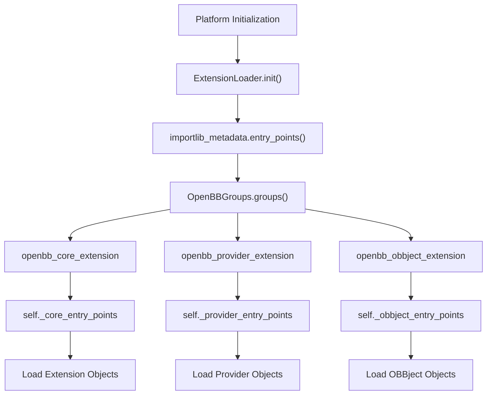
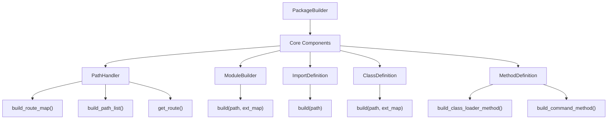
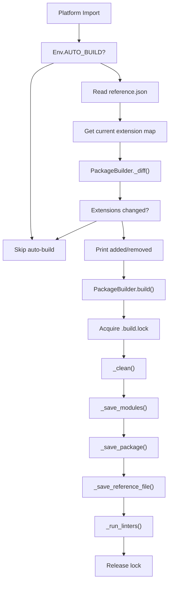
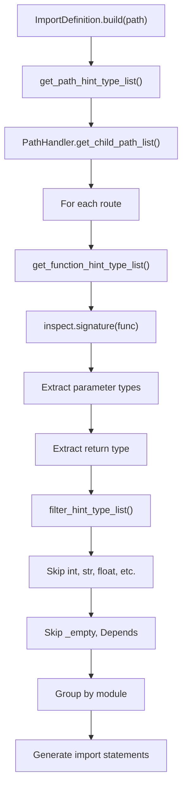
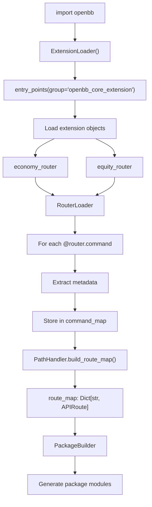
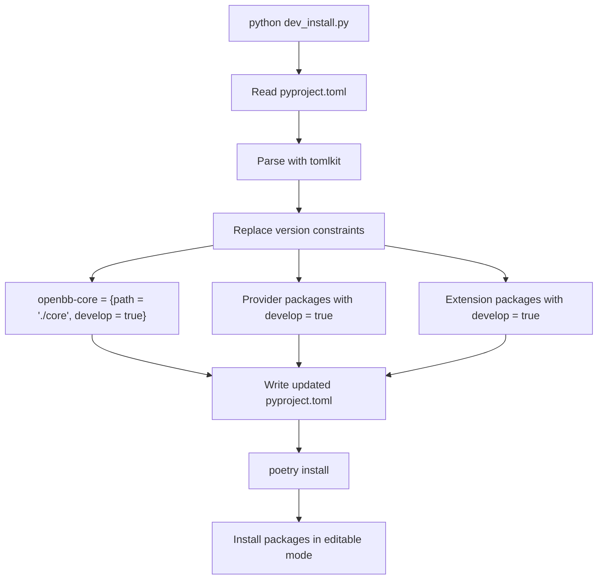

# Extension System

Relevant source files

-   [cli/tests/test\_argparse\_translator\_obbject\_registry.py](https://github.com/OpenBB-finance/OpenBB/blob/dddc3b32/cli/tests/test_argparse_translator_obbject_registry.py)
-   [frontend-components/plotly/src/data/mockup.ts](https://github.com/OpenBB-finance/OpenBB/blob/dddc3b32/frontend-components/plotly/src/data/mockup.ts)
-   [openbb\_platform/core/openbb\_core/api/app\_loader.py](https://github.com/OpenBB-finance/OpenBB/blob/dddc3b32/openbb_platform/core/openbb_core/api/app_loader.py)
-   [openbb\_platform/core/openbb\_core/api/exception\_handlers.py](https://github.com/OpenBB-finance/OpenBB/blob/dddc3b32/openbb_platform/core/openbb_core/api/exception_handlers.py)
-   [openbb\_platform/core/openbb\_core/api/rest\_api.py](https://github.com/OpenBB-finance/OpenBB/blob/dddc3b32/openbb_platform/core/openbb_core/api/rest_api.py)
-   [openbb\_platform/core/openbb\_core/api/router/commands.py](https://github.com/OpenBB-finance/OpenBB/blob/dddc3b32/openbb_platform/core/openbb_core/api/router/commands.py)
-   [openbb\_platform/core/openbb\_core/api/router/coverage.py](https://github.com/OpenBB-finance/OpenBB/blob/dddc3b32/openbb_platform/core/openbb_core/api/router/coverage.py)
-   [openbb\_platform/core/openbb\_core/app/command\_runner.py](https://github.com/OpenBB-finance/OpenBB/blob/dddc3b32/openbb_platform/core/openbb_core/app/command_runner.py)
-   [openbb\_platform/core/openbb\_core/app/extension\_loader.py](https://github.com/OpenBB-finance/OpenBB/blob/dddc3b32/openbb_platform/core/openbb_core/app/extension_loader.py)
-   [openbb\_platform/core/openbb\_core/app/logs/handlers\_manager.py](https://github.com/OpenBB-finance/OpenBB/blob/dddc3b32/openbb_platform/core/openbb_core/app/logs/handlers_manager.py)
-   [openbb\_platform/core/openbb\_core/app/logs/logging\_service.py](https://github.com/OpenBB-finance/OpenBB/blob/dddc3b32/openbb_platform/core/openbb_core/app/logs/logging_service.py)
-   [openbb\_platform/core/openbb\_core/app/logs/models/logging\_settings.py](https://github.com/OpenBB-finance/OpenBB/blob/dddc3b32/openbb_platform/core/openbb_core/app/logs/models/logging_settings.py)
-   [openbb\_platform/core/openbb\_core/app/model/abstract/tagged.py](https://github.com/OpenBB-finance/OpenBB/blob/dddc3b32/openbb_platform/core/openbb_core/app/model/abstract/tagged.py)
-   [openbb\_platform/core/openbb\_core/app/model/charts/chart.py](https://github.com/OpenBB-finance/OpenBB/blob/dddc3b32/openbb_platform/core/openbb_core/app/model/charts/chart.py)
-   [openbb\_platform/core/openbb\_core/app/model/charts/charting\_settings.py](https://github.com/OpenBB-finance/OpenBB/blob/dddc3b32/openbb_platform/core/openbb_core/app/model/charts/charting_settings.py)
-   [openbb\_platform/core/openbb\_core/app/model/defaults.py](https://github.com/OpenBB-finance/OpenBB/blob/dddc3b32/openbb_platform/core/openbb_core/app/model/defaults.py)
-   [openbb\_platform/core/openbb\_core/app/model/extension.py](https://github.com/OpenBB-finance/OpenBB/blob/dddc3b32/openbb_platform/core/openbb_core/app/model/extension.py)
-   [openbb\_platform/core/openbb\_core/app/model/obbject.py](https://github.com/OpenBB-finance/OpenBB/blob/dddc3b32/openbb_platform/core/openbb_core/app/model/obbject.py)
-   [openbb\_platform/core/openbb\_core/app/model/system\_settings.py](https://github.com/OpenBB-finance/OpenBB/blob/dddc3b32/openbb_platform/core/openbb_core/app/model/system_settings.py)
-   [openbb\_platform/core/openbb\_core/app/provider\_interface.py](https://github.com/OpenBB-finance/OpenBB/blob/dddc3b32/openbb_platform/core/openbb_core/app/provider_interface.py)
-   [openbb\_platform/core/openbb\_core/app/router.py](https://github.com/OpenBB-finance/OpenBB/blob/dddc3b32/openbb_platform/core/openbb_core/app/router.py)
-   [openbb\_platform/core/openbb\_core/app/service/system\_service.py](https://github.com/OpenBB-finance/OpenBB/blob/dddc3b32/openbb_platform/core/openbb_core/app/service/system_service.py)
-   [openbb\_platform/core/openbb\_core/app/static/container.py](https://github.com/OpenBB-finance/OpenBB/blob/dddc3b32/openbb_platform/core/openbb_core/app/static/container.py)
-   [openbb\_platform/core/openbb\_core/app/static/package\_builder.py](https://github.com/OpenBB-finance/OpenBB/blob/dddc3b32/openbb_platform/core/openbb_core/app/static/package_builder.py)
-   [openbb\_platform/core/openbb\_core/app/static/utils/filters.py](https://github.com/OpenBB-finance/OpenBB/blob/dddc3b32/openbb_platform/core/openbb_core/app/static/utils/filters.py)
-   [openbb\_platform/core/openbb\_core/app/utils.py](https://github.com/OpenBB-finance/OpenBB/blob/dddc3b32/openbb_platform/core/openbb_core/app/utils.py)
-   [openbb\_platform/core/openbb\_core/env.py](https://github.com/OpenBB-finance/OpenBB/blob/dddc3b32/openbb_platform/core/openbb_core/env.py)
-   [openbb\_platform/core/openbb\_core/provider/registry\_map.py](https://github.com/OpenBB-finance/OpenBB/blob/dddc3b32/openbb_platform/core/openbb_core/provider/registry_map.py)
-   [openbb\_platform/core/openbb\_core/provider/standard\_models/fred\_release\_table.py](https://github.com/OpenBB-finance/OpenBB/blob/dddc3b32/openbb_platform/core/openbb_core/provider/standard_models/fred_release_table.py)
-   [openbb\_platform/core/openbb\_core/provider/standard\_models/futures\_curve.py](https://github.com/OpenBB-finance/OpenBB/blob/dddc3b32/openbb_platform/core/openbb_core/provider/standard_models/futures_curve.py)
-   [openbb\_platform/core/openbb\_core/provider/standard\_models/primary\_dealer\_fails.py](https://github.com/OpenBB-finance/OpenBB/blob/dddc3b32/openbb_platform/core/openbb_core/provider/standard_models/primary_dealer_fails.py)
-   [openbb\_platform/core/openbb\_core/provider/standard\_models/yield\_curve.py](https://github.com/OpenBB-finance/OpenBB/blob/dddc3b32/openbb_platform/core/openbb_core/provider/standard_models/yield_curve.py)
-   [openbb\_platform/core/tests/app/logs/test\_handlers\_manager.py](https://github.com/OpenBB-finance/OpenBB/blob/dddc3b32/openbb_platform/core/tests/app/logs/test_handlers_manager.py)
-   [openbb\_platform/core/tests/app/logs/test\_logging\_service.py](https://github.com/OpenBB-finance/OpenBB/blob/dddc3b32/openbb_platform/core/tests/app/logs/test_logging_service.py)
-   [openbb\_platform/core/tests/app/model/charts/test\_chart.py](https://github.com/OpenBB-finance/OpenBB/blob/dddc3b32/openbb_platform/core/tests/app/model/charts/test_chart.py)
-   [openbb\_platform/core/tests/app/model/test\_extension.py](https://github.com/OpenBB-finance/OpenBB/blob/dddc3b32/openbb_platform/core/tests/app/model/test_extension.py)
-   [openbb\_platform/core/tests/app/model/test\_obbject.py](https://github.com/OpenBB-finance/OpenBB/blob/dddc3b32/openbb_platform/core/tests/app/model/test_obbject.py)
-   [openbb\_platform/core/tests/app/model/test\_system\_settings.py](https://github.com/OpenBB-finance/OpenBB/blob/dddc3b32/openbb_platform/core/tests/app/model/test_system_settings.py)
-   [openbb\_platform/core/tests/app/static/test\_filters.py](https://github.com/OpenBB-finance/OpenBB/blob/dddc3b32/openbb_platform/core/tests/app/static/test_filters.py)
-   [openbb\_platform/core/tests/app/static/test\_package\_builder.py](https://github.com/OpenBB-finance/OpenBB/blob/dddc3b32/openbb_platform/core/tests/app/static/test_package_builder.py)
-   [openbb\_platform/core/tests/app/test\_command\_runner.py](https://github.com/OpenBB-finance/OpenBB/blob/dddc3b32/openbb_platform/core/tests/app/test_command_runner.py)
-   [openbb\_platform/core/tests/app/test\_platform\_router.py](https://github.com/OpenBB-finance/OpenBB/blob/dddc3b32/openbb_platform/core/tests/app/test_platform_router.py)
-   [openbb\_platform/core/tests/app/test\_provider\_interface.py](https://github.com/OpenBB-finance/OpenBB/blob/dddc3b32/openbb_platform/core/tests/app/test_provider_interface.py)
-   [openbb\_platform/extensions/economy/integration/test\_economy\_api.py](https://github.com/OpenBB-finance/OpenBB/blob/dddc3b32/openbb_platform/extensions/economy/integration/test_economy_api.py)
-   [openbb\_platform/extensions/economy/integration/test\_economy\_python.py](https://github.com/OpenBB-finance/OpenBB/blob/dddc3b32/openbb_platform/extensions/economy/integration/test_economy_python.py)
-   [openbb\_platform/extensions/economy/openbb\_economy/economy\_router.py](https://github.com/OpenBB-finance/OpenBB/blob/dddc3b32/openbb_platform/extensions/economy/openbb_economy/economy_router.py)
-   [openbb\_platform/extensions/economy/openbb\_economy/survey/survey\_router.py](https://github.com/OpenBB-finance/OpenBB/blob/dddc3b32/openbb_platform/extensions/economy/openbb_economy/survey/survey_router.py)
-   [openbb\_platform/extensions/platform\_api/openbb\_platform\_api/assets/default\_apps.json](https://github.com/OpenBB-finance/OpenBB/blob/dddc3b32/openbb_platform/extensions/platform_api/openbb_platform_api/assets/default_apps.json)
-   [openbb\_platform/extensions/tests/test\_integration\_tests\_api.py](https://github.com/OpenBB-finance/OpenBB/blob/dddc3b32/openbb_platform/extensions/tests/test_integration_tests_api.py)
-   [openbb\_platform/extensions/tests/test\_integration\_tests\_python.py](https://github.com/OpenBB-finance/OpenBB/blob/dddc3b32/openbb_platform/extensions/tests/test_integration_tests_python.py)
-   [openbb\_platform/extensions/tests/utils/integration\_tests\_api\_generator.py](https://github.com/OpenBB-finance/OpenBB/blob/dddc3b32/openbb_platform/extensions/tests/utils/integration_tests_api_generator.py)
-   [openbb\_platform/extensions/tests/utils/integration\_tests\_testers.py](https://github.com/OpenBB-finance/OpenBB/blob/dddc3b32/openbb_platform/extensions/tests/utils/integration_tests_testers.py)
-   [openbb\_platform/obbject\_extensions/charting/openbb\_charting/charts/helpers.py](https://github.com/OpenBB-finance/OpenBB/blob/dddc3b32/openbb_platform/obbject_extensions/charting/openbb_charting/charts/helpers.py)
-   [openbb\_platform/obbject\_extensions/charting/tests/test\_charting.py](https://github.com/OpenBB-finance/OpenBB/blob/dddc3b32/openbb_platform/obbject_extensions/charting/tests/test_charting.py)
-   [openbb\_platform/providers/bls/openbb\_bls/utils/helpers.py](https://github.com/OpenBB-finance/OpenBB/blob/dddc3b32/openbb_platform/providers/bls/openbb_bls/utils/helpers.py)
-   [openbb\_platform/providers/cboe/openbb\_cboe/models/futures\_curve.py](https://github.com/OpenBB-finance/OpenBB/blob/dddc3b32/openbb_platform/providers/cboe/openbb_cboe/models/futures_curve.py)
-   [openbb\_platform/providers/cboe/tests/test\_cboe\_fetchers.py](https://github.com/OpenBB-finance/OpenBB/blob/dddc3b32/openbb_platform/providers/cboe/tests/test_cboe_fetchers.py)
-   [openbb\_platform/providers/federal\_reserve/openbb\_federal\_reserve/\_\_init\_\_.py](https://github.com/OpenBB-finance/OpenBB/blob/dddc3b32/openbb_platform/providers/federal_reserve/openbb_federal_reserve/__init__.py)
-   [openbb\_platform/providers/federal\_reserve/openbb\_federal\_reserve/assets/historical\_releases.json](https://github.com/OpenBB-finance/OpenBB/blob/dddc3b32/openbb_platform/providers/federal_reserve/openbb_federal_reserve/assets/historical_releases.json)
-   [openbb\_platform/providers/federal\_reserve/openbb\_federal\_reserve/models/fomc\_documents.py](https://github.com/OpenBB-finance/OpenBB/blob/dddc3b32/openbb_platform/providers/federal_reserve/openbb_federal_reserve/models/fomc_documents.py)
-   [openbb\_platform/providers/federal\_reserve/openbb\_federal\_reserve/models/primary\_dealer\_fails.py](https://github.com/OpenBB-finance/OpenBB/blob/dddc3b32/openbb_platform/providers/federal_reserve/openbb_federal_reserve/models/primary_dealer_fails.py)
-   [openbb\_platform/providers/federal\_reserve/openbb\_federal\_reserve/models/primary\_dealer\_positioning.py](https://github.com/OpenBB-finance/OpenBB/blob/dddc3b32/openbb_platform/providers/federal_reserve/openbb_federal_reserve/models/primary_dealer_positioning.py)
-   [openbb\_platform/providers/federal\_reserve/openbb\_federal\_reserve/utils/fomc\_documents.py](https://github.com/OpenBB-finance/OpenBB/blob/dddc3b32/openbb_platform/providers/federal_reserve/openbb_federal_reserve/utils/fomc_documents.py)
-   [openbb\_platform/providers/federal\_reserve/openbb\_federal\_reserve/utils/primary\_dealer\_statistics.py](https://github.com/OpenBB-finance/OpenBB/blob/dddc3b32/openbb_platform/providers/federal_reserve/openbb_federal_reserve/utils/primary_dealer_statistics.py)
-   [openbb\_platform/providers/federal\_reserve/tests/record/http/test\_federal\_reserve\_fetchers/test\_federal\_reserve\_fomc\_documents\_fetcher\_urllib3\_v2.yaml](https://github.com/OpenBB-finance/OpenBB/blob/dddc3b32/openbb_platform/providers/federal_reserve/tests/record/http/test_federal_reserve_fetchers/test_federal_reserve_fomc_documents_fetcher_urllib3_v2.yaml)
-   [openbb\_platform/providers/federal\_reserve/tests/record/http/test\_federal\_reserve\_fetchers/test\_federal\_reserve\_primary\_dealer\_fails\_fetcher\_urllib3\_v2.yaml](https://github.com/OpenBB-finance/OpenBB/blob/dddc3b32/openbb_platform/providers/federal_reserve/tests/record/http/test_federal_reserve_fetchers/test_federal_reserve_primary_dealer_fails_fetcher_urllib3_v2.yaml)
-   [openbb\_platform/providers/federal\_reserve/tests/test\_federal\_reserve\_fetchers.py](https://github.com/OpenBB-finance/OpenBB/blob/dddc3b32/openbb_platform/providers/federal_reserve/tests/test_federal_reserve_fetchers.py)
-   [openbb\_platform/providers/fred/openbb\_fred/\_\_init\_\_.py](https://github.com/OpenBB-finance/OpenBB/blob/dddc3b32/openbb_platform/providers/fred/openbb_fred/__init__.py)
-   [openbb\_platform/providers/fred/openbb\_fred/models/manufacturing\_outlook\_ny.py](https://github.com/OpenBB-finance/OpenBB/blob/dddc3b32/openbb_platform/providers/fred/openbb_fred/models/manufacturing_outlook_ny.py)
-   [openbb\_platform/providers/fred/openbb\_fred/models/release\_table.py](https://github.com/OpenBB-finance/OpenBB/blob/dddc3b32/openbb_platform/providers/fred/openbb_fred/models/release_table.py)
-   [openbb\_platform/providers/fred/tests/record/http/test\_fred\_fetchers/test\_fred\_manufacturing\_outlook\_ny\_fetcher\_urllib3\_v2.yaml](https://github.com/OpenBB-finance/OpenBB/blob/dddc3b32/openbb_platform/providers/fred/tests/record/http/test_fred_fetchers/test_fred_manufacturing_outlook_ny_fetcher_urllib3_v2.yaml)
-   [openbb\_platform/providers/fred/tests/test\_fred\_fetchers.py](https://github.com/OpenBB-finance/OpenBB/blob/dddc3b32/openbb_platform/providers/fred/tests/test_fred_fetchers.py)

The Extension System provides a plugin architecture that dynamically discovers, loads, and builds Python packages for extensions at runtime. The `PackageBuilder` class generates Python modules from discovered extensions, creating the `openbb.package.*` hierarchy that users interact with. Extensions are discovered via Python entry points and automatically built when changes are detected.

This page focuses on the technical mechanics of how extensions are built and loaded. For information about specific extensions like Economy or Equity, see section 3. For creating custom extensions, see section 6.3.

## Extension Types and Entry Points

Extensions are discovered through Python's `entry_points` system defined in `pyproject.toml` files. The `OpenBBGroups` enum defines three entry point groups:

| Group Name | Purpose | Example Package |
| --- | --- | --- |
| `openbb_core_extension` | Router definitions for API endpoints | `openbb-economy`, `openbb-equity` |
| `openbb_provider_extension` | Data fetcher implementations | `openbb-fmp`, `openbb-fred`, `openbb-yfinance` |
| `openbb_obbject_extension` | OBBject accessor methods | `openbb-charting` |

**Entry Point Definition**

Each extension package declares its entry point in `pyproject.toml`:

```
[tool.poetry.plugins."openbb_provider_extension"]yfinance = "openbb_yfinance:yfinance_provider"
```
The `ExtensionLoader` singleton class discovers these entry points at runtime using `importlib_metadata.entry_points()`.

**Extension Entry Point Discovery Flow**


Sources:

-   [openbb\_platform/core/openbb\_core/app/extension\_loader.py16-30](https://github.com/OpenBB-finance/OpenBB/blob/dddc3b32/openbb_platform/core/openbb_core/app/extension_loader.py#L16-L30)
-   [openbb\_platform/core/openbb\_core/app/extension\_loader.py95-172](https://github.com/OpenBB-finance/OpenBB/blob/dddc3b32/openbb_platform/core/openbb_core/app/extension_loader.py#L95-L172)
-   [openbb\_platform/providers/yfinance/pyproject.toml19-20](https://github.com/OpenBB-finance/OpenBB/blob/dddc3b32/openbb_platform/providers/yfinance/pyproject.toml#L19-L20)

## PackageBuilder Architecture

The `PackageBuilder` class generates Python modules in `openbb_platform/core/openbb/package/` that expose extension functionality. It transforms the discovered router structure into importable Python code.

**PackageBuilder Components**


**Key Classes and Methods**

| Class | Key Methods | Purpose |
| --- | --- | --- |
| `PackageBuilder` | `build()`, `auto_build()`, `_save_modules()` | Orchestrates the build process |
| `PathHandler` | `build_route_map()`, `build_path_list()` | Maps routes to paths |
| `ModuleBuilder` | `build()` | Generates module code |
| `ImportDefinition` | `build()`, `get_path_hint_type_list()` | Generates import statements |
| `ClassDefinition` | `build()` | Generates class definitions |
| `MethodDefinition` | `build_command_method()`, `build_class_loader_method()` | Generates method code |

Sources:

-   [openbb\_platform/core/openbb\_core/app/static/package\_builder.py135-206](https://github.com/OpenBB-finance/OpenBB/blob/dddc3b32/openbb_platform/core/openbb_core/app/static/package_builder.py#L135-L206)
-   [openbb\_platform/core/openbb\_core/app/static/package\_builder.py364-376](https://github.com/OpenBB-finance/OpenBB/blob/dddc3b32/openbb_platform/core/openbb_core/app/static/package_builder.py#L364-L376)
-   [openbb\_platform/core/openbb\_core/app/static/package\_builder.py668-760](https://github.com/OpenBB-finance/OpenBB/blob/dddc3b32/openbb_platform/core/openbb_core/app/static/package_builder.py#L668-L760)

## Auto-Build Mechanism

The `PackageBuilder.auto_build()` method triggers a rebuild when installed extensions differ from the built extensions. It compares the current extension map against `reference.json`.

**Auto-Build Flow**


**Extension Diff Detection**

The `_diff()` method compares extension versions:

```
# Extensions are stored as "name@version" stringsbuilt = set(ext_map.get("openbb_core_extension", {}))installed = set(f"{e.name}@{e.dist.version}" for e in entry_points(group="openbb_core_extension"))add = installed - builtremove = built - installed
```
**File Lock Mechanism**

PackageBuilder uses a cross-platform file lock (`FileLock` class) via `.build.lock` to prevent concurrent builds:

-   On Unix: uses `fcntl.flock()`
-   On Windows: uses `msvcrt.locking()`

Sources:

-   [openbb\_platform/core/openbb\_core/app/static/package\_builder.py150-169](https://github.com/OpenBB-finance/OpenBB/blob/dddc3b32/openbb_platform/core/openbb_core/app/static/package_builder.py#L150-L169)
-   [openbb\_platform/core/openbb\_core/app/static/package\_builder.py318-361](https://github.com/OpenBB-finance/OpenBB/blob/dddc3b32/openbb_platform/core/openbb_core/app/static/package_builder.py#L318-L361)
-   [openbb\_platform/core/openbb\_core/app/static/package\_builder.py96-133](https://github.com/OpenBB-finance/OpenBB/blob/dddc3b32/openbb_platform/core/openbb_core/app/static/package_builder.py#L96-L133)

## Build Process Details

The `PackageBuilder.build()` method executes a six-step process that transforms router structures into Python modules.

**Build Step Sequence**

> **[Mermaid sequence]**
> *(图表结构无法解析)*

**Generated Module Structure**

For a path like `/equity/price`, the builder generates:

```
openbb/package/
├── __init__.py
├── equity.py                    # Contains EQUITY class
└── equity_price.py              # Contains EQUITYPrice class
```
Each module contains:

1.  Auto-generated imports (from `ImportDefinition.build()`)
2.  A class inheriting from `Container` (from `ClassDefinition.build()`)
3.  Command methods or sub-router properties (from `MethodDefinition`)

Sources:

-   [openbb\_platform/core/openbb\_core/app/static/package\_builder.py170-207](https://github.com/OpenBB-finance/OpenBB/blob/dddc3b32/openbb_platform/core/openbb_core/app/static/package_builder.py#L170-L207)
-   [openbb\_platform/core/openbb\_core/app/static/package\_builder.py231-261](https://github.com/OpenBB-finance/OpenBB/blob/dddc3b32/openbb_platform/core/openbb_core/app/static/package_builder.py#L231-L261)
-   [openbb\_platform/core/openbb\_core/app/static/package\_builder.py262-267](https://github.com/OpenBB-finance/OpenBB/blob/dddc3b32/openbb_platform/core/openbb_core/app/static/package_builder.py#L262-L267)

## Code Generation Details

The `ModuleBuilder`, `ImportDefinition`, `ClassDefinition`, and `MethodDefinition` classes generate Python code from router metadata.

**Import Generation**

`ImportDefinition.build()` analyzes type hints from routes and generates necessary imports:


**Method Generation for Commands**

`MethodDefinition.build_command_method()` creates wrapper methods that:

1.  Extract parameters from `locals()`
2.  Call `filter_inputs()` to validate inputs
3.  Execute via `self._command_runner.sync_run()`
4.  Return `OBBject`

**Method Generation for Sub-routers**

`MethodDefinition.build_class_loader_method()` creates `@property` methods that lazily load sub-router classes:

```
@propertydef price(self):    """Price data endpoints."""    from . import equity_price    return equity_price.EQUITYPrice(command_runner=self._command_runner)
```
Sources:

-   [openbb\_platform/core/openbb\_core/app/static/package\_builder.py457-528](https://github.com/OpenBB-finance/OpenBB/blob/dddc3b32/openbb_platform/core/openbb_core/app/static/package_builder.py#L457-L528)
-   [openbb\_platform/core/openbb\_core/app/static/package\_builder.py924-939](https://github.com/OpenBB-finance/OpenBB/blob/dddc3b32/openbb_platform/core/openbb_core/app/static/package_builder.py#L924-L939)
-   [openbb\_platform/core/openbb\_core/app/static/package\_builder.py1065-1281](https://github.com/OpenBB-finance/OpenBB/blob/dddc3b32/openbb_platform/core/openbb_core/app/static/package_builder.py#L1065-L1281)

## Reference File Generation

The `_save_reference_file()` method generates `openbb/assets/reference.json` containing:

-   OpenBB version
-   Core version
-   Installed extensions map (by group)
-   Paths metadata from `ReferenceGenerator.get_paths()`
-   Routers metadata from `ReferenceGenerator.get_routers()`

**reference.json Structure**

```
{    "openbb": "1.5.8",    "info": {        "title": "OpenBB Platform (Python)",        "description": "Investment research for everyone, anywhere.",        "core": "1.5.8",        "extensions": {            "openbb_core_extension": ["economy@1.5.1", "equity@1.5.1"],            "openbb_provider_extension": ["fmp@1.5.2", "yfinance@1.5.2"],            "openbb_obbject_extension": ["charting@2.4.1"]        }    },    "paths": {...},    "routers": {...}}
```
This file is used by `auto_build()` to detect extension changes.

Sources:

-   [openbb\_platform/core/openbb\_core/app/static/package\_builder.py269-286](https://github.com/OpenBB-finance/OpenBB/blob/dddc3b32/openbb_platform/core/openbb_core/app/static/package_builder.py#L269-L286)
-   [openbb\_platform/core/openbb/assets/reference.json1-15](https://github.com/OpenBB-finance/OpenBB/blob/dddc3b32/openbb_platform/core/openbb/assets/reference.json#L1-L15)

## Router Registration Flow

When extensions are loaded, core extensions provide `Router` objects that are registered with the platform's router system.

**Router Loading and Command Map Generation**


**Command Decorator Registration**

The `@router.command()` decorator registers commands on the `Router.api_router` (FastAPI `APIRouter`):

```
@router.command(    model="EquityHistorical",    examples=[...],)def historical(...)
```
This stores:

-   `openapi_extra["model"]` - Standard model name
-   `openapi_extra["examples"]` - Usage examples
-   `operation_id` - Unique operation identifier
-   `path` - API endpoint path

Sources:

-   [openbb\_platform/core/openbb\_core/app/router.py87-147](https://github.com/OpenBB-finance/OpenBB/blob/dddc3b32/openbb_platform/core/openbb_core/app/router.py#L87-L147)
-   [openbb\_platform/core/openbb\_core/app/router.py502-555](https://github.com/OpenBB-finance/OpenBB/blob/dddc3b32/openbb_platform/core/openbb_core/app/router.py#L502-L555)
-   [openbb\_platform/core/openbb\_core/app/static/package\_builder.py146-147](https://github.com/OpenBB-finance/OpenBB/blob/dddc3b32/openbb_platform/core/openbb_core/app/static/package_builder.py#L146-L147)

## Development Mode Installation

The `dev_install.py` script configures local development by replacing version constraints with path dependencies in `pyproject.toml`.

**Development Installation Process**


**Path Dependency Configuration**

The script transforms:

```
openbb-core = "^1.5.8"
```
Into:

```
openbb-core = { path = "./core", develop = true }
```
This allows local changes to immediately reflect without reinstallation. When combined with `PackageBuilder.auto_build()`, any extension changes trigger a rebuild on next import.

Sources:

-   [openbb\_platform/dev\_install.py1-152](https://github.com/OpenBB-finance/OpenBB/blob/dddc3b32/openbb_platform/dev_install.py#L1-L152)
-   [openbb\_platform/dev\_install.py18-68](https://github.com/OpenBB-finance/OpenBB/blob/dddc3b32/openbb_platform/dev_install.py#L18-L68)

## Key Classes and Methods

**PackageBuilder Class**

| Method | Parameters | Purpose |
| --- | --- | --- |
| `__init__()` | `directory`, `lint`, `verbose` | Initialize builder with target directory |
| `auto_build()` | None | Check extension changes and trigger build if needed |
| `build()` | `modules` (optional) | Execute full build process |
| `_clean()` | `modules` | Delete previous build artifacts |
| `_get_extension_map()` | None | Get installed extensions grouped by type |
| `_save_modules()` | `modules`, `ext_map` | Generate and write module files |
| `_save_package()` | None | Write package `__init__.py` |
| `_save_reference_file()` | `ext_map` | Write `reference.json` |
| `_run_linters()` | None | Run ruff and black on generated code |
| `_write()` | `code`, `name`, `extension`, `folder` | Write code to file |

**PathHandler Class**

| Method | Purpose |
| --- | --- |
| `build_route_map()` | Create `Dict[str, APIRoute]` from all routers |
| `build_path_list()` | Extract unique paths from route\_map |
| `get_route()` | Get APIRoute for a specific path |
| `get_child_path_list()` | Get child paths for a parent path |
| `build_module_name()` | Convert path to module name (e.g., `/equity/price` → `equity_price`) |
| `build_module_class()` | Convert path to class name (e.g., `/equity/price` → `EQUITYPrice`) |

Sources:

-   [openbb\_platform/core/openbb\_core/app/static/package\_builder.py135-306](https://github.com/OpenBB-finance/OpenBB/blob/dddc3b32/openbb_platform/core/openbb_core/app/static/package_builder.py#L135-L306)
-   [openbb\_platform/core/openbb\_core/app/static/package\_builder.py1473-1651](https://github.com/OpenBB-finance/OpenBB/blob/dddc3b32/openbb_platform/core/openbb_core/app/static/package_builder.py#L1473-L1651)

## Extension System API

The Extension System primarily exposes its functionality through the `ExtensionLoader` class, which provides the following key methods:

| Method | Description |
| --- | --- |
| `obbject_entry_points` | Returns OBBject entry points |
| `core_entry_points` | Returns core entry points |
| `provider_entry_points` | Returns provider entry points |
| `entry_points` | Returns all entry points |
| `obbject_objects` | Returns loaded OBBject extension objects |
| `core_objects` | Returns loaded core extension objects |
| `provider_objects` | Returns loaded provider extension objects |
| `get_obbject_entry_point` | Gets an OBBject entry point by name |
| `get_core_entry_point` | Gets a core entry point by name |
| `get_provider_entry_point` | Gets a provider entry point by name |

Sources:

-   [openbb\_platform/core/openbb\_core/app/extension\_loader.py54-123](https://github.com/OpenBB-finance/OpenBB/blob/dddc3b32/openbb_platform/core/openbb_core/app/extension_loader.py#L54-L123)
-   [openbb\_platform/core/tests/app/test\_extension\_loader.py](https://github.com/OpenBB-finance/OpenBB/blob/dddc3b32/openbb_platform/core/tests/app/test_extension_loader.py)

## Error Handling in Extensions

The Extension System includes error handling for extension loading and execution. If an extension fails to load, the system logs a warning but continues to load other extensions, ensuring that the platform remains operational even if some extensions have issues.

During command execution, errors from extensions are caught and returned as appropriate error responses, with detailed information in debug mode.

Sources:

-   [openbb\_platform/core/openbb\_core/app/router.py515-522](https://github.com/OpenBB-finance/OpenBB/blob/dddc3b32/openbb_platform/core/openbb_core/app/router.py#L515-L522)
-   [openbb\_platform/core/openbb\_core/api/exception\_handlers.py20-134](https://github.com/OpenBB-finance/OpenBB/blob/dddc3b32/openbb_platform/core/openbb_core/api/exception_handlers.py#L20-L134)
-   [openbb\_platform/core/openbb\_core/provider/utils/errors.py8-40](https://github.com/OpenBB-finance/OpenBB/blob/dddc3b32/openbb_platform/core/openbb_core/provider/utils/errors.py#L8-L40)

## Summary

The Extension System is a fundamental component of the OpenBB Platform that enables modularity and extensibility. It allows for seamless integration of new financial data APIs, data providers, and output object enhancements through a standardized entry point mechanism. The system handles discovery, loading, and integration of extensions with the rest of the platform, providing a robust foundation for extending the platform's capabilities.
