# Provider Architecture

Relevant source files

-   [cli/tests/test\_argparse\_translator\_obbject\_registry.py](https://github.com/OpenBB-finance/OpenBB/blob/dddc3b32/cli/tests/test_argparse_translator_obbject_registry.py)
-   [openbb\_platform/core/openbb\_core/api/app\_loader.py](https://github.com/OpenBB-finance/OpenBB/blob/dddc3b32/openbb_platform/core/openbb_core/api/app_loader.py)
-   [openbb\_platform/core/openbb\_core/api/exception\_handlers.py](https://github.com/OpenBB-finance/OpenBB/blob/dddc3b32/openbb_platform/core/openbb_core/api/exception_handlers.py)
-   [openbb\_platform/core/openbb\_core/api/rest\_api.py](https://github.com/OpenBB-finance/OpenBB/blob/dddc3b32/openbb_platform/core/openbb_core/api/rest_api.py)
-   [openbb\_platform/core/openbb\_core/api/router/coverage.py](https://github.com/OpenBB-finance/OpenBB/blob/dddc3b32/openbb_platform/core/openbb_core/api/router/coverage.py)
-   [openbb\_platform/core/openbb\_core/app/model/charts/chart.py](https://github.com/OpenBB-finance/OpenBB/blob/dddc3b32/openbb_platform/core/openbb_core/app/model/charts/chart.py)
-   [openbb\_platform/core/openbb\_core/app/provider\_interface.py](https://github.com/OpenBB-finance/OpenBB/blob/dddc3b32/openbb_platform/core/openbb_core/app/provider_interface.py)
-   [openbb\_platform/core/openbb\_core/app/router.py](https://github.com/OpenBB-finance/OpenBB/blob/dddc3b32/openbb_platform/core/openbb_core/app/router.py)
-   [openbb\_platform/core/openbb\_core/app/static/package\_builder.py](https://github.com/OpenBB-finance/OpenBB/blob/dddc3b32/openbb_platform/core/openbb_core/app/static/package_builder.py)
-   [openbb\_platform/core/openbb\_core/app/static/utils/filters.py](https://github.com/OpenBB-finance/OpenBB/blob/dddc3b32/openbb_platform/core/openbb_core/app/static/utils/filters.py)
-   [openbb\_platform/core/openbb\_core/app/utils.py](https://github.com/OpenBB-finance/OpenBB/blob/dddc3b32/openbb_platform/core/openbb_core/app/utils.py)
-   [openbb\_platform/core/openbb\_core/provider/registry\_map.py](https://github.com/OpenBB-finance/OpenBB/blob/dddc3b32/openbb_platform/core/openbb_core/provider/registry_map.py)
-   [openbb\_platform/core/openbb\_core/provider/standard\_models/company\_filings.py](https://github.com/OpenBB-finance/OpenBB/blob/dddc3b32/openbb_platform/core/openbb_core/provider/standard_models/company_filings.py)
-   [openbb\_platform/core/openbb\_core/provider/standard\_models/fred\_release\_table.py](https://github.com/OpenBB-finance/OpenBB/blob/dddc3b32/openbb_platform/core/openbb_core/provider/standard_models/fred_release_table.py)
-   [openbb\_platform/core/openbb\_core/provider/standard\_models/futures\_curve.py](https://github.com/OpenBB-finance/OpenBB/blob/dddc3b32/openbb_platform/core/openbb_core/provider/standard_models/futures_curve.py)
-   [openbb\_platform/core/openbb\_core/provider/standard\_models/primary\_dealer\_fails.py](https://github.com/OpenBB-finance/OpenBB/blob/dddc3b32/openbb_platform/core/openbb_core/provider/standard_models/primary_dealer_fails.py)
-   [openbb\_platform/core/openbb\_core/provider/standard\_models/yield\_curve.py](https://github.com/OpenBB-finance/OpenBB/blob/dddc3b32/openbb_platform/core/openbb_core/provider/standard_models/yield_curve.py)
-   [openbb\_platform/core/tests/app/model/charts/test\_chart.py](https://github.com/OpenBB-finance/OpenBB/blob/dddc3b32/openbb_platform/core/tests/app/model/charts/test_chart.py)
-   [openbb\_platform/core/tests/app/static/test\_filters.py](https://github.com/OpenBB-finance/OpenBB/blob/dddc3b32/openbb_platform/core/tests/app/static/test_filters.py)
-   [openbb\_platform/core/tests/app/static/test\_package\_builder.py](https://github.com/OpenBB-finance/OpenBB/blob/dddc3b32/openbb_platform/core/tests/app/static/test_package_builder.py)
-   [openbb\_platform/core/tests/app/test\_platform\_router.py](https://github.com/OpenBB-finance/OpenBB/blob/dddc3b32/openbb_platform/core/tests/app/test_platform_router.py)
-   [openbb\_platform/core/tests/app/test\_provider\_interface.py](https://github.com/OpenBB-finance/OpenBB/blob/dddc3b32/openbb_platform/core/tests/app/test_provider_interface.py)
-   [openbb\_platform/extensions/economy/integration/test\_economy\_api.py](https://github.com/OpenBB-finance/OpenBB/blob/dddc3b32/openbb_platform/extensions/economy/integration/test_economy_api.py)
-   [openbb\_platform/extensions/economy/integration/test\_economy\_python.py](https://github.com/OpenBB-finance/OpenBB/blob/dddc3b32/openbb_platform/extensions/economy/integration/test_economy_python.py)
-   [openbb\_platform/extensions/economy/openbb\_economy/economy\_router.py](https://github.com/OpenBB-finance/OpenBB/blob/dddc3b32/openbb_platform/extensions/economy/openbb_economy/economy_router.py)
-   [openbb\_platform/extensions/economy/openbb\_economy/survey/survey\_router.py](https://github.com/OpenBB-finance/OpenBB/blob/dddc3b32/openbb_platform/extensions/economy/openbb_economy/survey/survey_router.py)
-   [openbb\_platform/extensions/equity/integration/test\_equity\_api.py](https://github.com/OpenBB-finance/OpenBB/blob/dddc3b32/openbb_platform/extensions/equity/integration/test_equity_api.py)
-   [openbb\_platform/extensions/equity/integration/test\_equity\_python.py](https://github.com/OpenBB-finance/OpenBB/blob/dddc3b32/openbb_platform/extensions/equity/integration/test_equity_python.py)
-   [openbb\_platform/extensions/equity/openbb\_equity/fundamental/fundamental\_router.py](https://github.com/OpenBB-finance/OpenBB/blob/dddc3b32/openbb_platform/extensions/equity/openbb_equity/fundamental/fundamental_router.py)
-   [openbb\_platform/extensions/etf/integration/test\_etf\_api.py](https://github.com/OpenBB-finance/OpenBB/blob/dddc3b32/openbb_platform/extensions/etf/integration/test_etf_api.py)
-   [openbb\_platform/extensions/etf/integration/test\_etf\_python.py](https://github.com/OpenBB-finance/OpenBB/blob/dddc3b32/openbb_platform/extensions/etf/integration/test_etf_python.py)
-   [openbb\_platform/extensions/platform\_api/openbb\_platform\_api/assets/default\_apps.json](https://github.com/OpenBB-finance/OpenBB/blob/dddc3b32/openbb_platform/extensions/platform_api/openbb_platform_api/assets/default_apps.json)
-   [openbb\_platform/extensions/tests/test\_integration\_tests\_api.py](https://github.com/OpenBB-finance/OpenBB/blob/dddc3b32/openbb_platform/extensions/tests/test_integration_tests_api.py)
-   [openbb\_platform/extensions/tests/test\_integration\_tests\_python.py](https://github.com/OpenBB-finance/OpenBB/blob/dddc3b32/openbb_platform/extensions/tests/test_integration_tests_python.py)
-   [openbb\_platform/extensions/tests/utils/integration\_tests\_api\_generator.py](https://github.com/OpenBB-finance/OpenBB/blob/dddc3b32/openbb_platform/extensions/tests/utils/integration_tests_api_generator.py)
-   [openbb\_platform/extensions/tests/utils/integration\_tests\_testers.py](https://github.com/OpenBB-finance/OpenBB/blob/dddc3b32/openbb_platform/extensions/tests/utils/integration_tests_testers.py)
-   [openbb\_platform/obbject\_extensions/charting/tests/test\_charting.py](https://github.com/OpenBB-finance/OpenBB/blob/dddc3b32/openbb_platform/obbject_extensions/charting/tests/test_charting.py)
-   [openbb\_platform/providers/bls/openbb\_bls/utils/helpers.py](https://github.com/OpenBB-finance/OpenBB/blob/dddc3b32/openbb_platform/providers/bls/openbb_bls/utils/helpers.py)
-   [openbb\_platform/providers/cboe/openbb\_cboe/models/futures\_curve.py](https://github.com/OpenBB-finance/OpenBB/blob/dddc3b32/openbb_platform/providers/cboe/openbb_cboe/models/futures_curve.py)
-   [openbb\_platform/providers/cboe/tests/test\_cboe\_fetchers.py](https://github.com/OpenBB-finance/OpenBB/blob/dddc3b32/openbb_platform/providers/cboe/tests/test_cboe_fetchers.py)
-   [openbb\_platform/providers/federal\_reserve/openbb\_federal\_reserve/\_\_init\_\_.py](https://github.com/OpenBB-finance/OpenBB/blob/dddc3b32/openbb_platform/providers/federal_reserve/openbb_federal_reserve/__init__.py)
-   [openbb\_platform/providers/federal\_reserve/openbb\_federal\_reserve/assets/historical\_releases.json](https://github.com/OpenBB-finance/OpenBB/blob/dddc3b32/openbb_platform/providers/federal_reserve/openbb_federal_reserve/assets/historical_releases.json)
-   [openbb\_platform/providers/federal\_reserve/openbb\_federal\_reserve/models/fomc\_documents.py](https://github.com/OpenBB-finance/OpenBB/blob/dddc3b32/openbb_platform/providers/federal_reserve/openbb_federal_reserve/models/fomc_documents.py)
-   [openbb\_platform/providers/federal\_reserve/openbb\_federal\_reserve/models/primary\_dealer\_fails.py](https://github.com/OpenBB-finance/OpenBB/blob/dddc3b32/openbb_platform/providers/federal_reserve/openbb_federal_reserve/models/primary_dealer_fails.py)
-   [openbb\_platform/providers/federal\_reserve/openbb\_federal\_reserve/models/primary\_dealer\_positioning.py](https://github.com/OpenBB-finance/OpenBB/blob/dddc3b32/openbb_platform/providers/federal_reserve/openbb_federal_reserve/models/primary_dealer_positioning.py)
-   [openbb\_platform/providers/federal\_reserve/openbb\_federal\_reserve/utils/fomc\_documents.py](https://github.com/OpenBB-finance/OpenBB/blob/dddc3b32/openbb_platform/providers/federal_reserve/openbb_federal_reserve/utils/fomc_documents.py)
-   [openbb\_platform/providers/federal\_reserve/openbb\_federal\_reserve/utils/primary\_dealer\_statistics.py](https://github.com/OpenBB-finance/OpenBB/blob/dddc3b32/openbb_platform/providers/federal_reserve/openbb_federal_reserve/utils/primary_dealer_statistics.py)
-   [openbb\_platform/providers/federal\_reserve/tests/record/http/test\_federal\_reserve\_fetchers/test\_federal\_reserve\_fomc\_documents\_fetcher\_urllib3\_v2.yaml](https://github.com/OpenBB-finance/OpenBB/blob/dddc3b32/openbb_platform/providers/federal_reserve/tests/record/http/test_federal_reserve_fetchers/test_federal_reserve_fomc_documents_fetcher_urllib3_v2.yaml)
-   [openbb\_platform/providers/federal\_reserve/tests/record/http/test\_federal\_reserve\_fetchers/test\_federal\_reserve\_primary\_dealer\_fails\_fetcher\_urllib3\_v2.yaml](https://github.com/OpenBB-finance/OpenBB/blob/dddc3b32/openbb_platform/providers/federal_reserve/tests/record/http/test_federal_reserve_fetchers/test_federal_reserve_primary_dealer_fails_fetcher_urllib3_v2.yaml)
-   [openbb\_platform/providers/federal\_reserve/tests/test\_federal\_reserve\_fetchers.py](https://github.com/OpenBB-finance/OpenBB/blob/dddc3b32/openbb_platform/providers/federal_reserve/tests/test_federal_reserve_fetchers.py)
-   [openbb\_platform/providers/fmp/openbb\_fmp/\_\_init\_\_.py](https://github.com/OpenBB-finance/OpenBB/blob/dddc3b32/openbb_platform/providers/fmp/openbb_fmp/__init__.py)
-   [openbb\_platform/providers/fmp/openbb\_fmp/models/company\_filings.py](https://github.com/OpenBB-finance/OpenBB/blob/dddc3b32/openbb_platform/providers/fmp/openbb_fmp/models/company_filings.py)
-   [openbb\_platform/providers/fmp/pyproject.toml](https://github.com/OpenBB-finance/OpenBB/blob/dddc3b32/openbb_platform/providers/fmp/pyproject.toml)
-   [openbb\_platform/providers/fmp/tests/test\_fmp\_fetchers.py](https://github.com/OpenBB-finance/OpenBB/blob/dddc3b32/openbb_platform/providers/fmp/tests/test_fmp_fetchers.py)
-   [openbb\_platform/providers/fred/openbb\_fred/\_\_init\_\_.py](https://github.com/OpenBB-finance/OpenBB/blob/dddc3b32/openbb_platform/providers/fred/openbb_fred/__init__.py)
-   [openbb\_platform/providers/fred/openbb\_fred/models/manufacturing\_outlook\_ny.py](https://github.com/OpenBB-finance/OpenBB/blob/dddc3b32/openbb_platform/providers/fred/openbb_fred/models/manufacturing_outlook_ny.py)
-   [openbb\_platform/providers/fred/openbb\_fred/models/release\_table.py](https://github.com/OpenBB-finance/OpenBB/blob/dddc3b32/openbb_platform/providers/fred/openbb_fred/models/release_table.py)
-   [openbb\_platform/providers/fred/tests/record/http/test\_fred\_fetchers/test\_fred\_manufacturing\_outlook\_ny\_fetcher\_urllib3\_v2.yaml](https://github.com/OpenBB-finance/OpenBB/blob/dddc3b32/openbb_platform/providers/fred/tests/record/http/test_fred_fetchers/test_fred_manufacturing_outlook_ny_fetcher_urllib3_v2.yaml)
-   [openbb\_platform/providers/fred/tests/test\_fred\_fetchers.py](https://github.com/OpenBB-finance/OpenBB/blob/dddc3b32/openbb_platform/providers/fred/tests/test_fred_fetchers.py)
-   [openbb\_platform/providers/intrinio/openbb\_intrinio/\_\_init\_\_.py](https://github.com/OpenBB-finance/OpenBB/blob/dddc3b32/openbb_platform/providers/intrinio/openbb_intrinio/__init__.py)
-   [openbb\_platform/providers/intrinio/openbb\_intrinio/models/company\_filings.py](https://github.com/OpenBB-finance/OpenBB/blob/dddc3b32/openbb_platform/providers/intrinio/openbb_intrinio/models/company_filings.py)
-   [openbb\_platform/providers/intrinio/tests/test\_intrinio\_fetchers.py](https://github.com/OpenBB-finance/OpenBB/blob/dddc3b32/openbb_platform/providers/intrinio/tests/test_intrinio_fetchers.py)
-   [openbb\_platform/providers/sec/openbb\_sec/\_\_init\_\_.py](https://github.com/OpenBB-finance/OpenBB/blob/dddc3b32/openbb_platform/providers/sec/openbb_sec/__init__.py)
-   [openbb\_platform/providers/sec/openbb\_sec/utils/form4.py](https://github.com/OpenBB-finance/OpenBB/blob/dddc3b32/openbb_platform/providers/sec/openbb_sec/utils/form4.py)
-   [openbb\_platform/providers/sec/tests/test\_sec\_fetchers.py](https://github.com/OpenBB-finance/OpenBB/blob/dddc3b32/openbb_platform/providers/sec/tests/test_sec_fetchers.py)
-   [openbb\_platform/providers/tmx/openbb\_tmx/models/company\_filings.py](https://github.com/OpenBB-finance/OpenBB/blob/dddc3b32/openbb_platform/providers/tmx/openbb_tmx/models/company_filings.py)

## Purpose and Scope

This document describes the Provider Architecture, which enables the OpenBB Platform to connect to multiple data sources through a unified abstraction layer. The architecture allows a single command like `obb.equity.price.historical()` to work with different data providers (FRED, FMP, Intrinio, etc.) while preserving both common and provider-specific parameters and fields.

For information about how commands are executed through this provider system, see [Command Execution Pipeline](/OpenBB-finance/OpenBB/2.1-command-execution-pipeline). For details on how providers are dynamically integrated into the Python SDK, see [Package Builder and Code Generation](/OpenBB-finance/OpenBB/2.4-package-builder-and-code-generation).

---

## Provider Registration and Discovery

### Provider Module Structure

Each provider is a Python package that registers itself through entry points. Providers declare which standard models they support by mapping model names to Fetcher classes.

**Example: FRED Provider Registration**

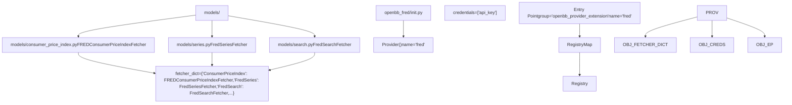
Sources: [openbb\_platform/providers/fred/openbb\_fred/\_\_init\_\_.py1-106](https://github.com/OpenBB-finance/OpenBB/blob/dddc3b32/openbb_platform/providers/fred/openbb_fred/__init__.py#L1-L106) [openbb\_platform/providers/fmp/openbb\_fmp/\_\_init\_\_.py1-151](https://github.com/OpenBB-finance/OpenBB/blob/dddc3b32/openbb_platform/providers/fmp/openbb_fmp/__init__.py#L1-L151) [openbb\_platform/providers/intrinio/openbb\_intrinio/\_\_init\_\_.py1-112](https://github.com/OpenBB-finance/OpenBB/blob/dddc3b32/openbb_platform/providers/intrinio/openbb_intrinio/__init__.py#L1-L112)

### Registry Map Construction

The `RegistryMap` class discovers all installed providers and builds a comprehensive map of which providers support which models.

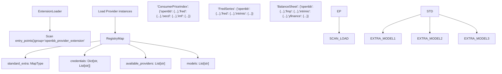
Sources: [openbb\_platform/core/openbb\_core/provider/registry\_map.py1-254](https://github.com/OpenBB-finance/OpenBB/blob/dddc3b32/openbb_platform/core/openbb_core/provider/registry_map.py#L1-L254) [openbb\_platform/core/openbb\_core/app/provider\_interface.py98-119](https://github.com/OpenBB-finance/OpenBB/blob/dddc3b32/openbb_platform/core/openbb_core/app/provider_interface.py#L98-L119)

---

## Standard vs Extra Parameters and Data

### The Standard/Extra Pattern

The provider architecture uses a dual-schema approach where each model defines:

-   **Standard Parameters/Data**: Common fields shared across all providers
-   **Extra Parameters/Data**: Provider-specific extensions

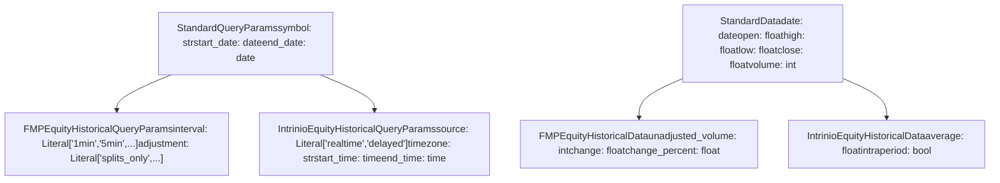
Sources: [openbb\_platform/core/openbb\_core/app/provider\_interface.py36-61](https://github.com/OpenBB-finance/OpenBB/blob/dddc3b32/openbb_platform/core/openbb_core/app/provider_interface.py#L36-L61) [openbb\_platform/providers/fmp/openbb\_fmp/models/equity\_historical.py](https://github.com/OpenBB-finance/OpenBB/blob/dddc3b32/openbb_platform/providers/fmp/openbb_fmp/models/equity_historical.py) [openbb\_platform/providers/intrinio/openbb\_intrinio/models/equity\_historical.py](https://github.com/OpenBB-finance/OpenBB/blob/dddc3b32/openbb_platform/providers/intrinio/openbb_intrinio/models/equity_historical.py)

### Runtime Parameter Merging

The `ProviderInterface` dynamically generates merged parameter classes at runtime by combining standard and provider-specific fields.

**Parameter Merging Process**

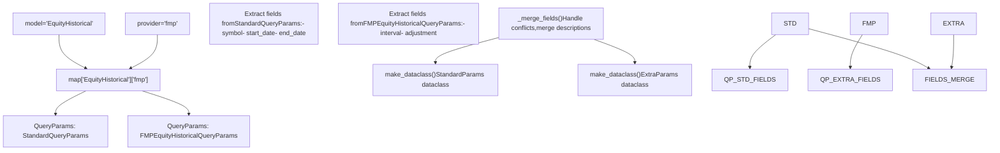
Sources: [openbb\_platform/core/openbb\_core/app/provider\_interface.py174-291](https://github.com/OpenBB-finance/OpenBB/blob/dddc3b32/openbb_platform/core/openbb_core/app/provider_interface.py#L174-L291) [openbb\_platform/core/openbb\_core/app/provider\_interface.py293-410](https://github.com/OpenBB-finance/OpenBB/blob/dddc3b32/openbb_platform/core/openbb_core/app/provider_interface.py#L293-L410)

---

## The Three-Stage Fetcher Pattern

### Fetcher Abstract Class

All provider implementations follow a three-stage pattern defined by the `Fetcher` abstract class:

1.  **`transform_query`**: Validate and transform input parameters
2.  **`extract_data`** (or `aextract_data`): Fetch raw data from provider API
3.  **`transform_data`**: Parse and validate response into standard format

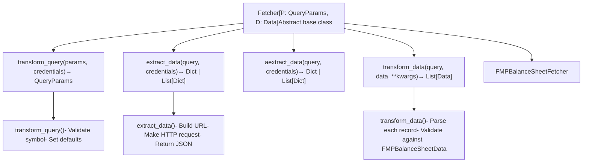
Sources: [openbb\_platform/core/openbb\_core/provider/abstract/fetcher.py](https://github.com/OpenBB-finance/OpenBB/blob/dddc3b32/openbb_platform/core/openbb_core/provider/abstract/fetcher.py) [openbb\_platform/providers/fmp/openbb\_fmp/models/balance\_sheet.py](https://github.com/OpenBB-finance/OpenBB/blob/dddc3b32/openbb_platform/providers/fmp/openbb_fmp/models/balance_sheet.py)

### Execution Flow Example

**Fetching Balance Sheet Data from FMP**

> **[Mermaid sequence]**
> *(图表结构无法解析)*

Sources: [openbb\_platform/core/openbb\_core/provider/query\_executor.py](https://github.com/OpenBB-finance/OpenBB/blob/dddc3b32/openbb_platform/core/openbb_core/provider/query_executor.py) [openbb\_platform/providers/fmp/openbb\_fmp/models/balance\_sheet.py](https://github.com/OpenBB-finance/OpenBB/blob/dddc3b32/openbb_platform/providers/fmp/openbb_fmp/models/balance_sheet.py)

---

## ProviderInterface: Dynamic Model Generation

### ProviderInterface Singleton

The `ProviderInterface` class serves as a singleton that coordinates all provider interactions and generates runtime type definitions.

**ProviderInterface Architecture**

```mermaid
flowchart TD
    PI["ProviderInterfacemetaclass=SingletonMeta"]
    MAP["map: MapTypeFull provider/model mapping"]
    CREDS["credentials: Dict[str, List[str]]"]
    MODEL_PROV["model_providers: Dict[str, ProviderChoices]"]
    PARAMS["params: Dict[str, Dict[str, StandardParams | ExtraParams]]"]
    DATA["data: Dict[str, Dict[str, StandardData | ExtraData]]"]
    RET_SCHEMA["return_schema: Dict[str, Type[BaseModel]]"]
    GEN_PROV["_generate_model_providers_dc()"]
    GEN_PARAMS["_generate_params_dc()"]
    GEN_DATA["_generate_data_dc()"]
    GEN_SCHEMA["_generate_return_schema()"]
    CREATE_EXEC["create_executor() → QueryExecutor"]
    PC["ProviderChoices dataclassprovider: Literal['fred','fmp','intrinio',...]"]
    SP["StandardParams dataclasssymbol: str, start_date: date, ..."]
    EP["ExtraParams dataclassinterval: str, adjustment: str, ..."]
    RET["Return Schema (Pydantic)SerializeAsAny[Annotated[Union[  Annotated[FredData, Tag('fred')],  Annotated[FmpData, Tag('fmp')],  ...], Discriminator(...)]]"]

    PI --> MAP
    PI --> CREDS
    PI --> MODEL_PROV
    PI --> PARAMS
    PI --> DATA
    PI --> RET_SCHEMA
    PI --> GEN_PROV
    PI --> GEN_PARAMS
    PI --> GEN_DATA
    PI --> GEN_SCHEMA
    PI --> CREATE_EXEC
    GEN --> PROV_PC
    GEN --> PARAMS_SP
    GEN --> PARAMS_EP
    GEN --> SCHEMA_RET
```
Sources: [openbb\_platform/core/openbb\_core/app/provider\_interface.py70-173](https://github.com/OpenBB-finance/OpenBB/blob/dddc3b32/openbb_platform/core/openbb_core/app/provider_interface.py#L70-L173)

### Provider Choices Generation

For each model, the `ProviderInterface` generates a `ProviderChoices` dataclass with a Literal type containing all available providers.

**Example: ConsumerPriceIndex Model**

| Model | Available Providers | Generated Type |
| --- | --- | --- |
| `ConsumerPriceIndex` | `fred`, `oecd`, `imf` | `Literal["fred", "oecd", "imf"]` |
| `BalanceSheet` | `fmp`, `intrinio`, `yfinance` | `Literal["fmp", "intrinio", "yfinance"]` |
| `FredSeries` | `fred`, `intrinio` | `Literal["fred", "intrinio"]` |

Sources: [openbb\_platform/core/openbb\_core/app/provider\_interface.py412-445](https://github.com/OpenBB-finance/OpenBB/blob/dddc3b32/openbb_platform/core/openbb_core/app/provider_interface.py#L412-L445)

### Discriminated Union Return Types

The `ProviderInterface` generates Pydantic discriminated union types for response data, allowing FastAPI to properly validate and serialize provider-specific fields.

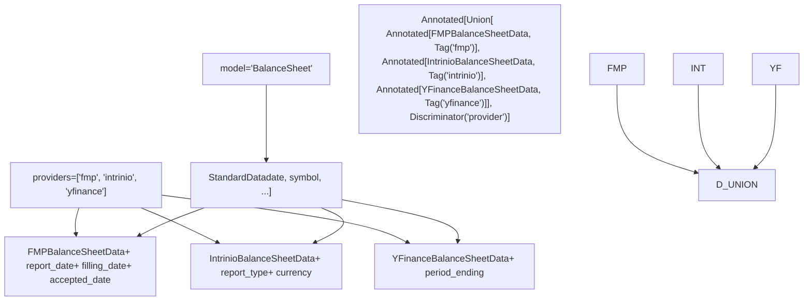
Sources: [openbb\_platform/core/openbb\_core/app/provider\_interface.py447-536](https://github.com/OpenBB-finance/OpenBB/blob/dddc3b32/openbb_platform/core/openbb_core/app/provider_interface.py#L447-L536)

---

## QueryExecutor: Orchestrating Data Fetches

### QueryExecutor Architecture

The `QueryExecutor` class manages the three-stage execution of fetchers, handling both synchronous and asynchronous operations.

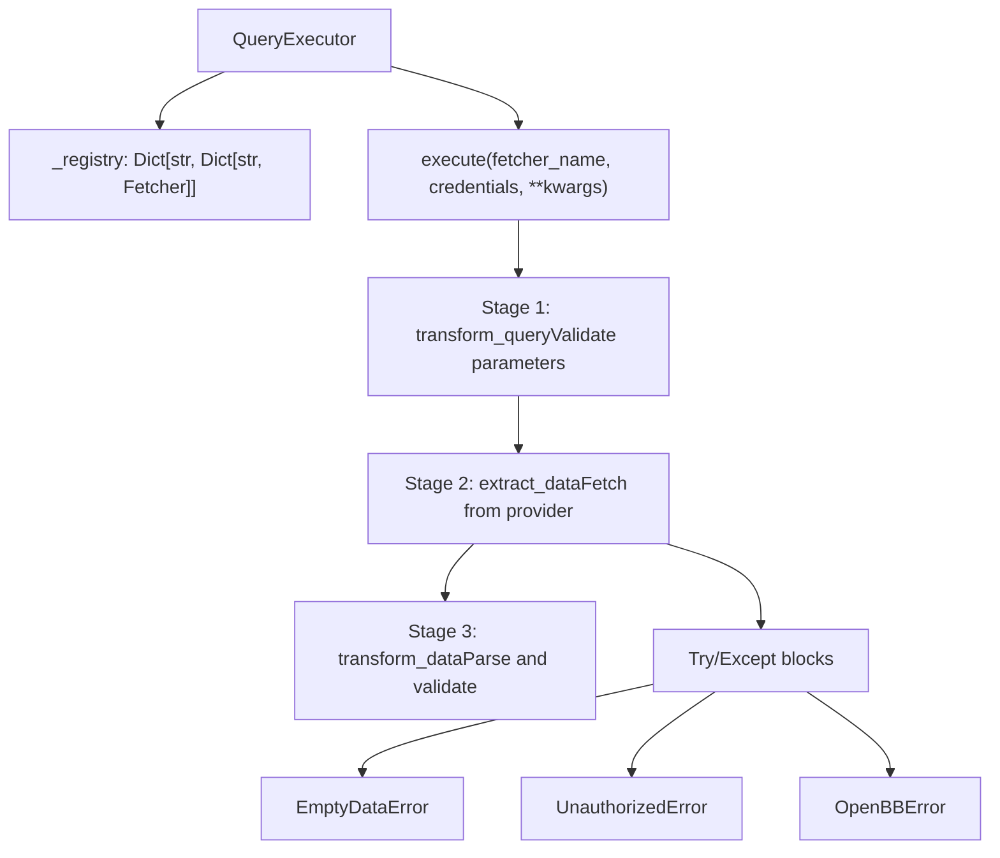
Sources: [openbb\_platform/core/openbb\_core/provider/query\_executor.py](https://github.com/OpenBB-finance/OpenBB/blob/dddc3b32/openbb_platform/core/openbb_core/provider/query_executor.py)

### Execution Flow in Command Context

**Complete Flow from Router to Provider**

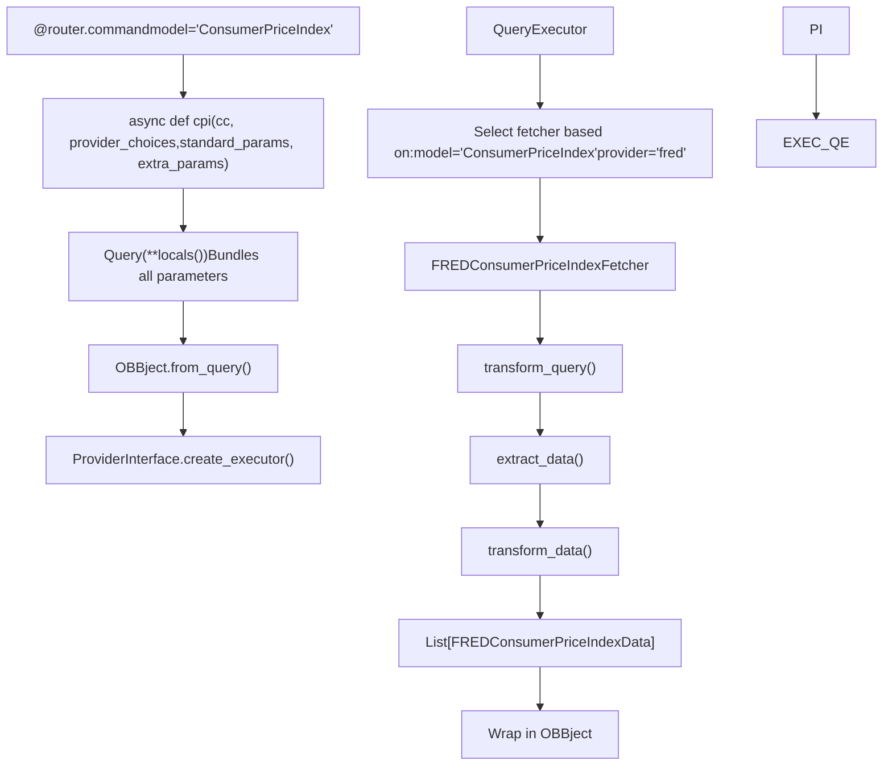
Sources: [openbb\_platform/extensions/economy/openbb\_economy/economy\_router.py66-96](https://github.com/OpenBB-finance/OpenBB/blob/dddc3b32/openbb_platform/extensions/economy/openbb_economy/economy_router.py#L66-L96) [openbb\_platform/core/openbb\_core/app/query.py](https://github.com/OpenBB-finance/OpenBB/blob/dddc3b32/openbb_platform/core/openbb_core/app/query.py) [openbb\_platform/core/openbb\_core/app/model/obbject.py](https://github.com/OpenBB-finance/OpenBB/blob/dddc3b32/openbb_platform/core/openbb_core/app/model/obbject.py)

---

## Router Integration with Providers

### Command Decorator Injection

The `@router.command` decorator uses `SignatureInspector` to inject provider-related dependencies into command signatures.

**SignatureInspector Flow**

```mermaid
flowchart TD
    DECORATOR["@router.command(model='BalanceSheet')"]
    FUNC_DEF["async def balance(cc, provider_choices,standard_params, extra_params)"]
    SI["SignatureInspector.complete()"]
    LOOKUP["Look up model in ProviderInterface.models"]
    GET_PROV["Get provider choices for model"]
    GET_PARAMS["Get StandardParams + ExtraParams"]
    GET_DATA["Get return schema"]
    INJ_PC["Inject ProviderChoices:Annotated[Literal['fmp','intrinio','yfinance'],Query(alias='provider')]"]
    INJ_SP["Inject StandardParams:Depends(StandardParams)"]
    INJ_EP["Inject ExtraParams:Depends(ExtraParams)"]
    NEW_SIG["Updated function signaturewith proper type hints"]
    FASTAPI["FastAPI validates andparses parameters"]

    DECORATOR --> FUNC_DEF
    FUNC --> DEF_SI
    SI --> LOOKUP
    LOOKUP --> GET_PROV
    LOOKUP --> GET_PARAMS
    LOOKUP --> GET_DATA
    GET --> PROV_INJ_PC
    GET --> PARAMS_INJ_SP
    GET --> PARAMS_INJ_EP
    INJ --> PC_NEW_SIG
    INJ --> SP_NEW_SIG
    INJ --> EP_NEW_SIG
    NEW --> SIG_FASTAPI
```
Sources: [openbb\_platform/core/openbb\_core/app/router.py227-336](https://github.com/OpenBB-finance/OpenBB/blob/dddc3b32/openbb_platform/core/openbb_core/app/router.py#L227-L336) [openbb\_platform/core/openbb\_core/app/static/package\_builder.py1149-1252](https://github.com/OpenBB-finance/OpenBB/blob/dddc3b32/openbb_platform/core/openbb_core/app/static/package_builder.py#L1149-L1252)

### Parameter Flow Example

**Example: `obb.economy.cpi()` with FRED provider**

| Parameter | Source | Type | Default |
| --- | --- | --- | --- |
| `country` | StandardParams | `str` | Required |
| `start_date` | StandardParams | `Optional[date]` | `None` |
| `end_date` | StandardParams | `Optional[date]` | `None` |
| `transform` | StandardParams (FRED) | `Optional[Literal["chg","pch",...]]` | `None` |
| `frequency` | ExtraParams (FRED) | `Optional[Literal["m","q","a"]]` | `None` |
| `harmonized` | ExtraParams (FRED) | `Optional[bool]` | `None` |
| `provider` | ProviderChoices | `Literal["fred","oecd","imf"]` | User selected |

Sources: [openbb\_platform/providers/fred/openbb\_fred/models/consumer\_price\_index.py](https://github.com/OpenBB-finance/OpenBB/blob/dddc3b32/openbb_platform/providers/fred/openbb_fred/models/consumer_price_index.py) [openbb\_platform/extensions/economy/openbb\_economy/economy\_router.py66-96](https://github.com/OpenBB-finance/OpenBB/blob/dddc3b32/openbb_platform/extensions/economy/openbb_economy/economy_router.py#L66-L96)

---

## Testing Provider Implementations

### Integration Test Pattern

Provider implementations are tested using parameterized integration tests that verify each fetcher with multiple parameter combinations.

**Test Structure**

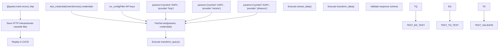
Sources: [openbb\_platform/extensions/equity/integration/test\_equity\_python.py21-58](https://github.com/OpenBB-finance/OpenBB/blob/dddc3b32/openbb_platform/extensions/equity/integration/test_equity_python.py#L21-L58) [openbb\_platform/providers/fmp/tests/test\_fmp\_fetchers.py1-100](https://github.com/OpenBB-finance/OpenBB/blob/dddc3b32/openbb_platform/providers/fmp/tests/test_fmp_fetchers.py#L1-L100) [openbb\_platform/providers/fred/tests/test\_fred\_fetchers.py1-100](https://github.com/OpenBB-finance/OpenBB/blob/dddc3b32/openbb_platform/providers/fred/tests/test_fred_fetchers.py#L1-L100)

### Example: Testing Balance Sheet Fetcher

**Parameterized Test Cases**

```
@pytest.mark.parametrize(    "params",    [        {"symbol": "AAPL", "period": "annual", "limit": 12, "provider": "fmp"},        {"symbol": "AAPL", "period": "quarter", "fiscal_year": 2014,          "limit": 2, "provider": "intrinio"},        {"symbol": "AAPL", "period": "annual", "limit": 5, "provider": "yfinance"},    ],)@pytest.mark.integrationdef test_equity_fundamental_balance(params, obb):    result = obb.equity.fundamental.balance(**params)    assert result    assert isinstance(result, OBBject)    assert len(result.results) > 0
```
Sources: [openbb\_platform/extensions/equity/integration/test\_equity\_python.py21-58](https://github.com/OpenBB-finance/OpenBB/blob/dddc3b32/openbb_platform/extensions/equity/integration/test_equity_python.py#L21-L58)

---

## Provider-Specific Considerations

### Credential Management

Providers declare required credentials in their registration, which are validated before execution.

| Provider | Required Credentials | Environment Variable |
| --- | --- | --- |
| FRED | `api_key` | `FRED_API_KEY` |
| FMP | `api_key` | `FMP_API_KEY` |
| Intrinio | `api_key` | `INTRINIO_API_KEY` |
| SEC | None | N/A |

Sources: [openbb\_platform/providers/fred/openbb\_fred/\_\_init\_\_.py59-106](https://github.com/OpenBB-finance/OpenBB/blob/dddc3b32/openbb_platform/providers/fred/openbb_fred/__init__.py#L59-L106) [openbb\_platform/providers/fmp/openbb\_fmp/\_\_init\_\_.py141-151](https://github.com/OpenBB-finance/OpenBB/blob/dddc3b32/openbb_platform/providers/fmp/openbb_fmp/__init__.py#L141-L151) [openbb\_platform/providers/intrinio/openbb\_intrinio/\_\_init\_\_.py99-112](https://github.com/OpenBB-finance/OpenBB/blob/dddc3b32/openbb_platform/providers/intrinio/openbb_intrinio/__init__.py#L99-L112)

### Multi-Provider Support

Commands that support multiple providers dynamically adapt their parameter types and return schemas based on which provider is selected.

**Example: `EquityHistorical` Model**

| Provider | Interval Options | Special Parameters |
| --- | --- | --- |
| FMP | `1min`, `5min`, `15min`, `30min`, `1h`, `4h`, `1d` | `adjustment`, `extended_hours` |
| Intrinio | `1min`, `5min`, `15min`, `30min`, `1h`, `1d` | `source`, `timezone`, `start_time`, `end_time` |
| YFinance | `1m`, `2m`, `5m`, `15m`, `30m`, `60m`, `90m`, `1h`, `1d`, `5d`, `1wk`, `1mo`, `3mo` | `include_actions`, `adjustment` |
| Alpha Vantage | `1min`, `5min`, `15min`, `30min`, `60min` | `outputsize`, `datatype` |

Sources: [openbb\_platform/extensions/equity/integration/test\_equity\_python.py970-1131](https://github.com/OpenBB-finance/OpenBB/blob/dddc3b32/openbb_platform/extensions/equity/integration/test_equity_python.py#L970-L1131)

---

## Summary

The Provider Architecture enables the OpenBB Platform to:

1.  **Abstract Data Sources**: Single commands work with multiple providers through the `ProviderInterface`
2.  **Preserve Flexibility**: Standard + Extra pattern maintains provider-specific capabilities
3.  **Type Safety**: Runtime dataclass and Pydantic model generation provides full type validation
4.  **Extensibility**: New providers integrate by implementing the three-stage `Fetcher` pattern
5.  **Testing**: Parameterized integration tests verify all provider/model combinations

**Key Classes and Files:**

| Component | Primary File | Purpose |
| --- | --- | --- |
| `ProviderInterface` | [openbb\_core/app/provider\_interface.py](https://github.com/OpenBB-finance/OpenBB/blob/dddc3b32/openbb_core/app/provider_interface.py) | Coordinates provider discovery and runtime type generation |
| `RegistryMap` | [openbb\_core/provider/registry\_map.py](https://github.com/OpenBB-finance/OpenBB/blob/dddc3b32/openbb_core/provider/registry_map.py) | Maps providers to models and extracts schemas |
| `QueryExecutor` | [openbb\_core/provider/query\_executor.py](https://github.com/OpenBB-finance/OpenBB/blob/dddc3b32/openbb_core/provider/query_executor.py) | Executes three-stage fetcher pattern |
| `Fetcher` | [openbb\_core/provider/abstract/fetcher.py](https://github.com/OpenBB-finance/OpenBB/blob/dddc3b32/openbb_core/provider/abstract/fetcher.py) | Base class for all provider implementations |
| `SignatureInspector` | [openbb\_core/app/router.py227-336](https://github.com/OpenBB-finance/OpenBB/blob/dddc3b32/openbb_core/app/router.py#L227-L336) | Injects provider types into command signatures |

Sources: [openbb\_platform/core/openbb\_core/app/provider\_interface.py1-536](https://github.com/OpenBB-finance/OpenBB/blob/dddc3b32/openbb_platform/core/openbb_core/app/provider_interface.py#L1-L536) [openbb\_platform/core/openbb\_core/provider/registry\_map.py1-254](https://github.com/OpenBB-finance/OpenBB/blob/dddc3b32/openbb_platform/core/openbb_core/provider/registry_map.py#L1-L254) [openbb\_platform/core/openbb\_core/app/router.py1-400](https://github.com/OpenBB-finance/OpenBB/blob/dddc3b32/openbb_platform/core/openbb_core/app/router.py#L1-L400)
