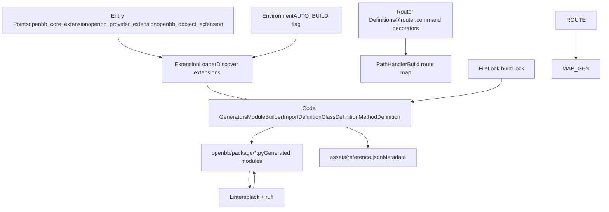
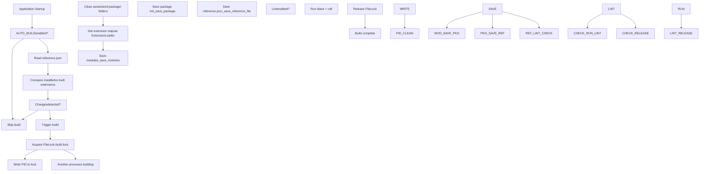
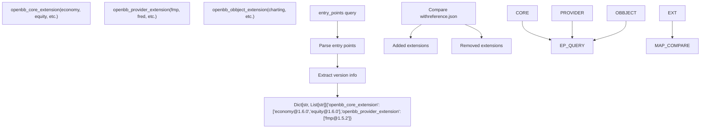
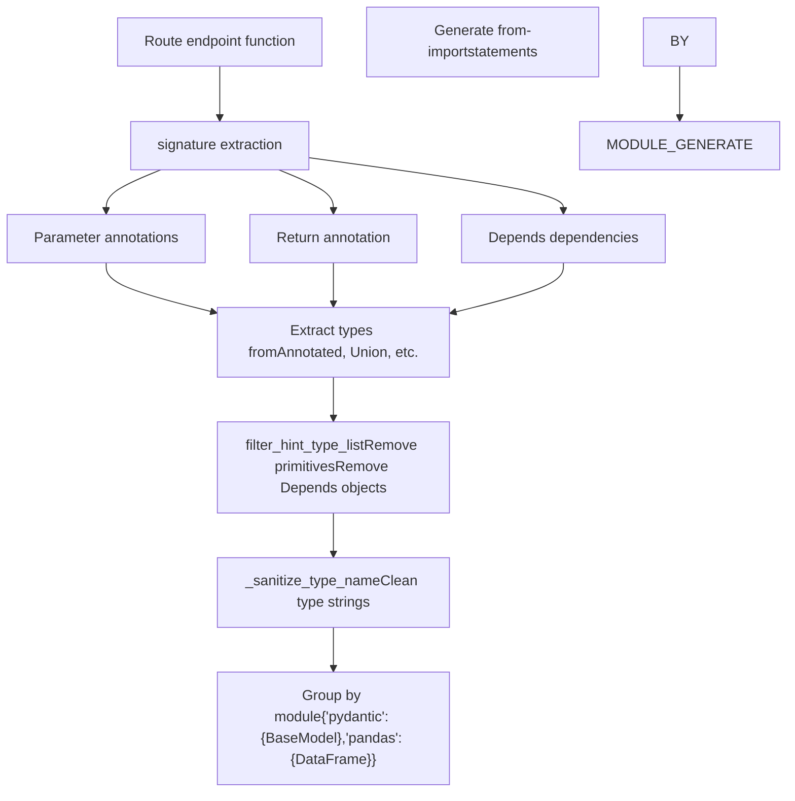
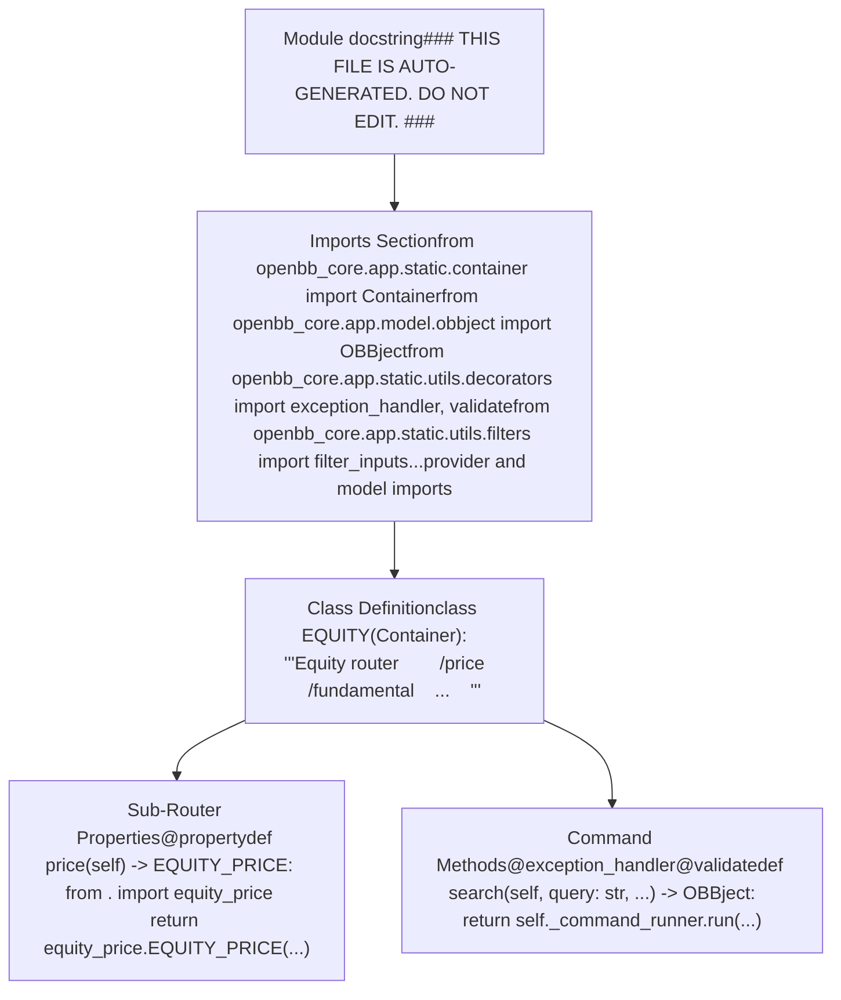
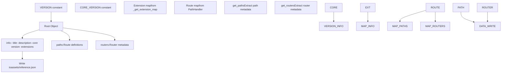
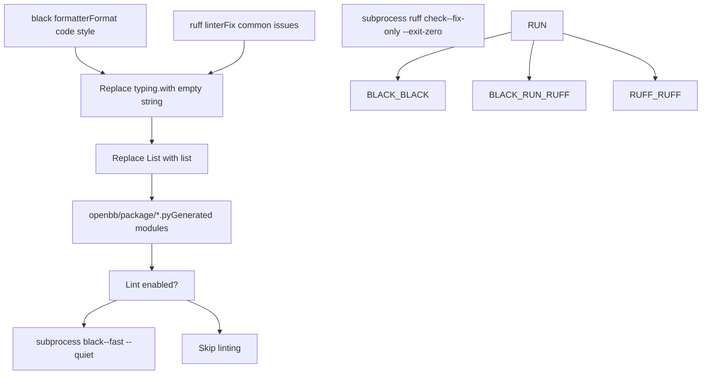
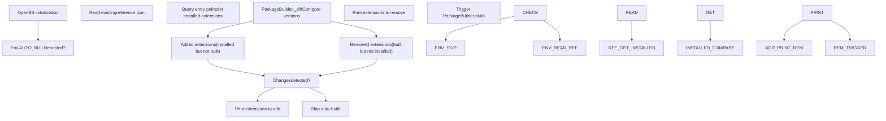
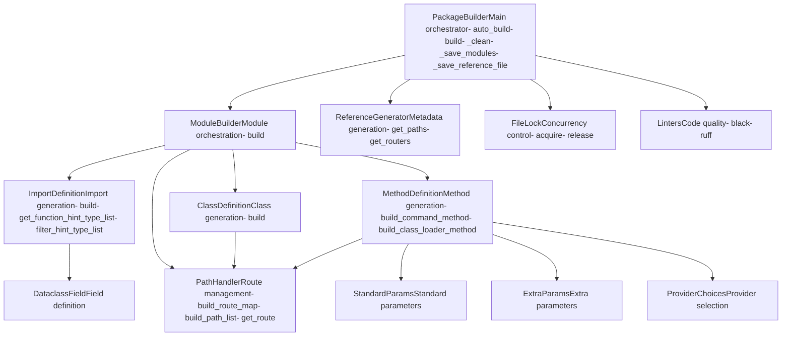

# Package Builder and Code Generation

Relevant source files

-   [cli/poetry.lock](https://github.com/OpenBB-finance/OpenBB/blob/dddc3b32/cli/poetry.lock)
-   [cli/tests/test\_argparse\_translator\_obbject\_registry.py](https://github.com/OpenBB-finance/OpenBB/blob/dddc3b32/cli/tests/test_argparse_translator_obbject_registry.py)
-   [openbb\_platform/core/openbb/assets/reference.json](https://github.com/OpenBB-finance/OpenBB/blob/dddc3b32/openbb_platform/core/openbb/assets/reference.json)
-   [openbb\_platform/core/openbb\_core/api/app\_loader.py](https://github.com/OpenBB-finance/OpenBB/blob/dddc3b32/openbb_platform/core/openbb_core/api/app_loader.py)
-   [openbb\_platform/core/openbb\_core/api/exception\_handlers.py](https://github.com/OpenBB-finance/OpenBB/blob/dddc3b32/openbb_platform/core/openbb_core/api/exception_handlers.py)
-   [openbb\_platform/core/openbb\_core/api/rest\_api.py](https://github.com/OpenBB-finance/OpenBB/blob/dddc3b32/openbb_platform/core/openbb_core/api/rest_api.py)
-   [openbb\_platform/core/openbb\_core/api/router/coverage.py](https://github.com/OpenBB-finance/OpenBB/blob/dddc3b32/openbb_platform/core/openbb_core/api/router/coverage.py)
-   [openbb\_platform/core/openbb\_core/app/provider\_interface.py](https://github.com/OpenBB-finance/OpenBB/blob/dddc3b32/openbb_platform/core/openbb_core/app/provider_interface.py)
-   [openbb\_platform/core/openbb\_core/app/router.py](https://github.com/OpenBB-finance/OpenBB/blob/dddc3b32/openbb_platform/core/openbb_core/app/router.py)
-   [openbb\_platform/core/openbb\_core/app/static/package\_builder.py](https://github.com/OpenBB-finance/OpenBB/blob/dddc3b32/openbb_platform/core/openbb_core/app/static/package_builder.py)
-   [openbb\_platform/core/openbb\_core/app/static/utils/filters.py](https://github.com/OpenBB-finance/OpenBB/blob/dddc3b32/openbb_platform/core/openbb_core/app/static/utils/filters.py)
-   [openbb\_platform/core/openbb\_core/app/utils.py](https://github.com/OpenBB-finance/OpenBB/blob/dddc3b32/openbb_platform/core/openbb_core/app/utils.py)
-   [openbb\_platform/core/openbb\_core/provider/registry\_map.py](https://github.com/OpenBB-finance/OpenBB/blob/dddc3b32/openbb_platform/core/openbb_core/provider/registry_map.py)
-   [openbb\_platform/core/openbb\_core/provider/standard\_models/fred\_release\_table.py](https://github.com/OpenBB-finance/OpenBB/blob/dddc3b32/openbb_platform/core/openbb_core/provider/standard_models/fred_release_table.py)
-   [openbb\_platform/core/openbb\_core/provider/standard\_models/futures\_curve.py](https://github.com/OpenBB-finance/OpenBB/blob/dddc3b32/openbb_platform/core/openbb_core/provider/standard_models/futures_curve.py)
-   [openbb\_platform/core/openbb\_core/provider/standard\_models/yield\_curve.py](https://github.com/OpenBB-finance/OpenBB/blob/dddc3b32/openbb_platform/core/openbb_core/provider/standard_models/yield_curve.py)
-   [openbb\_platform/core/poetry.lock](https://github.com/OpenBB-finance/OpenBB/blob/dddc3b32/openbb_platform/core/poetry.lock)
-   [openbb\_platform/core/pyproject.toml](https://github.com/OpenBB-finance/OpenBB/blob/dddc3b32/openbb_platform/core/pyproject.toml)
-   [openbb\_platform/core/tests/app/static/test\_filters.py](https://github.com/OpenBB-finance/OpenBB/blob/dddc3b32/openbb_platform/core/tests/app/static/test_filters.py)
-   [openbb\_platform/core/tests/app/static/test\_package\_builder.py](https://github.com/OpenBB-finance/OpenBB/blob/dddc3b32/openbb_platform/core/tests/app/static/test_package_builder.py)
-   [openbb\_platform/core/tests/app/test\_platform\_router.py](https://github.com/OpenBB-finance/OpenBB/blob/dddc3b32/openbb_platform/core/tests/app/test_platform_router.py)
-   [openbb\_platform/core/tests/app/test\_provider\_interface.py](https://github.com/OpenBB-finance/OpenBB/blob/dddc3b32/openbb_platform/core/tests/app/test_provider_interface.py)
-   [openbb\_platform/dev\_install.py](https://github.com/OpenBB-finance/OpenBB/blob/dddc3b32/openbb_platform/dev_install.py)
-   [openbb\_platform/extensions/devtools/poetry.lock](https://github.com/OpenBB-finance/OpenBB/blob/dddc3b32/openbb_platform/extensions/devtools/poetry.lock)
-   [openbb\_platform/extensions/devtools/pyproject.toml](https://github.com/OpenBB-finance/OpenBB/blob/dddc3b32/openbb_platform/extensions/devtools/pyproject.toml)
-   [openbb\_platform/obbject\_extensions/charting/tests/test\_charting.py](https://github.com/OpenBB-finance/OpenBB/blob/dddc3b32/openbb_platform/obbject_extensions/charting/tests/test_charting.py)
-   [openbb\_platform/poetry.lock](https://github.com/OpenBB-finance/OpenBB/blob/dddc3b32/openbb_platform/poetry.lock)
-   [openbb\_platform/providers/bls/openbb\_bls/utils/helpers.py](https://github.com/OpenBB-finance/OpenBB/blob/dddc3b32/openbb_platform/providers/bls/openbb_bls/utils/helpers.py)
-   [openbb\_platform/providers/cboe/openbb\_cboe/models/futures\_curve.py](https://github.com/OpenBB-finance/OpenBB/blob/dddc3b32/openbb_platform/providers/cboe/openbb_cboe/models/futures_curve.py)
-   [openbb\_platform/providers/cboe/tests/test\_cboe\_fetchers.py](https://github.com/OpenBB-finance/OpenBB/blob/dddc3b32/openbb_platform/providers/cboe/tests/test_cboe_fetchers.py)
-   [openbb\_platform/providers/fred/openbb\_fred/models/release\_table.py](https://github.com/OpenBB-finance/OpenBB/blob/dddc3b32/openbb_platform/providers/fred/openbb_fred/models/release_table.py)
-   [openbb\_platform/providers/yfinance/poetry.lock](https://github.com/OpenBB-finance/OpenBB/blob/dddc3b32/openbb_platform/providers/yfinance/poetry.lock)
-   [openbb\_platform/pyproject.toml](https://github.com/OpenBB-finance/OpenBB/blob/dddc3b32/openbb_platform/pyproject.toml)

## Purpose and Scope

The Package Builder system is responsible for dynamically generating the Python SDK code for the OpenBB Platform. It discovers installed extensions via entry points, analyzes their router structures, and generates Python modules with proper class hierarchies, method signatures, and documentation. The system ensures that the Platform's API surface automatically adapts to installed extensions without manual code updates.

For information about how extensions are loaded at runtime, see [Extension System](/OpenBB-finance/OpenBB/2.2-extension-system). For details on the command execution pipeline that uses the generated code, see [Command Execution Pipeline](/OpenBB-finance/OpenBB/2.1-command-execution-pipeline).

---

## System Overview

The Package Builder transforms router definitions into a navigable Python API by generating modules, classes, and methods dynamically. The system is triggered either manually via the `openbb-build` command or automatically on startup when `AUTO_BUILD` is enabled.


**Sources:** [openbb\_platform/core/openbb\_core/app/static/package\_builder.py1-361](https://github.com/OpenBB-finance/OpenBB/blob/dddc3b32/openbb_platform/core/openbb_core/app/static/package_builder.py#L1-L361)

---

## Build Process Flow

The build process follows a structured sequence with file locking to prevent concurrent builds and automatic cleanup of stale artifacts.


**Build Method Implementation:**

The build process is orchestrated by `PackageBuilder.build()` which uses file locking to ensure only one build runs at a time.

| Step | Method | Purpose |
| --- | --- | --- |
| 1 | `_clean()` | Remove existing `assets/` and `package/` directories |
| 2 | `_get_extension_map()` | Query entry points for installed extensions |
| 3 | `_save_modules()` | Generate Python module files |
| 4 | `_save_package()` | Create package `__init__.py` |
| 5 | `_save_reference_file()` | Generate `reference.json` metadata |
| 6 | `_run_linters()` | Format code with black and ruff |

**Sources:** [openbb\_platform/core/openbb\_core/app/static/package\_builder.py149-206](https://github.com/OpenBB-finance/OpenBB/blob/dddc3b32/openbb_platform/core/openbb_core/app/static/package_builder.py#L149-L206) [openbb\_platform/core/openbb\_core/app/static/package\_builder.py207-216](https://github.com/OpenBB-finance/OpenBB/blob/dddc3b32/openbb_platform/core/openbb_core/app/static/package_builder.py#L207-L216)

---

## Extension Discovery

The system discovers extensions through Python entry points, categorizing them into three groups: core extensions, provider extensions, and OBBject extensions.


**Extension Map Structure:**

The `_get_extension_map()` method creates a dictionary mapping entry point groups to lists of extensions with versions:

```
{    "openbb_core_extension": [        "commodity@1.5.0",        "economy@1.6.0",        "equity@1.6.0",        ...    ],    "openbb_provider_extension": [        "fmp@1.5.2",        "fred@1.5.1",        ...    ],    "openbb_obbject_extension": [        "openbb_charting@2.5.0"    ]}
```
**Sources:** [openbb\_platform/core/openbb\_core/app/static/package\_builder.py218-228](https://github.com/OpenBB-finance/OpenBB/blob/dddc3b32/openbb_platform/core/openbb_core/app/static/package_builder.py#L218-L228) [openbb\_platform/core/openbb\_core/app/static/package\_builder.py317-360](https://github.com/OpenBB-finance/OpenBB/blob/dddc3b32/openbb_platform/core/openbb_core/app/static/package_builder.py#L317-L360)

---

## Code Generation Pipeline

The code generation pipeline processes router structures to create Python modules with proper class hierarchies and method signatures.

```mermaid
flowchart TD
    ROUTE_MAP["PathHandler.build_route_mapScans all routers"]
    PATH_LIST["PathHandler.build_path_listExtracts unique paths"]
    MODULE_CODE["ModuleBuilder.buildOrchestrates generation"]
    IMPORT_GEN["ImportDefinition.buildAnalyze type hintsGenerate imports"]
    CLASS_GEN["ClassDefinition.buildGenerate Container classAdd docstrings"]
    METHOD_GEN["MethodDefinitionbuild_command_methodbuild_class_loader_method"]
    IMPORTS["Importsfrom openbb_core.app.static.container import Containerfrom openbb_core.app.model.obbject import OBBject...provider-specific imports"]
    CLASS["Class Definitionclass EQUITY(Container):...docstring...properties...command methods"]
    METHODS["Methods@property sub_routers@exception_handler commands"]
    WRITE["Write toopenbb/package/path.py"]

    ROUTE --> MAP_MODULE_CODE
    PATH --> LIST_MODULE_CODE
    MODULE --> CODE_IMPORT_GEN
    MODULE --> CODE_CLASS_GEN
    MODULE --> CODE_METHOD_GEN
    IMPORT --> GEN_IMPORTS
    CLASS --> GEN_CLASS
    METHOD --> GEN_METHODS
    IMPORTS --> WRITE
    CLASS --> WRITE
    METHODS --> WRITE
```


**Module Generation Process:**

For each path in the path list, `ModuleBuilder.build()` generates a complete Python module:

1.  **Import Generation** (`ImportDefinition.build`):

    -   Scans function signatures for type hints
    -   Extracts types from `Annotated`, `Union`, `Optional`
    -   Filters primitive types and builtins
    -   Groups imports by module
    -   Generates from-import statements
2.  **Class Generation** (`ClassDefinition.build`):

    -   Creates `Container` subclass
    -   Generates docstring listing sub-routers
    -   Adds `__repr__` method
    -   Includes extension information in root module
3.  **Method Generation** (`MethodDefinition`):

    -   `build_command_method`: Full signature methods for endpoints
    -   `build_class_loader_method`: Property methods for sub-routers

**Sources:** [openbb\_platform/core/openbb\_core/app/static/package\_builder.py363-374](https://github.com/OpenBB-finance/OpenBB/blob/dddc3b32/openbb_platform/core/openbb_core/app/static/package_builder.py#L363-L374) [openbb\_platform/core/openbb\_core/app/static/package\_builder.py377-664](https://github.com/OpenBB-finance/OpenBB/blob/dddc3b32/openbb_platform/core/openbb_core/app/static/package_builder.py#L377-L664) [openbb\_platform/core/openbb\_core/app/static/package\_builder.py667-759](https://github.com/OpenBB-finance/OpenBB/blob/dddc3b32/openbb_platform/core/openbb_core/app/static/package_builder.py#L667-L759)

---

## Import Definition Generation

The `ImportDefinition` class analyzes function signatures to determine required imports, handling complex type annotations and dependencies.


**Type Hint Processing:**

The system handles several type annotation patterns:

| Pattern | Example | Processing |
| --- | --- | --- |
| `Annotated` | `Annotated[str, Field(...)]` | Extract base type, process metadata |
| `Union` | `Union[int, str]` | Extract all union members |
| `Depends` | `Depends(get_credentials)` | Add dependency function to imports |
| `Optional` | `Optional[DataFrame]` | Extract wrapped type |
| `List[T]` | `List[BaseModel]` | Extract generic argument |

**Filtering Logic:**

The `filter_hint_type_list()` method removes:

-   `Parameter._empty` sentinel values
-   Primitive types: `int`, `float`, `str`, `bool`, `list`, `dict`, `tuple`, `set`
-   `Depends` objects from FastAPI
-   Annotated types containing `Depends` in metadata
-   Types from `builtins` module

**Sources:** [openbb\_platform/core/openbb\_core/app/static/package\_builder.py377-455](https://github.com/OpenBB-finance/OpenBB/blob/dddc3b32/openbb_platform/core/openbb_core/app/static/package_builder.py#L377-L455) [openbb\_platform/core/openbb\_core/app/static/package\_builder.py456-526](https://github.com/OpenBB-finance/OpenBB/blob/dddc3b32/openbb_platform/core/openbb_core/app/static/package_builder.py#L456-L526) [openbb\_platform/core/openbb\_core/app/static/package\_builder.py528-664](https://github.com/OpenBB-finance/OpenBB/blob/dddc3b32/openbb_platform/core/openbb_core/app/static/package_builder.py#L528-L664)

---

## Class and Method Generation

The `ClassDefinition` and `MethodDefinition` classes generate Container subclasses with proper method signatures and documentation.

**Command Method Generation:**

Command methods are generated for routes that have endpoint functions:

```
# Generated command method structure@exception_handler@validatedef historical(    self,    symbol: Annotated[str, OpenBBField(...)],    provider: Annotated[Literal["fmp", "yfinance"], OpenBBField(...)] = "fmp",    **kwargs) -> OBBject:    """[Docstring with parameter descriptions and examples]"""    return self._command_runner.run(        "/equity/price/historical",        **filter_inputs(provider_choices=..., standard_params=..., extra_params=...)    )
```
**Class Loader Method Generation:**

Sub-router properties are generated for paths with child routes:

```
# Generated property for sub-router@propertydef price(self):    """Equity price data sub-router."""    from . import equity_price        return equity_price.EQUITY_PRICE(command_runner=self._command_runner)
```
**Type Expansion:**

The `TYPE_EXPANSION` dictionary defines types that should accept broader input:

| Field Name | Standard Type | Expanded Type |
| --- | --- | --- |
| `data` | `Data` | `DataProcessingSupportedTypes` |
| `start_date` | `date` | `str` (also accepts strings) |
| `end_date` | `date` | `str` (also accepts strings) |
| `date` | `date` | `str` (also accepts strings) |
| `provider` | `Literal[...]` | `None` (handled specially) |

**Sources:** [openbb\_platform/core/openbb\_core/app/static/package\_builder.py667-759](https://github.com/OpenBB-finance/OpenBB/blob/dddc3b32/openbb_platform/core/openbb_core/app/static/package_builder.py#L667-L759) [openbb\_platform/core/openbb\_core/app/static/package\_builder.py762-938](https://github.com/OpenBB-finance/OpenBB/blob/dddc3b32/openbb_platform/core/openbb_core/app/static/package_builder.py#L762-L938)

---

## Generated Module Structure

Each generated module follows a consistent structure with imports, class definition, and methods.


**File Organization:**

Generated files are organized by path hierarchy:

```
openbb/
├── package/
│   ├── __init__.py              # Auto-generated package marker
│   ├── equity.py                # /equity router
│   ├── equity_price.py          # /equity/price router
│   ├── equity_fundamental.py   # /equity/fundamental router
│   ├── economy.py               # /economy router
│   └── ...
└── assets/
    └── reference.json           # Metadata about generated code
```
**Sources:** [openbb\_platform/core/openbb\_core/app/static/package\_builder.py230-260](https://github.com/OpenBB-finance/OpenBB/blob/dddc3b32/openbb_platform/core/openbb_core/app/static/package_builder.py#L230-L260) [openbb\_platform/core/openbb\_core/app/static/package\_builder.py261-266](https://github.com/OpenBB-finance/OpenBB/blob/dddc3b32/openbb_platform/core/openbb_core/app/static/package_builder.py#L261-L266)

---

## Reference.json Generation

The `reference.json` file stores metadata about the generated code, including version information, installed extensions, and route mappings.


**Reference.json Schema:**

```
{    "openbb": "1.6.0",    "info": {        "title": "OpenBB Platform (Python)",        "description": "Investment research for everyone, anywhere.",        "core": "1.6.0",        "extensions": {            "openbb_core_extension": [                "economy@1.6.0",                "equity@1.6.0"            ],            "openbb_provider_extension": [                "fmp@1.5.2",                "fred@1.5.1"            ],            "openbb_obbject_extension": [                "openbb_charting@2.5.0"            ]        }    },    "paths": {        "/equity/price/historical": {            "description": "...",            "parameters": [...],            "returns": {...}        }    },    "routers": {        "/equity": {            "description": "Equity data router"        }    }}
```
**Sources:** [openbb\_platform/core/openbb\_core/app/static/package\_builder.py268-285](https://github.com/OpenBB-finance/OpenBB/blob/dddc3b32/openbb_platform/core/openbb_core/app/static/package_builder.py#L268-L285) [openbb\_platform/core/openbb/assets/reference.json1-15](https://github.com/OpenBB-finance/OpenBB/blob/dddc3b32/openbb_platform/core/openbb/assets/reference.json#L1-L15)

---

## Linting and Quality Control

The build process includes automatic code formatting and linting to ensure generated code meets quality standards.


**Linting Configuration:**

The `Linters` class runs two formatters:

| Tool | Command | Purpose |
| --- | --- | --- |
| `black` | `black --fast --quiet <dir>` | Format code style consistently |
| `ruff` | `ruff check --fix-only --exit-zero <dir>` | Fix common linting issues |

**String Processing:**

Generated code undergoes string replacement during write:

-   `typing.` prefix removed for cleaner imports
-   `List` replaced with `list` for Python 3.10+ compatibility

**Sources:** [openbb\_platform/core/openbb\_core/app/static/package\_builder.py287-292](https://github.com/OpenBB-finance/OpenBB/blob/dddc3b32/openbb_platform/core/openbb_core/app/static/package_builder.py#L287-L292) [openbb\_platform/core/openbb\_core/app/static/package\_builder.py294-304](https://github.com/OpenBB-finance/OpenBB/blob/dddc3b32/openbb_platform/core/openbb_core/app/static/package_builder.py#L294-L304)

---

## Auto-build System

The auto-build system detects changes in installed extensions and automatically rebuilds the package when necessary.


**Change Detection Algorithm:**

The `_diff()` method compares extension sets:

```
def _diff(ext_map: dict) -> tuple[set[str], set[str]]:    """    Returns:        (added, removed) where:        - added: installed but not in reference.json        - removed: in reference.json but not installed    """    for group in ["openbb_core_extension", "openbb_provider_extension", "openbb_obbject_extension"]:        built = set(ext_map.get(group, {}))  # From reference.json        installed = set(entry_points(group=group))  # From environment        add = add.union(installed - built)        remove = remove.union(built - installed)        return add, remove
```
**Output Example:**

When changes are detected, the system prints:

```
Extensions to add: economy@1.6.0, equity@1.6.0
Extensions to remove: old_extension@1.0.0

Building...
```
**Sources:** [openbb\_platform/core/openbb\_core/app/static/package\_builder.py149-167](https://github.com/OpenBB-finance/OpenBB/blob/dddc3b32/openbb_platform/core/openbb_core/app/static/package_builder.py#L149-L167) [openbb\_platform/core/openbb\_core/app/static/package\_builder.py317-360](https://github.com/OpenBB-finance/OpenBB/blob/dddc3b32/openbb_platform/core/openbb_core/app/static/package_builder.py#L317-L360)

---

## File Locking Mechanism

The `FileLock` class provides cross-platform file locking to prevent concurrent builds from corrupting generated code.

**Lock File Usage:**

The `.build.lock` file serves two purposes:

1.  **Process Synchronization**: Prevents multiple build processes from running simultaneously
2.  **Process Tracking**: Stores the PID of the building process for debugging

**Lock Acquisition Flow:**

```
# Non-blocking acquisition attemptwith open(".build.lock", "w") as lock_file:    file_lock = FileLock(lock_file)    try:        file_lock.acquire(blocking=False)  # Raises BlockingIOError if already locked                # Write PID for debugging        lock_file.write(str(os.getpid()))        lock_file.flush()                # Perform build operations        self._clean()        self._save_modules()        # ...            except BlockingIOError:        raise RuntimeError("Another build process is running")    finally:        file_lock.release()
```
**Platform-Specific Implementation:**

| Platform | Module | Lock Function | Unlock Function |
| --- | --- | --- | --- |
| Unix-like | `fcntl` | `fcntl.flock(fd, LOCK_EX)` | `fcntl.flock(fd, LOCK_UN)` |
| Windows | `msvcrt` | `msvcrt.locking(fd, LK_LOCK, 1)` | `msvcrt.locking(fd, LK_UNLCK, 1)` |

**Sources:** [openbb\_platform/core/openbb\_core/app/static/package\_builder.py95-132](https://github.com/OpenBB-finance/OpenBB/blob/dddc3b32/openbb_platform/core/openbb_core/app/static/package_builder.py#L95-L132) [openbb\_platform/core/openbb\_core/app/static/package\_builder.py169-206](https://github.com/OpenBB-finance/OpenBB/blob/dddc3b32/openbb_platform/core/openbb_core/app/static/package_builder.py#L169-L206)

---

## Key Classes and Their Roles

The package builder system is organized into several specialized classes, each responsible for a specific aspect of code generation.


**Class Responsibilities:**

| Class | File Location | Primary Responsibility |
| --- | --- | --- |
| `PackageBuilder` | [openbb\_core/app/static/package\_builder.py134-361](https://github.com/OpenBB-finance/OpenBB/blob/dddc3b32/openbb_core/app/static/package_builder.py#L134-L361) | Orchestrates entire build process, manages file I/O |
| `ModuleBuilder` | [openbb\_core/app/static/package\_builder.py363-374](https://github.com/OpenBB-finance/OpenBB/blob/dddc3b32/openbb_core/app/static/package_builder.py#L363-L374) | Builds complete module code by coordinating sub-generators |
| `ImportDefinition` | [openbb\_core/app/static/package\_builder.py377-664](https://github.com/OpenBB-finance/OpenBB/blob/dddc3b32/openbb_core/app/static/package_builder.py#L377-L664) | Analyzes type hints and generates import statements |
| `ClassDefinition` | [openbb\_core/app/static/package\_builder.py667-759](https://github.com/OpenBB-finance/OpenBB/blob/dddc3b32/openbb_core/app/static/package_builder.py#L667-L759) | Generates `Container` subclass definitions with docstrings |
| `MethodDefinition` | [openbb\_core/app/static/package\_builder.py762-1155](https://github.com/OpenBB-finance/OpenBB/blob/dddc3b32/openbb_core/app/static/package_builder.py#L762-L1155) | Generates command methods and property methods for sub-routers |
| `PathHandler` | [openbb\_core/app/static/package\_builder.py1158-1389](https://github.com/OpenBB-finance/OpenBB/blob/dddc3b32/openbb_core/app/static/package_builder.py#L1158-L1389) | Manages route mapping and path hierarchy |
| `ReferenceGenerator` | [openbb\_core/app/static/package\_builder.py1392-1533](https://github.com/OpenBB-finance/OpenBB/blob/dddc3b32/openbb_core/app/static/package_builder.py#L1392-L1533) | Generates metadata for `reference.json` |
| `FileLock` | [openbb\_core/app/static/package\_builder.py95-132](https://github.com/OpenBB-finance/OpenBB/blob/dddc3b32/openbb_core/app/static/package_builder.py#L95-L132) | Provides cross-platform file locking for build synchronization |
| `Linters` | [openbb\_core/app/static/utils/linters.py](https://github.com/OpenBB-finance/OpenBB/blob/dddc3b32/openbb_core/app/static/utils/linters.py) | Runs black and ruff formatters on generated code |

**Integration with Core Systems:**

The Package Builder integrates with several core systems:

1.  **ExtensionLoader**: Discovers installed extensions via entry points
2.  **RouterLoader**: Provides router definitions for analysis
3.  **ProviderInterface**: Supplies type information for parameters
4.  **SystemService**: Provides version information

**Sources:** [openbb\_platform/core/openbb\_core/app/static/package\_builder.py134-1533](https://github.com/OpenBB-finance/OpenBB/blob/dddc3b32/openbb_platform/core/openbb_core/app/static/package_builder.py#L134-L1533)

---

## Command Entry Point

The package builder is exposed as a command-line tool via the `openbb-build` entry point.

**Entry Point Configuration:**

The `openbb-core` package defines a script entry point in `pyproject.toml`:

```
[tool.poetry.scripts]openbb-build = "openbb_core.build:main"
```
This allows users to run:

```
openbb-build
```
Which triggers the build process manually, useful for:

-   Forcing a rebuild after extension installation
-   Regenerating code during development
-   Troubleshooting build issues

**Sources:** [openbb\_platform/core/pyproject.toml30-31](https://github.com/OpenBB-finance/OpenBB/blob/dddc3b32/openbb_platform/core/pyproject.toml#L30-L31)
