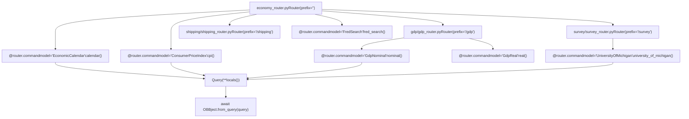
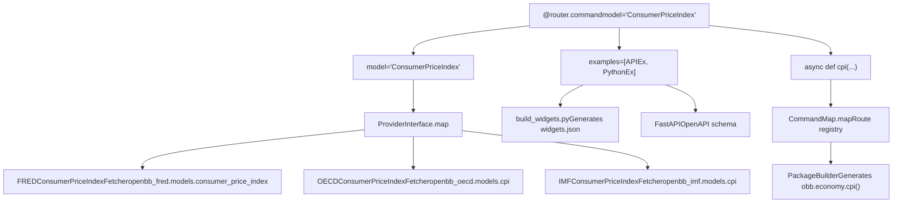
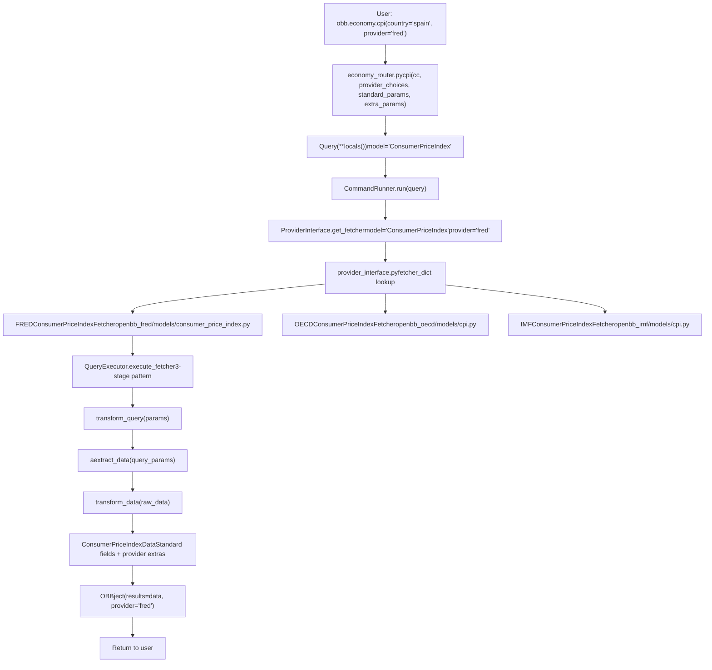
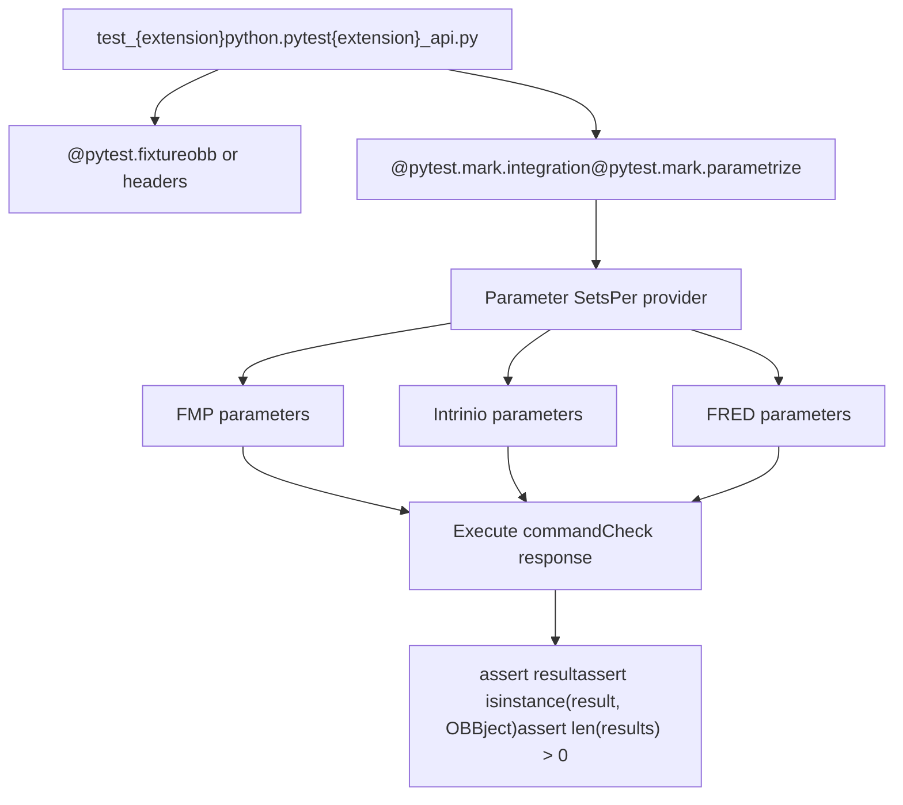
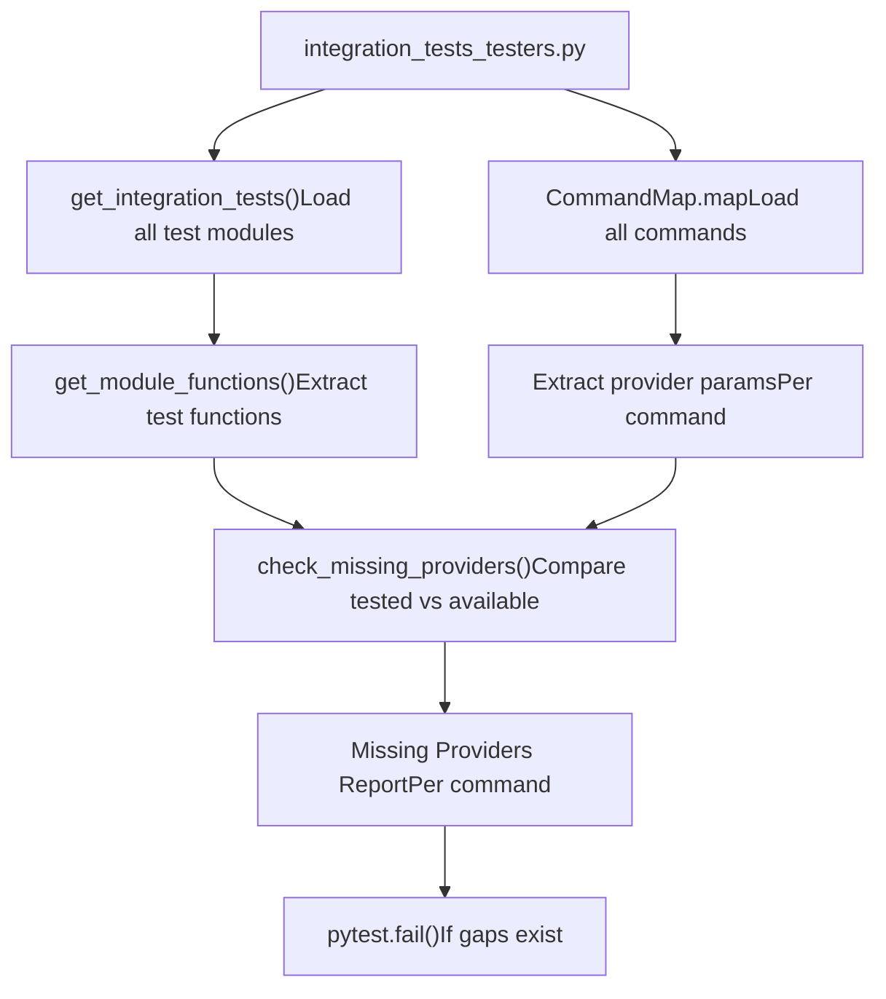

# Data Extensions

Relevant source files

-   [cli/poetry.lock](https://github.com/OpenBB-finance/OpenBB/blob/dddc3b32/cli/poetry.lock)
-   [openbb\_platform/core/openbb/assets/reference.json](https://github.com/OpenBB-finance/OpenBB/blob/dddc3b32/openbb_platform/core/openbb/assets/reference.json)
-   [openbb\_platform/core/openbb\_core/app/model/charts/chart.py](https://github.com/OpenBB-finance/OpenBB/blob/dddc3b32/openbb_platform/core/openbb_core/app/model/charts/chart.py)
-   [openbb\_platform/core/openbb\_core/provider/standard\_models/company\_filings.py](https://github.com/OpenBB-finance/OpenBB/blob/dddc3b32/openbb_platform/core/openbb_core/provider/standard_models/company_filings.py)
-   [openbb\_platform/core/openbb\_core/provider/standard\_models/primary\_dealer\_fails.py](https://github.com/OpenBB-finance/OpenBB/blob/dddc3b32/openbb_platform/core/openbb_core/provider/standard_models/primary_dealer_fails.py)
-   [openbb\_platform/core/poetry.lock](https://github.com/OpenBB-finance/OpenBB/blob/dddc3b32/openbb_platform/core/poetry.lock)
-   [openbb\_platform/core/pyproject.toml](https://github.com/OpenBB-finance/OpenBB/blob/dddc3b32/openbb_platform/core/pyproject.toml)
-   [openbb\_platform/core/tests/app/model/charts/test\_chart.py](https://github.com/OpenBB-finance/OpenBB/blob/dddc3b32/openbb_platform/core/tests/app/model/charts/test_chart.py)
-   [openbb\_platform/dev\_install.py](https://github.com/OpenBB-finance/OpenBB/blob/dddc3b32/openbb_platform/dev_install.py)
-   [openbb\_platform/extensions/devtools/poetry.lock](https://github.com/OpenBB-finance/OpenBB/blob/dddc3b32/openbb_platform/extensions/devtools/poetry.lock)
-   [openbb\_platform/extensions/devtools/pyproject.toml](https://github.com/OpenBB-finance/OpenBB/blob/dddc3b32/openbb_platform/extensions/devtools/pyproject.toml)
-   [openbb\_platform/extensions/economy/integration/test\_economy\_api.py](https://github.com/OpenBB-finance/OpenBB/blob/dddc3b32/openbb_platform/extensions/economy/integration/test_economy_api.py)
-   [openbb\_platform/extensions/economy/integration/test\_economy\_python.py](https://github.com/OpenBB-finance/OpenBB/blob/dddc3b32/openbb_platform/extensions/economy/integration/test_economy_python.py)
-   [openbb\_platform/extensions/economy/openbb\_economy/economy\_router.py](https://github.com/OpenBB-finance/OpenBB/blob/dddc3b32/openbb_platform/extensions/economy/openbb_economy/economy_router.py)
-   [openbb\_platform/extensions/economy/openbb\_economy/survey/survey\_router.py](https://github.com/OpenBB-finance/OpenBB/blob/dddc3b32/openbb_platform/extensions/economy/openbb_economy/survey/survey_router.py)
-   [openbb\_platform/extensions/equity/integration/test\_equity\_api.py](https://github.com/OpenBB-finance/OpenBB/blob/dddc3b32/openbb_platform/extensions/equity/integration/test_equity_api.py)
-   [openbb\_platform/extensions/equity/integration/test\_equity\_python.py](https://github.com/OpenBB-finance/OpenBB/blob/dddc3b32/openbb_platform/extensions/equity/integration/test_equity_python.py)
-   [openbb\_platform/extensions/equity/openbb\_equity/fundamental/fundamental\_router.py](https://github.com/OpenBB-finance/OpenBB/blob/dddc3b32/openbb_platform/extensions/equity/openbb_equity/fundamental/fundamental_router.py)
-   [openbb\_platform/extensions/etf/integration/test\_etf\_api.py](https://github.com/OpenBB-finance/OpenBB/blob/dddc3b32/openbb_platform/extensions/etf/integration/test_etf_api.py)
-   [openbb\_platform/extensions/etf/integration/test\_etf\_python.py](https://github.com/OpenBB-finance/OpenBB/blob/dddc3b32/openbb_platform/extensions/etf/integration/test_etf_python.py)
-   [openbb\_platform/extensions/platform\_api/openbb\_platform\_api/assets/default\_apps.json](https://github.com/OpenBB-finance/OpenBB/blob/dddc3b32/openbb_platform/extensions/platform_api/openbb_platform_api/assets/default_apps.json)
-   [openbb\_platform/extensions/tests/test\_integration\_tests\_api.py](https://github.com/OpenBB-finance/OpenBB/blob/dddc3b32/openbb_platform/extensions/tests/test_integration_tests_api.py)
-   [openbb\_platform/extensions/tests/test\_integration\_tests\_python.py](https://github.com/OpenBB-finance/OpenBB/blob/dddc3b32/openbb_platform/extensions/tests/test_integration_tests_python.py)
-   [openbb\_platform/extensions/tests/utils/integration\_tests\_api\_generator.py](https://github.com/OpenBB-finance/OpenBB/blob/dddc3b32/openbb_platform/extensions/tests/utils/integration_tests_api_generator.py)
-   [openbb\_platform/extensions/tests/utils/integration\_tests\_testers.py](https://github.com/OpenBB-finance/OpenBB/blob/dddc3b32/openbb_platform/extensions/tests/utils/integration_tests_testers.py)
-   [openbb\_platform/poetry.lock](https://github.com/OpenBB-finance/OpenBB/blob/dddc3b32/openbb_platform/poetry.lock)
-   [openbb\_platform/providers/federal\_reserve/openbb\_federal\_reserve/\_\_init\_\_.py](https://github.com/OpenBB-finance/OpenBB/blob/dddc3b32/openbb_platform/providers/federal_reserve/openbb_federal_reserve/__init__.py)
-   [openbb\_platform/providers/federal\_reserve/openbb\_federal\_reserve/assets/historical\_releases.json](https://github.com/OpenBB-finance/OpenBB/blob/dddc3b32/openbb_platform/providers/federal_reserve/openbb_federal_reserve/assets/historical_releases.json)
-   [openbb\_platform/providers/federal\_reserve/openbb\_federal\_reserve/models/fomc\_documents.py](https://github.com/OpenBB-finance/OpenBB/blob/dddc3b32/openbb_platform/providers/federal_reserve/openbb_federal_reserve/models/fomc_documents.py)
-   [openbb\_platform/providers/federal\_reserve/openbb\_federal\_reserve/models/primary\_dealer\_fails.py](https://github.com/OpenBB-finance/OpenBB/blob/dddc3b32/openbb_platform/providers/federal_reserve/openbb_federal_reserve/models/primary_dealer_fails.py)
-   [openbb\_platform/providers/federal\_reserve/openbb\_federal\_reserve/models/primary\_dealer\_positioning.py](https://github.com/OpenBB-finance/OpenBB/blob/dddc3b32/openbb_platform/providers/federal_reserve/openbb_federal_reserve/models/primary_dealer_positioning.py)
-   [openbb\_platform/providers/federal\_reserve/openbb\_federal\_reserve/utils/fomc\_documents.py](https://github.com/OpenBB-finance/OpenBB/blob/dddc3b32/openbb_platform/providers/federal_reserve/openbb_federal_reserve/utils/fomc_documents.py)
-   [openbb\_platform/providers/federal\_reserve/openbb\_federal\_reserve/utils/primary\_dealer\_statistics.py](https://github.com/OpenBB-finance/OpenBB/blob/dddc3b32/openbb_platform/providers/federal_reserve/openbb_federal_reserve/utils/primary_dealer_statistics.py)
-   [openbb\_platform/providers/federal\_reserve/tests/record/http/test\_federal\_reserve\_fetchers/test\_federal\_reserve\_fomc\_documents\_fetcher\_urllib3\_v2.yaml](https://github.com/OpenBB-finance/OpenBB/blob/dddc3b32/openbb_platform/providers/federal_reserve/tests/record/http/test_federal_reserve_fetchers/test_federal_reserve_fomc_documents_fetcher_urllib3_v2.yaml)
-   [openbb\_platform/providers/federal\_reserve/tests/record/http/test\_federal\_reserve\_fetchers/test\_federal\_reserve\_primary\_dealer\_fails\_fetcher\_urllib3\_v2.yaml](https://github.com/OpenBB-finance/OpenBB/blob/dddc3b32/openbb_platform/providers/federal_reserve/tests/record/http/test_federal_reserve_fetchers/test_federal_reserve_primary_dealer_fails_fetcher_urllib3_v2.yaml)
-   [openbb\_platform/providers/federal\_reserve/tests/test\_federal\_reserve\_fetchers.py](https://github.com/OpenBB-finance/OpenBB/blob/dddc3b32/openbb_platform/providers/federal_reserve/tests/test_federal_reserve_fetchers.py)
-   [openbb\_platform/providers/fmp/openbb\_fmp/\_\_init\_\_.py](https://github.com/OpenBB-finance/OpenBB/blob/dddc3b32/openbb_platform/providers/fmp/openbb_fmp/__init__.py)
-   [openbb\_platform/providers/fmp/openbb\_fmp/models/company\_filings.py](https://github.com/OpenBB-finance/OpenBB/blob/dddc3b32/openbb_platform/providers/fmp/openbb_fmp/models/company_filings.py)
-   [openbb\_platform/providers/fmp/pyproject.toml](https://github.com/OpenBB-finance/OpenBB/blob/dddc3b32/openbb_platform/providers/fmp/pyproject.toml)
-   [openbb\_platform/providers/fmp/tests/test\_fmp\_fetchers.py](https://github.com/OpenBB-finance/OpenBB/blob/dddc3b32/openbb_platform/providers/fmp/tests/test_fmp_fetchers.py)
-   [openbb\_platform/providers/fred/openbb\_fred/\_\_init\_\_.py](https://github.com/OpenBB-finance/OpenBB/blob/dddc3b32/openbb_platform/providers/fred/openbb_fred/__init__.py)
-   [openbb\_platform/providers/fred/openbb\_fred/models/manufacturing\_outlook\_ny.py](https://github.com/OpenBB-finance/OpenBB/blob/dddc3b32/openbb_platform/providers/fred/openbb_fred/models/manufacturing_outlook_ny.py)
-   [openbb\_platform/providers/fred/tests/record/http/test\_fred\_fetchers/test\_fred\_manufacturing\_outlook\_ny\_fetcher\_urllib3\_v2.yaml](https://github.com/OpenBB-finance/OpenBB/blob/dddc3b32/openbb_platform/providers/fred/tests/record/http/test_fred_fetchers/test_fred_manufacturing_outlook_ny_fetcher_urllib3_v2.yaml)
-   [openbb\_platform/providers/fred/tests/test\_fred\_fetchers.py](https://github.com/OpenBB-finance/OpenBB/blob/dddc3b32/openbb_platform/providers/fred/tests/test_fred_fetchers.py)
-   [openbb\_platform/providers/intrinio/openbb\_intrinio/\_\_init\_\_.py](https://github.com/OpenBB-finance/OpenBB/blob/dddc3b32/openbb_platform/providers/intrinio/openbb_intrinio/__init__.py)
-   [openbb\_platform/providers/intrinio/openbb\_intrinio/models/company\_filings.py](https://github.com/OpenBB-finance/OpenBB/blob/dddc3b32/openbb_platform/providers/intrinio/openbb_intrinio/models/company_filings.py)
-   [openbb\_platform/providers/intrinio/tests/test\_intrinio\_fetchers.py](https://github.com/OpenBB-finance/OpenBB/blob/dddc3b32/openbb_platform/providers/intrinio/tests/test_intrinio_fetchers.py)
-   [openbb\_platform/providers/sec/openbb\_sec/\_\_init\_\_.py](https://github.com/OpenBB-finance/OpenBB/blob/dddc3b32/openbb_platform/providers/sec/openbb_sec/__init__.py)
-   [openbb\_platform/providers/sec/openbb\_sec/utils/form4.py](https://github.com/OpenBB-finance/OpenBB/blob/dddc3b32/openbb_platform/providers/sec/openbb_sec/utils/form4.py)
-   [openbb\_platform/providers/sec/tests/test\_sec\_fetchers.py](https://github.com/OpenBB-finance/OpenBB/blob/dddc3b32/openbb_platform/providers/sec/tests/test_sec_fetchers.py)
-   [openbb\_platform/providers/tmx/openbb\_tmx/models/company\_filings.py](https://github.com/OpenBB-finance/OpenBB/blob/dddc3b32/openbb_platform/providers/tmx/openbb_tmx/models/company_filings.py)
-   [openbb\_platform/providers/yfinance/poetry.lock](https://github.com/OpenBB-finance/OpenBB/blob/dddc3b32/openbb_platform/providers/yfinance/poetry.lock)
-   [openbb\_platform/pyproject.toml](https://github.com/OpenBB-finance/OpenBB/blob/dddc3b32/openbb_platform/pyproject.toml)

## Overview

Data extensions organize the OpenBB Platform into domain-specific functional modules. The platform includes extensions for:

-   **Economy** - Macroeconomic data (GDP, CPI, FRED series, economic calendars)
-   **Equity** - Company-level financial data (fundamentals, price data, filings, ownership)
-   **ETF** - Exchange-traded fund information and holdings
-   **Crypto** - Cryptocurrency prices and market data
-   **Derivatives** - Options and futures data
-   **Currency** - Foreign exchange rates and cross-rates
-   **Fixed Income** - Bond yields, spreads, and government securities
-   **Index** - Market indices and constituents
-   **Commodity** - Commodity spot prices and futures
-   **News** - Financial news aggregation
-   **Regulators** - Regulatory filings and data

Each extension is a Python package that registers command routes via entry points. Extensions are discovered at runtime by the [ExtensionLoader](https://github.com/OpenBB-finance/OpenBB/blob/dddc3b32/ExtensionLoader) (see page 2.2) and integrated into the unified `obb` namespace. The [PackageBuilder](https://github.com/OpenBB-finance/OpenBB/blob/dddc3b32/PackageBuilder) (see page 2.4) generates the Python SDK modules dynamically based on installed extensions.

Extensions define standard data models that multiple providers implement, enabling users to switch data sources without changing their code. The [ProviderInterface](https://github.com/OpenBB-finance/OpenBB/blob/dddc3b32/ProviderInterface) (see page 2.3) handles provider resolution and parameter merging.

**Sources:** [openbb\_platform/pyproject.toml34-44](https://github.com/OpenBB-finance/OpenBB/blob/dddc3b32/openbb_platform/pyproject.toml#L34-L44) [openbb\_platform/extensions/economy/openbb\_economy/economy\_router.py21-24](https://github.com/OpenBB-finance/OpenBB/blob/dddc3b32/openbb_platform/extensions/economy/openbb_economy/economy_router.py#L21-L24) [openbb\_platform/extensions/equity/openbb\_equity/equity\_router.py1-20](https://github.com/OpenBB-finance/OpenBB/blob/dddc3b32/openbb_platform/extensions/equity/openbb_equity/equity_router.py#L1-L20)

## Extension Architecture

### Directory Structure

Each data extension follows a standard directory layout:

```
openbb_platform/extensions/{extension_name}/
├── openbb_{extension_name}/
│   ├── {extension_name}_router.py     # Main router with command definitions
│   ├── {sub_domain}/                  # Optional sub-routers
│   │   └── {sub_domain}_router.py
│   └── __init__.py
├── integration/
│   ├── test_{extension_name}_api.py   # API integration tests
│   └── test_{extension_name}_python.py # Python interface tests
└── pyproject.toml                      # Entry point registration
```
**Sources:** [openbb\_platform/extensions/economy/openbb\_economy/economy\_router.py1-25](https://github.com/OpenBB-finance/OpenBB/blob/dddc3b32/openbb_platform/extensions/economy/openbb_economy/economy_router.py#L1-L25) [openbb\_platform/extensions/economy/openbb\_economy/survey/survey\_router.py1-14](https://github.com/OpenBB-finance/OpenBB/blob/dddc3b32/openbb_platform/extensions/economy/openbb_economy/survey/survey_router.py#L1-L14)

### Router Definition Pattern

Extensions use the `Router` class from `openbb_core.app.router` to define their command structure. The economy extension demonstrates hierarchical router organization:


**Diagram: Economy Extension Router Hierarchy**

All commands follow a standard pattern using the `@router.command` decorator with injected dependencies:

```
@router.command(    model="EconomicCalendar",  # Standard model name    examples=[APIEx(...), PythonEx(...)],  # Documentation examples)async def calendar(    cc: CommandContext,           # Execution context    provider_choices: ProviderChoices,  # Available providers for this model    standard_params: StandardParams,    # Common parameters (symbol, dates, etc.)    extra_params: ExtraParams,          # Provider-specific parameters) -> OBBject:    """Get the upcoming, or historical, economic calendar of global events."""    return await OBBject.from_query(Query(**locals()))
```
The `Query(**locals())` pattern passes all injected parameters to the [CommandRunner](https://github.com/OpenBB-finance/OpenBB/blob/dddc3b32/CommandRunner) which resolves the provider, validates parameters, and executes the command through the [ProviderInterface](https://github.com/OpenBB-finance/OpenBB/blob/dddc3b32/ProviderInterface) See page 2.1 for the complete execution pipeline.

**Sources:** [openbb\_platform/extensions/economy/openbb\_economy/economy\_router.py21-24](https://github.com/OpenBB-finance/OpenBB/blob/dddc3b32/openbb_platform/extensions/economy/openbb_economy/economy_router.py#L21-L24) [openbb\_platform/extensions/economy/openbb\_economy/economy\_router.py36-63](https://github.com/OpenBB-finance/OpenBB/blob/dddc3b32/openbb_platform/extensions/economy/openbb_economy/economy_router.py#L36-L63) [openbb\_platform/extensions/economy/openbb\_economy/gdp/gdp\_router.py1-14](https://github.com/OpenBB-finance/OpenBB/blob/dddc3b32/openbb_platform/extensions/economy/openbb_economy/gdp/gdp_router.py#L1-L14)

## Extension Endpoints and Models

### Command Registration

The `@router.command` decorator registers commands with metadata that drives both runtime execution and documentation generation:


**Diagram: Command Registration and Code Generation Flow**

The command decorator metadata is consumed by:

-   **ProviderInterface** - Maps model name to provider fetchers
-   **PackageBuilder** - Generates Python SDK methods
-   **FastAPI** - Auto-generates REST API endpoints and OpenAPI schema
-   **Widget Generator** - Creates UI configuration for OpenBB Workspace

**Sources:** [openbb\_platform/extensions/economy/openbb\_economy/economy\_router.py66-96](https://github.com/OpenBB-finance/OpenBB/blob/dddc3b32/openbb_platform/extensions/economy/openbb_economy/economy_router.py#L66-L96) [openbb\_platform/core/openbb\_core/app/provider\_interface.py1-50](https://github.com/OpenBB-finance/OpenBB/blob/dddc3b32/openbb_platform/core/openbb_core/app/provider_interface.py#L1-L50)

## Major Data Extensions

### Economy Extension

The economy extension (`openbb-economy` package) provides macroeconomic data organized into a main router and specialized sub-routers:

| Router File | Route Prefix | Endpoints |
| --- | --- | --- |
| `economy_router.py` | `/economy` | `calendar`, `cpi`, `fred_search`, `fred_series`, `fred_release_table`, `money_measures`, `unemployment`, `balance_of_payments`, `interest_rates`, `retail_prices`, `short_term_interest_rate`, `long_term_interest_rate`, `composite_leading_indicator`, `immediate_interest_rate`, `share_price_index`, `house_price_index`, `risk_premium` |
| `gdp/gdp_router.py` | `/economy/gdp` | `forecast`, `nominal`, `real` |
| `survey/survey_router.py` | `/economy/survey` | `university_of_michigan`, `sloos`, `economic_conditions_chicago`, `manufacturing_outlook_texas`, `nonfarm_payrolls`, `manufacturing_outlook_ny` |
| `shipping/shipping_router.py` | `/economy/shipping` | `port_volume`, `shipping_index` |

**Entry Point Registration** (from `openbb_economy/pyproject.toml`):

```
[tool.poetry.plugins."openbb_core_extension"]economy = "openbb_economy.economy_router:router"
```
**Key Provider Support:**

-   **FRED** - Federal Reserve Economic Data (50+ series access via `fred_search` and `fred_series`)
-   **OECD** - Cross-country economic indicators
-   **IMF** - International Monetary Fund datasets
-   **EconDB** - Alternative economic database
-   **Trading Economics** - Real-time economic calendar
-   **Federal Reserve** - H.6 Release money supply, primary dealer positions
-   **Nasdaq** - Economic calendar

**Sources:** [openbb\_platform/extensions/economy/openbb\_economy/economy\_router.py21-636](https://github.com/OpenBB-finance/OpenBB/blob/dddc3b32/openbb_platform/extensions/economy/openbb_economy/economy_router.py#L21-L636) [openbb\_platform/extensions/economy/integration/test\_economy\_python.py20-446](https://github.com/OpenBB-finance/OpenBB/blob/dddc3b32/openbb_platform/extensions/economy/integration/test_economy_python.py#L20-L446)

### Equity Extension

The equity extension (`openbb-equity` package) provides company-level financial data through a main router and six sub-routers:

```mermaid
flowchart TD
    MainRouter["equity_router.pyMain: search, profile, market_snapshots"]
    FundamentalRouter["fundamental/fundamental_router.py/equity/fundamental"]
    PriceRouter["price/price_router.py/equity/price"]
    EstimatesRouter["estimates/estimates_router.py/equity/estimates"]
    OwnershipRouter["ownership/ownership_router.py/equity/ownership"]
    CalendarRouter["calendar/calendar_router.py/equity/calendar"]
    DiscoveryRouter["discovery/discovery_router.py/equity/discovery"]
    CompareRouter["compare/compare_router.py/equity/compare"]
    BalanceCmd["balance()BalanceSheet model"]
    IncomeCmd["income()IncomeStatement model"]
    CashCmd["cash()CashFlowStatement model"]
    MetricsCmd["metrics()KeyMetrics model"]
    RatiosCmd["ratios()FinancialRatios model"]
    DividendsCmd["dividends()HistoricalDividends model"]
    FilingsCmd["filings()CompanyFilings model"]
    HistoricalCmd["historical()EquityHistorical model"]
    QuoteCmd["quote()EquityQuote model"]
    NbboCmd["nbbo()EquityNBBO model"]
    PriceTargetCmd["price_target()PriceTarget model"]
    ConsensusCmd["consensus()AnalystEstimates model"]
    ForwardEPSCmd["forward_eps()ForwardEpsEstimates model"]
    ForwardSalesCmd["forward_sales()ForwardSalesEstimates model"]
    InsiderCmd["insider_trading()InsiderTrading model"]
    InstitutionalCmd["institutional()InstitutionalOwnership model"]
    ShareStatsCmd["share_statistics()ShareStatistics model"]
    EarningsCmd["earnings()CalendarEarnings model"]
    IPOCmd["ipo()CalendarIpo model"]
    DividendCmd["dividend()CalendarDividend model"]
    SplitsCmd["splits()CalendarSplits model"]
    ScreenerCmd["screener()EquityScreener model"]
    AggregatesCmd["aggregates()MarketAggregates model"]
    PeersCmd["peers()EquityPeers model"]
    GroupsCmd["groups()EquityGroups model"]

    MainRouter --> FundamentalRouter
    MainRouter --> PriceRouter
    MainRouter --> EstimatesRouter
    MainRouter --> OwnershipRouter
    MainRouter --> CalendarRouter
    MainRouter --> DiscoveryRouter
    MainRouter --> CompareRouter
    FundamentalRouter --> BalanceCmd
    FundamentalRouter --> IncomeCmd
    FundamentalRouter --> CashCmd
    FundamentalRouter --> MetricsCmd
    FundamentalRouter --> RatiosCmd
    FundamentalRouter --> DividendsCmd
    FundamentalRouter --> FilingsCmd
    PriceRouter --> HistoricalCmd
    PriceRouter --> QuoteCmd
    PriceRouter --> NbboCmd
    EstimatesRouter --> PriceTargetCmd
    EstimatesRouter --> ConsensusCmd
    EstimatesRouter --> ForwardEPSCmd
    EstimatesRouter --> ForwardSalesCmd
    OwnershipRouter --> InsiderCmd
    OwnershipRouter --> InstitutionalCmd
    OwnershipRouter --> ShareStatsCmd
    CalendarRouter --> EarningsCmd
    CalendarRouter --> IPOCmd
    CalendarRouter --> DividendCmd
    CalendarRouter --> SplitsCmd
    DiscoveryRouter --> ScreenerCmd
    DiscoveryRouter --> AggregatesCmd
    CompareRouter --> PeersCmd
    CompareRouter --> GroupsCmd
```


**Diagram: Equity Extension Router Structure and Standard Models**

**Entry Point Registration**:

```
[tool.poetry.plugins."openbb_core_extension"]equity = "openbb_equity.equity_router:router"
```
**Provider Support:**

-   **FMP** - 50+ endpoints including fundamentals, prices, estimates, ownership
-   **Intrinio** - Enterprise-grade fundamental and price data
-   **YFinance** - Free price data and basic fundamentals
-   **SEC** - Official SEC filings and insider trading (Forms 3, 4, 5, 10-K, 10-Q, 8-K)
-   **TMX** - Toronto Stock Exchange data
-   **Nasdaq** - Nasdaq-listed securities
-   **Finviz** - Equity screener and analyst ratings
-   **Benzinga** - Real-time news and analyst estimates

**Sources:** [openbb\_platform/extensions/equity/openbb\_equity/equity\_router.py1-50](https://github.com/OpenBB-finance/OpenBB/blob/dddc3b32/openbb_platform/extensions/equity/openbb_equity/equity_router.py#L1-L50) [openbb\_platform/extensions/equity/openbb\_equity/fundamental/fundamental\_router.py1-30](https://github.com/OpenBB-finance/OpenBB/blob/dddc3b32/openbb_platform/extensions/equity/openbb_equity/fundamental/fundamental_router.py#L1-L30) [openbb\_platform/extensions/equity/integration/test\_equity\_python.py21-100](https://github.com/OpenBB-finance/OpenBB/blob/dddc3b32/openbb_platform/extensions/equity/integration/test_equity_python.py#L21-L100)

### ETF Extension

The ETF extension (`openbb-etf` package) provides exchange-traded fund data through a single router:

| Command | Model | Description | Providers |
| --- | --- | --- | --- |
| `search()` | `EtfSearch` | ETF symbol lookup | FMP, TMX, Intrinio |
| `historical()` | `EtfHistorical` | Price history (OHLCV) | Alpha Vantage, CBOE, FMP, Intrinio, YFinance, Polygon, Tiingo, Tradier, TMX |
| `info()` | `EtfInfo` | Profile and metadata | FMP, Intrinio, TMX, YFinance |
| `holdings()` | `EtfHoldings` | Current portfolio holdings | FMP, Intrinio, TMX, SEC (N-PORT filings) |
| `holdings_date()` | `EtfHoldingsDate` | Available holdings dates | FMP |
| `holdings_performance()` | `EtfHoldingsPerformance` | Holdings performance attribution | FMP |
| `sectors()` | `EtfSectors` | Sector allocation | FMP, Intrinio |
| `countries()` | `EtfCountries` | Geographic allocation | FMP, Intrinio |
| `price_performance()` | `EtfPricePerformance` | Return statistics | FMP, Intrinio |
| `equity_exposure()` | `EtfEquityExposure` | Equity holdings breakdown | FMP |

**Entry Point Registration**:

```
[tool.poetry.plugins."openbb_core_extension"]etf = "openbb_etf.etf_router:router"
```
**Sources:** [openbb\_platform/extensions/etf/integration/test\_etf\_python.py20-370](https://github.com/OpenBB-finance/OpenBB/blob/dddc3b32/openbb_platform/extensions/etf/integration/test_etf_python.py#L20-L370) [openbb\_platform/extensions/etf/openbb\_etf/etf\_router.py1-50](https://github.com/OpenBB-finance/OpenBB/blob/dddc3b32/openbb_platform/extensions/etf/openbb_etf/etf_router.py#L1-L50)

## Provider Integration Pattern

### Multi-Provider Support

Extensions define standard models that multiple providers implement. The `ProviderInterface` resolves the appropriate fetcher at runtime:


**Diagram: Multi-Provider Command Execution Flow**

**Provider Selection Priority:**

1.  Explicit: `obb.economy.cpi(provider='fred')`
2.  User credentials: First provider with valid API key
3.  Command default: Specified in `@router.command` decorator

**Sources:** [openbb\_platform/extensions/economy/openbb\_economy/economy\_router.py89-96](https://github.com/OpenBB-finance/OpenBB/blob/dddc3b32/openbb_platform/extensions/economy/openbb_economy/economy_router.py#L89-L96) [openbb\_platform/core/openbb\_core/app/provider\_interface.py1-100](https://github.com/OpenBB-finance/OpenBB/blob/dddc3b32/openbb_platform/core/openbb_core/app/provider_interface.py#L1-L100) [openbb\_platform/core/openbb\_core/app/command\_runner.py1-50](https://github.com/OpenBB-finance/OpenBB/blob/dddc3b32/openbb_platform/core/openbb_core/app/command_runner.py#L1-L50)

### Provider-Specific Parameters

Commands accept both standard and provider-specific parameters:

```
# Standard parameters (all providers)obb.economy.cpi(    country="united_states",    start_date="2020-01-01",    end_date="2023-12-31") # Provider-specific parametersobb.economy.cpi(    country="spain",    provider="fred",    frequency="monthly",    # FRED-specific    harmonized=True        # FRED-specific) obb.economy.cpi(    country="spain",    provider="oecd",    expenditure="transport"  # OECD-specific)
```
**Sources:** [openbb\_platform/extensions/economy/integration/test\_economy\_python.py62-113](https://github.com/OpenBB-finance/OpenBB/blob/dddc3b32/openbb_platform/extensions/economy/integration/test_economy_python.py#L62-L113)

## Integration Testing

### Test Structure

Each extension maintains comprehensive integration tests for both Python and API interfaces:


**Diagram: Integration Test Execution Pattern**

**Sources:** [openbb\_platform/extensions/equity/integration/test\_equity\_python.py1-100](https://github.com/OpenBB-finance/OpenBB/blob/dddc3b32/openbb_platform/extensions/equity/integration/test_equity_python.py#L1-L100) [openbb\_platform/extensions/economy/integration/test\_economy\_api.py1-100](https://github.com/OpenBB-finance/OpenBB/blob/dddc3b32/openbb_platform/extensions/economy/integration/test_economy_api.py#L1-L100)

### Test Coverage Verification

The platform includes automated checks to ensure complete test coverage:


**Diagram: Test Coverage Validation System**

The system verifies:

-   All commands have integration tests
-   All providers are tested for each command
-   Both Python and API interfaces are covered

**Sources:** [openbb\_platform/extensions/tests/utils/integration\_tests\_testers.py22-96](https://github.com/OpenBB-finance/OpenBB/blob/dddc3b32/openbb_platform/extensions/tests/utils/integration_tests_testers.py#L22-L96) [openbb\_platform/extensions/tests/test\_integration\_tests\_python.py1-50](https://github.com/OpenBB-finance/OpenBB/blob/dddc3b32/openbb_platform/extensions/tests/test_integration_tests_python.py#L1-L50)

### Example Test Implementation

From [openbb\_platform/extensions/economy/integration/test\_economy\_python.py62-113](https://github.com/OpenBB-finance/OpenBB/blob/dddc3b32/openbb_platform/extensions/economy/integration/test_economy_python.py#L62-L113):

```
@pytest.mark.parametrize(    "params",    [        {            "country": "spain",            "transform": "yoy",            "frequency": "annual",            "harmonized": False,            "start_date": "2020-01-01",            "end_date": "2023-06-06",            "provider": "fred",        },        {            "country": "portugal,spain",            "transform": "period",            "frequency": "monthly",            "harmonized": True,            "start_date": "2023-01-01",            "end_date": "2023-06-06",            "provider": "fred",        },        {            "country": "portugal,spain",            "transform": "yoy",            "frequency": "quarter",            "harmonized": False,            "start_date": "2020-01-01",            "end_date": "2023-06-06",            "provider": "oecd",            "expenditure": "transport",        },    ],)@pytest.mark.integrationdef test_economy_cpi(params, obb):    """Test economy cpi."""    result = obb.economy.cpi(**params)    assert result    assert isinstance(result, OBBject)    assert len(result.results) > 0
```
**Sources:** [openbb\_platform/extensions/economy/integration/test\_economy\_python.py62-113](https://github.com/OpenBB-finance/OpenBB/blob/dddc3b32/openbb_platform/extensions/economy/integration/test_economy_python.py#L62-L113)

## Extension Development Patterns

### Command Definition Template

```
@router.command(    model="StandardModelName",  # Maps to provider fetchers    examples=[        APIEx(parameters={"provider": "default_provider"}),        APIEx(            description="Use case description",            parameters={                "provider": "specific_provider",                "param": "value"            }        ),        PythonEx(            description="Python-specific example",            code=["result = obb.category.endpoint(...)"]        ),    ],)async def endpoint_name(    cc: CommandContext,    provider_choices: ProviderChoices,    standard_params: StandardParams,    extra_params: ExtraParams,) -> OBBject:    """Endpoint description."""    return await OBBject.from_query(Query(**locals()))
```
**Sources:** [openbb\_platform/extensions/economy/openbb\_economy/economy\_router.py66-96](https://github.com/OpenBB-finance/OpenBB/blob/dddc3b32/openbb_platform/extensions/economy/openbb_economy/economy_router.py#L66-L96)

### Sub-Router Integration

Extensions can organize related functionality into sub-routers:

From [openbb\_platform/extensions/economy/openbb\_economy/economy\_router.py17-24](https://github.com/OpenBB-finance/OpenBB/blob/dddc3b32/openbb_platform/extensions/economy/openbb_economy/economy_router.py#L17-L24):

```
from openbb_economy.gdp.gdp_router import router as gdp_routerfrom openbb_economy.shipping.shipping_router import router as shipping_routerfrom openbb_economy.survey.survey_router import router as survey_router router = Router(prefix="", description="Economic data.")router.include_router(gdp_router)router.include_router(shipping_router)router.include_router(survey_router)
```
**Sources:** [openbb\_platform/extensions/economy/openbb\_economy/economy\_router.py17-24](https://github.com/OpenBB-finance/OpenBB/blob/dddc3b32/openbb_platform/extensions/economy/openbb_economy/economy_router.py#L17-L24) [openbb\_platform/extensions/economy/openbb\_economy/survey/survey\_router.py1-14](https://github.com/OpenBB-finance/OpenBB/blob/dddc3b32/openbb_platform/extensions/economy/openbb_economy/survey/survey_router.py#L1-L14)

## Provider Coverage Matrix

### Economy Extension Providers

| Endpoint | FRED | OECD | IMF | FMP | EconDB | Federal Reserve | Trading Economics | Nasdaq |
| --- | --- | --- | --- | --- | --- | --- | --- | --- |
| `calendar` | \- | \- | \- | ✓ | \- | \- | ✓ | ✓ |
| `cpi` | ✓ | ✓ | ✓ | \- | \- | \- | \- | \- |
| `fred_search` | ✓ | \- | \- | \- | \- | \- | \- | \- |
| `fred_series` | ✓ | \- | \- | \- | \- | ✓ | \- | \- |
| `unemployment` | \- | ✓ | \- | \- | \- | \- | \- | \- |
| `balance_of_payments` | ✓ | \- | \- | \- | \- | \- | \- | \- |
| `central_bank_holdings` | \- | \- | \- | \- | \- | ✓ | \- | \- |
| `indicators` | \- | \- | ✓ | \- | ✓ | \- | \- | \- |

**Sources:** [openbb\_platform/extensions/economy/integration/test\_economy\_python.py20-906](https://github.com/OpenBB-finance/OpenBB/blob/dddc3b32/openbb_platform/extensions/economy/integration/test_economy_python.py#L20-L906)

### Equity Extension Providers

| Endpoint Category | FMP | Intrinio | YFinance | SEC | TMX | Nasdaq | Finviz | Benzinga |
| --- | --- | --- | --- | --- | --- | --- | --- | --- |
| Fundamentals | ✓ | ✓ | ✓ | \- | \- | \- | \- | \- |
| Price Data | ✓ | ✓ | ✓ | \- | ✓ | \- | \- | \- |
| Estimates | ✓ | ✓ | ✓ | \- | \- | \- | ✓ | ✓ |
| Ownership | ✓ | ✓ | \- | ✓ | ✓ | \- | \- | \- |
| Filings | ✓ | ✓ | \- | ✓ | ✓ | ✓ | \- | \- |
| Search | \- | ✓ | \- | ✓ | ✓ | ✓ | \- | \- |

**Sources:** [openbb\_platform/extensions/equity/integration/test\_equity\_python.py21-1590](https://github.com/OpenBB-finance/OpenBB/blob/dddc3b32/openbb_platform/extensions/equity/integration/test_equity_python.py#L21-L1590)
