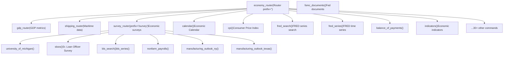
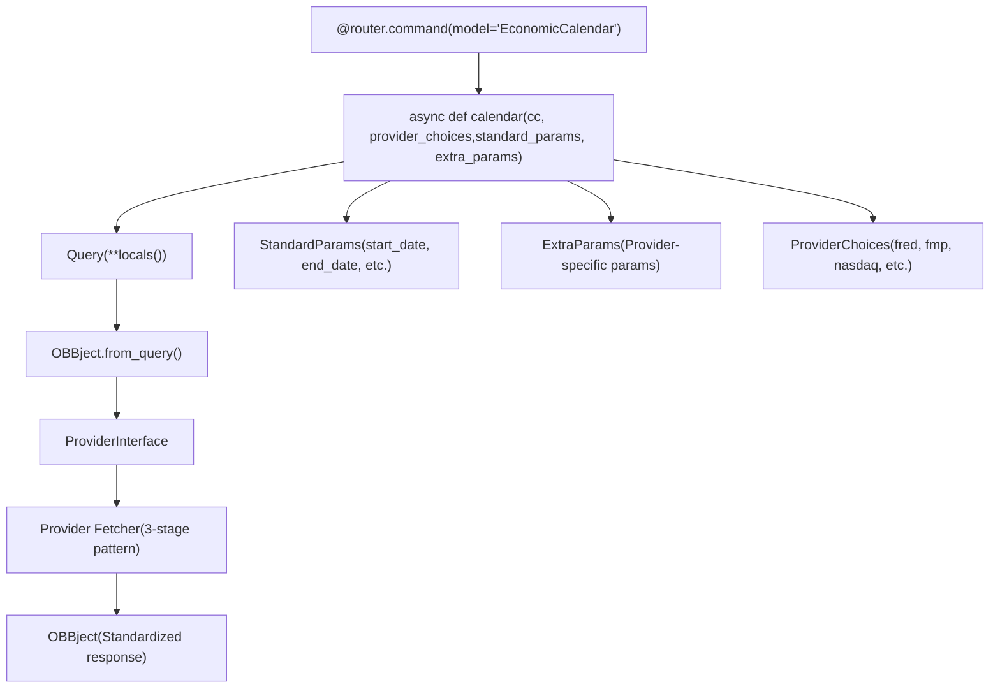
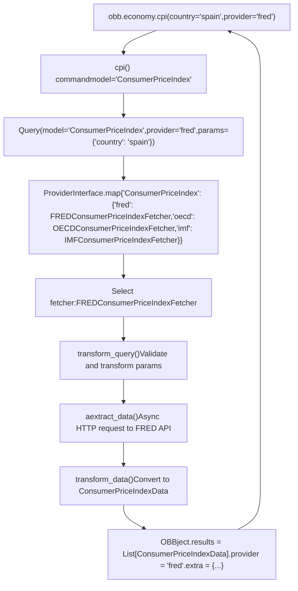
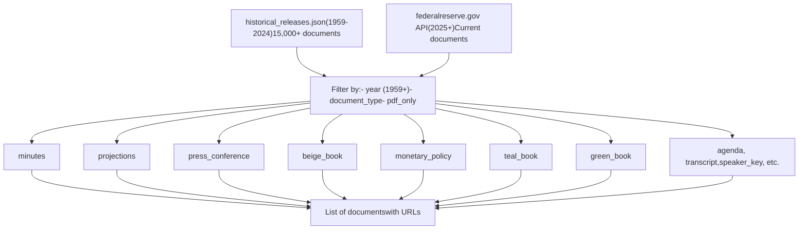
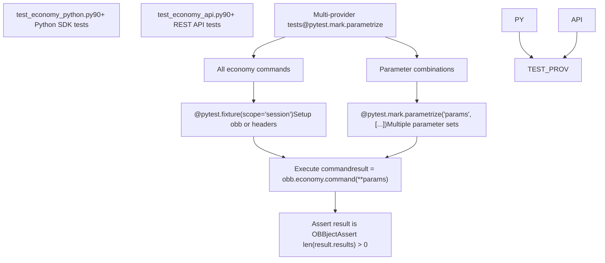

# Economy Extension

Relevant source files

-   [openbb\_platform/core/openbb\_core/app/model/charts/chart.py](https://github.com/OpenBB-finance/OpenBB/blob/dddc3b32/openbb_platform/core/openbb_core/app/model/charts/chart.py)
-   [openbb\_platform/core/openbb\_core/provider/standard\_models/primary\_dealer\_fails.py](https://github.com/OpenBB-finance/OpenBB/blob/dddc3b32/openbb_platform/core/openbb_core/provider/standard_models/primary_dealer_fails.py)
-   [openbb\_platform/core/tests/app/model/charts/test\_chart.py](https://github.com/OpenBB-finance/OpenBB/blob/dddc3b32/openbb_platform/core/tests/app/model/charts/test_chart.py)
-   [openbb\_platform/extensions/economy/integration/test\_economy\_api.py](https://github.com/OpenBB-finance/OpenBB/blob/dddc3b32/openbb_platform/extensions/economy/integration/test_economy_api.py)
-   [openbb\_platform/extensions/economy/integration/test\_economy\_python.py](https://github.com/OpenBB-finance/OpenBB/blob/dddc3b32/openbb_platform/extensions/economy/integration/test_economy_python.py)
-   [openbb\_platform/extensions/economy/openbb\_economy/economy\_router.py](https://github.com/OpenBB-finance/OpenBB/blob/dddc3b32/openbb_platform/extensions/economy/openbb_economy/economy_router.py)
-   [openbb\_platform/extensions/economy/openbb\_economy/survey/survey\_router.py](https://github.com/OpenBB-finance/OpenBB/blob/dddc3b32/openbb_platform/extensions/economy/openbb_economy/survey/survey_router.py)
-   [openbb\_platform/extensions/platform\_api/openbb\_platform\_api/assets/default\_apps.json](https://github.com/OpenBB-finance/OpenBB/blob/dddc3b32/openbb_platform/extensions/platform_api/openbb_platform_api/assets/default_apps.json)
-   [openbb\_platform/extensions/tests/test\_integration\_tests\_api.py](https://github.com/OpenBB-finance/OpenBB/blob/dddc3b32/openbb_platform/extensions/tests/test_integration_tests_api.py)
-   [openbb\_platform/extensions/tests/test\_integration\_tests\_python.py](https://github.com/OpenBB-finance/OpenBB/blob/dddc3b32/openbb_platform/extensions/tests/test_integration_tests_python.py)
-   [openbb\_platform/extensions/tests/utils/integration\_tests\_api\_generator.py](https://github.com/OpenBB-finance/OpenBB/blob/dddc3b32/openbb_platform/extensions/tests/utils/integration_tests_api_generator.py)
-   [openbb\_platform/extensions/tests/utils/integration\_tests\_testers.py](https://github.com/OpenBB-finance/OpenBB/blob/dddc3b32/openbb_platform/extensions/tests/utils/integration_tests_testers.py)
-   [openbb\_platform/providers/federal\_reserve/openbb\_federal\_reserve/\_\_init\_\_.py](https://github.com/OpenBB-finance/OpenBB/blob/dddc3b32/openbb_platform/providers/federal_reserve/openbb_federal_reserve/__init__.py)
-   [openbb\_platform/providers/federal\_reserve/openbb\_federal\_reserve/assets/historical\_releases.json](https://github.com/OpenBB-finance/OpenBB/blob/dddc3b32/openbb_platform/providers/federal_reserve/openbb_federal_reserve/assets/historical_releases.json)
-   [openbb\_platform/providers/federal\_reserve/openbb\_federal\_reserve/models/fomc\_documents.py](https://github.com/OpenBB-finance/OpenBB/blob/dddc3b32/openbb_platform/providers/federal_reserve/openbb_federal_reserve/models/fomc_documents.py)
-   [openbb\_platform/providers/federal\_reserve/openbb\_federal\_reserve/models/primary\_dealer\_fails.py](https://github.com/OpenBB-finance/OpenBB/blob/dddc3b32/openbb_platform/providers/federal_reserve/openbb_federal_reserve/models/primary_dealer_fails.py)
-   [openbb\_platform/providers/federal\_reserve/openbb\_federal\_reserve/models/primary\_dealer\_positioning.py](https://github.com/OpenBB-finance/OpenBB/blob/dddc3b32/openbb_platform/providers/federal_reserve/openbb_federal_reserve/models/primary_dealer_positioning.py)
-   [openbb\_platform/providers/federal\_reserve/openbb\_federal\_reserve/utils/fomc\_documents.py](https://github.com/OpenBB-finance/OpenBB/blob/dddc3b32/openbb_platform/providers/federal_reserve/openbb_federal_reserve/utils/fomc_documents.py)
-   [openbb\_platform/providers/federal\_reserve/openbb\_federal\_reserve/utils/primary\_dealer\_statistics.py](https://github.com/OpenBB-finance/OpenBB/blob/dddc3b32/openbb_platform/providers/federal_reserve/openbb_federal_reserve/utils/primary_dealer_statistics.py)
-   [openbb\_platform/providers/federal\_reserve/tests/record/http/test\_federal\_reserve\_fetchers/test\_federal\_reserve\_fomc\_documents\_fetcher\_urllib3\_v2.yaml](https://github.com/OpenBB-finance/OpenBB/blob/dddc3b32/openbb_platform/providers/federal_reserve/tests/record/http/test_federal_reserve_fetchers/test_federal_reserve_fomc_documents_fetcher_urllib3_v2.yaml)
-   [openbb\_platform/providers/federal\_reserve/tests/record/http/test\_federal\_reserve\_fetchers/test\_federal\_reserve\_primary\_dealer\_fails\_fetcher\_urllib3\_v2.yaml](https://github.com/OpenBB-finance/OpenBB/blob/dddc3b32/openbb_platform/providers/federal_reserve/tests/record/http/test_federal_reserve_fetchers/test_federal_reserve_primary_dealer_fails_fetcher_urllib3_v2.yaml)
-   [openbb\_platform/providers/federal\_reserve/tests/test\_federal\_reserve\_fetchers.py](https://github.com/OpenBB-finance/OpenBB/blob/dddc3b32/openbb_platform/providers/federal_reserve/tests/test_federal_reserve_fetchers.py)
-   [openbb\_platform/providers/fred/openbb\_fred/\_\_init\_\_.py](https://github.com/OpenBB-finance/OpenBB/blob/dddc3b32/openbb_platform/providers/fred/openbb_fred/__init__.py)
-   [openbb\_platform/providers/fred/openbb\_fred/models/manufacturing\_outlook\_ny.py](https://github.com/OpenBB-finance/OpenBB/blob/dddc3b32/openbb_platform/providers/fred/openbb_fred/models/manufacturing_outlook_ny.py)
-   [openbb\_platform/providers/fred/tests/record/http/test\_fred\_fetchers/test\_fred\_manufacturing\_outlook\_ny\_fetcher\_urllib3\_v2.yaml](https://github.com/OpenBB-finance/OpenBB/blob/dddc3b32/openbb_platform/providers/fred/tests/record/http/test_fred_fetchers/test_fred_manufacturing_outlook_ny_fetcher_urllib3_v2.yaml)
-   [openbb\_platform/providers/fred/tests/test\_fred\_fetchers.py](https://github.com/OpenBB-finance/OpenBB/blob/dddc3b32/openbb_platform/providers/fred/tests/test_fred_fetchers.py)

## Purpose and Scope

The Economy Extension (`openbb-economy`) provides access to macroeconomic data across multiple data providers through a unified interface. It organizes economic data commands into logical categories including GDP metrics, surveys, shipping statistics, economic calendars, consumer price indices, balance of payments, and Federal Reserve data.

This extension is one of the domain-specific data extensions in the OpenBB Platform (see [Data Extensions](/OpenBB-finance/OpenBB/3-data-extensions) for overview of all extensions). For equity market data, see [Equity Extension](/OpenBB-finance/OpenBB/3.2-equity-extension). For the underlying provider architecture that enables multi-provider support, see [Provider Architecture](/OpenBB-finance/OpenBB/2.3-provider-architecture).

**Sources:** [openbb\_platform/extensions/economy/openbb\_economy/economy\_router.py1-749](https://github.com/OpenBB-finance/OpenBB/blob/dddc3b32/openbb_platform/extensions/economy/openbb_economy/economy_router.py#L1-L749)

## Router Organization

The Economy Extension uses a hierarchical router structure to organize commands by domain. The main `economy_router` delegates to specialized sub-routers for better organization.


**Router Initialization Pattern:**

-   Main router: `Router(prefix="", description="Economic data.")`
-   Sub-routers included via `router.include_router(gdp_router)` pattern
-   Commands registered with `@router.command(model="ModelName")` decorator

**Sources:** [openbb\_platform/extensions/economy/openbb\_economy/economy\_router.py21-24](https://github.com/OpenBB-finance/OpenBB/blob/dddc3b32/openbb_platform/extensions/economy/openbb_economy/economy_router.py#L21-L24) [openbb\_platform/extensions/economy/openbb\_economy/survey/survey\_router.py14](https://github.com/OpenBB-finance/OpenBB/blob/dddc3b32/openbb_platform/extensions/economy/openbb_economy/survey/survey_router.py#L14-L14)

## Command Registration and Execution

Each command in the economy extension follows a standardized pattern for registration and execution through the provider interface.


**Command Function Signature:** All commands use this standard async signature:

```
async def command_name(    cc: CommandContext,    provider_choices: ProviderChoices,    standard_params: StandardParams,    extra_params: ExtraParams,) -> OBBject
```
The function body is typically a single line: `return await OBBject.from_query(Query(**locals()))`

This delegates execution to the command pipeline described in [Command Execution Pipeline](/OpenBB-finance/OpenBB/2.1-command-execution-pipeline).

**Sources:** [openbb\_platform/extensions/economy/openbb\_economy/economy\_router.py36-63](https://github.com/OpenBB-finance/OpenBB/blob/dddc3b32/openbb_platform/extensions/economy/openbb_economy/economy_router.py#L36-L63) [openbb\_platform/extensions/economy/openbb\_economy/economy\_router.py66-96](https://github.com/OpenBB-finance/OpenBB/blob/dddc3b32/openbb_platform/extensions/economy/openbb_economy/economy_router.py#L66-L96)

## Major Command Categories

### Economic Calendar and Indicators

| Command | Model | Description | Key Providers |
| --- | --- | --- | --- |
| `calendar()` | EconomicCalendar | Upcoming/historical economic events | fmp, nasdaq, tradingeconomics, fred |
| `indicators()` | EconomicIndicators | Economic indicators by country/symbol | econdb, imf |
| `available_indicators()` | AvailableIndicators | List available indicators | econdb, imf |
| `cpi()` | ConsumerPriceIndex | Consumer Price Index by country | fred, oecd, imf |
| `risk_premium()` | RiskPremium | Market risk premium by country | fmp |

**Sources:** [openbb\_platform/extensions/economy/openbb\_economy/economy\_router.py36-111](https://github.com/OpenBB-finance/OpenBB/blob/dddc3b32/openbb_platform/extensions/economy/openbb_economy/economy_router.py#L36-L111) [openbb\_platform/extensions/economy/openbb\_economy/economy\_router.py329-398](https://github.com/OpenBB-finance/OpenBB/blob/dddc3b32/openbb_platform/extensions/economy/openbb_economy/economy_router.py#L329-L398)

### FRED Integration

The extension provides extensive integration with the Federal Reserve Economic Data (FRED) API:

| Command | Model | Description |
| --- | --- | --- |
| `fred_search()` | FredSearch | Search for FRED series by ID or string |
| `fred_series()` | FredSeries | Get data by series ID from FRED |
| `fred_regional()` | FredRegional | Query Geo Fred API for regional data |
| `fred_release_table()` | FredReleaseTable | Get economic release data by ID/element |

**FRED Command Features:**

-   **Transform parameters**: `pc1` (percent change), `chg` (change), `log` (logarithm)
-   **Aggregation methods**: `eop` (end of period), `avg` (average)
-   **Frequency conversion**: Convert series to different frequencies (daily, weekly, monthly, quarterly, annual)
-   **Series groups**: Query multiple related series simultaneously

**Sources:** [openbb\_platform/extensions/economy/openbb\_economy/economy\_router.py136-200](https://github.com/OpenBB-finance/OpenBB/blob/dddc3b32/openbb_platform/extensions/economy/openbb_economy/economy_router.py#L136-L200) [openbb\_platform/extensions/economy/openbb\_economy/economy\_router.py273-301](https://github.com/OpenBB-finance/OpenBB/blob/dddc3b32/openbb_platform/extensions/economy/openbb_economy/economy_router.py#L273-L301)

### GDP and National Accounts

GDP-related commands are organized in a dedicated sub-router:

```
# GDP router endpoints/economy/gdp/forecast      # GDP forecasts by country (OECD)/economy/gdp/nominal       # Nominal GDP (econdb, OECD)/economy/gdp/real          # Real GDP (econdb, OECD)
```
**Sources:** [openbb\_platform/extensions/economy/openbb\_economy/economy\_router.py17](https://github.com/OpenBB-finance/OpenBB/blob/dddc3b32/openbb_platform/extensions/economy/openbb_economy/economy_router.py#L17-L17)

### Federal Reserve Data

| Command | Model | Description |
| --- | --- | --- |
| `money_measures()` | MoneyMeasures | M1/M2 and components (H.6 Release) |
| `central_bank_holdings()` | CentralBankHoldings | Fed balance sheet holdings |
| `primary_dealer_positioning()` | PrimaryDealerPositioning | Primary dealer net positions |
| `primary_dealer_fails()` | PrimaryDealerFails | Fails to deliver/receive statistics |
| `fomc_documents()` | FomcDocuments | FOMC meeting documents (minutes, projections, etc.) |
| `total_factor_productivity()` | TotalFactorProductivity | TFP for U.S. business sector |

**Sources:** [openbb\_platform/extensions/economy/openbb\_economy/economy\_router.py202-220](https://github.com/OpenBB-finance/OpenBB/blob/dddc3b32/openbb_platform/extensions/economy/openbb_economy/economy_router.py#L202-L220) [openbb\_platform/extensions/economy/openbb\_economy/economy\_router.py400-430](https://github.com/OpenBB-finance/OpenBB/blob/dddc3b32/openbb_platform/extensions/economy/openbb_economy/economy_router.py#L400-L430) [openbb\_platform/extensions/economy/openbb\_economy/economy\_router.py550-643](https://github.com/OpenBB-finance/OpenBB/blob/dddc3b32/openbb_platform/extensions/economy/openbb_economy/economy_router.py#L550-L643) [openbb\_platform/extensions/economy/openbb\_economy/economy\_router.py682-748](https://github.com/OpenBB-finance/OpenBB/blob/dddc3b32/openbb_platform/extensions/economy/openbb_economy/economy_router.py#L682-L748)

### Survey Data

The survey sub-router (`/economy/survey`) provides access to various economic surveys:

| Command | Description | Provider |
| --- | --- | --- |
| `university_of_michigan()` | Consumer sentiment and inflation expectations | fred |
| `sloos()` | Senior Loan Officer Opinion Survey | fred |
| `economic_conditions_chicago()` | Chicago Fed survey | fred |
| `manufacturing_outlook_texas()` | Dallas Fed manufacturing survey | fred |
| `manufacturing_outlook_ny()` | Empire State Manufacturing Survey | fred |
| `nonfarm_payrolls()` | Employment situation data | fred |
| `inflation_expectations()` | Survey of Professional Forecasters | federal\_reserve |
| `bls_search()` | Search BLS surveys | bls |
| `bls_series()` | Get BLS time series data | bls |

**Sources:** [openbb\_platform/extensions/economy/openbb\_economy/survey/survey\_router.py19-215](https://github.com/OpenBB-finance/OpenBB/blob/dddc3b32/openbb_platform/extensions/economy/openbb_economy/survey/survey_router.py#L19-L215)

### Trade and Shipping

| Command | Model | Description |
| --- | --- | --- |
| `balance_of_payments()` | BalanceOfPayments | BoP reports by country |
| `export_destinations()` | ExportDestinations | Top export destinations (UN Comtrade) |
| `direction_of_trade()` | DirectionOfTrade | Direction of Trade Statistics |
| `shipping.port_info()` | ShippingPortInfo | Port information |
| `shipping.port_volume()` | ShippingPortVolume | Port volume data |
| `shipping.chokepoint_info()` | ShippingChokepointInfo | Chokepoint information |
| `shipping.chokepoint_volume()` | ShippingChokepointVolume | Chokepoint volume data |

**Sources:** [openbb\_platform/extensions/economy/openbb\_economy/economy\_router.py113-134](https://github.com/OpenBB-finance/OpenBB/blob/dddc3b32/openbb_platform/extensions/economy/openbb_economy/economy_router.py#L113-L134) [openbb\_platform/extensions/economy/openbb\_economy/economy\_router.py596-679](https://github.com/OpenBB-finance/OpenBB/blob/dddc3b32/openbb_platform/extensions/economy/openbb_economy/economy_router.py#L596-L679)

## Provider Integration Flow

The economy extension integrates with 12+ data providers through the ProviderInterface system. Each command can be executed with different providers, each potentially offering different parameters and data fields.


**Key Provider Features:**

1.  **Provider-Specific Parameters**: Each provider can define extra parameters beyond the standard ones
2.  **Multiple Provider Support**: Same command can work with multiple providers (e.g., `cpi()` works with fred, oecd, imf)
3.  **Dynamic Parameter Merging**: Standard and extra parameters are merged at runtime
4.  **Provider Fallback**: If a provider is not specified, the first available provider is used

**Sources:** [openbb\_platform/extensions/economy/openbb\_economy/economy\_router.py66-96](https://github.com/OpenBB-finance/OpenBB/blob/dddc3b32/openbb_platform/extensions/economy/openbb_economy/economy_router.py#L66-L96) [openbb\_platform/providers/fred/openbb\_fred/\_\_init\_\_.py59-107](https://github.com/OpenBB-finance/OpenBB/blob/dddc3b32/openbb_platform/providers/fred/openbb_fred/__init__.py#L59-L107) [openbb\_platform/providers/federal\_reserve/openbb\_federal\_reserve/\_\_init\_\_.py40-60](https://github.com/OpenBB-finance/OpenBB/blob/dddc3b32/openbb_platform/providers/federal_reserve/openbb_federal_reserve/__init__.py#L40-L60)

## Key Data Providers

### FRED Provider

The FRED provider is the most extensively integrated, supporting 30+ economy extension models:

**Models Supported:**

-   `ConsumerPriceIndex`, `BalanceOfPayments`, `EconomicCalendar`
-   `FredSearch`, `FredSeries`, `FredRegional`, `FredReleaseTable`
-   `UniversityOfMichigan`, `SeniorLoanOfficerSurvey`, `RetailPrices`
-   `ManufacturingOutlookNY`, `ManufacturingOutlookTexas`
-   `NonFarmPayrolls`, `PersonalConsumptionExpenditures`

**FRED-Specific Features:**

-   Series ID search by string, tag, or release
-   Regional data via Geo Fred API
-   Data transformations (percent change, log, etc.)
-   Frequency aggregation
-   Release table navigation with element IDs

**Sources:** [openbb\_platform/providers/fred/openbb\_fred/\_\_init\_\_.py59-107](https://github.com/OpenBB-finance/OpenBB/blob/dddc3b32/openbb_platform/providers/fred/openbb_fred/__init__.py#L59-L107)

### Federal Reserve Provider

Direct integration with Federal Reserve data sources:

**Models Supported:**

-   `MoneyMeasures` (H.6 Release)
-   `CentralBankHoldings` (Balance sheet)
-   `PrimaryDealerPositioning`, `PrimaryDealerFails`
-   `FomcDocuments` (Meeting documents)
-   `TotalFactorProductivity`, `InflationExpectations`
-   `FederalFundsRate`, `SOFR`, `YieldCurve`

**FOMC Documents Integration:**

The FOMC documents endpoint provides access to a comprehensive archive:


**Primary Dealer Statistics:**

The Federal Reserve provider includes specialized endpoints for primary dealer positioning and fails data:

-   **Positioning**: Net positions (long - short) by asset class (treasuries, MBS, corporate, etc.)
-   **Fails**: Fails to deliver/receive by asset class, tracked weekly
-   **Categories**: 13+ asset class categories with detailed subcategories
-   **Time Series**: Historical data updated weekly on Thursdays

**Sources:** [openbb\_platform/providers/federal\_reserve/openbb\_federal\_reserve/\_\_init\_\_.py40-60](https://github.com/OpenBB-finance/OpenBB/blob/dddc3b32/openbb_platform/providers/federal_reserve/openbb_federal_reserve/__init__.py#L40-L60) [openbb\_platform/providers/federal\_reserve/openbb\_federal\_reserve/utils/fomc\_documents.py27-249](https://github.com/OpenBB-finance/OpenBB/blob/dddc3b32/openbb_platform/providers/federal_reserve/openbb_federal_reserve/utils/fomc_documents.py#L27-L249) [openbb\_platform/providers/federal\_reserve/openbb\_federal\_reserve/models/primary\_dealer\_fails.py1-173](https://github.com/OpenBB-finance/OpenBB/blob/dddc3b32/openbb_platform/providers/federal_reserve/openbb_federal_reserve/models/primary_dealer_fails.py#L1-L173) [openbb\_platform/providers/federal\_reserve/openbb\_federal\_reserve/models/primary\_dealer\_positioning.py1-165](https://github.com/OpenBB-finance/OpenBB/blob/dddc3b32/openbb_platform/providers/federal_reserve/openbb_federal_reserve/models/primary_dealer_positioning.py#L1-L165)

### Other Key Providers

| Provider | Key Models | Specialty |
| --- | --- | --- |
| **OECD** | Unemployment, GDP, CompositeLeadingIndicator, InterestRates | Cross-country comparable data |
| **IMF** | EconomicIndicators, DirectionOfTrade, ShippingPortInfo | Global economic data, trade statistics |
| **EconDB** | CountryProfile, EconomicIndicators, ExportDestinations | Country-level aggregated data |
| **ECB** | BalanceOfPayments | European Central Bank data |
| **BLS** | BlsSearch, BlsSeries | U.S. Bureau of Labor Statistics |

**Sources:** [openbb\_platform/extensions/economy/integration/test\_economy\_python.py20-1290](https://github.com/OpenBB-finance/OpenBB/blob/dddc3b32/openbb_platform/extensions/economy/integration/test_economy_python.py#L20-L1290)

## Integration Testing Structure

The economy extension includes comprehensive integration tests covering both Python SDK and REST API interfaces:


**Test Parameterization Example:**

For each command, tests are parameterized with different provider configurations:

```
@pytest.mark.parametrize(    "params",    [        {"country": "spain", "provider": "fred"},        {"country": "portugal,spain", "provider": "oecd"},        {"country": "portugal,spain", "provider": "imf"},    ],)def test_economy_cpi(params, obb):    result = obb.economy.cpi(**params)    assert isinstance(result, OBBject)    assert len(result.results) > 0
```
This pattern ensures:

-   Each provider implementation is tested
-   Parameter variations are covered
-   Both standard and provider-specific parameters are validated

**Test Validation:**

The testing infrastructure includes several validation layers:

-   `check_missing_providers()`: Ensures all providers for a model have tests
-   `check_missing_params()`: Validates all parameters are tested
-   `check_wrong_params()`: Catches invalid parameter usage
-   `check_outdated_integration_tests()`: Identifies tests for removed commands

**Sources:** [openbb\_platform/extensions/economy/integration/test\_economy\_python.py1-1290](https://github.com/OpenBB-finance/OpenBB/blob/dddc3b32/openbb_platform/extensions/economy/integration/test_economy_python.py#L1-L1290) [openbb\_platform/extensions/economy/integration/test\_economy\_api.py1-2079](https://github.com/OpenBB-finance/OpenBB/blob/dddc3b32/openbb_platform/extensions/economy/integration/test_economy_api.py#L1-L2079) [openbb\_platform/extensions/tests/utils/integration\_tests\_testers.py60-372](https://github.com/OpenBB-finance/OpenBB/blob/dddc3b32/openbb_platform/extensions/tests/utils/integration_tests_testers.py#L60-L372)

## Example Usage Patterns

**Basic command execution:**

```
# Using default provider (first available)result = obb.economy.cpi(country="united_states") # Specifying providerresult = obb.economy.cpi(    country="united_states,united_kingdom",    provider="fred") # Provider-specific parametersresult = obb.economy.cpi(    country="canada",    transform="weight_percent",    expenditure="transport",    provider="imf")
```
**FRED series search and fetch:**

```
# Search for seriessearch_results = obb.economy.fred_search(    query="GDP",    tag_names="gdp",    limit=10) # Fetch series dataseries_data = obb.economy.fred_series(    symbol="GDPC1",    transform="pc1",  # Percent change    frequency="q"      # Quarterly)
```
**Federal Reserve data:**

```
# Get FOMC documentsfomc_docs = obb.economy.fomc_documents(    year=2022,    document_type="minutes") # Primary dealer positioningpositioning = obb.economy.primary_dealer_positioning(    category="treasuries",    start_date="2024-01-01")
```
**Sources:** [openbb\_platform/extensions/economy/openbb\_economy/economy\_router.py66-96](https://github.com/OpenBB-finance/OpenBB/blob/dddc3b32/openbb_platform/extensions/economy/openbb_economy/economy_router.py#L66-L96) [openbb\_platform/extensions/economy/openbb\_economy/economy\_router.py136-200](https://github.com/OpenBB-finance/OpenBB/blob/dddc3b32/openbb_platform/extensions/economy/openbb_economy/economy_router.py#L136-L200) [openbb\_platform/extensions/economy/openbb\_economy/economy\_router.py682-713](https://github.com/OpenBB-finance/OpenBB/blob/dddc3b32/openbb_platform/extensions/economy/openbb_economy/economy_router.py#L682-L713)
