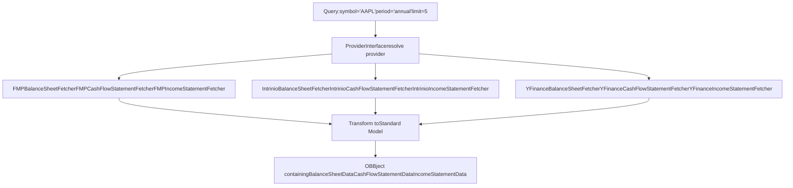
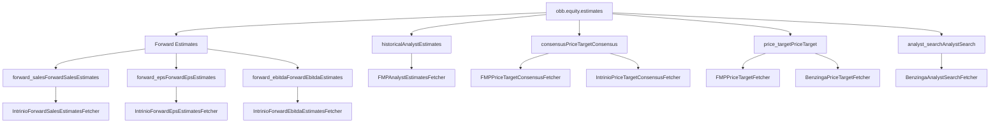
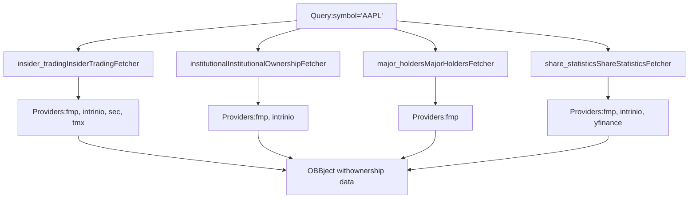
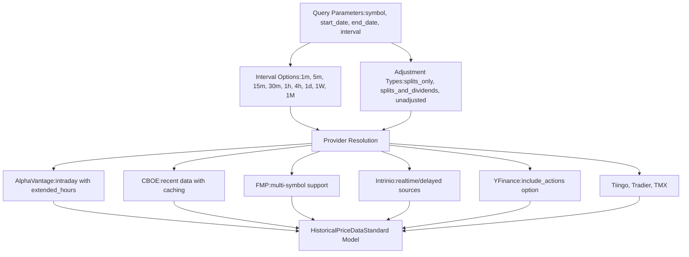
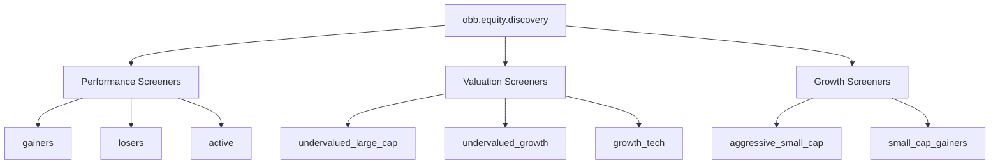
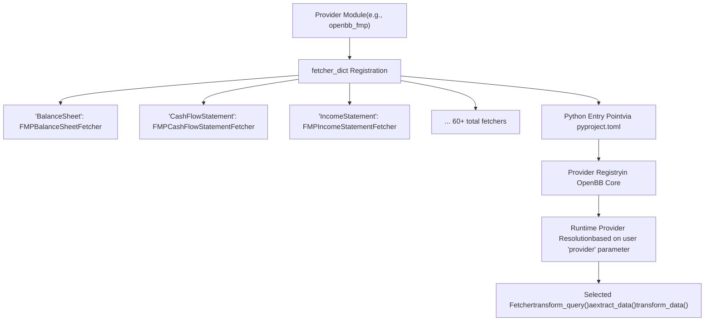
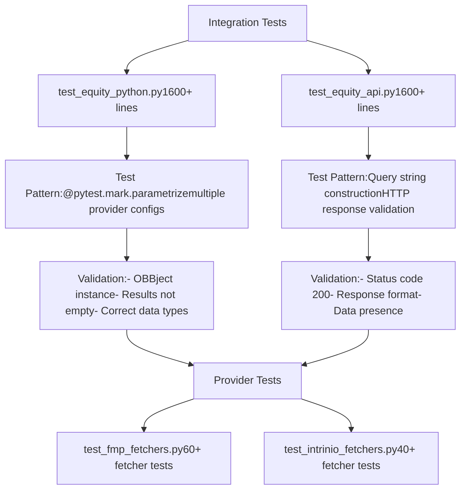

# Equity Extension

Relevant source files

-   [openbb\_platform/core/openbb\_core/provider/standard\_models/company\_filings.py](https://github.com/OpenBB-finance/OpenBB/blob/dddc3b32/openbb_platform/core/openbb_core/provider/standard_models/company_filings.py)
-   [openbb\_platform/extensions/equity/integration/test\_equity\_api.py](https://github.com/OpenBB-finance/OpenBB/blob/dddc3b32/openbb_platform/extensions/equity/integration/test_equity_api.py)
-   [openbb\_platform/extensions/equity/integration/test\_equity\_python.py](https://github.com/OpenBB-finance/OpenBB/blob/dddc3b32/openbb_platform/extensions/equity/integration/test_equity_python.py)
-   [openbb\_platform/extensions/equity/openbb\_equity/fundamental/fundamental\_router.py](https://github.com/OpenBB-finance/OpenBB/blob/dddc3b32/openbb_platform/extensions/equity/openbb_equity/fundamental/fundamental_router.py)
-   [openbb\_platform/extensions/etf/integration/test\_etf\_api.py](https://github.com/OpenBB-finance/OpenBB/blob/dddc3b32/openbb_platform/extensions/etf/integration/test_etf_api.py)
-   [openbb\_platform/extensions/etf/integration/test\_etf\_python.py](https://github.com/OpenBB-finance/OpenBB/blob/dddc3b32/openbb_platform/extensions/etf/integration/test_etf_python.py)
-   [openbb\_platform/providers/fmp/openbb\_fmp/\_\_init\_\_.py](https://github.com/OpenBB-finance/OpenBB/blob/dddc3b32/openbb_platform/providers/fmp/openbb_fmp/__init__.py)
-   [openbb\_platform/providers/fmp/openbb\_fmp/models/company\_filings.py](https://github.com/OpenBB-finance/OpenBB/blob/dddc3b32/openbb_platform/providers/fmp/openbb_fmp/models/company_filings.py)
-   [openbb\_platform/providers/fmp/pyproject.toml](https://github.com/OpenBB-finance/OpenBB/blob/dddc3b32/openbb_platform/providers/fmp/pyproject.toml)
-   [openbb\_platform/providers/fmp/tests/test\_fmp\_fetchers.py](https://github.com/OpenBB-finance/OpenBB/blob/dddc3b32/openbb_platform/providers/fmp/tests/test_fmp_fetchers.py)
-   [openbb\_platform/providers/intrinio/openbb\_intrinio/\_\_init\_\_.py](https://github.com/OpenBB-finance/OpenBB/blob/dddc3b32/openbb_platform/providers/intrinio/openbb_intrinio/__init__.py)
-   [openbb\_platform/providers/intrinio/openbb\_intrinio/models/company\_filings.py](https://github.com/OpenBB-finance/OpenBB/blob/dddc3b32/openbb_platform/providers/intrinio/openbb_intrinio/models/company_filings.py)
-   [openbb\_platform/providers/intrinio/tests/test\_intrinio\_fetchers.py](https://github.com/OpenBB-finance/OpenBB/blob/dddc3b32/openbb_platform/providers/intrinio/tests/test_intrinio_fetchers.py)
-   [openbb\_platform/providers/sec/openbb\_sec/\_\_init\_\_.py](https://github.com/OpenBB-finance/OpenBB/blob/dddc3b32/openbb_platform/providers/sec/openbb_sec/__init__.py)
-   [openbb\_platform/providers/sec/openbb\_sec/utils/form4.py](https://github.com/OpenBB-finance/OpenBB/blob/dddc3b32/openbb_platform/providers/sec/openbb_sec/utils/form4.py)
-   [openbb\_platform/providers/sec/tests/test\_sec\_fetchers.py](https://github.com/OpenBB-finance/OpenBB/blob/dddc3b32/openbb_platform/providers/sec/tests/test_sec_fetchers.py)
-   [openbb\_platform/providers/tmx/openbb\_tmx/models/company\_filings.py](https://github.com/OpenBB-finance/OpenBB/blob/dddc3b32/openbb_platform/providers/tmx/openbb_tmx/models/company_filings.py)

## Purpose and Scope

The Equity Extension provides comprehensive access to equity market data through a unified interface that supports multiple data providers. It organizes equity-related functionality into logical sub-routers covering fundamental data, price data, analyst estimates, ownership information, calendar events, discovery/screening tools, and comparison utilities.

This page documents the extension's structure, available endpoints, provider integration patterns, and testing approaches. For information about the Provider Architecture that enables multi-provider support, see [Provider Architecture](/OpenBB-finance/OpenBB/2.3-provider-architecture). For general extension system concepts, see [Extension System](/OpenBB-finance/OpenBB/2.2-extension-system).

## Extension Structure

The Equity Extension is organized into seven major sub-router categories, each accessible through the `obb.equity` namespace:

```mermaid
flowchart TD
    Root["equity(root router)"]
    Fundamental["fundamental(sub-router)"]
    Estimates["estimates(sub-router)"]
    Ownership["ownership(sub-router)"]
    Calendar["calendar(sub-router)"]
    Price["price(sub-router)"]
    Compare["compare(sub-router)"]
    Discovery["discovery(sub-router)"]
    Direct["Direct endpoints:search, screener, profile"]
    F1["balance, cash, income"]
    F2["balance_growth, cash_growth, income_growth"]
    F3["dividends, employee_count, historical_splits"]
    F4["management, management_compensation, metrics"]
    F5["ratios, filings, transcript"]
    F6["revenue_per_geography, revenue_per_segment"]
    F7["search_attributes, historical_attributes, latest_attributes"]
    E1["historical, consensus"]
    E2["price_target, analyst_search"]
    E3["forward_sales, forward_eps, forward_ebitda"]
    O1["insider_trading, institutional"]
    O2["major_holders, share_statistics"]
    C1["dividend, splits, earnings, ipo"]
    P1["historical"]
    CM1["peers, groups"]
    D1["gainers, losers, active"]
    D2["undervalued, growth, aggressive_small_cap"]

    Root --> Fundamental
    Root --> Estimates
    Root --> Ownership
    Root --> Calendar
    Root --> Price
    Root --> Compare
    Root --> Discovery
    Root --> Direct
    Fundamental --> F1
    Fundamental --> F2
    Fundamental --> F3
    Fundamental --> F4
    Fundamental --> F5
    Fundamental --> F6
    Fundamental --> F7
    Estimates --> E1
    Estimates --> E2
    Estimates --> E3
    Ownership --> O1
    Ownership --> O2
    Calendar --> C1
    Price --> P1
    Compare --> CM1
    Discovery --> D1
    Discovery --> D2
```


**Sources:** [openbb\_platform/extensions/equity/integration/test\_equity\_python.py1-1600](https://github.com/OpenBB-finance/OpenBB/blob/dddc3b32/openbb_platform/extensions/equity/integration/test_equity_python.py#L1-L1600)

## Fundamental Data Sub-Router

The `fundamental` sub-router provides access to company financial statements, growth metrics, management information, and corporate filings. All endpoints support multiple providers with standardized output models.

### Financial Statements

Three core statement types are available with consistent parameter patterns:

| Endpoint | Standard Model | Providers | Key Parameters |
| --- | --- | --- | --- |
| `balance` | BalanceSheet | fmp, intrinio, yfinance | symbol, period, limit, fiscal\_year |
| `cash` | CashFlowStatement | fmp, intrinio, yfinance | symbol, period, limit, fiscal\_year |
| `income` | IncomeStatement | fmp, intrinio, yfinance | symbol, period, limit, fiscal\_year |


**Sources:** [openbb\_platform/extensions/equity/integration/test\_equity\_python.py21-168](https://github.com/OpenBB-finance/OpenBB/blob/dddc3b32/openbb_platform/extensions/equity/integration/test_equity_python.py#L21-L168) [openbb\_platform/providers/fmp/openbb\_fmp/\_\_init\_\_.py78-148](https://github.com/OpenBB-finance/OpenBB/blob/dddc3b32/openbb_platform/providers/fmp/openbb_fmp/__init__.py#L78-L148) [openbb\_platform/providers/intrinio/openbb\_intrinio/\_\_init\_\_.py72-112](https://github.com/OpenBB-finance/OpenBB/blob/dddc3b32/openbb_platform/providers/intrinio/openbb_intrinio/__init__.py#L72-L112)

### Growth Metrics

Growth endpoints provide year-over-year or quarter-over-quarter percentage changes for financial statement line items:

```
# Balance sheet growthobb.equity.fundamental.balance_growth(symbol="AAPL", limit=10, provider="fmp", period="annual") # Cash flow growth  obb.equity.fundamental.cash_growth(symbol="AAPL", limit=10, provider="fmp", period="annual") # Income statement growthobb.equity.fundamental.income_growth(symbol="AAPL", limit=10, period="annual", provider="fmp")
```
**Sources:** [openbb\_platform/extensions/equity/integration/test\_equity\_python.py61-185](https://github.com/OpenBB-finance/OpenBB/blob/dddc3b32/openbb_platform/extensions/equity/integration/test_equity_python.py#L61-L185)

### Management and Corporate Governance

| Endpoint | Description | Providers |
| --- | --- | --- |
| `management` | Key executives and leadership | fmp, yfinance |
| `management_compensation` | Executive compensation details | fmp |
| `employee_count` | Historical employee headcount | fmp |

**Sources:** [openbb\_platform/extensions/equity/integration/test\_equity\_python.py186-318](https://github.com/OpenBB-finance/OpenBB/blob/dddc3b32/openbb_platform/extensions/equity/integration/test_equity_python.py#L186-L318)

### Dividends and Splits

Historical corporate actions are available through dedicated endpoints:

```
# Historical dividend paymentsobb.equity.fundamental.dividends(    symbol="AAPL",    start_date="2021-01-01",     end_date="2023-06-06",    provider="intrinio") # Historical stock splitsobb.equity.fundamental.historical_splits(symbol="AAPL", provider="fmp")
```
**Sources:** [openbb\_platform/extensions/equity/integration/test\_equity\_python.py236-295](https://github.com/OpenBB-finance/OpenBB/blob/dddc3b32/openbb_platform/extensions/equity/integration/test_equity_python.py#L236-L295)

### Financial Metrics and Ratios

Comprehensive metric endpoints provide calculated financial ratios and key performance indicators:

```
# Key metrics (P/E, EPS, market cap, etc.)obb.equity.fundamental.metrics(symbol="AAPL", period="annual", provider="fmp") # Financial ratios (liquidity, profitability, efficiency)obb.equity.fundamental.ratios(symbol="AAPL", period="annual", limit=2, provider="fmp")
```
The `metrics` endpoint supports multiple providers with varying data schemas:

-   **fmp**: Comprehensive metrics with TTM support
-   **intrinio**: Industry-specific metrics with `industry_group_number` parameter
-   **yfinance**: Basic metrics
-   **finviz**: Snapshot metrics supporting multiple symbols

**Sources:** [openbb\_platform/extensions/equity/integration/test\_equity\_python.py508-536](https://github.com/OpenBB-finance/OpenBB/blob/dddc3b32/openbb_platform/extensions/equity/integration/test_equity_python.py#L508-L536) [openbb\_platform/extensions/equity/integration/test\_equity\_python.py763-793](https://github.com/OpenBB-finance/OpenBB/blob/dddc3b32/openbb_platform/extensions/equity/integration/test_equity_python.py#L763-L793)

### Revenue Segmentation

Geographic and business line revenue breakdowns:

```
# Revenue by geographyobb.equity.fundamental.revenue_per_geography(symbol="AAPL", period="annual", provider="fmp") # Revenue by business segmentobb.equity.fundamental.revenue_per_segment(symbol="AAPL", period="annual", provider="fmp")
```
**Sources:** [openbb\_platform/extensions/equity/integration/test\_equity\_python.py795-834](https://github.com/OpenBB-finance/OpenBB/blob/dddc3b32/openbb_platform/extensions/equity/integration/test_equity_python.py#L795-L834)

### Corporate Filings

Access to SEC filings and regulatory documents:

```
# SEC filings with flexible filteringobb.equity.fundamental.filings(    symbol="AAPL",    form_type="8-K",    limit=3,    start_date="2021-01-01",    end_date="2023-01-01",    provider="sec",    use_cache=False) # CIK-based queriesobb.equity.fundamental.filings(    cik="0001067983",    limit=3,    form_type="10-Q",    provider="sec")
```
Provider support includes:

-   **fmp**: Historical filings with form type filtering
-   **intrinio**: THEA-enabled filings
-   **sec**: Direct SEC EDGAR access with caching
-   **tmx**: Canadian filings
-   **nasdaq**: Form group filtering by year

**Sources:** [openbb\_platform/extensions/equity/integration/test\_equity\_python.py837-908](https://github.com/OpenBB-finance/OpenBB/blob/dddc3b32/openbb_platform/extensions/equity/integration/test_equity_python.py#L837-L908)

### Earnings Transcripts

```
# Quarterly earnings call transcriptsobb.equity.fundamental.transcript(symbol="AAPL", year=2023, quarter=2, provider="fmp")
```
**Sources:** [openbb\_platform/extensions/equity/integration/test\_equity\_python.py927-940](https://github.com/OpenBB-finance/OpenBB/blob/dddc3b32/openbb_platform/extensions/equity/integration/test_equity_python.py#L927-L940)

### Intrinio Data Tags

Intrinio provider offers specialized endpoints for accessing custom financial data tags:

```
# Search available data tagsobb.equity.fundamental.search_attributes(query="ebit", limit=100, provider="intrinio") # Historical values for specific tagsobb.equity.fundamental.historical_attributes(    symbol="AAPL,MSFT",    tag="ebit,ebitda,marketcap",    frequency="yearly",    start_date="2013-01-01",    end_date="2023-01-01",    provider="intrinio") # Latest values for tagsobb.equity.fundamental.latest_attributes(    symbol="AAPL,MSFT",    tag="ceo,ebitda",    provider="intrinio")
```
**Sources:** [openbb\_platform/extensions/equity/integration/test\_equity\_python.py1127-1284](https://github.com/OpenBB-finance/OpenBB/blob/dddc3b32/openbb_platform/extensions/equity/integration/test_equity_python.py#L1127-L1284)

## Estimates Sub-Router

The `estimates` sub-router provides analyst forecasts and consensus data:


### Historical Estimates

```
# Historical analyst estimatesobb.equity.estimates.historical(symbol="AAPL,MSFT", period="annual", limit=30)
```
**Sources:** [openbb\_platform/extensions/equity/integration/test\_equity\_python.py320-333](https://github.com/OpenBB-finance/OpenBB/blob/dddc3b32/openbb_platform/extensions/equity/integration/test_equity_python.py#L320-L333)

### Price Targets

```
# Analyst price targetsobb.equity.estimates.price_target(symbol="AAPL", limit=10, provider="fmp") # With Benzinga provider for detailed analyst informationobb.equity.estimates.price_target(    symbol="AAPL",    limit=10,    provider="benzinga",    importance=None,    analyst_ids=None,    firm_ids=None)
```
**Sources:** [openbb\_platform/extensions/equity/integration/test\_equity\_python.py578-610](https://github.com/OpenBB-finance/OpenBB/blob/dddc3b32/openbb_platform/extensions/equity/integration/test_equity_python.py#L578-L610)

### Consensus Estimates

Multiple providers offer consensus views with different parameter sets:

```
# FMP consensusobb.equity.estimates.consensus(symbol="AAPL", provider="fmp") # Intrinio with industry groupingobb.equity.estimates.consensus(    symbol="AAPL,MSFT",    industry_group_number=None,    provider="intrinio") # Seeking Alpha consensusobb.equity.estimates.consensus(symbol="AAPL,BAM:CA", provider="seeking_alpha")
```
**Sources:** [openbb\_platform/extensions/equity/integration/test\_equity\_python.py638-660](https://github.com/OpenBB-finance/OpenBB/blob/dddc3b32/openbb_platform/extensions/equity/integration/test_equity_python.py#L638-L660)

### Forward Estimates

Forward-looking estimates support multiple fiscal period configurations:

```
# Forward salesobb.equity.estimates.forward_sales(    symbol="AAPL,MSFT",    fiscal_period="fy",    provider="intrinio") # Forward EPS with historical inclusionobb.equity.estimates.forward_eps(    symbol="AAPL,MSFT",    fiscal_period="annual",    include_historical=False,    provider="fmp") # Forward EBITDAobb.equity.estimates.forward_ebitda(    symbol="AAPL,MSFT",    fiscal_period="quarter",    provider="intrinio")
```
**Sources:** [openbb\_platform/extensions/equity/integration/test\_equity\_python.py662-761](https://github.com/OpenBB-finance/OpenBB/blob/dddc3b32/openbb_platform/extensions/equity/integration/test_equity_python.py#L662-L761)

### Analyst Search

The Benzinga provider offers analyst and firm search capabilities:

```
obb.equity.estimates.analyst_search(    limit=10,    provider="benzinga",    firm_name="Barclays",    analyst_name=None)
```
**Sources:** [openbb\_platform/extensions/equity/integration/test\_equity\_python.py612-636](https://github.com/OpenBB-finance/OpenBB/blob/dddc3b32/openbb_platform/extensions/equity/integration/test_equity_python.py#L612-L636)

## Ownership Sub-Router

The `ownership` sub-router tracks institutional holdings, insider transactions, and share statistics:


### Insider Trading

Track corporate insider transactions with multiple provider options:

```
# FMP insider trading with transaction type filteringobb.equity.ownership.insider_trading(    symbol="AAPL",    limit=10,    transaction_type=None,    statistics=False,    provider="fmp") # Intrinio with date range and ownership typeobb.equity.ownership.insider_trading(    symbol="AAPL",    limit=10,    start_date="2021-01-01",    end_date="2023-06-06",    ownership_type=None,    sort_by="updated_on",    provider="intrinio") # SEC direct filing data with cachingobb.equity.ownership.insider_trading(    symbol="AAPL",    limit=10,    start_date="2024-06-30",    end_date="2024-09-30",    use_cache=True,    provider="sec")
```
**Sources:** [openbb\_platform/extensions/equity/integration/test\_equity\_python.py388-437](https://github.com/OpenBB-finance/OpenBB/blob/dddc3b32/openbb_platform/extensions/equity/integration/test_equity_python.py#L388-L437)

### Institutional Ownership

Quarterly 13F filing data showing institutional holdings:

```
# FMP institutional ownership by quarterobb.equity.ownership.institutional(    symbol="AAPL",    year=2024,    quarter=4,    provider="fmp")
```
**Note:** The Intrinio institutional ownership endpoint has been disabled due to reliability issues with the upstream API.

**Sources:** [openbb\_platform/extensions/equity/integration/test\_equity\_python.py439-467](https://github.com/OpenBB-finance/OpenBB/blob/dddc3b32/openbb_platform/extensions/equity/integration/test_equity_python.py#L439-L467)

### Major Holders

Significant institutional positions:

```
obb.equity.ownership.major_holders(    symbol="AAPL",    year=2024,    quarter=1,    page=None,    limit=None,    provider="fmp")
```
**Sources:** [openbb\_platform/extensions/equity/integration/test\_equity\_python.py554-576](https://github.com/OpenBB-finance/OpenBB/blob/dddc3b32/openbb_platform/extensions/equity/integration/test_equity_python.py#L554-L576)

### Share Statistics

Float, shares outstanding, and ownership percentages:

```
# Multi-provider support for share statisticsobb.equity.ownership.share_statistics(symbol="AAPL", provider="fmp")obb.equity.ownership.share_statistics(symbol="AAPL", provider="intrinio")obb.equity.ownership.share_statistics(symbol="AAPL", provider="yfinance")
```
**Sources:** [openbb\_platform/extensions/equity/integration/test\_equity\_python.py910-925](https://github.com/OpenBB-finance/OpenBB/blob/dddc3b32/openbb_platform/extensions/equity/integration/test_equity_python.py#L910-L925)

## Calendar Sub-Router

The `calendar` sub-router provides upcoming and historical corporate events:

| Endpoint | Event Type | Parameters | Providers |
| --- | --- | --- | --- |
| `dividend` | Dividend announcements | start\_date, end\_date | fmp, nasdaq |
| `splits` | Stock splits | start\_date, end\_date | fmp |
| `earnings` | Earnings releases | start\_date, end\_date, country | fmp, nasdaq, tmx, seeking\_alpha |
| `ipo` | IPO events | start\_date, end\_date, status | intrinio, nasdaq, fmp |

### Calendar Usage Patterns

```
# Dividend calendarobb.equity.calendar.dividend(    start_date="2023-11-05",    end_date="2023-11-10",    provider="fmp") # Stock splits calendarobb.equity.calendar.splits(    start_date="2023-11-05",    end_date="2023-11-10",    provider="fmp") # Earnings calendar with country filteringobb.equity.calendar.earnings(    start_date="2023-11-09",    end_date="2023-11-10",    provider="seeking_alpha",    country="us") # IPO calendar with status filteringobb.equity.calendar.ipo(    start_date="2023-01-01",    end_date="2023-11-01",    status="priced",    provider="nasdaq",    is_spo=False)
```
**Sources:** [openbb\_platform/extensions/equity/integration/test\_equity\_python.py76-130](https://github.com/OpenBB-finance/OpenBB/blob/dddc3b32/openbb_platform/extensions/equity/integration/test_equity_python.py#L76-L130) [openbb\_platform/extensions/equity/integration/test\_equity\_python.py92-105](https://github.com/OpenBB-finance/OpenBB/blob/dddc3b32/openbb_platform/extensions/equity/integration/test_equity_python.py#L92-L105) [openbb\_platform/extensions/equity/integration/test\_equity\_python.py107-130](https://github.com/OpenBB-finance/OpenBB/blob/dddc3b32/openbb_platform/extensions/equity/integration/test_equity_python.py#L107-L130) [openbb\_platform/extensions/equity/integration/test\_equity\_python.py469-506](https://github.com/OpenBB-finance/OpenBB/blob/dddc3b32/openbb_platform/extensions/equity/integration/test_equity_python.py#L469-L506)

## Price Sub-Router

The `price` sub-router provides historical price data with extensive interval and adjustment options:


### Historical Price Examples

```
# Alpha Vantage with extended hoursobb.equity.price.historical(    symbol="AAPL",    start_date="2023-01-01",    end_date="2023-06-06",    interval="15m",    adjustment="unadjusted",    extended_hours=True,    provider="alpha_vantage") # CBOE for recent dataobb.equity.price.historical(    symbol="AAPL",    interval="1d",    provider="cboe",    use_cache=False) # FMP with multiple symbolsobb.equity.price.historical(    symbol="AAPL,MSFT",    interval="1h",    provider="fmp",    adjustment="splits_only") # Intrinio with source selectionobb.equity.price.historical(    symbol="AAPL",    start_date="2023-06-01",    end_date="2023-06-03",    interval="1h",    timezone="UTC",    source="realtime",    provider="intrinio") # YFinance with corporate actionsobb.equity.price.historical(    symbol="AAPL",    start_date="2023-01-01",    end_date="2023-06-06",    interval="1d",    extended_hours=False,    include_actions=True,    adjustment="splits_only",    provider="yfinance")
```
**Sources:** [openbb\_platform/extensions/equity/integration/test\_equity\_python.py970-1131](https://github.com/OpenBB-finance/OpenBB/blob/dddc3b32/openbb_platform/extensions/equity/integration/test_equity_python.py#L970-L1131)

## Compare Sub-Router

Peer comparison and group analysis functionality:

```
# Find peer companiesobb.equity.compare.peers(symbol="AAPL") # Compare industry groups by metricsobb.equity.compare.groups(    group="country",    metric="overview",    provider="finviz")
```
**Sources:** [openbb\_platform/extensions/equity/integration/test\_equity\_python.py942-968](https://github.com/OpenBB-finance/OpenBB/blob/dddc3b32/openbb_platform/extensions/equity/integration/test_equity_python.py#L942-L968)

## Discovery Sub-Router

Screen for equities based on performance, valuation, and growth criteria:


**Sources:** [openbb\_platform/extensions/equity/integration/test\_equity\_python.py1485-1600](https://github.com/OpenBB-finance/OpenBB/blob/dddc3b32/openbb_platform/extensions/equity/integration/test_equity_python.py#L1485-L1600)

## Direct Equity Endpoints

Several endpoints exist directly under `obb.equity`:

### Search

Multi-provider equity search with flexible query options:

```
# CBOE search by symbolobb.equity.search(query="AAPL", is_symbol=True, provider="cboe", use_cache=False) # SEC search by company nameobb.equity.search(query="Apple", provider="sec", use_cache=False, is_fund=False) # Nasdaq ETF searchobb.equity.search(query="", provider="nasdaq", is_etf=True) # TMX searchobb.equity.search(query="gold", provider="tmx", use_cache=False) # Intrinio with activity filterobb.equity.search(query="gold", provider="intrinio", active=True, limit=100)
```
**Sources:** [openbb\_platform/extensions/equity/integration/test\_equity\_python.py1286-1311](https://github.com/OpenBB-finance/OpenBB/blob/dddc3b32/openbb_platform/extensions/equity/integration/test_equity_python.py#L1286-L1311)

### Screener

Filter equities by financial criteria:

```
obb.equity.screener(    industry="REIT",    sector="real_estate",    mktcap_min=None,    mktcap_max=None,    price_min=None,    price_max=None,    beta_min=0.5,    beta_max=1.5,    volume_min=None,    volume_max=None,    dividend_min=None,    dividend_max=None,    is_etf=False,    is_active=True,    limit=50,    provider="fmp")
```
**Sources:** [openbb\_platform/extensions/equity/integration/test\_equity\_python.py1313-1386](https://github.com/OpenBB-finance/OpenBB/blob/dddc3b32/openbb_platform/extensions/equity/integration/test_equity_python.py#L1313-L1386)

### Profile

Company profile and information:

```
# FMP profileobb.equity.profile(symbol="AAPL", provider="fmp") # YFinance profile with multiple symbolsobb.equity.profile(symbol="AAPL,MSFT", provider="yfinance") # Intrinio profileobb.equity.profile(symbol="AAPL", provider="intrinio")
```
**Sources:** [openbb\_platform/extensions/equity/integration/test\_equity\_python.py1388-1483](https://github.com/OpenBB-finance/OpenBB/blob/dddc3b32/openbb_platform/extensions/equity/integration/test_equity_python.py#L1388-L1483)

## Provider Integration Patterns

The Equity Extension demonstrates comprehensive provider integration. Each endpoint follows a consistent pattern:


### FMP Provider Coverage

The FMP provider implements the most comprehensive set of equity fetchers:

**Fundamental Data:**

-   `FMPBalanceSheetFetcher`, `FMPBalanceSheetGrowthFetcher`
-   `FMPCashFlowStatementFetcher`, `FMPCashFlowStatementGrowthFetcher`
-   `FMPIncomeStatementFetcher`, `FMPIncomeStatementGrowthFetcher`
-   `FMPFinancialRatiosFetcher`, `FMPKeyMetricsFetcher`
-   `FMPRevenueGeographicFetcher`, `FMPRevenueBusinessLineFetcher`
-   `FMPHistoricalDividendsFetcher`, `FMPHistoricalSplitsFetcher`, `FMPHistoricalEmployeesFetcher`
-   `FMPKeyExecutivesFetcher`, `FMPExecutiveCompensationFetcher`
-   `FMPCompanyFilingsFetcher`, `FMPEarningsCallTranscriptFetcher`

**Estimates & Analysis:**

-   `FMPAnalystEstimatesFetcher`, `FMPHistoricalEpsFetcher`
-   `FMPPriceTargetFetcher`, `FMPPriceTargetConsensusFetcher`
-   `FMPForwardEpsEstimatesFetcher`, `FMPForwardEbitdaEstimatesFetcher`

**Ownership:**

-   `FMPInsiderTradingFetcher`, `FMPInstitutionalOwnershipFetcher`
-   `FMPEquityOwnershipFetcher`, `FMPShareStatisticsFetcher`

**Calendar & Events:**

-   `FMPCalendarDividendFetcher`, `FMPCalendarSplitsFetcher`
-   `FMPCalendarEarningsFetcher`, `FMPCalendarIpoFetcher`

**Price & Market Data:**

-   `FMPEquityHistoricalFetcher`, `FMPEquityQuoteFetcher`
-   `FMPGainersFetcher`, `FMPLosersFetcher`, `FMPEquityActiveFetcher`

**Discovery & Screening:**

-   `FMPEquityScreenerFetcher`, `FMPEquityProfileFetcher`
-   `FMPEquityPeersFetcher`, `FMPMarketSnapshotsFetcher`

**Sources:** [openbb\_platform/providers/fmp/openbb\_fmp/\_\_init\_\_.py1-153](https://github.com/OpenBB-finance/OpenBB/blob/dddc3b32/openbb_platform/providers/fmp/openbb_fmp/__init__.py#L1-L153)

### Intrinio Provider Coverage

Intrinio provides 40+ equity fetchers with focus on real-time data and specialized financial metrics:

**Core Financials:**

-   `IntrinioBalanceSheetFetcher`, `IntrinioCashFlowStatementFetcher`, `IntrinioIncomeStatementFetcher`
-   `IntrinioFinancialRatiosFetcher`, `IntrinioKeyMetricsFetcher`

**Advanced Data:**

-   `IntrinioHistoricalAttributesFetcher`, `IntrinioLatestAttributesFetcher`, `IntrinioSearchAttributesFetcher`
-   `IntrinioReportedFinancialsFetcher`

**Estimates:**

-   `IntrinioForwardEpsEstimatesFetcher`, `IntrinioForwardSalesEstimatesFetcher`
-   `IntrinioForwardEbitdaEstimatesFetcher`, `IntrinioForwardPeEstimatesFetcher`
-   `IntrinioPriceTargetConsensusFetcher`

**Market Data:**

-   `IntrinioEquityHistoricalFetcher`, `IntrinioEquityQuoteFetcher`
-   `IntrinioOptionsChainsFetcher`, `IntrinioOptionsUnusualFetcher`, `IntrinioOptionsSnapshotsFetcher`
-   `IntrinioMarketSnapshotsFetcher`

**Ownership & Filings:**

-   `IntrinioInsiderTradingFetcher`, `IntrinioShareStatisticsFetcher`
-   `IntrinioCompanyFilingsFetcher`, `IntrinioHistoricalDividendsFetcher`

**Sources:** [openbb\_platform/providers/intrinio/openbb\_intrinio/\_\_init\_\_.py1-117](https://github.com/OpenBB-finance/OpenBB/blob/dddc3b32/openbb_platform/providers/intrinio/openbb_intrinio/__init__.py#L1-L117)

## Testing Infrastructure

The Equity Extension employs comprehensive integration testing covering both Python and API interfaces:


### Python Integration Test Pattern

Each endpoint is tested with multiple provider configurations:

```
@pytest.mark.parametrize(    "params",    [        ({"symbol": "AAPL", "period": "annual", "limit": 12}),        ({"provider": "intrinio", "symbol": "AAPL", "period": "quarter", "fiscal_year": 2014, "limit": 2}),        ({"symbol": "AAPL", "period": "annual", "limit": 12, "provider": "fmp"}),        ({"symbol": "AAPL", "period": "annual", "limit": 5, "provider": "yfinance"}),    ],)@pytest.mark.integrationdef test_equity_fundamental_balance(params, obb):    """Test the equity fundamental balance endpoint."""    result = obb.equity.fundamental.balance(**params)    assert result    assert isinstance(result, OBBject)    assert len(result.results) > 0
```
**Sources:** [openbb\_platform/extensions/equity/integration/test\_equity\_python.py21-59](https://github.com/OpenBB-finance/OpenBB/blob/dddc3b32/openbb_platform/extensions/equity/integration/test_equity_python.py#L21-L59)

### API Integration Test Pattern

API tests validate HTTP endpoints and response formats:

```
@pytest.mark.parametrize(    "params",    [        ({"symbol": "AAPL", "period": "annual", "limit": 12, "provider": "fmp"}),        ({"provider": "intrinio", "symbol": "AAPL", "period": "annual", "fiscal_year": None, "limit": 2}),    ],)@pytest.mark.integrationdef test_equity_fundamental_balance(params, headers):    """Test the equity fundamental balance endpoint."""    params = {p: v for p, v in params.items() if v}    query_str = get_querystring(params, [])    url = f"http://0.0.0.0:8000/api/v1/equity/fundamental/balance?{query_str}"    result = requests.get(url, headers=headers, timeout=10)    assert isinstance(result, requests.Response)    assert result.status_code == 200
```
**Sources:** [openbb\_platform/extensions/equity/integration/test\_equity\_api.py23-64](https://github.com/OpenBB-finance/OpenBB/blob/dddc3b32/openbb_platform/extensions/equity/integration/test_equity_api.py#L23-L64)

### Provider-Specific Fetcher Tests

Each provider maintains unit tests for individual fetchers using VCR for HTTP recording:

```
@pytest.mark.record_httpdef test_fmp_balance_sheet_fetcher(credentials=test_credentials):    """Test FMP balance sheet fetcher."""    params = {"symbol": "AAPL", "limit": 1}    fetcher = FMPBalanceSheetFetcher()    result = fetcher.test(params, credentials)    assert result is None @pytest.mark.record_httpdef test_intrinio_balance_sheet_fetcher(credentials=test_credentials):    """Test Intrinio balance sheet fetcher."""    params = {"symbol": "AAPL"}    fetcher = IntrinioBalanceSheetFetcher()    result = fetcher.test(params, credentials)    assert result is None
```
**Sources:** [openbb\_platform/providers/fmp/tests/test\_fmp\_fetchers.py188-205](https://github.com/OpenBB-finance/OpenBB/blob/dddc3b32/openbb_platform/providers/fmp/tests/test_fmp_fetchers.py#L188-L205) [openbb\_platform/providers/intrinio/tests/test\_intrinio\_fetchers.py195-203](https://github.com/OpenBB-finance/OpenBB/blob/dddc3b32/openbb_platform/providers/intrinio/tests/test_intrinio_fetchers.py#L195-L203)

### VCR Configuration

Tests use VCR to record and replay HTTP interactions, filtering sensitive credentials:

```
@pytest.fixture(scope="module")def vcr_config():    """VCR configuration."""    return {        "filter_headers": [("User-Agent", None)],        "filter_query_parameters": [            ("apikey", "MOCK_API_KEY"),        ],        "before_record_response": response_filter,    }
```
**Sources:** [openbb\_platform/providers/fmp/tests/test\_fmp\_fetchers.py92-103](https://github.com/OpenBB-finance/OpenBB/blob/dddc3b32/openbb_platform/providers/fmp/tests/test_fmp_fetchers.py#L92-L103) [openbb\_platform/providers/intrinio/tests/test\_intrinio\_fetchers.py75-90](https://github.com/OpenBB-finance/OpenBB/blob/dddc3b32/openbb_platform/providers/intrinio/tests/test_intrinio_fetchers.py#L75-L90)

## Standard Models and Data Consistency

All equity endpoints return data normalized to standard models defined in `openbb_core.provider.standard_models`. This ensures consistent field names and data types regardless of provider:

| Endpoint | Standard Model | Key Fields |
| --- | --- | --- |
| `balance` | BalanceSheetData | date, symbol, assets, liabilities, equity |
| `cash` | CashFlowStatementData | date, symbol, operating\_cash\_flow, investing\_cash\_flow, financing\_cash\_flow |
| `income` | IncomeStatementData | date, symbol, revenue, net\_income, eps |
| `dividends` | HistoricalDividendsData | ex\_dividend\_date, amount, declaration\_date, payment\_date |
| `filings` | CompanyFilingsData | filing\_date, form\_type, symbol, url |
| `insider_trading` | InsiderTradingData | transaction\_date, filing\_date, insider\_name, transaction\_type, shares |

Provider-specific fields are added as extensions to the standard models without breaking compatibility.

**Sources:** [openbb\_platform/extensions/equity/integration/test\_equity\_python.py1-1600](https://github.com/OpenBB-finance/OpenBB/blob/dddc3b32/openbb_platform/extensions/equity/integration/test_equity_python.py#L1-L1600)

## Summary

The Equity Extension provides a comprehensive, multi-provider interface to equity market data organized into seven functional sub-routers: fundamental, estimates, ownership, calendar, price, compare, and discovery. With support for 10+ data providers and 80+ endpoints, it enables flexible data access while maintaining consistent output through standard models. The extension's testing infrastructure ensures reliability across all providers and interfaces.
