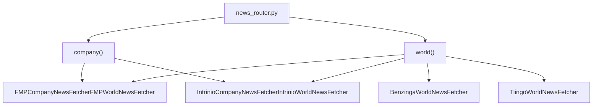
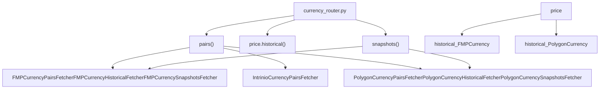
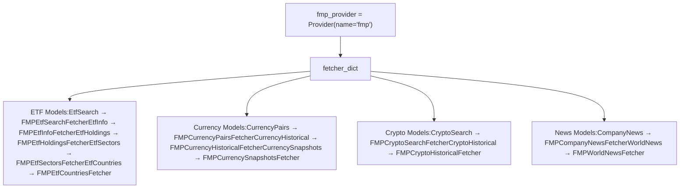
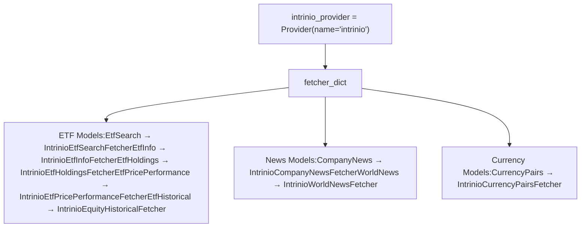
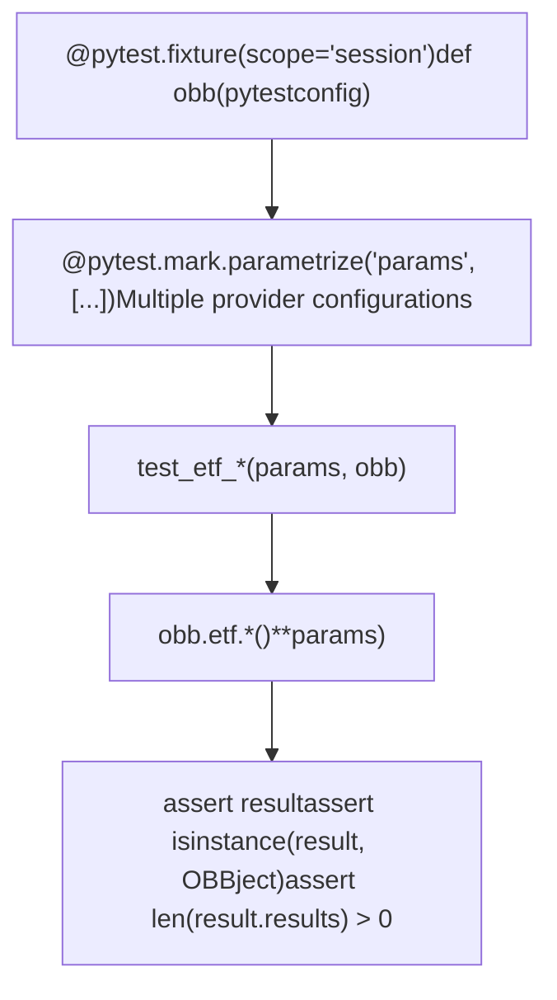

# ETF and Other Extensions

Relevant source files

-   [cli/poetry.lock](https://github.com/OpenBB-finance/OpenBB/blob/dddc3b32/cli/poetry.lock)
-   [openbb\_platform/core/openbb/assets/reference.json](https://github.com/OpenBB-finance/OpenBB/blob/dddc3b32/openbb_platform/core/openbb/assets/reference.json)
-   [openbb\_platform/core/openbb\_core/provider/standard\_models/company\_filings.py](https://github.com/OpenBB-finance/OpenBB/blob/dddc3b32/openbb_platform/core/openbb_core/provider/standard_models/company_filings.py)
-   [openbb\_platform/core/poetry.lock](https://github.com/OpenBB-finance/OpenBB/blob/dddc3b32/openbb_platform/core/poetry.lock)
-   [openbb\_platform/core/pyproject.toml](https://github.com/OpenBB-finance/OpenBB/blob/dddc3b32/openbb_platform/core/pyproject.toml)
-   [openbb\_platform/dev\_install.py](https://github.com/OpenBB-finance/OpenBB/blob/dddc3b32/openbb_platform/dev_install.py)
-   [openbb\_platform/extensions/devtools/poetry.lock](https://github.com/OpenBB-finance/OpenBB/blob/dddc3b32/openbb_platform/extensions/devtools/poetry.lock)
-   [openbb\_platform/extensions/devtools/pyproject.toml](https://github.com/OpenBB-finance/OpenBB/blob/dddc3b32/openbb_platform/extensions/devtools/pyproject.toml)
-   [openbb\_platform/extensions/equity/integration/test\_equity\_api.py](https://github.com/OpenBB-finance/OpenBB/blob/dddc3b32/openbb_platform/extensions/equity/integration/test_equity_api.py)
-   [openbb\_platform/extensions/equity/integration/test\_equity\_python.py](https://github.com/OpenBB-finance/OpenBB/blob/dddc3b32/openbb_platform/extensions/equity/integration/test_equity_python.py)
-   [openbb\_platform/extensions/equity/openbb\_equity/fundamental/fundamental\_router.py](https://github.com/OpenBB-finance/OpenBB/blob/dddc3b32/openbb_platform/extensions/equity/openbb_equity/fundamental/fundamental_router.py)
-   [openbb\_platform/extensions/etf/integration/test\_etf\_api.py](https://github.com/OpenBB-finance/OpenBB/blob/dddc3b32/openbb_platform/extensions/etf/integration/test_etf_api.py)
-   [openbb\_platform/extensions/etf/integration/test\_etf\_python.py](https://github.com/OpenBB-finance/OpenBB/blob/dddc3b32/openbb_platform/extensions/etf/integration/test_etf_python.py)
-   [openbb\_platform/poetry.lock](https://github.com/OpenBB-finance/OpenBB/blob/dddc3b32/openbb_platform/poetry.lock)
-   [openbb\_platform/providers/fmp/openbb\_fmp/\_\_init\_\_.py](https://github.com/OpenBB-finance/OpenBB/blob/dddc3b32/openbb_platform/providers/fmp/openbb_fmp/__init__.py)
-   [openbb\_platform/providers/fmp/openbb\_fmp/models/company\_filings.py](https://github.com/OpenBB-finance/OpenBB/blob/dddc3b32/openbb_platform/providers/fmp/openbb_fmp/models/company_filings.py)
-   [openbb\_platform/providers/fmp/pyproject.toml](https://github.com/OpenBB-finance/OpenBB/blob/dddc3b32/openbb_platform/providers/fmp/pyproject.toml)
-   [openbb\_platform/providers/fmp/tests/test\_fmp\_fetchers.py](https://github.com/OpenBB-finance/OpenBB/blob/dddc3b32/openbb_platform/providers/fmp/tests/test_fmp_fetchers.py)
-   [openbb\_platform/providers/intrinio/openbb\_intrinio/\_\_init\_\_.py](https://github.com/OpenBB-finance/OpenBB/blob/dddc3b32/openbb_platform/providers/intrinio/openbb_intrinio/__init__.py)
-   [openbb\_platform/providers/intrinio/openbb\_intrinio/models/company\_filings.py](https://github.com/OpenBB-finance/OpenBB/blob/dddc3b32/openbb_platform/providers/intrinio/openbb_intrinio/models/company_filings.py)
-   [openbb\_platform/providers/intrinio/tests/test\_intrinio\_fetchers.py](https://github.com/OpenBB-finance/OpenBB/blob/dddc3b32/openbb_platform/providers/intrinio/tests/test_intrinio_fetchers.py)
-   [openbb\_platform/providers/sec/openbb\_sec/\_\_init\_\_.py](https://github.com/OpenBB-finance/OpenBB/blob/dddc3b32/openbb_platform/providers/sec/openbb_sec/__init__.py)
-   [openbb\_platform/providers/sec/openbb\_sec/utils/form4.py](https://github.com/OpenBB-finance/OpenBB/blob/dddc3b32/openbb_platform/providers/sec/openbb_sec/utils/form4.py)
-   [openbb\_platform/providers/sec/tests/test\_sec\_fetchers.py](https://github.com/OpenBB-finance/OpenBB/blob/dddc3b32/openbb_platform/providers/sec/tests/test_sec_fetchers.py)
-   [openbb\_platform/providers/tmx/openbb\_tmx/models/company\_filings.py](https://github.com/OpenBB-finance/OpenBB/blob/dddc3b32/openbb_platform/providers/tmx/openbb_tmx/models/company_filings.py)
-   [openbb\_platform/providers/yfinance/poetry.lock](https://github.com/OpenBB-finance/OpenBB/blob/dddc3b32/openbb_platform/providers/yfinance/poetry.lock)
-   [openbb\_platform/pyproject.toml](https://github.com/OpenBB-finance/OpenBB/blob/dddc3b32/openbb_platform/pyproject.toml)

This document covers the ETF extension and other domain-specific extensions in the OpenBB Platform. The ETF extension provides comprehensive tools for analyzing exchange-traded funds, including holdings, sector allocations, and performance metrics. Additional extensions covered include News, Crypto, and Currency modules.

For equity analysis, see [Equity Extension](/OpenBB-finance/OpenBB/3.2-equity-extension). For economic data, see [Economy Extension](/OpenBB-finance/OpenBB/3.1-economy-extension).

## ETF Extension

The ETF extension in OpenBB Platform provides access to exchange-traded fund data through multiple providers. The extension is implemented as a router-based system that maps endpoints to provider-specific fetchers.

### ETF Router Architecture

The ETF router exposes several endpoints for accessing ETF data:

```mermaid
flowchart TD
    Router["etf_router.py"]
    search["search()"]
    info["info()"]
    sectors["sectors()"]
    countries["countries()"]
    holdings["holdings()"]
    equity_exposure["equity_exposure()"]
    price_performance["price_performance()"]
    nport_disclosure["nport_disclosure()"]
    DiscoveryRouter["discovery_router.py"]
    gainers["gainers()"]
    losers["losers()"]
    active["active()"]
    FMPEtfSearch["FMPEtfSearchFetcher"]
    FMPEtfInfo["FMPEtfInfoFetcher"]
    FMPEtfSectors["FMPEtfSectorsFetcher"]
    FMPEtfCountries["FMPEtfCountriesFetcher"]
    FMPEtfHoldings["FMPEtfHoldingsFetcher"]
    IntrinioEtfSearch["IntrinioEtfSearchFetcher"]
    IntrinioEtfInfo["IntrinioEtfInfoFetcher"]
    IntrinioEtfHoldings["IntrinioEtfHoldingsFetcher"]
    SecEtfHoldings["SecEtfHoldingsFetcher"]
    TmxEtfSearch["TmxEtfSearchFetcher"]

    Router --> search
    Router --> info
    Router --> sectors
    Router --> countries
    Router --> holdings
    Router --> equity_exposure
    Router --> price_performance
    Router --> nport_disclosure
    DiscoveryRouter --> gainers
    DiscoveryRouter --> losers
    DiscoveryRouter --> active
    Router --> DiscoveryRouter
    search --> FMPEtfSearch
    search --> IntrinioEtfSearch
    search --> TmxEtfSearch
    info --> FMPEtfInfo
    info --> IntrinioEtfInfo
    sectors --> FMPEtfSectors
    countries --> FMPEtfCountries
    holdings --> FMPEtfHoldings
    holdings --> IntrinioEtfHoldings
    holdings --> SecEtfHoldings
```


Sources: [openbb\_platform/extensions/etf/integration/test\_etf\_python.py1-459](https://github.com/OpenBB-finance/OpenBB/blob/dddc3b32/openbb_platform/extensions/etf/integration/test_etf_python.py#L1-L459) [openbb\_platform/providers/fmp/openbb\_fmp/\_\_init\_\_.py35-44](https://github.com/OpenBB-finance/OpenBB/blob/dddc3b32/openbb_platform/providers/fmp/openbb_fmp/__init__.py#L35-L44) [openbb\_platform/providers/intrinio/openbb\_intrinio/\_\_init\_\_.py14-19](https://github.com/OpenBB-finance/OpenBB/blob/dddc3b32/openbb_platform/providers/intrinio/openbb_intrinio/__init__.py#L14-L19)

### Key ETF Endpoints

The ETF extension provides the following core capabilities:

| Endpoint | Description | Primary Providers | Standard Model |
| --- | --- | --- | --- |
| `search()` | Search for ETFs by name or criteria | FMP, Intrinio, TMX | EtfSearch |
| `info()` | Get ETF metadata and characteristics | FMP, Intrinio, YFinance | EtfInfo |
| `holdings()` | Retrieve ETF portfolio holdings | FMP, SEC, Intrinio, TMX | EtfHoldings |
| `sectors()` | Get sector allocation breakdown | FMP, TMX | EtfSectors |
| `countries()` | Get country exposure breakdown | FMP, TMX | EtfCountries |
| `equity_exposure()` | Find which ETFs hold a specific stock | FMP | EtfEquityExposure |
| `price_performance()` | Get performance metrics | FMP, Intrinio, Finviz | EtfPricePerformance |
| `nport_disclosure()` | Access N-PORT regulatory filings | FMP, SEC | NportDisclosure |

Sources: [openbb\_platform/extensions/etf/integration/test\_etf\_python.py42-458](https://github.com/OpenBB-finance/OpenBB/blob/dddc3b32/openbb_platform/extensions/etf/integration/test_etf_python.py#L42-L458)

### ETF Holdings Data Flow

The holdings endpoint retrieves portfolio composition data from multiple providers. Each provider implements the `EtfHoldings` standard model with provider-specific extensions:

Sources: [openbb\_platform/extensions/etf/integration/test\_etf\_python.py343-353](https://github.com/OpenBB-finance/OpenBB/blob/dddc3b32/openbb_platform/extensions/etf/integration/test_etf_python.py#L343-L353) [openbb\_platform/providers/fmp/tests/test\_fmp\_fetchers.py594-600](https://github.com/OpenBB-finance/OpenBB/blob/dddc3b32/openbb_platform/providers/fmp/tests/test_fmp_fetchers.py#L594-L600) [openbb\_platform/providers/intrinio/tests/test\_intrinio\_fetchers.py446-453](https://github.com/OpenBB-finance/OpenBB/blob/dddc3b32/openbb_platform/providers/intrinio/tests/test_intrinio_fetchers.py#L446-L453)

### ETF Provider Comparison

Different providers offer varying levels of detail for ETF data:

| Feature | FMP | Intrinio | SEC | TMX | YFinance |
| --- | --- | --- | --- | --- | --- |
| Search | ✓ | ✓ | \- | ✓ | \- |
| Info | ✓ | ✓ | \- | ✓ | ✓ |
| Holdings | ✓ | ✓ | ✓ | ✓ | \- |
| Sectors | ✓ | \- | \- | ✓ | \- |
| Countries | ✓ | \- | \- | ✓ | \- |
| Historical Prices | ✓ | ✓ | \- | ✓ | ✓ |
| N-PORT Filings | ✓ | \- | ✓ | \- | \- |

Sources: [openbb\_platform/extensions/etf/integration/test\_etf\_python.py20-458](https://github.com/OpenBB-finance/OpenBB/blob/dddc3b32/openbb_platform/extensions/etf/integration/test_etf_python.py#L20-L458) [openbb\_platform/providers/fmp/openbb\_fmp/\_\_init\_\_.py110-116](https://github.com/OpenBB-finance/OpenBB/blob/dddc3b32/openbb_platform/providers/fmp/openbb_fmp/__init__.py#L110-L116) [openbb\_platform/providers/intrinio/openbb\_intrinio/\_\_init\_\_.py84-87](https://github.com/OpenBB-finance/OpenBB/blob/dddc3b32/openbb_platform/providers/intrinio/openbb_intrinio/__init__.py#L84-L87)

## News Extension

The News extension provides access to company and market news from multiple providers. It supports filtering by symbol, topics, and date ranges.

### News Router Structure


The news endpoints use the `CompanyNews` and `WorldNews` standard models. Each provider implements fetchers that normalize news data into a consistent format with fields like `date`, `title`, `text`, `url`, and `symbols`.

Sources: [openbb\_platform/providers/fmp/tests/test\_fmp\_fetchers.py179-186](https://github.com/OpenBB-finance/OpenBB/blob/dddc3b32/openbb_platform/providers/fmp/tests/test_fmp_fetchers.py#L179-L186) [openbb\_platform/providers/intrinio/tests/test\_intrinio\_fetchers.py128-141](https://github.com/OpenBB-finance/OpenBB/blob/dddc3b32/openbb_platform/providers/intrinio/tests/test_intrinio_fetchers.py#L128-L141)

## Crypto Extension

The Crypto extension provides cryptocurrency market data, including historical prices and search capabilities.

### Crypto Endpoints

| Endpoint | Description | Providers | Standard Model |
| --- | --- | --- | --- |
| `search()` | Search for cryptocurrencies | FMP | CryptoSearch |
| `price.historical()` | Get historical crypto prices | FMP, Polygon, YFinance | CryptoHistorical |

The crypto extension reuses the historical price infrastructure from equity data but with crypto-specific symbol formatting and data sources.

Sources: [openbb\_platform/providers/fmp/tests/test\_fmp\_fetchers.py122-133](https://github.com/OpenBB-finance/OpenBB/blob/dddc3b32/openbb_platform/providers/fmp/tests/test_fmp_fetchers.py#L122-L133) [openbb\_platform/providers/fmp/openbb\_fmp/\_\_init\_\_.py18-22](https://github.com/OpenBB-finance/OpenBB/blob/dddc3b32/openbb_platform/providers/fmp/openbb_fmp/__init__.py#L18-L22)

## Currency Extension

The Currency extension provides foreign exchange data, including currency pairs, historical rates, and snapshots.

### Currency Router Structure


Currency data uses standard models like `CurrencyPairs`, `CurrencyHistorical`, and `CurrencySnapshots`. Providers normalize FX rates into consistent formats with base/quote currency pairs.

Sources: [openbb\_platform/providers/fmp/tests/test\_fmp\_fetchers.py136-147](https://github.com/OpenBB-finance/OpenBB/blob/dddc3b32/openbb_platform/providers/fmp/tests/test_fmp_fetchers.py#L136-L147) [openbb\_platform/providers/fmp/openbb\_fmp/\_\_init\_\_.py20-26](https://github.com/OpenBB-finance/OpenBB/blob/dddc3b32/openbb_platform/providers/fmp/openbb_fmp/__init__.py#L20-L26) [openbb\_platform/providers/intrinio/tests/test\_intrinio\_fetchers.py118-125](https://github.com/OpenBB-finance/OpenBB/blob/dddc3b32/openbb_platform/providers/intrinio/tests/test_intrinio_fetchers.py#L118-L125)

## Other Extensions

### Index Extension

The Index extension provides access to market indices data, including historical prices and constituents.

**Key Endpoints:**

-   `price.historical()` - Historical index prices
-   `constituents()` - Index constituent members
-   `available()` - List available indices

**Providers:** FMP, Intrinio, Polygon, Cboe, YFinance

Sources: [openbb\_platform/providers/fmp/tests/test\_fmp\_fetchers.py150-161](https://github.com/OpenBB-finance/OpenBB/blob/dddc3b32/openbb_platform/providers/fmp/tests/test_fmp_fetchers.py#L150-L161) [openbb\_platform/providers/intrinio/tests/test\_intrinio\_fetchers.py303-314](https://github.com/OpenBB-finance/OpenBB/blob/dddc3b32/openbb_platform/providers/intrinio/tests/test_intrinio_fetchers.py#L303-L314)

### Derivatives Extension

The Derivatives extension covers options and futures data.

**Options Endpoints:**

-   `options.chains()` - Full options chains
-   `options.unusual()` - Unusual options activity
-   `options.snapshots()` - Market-wide options snapshots

**Providers:** Intrinio, CBOE, Tradier

Sources: [openbb\_platform/providers/intrinio/tests/test\_intrinio\_fetchers.py169-193](https://github.com/OpenBB-finance/OpenBB/blob/dddc3b32/openbb_platform/providers/intrinio/tests/test_intrinio_fetchers.py#L169-L193)

### Regulators Extension

The Regulators extension provides access to SEC filings and regulatory data. This includes company filings, insider trading reports, and institutional ownership data.

**Key Fetchers:**

-   `SecCompanyFilingsFetcher` - SEC company filings
-   `SecInsiderTradingFetcher` - Form 4 insider trades
-   `SecForm13FHRFetcher` - Institutional holdings
-   `SecEtfHoldingsFetcher` - ETF holdings from N-PORT

Sources: [openbb\_platform/providers/sec/openbb\_sec/utils/form4.py1-548](https://github.com/OpenBB-finance/OpenBB/blob/dddc3b32/openbb_platform/providers/sec/openbb_sec/utils/form4.py#L1-L548) [openbb\_platform/providers/fmp/openbb\_fmp/models/company\_filings.py1-130](https://github.com/OpenBB-finance/OpenBB/blob/dddc3b32/openbb_platform/providers/fmp/openbb_fmp/models/company_filings.py#L1-L130) [openbb\_platform/providers/intrinio/openbb\_intrinio/models/company\_filings.py1-174](https://github.com/OpenBB-finance/OpenBB/blob/dddc3b32/openbb_platform/providers/intrinio/openbb_intrinio/models/company_filings.py#L1-L174) [openbb\_platform/providers/tmx/openbb\_tmx/models/company\_filings.py1-185](https://github.com/OpenBB-finance/OpenBB/blob/dddc3b32/openbb_platform/providers/tmx/openbb_tmx/models/company_filings.py#L1-L185)

## Extension Provider Registration

Extensions register their provider implementations through the `fetcher_dict` in each provider's `__init__.py`. This mapping connects standard model names to provider-specific fetcher classes.

### FMP Provider Registration

FMP registers fetchers for multiple extensions:


Sources: [openbb\_platform/providers/fmp/openbb\_fmp/\_\_init\_\_.py72-148](https://github.com/OpenBB-finance/OpenBB/blob/dddc3b32/openbb_platform/providers/fmp/openbb_fmp/__init__.py#L72-L148)

### Intrinio Provider Registration


Sources: [openbb\_platform/providers/intrinio/openbb\_intrinio/\_\_init\_\_.py66-116](https://github.com/OpenBB-finance/OpenBB/blob/dddc3b32/openbb_platform/providers/intrinio/openbb_intrinio/__init__.py#L66-L116)

## Standard Models and Provider Implementations

Each extension uses standard models that define the interface for data retrieval. Providers implement fetchers that conform to these models.

### Standard Model to Fetcher Mapping

```mermaid
flowchart TD
    EtfSearch["EtfSearch"]
    EtfInfo["EtfInfo"]
    EtfHoldings["EtfHoldings"]
    CompanyFilings["CompanyFilings"]
    CurrencyPairs["CurrencyPairs"]
    FMPEtfSearch["FMPEtfSearchFetcher"]
    IntrinioEtfSearch["IntrinioEtfSearchFetcher"]
    FMPEtfInfo["FMPEtfInfoFetcher"]
    FMPEtfHoldings["FMPEtfHoldingsFetcher"]
    SecEtfHoldings["SecEtfHoldingsFetcher"]
    FMPFilings["FMPCompanyFilingsFetcher"]
    SecFilings["SecCompanyFilingsFetcher"]
    IntrinioFilings["IntrinioCompanyFilingsFetcher"]
    TmxFilings["TmxCompanyFilingsFetcher"]
    FMPCurrency["FMPCurrencyPairsFetcher"]
    IntrinioCurrency["IntrinioCurrencyPairsFetcher"]

    EtfSearch --> FMPEtfSearch
    EtfSearch --> IntrinioEtfSearch
    EtfInfo --> FMPEtfInfo
    EtfHoldings --> FMPEtfHoldings
    EtfHoldings --> SecEtfHoldings
    CompanyFilings --> FMPFilings
    CompanyFilings --> SecFilings
    CompanyFilings --> IntrinioFilings
    CompanyFilings --> TmxFilings
    CurrencyPairs --> FMPCurrency
    CurrencyPairs --> IntrinioCurrency
```


Sources: [openbb\_platform/core/openbb\_core/provider/standard\_models/company\_filings.py1-44](https://github.com/OpenBB-finance/OpenBB/blob/dddc3b32/openbb_platform/core/openbb_core/provider/standard_models/company_filings.py#L1-L44) [openbb\_platform/providers/fmp/openbb\_fmp/models/company\_filings.py1-130](https://github.com/OpenBB-finance/OpenBB/blob/dddc3b32/openbb_platform/providers/fmp/openbb_fmp/models/company_filings.py#L1-L130) [openbb\_platform/providers/intrinio/openbb\_intrinio/models/company\_filings.py1-174](https://github.com/OpenBB-finance/OpenBB/blob/dddc3b32/openbb_platform/providers/intrinio/openbb_intrinio/models/company_filings.py#L1-L174) [openbb\_platform/providers/tmx/openbb\_tmx/models/company\_filings.py1-185](https://github.com/OpenBB-finance/OpenBB/blob/dddc3b32/openbb_platform/providers/tmx/openbb_tmx/models/company_filings.py#L1-L185)

### Fetcher Lifecycle

All fetchers follow the three-stage lifecycle defined by the provider architecture:

1.  **transform\_query()** - Validate and transform query parameters
2.  **aextract\_data()** - Async HTTP request to external API
3.  **transform\_data()** - Parse and validate response with Pydantic models

This pattern is consistent across all extensions and providers, ensuring a uniform interface for data retrieval.

Sources: [openbb\_platform/extensions/equity/integration/test\_equity\_python.py1-50](https://github.com/OpenBB-finance/OpenBB/blob/dddc3b32/openbb_platform/extensions/equity/integration/test_equity_python.py#L1-L50) [openbb\_platform/extensions/etf/integration/test\_etf\_python.py1-50](https://github.com/OpenBB-finance/OpenBB/blob/dddc3b32/openbb_platform/extensions/etf/integration/test_etf_python.py#L1-L50)

## Integration Testing

Extension integration tests validate the complete data flow from API call to returned data. Tests cover both Python SDK and REST API interfaces.

### ETF Integration Test Structure


Integration tests use parameterization to test multiple providers with different query parameters. Each test validates the OBBject response structure and ensures data is returned.

Sources: [openbb\_platform/extensions/etf/integration/test\_etf\_python.py7-50](https://github.com/OpenBB-finance/OpenBB/blob/dddc3b32/openbb_platform/extensions/etf/integration/test_etf_python.py#L7-L50) [openbb\_platform/extensions/etf/integration/test\_etf\_api.py11-56](https://github.com/OpenBB-finance/OpenBB/blob/dddc3b32/openbb_platform/extensions/etf/integration/test_etf_api.py#L11-L56)

### Provider-Specific Tests

Provider tests use VCR (video cassette recorder) to record HTTP interactions for deterministic testing:

```
@pytest.mark.record_httpdef test_intrinio_etf_holdings_fetcher(credentials=test_credentials):    params = {"symbol": "DJIA"}    fetcher = IntrinioEtfHoldingsFetcher()    result = fetcher.test(params, credentials)    assert result is None
```
VCR configuration filters sensitive data like API keys before recording:

```
@pytest.fixture(scope="module")def vcr_config():    return {        "filter_headers": [("User-Agent", None)],        "filter_query_parameters": [("api_key", "MOCK_API_KEY")],    }
```
Sources: [openbb\_platform/providers/intrinio/tests/test\_intrinio\_fetchers.py75-99](https://github.com/OpenBB-finance/OpenBB/blob/dddc3b32/openbb_platform/providers/intrinio/tests/test_intrinio_fetchers.py#L75-L99) [openbb\_platform/providers/intrinio/tests/test\_intrinio\_fetchers.py446-453](https://github.com/OpenBB-finance/OpenBB/blob/dddc3b32/openbb_platform/providers/intrinio/tests/test_intrinio_fetchers.py#L446-L453) [openbb\_platform/providers/fmp/tests/test\_fmp\_fetchers.py83-103](https://github.com/OpenBB-finance/OpenBB/blob/dddc3b32/openbb_platform/providers/fmp/tests/test_fmp_fetchers.py#L83-L103)

## Summary

The ETF and Regulatory Data systems in OpenBB provide powerful tools for analyzing exchange-traded funds and related regulatory information. Through integration of market data and regulatory filings, users can gain comprehensive insights into ETF composition, performance, and compliance aspects. The modular provider architecture allows for flexibility in data sources while maintaining a consistent API for accessing this information.

The integration between ETFs and regulatory data is particularly valuable for institutional investors, compliance officers, and researchers who need to understand both the market and regulatory dimensions of these investment vehicles.

Sources: [openbb\_platform/openbb/package/etf.py1-744](https://github.com/OpenBB-finance/OpenBB/blob/dddc3b32/openbb_platform/openbb/package/etf.py#L1-L744) [openbb\_platform/openbb/package/regulators\_sec.py1-303](https://github.com/OpenBB-finance/OpenBB/blob/dddc3b32/openbb_platform/openbb/package/regulators_sec.py#L1-L303) [openbb\_platform/providers/sec/openbb\_sec/\_\_init\_\_.py1-51](https://github.com/OpenBB-finance/OpenBB/blob/dddc3b32/openbb_platform/providers/sec/openbb_sec/__init__.py#L1-L51)
