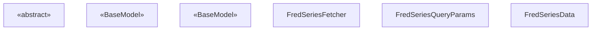
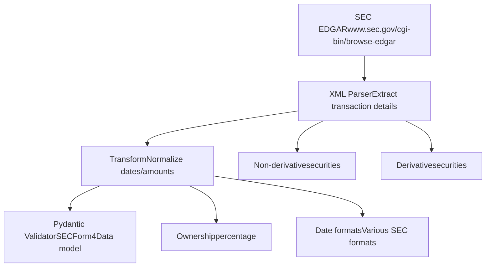
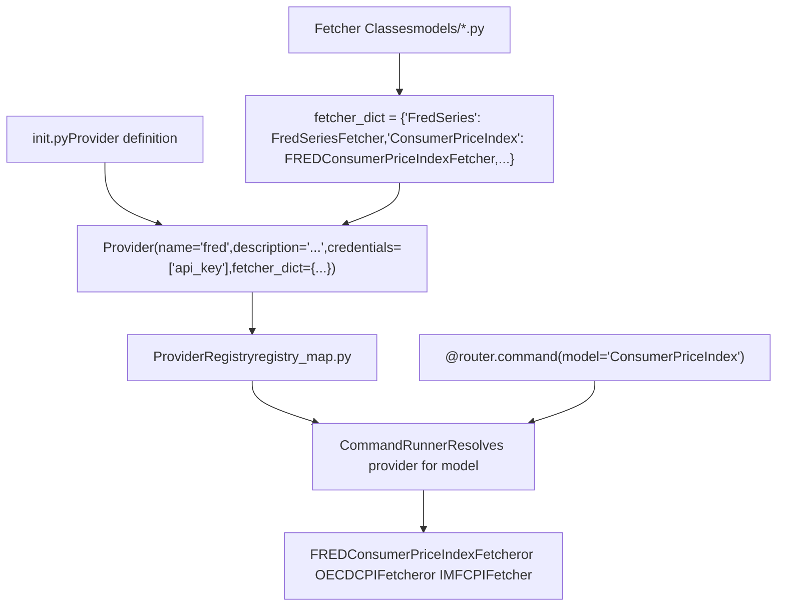

# Data Providers

Relevant source files

-   [cli/tests/test\_argparse\_translator\_obbject\_registry.py](https://github.com/OpenBB-finance/OpenBB/blob/dddc3b32/cli/tests/test_argparse_translator_obbject_registry.py)
-   [openbb\_platform/core/openbb\_core/api/app\_loader.py](https://github.com/OpenBB-finance/OpenBB/blob/dddc3b32/openbb_platform/core/openbb_core/api/app_loader.py)
-   [openbb\_platform/core/openbb\_core/api/exception\_handlers.py](https://github.com/OpenBB-finance/OpenBB/blob/dddc3b32/openbb_platform/core/openbb_core/api/exception_handlers.py)
-   [openbb\_platform/core/openbb\_core/api/rest\_api.py](https://github.com/OpenBB-finance/OpenBB/blob/dddc3b32/openbb_platform/core/openbb_core/api/rest_api.py)
-   [openbb\_platform/core/openbb\_core/api/router/coverage.py](https://github.com/OpenBB-finance/OpenBB/blob/dddc3b32/openbb_platform/core/openbb_core/api/router/coverage.py)
-   [openbb\_platform/core/openbb\_core/app/model/charts/chart.py](https://github.com/OpenBB-finance/OpenBB/blob/dddc3b32/openbb_platform/core/openbb_core/app/model/charts/chart.py)
-   [openbb\_platform/core/openbb\_core/app/provider\_interface.py](https://github.com/OpenBB-finance/OpenBB/blob/dddc3b32/openbb_platform/core/openbb_core/app/provider_interface.py)
-   [openbb\_platform/core/openbb\_core/app/router.py](https://github.com/OpenBB-finance/OpenBB/blob/dddc3b32/openbb_platform/core/openbb_core/app/router.py)
-   [openbb\_platform/core/openbb\_core/app/static/package\_builder.py](https://github.com/OpenBB-finance/OpenBB/blob/dddc3b32/openbb_platform/core/openbb_core/app/static/package_builder.py)
-   [openbb\_platform/core/openbb\_core/app/static/utils/filters.py](https://github.com/OpenBB-finance/OpenBB/blob/dddc3b32/openbb_platform/core/openbb_core/app/static/utils/filters.py)
-   [openbb\_platform/core/openbb\_core/app/utils.py](https://github.com/OpenBB-finance/OpenBB/blob/dddc3b32/openbb_platform/core/openbb_core/app/utils.py)
-   [openbb\_platform/core/openbb\_core/provider/registry\_map.py](https://github.com/OpenBB-finance/OpenBB/blob/dddc3b32/openbb_platform/core/openbb_core/provider/registry_map.py)
-   [openbb\_platform/core/openbb\_core/provider/standard\_models/company\_filings.py](https://github.com/OpenBB-finance/OpenBB/blob/dddc3b32/openbb_platform/core/openbb_core/provider/standard_models/company_filings.py)
-   [openbb\_platform/core/openbb\_core/provider/standard\_models/fred\_release\_table.py](https://github.com/OpenBB-finance/OpenBB/blob/dddc3b32/openbb_platform/core/openbb_core/provider/standard_models/fred_release_table.py)
-   [openbb\_platform/core/openbb\_core/provider/standard\_models/futures\_curve.py](https://github.com/OpenBB-finance/OpenBB/blob/dddc3b32/openbb_platform/core/openbb_core/provider/standard_models/futures_curve.py)
-   [openbb\_platform/core/openbb\_core/provider/standard\_models/primary\_dealer\_fails.py](https://github.com/OpenBB-finance/OpenBB/blob/dddc3b32/openbb_platform/core/openbb_core/provider/standard_models/primary_dealer_fails.py)
-   [openbb\_platform/core/openbb\_core/provider/standard\_models/yield\_curve.py](https://github.com/OpenBB-finance/OpenBB/blob/dddc3b32/openbb_platform/core/openbb_core/provider/standard_models/yield_curve.py)
-   [openbb\_platform/core/tests/app/model/charts/test\_chart.py](https://github.com/OpenBB-finance/OpenBB/blob/dddc3b32/openbb_platform/core/tests/app/model/charts/test_chart.py)
-   [openbb\_platform/core/tests/app/static/test\_filters.py](https://github.com/OpenBB-finance/OpenBB/blob/dddc3b32/openbb_platform/core/tests/app/static/test_filters.py)
-   [openbb\_platform/core/tests/app/static/test\_package\_builder.py](https://github.com/OpenBB-finance/OpenBB/blob/dddc3b32/openbb_platform/core/tests/app/static/test_package_builder.py)
-   [openbb\_platform/core/tests/app/test\_platform\_router.py](https://github.com/OpenBB-finance/OpenBB/blob/dddc3b32/openbb_platform/core/tests/app/test_platform_router.py)
-   [openbb\_platform/core/tests/app/test\_provider\_interface.py](https://github.com/OpenBB-finance/OpenBB/blob/dddc3b32/openbb_platform/core/tests/app/test_provider_interface.py)
-   [openbb\_platform/extensions/economy/integration/test\_economy\_api.py](https://github.com/OpenBB-finance/OpenBB/blob/dddc3b32/openbb_platform/extensions/economy/integration/test_economy_api.py)
-   [openbb\_platform/extensions/economy/integration/test\_economy\_python.py](https://github.com/OpenBB-finance/OpenBB/blob/dddc3b32/openbb_platform/extensions/economy/integration/test_economy_python.py)
-   [openbb\_platform/extensions/economy/openbb\_economy/economy\_router.py](https://github.com/OpenBB-finance/OpenBB/blob/dddc3b32/openbb_platform/extensions/economy/openbb_economy/economy_router.py)
-   [openbb\_platform/extensions/economy/openbb\_economy/survey/survey\_router.py](https://github.com/OpenBB-finance/OpenBB/blob/dddc3b32/openbb_platform/extensions/economy/openbb_economy/survey/survey_router.py)
-   [openbb\_platform/extensions/equity/integration/test\_equity\_api.py](https://github.com/OpenBB-finance/OpenBB/blob/dddc3b32/openbb_platform/extensions/equity/integration/test_equity_api.py)
-   [openbb\_platform/extensions/equity/integration/test\_equity\_python.py](https://github.com/OpenBB-finance/OpenBB/blob/dddc3b32/openbb_platform/extensions/equity/integration/test_equity_python.py)
-   [openbb\_platform/extensions/equity/openbb\_equity/fundamental/fundamental\_router.py](https://github.com/OpenBB-finance/OpenBB/blob/dddc3b32/openbb_platform/extensions/equity/openbb_equity/fundamental/fundamental_router.py)
-   [openbb\_platform/extensions/etf/integration/test\_etf\_api.py](https://github.com/OpenBB-finance/OpenBB/blob/dddc3b32/openbb_platform/extensions/etf/integration/test_etf_api.py)
-   [openbb\_platform/extensions/etf/integration/test\_etf\_python.py](https://github.com/OpenBB-finance/OpenBB/blob/dddc3b32/openbb_platform/extensions/etf/integration/test_etf_python.py)
-   [openbb\_platform/extensions/platform\_api/openbb\_platform\_api/assets/default\_apps.json](https://github.com/OpenBB-finance/OpenBB/blob/dddc3b32/openbb_platform/extensions/platform_api/openbb_platform_api/assets/default_apps.json)
-   [openbb\_platform/extensions/tests/test\_integration\_tests\_api.py](https://github.com/OpenBB-finance/OpenBB/blob/dddc3b32/openbb_platform/extensions/tests/test_integration_tests_api.py)
-   [openbb\_platform/extensions/tests/test\_integration\_tests\_python.py](https://github.com/OpenBB-finance/OpenBB/blob/dddc3b32/openbb_platform/extensions/tests/test_integration_tests_python.py)
-   [openbb\_platform/extensions/tests/utils/integration\_tests\_api\_generator.py](https://github.com/OpenBB-finance/OpenBB/blob/dddc3b32/openbb_platform/extensions/tests/utils/integration_tests_api_generator.py)
-   [openbb\_platform/extensions/tests/utils/integration\_tests\_testers.py](https://github.com/OpenBB-finance/OpenBB/blob/dddc3b32/openbb_platform/extensions/tests/utils/integration_tests_testers.py)
-   [openbb\_platform/obbject\_extensions/charting/tests/test\_charting.py](https://github.com/OpenBB-finance/OpenBB/blob/dddc3b32/openbb_platform/obbject_extensions/charting/tests/test_charting.py)
-   [openbb\_platform/providers/bls/openbb\_bls/utils/helpers.py](https://github.com/OpenBB-finance/OpenBB/blob/dddc3b32/openbb_platform/providers/bls/openbb_bls/utils/helpers.py)
-   [openbb\_platform/providers/cboe/openbb\_cboe/models/futures\_curve.py](https://github.com/OpenBB-finance/OpenBB/blob/dddc3b32/openbb_platform/providers/cboe/openbb_cboe/models/futures_curve.py)
-   [openbb\_platform/providers/cboe/tests/test\_cboe\_fetchers.py](https://github.com/OpenBB-finance/OpenBB/blob/dddc3b32/openbb_platform/providers/cboe/tests/test_cboe_fetchers.py)
-   [openbb\_platform/providers/federal\_reserve/openbb\_federal\_reserve/\_\_init\_\_.py](https://github.com/OpenBB-finance/OpenBB/blob/dddc3b32/openbb_platform/providers/federal_reserve/openbb_federal_reserve/__init__.py)
-   [openbb\_platform/providers/federal\_reserve/openbb\_federal\_reserve/assets/historical\_releases.json](https://github.com/OpenBB-finance/OpenBB/blob/dddc3b32/openbb_platform/providers/federal_reserve/openbb_federal_reserve/assets/historical_releases.json)
-   [openbb\_platform/providers/federal\_reserve/openbb\_federal\_reserve/models/fomc\_documents.py](https://github.com/OpenBB-finance/OpenBB/blob/dddc3b32/openbb_platform/providers/federal_reserve/openbb_federal_reserve/models/fomc_documents.py)
-   [openbb\_platform/providers/federal\_reserve/openbb\_federal\_reserve/models/primary\_dealer\_fails.py](https://github.com/OpenBB-finance/OpenBB/blob/dddc3b32/openbb_platform/providers/federal_reserve/openbb_federal_reserve/models/primary_dealer_fails.py)
-   [openbb\_platform/providers/federal\_reserve/openbb\_federal\_reserve/models/primary\_dealer\_positioning.py](https://github.com/OpenBB-finance/OpenBB/blob/dddc3b32/openbb_platform/providers/federal_reserve/openbb_federal_reserve/models/primary_dealer_positioning.py)
-   [openbb\_platform/providers/federal\_reserve/openbb\_federal\_reserve/utils/fomc\_documents.py](https://github.com/OpenBB-finance/OpenBB/blob/dddc3b32/openbb_platform/providers/federal_reserve/openbb_federal_reserve/utils/fomc_documents.py)
-   [openbb\_platform/providers/federal\_reserve/openbb\_federal\_reserve/utils/primary\_dealer\_statistics.py](https://github.com/OpenBB-finance/OpenBB/blob/dddc3b32/openbb_platform/providers/federal_reserve/openbb_federal_reserve/utils/primary_dealer_statistics.py)
-   [openbb\_platform/providers/federal\_reserve/tests/record/http/test\_federal\_reserve\_fetchers/test\_federal\_reserve\_fomc\_documents\_fetcher\_urllib3\_v2.yaml](https://github.com/OpenBB-finance/OpenBB/blob/dddc3b32/openbb_platform/providers/federal_reserve/tests/record/http/test_federal_reserve_fetchers/test_federal_reserve_fomc_documents_fetcher_urllib3_v2.yaml)
-   [openbb\_platform/providers/federal\_reserve/tests/record/http/test\_federal\_reserve\_fetchers/test\_federal\_reserve\_primary\_dealer\_fails\_fetcher\_urllib3\_v2.yaml](https://github.com/OpenBB-finance/OpenBB/blob/dddc3b32/openbb_platform/providers/federal_reserve/tests/record/http/test_federal_reserve_fetchers/test_federal_reserve_primary_dealer_fails_fetcher_urllib3_v2.yaml)
-   [openbb\_platform/providers/federal\_reserve/tests/test\_federal\_reserve\_fetchers.py](https://github.com/OpenBB-finance/OpenBB/blob/dddc3b32/openbb_platform/providers/federal_reserve/tests/test_federal_reserve_fetchers.py)
-   [openbb\_platform/providers/fmp/openbb\_fmp/\_\_init\_\_.py](https://github.com/OpenBB-finance/OpenBB/blob/dddc3b32/openbb_platform/providers/fmp/openbb_fmp/__init__.py)
-   [openbb\_platform/providers/fmp/openbb\_fmp/models/company\_filings.py](https://github.com/OpenBB-finance/OpenBB/blob/dddc3b32/openbb_platform/providers/fmp/openbb_fmp/models/company_filings.py)
-   [openbb\_platform/providers/fmp/pyproject.toml](https://github.com/OpenBB-finance/OpenBB/blob/dddc3b32/openbb_platform/providers/fmp/pyproject.toml)
-   [openbb\_platform/providers/fmp/tests/test\_fmp\_fetchers.py](https://github.com/OpenBB-finance/OpenBB/blob/dddc3b32/openbb_platform/providers/fmp/tests/test_fmp_fetchers.py)
-   [openbb\_platform/providers/fred/openbb\_fred/\_\_init\_\_.py](https://github.com/OpenBB-finance/OpenBB/blob/dddc3b32/openbb_platform/providers/fred/openbb_fred/__init__.py)
-   [openbb\_platform/providers/fred/openbb\_fred/models/manufacturing\_outlook\_ny.py](https://github.com/OpenBB-finance/OpenBB/blob/dddc3b32/openbb_platform/providers/fred/openbb_fred/models/manufacturing_outlook_ny.py)
-   [openbb\_platform/providers/fred/openbb\_fred/models/release\_table.py](https://github.com/OpenBB-finance/OpenBB/blob/dddc3b32/openbb_platform/providers/fred/openbb_fred/models/release_table.py)
-   [openbb\_platform/providers/fred/tests/record/http/test\_fred\_fetchers/test\_fred\_manufacturing\_outlook\_ny\_fetcher\_urllib3\_v2.yaml](https://github.com/OpenBB-finance/OpenBB/blob/dddc3b32/openbb_platform/providers/fred/tests/record/http/test_fred_fetchers/test_fred_manufacturing_outlook_ny_fetcher_urllib3_v2.yaml)
-   [openbb\_platform/providers/fred/tests/test\_fred\_fetchers.py](https://github.com/OpenBB-finance/OpenBB/blob/dddc3b32/openbb_platform/providers/fred/tests/test_fred_fetchers.py)
-   [openbb\_platform/providers/intrinio/openbb\_intrinio/\_\_init\_\_.py](https://github.com/OpenBB-finance/OpenBB/blob/dddc3b32/openbb_platform/providers/intrinio/openbb_intrinio/__init__.py)
-   [openbb\_platform/providers/intrinio/openbb\_intrinio/models/company\_filings.py](https://github.com/OpenBB-finance/OpenBB/blob/dddc3b32/openbb_platform/providers/intrinio/openbb_intrinio/models/company_filings.py)
-   [openbb\_platform/providers/intrinio/tests/test\_intrinio\_fetchers.py](https://github.com/OpenBB-finance/OpenBB/blob/dddc3b32/openbb_platform/providers/intrinio/tests/test_intrinio_fetchers.py)
-   [openbb\_platform/providers/sec/openbb\_sec/\_\_init\_\_.py](https://github.com/OpenBB-finance/OpenBB/blob/dddc3b32/openbb_platform/providers/sec/openbb_sec/__init__.py)
-   [openbb\_platform/providers/sec/openbb\_sec/utils/form4.py](https://github.com/OpenBB-finance/OpenBB/blob/dddc3b32/openbb_platform/providers/sec/openbb_sec/utils/form4.py)
-   [openbb\_platform/providers/sec/tests/test\_sec\_fetchers.py](https://github.com/OpenBB-finance/OpenBB/blob/dddc3b32/openbb_platform/providers/sec/tests/test_sec_fetchers.py)
-   [openbb\_platform/providers/tmx/openbb\_tmx/models/company\_filings.py](https://github.com/OpenBB-finance/OpenBB/blob/dddc3b32/openbb_platform/providers/tmx/openbb_tmx/models/company_filings.py)

This page documents the data provider system in the OpenBB Platform. Data providers are pluggable modules that implement fetchers to retrieve financial and economic data from external APIs. The platform includes 25+ providers covering sources like FRED, Financial Modeling Prep (FMP), Yahoo Finance, OECD, Intrinio, and others. Each provider implements a standardized fetcher pattern while handling API-specific authentication, rate limiting, and data transformation.

For information about how providers are consumed through extensions, see [Data Extensions](/OpenBB-finance/OpenBB/3-data-extensions). For details on the provider registration mechanism and abstract base classes, see [Provider Architecture](/OpenBB-finance/OpenBB/2.3-provider-architecture).

## Provider Ecosystem

The OpenBB Platform organizes providers into functional categories based on the type of data they supply. Providers are independent packages that can be installed separately or as part of the main `openbb` aggregator package.

### Provider Categories

```mermaid
flowchart TD
    Finra["finraTrade Reporting"]
    Finviz["finvizStock Screener"]
    WSJ["wsjWall Street Journal"]
    TMX["tmxToronto Stock Exchange"]
    ECB["ecbEuropean Central Bank"]
    FRED["fredFederal Reserve Economic Data42 fetchers"]
    OECD["oecdOrganisation for Economic Co-operation10 fetchers"]
    EconDB["econdbGlobal Economic Indicators4 fetchers"]
    FedReserve["federal_reserveFederal Reserve System4 fetchers"]
    IMF["imfInternational Monetary FundSDMX API"]
    BLS["blsBureau of Labor Statistics"]
    TradingEcon["tradingeconomicsEconomic Calendar & Indicators"]
    FMP["fmpFinancial Modeling Prep60+ fetchers"]
    Intrinio["intrinioCompany Filings & Fundamentals15 fetchers"]
    Polygon["polygonMarket Data & Aggregates"]
    Tiingo["tiingoStock Prices & News"]
    Benzinga["benzingaNews & Analyst Ratings"]
    YFinance["yfinanceYahoo Finance30+ fetchers"]
    AlphaVantage["alpha_vantageTechnical Indicators"]
    Cboe["cboeOptions Data"]
    Nasdaq["nasdaqMarket Statistics"]
    SEC["secSEC EDGAR FilingsForm 4 Processing"]
    CongressGov["congress_govCongressional Trading"]
    GovUS["government_usTreasury Data"]
    CFTC["cftcCommodity Futures Trading"]
    Registry["Provider Registryfetcher_dict"]
    StdModels["Standard ModelsQueryParams + Data"]

    FRED --> Registry
    OECD --> Registry
    EconDB --> Registry
    FMP --> Registry
    Intrinio --> Registry
    YFinance --> Registry
    SEC --> Registry
    Registry --> StdModels
```


**Provider Distribution by Category**

| Category | Providers | Primary Use Cases |
| --- | --- | --- |
| Economic Data | FRED, OECD, EconDB, Federal Reserve, IMF, BLS, TradingEconomics | GDP, CPI, unemployment, interest rates, economic indicators |
| Financial Data | FMP, Intrinio, Polygon, Tiingo, Benzinga | Fundamentals, company filings, analyst ratings, news |
| Market Data | YFinance, AlphaVantage, Cboe, Nasdaq | Historical prices, options chains, market statistics, screeners |
| Regulatory & Government | SEC, Congress Gov, Government US, CFTC | SEC filings, congressional trades, treasury data, commodity futures |
| Specialized | Finra, Finviz, WSJ, TMX, ECB | Trade reporting, stock screening, news, regional exchanges |

Sources: [openbb\_platform/pyproject.toml1-119](https://github.com/OpenBB-finance/OpenBB/blob/dddc3b32/openbb_platform/pyproject.toml#L1-L119) [openbb\_platform/providers/fred/openbb\_fred/\_\_init\_\_.py1-120](https://github.com/OpenBB-finance/OpenBB/blob/dddc3b32/openbb_platform/providers/fred/openbb_fred/__init__.py#L1-L120) [openbb\_platform/providers/yfinance/openbb\_yfinance/\_\_init\_\_.py1-97](https://github.com/OpenBB-finance/OpenBB/blob/dddc3b32/openbb_platform/providers/yfinance/openbb_yfinance/__init__.py#L1-L97)

## Fetcher Pattern

All providers implement a standardized three-stage fetcher lifecycle. Each fetcher is a class with `transform_query`, `aextract_data`, and `transform_data` methods that handle query normalization, data extraction, and validation.

### Fetcher Lifecycle

> **[Mermaid sequence]**
> *(图表结构无法解析)*

### Standard Fetcher Implementation

Every fetcher implements the `Fetcher` abstract base class with three required methods:


**Method Responsibilities**

| Method | Purpose | Example Operations |
| --- | --- | --- |
| `transform_query` | Normalize and validate input parameters | Convert date strings to datetime, validate symbol format, add default values |
| `aextract_data` | Fetch data from external API | Construct URL, add authentication headers, make async HTTP request, handle pagination |
| `transform_data` | Parse and validate response data | Extract relevant fields, convert data types, map to standard model, validate with Pydantic |

Sources: [openbb\_platform/providers/fred/openbb\_fred/models/series.py1-200](https://github.com/OpenBB-finance/OpenBB/blob/dddc3b32/openbb_platform/providers/fred/openbb_fred/models/series.py#L1-L200) [openbb\_core/openbb\_core/provider/abstract/fetcher.py1-100](https://github.com/OpenBB-finance/OpenBB/blob/dddc3b32/openbb_core/openbb_core/provider/abstract/fetcher.py#L1-L100)

## Economic Data Providers

Economic data providers supply macroeconomic indicators, central bank data, and government statistics. These providers typically offer time-series data with various frequencies (annual, quarterly, monthly) and transformation options.

### FRED Provider

The Federal Reserve Economic Data (FRED) provider is the most comprehensive economic data source with 42 fetchers covering monetary policy, labor markets, prices, and financial indicators.

**FRED Fetcher Catalog**

| Fetcher | Standard Model | Description |
| --- | --- | --- |
| `FredSeriesFetcher` | `FredSeries` | Retrieve FRED series by ID with transformations |
| `FredSearchFetcher` | `FredSearch` | Search FRED database by series ID, tags, or full text |
| `FredRegionalDataFetcher` | `FredRegional` | GeoFRED regional economic data by series group |
| `FredReleaseTableFetcher` | `FredReleaseTable` | Economic release data by release ID and element |
| `FREDConsumerPriceIndexFetcher` | `ConsumerPriceIndex` | CPI data by country with frequency options |
| `FredBalanceOfPaymentsFetcher` | `BalanceOfPayments` | International transactions by country |
| `FredNonFarmPayrollsFetcher` | `NonFarmPayrolls` | Employment statistics by category |
| `FREDCommercialPaperFetcher` | `CommercialPaper` | Commercial paper rates by maturity |
| `FREDSelectedTreasuryConstantMaturityFetcher` | `FFRMC` | Treasury constant maturity rates |
| `FredFederalFundsRateFetcher` | `FederalFundsRate` | Fed funds effective and target rates |
| `FREDIORBFetcher` | `IORB` | Interest on reserve balances |
| `FREDDiscountWindowPrimaryCreditRateFetcher` | `DWPCR` | Discount window rates |
| `FredEuroShortTermRateFetcher` | `EuroShortTermRate` | €STR overnight rates |
| `FREDEuropeanCentralBankInterestRatesFetcher` | `ECBInterestRates` | ECB policy rates |
| `FredMortgageIndicesFetcher` | `MortgageIndices` | Mortgage rate indices |
| `FredBondIndicesFetcher` | `BondIndices` | Bond index performance |
| `FredHighQualityMarketCorporateBondFetcher` | `HighQualityMarketCorporateBond` | Corporate bond yields |
| `FredAmeriborFetcher` | `Ameribor` | AMERIBOR benchmark rates |
| `FredOvernightBankFundingRateFetcher` | `OvernightBankFundingRate` | OBFR rates |
| `FREDPROJECTIONFetcher` | `FedProjections` | FOMC economic projections |
| `FredCommoditySpotPricesFetcher` | `CommoditySpotPrices` | Commodity spot prices |
| `FredSofr...` | ... | 20+ additional fetchers |

**FRED Query Parameter Extensions**

FRED fetchers extend standard query parameters with API-specific options:

```
# Standard parameterssymbol: strstart_date: date | Noneend_date: date | Nonelimit: int | None # FRED-specific extensionsfrequency: Literal["a", "q", "m", "w", "d"] | None  # Aggregation frequencyaggregation_method: Literal["avg", "sum", "eop"] | None  # How to aggregatetransform: Literal["chg", "ch1", "pch", "pc1", "pca", "cch", "cca", "log"] | None  # Data transformation
```
Sources: [openbb\_platform/providers/fred/openbb\_fred/\_\_init\_\_.py1-120](https://github.com/OpenBB-finance/OpenBB/blob/dddc3b32/openbb_platform/providers/fred/openbb_fred/__init__.py#L1-L120) [openbb\_platform/providers/fred/tests/test\_fred\_fetchers.py1-400](https://github.com/OpenBB-finance/OpenBB/blob/dddc3b32/openbb_platform/providers/fred/tests/test_fred_fetchers.py#L1-L400)

### OECD Provider

The Organisation for Economic Co-operation and Development (OECD) provider accesses the OECD's SDMX API for international economic statistics.

**OECD Fetcher Implementations**

```mermaid
flowchart TD
    GDP_Nom["OECDGdpNominalFetcherGDP at current prices"]
    GDP_Real["OECDGdpRealFetcherGDP at constant prices"]
    GDP_Forecast["OECDGdpForecastFetcherGDP growth projections"]
    CPI["OECDCPIFetcherConsumer price indices"]
    Unemployment["OECDUnemploymentFetcherUnemployment rates"]
    CLI["OECDCompositeLeadingIndicatorFetcherBusiness cycle indicators"]
    Interest["OecdCountryInterestRatesFetcherShort/long term rates"]
    Share["OECDSharePriceIndexFetcherStock market indices"]
    House["OECDHousePriceIndexFetcherResidential property prices"]
    SDMX["SDMX REST APIstats.oecd.org"]

    GDP --> Nom_SDMX
    GDP --> Real_SDMX
    GDP --> Forecast_SDMX
    CPI --> SDMX
    Unemployment --> SDMX
    CLI --> SDMX
    Interest --> SDMX
    Share --> SDMX
    House --> SDMX
```


**Country Code Mapping**

OECD fetchers map natural language country names to ISO codes:

| Natural Language | ISO Code | OECD Dataset ID |
| --- | --- | --- |
| `united_states` | `USA` | Used in SDMX query |
| `united_kingdom` | `GBR` | Used in SDMX query |
| `japan` | `JPN` | Used in SDMX query |
| `all` | All countries | Returns all available |

Sources: [openbb\_platform/providers/oecd/openbb\_oecd/models/gdp\_nominal.py1-150](https://github.com/OpenBB-finance/OpenBB/blob/dddc3b32/openbb_platform/providers/oecd/openbb_oecd/models/gdp_nominal.py#L1-L150) [openbb\_platform/providers/oecd/openbb\_oecd/utils/constants.py1-500](https://github.com/OpenBB-finance/OpenBB/blob/dddc3b32/openbb_platform/providers/oecd/openbb_oecd/utils/constants.py#L1-L500) [openbb\_platform/providers/oecd/tests/test\_oecd\_fetchers.py1-200](https://github.com/OpenBB-finance/OpenBB/blob/dddc3b32/openbb_platform/providers/oecd/tests/test_oecd_fetchers.py#L1-L200)

### EconDB Provider

EconDB provides global economic indicators with a unified ticker symbol system.

**EconDB Fetcher Structure**

| Fetcher | Endpoint | Functionality |
| --- | --- | --- |
| `EconDbAvailableIndicatorsFetcher` | `/indicators/list` | List all available indicator symbols |
| `EconDbEconomicIndicatorsFetcher` | `/ticker` | Retrieve time-series data by ticker |
| `EconDbCountryProfileFetcher` | `/country` | Country-level aggregate statistics |
| `EconDbExportDestinationsFetcher` | `/exports` | Top export destinations by country |

**EconDB Ticker System**

EconDB uses a hierarchical ticker format: `{COUNTRY}_{INDICATOR}_{FREQUENCY}`

```
# Examples"US_GDP_Q"      # US GDP, Quarterly"UK_CPI_M"      # UK CPI, Monthly"JP_UNEMP_M"    # Japan Unemployment, Monthly"MAIN"          # Main indicators group
```
Sources: [openbb\_platform/providers/econdb/openbb\_econdb/\_\_init\_\_.py1-50](https://github.com/OpenBB-finance/OpenBB/blob/dddc3b32/openbb_platform/providers/econdb/openbb_econdb/__init__.py#L1-L50) [openbb\_platform/providers/econdb/tests/test\_econdb\_fetchers.py1-100](https://github.com/OpenBB-finance/OpenBB/blob/dddc3b32/openbb_platform/providers/econdb/tests/test_econdb_fetchers.py#L1-L100)

### Federal Reserve Provider

The Federal Reserve provider accesses Federal Reserve System data including SOMA holdings and primary dealer statistics.

**Federal Reserve Fetchers**

| Fetcher | Data Source | Description |
| --- | --- | --- |
| `FederalReserveCentralBankHoldingsFetcher` | SOMA Holdings | Treasury and agency securities held by the Fed |
| `FederalReserveFederalFundsRateFetcher` | H.15 Release | Federal funds rate historical data |
| `FederalReserveMoneyMeasuresFetcher` | H.6 Release | M1, M2 monetary aggregates |
| `FederalReservePrimaryDealerPositioningFetcher` | Primary Dealer Statistics | Dealer positions by asset class |
| `FederalReservePrimaryDealerFailsFetcher` | Primary Dealer Statistics | Settlement fails to deliver/receive |

**SOMA Holdings Example**

```
# Query parametersdate: date | None = None  # Specific date or latestholding_type: Literal[    "all_treasury",    "treasury_bills",     "treasury_notes_bonds",    "all_agency",    "agency_debts",    "agency_mbs"] = "all_treasury"summary: bool = False  # Summary or detailed holdingsmonthly: bool = False  # Monthly aggregatescusip: str | None = None  # Filter by CUSIPwam: bool = False  # Weighted average maturity
```
Sources: [openbb\_platform/providers/federal\_reserve/openbb\_federal\_reserve/\_\_init\_\_.py1-50](https://github.com/OpenBB-finance/OpenBB/blob/dddc3b32/openbb_platform/providers/federal_reserve/openbb_federal_reserve/__init__.py#L1-L50) [openbb\_platform/providers/federal\_reserve/tests/test\_federal\_reserve\_fetchers.py1-150](https://github.com/OpenBB-finance/OpenBB/blob/dddc3b32/openbb_platform/providers/federal_reserve/tests/test_federal_reserve_fetchers.py#L1-L150)

### IMF Provider

The International Monetary Fund provider accesses IMF data through their SDMX API.

**IMF Data Access Pattern**

IMF data is organized by dataflows and dimensions:

```
# Symbol format: DATAFLOW::INDICATOR[.DIMENSION1.DIMENSION2]"IL::RGV_REVS"              # Gold reserves (Fine Troy Ounces)"DIP::H_DIP_INDICATOR"      # Direct Investment Position table"IFS::PMP_IX"               # Producer Price Index
```
The provider supports pivoting multi-dimensional data into wide-format tables for presentation purposes.

Sources: [openbb\_platform/extensions/economy/integration/test\_economy\_python.py564-596](https://github.com/OpenBB-finance/OpenBB/blob/dddc3b32/openbb_platform/extensions/economy/integration/test_economy_python.py#L564-L596)

## Financial Data Providers

Financial data providers supply fundamental data, company filings, analyst ratings, and news for equities and other securities.

### FMP Provider

Financial Modeling Prep (FMP) is a comprehensive provider with 60+ fetchers covering fundamentals, filings, ownership, and market data.

**FMP Fetcher Categories**

```mermaid
flowchart TD
    BalanceSheet["FMPBalanceSheetFetcher"]
    IncomeStatement["FMPIncomeStatementFetcher"]
    CashFlow["FMPCashFlowStatementFetcher"]
    KeyMetrics["FMPKeyMetricsFetcher"]
    FinancialRatios["FMPFinancialRatiosFetcher"]
    CompanyFilings["FMPCompanyFilingsFetcherSEC 10-K, 10-Q, 8-K"]
    InsiderTrading["FMPInsiderTradingFetcher"]
    InstitutionalOwnership["FMPInstitutionalOwnershipFetcher"]
    Historical["FMPHistoricalFetcher"]
    Quote["FMPQuoteFetcher"]
    Calendar["FMPEconomicCalendarFetcher"]
    DCF["FMPDiscountedCashFlowFetcher"]
    RiskPremium["FMPRiskPremiumFetcher"]
    AnalystEstimates["FMPAnalystEstimatesFetcher"]
    API["api.financialmodelingprep.com/v3"]

    BalanceSheet --> API
    IncomeStatement --> API
    CashFlow --> API
    CompanyFilings --> API
    InsiderTrading --> API
    Historical --> API
    DCF --> API
```


**FMP Query Extensions**

FMP fetchers add extensive provider-specific parameters:

```
# Balance Sheet exampleperiod: Literal["annual", "quarter"] = "annual"limit: int = 5cik: str | None = None  # SEC CIK identifier as alternative to symbol # Company Filings exampleform_type: Literal["10-K", "10-Q", "8-K", ...] | None = Nonepage: int = 0
```
Sources: [openbb\_platform/providers/fmp/openbb\_fmp/models/company\_filings.py1-200](https://github.com/OpenBB-finance/OpenBB/blob/dddc3b32/openbb_platform/providers/fmp/openbb_fmp/models/company_filings.py#L1-L200)

### Intrinio Provider

Intrinio specializes in company filings with NLP-extracted data and fundamental metrics.

**Intrinio Fetcher Capabilities**

| Fetcher | Standard Model | Provider-Specific Features |
| --- | --- | --- |
| `IntrinioCompanyFilingsFetcher` | `CompanyFilings` | Full text search, NLP tags |
| `IntrinioBalanceSheetFetcher` | `BalanceSheet` | As-reported and standardized |
| `IntrinioIncomeStatementFetcher` | `IncomeStatement` | XBRL tag extraction |
| `IntrinioOwnershipFetcher` | `InstitutionalOwnership` | 13F filing processing |
| `IntrinioOptionChainFetcher` | `OptionChain` | Real-time options data |

**Intrinio Filing Search**

```
# Query parameterssymbol: strstart_date: date | None = Noneend_date: date | None = Nonethea_enabled: bool | None = None  # Use Thea NLP engine# Provider-specificform_type: str | None = None  # Filter by SEC formall_pages: bool = False  # Paginate through all results
```
Sources: [openbb\_platform/providers/intrinio/openbb\_intrinio/models/company\_filings.py1-150](https://github.com/OpenBB-finance/OpenBB/blob/dddc3b32/openbb_platform/providers/intrinio/openbb_intrinio/models/company_filings.py#L1-L150)

### SEC Provider

The SEC provider processes SEC EDGAR filings, with specialized handling for Form 4 insider transactions.

**SEC Form 4 Processing**


The SEC provider parses XML filings and extracts structured transaction data including transaction type, shares, price, and post-transaction ownership.

Sources: [openbb\_platform/providers/sec/openbb\_sec/models/institutions\_search.py1-100](https://github.com/OpenBB-finance/OpenBB/blob/dddc3b32/openbb_platform/providers/sec/openbb_sec/models/institutions_search.py#L1-L100)

## Market Data Providers

Market data providers supply historical prices, quotes, options chains, and market screening functionality.

### YFinance Provider

Yahoo Finance (YFinance) is a comprehensive free data source with 30+ fetchers.

**YFinance Fetcher Catalog**


**YFinance Screener Functionality**

YFinance provides both predefined and custom equity screeners:

**Predefined Screeners**

```
PREDEFINED_SCREENERS = [    "aggressive_small_caps",    "day_gainers",    "day_losers",    "growth_technology_stocks",    "most_actives",    "most_shorted_stocks",    "small_cap_gainers",    "undervalued_growth_stocks",    "undervalued_large_caps",    # Fund screeners    "conservative_foreign_funds",    "high_yield_bond",    "portfolio_anchors",    "solid_large_growth_funds",    "solid_midcap_growth_funds",    "top_mutual_funds",]
```
**Custom Screener Body Structure**

Custom screeners accept a JSON body with filter criteria:

```
body = {    "offset": 0,    "size": 250,    "sortField": "percentchange",    "sortType": "desc",    "quoteType": "equity",    "query": {        "operator": "and",        "operands": [            {"operator": "gt", "operands": ["marketcap", 1000000000]},            {"operator": "lt", "operands": ["pe", 20]},        ]    },    "userId": "",    "userIdType": "guid"}
```
The screener returns 25+ fields including price, volume, market cap, P/E ratio, dividend yield, and technical indicators.

Sources: [openbb\_platform/providers/yfinance/openbb\_yfinance/utils/helpers.py30-144](https://github.com/OpenBB-finance/OpenBB/blob/dddc3b32/openbb_platform/providers/yfinance/openbb_yfinance/utils/helpers.py#L30-L144) [openbb\_platform/providers/yfinance/tests/test\_yfinance\_fetchers.py1-300](https://github.com/OpenBB-finance/OpenBB/blob/dddc3b32/openbb_platform/providers/yfinance/tests/test_yfinance_fetchers.py#L1-L300)

## Provider Registration and Discovery

Providers register their fetchers with the platform through the `Provider` class and the `fetcher_dict` mapping system.

### Registration Mechanism


**Provider Class Definition**

Each provider package exports a `Provider` instance:

```
# openbb_fred/__init__.pyfred_provider = Provider(    name="fred",    website="https://fred.stlouisfed.org",    description="Federal Reserve Economic Data",    credentials=["api_key"],    fetcher_dict={        "FredSeries": FredSeriesFetcher,        "ConsumerPriceIndex": FREDConsumerPriceIndexFetcher,        "BalanceOfPayments": FredBalanceOfPaymentsFetcher,        "NonFarmPayrolls": FredNonFarmPayrollsFetcher,        # ... 38 more fetchers    },    repr_name="FRED",)
```
**Entry Point Registration**

Providers register through Poetry plugin system:

```
# pyproject.toml[tool.poetry.plugins."openbb_provider_extension"]fred = "openbb_fred:fred_provider"
```
Sources: [openbb\_platform/providers/fred/openbb\_fred/\_\_init\_\_.py1-120](https://github.com/OpenBB-finance/OpenBB/blob/dddc3b32/openbb_platform/providers/fred/openbb_fred/__init__.py#L1-L120) [openbb\_platform/providers/fred/pyproject.toml1-30](https://github.com/OpenBB-finance/OpenBB/blob/dddc3b32/openbb_platform/providers/fred/pyproject.toml#L1-L30)

### Standard Models

Standard models define the interface contract between providers and extensions. Each model specifies required fields that all provider implementations must supply.

**Model Hierarchy**


**Standard vs Provider-Specific Fields**

| Field Type | Location | Purpose | Example |
| --- | --- | --- | --- |
| Standard | `StandardParams` | Common across all providers | `symbol`, `start_date`, `end_date` |
| Provider | `ExtraParams` | Provider-specific options | FRED: `frequency`, `transform`
FMP: `period`, `cik` |
| Standard Data | Base `Data` model | Always returned | `date`, `value` |
| Extra Data | Provider `Data` model | Provider-specific fields | FRED: Series metadata
FMP: Fiscal period labels |

**Example: Multiple CPI Providers**

Extensions can route to different providers for the same data type:

```
# Uses FREDobb.economy.cpi(country="united_states", provider="fred") # Uses OECDobb.economy.cpi(country="united_states", provider="oecd") # Uses IMFobb.economy.cpi(country="canada", provider="imf")
```
Each provider implements the same `ConsumerPriceIndex` standard model but with different API sources and provider-specific parameters.

Sources: [openbb\_platform/extensions/economy/integration/test\_economy\_python.py62-113](https://github.com/OpenBB-finance/OpenBB/blob/dddc3b32/openbb_platform/extensions/economy/integration/test_economy_python.py#L62-L113)

## Provider Development

### Creating a New Provider

Providers are independent packages with a standard structure:

```
openbb_platform/providers/{provider_name}/
├── openbb_{provider_name}/
│   ├── __init__.py           # Provider registration
│   ├── models/
│   │   ├── model1.py         # Fetcher implementations
│   │   └── model2.py
│   └── utils/
│       ├── helpers.py        # API utilities
│       └── constants.py
├── tests/
│   └── test_{provider_name}_fetchers.py
├── pyproject.toml            # Package metadata
└── README.md
```
**Minimal Provider Package**

```
# openbb_{provider}/__init__.pyfrom openbb_core.provider.abstract.provider import Providerfrom openbb_{provider}.models.example import ExampleFetcher {provider}_provider = Provider(    name="{provider}",    website="https://example.com",    description="Provider description",    credentials=["api_key"],  # or [] if no auth needed    fetcher_dict={        "StandardModelName": ExampleFetcher,    },    repr_name="Provider Display Name",)
```
**Fetcher Template**

```
# openbb_{provider}/models/example.pyfrom openbb_core.provider.abstract.fetcher import Fetcherfrom pydantic import BaseModel class ExampleQueryParams(BaseModel):    """Query parameters."""    symbol: str    # Add provider-specific params class ExampleData(BaseModel):    """Result data."""    date: str    value: float    # Add provider-specific fields class ExampleFetcher(    Fetcher[ExampleQueryParams, list[ExampleData]]):    """Fetcher implementation."""        @staticmethod    def transform_query(params: dict) -> ExampleQueryParams:        """Normalize parameters."""        return ExampleQueryParams(**params)        @staticmethod    async def aextract_data(        query: ExampleQueryParams,        credentials: dict | None,        **kwargs    ) -> list[dict]:        """Fetch from API."""        # Make HTTP request        # Return list of dicts        @staticmethod    def transform_data(        query: ExampleQueryParams,        data: list[dict],        **kwargs    ) -> list[ExampleData]:        """Parse and validate."""        return [ExampleData(**item) for item in data]
```
Sources: [openbb\_platform/providers/yfinance/pyproject.toml1-21](https://github.com/OpenBB-finance/OpenBB/blob/dddc3b32/openbb_platform/providers/yfinance/pyproject.toml#L1-L21) [openbb\_platform/dev\_install.py1-200](https://github.com/OpenBB-finance/OpenBB/blob/dddc3b32/openbb_platform/dev_install.py#L1-L200)

### Local Development Setup

The `dev_install.py` script configures local development with editable package installations:

**Development Installation**

```
# From openbb_platform/python dev_install.py # This converts:# openbb-fred = "^1.5.1"# To:# openbb-fred = { path = "./providers/fred", develop = true }
```
The script modifies [openbb\_platform/pyproject.toml11-54](https://github.com/OpenBB-finance/OpenBB/blob/dddc3b32/openbb_platform/pyproject.toml#L11-L54) to use path dependencies with `develop=true`, allowing immediate reflection of code changes without reinstallation.

**Testing Providers**

Provider tests use the standard pattern:

```
# tests/test_{provider}_fetchers.pyimport pytestfrom openbb_core.app.service.user_service import UserServicefrom openbb_{provider}.models.example import ExampleFetcher @pytest.fixture(scope="module")def credentials():    return UserService().default_user_settings.credentials.model_dump() @pytest.mark.record_httpdef test_example_fetcher(credentials):    params = {"symbol": "AAPL"}    fetcher = ExampleFetcher()    result = fetcher.test(params, credentials)    assert result.results
```
Tests use `pytest-recording` with VCR cassettes to record HTTP interactions for reproducible testing without API calls.

Sources: [openbb\_platform/dev\_install.py1-200](https://github.com/OpenBB-finance/OpenBB/blob/dddc3b32/openbb_platform/dev_install.py#L1-L200) [openbb\_platform/providers/fred/tests/test\_fred\_fetchers.py1-400](https://github.com/OpenBB-finance/OpenBB/blob/dddc3b32/openbb_platform/providers/fred/tests/test_fred_fetchers.py#L1-L400)
